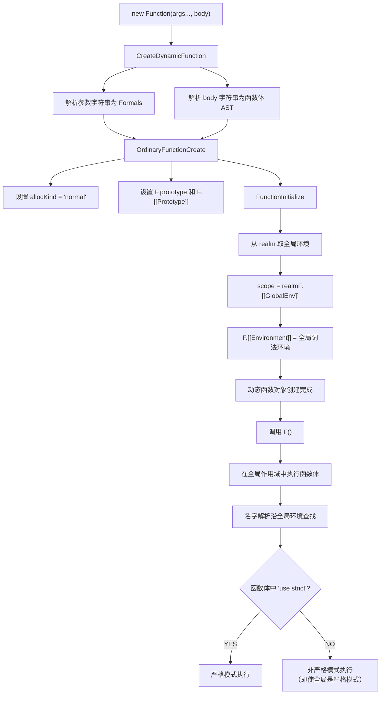

# 函数基础

函数是 `ECMAScript` 中最有意思的部分之一，主要是因为函数实际上是对象。每个函数都是 `Function` 类型的实例，而 `Function` 也有属性和方法，跟其他引用类型一样。因为函数是对象，所以函数名就是指向函数对象的指针，而且不一定与函数本身紧密绑定

## 创建函数方式

### 函数声明

函数通常以函数声明的方式定义，比如：

```javascript
function sum(num1, num2) {
  return num1 + num2
}
```

### 函数表达式

函数表达式与函数声明几乎是等价的。定义变量 `sum` 并将其初始化为一个函数，注意 `function` 关键字后面没有名称，因为不需要。这个函数可以通过变量 `sum` 来引用

```javascript
let sum = function (num1, num2) {
  return num1 + num2
}
```

`JavaScript` 引擎在任何代码执行之前，会先读取函数声明，并在执行上下文中生成函数定义。而函数表达式必须等到代码执行到它那一行，才会在执行上下文中生成函数定义

```javascript
// 没问题
console.log(sum(10, 10))
function sum(num1, num2) {
  return num1 + num2
}

// 会出错
console.log(sum(10, 10))
let sum = function (num1, num2) {
  return num1 + num2
}
```

### Function 构造函数

`Function` 构造函数接收任意多个字符串参数，最后一个参数始终会被当成函数体，而之前的参数都是新函数的参数：

```javascript
let sum = new Function("num1", "num2", "return num1 + num2") // 不推荐
```

## 函数名 name

函数名就是指向函数的指针，所以它们跟其他包含对象指针的变量具有相同的行为。这意味着一个函数可以有多个名称：

```javascript
function sum(num1, num2) {
  return num1 + num2
}

let anotherSum = sum
console.log(anotherSum(10, 10)) // 20

sum = null
console.log(anotherSum(10, 10)) // 20
```

`ECMAScript 6` 的所有函数对象都会暴露只读的 `name` 属性，其中包含关于函数的信息。多数情况下，这个属性中保存的就是一个函数标识符，或者说是一个字符串化的变量名。即使函数没有名称，也会如实显示成空字符串。如果它是使用 `Function` 构造函数创建的，则会标识成 "anonymous"：

```javascript
function foo() {}
let bar = function () {}
let baz = () => {}

console.log(foo.name) // foo
console.log(bar.name) // bar
console.log(baz.name) // baz
console.log((() => {}).name) //（空字符串）
console.log(new Function().name) // anonymous
```

如果函数是一个获取函数、设置函数，或者使用 `bind()` 实例化，那么标识符前面会加上一个前缀：

```javascript
function foo() {}
console.log(foo.bind(null).name) // bound foo

let dog = {
  years: 1,
  get age() { return this.years },
  set age(newAge) { this.years = newAge }
}

let propertyDescriptor = Object.getOwnPropertyDescriptor(dog, "age")
console.log(propertyDescriptor.get.name) // get age
console.log(propertyDescriptor.set.name) // set age
```

## 理解参数

`ECMAScript` 函数既不关心传入的参数个数，也不关心这些参数的数据类型。假如定义函数时要接收两个参数，但并不意味着调用时就传两个参数。你可以传一个、三个，甚至一个也不传，解释器都不会报错

### arguments

`arguments` 对象是类数组对象，可以使用中括号语法访问其中的元素，第二个参数是 `arguments[1]`。可以访问 `arguments.length` 属性确定传进来多少个参数

```javascript
function sayHi() {
  console.log("Hello " + arguments[0] + ", " + arguments[1])
}

sayHi("xiaoye", "18岁")
```

表明：ECMAScript 函数的参数只是为了方便才写出来的，并不是必须写出来的。与其他语言不同，在 `ECMAScript` 中的命名参数不会创建让之后，调用必须匹配的函数签名。这是因为根本不存在验证命名参数的机制。

也可以通过 `arguments.length` 属性检查传入的参数个数：

```javascript
function howManyArgs() {
  console.log(arguments.length)
}

howManyArgs("string", 45) // 2
howManyArgs() // 0
howManyArgs(12) // 1

function doAdd() {
  if (arguments.length === 1) {
    console.log(arguments[0] + 10)
  } else if (arguments.length === 2) {
    console.log(arguments[0] + arguments[1])
  }
}

doAdd(10) // 20
doAdd(30, 20) // 50
```

对于命名参数而言，如果调用函数时没有传这个参数，那么它的值就是 undefined。这就类似于定义变量而没有初始化。

#### arguments.callee

`arguments` 对象其实还有一个 `callee` 属性，是指向 `arguments` 对象所在函数的指针。来看下面这个经典的阶乘函数：

```javascript
function factorial(num) {
  if (num <= 1) {
    return 1
  } else {
    return num * arguments.callee(num - 1)
  }
}

// 调用函数
let trueFactorial = factorial
factorial = function () { return 0 }

console.log(trueFactorial(5)) // 120
console.log(factorial(5)) // 0
```

使用 `arguments.callee` 就可以让函数逻辑与函数名解耦。

### 没有重载

`ECMAScript` 函数没有签名，因为参数是由包含零个或多个值的数组表示的。没有函数签名，自然也就没有重载。如果在 `ECMAScript` 中定义了两个同名函数，则后定义的会覆盖先定义的。可以通过检查参数的类型和数量，然后分别执行不同的逻辑来模拟函数重载

```javascript
function addSomeNumber(num) { return num + 100 }
function addSomeNumber(num) { return num + 200 }

let result = addSomeNumber(100) // 300
```

### 默认参数值

#### 基本用法

在 `ECMAScript5.1` 及以前，不能直接为函数的参数指定默认值，只能采用变通的方法。写法的缺点在于，如果参数赋值了，但是对应的布尔值为 false，则该赋值不起作用：

```javascript
function log(x, y) {
  y = y || "World"
  console.log(x, y)
}

log("Hello") // Hello World
log("Hello", "") // Hello World（问题：空字符串被当作 false）
```

为了避免这个问题，通常需要先判断一下参数是否被赋值：

```javascript
function log(x, y) {
  if (typeof y === "undefined") { y = "World" }
  console.log(x, y)
}
```

`ECMAScript 6` 允许为函数的参数设置默认值，即直接写在参数定义的后面：

```javascript
function log(x, y = "World") {
  console.log(x, y)
}

log("Hello") // Hello World
log("Hello", "China") // Hello China
log("Hello", "") // Hello
```

除了简洁，`ES6` 的写法还有两个好处：首先，阅读代码的人，可以立刻意识到哪些参数是可以省略的，不用查看函数体或文档；其次，有利于将来的代码优化，即使未来的版本在对外接口中，彻底拿掉这个参数，也不会导致以前的代码无法运行

参数变量是默认声明的，所以不能用 `let` 或 `const` 再次声明，否则会报错。使用参数默认值时，函数不能有同名参数：

```javascript
// 不报错
function foo(x, x, y) { /* ... */ }

// 报错
function foo(x, x, y = 1) { /* ... */ }
// SyntaxError: Duplicate parameter name not allowed in this context
```

另外，一个容易忽略的地方是，参数默认值不是传值的，而是每次都重新计算默认值表达式的值。也就是说，参数默认值是惰性求值的：

```javascript
let x = 99
function foo(p = x + 1) { console.log(p) }

foo() // 100
x = 100
foo() // 101
```

#### 与解构赋值默认值结合使用

参数默认值可以与解构赋值的默认值，结合起来使用：

```javascript
function foo({ x, y = 5 } = {}) {
  console.log(x, y)
}

foo() // undefined 5
foo({ x: 1 }) // 1 5
foo({ x: 1, y: 2 }) // 1 2
```

下面是另一个解构赋值默认值的例子：

```javascript
function fetch(url, { body = "", method = "GET", headers = {} } = {}) {
  console.log(method)
}

fetch("http://example.com") // "GET"
```

作为练习，请问下面两种写法有什么差别？

```javascript
// 写法一
function m1({ x = 0, y = 0 } = {}) { return [x, y] }

// 写法二
function m2({ x, y } = { x: 0, y: 0 }) { return [x, y] }

// 函数没有参数的情况
m1() // [0, 0]
m2() // [0, 0]

// x 有值，y 无值的情况
m1({ x: 3 }) // [3, 0]
m2({ x: 3 }) // [3, undefined]

// x 和 y 都无值的情况
m1({}) // [0, 0]
m2({}) // [undefined, undefined]
```

#### 参数默认值的位置

通常情况下，定义了默认值的参数，应该是函数的尾参数。因为这样比较容易看出来，到底省略了哪些参数。如果非尾部的参数设置默认值，实际上这个参数是没法省略的：

```javascript
function f(x = 1, y) { return [x, y] }

f() // [1, undefined]
f(2) // [2, undefined]
f(undefined, 1) // [1, 1]
```

如果传入 `undefined`，将触发该参数等于默认值，`null` 则没有这个效果：

```javascript
function foo(x = 5, y = 6) { console.log(x, y) }
foo(undefined, null) // 5 null
```

#### 函数的 length 属性

指定了默认值以后，函数的 `length` 属性，将返回没有指定默认值的参数个数。也就是说，指定了默认值后，`length` 属性将失真：

```javascript
;(function (a) {}).length // 1
;(function (a = 5) {}).length // 0
;(function (a, b, c = 5) {}).length // 2
```

这是因为 `length` 属性的含义是，该函数预期传入的参数个数。某个参数指定默认值以后，预期传入的参数个数就不包括这个参数了。同理，rest 参数也不会计入 `length` 属性。

如果设置了默认值的参数不是尾参数，那么 `length` 属性也不再计入后面的参数了：

```javascript
;(function (a = 0, b, c) {}).length // 0
;(function (a, b = 1, c) {}).length // 1
```

在使用默认参数时，`arguments` 对象的值不反映参数的默认值，只反映传给函数的参数。当然跟 `ES5` 严格模式一样，修改命名参数也不会影响 `arguments` 对象，它始终以调用函数时传入的值为准：

```javascript
function makeKing(name = "Henry") {
  name = "Louis"
  return `King ${arguments[0]}`
}

console.log(makeKing()) // 'King undefined'
console.log(makeKing("Louis")) // 'King Louis'
```

默认参数值并不限于原始值或对象类型，也可以使用调用函数返回的值：

```javascript
let romanNumerals = ["I", "II", "III", "IV", "V", "VI"]
let ordinality = 0

function getNumerals() {
  return romanNumerals[ordinality++]
}

function makeKing(name = "Henry", numerals = getNumerals()) {
  return `King ${name} ${numerals}`
}

console.log(makeKing()) // 'King Henry I'
console.log(makeKing("Louis", "XVI")) // 'King Louis XVI'
console.log(makeKing()) // 'King Henry II'
```

#### 默认参数作用域

一旦设置了参数的默认值，函数进行声明初始化时，参数会形成一个单独的作用域（context）。等到初始化结束，这个作用域就会消失。这种语法行为，在不设置参数默认值时，是不会出现的：

```javascript
var x = 1
function f(x, y = x) { console.log(y) }
f(2) // 2
```

参数 `y` 的默认值等于变量 `x`。调用函数 `f` 时，参数形成一个单独的作用域。在这个作用域里面，默认值变量 `x` 指向第一个参数 `x`，而不是全局变量 `x`，所以输出是 2

下面代码中，函数 `f` 调用时，参数 `y = x` 形成一个单独的作用域。这个作用域里面，变量 `x` 本身没有定义，所以指向外层的全局变量 `x`。函数调用时，函数体内部的局部变量 `x` 影响不到默认值变量 `x`：

```javascript
let x = 1
function f(y = x) {
  let x = 2
  console.log(y)
}
f() // 1
```

如果参数的默认值是一个函数，该函数的作用域也遵守这个规则：

```javascript
let foo = "outer"
function bar(func = () => foo) {
  let foo = "inner"
  console.log(func())
}
bar() // outer
```

下面代码中，函数 `foo` 的参数形成一个单独作用域。这个作用域里面，首先声明了变量 `x`，然后声明了变量 `y`，`y` 的默认值是一个匿名函数。这个匿名函数内部的变量 `x`，指向同一个作用域的第一个参数 `x`。函数 `foo` 内部又声明了一个内部变量 `x`，该变量与第一个参数 `x` 由于不是同一个作用域，所以不是同一个变量：

```javascript
var x = 1
function foo(x, y = function () { x = 2 }) {
  var x = 3
  y()
  console.log(x)
}
foo() // 3
x // 1
```

如果将 `var x = 3` 的 `var` 去除，函数 `foo` 的内部变量 `x` 就指向第一个参数 `x`，与匿名函数内部的 `x` 是一致的，所以最后输出的就是 2，而外层的全局变量 `x` 依然不受影响：

```javascript
var x = 1
function foo(x, y = function () { x = 2 }) {
  x = 3
  y()
  console.log(x)
}
foo() // 2
x // 1
```

#### 应用

利用参数默认值，可以指定某一个参数不得省略，如果省略就抛出一个错误：

```javascript
function throwIfMissing() {
  throw new Error("Missing parameter")
}

function foo(mustBeProvided = throwIfMissing()) {
  return mustBeProvided
}

foo() // Error: Missing parameter
```

参数 `mustBeProvided` 的默认值等于 `throwIfMissing` 函数的运行结果（注意函数名 `throwIfMissing` 之后有一对圆括号），这表明参数的默认值不是在定义时执行，而是在运行时执行

### 参数扩展与收集

`ECMAScript 6` 新增扩展操作符，使用它可以非常简洁地操作和组合集合数据。扩展操作符最有用的场景就是函数定义中的参数列表，在这里它可以充分利用这门语言的弱类型及参数长度可变的特点。扩展操作符既可以用于调用函数时传参，也可以用于定义函数参数

#### 扩展参数

在给函数传参时，有时不需要传个数组，而是要分别传入数组的元素：

```javascript
let values = [1, 2, 3, 4]

function getSum() {
  let sum = 0
  for (let i = 0; i < arguments.length; ++i) { sum += arguments[i] }
  return sum
}

// 使用扩展操作符
console.log(getSum(...values)) // 10
console.log(getSum(-1, ...values)) // 9
console.log(getSum(...values, 5)) // 15
console.log(getSum(-1, ...values, 5)) // 14
console.log(getSum(...values, ...[5, 6, 7])) // 28
```

对函数中的 `arguments` 对象而言，它并不知道扩展操作符的存在，而是按照调用函数时传入的参数接收每一个值：

```javascript
function countArguments() { console.log(arguments.length) }

countArguments(-1, ...values) // 5
countArguments(...values, 5) // 5
countArguments(-1, ...values, 5) // 6
countArguments(...values, ...[5, 6, 7]) // 7
```

#### 收集参数（rest 参数）

`ES6` 引入 rest 参数（形式为 `...变量名`），用于获取函数的多余参数，这样就不需要使用 `arguments` 对象了。rest 参数搭配的变量是一个数组，该变量将多余的参数放入数组中

```javascript
function add(...values) {
  let sum = 0
  for (var val of values) { sum += val }
  return sum
}

add(2, 5, 3) // 10
```

下面是一个 rest 参数代替 `arguments` 变量的例子：

```javascript
// arguments 变量的写法
function sortNumbers() {
  return Array.prototype.slice.call(arguments).sort()
}
```

```javascript
// rest 参数的写法
const sortNumbers2 = (...numbers) => numbers.sort()
```

`arguments` 对象不是数组，而是一个类似数组的对象。所以为了使用数组的方法，必须使用 `Array.prototype.slice.call` 先将其转为数组。rest 参数就不存在这个问题，它就是一个真正的数组，数组特有的方法都可以使用

注意，rest 参数之后不能再有其他参数（即只能是最后一个参数），否则会报错。函数的 `length` 属性，不包括 rest 参数：

```javascript
;(function (a) {}).length // 1
;(function (...a) {}).length // 0
;(function (a, ...b) {}).length // 1
```

收集参数的前面如果还有命名参数，则只会收集其余的参数；如果没有则会得到空数组。因为收集参数的结果可变，所以只能把它作为最后一个参数：

```javascript
function ignoreFirst(firstValue, ...values) {
  console.log(values)
}

ignoreFirst() // []
ignoreFirst(1) // []
ignoreFirst(1, 2) // [2]
ignoreFirst(1, 2, 3) // [2, 3]
```

箭头函数虽然不支持 `arguments` 对象，但支持收集参数的定义方式，因此也可以实现与使用 `arguments` 一样的逻辑：

```javascript
let getSum = (...values) => values.reduce((x, y) => x + y, 0)
console.log(getSum(1, 2, 3)) // 6
```

另外使用收集参数并不影响 `arguments` 对象，它仍然反映调用时传给函数的参数：

```javascript
function getSum(...values) {
  console.log(arguments.length) // 3
  console.log(arguments) // [1, 2, 3]
  console.log(values) // [1, 2, 3]
}

console.log(getSum(1, 2, 3))
```

## 函数属性

`ECMAScript` 中的函数是对象，因此有属性和方法。每个函数都有两个属性：`length` 和 `prototype`

### length

`length` 属性保存函数定义的命名参数的个数：

```javascript
function sayName(name) { console.log(name) }
function sum(num1, num2) { return num1 + num2 }
function sayHi() { console.log("hi") }

console.log(sayName.length) // 1
console.log(sum.length) // 2
console.log(sayHi.length) // 0
```

### prototype

`prototype` 是保存引用类型所有实例方法的地方，这意味着 `toString()`、`valueOf()` 等方法实际上都保存在 `prototype` 上，进而由所有实例共享。`prototype` 属性是不可枚举的，因此使用 `for-in` 循环不会返回这个属性

## this

`this` 在标准函数和箭头函数中有不同的行为。在标准函数中，`this` 引用的是把函数当成方法调用的上下文对象，这时候通常称其为 `this` 值（在网页的全局上下文中调用函数时，`this` 指向 `window`）

```javascript
window.color = "red"
let o = { color: "blue" }

function sayColor() { console.log(this.color) }

sayColor() // 'red'
o.sayColor = sayColor
o.sayColor() // 'blue'
```

在事件回调或定时回调中调用某个函数时，`this` 值指向的并非想要的对象。此时将回调函数写成箭头函数就可以解决问题。这是因为箭头函数中的 `this` 会保留定义该函数时的上下文：

```javascript
function King() {
  this.royaltyName = "Henry"
  setTimeout(() => console.log(this.royaltyName), 1000)
}

function Queen() {
  this.royaltyName = "Elizabeth"
  setTimeout(function () { console.log(this.royaltyName) }, 1000)
}

new King() // Henry
new Queen() // undefined
```

## new.target

```javascript
function King() {
  if (!new.target) {
    throw 'King must be instantiated using "new"'
  }
  console.log('King instantiated using "new"')
}

new King() // King instantiated using "new"
King() // Error: King must be instantiated using "new"
```

使用 `new.target` 可以确保函数只能作为构造函数调用，或者根据调用方式执行不同的逻辑：

```javascript
function Person(name) {
  if (new.target !== undefined) {
    this.name = name
  } else {
    throw new Error("Person 必须使用 new 关键字调用")
  }
}
```

## apply、call、bind

`apply`、`call` 和 `bind` 都是 `Function.prototype` 上的方法，用于改变函数执行时的 `this` 指向，但它们在用法和效果上有显著区别

### apply

`apply` 方法接收两个参数：函数内 `this` 的值和一个参数数组。第二个参数可以是 `Array` 的实例，但也可以是 `arguments` 对象

- **立即调用函数**
- **参数以数组形式传递**
- **返回函数执行结果**
- **适合处理参数数量不确定的情况**

```javascript
function sum(num1, num2) { return num1 + num2 }

function callSum1(num1, num2) {
  return sum.apply(this, arguments) // 传入 arguments 对象
}

function callSum2(num1, num2) {
  return sum.apply(this, [num1, num2]) // 传入数组
}

console.log(callSum1(10, 10)) // 20
console.log(callSum2(10, 10)) // 20
```

### call

`call` 方法与 `apply` 的作用一样，只是传参的形式不同。第一个参数也是 `this` 值，而剩下的要传给被调用函数的参数则是逐个传递的

```javascript
function sum(num1, num2) { return num1 + num2 }

function callSum(num1, num2) {
  return sum.call(this, num1, num2)
}

console.log(callSum(10, 10)) // 20
```

`apply` 和 `call` 真正强大的地方并不是给函数传参，而是控制函数调用上下文即函数体内 `this` 值的能力：

```javascript
window.color = "red"
let o = { color: "blue" }

function sayColor() { console.log(this.color) }

sayColor() // red
sayColor.call(this) // red
sayColor.call(window) // red
sayColor.call(o) // blue
```

### bind

`bind` 方法会创建一个新的函数实例，其 `this` 值会被绑定到传给 `bind()` 的对象

- **不立即调用函数，而是返回一个新函数**
- **可以预先设置部分参数（柯里化）**
- **新函数的** `this` **永久绑定到指定的** `thisArg`
- **适合需要延迟执行或需要固定** `this` **的场景**

```javascript
window.color = "red"
var o = { color: "blue" }

function sayColor() { console.log(this.color) }

let objectSayColor = sayColor.bind(o)
objectSayColor() // blue
```

`bind` 还可以实现部分应用（Partial Application），即预先设置部分参数：

```javascript
function multiply(a, b, c) { return a * b * c }

const double = multiply.bind(null, 2)
console.log(double(3, 4)) // 24

const multiplyBy2And3 = multiply.bind(null, 2, 3)
console.log(multiplyBy2And3(4)) // 24
```

**方法的对比：**

| **方法** | **调用时机** | **参数形式** | **返回值**   | **典型使用场景**               |
| :------- | :----------- | :----------- | :----------- | :----------------------------- |
| call     | 立即调用     | 逐个参数     | 函数执行结果 | 明确知道参数个数时             |
| apply    | 立即调用     | 数组形式     | 函数执行结果 | 参数数量不确定或已经是数组时   |
| bind     | 返回新函数   | 逐个参数     | 新函数       | 需要延迟执行或固定 this 的场景 |

## 高阶函数

因为函数名在 `ECMAScript` 中就是变量，所以函数可以用在任何可以使用变量的地方。可以把函数作为参数传给另一个函数，而且还可以在一个函数中返回另一个函数

```javascript
function callSomeFunction(someFunction, someArgument) {
  return someFunction(someArgument)
}

function add10(num) { return num + 10 }

let result1 = callSomeFunction(add10, 10)
console.log(result1) // 20
```

函数中返回另一个函数也是可以的，而且非常有用：

```javascript
function createComparisonFunction(propertyName) {
  return function (object1, object2) {
    let value1 = object1[propertyName]
    let value2 = object2[propertyName]
    if (value1 < value2) return -1
    else if (value1 > value2) return 1
    else return 0
  }
}

let data = [
  { name: "Zachary", age: 28 },
  { name: "Nicholas", age: 29 }
]

data.sort(createComparisonFunction("name"))
console.log(data[0].name) // Nicholas
data.sort(createComparisonFunction("age"))
console.log(data[0].name) // Zachary
```

## 箭头函数

`ECMAScript 6` 新增使用箭头 `=>` 语法定义函数表达式的能力。很大程度上，箭头函数实例化的函数对象与正式的函数表达式创建的函数对象行为是相同的。任何可以使用函数表达式的地方，都可以使用箭头函数

### 箭头函数基本用法

```javascript
var f = (v) => v
// 等同于
var f = function (v) { return v }
```

如果箭头函数不需要参数或需要多个参数，就使用一个圆括号代表参数部分

```javascript
var f = () => 5
var sum = (num1, num2) => num1 + num2
```

如果箭头函数的代码块部分多于一条语句，就要使用大括号将它们括起来，并且使用 `return` 语句返回。由于大括号被解释为代码块，所以如果箭头函数直接返回一个对象，必须在对象外面加上括号，否则会报错：

```javascript
// 报错
let getTempItem = (id) => { id: id, name: "Temp" }
// SyntaxError: Unexpected token ':'
```

```javascript
// 不报错
let getTempItem = (id) => ({ id: id, name: "Temp" })
```

箭头函数可以与变量解构结合使用：

```javascript
const full = ({ first, last }) => first + " " + last
```

箭头函数的一个用处是简化回调函数

```javascript
// 普通函数写法
;[1, 2, 3].map(function (x) { return x * x })

// 箭头函数写法
;[1, 2, 3].map((x) => x * x)
```

### 使用注意点

箭头函数有几个使用注意点：

- 箭头函数没有自己的 `this` 对象
- 不可以当作构造函数，不可以对箭头函数使用 `new` 命令，否则会抛出一个错误
- 不可以使用 `arguments` 对象，该对象在函数体内不存在。如果要用，可以用 rest 参数代替
- 不可以使用 `yield` 命令，因此箭头函数不能用作 `Generator` 函数

```javascript
function foo() {
  setTimeout(() => { console.log("id:", this.id) }, 100)
}

var id = 21
foo.call({ id: 42 }) // id: 42
```

Timer 函数内部设置了两个定时器，分别使用箭头函数和普通函数。前者的 this 绑定定义时所在的作用域（即 Timer 函数），后者的 this 指向运行时所在的作用域（即全局对象）所以 3100 毫秒之后，timer.s1 被更新 3 次，而 timer.s2 一次都没更新

```javascript
function Timer() {
  this.s1 = 0
  this.s2 = 0
  setInterval(() => this.s1++, 1000)
  setInterval(function () { this.s2++ }, 1000)
}

var timer = new Timer()

setTimeout(() => console.log("s1: ", timer.s1), 3100) // s1: 3
setTimeout(() => console.log("s2: ", timer.s2), 3100) // s2: 0
```

箭头函数实际上可以让 `this` 指向固定化，绑定 `this` 使得它不再可变，这种特性很有利于封装回调函数。下面是一个例子，`DOM` 事件的回调函数封装在一个对象里面

- `init()` 方法中使用箭头函数，这导致这个箭头函数里面的 `this`，总是指向 `handler` 对象
- 如果回调函数是普通函数，那么运行 `this.doSomething()` 这一行会报错，因为此时 `this` 指向 `document` 对象
- 总之箭头函数根本没有自己的 this，导致内部的 `this` 就是外层代码块的 this。正是因为它没有 `this`，所以也就不能用作构造函数

```javascript
var handler = {
  id: "123456",
  init: function () {
    document.addEventListener("click", (event) => this.doSomething(event.type), false)
  },
  doSomething: function (type) {
    console.log("Handling " + type + " for " + this.id)
  }
}
```

下面是 Babel 转箭头函数产生的 ES5 代码，就能清楚地说明 `this` 的指向。箭头函数里面根本没有自己的 `this`，而是引用外层的 `this`

```javascript
// ES6
function foo() {
  setTimeout(() => { console.log("id:", this.id) }, 100)
}

// ES5
function foo() {
  var _this = this
  setTimeout(function () { console.log("id:", _this.id) }, 100)
}
```

除了 this，以下三个变量在箭头函数之中也是不存在的，指向外层函数的对应变量：`arguments`、`super`、`new.target`。下面代码中，箭头函数内部的变量 `arguments`，其实是函数 `foo` 的 `arguments` 变量

```javascript
function foo() {
  setTimeout(() => { console.log("args:", arguments) }, 100)
}

foo(2, 4, 6, 8) // args: [2, 4, 6, 8]
```

另外由于箭头函数没有自己的 this，所以当然也就不能用 `call()`、`apply()`、`bind()` 这些方法去改变 this 的指向

```javascript
;(function () {
  return [(() => this.x).bind({ x: "inner" })()]
}).call({ x: "outer" })
// ['outer']
```

#### 测试题

请问下面的代码之中，`this` 的指向有几个？

```javascript
function foo() {
  return () => {
    return () => {
      return () => { console.log("id:", this.id) }
    }
  }
}

var f = foo.call({ id: 1 })

var t1 = f.call({ id: 2 })()() // id: 1
var t2 = f().call({ id: 3 })() // id: 1
var t3 = f()().call({ id: 4 }) // id: 1
```

答案 `this` 的指向只有一个，就是函数 `foo` 的 `this`，这是因为所有的内层函数都是箭头函数，都没有自己的 `this`，它们的 `this` 其实都是最外层 `foo` 函数的 `this`。所以不管怎么嵌套，`t1`、`t2`、`t3` 都输出同样的结果。如果这个例子的所有内层函数都写成普通函数，那么每个函数的 this 都指向运行时所在的不同对象

### 不适用场合

由于箭头函数使得 this 从"动态"变成"静态"，下面两个场合不应该使用箭头函数

#### 定义对象的方法

第一个场合是定义对象的方法，且该方法内部包括 `this`

```javascript
const cat = {
  lives: 9,
  jumps: () => { this.lives-- }
}
```

上面代码中，`cat.jumps()` 方法是个箭头函数，这是错误的。调用 `cat.jumps()` 时，如果是普通函数，该方法内部的 `this` 指向 cat；如果写成上面那样的箭头函数，使得 `this` 指向全局对象，因此不会得到预期结果

```javascript
globalThis.s = 21

const obj = {
  s: 42,
  m: () => console.log(this.s)
}

obj.m() // 21
```

`obj.m()` 是使用箭头函数定义。`JavaScript` 引擎的处理方法是，先在全局空间生成这个箭头函数，然后赋值给 `obj.m`。这导致箭头函数内部的 `this` 指向全局对象，所以 `obj.m()` 输出的是全局空间的 21，而不是对象内部的 42。

#### 需要动态 this 时候

第二个场合是需要动态 `this` 的时候，也不应使用箭头函数

```javascript
var button = document.getElementById("press")
button.addEventListener("click", () => { this.classList.toggle("on") })
```

代码运行时，点击按钮会报错，因为 `button` 的监听函数是一个箭头函数，导致里面的 `this` 就是全局对象。如果改成普通函数，`this` 就会动态指向被点击的按钮对象

### 嵌套的箭头函数

箭头函数内部，还可以再使用箭头函数。下面是一个 ES5 语法的多重嵌套函数

```javascript
function insert(value) {
  return {
    into: function (array) {
      return {
        after: function (afterValue) {
          array.splice(array.indexOf(afterValue) + 1, 0, value)
          return array
        }
      }
    }
  }
}

insert(2).into([1, 3]).after(1) //[1, 2, 3]
```

上面这个函数，可以使用箭头函数改写

```javascript
let insert = (value) => ({
  into: (array) => ({
    after: (afterValue) => {
      array.splice(array.indexOf(afterValue) + 1, 0, value)
      return array
    }
  })
})

insert(2).into([1, 3]).after(1) //[1, 2, 3]
```

下面是一个部署管道机制（pipeline）的例子，即前一个函数的输出是后一个函数的输入

```javascript
const pipeline = (...funcs) => (val) => funcs.reduce((a, b) => b(a), val)

const plus1 = (a) => a + 1
const mult2 = (a) => a * 2
const addThenMult = pipeline(plus1, mult2)

addThenMult(5) // 12
```

## 立即执行函数（IIFE）

立即调用的匿名函数又被称作立即调用的函数表达式（IIFE，Immediately Invoked Function Expression）。它类似于函数声明，但由于被包含在括号中，所以会被解释为函数表达式。紧跟在第一组括号后面的第二组括号会立即调用前面的函数表达式

```javascript
;(function () {
  // 块级作用域
})()
```

使用 IIFE 可以模拟块级作用域，即在一个函数表达式内部声明变量，然后立即调用这个函数。这样位于函数体作用域的变量就像是在块级作用域中一样。`ECMAScript 5` 尚未支持块级作用域，使用 IIFE 模拟块级作用域是相当普遍的

```javascript
// IIFE
var count = 10
;(function () {
  for (var i = 0; i < count; i++) { console.log(i) }
})()
console.log(i) // 抛出错误
```

在 `ECMAScript 5.1` 及以前，为了防止变量定义外泄，IIFE 是个非常有效的方式。这样也不会导致闭包相关的内存问题，因为不存在对这个匿名函数的引用。为此，只要函数执行完毕，其作用域链就可以被销毁

`ECMAScript 6` 以后，IIFE 就没有那么必要了，因为块级作用域中的变量无须 IIFE 就可以实现同样的隔离。下面展示了两种不同的块级作用域形式：

```javascript
// 内嵌块级作用域
var count = 10
{
  let i
  for (i = 0; i < count; i++) { console.log(i) }
}
console.log(i) // 抛出错误

// 循环的块级作用域
for (let i = 0; i < count; i++) { console.log(i) }
console.log(i) // 抛出错误
```

以前，为了实现点击第几个 `<div>` 就显示相应的索引值，需要借助 IIFE 来执行一个函数表达式，传入每次循环的当前索引，从而"锁定"点击时应该显示的索引值：

```javascript
let divs = document.querySelectorAll("div")
for (var i = 0; i < divs.length; ++i) {
  divs[i].addEventListener("click", (function (frozenCounter) {
    return function () { console.log(frozenCounter) }
  })(i))
}
```

而使用 `ECMAScript` 块级作用域变量，就不用这么大动干戈了：

```javascript
let divs = document.querySelectorAll("div")
for (let i = 0; i < divs.length; ++i) {
  divs[i].addEventListener("click", function () { console.log(i) })
}
```

## 私有变量

严格来讲，JavaScript 中没有私有成员的概念；所有对象属性都是公有的。不过，倒是有一个私有变量的概念。任何在函数中定义的变量，都可以认为是私有变量，因为不能在函数的外部访问这些变量。私有变量包括函数的参数、局部变量和在函数内部定义的其他函数

```javascript
function add(num1, num2) {
  var sum = num1 + num2
  return sum
}
```

在这个函数内部，有 3 个私有变量：`num1`、`num2` 和 `sum`。在函数内部可以访问这几个变量，但在函数外部则不能访问它们。如果在这个函数内部创建一个闭包，那么闭包通过自己的作用域链也可以访问这些变量。而利用这一点，就可以创建用于访问私有变量的公有方法

特权方法（privileged method）是能够访问函数私有变量（及私有函数）的公有方法。在对象上有两种方式创建特权方法。第一种是在构造函数中实现，比如：

```javascript
function MyObject() {
  // 私有变量和私有函数
  let privateVariable = 10
  function privateFunction() { return false }

  // 特权方法
  this.publicMethod = function () {
    privateVariable++
    return privateFunction()
  }
}
```

能够在构造函数中定义特权方法，是因为特权方法作为闭包有权访问在构造函数中定义的所有变量和函数。对这个例子而言，变量 `privateVariable` 和函数 `privateFunction()` 只能通过特权方法 `publicMethod()` 来访问

利用私有和特权成员，可以隐藏那些不应该被直接修改的数据：

```javascript
function Person(name) {
  this.getName = function () { return name }
  this.setName = function (value) { name = value }
}

let person = new Person("Nicholas")
console.log(person.getName()) // 'Nicholas'
person.setName("Greg")
console.log(person.getName()) // 'Greg'
```

不过，在构造函数中定义特权方法也有一个缺点，那就是你必须使用构造函数模式来达到这个目的。构造函数模式的缺点是针对每个实例都会创建同样一组新方法，而使用静态私有变量来实现特权方法就可以避免这个问题

### 静态私有变量

特权方法也可以通过使用私有作用域定义私有变量和函数来实现。这个模式如下所示：

```javascript
;(function () {
  // 私有变量和私有函数
  let privateVariable = 10
  function privateFunction() { return false }

  // 构造函数
  MyObject = function () {}

  // 公有和特权方法
  MyObject.prototype.publicMethod = function () {
    privateVariable++
    return privateFunction()
  }
})()
```

这个模式创建了一个私有作用域，并在其中封装了一个构造函数及相应的方法。在私有作用域中，首先定义了私有变量和私有函数，然后又定义了构造函数及其公有方法

公有方法是在原型上定义的，这一点体现了典型的原型模式。需要注意的是，这个模式在定义构造函数时并没有使用函数声明，而是使用了函数表达式。函数声明只能创建局部函数，但那并不是我们想要的。出于同样的原因，我们也没有在声明 `MyObject` 时使用 `var` 关键字。记住：初始化未经声明的变量，总是会创建一个全局变量

因此，`MyObject` 就成了一个全局变量，能够在私有作用域之外被访问到。但也要知道，在严格模式下给未经声明的变量赋值会导致错误

这个模式与在构造函数中定义特权方法的主要区别，**就在于私有变量和函数是由实例共享的**。由于特权方法是在原型上定义的，因此所有实例都使用同一个函数。而这个特权方法，作为一个闭包，总是保存着对包含作用域的引用

```javascript
;(function () {
  let name = ""
  Person = function (value) { name = value }
  Person.prototype.getName = function () { return name }
  Person.prototype.setName = function (value) { name = value }
})()

let person1 = new Person("Nicholas")
console.log(person1.getName()) // 'Nicholas'
person1.setName("Matt")
console.log(person1.getName()) // 'Matt'

let person2 = new Person("Michael")
console.log(person1.getName()) // 'Michael'
console.log(person2.getName()) // 'Michael'
```

在这种模式下，变量 `name` 就变成了一个静态的、由所有实例共享的属性。也就是说，在一个实例上调用 `setName()` 会影响所有实例。而调用 `setName()` 或新建一个 `Person` 实例都会赋予 `name` 属性一个新值。结果就是所有实例都会返回相同的值

以这种方式创建静态私有变量会因为使用原型而增进代码复用，但每个实例都没有自己的私有变量。到底是使用实例变量，还是静态私有变量，最终还是要视你的具体需求而定

多查找作用域链中的一个层次，就会在一定程度上影响查找速度。而这正是使用闭包和私有变量的一个明显的不足之处

### 模块模式

前面的模式通过自定义类型创建了私有变量和特权方法。而下面要讨论的 Douglas Crockford 所说的模块模式，则在一个单例对象上实现了相同的隔离和封装。单例对象（singleton）就是只有一个实例的对象。按照惯例，JavaScript 是通过对象字面量来创建单例对象的，如下面的例子所示：

```javascript
let singleton = {
  name: value,
  method: function () { /*这里是方法的代码*/ }
}
```

模块模式通过为单例添加私有变量和特权方法能够使其得到增强，其语法形式如下：

```javascript
let singleton = (function () {
  // 私有变量和私有函数
  let privateVariable = 10
  function privateFunction() { return false }

  // 特权/公有方法和属性
  return {
    publicProperty: true,
    publicMethod() {
      privateVariable++
      return privateFunction()
    }
  }
})()
```

这个模块模式使用了一个返回对象的匿名函数。在这个匿名函数内部，首先定义了私有变量和函数

然后，将一个对象字面量作为函数的值返回。返回的对象字面量中只包含可以公开的属性和方法。由于这个对象是在匿名函数内部定义的，因此它的公有方法有权访问私有变量和函数。从本质上来讲，这个对象字面量定义的是单例的公共接口。这种模式在需要对单例进行某些初始化，同时又需要维护其私有变量时是非常有用的

```javascript
let application = (function () {
  // 私有变量和私有函数
  let components = new Array()

  // 初始化
  components.push(new BaseComponent())

  // 公共接口
  return {
    getComponentCount() { return components.length },
    registerComponent(component) {
      if (typeof component == "object") { components.push(component) }
    }
  }
})()
```

在 Web 应用程序中，经常需要使用一个单例来管理应用程序级的信息。这个简单的例子创建了一个用于管理组件的 `application` 对象。

而返回对象的 `getComponentCount()` 和 `registerComponent()` 方法，都是有权访问数组 `components` 的特权方法。前者只是返回已注册的组件数目，后者用于注册新组件

简言之，如果必须创建一个对象并以某些数据对其进行初始化，同时还要公开一些能够访问这些私有数据的方法，那么就可以使用模块模式。以这种模式创建的每个单例都是 `Object` 的实例，因为最终要通过一个对象字面量来表示它。事实上，这也没有什么；毕竟，单例通常都是作为全局对象存在的，我们不会将它传递给一个函数。因此，也就没有什么必要使用 `instanceof` 操作符来检查其对象类型了

### 增强的模块模式

另一个利用模块模式的做法是在返回对象之前先对其进行增强。这适合单例对象需要是某个特定类型的实例，但又必须给它添加额外属性或方法的场景

```javascript
let singleton = (function () {
  // 私有变量和私有函数
  let privateVariable = 10
  function privateFunction() { return false }
  // 创建对象
  let object = new CustomType()
  // 添加特权/公有属性和方法
  object.publicProperty = true
  object.publicMethod = function () {
    privateVariable++
    return privateFunction()
  }
  // 返回对象
  return object
})()
```

如果前一节的 `application` 对象必须是 `BaseComponent` 的实例，那么就可以使用下面的代码来创建它：

```javascript
let application = (function () {
  // 私有变量和私有函数
  let components = new Array()
  components.push(new BaseComponent())

  // 创建局部变量保存实例
  let app = new BaseComponent()
  // 公共接口
  app.getComponentCount = function () { return components.length }
  app.registerComponent = function (component) {
    if (typeof component == "object") { components.push(component) }
  }
  // 返回实例
  return app
})()
```

## 递归函数

递归函数是在一个函数通过名字调用自身的情况下构成的

```javascript
function factorial(num) {
  if (num <= 1) { return 1 }
  else { return num * factorial(num - 1) }
}
```

这是一个经典的递归阶乘函数。虽然这个函数表面看来没什么问题，但下面的代码却可能导致它出错

```javascript
var anotherFactorial = factorial
factorial = null
console.log(anotherFactorial(4)) // 出错！
```

在这种情况下，使用 `arguments.callee` 可以解决这个问题。`arguments.callee` 是一个指向正在执行的函数的指针，因此可以用它来实现对函数的递归调用

```javascript
function factorial(num) {
  if (num <= 1) { return 1 }
  else { return num * arguments.callee(num - 1) }
}
```

通过使用 `arguments.callee` 代替函数名，可以确保无论怎样调用函数都不会出问题。因此，在编写递归函数时，使用 `arguments.callee` 总比使用函数名更保险

但在严格模式下，不能通过脚本访问 `arguments.callee`，访问这个属性会导致错误。不过，可以使用命名函数表达式来达成相同的结果

```javascript
var factorial = function f(num) {
  if (num <= 1) { return 1 }
  else { return num * f(num - 1) }
}
```

以上代码创建了一个名为 `f()` 的命名函数表达式，然后将它赋值给变量 `factorial`。即便把函数赋值给了另一个变量，函数的名字 `f` 仍然有效，所以递归调用照样能正确完成。这种方式在严格模式和非严格模式下都行得通

## 闭包

匿名函数经常被人误认为是闭包（closure）。闭包指的是那些引用了另一个函数作用域中变量的函数，通常是在嵌套函数中实现的。比如，下面是之前展示的 `createComparisonFunction()` 函数：

```javascript
function createComparisonFunction(propertyName) {
  return function (object1, object2) {
    var value1 = object1[propertyName]
    var value2 = object2[propertyName]
    if (value1 < value2) { return -1 }
    else if (value1 > value2) { return 1 }
    else { return 0 }
  }
}
```

当 `createComparisonFunction()` 函数返回后，其执行环境的作用域链会被销毁，但它的活动对象仍然会留在内存中；直到匿名函数被销毁后，`createComparisonFunction()` 的活动对象才会被销毁，例如：

```javascript
// 创建函数
var compareNames = createComparisonFunction("name")

// 调用函数
var result = compareNames({ name: "Nicholas" }, { name: "Greg" })

// 解除对匿名函数的引用（以便释放内存）
compareNames = null
```

由于闭包会携带包含它的函数的作用域，因此会比其他函数占用更多的内存。过度使用闭包可能会导致内存占用过多，我们建议读者只在绝对必要时再考虑使用闭包。虽然像 V8 等优化后的 JavaScript 引擎会尝试回收被闭包占用的内存，但请大家还是要慎重使用闭包

### 关于 this 对象

在闭包中使用 `this` 对象也可能会导致一些问题。我们知道，`this` 对象是在运行时基于函数的执行环境绑定的：在全局函数中，`this` 等于 `window`，而当函数被作为某个对象的方法调用时，`this` 等于那个对象

不过，匿名函数的执行环境具有全局性，因此其 `this` 对象通常指向 `window`。但有时候由于编写闭包的方式不同，这一点可能不会那么明显

```javascript
var name = "The Window"
var object = {
  name: "My Object",
  getNameFunc: function () {
    return function () { return this.name }
  }
}
console.log(object.getNameFunc()()) // "The Window"（在非严格模式下）
```

为什么匿名函数没有取得其包含作用域（或外部作用域）的 `this` 对象呢？

前面曾经提到过，每个函数在被调用时都会自动取得两个特殊变量：`this` 和 `arguments`。内部函数在搜索这两个变量时，只会搜索到其活动对象为止，因此永远不可能直接访问外部函数中的这两个变量（因为在对象里面没有 this）。不过，把外部作用域中的 `this` 对象保存在一个闭包能够访问到的变量里，就可以让闭包访问该对象了

```javascript
var name = "The Window"
var object = {
  name: "My Object",
  getNameFunc: function () {
    var that = this
    return function () { return that.name }
  }
}
console.log(object.getNameFunc()()) // "My Object"
```

`this` 和 `arguments` 也存在同样的问题。如果想访问作用域中的 `arguments` 对象，必须将对该对象的引用保存到另一个闭包能够访问的变量中

在几种特殊情况下，`this` 的值可能会意外地改变。比如，下面的代码是修改前面例子的结果

```javascript
var name = "The Window"
var object = {
  name: "My Object",
  getName: function () { return this.name }
}

object.getName() // "My Object"
;(object.getName = object.getName)() // "The Window"，在非严格模式下
```

- 第一行代码跟平常一样调用了 `object.getName()`，返回的是 "My Object"，因为 `this.name` 就是 `object.name`
- 第二行代码在调用这个方法前先给它加上了括号。虽然加上括号之后，就好像只是在引用一个函数，但 `this` 的值得到了维持，因为 `object.getName` 和 `(object.getName)` 的定义是相同的
- 第三行代码先执行了一条赋值语句，然后再调用赋值后的结果。因为这个赋值表达式的值是函数本身，所以 `this` 的值不能得到维持，结果就返回了 "The Window"

## 函数柯里化

函数柯里化（Currying）是一种将多参数函数转换为一系列单参数函数的技术。柯里化后的函数可以逐步接收参数，每次接收一个参数并返回一个新函数，直到接收完所有参数。

```javascript
// 普通函数
function add(a, b, c) { return a + b + c }

// 手动柯里化
function addCurried(a) {
  return function (b) {
    return function (c) { return a + b + c }
  }
}

console.log(addCurried(1)(2)(3)) // 6

// 通用柯里化函数
function curry(fn) {
  return function curried(...args) {
    if (args.length >= fn.length) {
      return fn.apply(this, args)
    } else {
      return function (...args2) {
        return curried.apply(this, args.concat(args2))
      }
    }
  }
}

const curriedAdd = curry(add)
console.log(curriedAdd(1)(2)(3)) // 6
console.log(curriedAdd(1, 2)(3)) // 6
```

柯里化的实际应用：

```javascript
// 使用 bind 实现部分应用（部分柯里化）
function multiply(a, b, c) { return a * b * c }

const multiplyBy2 = multiply.bind(null, 2)
console.log(multiplyBy2(3, 4)) // 24
```

## 函数记忆化（Memoization）

函数记忆化是一种优化技术，通过缓存函数的结果来避免重复计算。对于计算成本高的函数，记忆化可以显著提高性能。

```javascript
function memoize(fn) {
  const cache = new Map()
  return function (...args) {
    const key = JSON.stringify(args)
    if (cache.has(key)) { return cache.get(key) }
    const result = fn.apply(this, args)
    cache.set(key, result)
    return result
  }
}

// 使用示例：斐波那契数列
const memoizedFibonacci = memoize(function (n) {
  if (n <= 1) return n
  return memoizedFibonacci(n - 1) + memoizedFibonacci(n - 2)
})

console.log(memoizedFibonacci(40)) // 几乎立即返回
```

## 函数装饰器

函数装饰器是一种设计模式，用于在不修改原函数的情况下增强函数的功能，比如添加日志、性能监控、参数验证等。

```javascript
// 简单的装饰器实现
function logDecorator(fn) {
  return function (...args) {
    console.log(`调用函数 ${fn.name}，参数：`, args)
    const result = fn.apply(this, args)
    console.log(`函数 ${fn.name} 返回：`, result)
    return result
  }
}

function add(a, b) { return a + b }
const loggedAdd = logDecorator(add)
console.log(loggedAdd(2, 3))
// 调用函数 add，参数： [2, 3]
// 函数 add 返回： 5
// 5

// 参数验证装饰器
function validateDecorator(fn, validator) {
  return function (...args) {
    if (!validator(...args)) { throw new Error("参数验证失败") }
    return fn.apply(this, args)
  }
}

function divide(a, b) { return a / b }
const safeDivide = validateDecorator(divide, (a, b) => b !== 0)
console.log(safeDivide(10, 2)) // 5
```

## 尾调用

尾调用（Tail Call）是函数式编程的一个重要概念，本身非常简单，一句话就能说清楚，**就是指某个函数的最后一步是调用另一个函数**。函数 `f` 的最后一步是调用函数 `g`，这就叫尾调用：

```javascript
function f(x) { return g(x) }
```

以下三种情况，都不属于尾调用：

```javascript
// 情况一
function f(x) { let y = g(x); return y }

// 情况二
function f(x) { return g(x) + 1 }

// 情况三
function f(x) { g(x) }
```

尾调用不一定出现在函数尾部，只要是最后一步操作即可。函数 `m` 和 `n` 都属于尾调用，因为它们都是函数 `f` 的最后一步操作：

```javascript
function f(x) {
  if (x > 0) { return m(x) }
  return n(x)
}
```

### 尾调用优化

尾调用之所以与其他调用不同，就在于它的特殊的调用位置

我们知道，函数调用会在内存形成一个"调用记录"，又称"调用帧"（call frame），保存调用位置和内部变量等信息。如果在函数 A 的内部调用函数 B，那么在 A 的调用帧上方，还会形成一个 B 的调用帧。等到 B 运行结束，将结果返回到 A，B 的调用帧才会消失。如果函数 B 内部还调用函数 C，那就还有一个 C 的调用帧，以此类推。所有的调用帧，就形成一个"调用栈"（call stack）

尾调用由于是函数的最后一步操作，所以不需要保留外层函数的调用帧，因为调用位置、内部变量等信息都不会再用到了，只要直接用内层函数的调用帧，取代外层函数的调用帧就可以了：

```javascript
function f() {
  let m = 1
  let n = 2
  return g(m + n)
}
f()

// 等同于
function f() { return g(3) }
f()

// 等同于
g(3)
```

这就叫做"尾调用优化"（Tail call optimization），即只保留内层函数的调用帧。如果所有函数都是尾调用，那么完全可以做到每次执行时，调用帧只有一项，这将大大节省内存。这就是"尾调用优化"的意义

注意，只有不再用到外层函数的内部变量，内层函数的调用帧才会取代外层函数的调用帧，否则就无法进行"尾调用优化"：

```javascript
function addOne(a) {
  var one = 1
  function inner(b) { return b + one }
  return inner(a)
}
```

上面的函数不会进行尾调用优化，因为内层函数 `inner` 用到了外层函数 `addOne` 的内部变量 `one`

## 尾递归

函数调用自身，称为递归。如果尾调用自身，就称为尾递归

递归非常耗费内存，因为需要同时保存成千上百个调用帧，很容易发生"栈溢出"错误（stack overflow）。但对于尾递归来说，由于只存在一个调用帧，所以永远不会发生"栈溢出"错误：

```javascript
function factorial(n) {
  if (n === 1) return 1
  return n * factorial(n - 1)
}

factorial(5) // 120
```

上面代码是一个阶乘函数，计算 n 的阶乘，最多需要保存 n 个调用记录，复杂度 O(n)

如果改写成尾递归，只保留一个调用记录，复杂度 O(1)：

```javascript
function factorial(n, total) {
  if (n === 1) return total
  return factorial(n - 1, n * total)
}

factorial(5, 1) // 120
```

还有一个比较著名的例子，就是计算 Fibonacci 数列，也能充分说明尾递归优化的重要性

非尾递归的 Fibonacci 数列实现如下：

```javascript
function Fibonacci(n) {
  if (n <= 1) { return 1 }
  return Fibonacci(n - 1) + Fibonacci(n - 2)
}

Fibonacci(10) // 89
Fibonacci(100) // 超时
```

尾递归优化过的 Fibonacci 数列实现如下：

```javascript
function Fibonacci2(n, ac1 = 1, ac2 = 1) {
  if (n <= 1) { return ac2 }
  return Fibonacci2(n - 1, ac2, ac1 + ac2)
}

Fibonacci2(100) // 573147844013817200000
Fibonacci2(1000) // 7.0330367711422765e+208
```

由此可见，"尾调用优化"对递归操作意义重大，所以一些函数式编程语言将其写入了语言规格。`ES6` 亦是如此，第一次明确规定，所有 ECMAScript 的实现，都必须部署"尾调用优化"。这就是说，`ES6` 中只要使用尾递归，就不会发生栈溢出（或者层层递归造成的超时），相对节省内存

> ⚠️ **注意（截至 2026-09）**：目前仅 Safari/JavaScriptCore 真正实现了尾调用优化，Chrome/Node.js 所用的 V8 引擎出于工程与调试体验的考虑尚未启用——在 V8 中使用尾递归同样会栈溢出。生产代码不应依赖尾调用优化，深递归请改用循环或蹦床函数。

### 递归函数的改写

尾递归的实现，往往需要改写递归函数，确保最后一步只调用自身。做到这一点的方法，就是把所有用到的内部变量改写成函数的参数

比如上面的例子，阶乘函数 `factorial` 需要用到一个中间变量 `total`，那就把这个中间变量改写成函数的参数。这样做的缺点就是不太直观，第一眼很难看出来，为什么计算 5 的阶乘，需要传入两个参数 5 和 1？

两个方法可以解决这个问题。方法一是在尾递归函数之外，再提供一个正常形式的函数：

```javascript
function tailFactorial(n, total) {
  if (n === 1) return total
  return tailFactorial(n - 1, n * total)
}

function factorial(n) { return tailFactorial(n, 1) }

factorial(5) // 120
```

函数式编程有一个概念，叫做柯里化（currying），意思是将多参数的函数转换成单参数的形式。这里也可以使用柯里化：

```javascript
function currying(fn, n) {
  return function (m) { return fn.call(this, m, n) }
}

function tailFactorial(n, total) {
  if (n === 1) return total
  return tailFactorial(n - 1, n * total)
}

const factorial = currying(tailFactorial, 1)
factorial(5) // 120
```

第二种方法就简单多了，就是采用 `ES6` 的函数默认值：

```javascript
function factorial(n, total = 1) {
  if (n === 1) return total
  return factorial(n - 1, n * total)
}

factorial(5) // 120
```

总结一下，递归本质上是一种循环操作。纯粹的函数式编程语言没有循环操作命令，所有的循环都用递归实现，这就是为什么尾递归对这些语言极其重要。对于其他支持"尾调用优化"的语言（比如 Lua，ES6），只需要知道循环可以用递归代替，而一旦使用递归，就最好使用尾递归

### 尾递归的严格模式

`ES6` 的尾调用优化只在严格模式下开启，正常模式是无效的

这是因为在正常模式下，函数内部有两个变量，可以跟踪函数的调用栈：

- `func.arguments`：返回调用时函数的参数
- `func.caller`：返回调用当前函数的那个函数

尾调用优化发生时，函数的调用栈会改写，因此上面两个变量就会失真。严格模式禁用这两个变量，所以尾调用模式仅在严格模式下生效：

```javascript
function restricted() {
  "use strict"
  restricted.caller // 报错
  restricted.arguments // 报错
}
restricted()
```

### 尾递归优化的实现

尾递归优化只在严格模式下生效，那么正常模式下，或者那些不支持该功能的环境中，有没有办法也使用尾递归优化呢？回答是可以的，就是自己实现尾递归优化

它的原理非常简单。尾递归之所以需要优化，原因是调用栈太多，造成溢出，那么只要减少调用栈，就不会溢出。怎么做可以减少调用栈呢？就是采用"循环"换掉"递归"

下面是一个正常的递归函数：

```javascript
function sum(x, y) {
  if (y > 0) { return sum(x + 1, y - 1) }
  else { return x }
}

sum(1, 100000)
// Uncaught RangeError: Maximum call stack size exceeded(…)
```

蹦床函数（trampoline）可以将递归执行转为循环执行：

```javascript
function trampoline(f) {
  while (f && f instanceof Function) { f = f() }
  return f
}
```

上面就是蹦床函数的一个实现，它接受一个函数 `f` 作为参数。只要 `f` 执行后返回一个函数，就继续执行。注意，这里是返回一个函数，然后执行该函数，而不是函数里面调用函数，这样就避免了递归执行，从而就消除了调用栈过大的问题

然后，要做的就是将原来的递归函数，改写为每一步返回另一个函数：

```javascript
function sum(x, y) {
  if (y > 0) { return sum.bind(null, x + 1, y - 1) }
  else { return x }
}
```

现在，使用蹦床函数执行 `sum`，就不会发生调用栈溢出：

```javascript
trampoline(sum(1, 100000)) // 100001
```

蹦床函数并不是真正的尾递归优化，下面的实现才是：

```javascript
function tco(f) {
  var value
  var active = false
  var accumulated = []

  return function accumulator() {
    accumulated.push(arguments)
    if (!active) {
      active = true
      while (accumulated.length) {
        value = f.apply(this, accumulated.shift())
      }
      active = false
      return value
    }
  }
}

var sum = tco(function (x, y) {
  if (y > 0) { return sum(x + 1, y - 1) }
  else { return x }
})

sum(1, 100000) // 100001
```

上面代码中，`tco` 函数是尾递归优化的实现，它的奥妙就在于状态变量 `active`。默认情况下，这个变量是不激活的。一旦进入尾递归优化的过程，这个变量就激活了。然后，每一轮递归 `sum` 返回的都是 `undefined`，所以就避免了递归执行；而 `accumulated` 数组存放每一轮 `sum` 执行的参数，总是有值的，这就保证了 `accumulator` 函数内部的 `while` 循环总是会执行。这样就很巧妙地将"递归"改成了"循环"，而后一轮的参数会取代前一轮的参数，保证了调用栈只有一层

## 严格模式

从 `ES5` 开始，函数内部可以设定为严格模式：

```javascript
function doSomething(a, b) {
  "use strict"
  // code
}
```

`ES2016` 做了一点修改，规定只要函数参数使用了默认值、解构赋值、或者扩展运算符，那么函数内部就不能显式设定为严格模式，否则会报错：

```javascript
// 报错
function doSomething(a, b = a) { "use strict" }
const doSomething = function ({ a, b }) { "use strict" }
const doSomething = (...a) => { "use strict" }
```

这样规定的原因是，函数内部的严格模式，同时适用于函数体和函数参数。但是，函数执行的时候，先执行函数参数，然后再执行函数体。这样就有一个不合理的地方，只有从函数体之中，才能知道参数是否应该以严格模式执行，但是参数却应该先于函数体执行：

```javascript
// 报错
function doSomething(value = 070) {
  "use strict"
  return value
}
```

上面代码中，参数 `value` 的默认值是八进制数 070，但是严格模式下不能用前缀 0 表示八进制，所以应该报错。但是实际上，JavaScript 引擎会先成功执行 `value = 070`，然后进入函数体内部，发现需要用严格模式执行，这时才会报错

虽然可以先解析函数体代码，再执行参数代码，但是这样无疑就增加了复杂性。因此，标准索性禁止了这种用法，只要参数使用了默认值、解构赋值、或者扩展运算符，就不能显式指定严格模式

两种方法可以规避这种限制

第一种是设定全局性的严格模式，这是合法的：

```javascript
"use strict"
function doSomething(a, b = a) { /* code */ }
```

第二种是把函数包在一个无参数的立即执行函数里面：

```javascript
const doSomething = (function () {
  "use strict"
  return function (value = 42) { return value }
})()
```

## 函数的其他扩展

### 函数参数的尾逗号

`ES2017` 允许函数的最后一个参数有尾逗号（trailing comma），此前，函数定义和调用时，都不允许最后一个参数后面出现逗号：

```javascript
function clownsEverywhere(param1, param2) { /* ... */ }
clownsEverywhere("foo", "bar")
```

如果像上面这样，将参数写成多行（即每个参数占据一行），以后修改代码的时候，想为函数 `clownsEverywhere` 添加第三个参数，或者调整参数的次序，就势必要在原来最后一个参数后面添加一个逗号。**这对于版本管理系统来说，就会显示添加逗号的那一行也发生了变动。这看上去有点冗余，因此新的语法允许定义和调用时，尾部直接有一个逗号**

这样的规定也使得，函数参数与数组和对象的尾逗号规则，保持一致了

### Function.prototype.toString()

`ES2019` 对函数实例的 `toString()` 方法做出了修改

`toString()` 方法返回函数代码本身，以前会省略注释和空格：

```javascript
function /* foo comment */ foo() {}
foo.toString() // function foo() {}
```

修改后的 `toString()` 方法，明确要求返回一模一样的原始代码：

```javascript
function /* foo comment */ foo() {}
foo.toString() // "function /* foo comment */ foo () {}"
```

### catch 命令的参数省略

JavaScript 语言的 `try...catch` 结构，以前明确要求 `catch` 命令后面必须跟参数，接受 `try` 代码块抛出的错误对象：

```javascript
try { /* ... */ } catch (err) { /* 处理错误 */ }
```

很多时候，`catch` 代码块可能用不到这个参数。但是，为了保证语法正确，还是必须写。`ES2019` 做出了改变，允许 `catch` 语句省略参数：

```javascript
try { /* ... */ } catch { /* ... */ }
```

## 函数作为对象方法

当函数作为对象的方法调用时，`this` 会指向该对象。这是 JavaScript 中 `this` 绑定的重要场景。

```javascript
const person = {
  name: "Alice",
  greet: function () { return `Hello, I'm ${this.name}` }
}

console.log(person.greet()) // "Hello, I'm Alice"

// 方法可以访问对象的其他属性
const calculator = {
  value: 0,
  add: function (num) { this.value += num; return this },
  multiply: function (num) { this.value *= num; return this },
  getValue: function () { return this.value }
}

calculator.add(5).multiply(2)
console.log(calculator.getValue()) // 10
```

方法提取后 `this` 会丢失：

```javascript
const person = {
  name: "Alice",
  greet: function () { return `Hello, I'm ${this.name}` }
}

const greet = person.greet
console.log(greet()) // "Hello, I'm undefined"（严格模式下会报错）

// 使用 bind 解决
const boundGreet = person.greet.bind(person)
console.log(boundGreet()) // "Hello, I'm Alice"
```

## 函数式编程相关概念

### 纯函数

纯函数是指对于相同的输入，总是返回相同的输出，并且不会产生副作用（不修改外部状态）的函数。

```javascript
// 纯函数
function add(a, b) { return a + b }

// 非纯函数（有副作用）
let counter = 0
function increment() { counter++; return counter }

// 非纯函数（依赖外部状态）
function getCurrentTime() { return new Date() }
```

### 函数组合

函数组合是将多个函数组合成一个新函数的技术，数据从右到左（或从左到右）流经这些函数。

```javascript
// 简单的函数组合
function compose(...fns) {
  return function (value) { return fns.reduceRight((acc, fn) => fn(acc), value) }
}

// 从左到右的组合
function pipe(...fns) {
  return function (value) { return fns.reduce((acc, fn) => fn(acc), value) }
}

const add1 = (x) => x + 1
const multiply2 = (x) => x * 2
const square = (x) => x * x

const composed = compose(square, multiply2, add1)
console.log(composed(3)) // ((3 + 1) * 2)² = 64
```

### using 声明（显式资源管理）

TC39 的显式资源管理（Explicit Resource Management）提案已进入 ECMAScript 标准（ES2027 年度草案；截至 2026-09 尚未进入任何已发布的年度版本），引入了 `using` 和 `await using` 声明，用于自动管理资源的生命周期。当变量离开作用域时，会自动调用资源的 `[Symbol.dispose]()` 或 `[Symbol.asyncDispose]()` 方法，确保资源被正确释放。Chrome 134+ 与 Node.js 24+ 已支持。

```javascript
// 自定义可释放资源
class FileHandler {
  constructor(path) { this.path = path; console.log(`打开文件: ${path}`) }
  write(data) { console.log(`写入数据: ${data}`) }
  [Symbol.dispose]() { console.log(`关闭文件: ${this.path}`) }
}

// 使用 using 声明自动管理资源
{
  using file = new FileHandler("data.txt")
  file.write("Hello, World!")
} // 离开作用域时自动调用 [Symbol.dispose]()
```

**异步资源管理：**

```javascript
class AsyncDatabaseConnection {
  constructor(url) { this.url = url }
  async connect() { console.log(`连接数据库: ${this.url}`) }
  async query(sql) { console.log(`执行查询: ${sql}`); return [{ id: 1, name: "test" }] }
  async [Symbol.asyncDispose]() { console.log(`关闭数据库连接: ${this.url}`) }
}

async function getData() {
  await using db = new AsyncDatabaseConnection("mysql://localhost/mydb")
  await db.connect()
  const result = await db.query("SELECT * FROM users")
  return result
} // 离开作用域时自动调用 [Symbol.asyncDispose]()
```

**与 try...finally 对比：**

| 特性 | `using` | `try...finally` |
|------|---------|-----------------|
| 代码简洁度 | ✅ 声明式，自动释放 | ❌ 需手动 finally |
| 异常安全 | ✅ 自动处理 SuppressedError | ❌ 需手动处理 |
| 异步支持 | ✅ `await using` | ❌ 需嵌套 async |
| 嵌套资源 | ✅ 多个 using 声明 | ❌ 深层嵌套 |

### 函数的动态创建（核心原理深度）

> **规范层级**：ECMAScript 规范 · CreateDynamicFunction（§20.2.1.1）
> **原理来源**：JavaScript 核心原理解析·第 22 讲 "new Function('x=100')()"

#### 规范语义

`new Function()` 是 JavaScript 中"动态函数创建"的核心机制。它从字符串参数构造函数对象，参数列表的前 n-1 个字符串作为形参（Formals），最后一个字符串作为函数体（Body）。与 `eval` 不同，`new Function` 创建的函数**总是以全局环境作为父级作用域**——ECMAScript 规范在 `FunctionInitialize` 阶段明确约定：`Let scope be realmF.[[GlobalEnv]]`，即函数的 `[[Environment]]` 内部槽指向全局词法环境。

`new Function('x = 100')()` 的执行语义是：创建一个形参为空、函数体为 `x = 100` 的函数对象，然后调用它。由于函数的 `[[Environment]]` 指向全局，`x = 100` 在全局作用域中执行——如果 `x` 未声明，则在非严格模式下创建全局变量 `x = 100`。

与间接调用 eval 一样，`new Function` 无法检测全局的严格模式状态（因为严格模式是可执行对象的属性，而非环境的属性），因此动态创建的函数在未显式声明 `'use strict'` 时，总是以非严格模式执行——即使全局处于严格模式中。

#### 执行机制



#### 核心洞察

- **new Function 统一了静态与动态函数创建**：静态声明的函数在代码运行前创建，而 `new Function` 在运行时从字符串创建函数。但一旦创建完成，两种函数在执行引擎眼中毫无差异——`[[Call]]` 和 `[[Construct]]` 内部方法不区分创建方式
- **与 eval 的关键区别在于作用域**：`eval` 的直接调用在当前作用域执行，`new Function` 总是在全局作用域创建。这使得 `new Function` 的行为更可预测、更安全——它无法访问调用者的局部变量
- **函数的"类化"实现概念大一统**：`Function()` 是所有函数的祖先类，"对象创建自函数；函数是对象"这一循环依赖在 ECMAScript 中通过原型链实现——`Function.prototype.__proto__ === Object.prototype`，而 `Object.__proto__ === Function.prototype`。这种概念完整性是 JavaScript 语言设计哲学的核心
- **new Function 可以用 new 调用**：动态创建的普通函数（allocKind = 'normal'）可以作为构造器使用 `new` 运算符调用，但生成器函数、异步函数等（allocKind = 'generator'/'async' 等）不能
- **四种动态函数构造器**：除了 `Function`，还有 `GeneratorFunction`、`AsyncGeneratorFunction` 和 `AsyncFunction`，但只有 `Function` 是显式声明的，其他三种需要通过 `constructor` 属性获取

#### 代码实证

```javascript
// === 1. new Function vs eval 的作用域对比 ===
var globalVar = 'global'

function outer() {
  var localVar = 'local'

  // eval：当前作用域
  eval('console.log(localVar)')          // 'local'（能访问局部变量）

  // new Function：全局作用域
  var fn = new Function('console.log(localVar)')
  fn() // ReferenceError: localVar is not defined（不能访问局部变量）

  var fn2 = new Function('console.log(globalVar)')
  fn2()  // 'global'（能访问全局变量）
}

outer()

// === 2. new Function 从配置动态创建函数 ===
const configs = [
  { params: ['price', 'tax'], body: 'return price * (1 + tax)' },
  { params: ['price', 'discount'], body: 'return price * (1 - discount)' },
  { params: ['a', 'b'], body: 'return Math.sqrt(a * a + b * b)' }
]

const calculators = configs.map(({ params, body }) =>
  new Function(...params, body)
)

console.log(calculators[0](100,%200.08))    // 108（含税价）
console.log(calculators[1](100,%200.2))     // 80（折扣价）
console.log(calculators[2](3,%204))         // 5（勾股定理）

// === 3. new Function 与严格模式 ===
// 即使全局是严格模式，new Function 默认不继承
// new Function('x = 100')()  → 成功！创建全局变量 x

// 在函数体中显式声明严格模式
var strictFn = new Function('"use strict"; x = 100')
// strictFn()  → ReferenceError（函数体内部是严格模式）

// === 4. 四种动态函数构造器 ===
const GeneratorFunction = (function* () {}).constructor
const AsyncGeneratorFunction = (async function* () {}).constructor
const AsyncFunction = (async x => x).constructor

// 动态创建生成器函数
var genFn = new GeneratorFunction('start', 'yield start; yield start + 1')
var gen = genFn(10)
console.log(gen.next().value)  // 10
console.log(gen.next().value)  // 11

// 动态创建异步函数
var asyncFn = new AsyncFunction('x', 'return await Promise.resolve(x * 2)')
asyncFn(5).then(console.log)  // 10

// === 5. new Function 的子类化 ===
class MyFunction extends Function {
  constructor(...args) {
    super(...args)
    this.createdAt = Date.now()
  }
  callWithLog(...args) {
    console.log(`Calling with args: ${args}`)
    return this(...args)
  }
}

var myFn = new MyFunction('a, b', 'return a + b')
console.log(myFn.callWithLog(3, 4))  // Calling with args: 3,4 → 7
console.log(myFn.createdAt)            // 时间戳
```

#### 与实战的关联

- **模板引擎中的动态函数**：许多模板引擎（如 Vue 的模板编译器）在内部将模板编译为渲染函数，其原理与 `new Function` 一致——从字符串构造可执行函数。但生产环境中应使用预编译而非运行时 `new Function`，以提升性能和安全性
- **JSON 解析的安全替代**：在某些需要解析非标准 JSON（如包含函数表达式的配置）的场景中，`new Function` 比 `eval` 更安全，因为它不访问调用者作用域
- **何时避免 new Function**：CSP（Content Security Policy）可能禁止 `new Function`；动态创建的函数难以调试（函数名为 `"anonymous"`，调用栈不友好）；字符串拼接的函数体容易引入注入漏洞
- **并发安全性**：与间接调用 eval 一样，`new Function` 创建的函数不依赖当前上下文，因此可以安全地跨线程/Worker 使用——这是 ECMAScript 选择"牺牲一致性，换取性能"的设计考量
