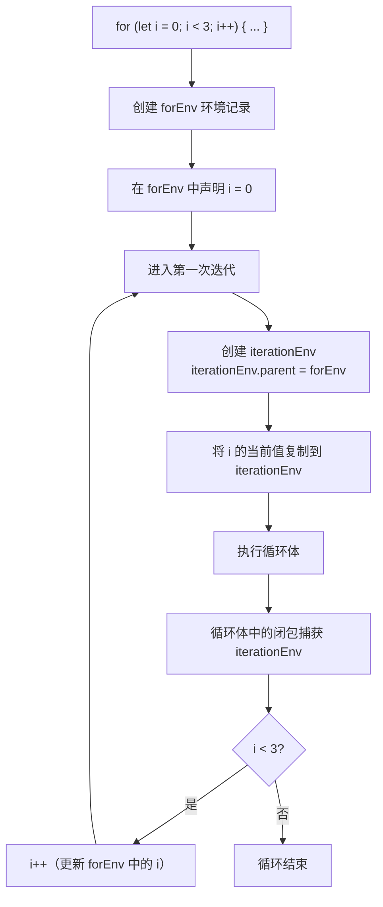

# 作用域

## 概述

作用域（Scope）是程序源代码中定义变量的区域，决定了变量的可见性和生命周期。理解作用域对于编写可维护、无 bug 的代码至关重要。

### 核心概念

```
┌─────────────────────────────────────────────────────┐
│                    全局作用域                         │
│  ┌───────────────────────────────────────────────┐  │
│  │              函数作用域 foo                     │  │
│  │  ┌─────────────────────────────────────────┐  │  │
│  │  │          块级作用域                      │  │  │
│  │  │   let x = 1                             │  │  │
│  │  └─────────────────────────────────────────┘  │  │
│  └───────────────────────────────────────────────┘  │
└─────────────────────────────────────────────────────┘

作用域层级：全局 > 函数 > 块级
变量查找：由内向外逐层查找
```

## 作用域类型

### 1. 全局作用域

在代码的任何地方都能访问到的变量拥有全局作用域：

```javascript
// 全局变量
var globalVar = 'global'
let globalLet = 'global let'
const GLOBAL_CONST = 'global const'

function foo() {
  console.log(globalVar)      // 'global'
  console.log(globalLet)      // 'global let'
  console.log(GLOBAL_CONST)   // 'global const'
}

// 浏览器环境中，var 声明的全局变量会成为 window 的属性
console.log(window.globalVar)  // 'global'
console.log(window.globalLet)  // undefined
```

### 2. 函数作用域

函数内部定义的变量只能在函数内部访问：

```javascript
function foo() {
  var functionVar = 'function scope'
  console.log(functionVar)  // 'function scope'
}

foo()
console.log(functionVar)  // ReferenceError: functionVar is not defined
```

### 3. 块级作用域

ES6 引入 `let` 和 `const`，支持块级作用域：

```javascript
if (true) {
  var varVariable = 'var'
  let letVariable = 'let'
  const constVariable = 'const'
}

console.log(varVariable)    // 'var'
console.log(letVariable)    // ReferenceError
console.log(constVariable)  // ReferenceError
```

## 词法作用域

JavaScript 采用词法作用域（Lexical Scoping），也叫静态作用域。函数的作用域在函数定义时就确定了，而不是在调用时确定。

```javascript
var value = 1

function foo() {
  console.log(value)
}

function bar() {
  var value = 2
  foo()  // 输出 1，而不是 2
}

bar()

// foo 函数在定义时就确定了它的作用域链
// foo 函数的作用域链：[foo.AO, global.VO]
// 所以 foo 函数访问的 value 是全局变量，而不是 bar 函数中的局部变量
```

### 词法作用域 vs 动态作用域

```javascript
// 词法作用域（JavaScript）
var x = 10

function foo() { console.log(x) }

function bar() {
  var x = 20
  foo()  // 10
}

bar()

// 动态作用域（假设的语言）
// bar() 调用 foo() 时，foo() 会输出 20
// 因为 foo() 在 bar() 中被调用，所以使用 bar() 的作用域
```

## 作用域链

当访问一个变量时，JavaScript 引擎会沿着作用域链从当前作用域开始查找，直到找到变量或到达全局作用域。

### 作用域链可视化

```
变量查找过程：

inner 函数执行上下文
├─ inner.AO (Activation Object)
│  └─ inner = 'inner'
├─ outer.AO
│  └─ outer = 'outer'
└─ global.VO (Variable Object)
   └─ global = 'global'

查找顺序：inner.AO → outer.AO → global.VO
找到即停止，未找到则继续向上查找
```

```javascript
var global = 'global'

function outer() {
  var outer = 'outer'
  
  function inner() {
    var inner = 'inner'
    console.log(inner)   // 'inner' - 当前作用域找到
    console.log(outer)   // 'outer' - 外部作用域找到
    console.log(global)  // 'global' - 全局作用域找到
  }
  
  inner()
}

outer()
```

## 变量声明与作用域

### var 声明

**特性：**
- 函数作用域
- 变量提升（Hoisting）
- 可重复声明
- 全局变量会成为 window 属性（浏览器环境）

**变量提升机制：**

```javascript
// 编译阶段：变量声明提升
// 执行阶段：变量赋值

// ===== 原代码 =====
console.log(a)  // undefined
var a = 1

// ===== 编译后的等价代码 =====
var a            // 声明提升到作用域顶部
console.log(a)   // undefined
a = 1            // 赋值留在原位置
```

**函数作用域示例：**

```javascript
function foo() {
  console.log(b)  // undefined
  if (true) {
    var b = 2  // 函数作用域，没有块级作用域
  }
  console.log(b)  // 2
}

foo()
```

### let 声明

**特性：**
- 块级作用域
- 暂时性死区（Temporal Dead Zone, TDZ）
- 不可重复声明
- 不成为 window 属性

**暂时性死区详解：**

```javascript
// TDZ 示例
{
  // 变量 b 的 TDZ 开始
  console.log(b)  // ReferenceError
  
  // TDZ 结束，b 初始化
  let b = 2
  console.log(b)  // 2
}

// TDZ 形成原因：
// 1. let/const 声明在编译阶段也会提升
// 2. 但提升后不会初始化为 undefined
// 3. 在声明语句执行前访问会报错
```

**TDZ 与 typeof：**

```javascript
// 特殊情况：typeof 也无法安全检测
var x
console.log(typeof x)  // undefined（var 声明，已提升）
console.log(typeof y)  // ReferenceError（let 声明，TDZ）
let y = 1
```

**块级作用域示例：**

```javascript
// 块级作用域
if (true) { let a = 1 }
console.log(a)  // ReferenceError

// 不可重复声明
let c = 3
let c = 4  // SyntaxError: Identifier 'c' has already been declared

// 同一作用域内不能重复
let d = 1
var d = 2  // SyntaxError: Identifier 'd' has already been declared
```

### const 声明

**特性：**
- 块级作用域
- 暂时性死区
- 不可重复声明
- 声明时必须初始化
- 不能重新赋值（但对象属性可修改）

**常量的本质：**

```javascript
// const 保证的是变量指向的内存地址不变
// 对于简单类型，值不可变
const PI = 3.14159
PI = 3.14  // TypeError: Assignment to constant variable

// 对于引用类型，引用不可变，但内容可变
const obj = { a: 1 }
obj.a = 2  // 可以，修改对象的属性
obj.b = 3  // 可以，添加新属性
obj = {}   // TypeError，重新赋值对象

// 数组同理
const arr = [1, 2, 3]
arr.push(4)  // 可以
arr = []     // TypeError
```

**冻结对象：**

```javascript
// 彻底冻结对象
const obj = Object.freeze({ a: 1 })
obj.a = 2  // 静默失败（严格模式报错）

// 深度冻结
function deepFreeze(obj) {
  Object.keys(obj).forEach(key => {
    if (typeof obj[key] === 'object') { deepFreeze(obj[key]) }
  })
  return Object.freeze(obj)
}
```

## 块级作用域

### 块级作用域的场景

```javascript
// for 循环
for (let i = 0; i < 3; i++) {
  setTimeout(() => console.log(i), 100)
}
// 0 1 2

for (var i = 0; i < 3; i++) {
  setTimeout(() => console.log(i), 100)
}
// 3 3 3

// if 语句
if (true) { let a = 1; const b = 2 }
console.log(a, b)  // ReferenceError

// try-catch 语句
try { /* ... */ } catch (error) {
  // error 只在 catch 块中有效
}
console.log(error)  // ReferenceError
```

### 块级作用域的实现原理

```javascript
// ES6 之前，使用 IIFE 模拟块级作用域
;(function() {
  var privateVar = 'private'
  console.log(privateVar)
})()
console.log(privateVar)  // ReferenceError

// ES6 之后，直接使用块级作用域
{
  let privateVar = 'private'
  const PRIVATE_CONST = 'const'
  console.log(privateVar)
}
console.log(privateVar)  // ReferenceError
```

## 作用域与执行上下文

作用域和执行上下文是两个不同的概念，但紧密相关：

### 核心区别

| 特性 | 作用域 | 执行上下文 |
|------|--------|------------|
| 创建时机 | 代码编写时（静态） | 代码执行时（动态） |
| 作用 | 变量可见性范围 | 代码执行环境 |
| 生命周期 | 程序运行期间 | 函数调用期间 |
| 包含内容 | 变量、函数声明 | 变量对象、作用域链、this |
| 数量 | 固定的作用域链 | 动态的执行栈 |

### 执行上下文栈

```
执行上下文栈的变化过程：

1. 全局代码执行
   ┌─────────────────────┐
   │  全局执行上下文       │
   └─────────────────────┘

2. 调用 outer()
   ┌─────────────────────┐
   │  outer 执行上下文     │ ← 栈顶（正在执行）
   ├─────────────────────┤
   │  全局执行上下文       │
   └─────────────────────┘

3. outer() 调用 inner()
   ┌─────────────────────┐
   │  inner 执行上下文     │ ← 栈顶
   ├─────────────────────┤
   │  outer 执行上下文     │
   ├─────────────────────┤
   │  全局执行上下文       │
   └─────────────────────┘

4. inner() 执行完毕，出栈
   ┌─────────────────────┐
   │  outer 执行上下文     │ ← 栈顶
   ├─────────────────────┤
   │  全局执行上下文       │
   └─────────────────────┘
```

### 执行上下文创建过程

```javascript
function foo(a, b) {
  var c = 10
  function d() {}
  var e = function _e() {}
  ;(function x() {})
}

foo(10)

// 创建 foo 执行上下文时：
// 1. 建立作用域链：[foo.AO, global.VO]
// 2. 创建变量对象（AO）
//    - arguments: { 0: 10, length: 1 }
//    - a: 10
//    - b: undefined
//    - c: undefined
//    - d: function d() {}  // 函数声明提升
//    - e: undefined        // 函数表达式不会提升
// 3. 确定 this：global 对象（非严格模式）
```

## 作用域的应用

### 1. 避免全局污染

```javascript
// ❌ 不推荐
var a = 1; var b = 2; var c = 3

// ✅ 推荐：使用块级作用域
{
  let a = 1; let b = 2; let c = 3
}
```

### 2. 实现私有变量

```javascript
function Counter() {
  let count = 0  // 私有变量
  
  this.increment = function () { count++ }
  this.getCount = function () { return count }
}

const counter = new Counter()
counter.increment()
console.log(counter.getCount())  // 1
console.log(counter.count)  // undefined
```

### 3. 解决循环变量问题

```javascript
// ❌ var 声明
for (var i = 0; i < 3; i++) {
  setTimeout(() => console.log(i), 100)
}
// 3 3 3

// ✅ let 声明
for (let i = 0; i < 3; i++) {
  setTimeout(() => console.log(i), 100)
}
// 0 1 2

// ✅ IIFE
for (var i = 0; i < 3; i++) {
  ;(function (j) {
    setTimeout(() => console.log(j), 100)
  })(i)
}
// 0 1 2
```

## 欺骗词法作用域

### eval

```javascript
function foo(str, a) {
  eval(str)  // 欺骗词法作用域
  console.log(a, b)
}

var b = 2
foo('var b = 3', 1)  // 1 3

// eval 可以在运行时修改作用域
// 不推荐使用，会影响性能和安全性
```

### with

```javascript
const obj = { a: 1, b: 2 }

with (obj) {
  console.log(a, b)  // 1 2
  a = 3
}

console.log(obj.a)  // 3

// with 可以创建新的作用域
// 不推荐使用，已废弃
```

## 常见问题解答

### 1. 为什么 for 循环中 var 和 let 的表现不同？

```javascript
// ❌ var 声明 - 输出 3, 3, 3
for (var i = 0; i < 3; i++) {
  setTimeout(() => console.log(i), 100)
}

// ✅ let 声明 - 输出 0, 1, 2
for (let i = 0; i < 3; i++) {
  setTimeout(() => console.log(i), 100)
}
```

**解析：**
- `var` 声明的 `i` 是函数作用域，整个循环共享同一个 `i`
- 循环结束时 `i` 为 3，三个 setTimeout 都引用同一个 `i`
- `let` 声明的 `i` 是块级作用域，每次循环都有独立的 `i`
- 每次循环都会创建一个新的块级作用域，保存当时的 `i` 值

### 2. 如何理解"变量提升"和"暂时性死区"？

```javascript
// var 的变量提升
console.log(a)  // undefined（已声明，未赋值）
var a = 1

// let 的暂时性死区
console.log(b)  // ReferenceError（在 TDZ 中）
let b = 2
```

**区别：**
- `var` 声明会提升并初始化为 `undefined`
- `let/const` 声明会提升但不会初始化，形成 TDZ
- TDZ 从作用域开始到声明语句执行前的区域

## 性能优化建议

### 1. 减少作用域链查找

```javascript
// ❌ 多次查找全局变量
function processItems(items) {
  const result = []
  for (let i = 0; i < items.length; i++) {
    result.push(items[i] * Math.PI * Math.E)  // 每次都查找 Math
  }
  return result
}

// ✅ 局部缓存
function processItemsOptimized(items) {
  const PI = Math.PI  // 缓存到局部变量
  const E = Math.E
  const result = []
  for (let i = 0; i < items.length; i++) {
    result.push(items[i] * PI * E)
  }
  return result
}
```

### 2. 避免全局变量污染

```javascript
// ❌ 全局变量污染
var config = {}; var utils = {}; var data = []

// ✅ 使用命名空间或模块化
const App = { config: {}, utils: {}, data: [] }
```

### 3. 合理使用块级作用域

```javascript
// ❌ 不必要的函数作用域
function process() {
  var temp = getValue()
  // ... 大量代码
  // temp 一直存在
}

// ✅ 使用块级作用域及时释放
function processOptimized() {
  {
    let temp = getValue()
    // 使用 temp
  }
  // temp 已释放
}
```

### 4. 避免闭包内存泄漏

```javascript
// ❌ 闭包持有大对象引用
function createHandler() {
  const largeData = new Array(1000000).fill('data')
  return function() { console.log(largeData.length) }
}

// ✅ 及时释放
function createHandlerOptimized() {
  let largeData = new Array(1000000).fill('data')
  const length = largeData.length
  largeData = null  // 手动释放
  return function() { console.log(length) }
}
```

## 最佳实践总结

### 变量声明优先级

1. **优先使用 `const`** - 不可变值，最安全
2. **其次使用 `let`** - 需要重新赋值时
3. **避免使用 `var`** - 函数作用域容易造成混淆

```javascript
// ✅ 推荐
const API_URL = 'https://api.example.com'
let isLoading = false

// ❌ 避免
var API_URL = 'https://api.example.com'
var isLoading = false
```

### 作用域设计原则

1. **最小暴露原则** - 变量应在最小必要的作用域内声明
2. **就近声明原则** - 变量应在首次使用前声明
3. **避免嵌套过深** - 作用域嵌套不宜超过 3 层

```javascript
// ✅ 遵循最小暴露原则
function calculateTotal(items) {
  const tax = 0.1
  const discount = 0.05
  
  return items.reduce((total, item) => {
    return total + item.price * (1 + tax) * (1 - discount)
  }, 0)
}
```

### 块级作用域的引擎实现（核心原理深度）

> **规范层级**：ECMAScript 规范 · [14.2.2 Block] / [14.7.4 The for Statement]
> **原理来源**：JavaScript 核心原理解析·第 05 讲

#### 规范语义

大多数 JavaScript 语句**没有自己的块级作用域**。只有以下 4 种构造会创建块级作用域：

| 构造 | 创建的作用域 | 说明 |
|------|-------------|------|
| `try/catch/finally` | catch 块作用域 | catch 的参数只在 catch 块内有效 |
| `with` | with 块作用域 | 已废弃，不推荐使用 |
| `Block { }` | 块作用域 | 仅当块内包含 let/const/function 声明时创建 |
| `for (let/const ...)` | 循环作用域 | **唯一创建块级作用域的循环语句** |

`var` 声明完全绕过块级作用域，直接提升到函数作用域或全局作用域。`for (var i = 0; ...)` 中的 `i` 在循环结束后仍然可访问。

#### 执行机制



**for-let 的双层作用域结构**：

```
forEnv（for 语句作用域）
├── i（循环变量）
└── iterationEnv（每次迭代的作用域）
    ├── i（当前迭代的 i 值副本）
    └── 循环体内的 let/const 声明
```

每次迭代都会创建一个新的 `iterationEnv`，这就是为什么 `for (let i...)` 配合 `setTimeout` 能正确工作的原因。

#### 核心洞察

**1. for-let 等价于函数递归**

`for (let i = 0; i < 3; i++) { ... }` 在语义上等价于：

```javascript
function loop(i) {
  if (i < 3) {
    // 循环体
    loop(i + 1)
  }
}
loop(0)
```

每次递归调用都会创建新的执行上下文和词法环境，这与 for-let 每次迭代创建新的 `iterationEnv` 完全一致。因此，**for-let 并不比函数递归节省开销**——它们有相同的闭包创建成本。

**2. "需要存储计算变量"是命令式与函数式的分界线**

- **命令式语言**（如 JavaScript 的 for 循环）：需要显式的循环变量 `i` 来追踪状态
- **函数式语言**（如 Haskell）：通过递归参数传递状态，无需可变的循环变量

for-let 的双层作用域结构正是为了在命令式语法中实现函数式的闭包语义。

**3. 单语句上下文不能有词法声明**

以下代码会抛出语法错误：

```javascript
// SyntaxError: Lexical declaration cannot appear in a single-statement context
if (true) let x = 1

// 正确：使用块包裹
if (true) { let x = 1 }
```

这是因为单语句上下文没有明确的块边界，词法声明的作用域范围不清晰。

**4. switch 的单作用域行为**

`switch` 语句只有一个块作用域，所有 case 共享：

```javascript
switch (x) {
  case 1:
    let a = 1
    break
  case 2:
    let a = 2  // SyntaxError: Identifier 'a' has already been declared
    break
}
```

#### 代码实证

```javascript
// ===== 1. for-var vs for-let 在 setTimeout 中的表现 =====
for (var i = 0; i < 3; i++) {
  setTimeout(() => console.log('var:', i), 100)
}
// 输出：var: 3, var: 3, var: 3

for (let j = 0; j < 3; j++) {
  setTimeout(() => console.log('let:', j), 100)
}
// 输出：let: 0, let: 1, let: 2

// ===== 2. for-let 与递归的等价性 =====
const results1 = []
for (let i = 0; i < 3; i++) { results1.push(() => i) }
console.log(results1.map(f => f()))  // [0, 1, 2]

function recursiveLoop(i, results) {
  if (i < 3) {
    results.push(() => i)
    recursiveLoop(i + 1, results)
  }
  return results
}
const results2 = recursiveLoop(0, [])
console.log(results2.map(f => f()))  // [0, 1, 2]

// ===== 3. switch 的单作用域问题 =====
function switchDemo(x) {
  switch (x) {
    case 1:
      let a = 'one'
      console.log(a)  // 'one'
      break
    case 2:
      // let a = 'two'  // SyntaxError！
      { let a = 'two'; console.log(a) }  // 解决方案：使用块包裹
      break
  }
}
switchDemo(1)
switchDemo(2)
```

#### 与实战的关联

**1. 为什么 for-let 是首选但有性能考量**

for-let 解决了循环变量泄露和闭包捕获问题，是现代 JavaScript 的推荐写法。但在性能敏感场景（如游戏循环、高频动画），需要意识到每次迭代创建新环境的开销。对于简单循环，`for (var i = 0; ...)` 或 `for-of` 可能更高效。

**2. 何时使用 for-of vs 传统 for 循环**

- **for-of**：语义清晰，自动处理迭代器，适合大多数场景
- **for-let**：需要索引或控制迭代步长时使用
- **for-var**：性能敏感且不需要闭包捕获时考虑（但应避免）

**3. 理解闭包在循环中的真实成本**

每次迭代创建的闭包会持有对 `iterationEnv` 的引用，直到闭包被释放。在循环中创建大量闭包（如事件监听器）时，需要注意内存管理：

```javascript
// 潜在内存问题：创建大量闭包
for (let i = 0; i < 10000; i++) {
  element.addEventListener('click', () => { console.log(i) })
}

// 更好的方案：使用事件委托
element.addEventListener('click', (e) => {
  const index = Array.from(elements).indexOf(e.target)
  if (index !== -1) console.log(index)
})
```

## 总结

### 核心要点

- JavaScript 采用词法作用域（静态作用域）
- 作用域类型：全局作用域、函数作用域、块级作用域
- 作用域链用于变量查找，从内向外逐层查找
- `var` 是函数作用域，`let` 和 `const` 是块级作用域
- 暂时性死区（TDZ）是 `let/const` 的特性
- 作用域是静态的，执行上下文是动态的

### 最佳实践

1. 优先使用 `const`，其次 `let`，避免 `var`
2. 在最小必要的作用域内声明变量
3. 避免全局变量污染
4. 注意闭包的内存管理
5. 利用块级作用域及时释放变量

### 相关概念

理解作用域对于以下概念至关重要：
- **闭包** - 函数与其词法环境的组合
- **模块模式** - 利用作用域实现封装
- **执行上下文** - 代码执行的动态环境
- **垃圾回收** - 变量的生命周期管理

## 参考资料

- [ECMAScript 规范 - Lexical Environments](https://tc39.es/ecma262/#sec-lexical-environments)
- [MDN - 作用域](https://developer.mozilla.org/zh-CN/docs/Glossary/Scope)
- [你不知道的 JavaScript（上卷）](https://book.douban.com/subject/26351021/)
- [JavaScript 高级程序设计](https://book.douban.com/subject/10546125/)
