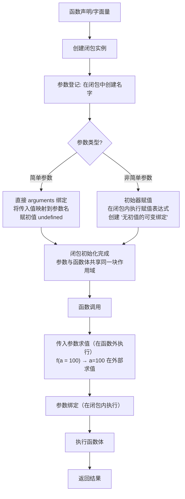

# 箭头函数

## 概述

箭头函数（Arrow Function）是 ES6（ECMAScript 2015）引入的一种新型函数表达式，它提供了更简洁的语法，并在语义上与传统的函数表达式有所不同。

### 核心特性

箭头函数的主要特点包括：

1. **语法简洁**：使用 `=>` 操作符定义函数，减少代码量
2. **词法作用域的 `this`**：没有自己的 `this`，从外层作用域继承 `this`
3. **没有 `arguments` 对象**：需要使用剩余参数（rest parameters）替代
4. **不能用作构造函数**：不能使用 `new` 关键字调用
5. **没有 `prototype` 属性**：不能作为对象的方法添加到原型链
6. **没有 `super` 和 `new.target`**：无法访问这些关键字

### 设计理念

箭头函数的设计初衷是解决两个问题：
- 提供更简洁的函数语法，特别适合函数式编程场景
- 解决回调函数中 `this` 指向混乱的问题

## 基本语法

### 简洁语法

```javascript
// 传统函数
function addTraditional(a, b) {
  return a + b
}

// 箭头函数完整形式
const add = (a, b) => {
  return a + b
}

// 简写：单行表达式自动返回
const addShort = (a, b) => a + b

// 无参数
const greet = () => console.log('Hello')

// 单个参数可以省略括号
const double = x => x * 2

// 多个参数需要括号
const sum = (a, b, c) => a + b + c

// 返回对象字面量需要括号
const createObj = (name, age) => ({ name, age })

// 返回数组字面量
const createArr = (a, b) => [a, b]

// 模板字符串
const greetName = name => `Hello, ${name}!`
```

### 参数特性

```javascript
// 默认参数
const greet = (name = 'World') => `Hello, ${name}!`
console.log(greet())        // 'Hello, World!'
console.log(greet('Alice')) // 'Hello, Alice!'

// 剩余参数
const sum = (...numbers) => numbers.reduce((a, b) => a + b, 0)
console.log(sum(1, 2, 3, 4)) // 10

// 解构参数 - 对象
const displayUser = ({ name, age, city = 'Unknown' }) => 
  `${name}, ${age} years old, from ${city}`

console.log(displayUser({ name: 'Alice', age: 30 }))
// 'Alice, 30 years old, from Unknown'

// 解构参数 - 数组
const displayCoords = ([x, y]) => `(${x}, ${y})`
console.log(displayCoords([10, 20])) // '(10, 20)'

// 混合参数
const processData = (name, { age, city = 'Beijing' } = {}) => 
  `${name}: ${age}, ${city}`

console.log(processData('Bob', { age: 25 }))
// 'Bob: 25, Beijing'
```

### 完整语法

```javascript
const func = (param1, param2 = defaultValue, ...rest) => {
  // 函数体
  return expression
}
```

## 底层原理

### 词法作用域（Lexical Scoping）

箭头函数最重要的特性是它的 `this` 绑定遵循词法作用域规则：

```javascript
// 执行上下文创建时 this 就已确定
const obj = {
  name: 'obj',
  
  // 普通函数：运行时确定 this
  regularFunc: function() {
    console.log(this.name)
  },
  
  // 箭头函数：定义时确定 this（词法作用域）
  arrowFunc: () => {
    console.log(this.name) // this 指向外层作用域
  }
}

obj.regularFunc() // 'obj' - this 指向 obj
obj.arrowFunc()   // undefined - this 指向全局对象
```

### 执行上下文与 this

```javascript
// 图解执行上下文
/*
全局执行上下文 {
  this: window/global,
  变量对象: { ... },
  作用域链: [global]
}

函数执行上下文 {
  this: 动态绑定（取决于调用方式）,
  变量对象: { arguments, ... },
  作用域链: [AO, global]
}

箭头函数执行上下文 {
  this: 外层执行上下文的 this（继承）,
  变量对象: { ... }, // 没有 arguments
  作用域链: [AO, outer]
}
*/
```

### this 绑定的底层机制

```javascript
// 箭头函数的 this 是在定义时"捕获"的
class Example {
  constructor() {
    this.value = 42
    
    // 箭头函数在构造函数中定义
    // 此时 this 已经绑定到实例
    this.getValue = () => {
      return this.value
    }
  }
  
  // 普通方法，this 在调用时确定
  getValueRegular() {
    return this.value
  }
}

const ex = new Example()
const fn1 = ex.getValue
const fn2 = ex.getValueRegular

fn1() // 42 - 箭头函数保留了对实例的引用
fn2() // TypeError: Cannot read property 'value' of undefined
```

## this 绑定

### 基本行为

箭头函数没有自己的 `this`，它会捕获定义时外层作用域的 `this`：

```javascript
const obj = {
  name: 'obj',
  
  // 传统函数
  foo: function () {
    console.log(this.name)  // 'obj'
  },
  
  // 箭头函数：this 由外层作用域决定（此处为全局/模块作用域）
  bar: () => {
    console.log(this.name)  // undefined（不绑定 obj）
  }
}

// 箭头函数的 this 在定义时就已确定（词法绑定）
function wrapper() {
  const arrow = () => this.value  // this 捕获 wrapper 的 this
  return arrow
}

const fn = wrapper.call({ value: 'custom' })
fn() // 'custom'
```

### 解决回调函数 this 问题

这是箭头函数最常见的使用场景：

```javascript
const obj = {
  name: 'obj',
  friends: ['Alice', 'Bob', 'Charlie'],
  
  showFriends: function () {
    // ❌ 传统函数，this 指向问题
    this.friends.forEach(function (friend) {
      console.log(this.name + ' knows ' + friend)
      // undefined knows Alice
      // undefined knows Bob
      // undefined knows Charlie
    })
    
    // ✅ 箭头函数，this 指向外层
    this.friends.forEach(friend => {
      console.log(this.name + ' knows ' + friend)
      // obj knows Alice
      // obj knows Bob
      // obj knows Charlie
    })
  }
}

obj.showFriends()
```

### setTimeout/setInterval 中的 this

```javascript
function Timer() {
  this.seconds = 0
  
  // ❌ 传统函数，this 指向 window
  this.timer1 = setInterval(function () {
    this.seconds++  // NaN（window.seconds 不存在）
    console.log('Timer 1:', this.seconds)
  }, 1000)
  
  // ✅ 箭头函数，this 指向 Timer 实例
  this.timer2 = setInterval(() => {
    this.seconds++  // 正常累加
    console.log('Timer 2:', this.seconds)
  }, 1000)
}
```

### this 绑定的"固化"特性

```javascript
// 箭头函数的 this 在定义时就已确定，无法修改
const obj = {
  name: 'obj',
  foo: function () {
    const arrow = () => {
      console.log(this.name)
    }
    return arrow
  }
}

const arrow = obj.foo()
arrow()  // 'obj'

// 即使使用 call、apply、bind 也无法改变
const anotherObj = { name: 'another' }
arrow.call(anotherObj)   // 'obj'
arrow.apply(anotherObj)  // 'obj'
arrow.bind(anotherObj)() // 'obj'

// 这证明了箭头函数的 this 是"词法绑定"，优先级最高
```

## arguments 对象

### 没有 arguments 的原因

箭头函数没有自己的 `arguments` 对象，因为它不是为了传统函数调用设计的：

```javascript
// 传统函数有 arguments
function foo() {
  console.log(arguments)  // Arguments { 0: 1, 1: 2, 2: 3, ... }
  console.log(arguments.length) // 3
}

foo(1, 2, 3)

// 箭头函数没有 arguments
const bar = () => {
  console.log(arguments)  // ReferenceError: arguments is not defined
}

bar(1, 2, 3)
```

### 使用剩余参数替代

```javascript
// ✅ 推荐：使用剩余参数（rest parameters）
const sum = (...args) => {
  return args.reduce((total, num) => total + num, 0)
}

console.log(sum(1, 2, 3, 4, 5)) // 15

// 访问 arguments 的场景
const logArgs = (...args) => {
  args.forEach((arg, index) => {
    console.log(`Argument ${index}:`, arg)
  })
}

logArgs('a', 'b', 'c')
// Argument 0: a
// Argument 1: b
// Argument 2: c

// 剩余参数可以与普通参数混用
const func = (first, second, ...rest) => {
  console.log('First:', first)
  console.log('Second:', second)
  console.log('Rest:', rest)
}

func(1, 2, 3, 4, 5)
// First: 1
// Second: 2
// Rest: [3, 4, 5]
```

### arguments 的词法捕获

箭头函数可以访问外层函数的 `arguments`：

```javascript
function outer() {
  // 外层函数有 arguments
  console.log('Outer arguments:', arguments)
  
  // 箭头函数可以访问外层的 arguments
  const inner = () => {
    console.log('Inner can access outer arguments:', arguments)
    console.log('First argument:', arguments[0])
  }
  
  return inner
}

const fn = outer(1, 2, 3)
fn() 
// Inner can access outer arguments: Arguments { 0: 1, 1: 2, 2: 3 }
// First argument: 1
```

## 构造函数与原型

### 不能用作构造函数

箭头函数不能用作构造函数，不能使用 `new` 调用：

```javascript
const Person = (name) => {
  this.name = name
}

// ❌ 错误：箭头函数不能用作构造函数
const person = new Person('John')
// TypeError: Person is not a constructor

// ✅ 使用传统函数
function PersonFunc(name) {
  this.name = name
}

const person1 = new PersonFunc('John')
console.log(person1.name)  // 'John'

// ✅ 使用 class 语法（推荐）
class PersonClass {
  constructor(name) {
    this.name = name
  }
  
  getName() {
    return this.name
  }
}

const person2 = new PersonClass('Jane')
console.log(person2.name)  // 'Jane'
```

### 没有 prototype 属性

```javascript
function regularFunc() {}
console.log(regularFunc.prototype)  // { constructor: f }

const arrowFunc = () => {}
console.log(arrowFunc.prototype)  // undefined

// 这意味着箭头函数不能用于原型继承
function Animal(name) {
  this.name = name
}

// ❌ 错误：箭头函数没有 prototype
Animal.prototype.speak = () => {
  console.log(`${this.name} makes a sound`) // this 指向错误
}

// ✅ 正确：使用普通函数
Animal.prototype.speak = function() {
  console.log(`${this.name} makes a sound`)
}
```

## call、apply、bind 方法

### 无法改变 this 指向

箭头函数不能通过 `call`、`apply`、`bind` 改变 `this`：

```javascript
const arrow = () => {
  console.log(this)
}

const obj = { name: 'obj' }

arrow.call(obj)   // window，无效
arrow.apply(obj)  // window，无效

const boundArrow = arrow.bind(obj)
boundArrow()      // window，无效

// 这些方法可以传递参数，但 this 绑定无效
const add = (a, b) => a + b

console.log(add.call(null, 1, 2))   // 3（参数有效）
console.log(add.apply(null, [3, 4])) // 7（参数有效）

const add5 = add.bind(null, 5)
console.log(add5(10)) // 15（柯里化有效）
```

### bind 的其他用途

虽然不能改变 this，但 bind 仍可用于柯里化：

```javascript
// 柯里化（部分应用）
const multiply = (a, b, c) => a * b * c

const multiplyByTwo = multiply.bind(null, 2)
const multiplyByTwoAndThree = multiply.bind(null, 2, 3)

console.log(multiplyByTwo(3, 4))         // 24 (2 * 3 * 4)
console.log(multiplyByTwoAndThree(4))    // 24 (2 * 3 * 4)

// 实际应用
const request = (method, url, data) => {
  return fetch(url, {
    method,
    body: JSON.stringify(data)
  })
}

const get = request.bind(null, 'GET')
const post = request.bind(null, 'POST')

get('/api/users')
post('/api/users', { name: 'Alice' })
```

## Generator 函数

### 不能用作 Generator

箭头函数不能用作 Generator 函数：

```javascript
// ❌ 错误
// const foo = () => {
//   yield 1
// }
// SyntaxError: Unexpected token 'yield'

// ✅ 使用传统函数语法
function* generator() {
  yield 1
  yield 2
  yield 3
}

const gen = generator()
console.log(gen.next()) // { value: 1, done: false }
console.log(gen.next()) // { value: 2, done: false }
console.log(gen.next()) // { value: 3, done: false }
console.log(gen.next()) // { value: undefined, done: true }
```

## super 和 new.target

### 没有 super

```javascript
class Parent {
  constructor() {
    this.name = 'Parent'
  }
  
  sayHello() {
    console.log('Hello from Parent')
  }
}

class Child extends Parent {
  constructor() {
    super()
    this.name = 'Child'
  }
  
  // ✅ 普通方法可以使用 super
  sayHello() {
    super.sayHello()
    console.log('Hello from Child')
  }
  
  // ℹ️ 类字段中的箭头函数也可以使用 super（继承自外层类）
  sayHi = () => {
    super.sayHello()
  }
}
```

### 没有 new.target

```javascript
// 普通函数可以使用 new.target
function Person(name) {
  if (!new.target) {
    throw new Error('Person must be called with new')
  }
  this.name = name
}

// 箭头函数没有 new.target
const Animal = (name) => {
  // console.log(new.target) // SyntaxError
  this.name = name
}
```

## 高级应用场景

### 1. 函数式编程

```javascript
// 组合函数（Composition）
const compose = (...fns) => x => fns.reduceRight((v, f) => f(v), x)

const add1 = x => x + 1
const multiply2 = x => x * 2
const subtract3 = x => x - 3

const calculate = compose(subtract3, multiply2, add1)
console.log(calculate(5)) // 9: (5 + 1) * 2 - 3

// 管道函数（Pipeline）
const pipe = (...fns) => x => fns.reduce((v, f) => f(v), x)

const calculatePipe = pipe(add1, multiply2, subtract3)
console.log(calculatePipe(5)) // 9: (5 + 1) * 2 - 3

// 柯里化函数
const curry = (fn) => {
  const arity = fn.length
  const curried = (...args) =>
    args.length >= arity
      ? fn(...args)
      : (...more) => curried(...args, ...more)
  return curried
}

const add = (a, b, c) => a + b + c
const curriedAdd = curry(add)

console.log(curriedAdd(1)(2)(3))    // 6
console.log(curriedAdd(1, 2)(3))    // 6
console.log(curriedAdd(1)(2, 3))    // 6
```

### 2. 数组方法链式调用

```javascript
const numbers = [1, 2, 3, 4, 5, 6, 7, 8, 9, 10]

const result = numbers
  .filter(n => n % 2 === 0)      // [2, 4, 6, 8, 10]
  .map(n => n * n)                // [4, 16, 36, 64, 100]
  .reduce((sum, n) => sum + n, 0) // 220

console.log(result)

// 对象数组处理
const users = [
  { name: 'Alice', age: 25, score: 85 },
  { name: 'Bob', age: 30, score: 90 },
  { name: 'Charlie', age: 35, score: 75 }
]

const topUsers = users
  .filter(user => user.score >= 80)
  .sort((a, b) => b.score - a.score)
  .map(user => user.name)

console.log(topUsers) // ['Bob', 'Alice']
```

### 3. Promise 和异步编程

```javascript
// Promise 链
fetch('/api/users')
  .then(response => response.json())
  .then(users => users.filter(user => user.active))
  .then(activeUsers => console.log(activeUsers))
  .catch(error => console.error('Error:', error))

// 并行请求
const fetchAll = async (urls) => {
  const promises = urls.map(url => fetch(url).then(res => res.json()))
  return Promise.all(promises)
}

// 带重试的异步请求
const retry = async (fn, retries = 3, delay = 1000) => {
  let lastError
  for (let i = 0; i < retries; i++) {
    try {
      return await fn()
    } catch (error) {
      lastError = error
      if (i < retries - 1) {
        await new Promise(resolve => setTimeout(resolve, delay))
      }
    }
  }
  throw lastError
}

// 使用示例
retry(() => fetch('/api/data').then(res => res.json()))
  .then(data => console.log(data))
  .catch(error => console.error('All retries failed:', error))
```

### 4. 事件处理（需要保留 this）

```javascript
class EventEmitter {
  constructor() {
    this.events = {}
  }
  
  on(event, listener) {
    if (!this.events[event]) {
      this.events[event] = []
    }
    this.events[event].push(listener)
  }
  
  emit(event, ...args) {
    if (this.events[event]) {
      this.events[event].forEach(listener => listener(...args))
    }
  }

  off(event, listener) {
    if (this.events[event]) {
      this.events[event] = this.events[event].filter(l => l !== listener)
    }
  }
}
```

### 5. React 中的应用

```javascript
// React 类组件中绑定方法
class Counter extends React.Component {
  constructor(props) {
    super(props)
    this.state = { count: 0 }
  }
  
  // ✅ 方式1：箭头函数作为类字段（推荐）
  increment = () => {
    this.setState(prevState => ({ count: prevState.count + 1 }))
  }
  
  render() {
    return (
      <button onClick={this.increment}>
        Count: {this.state.count}
      </button>
    )
  }
}

// 函数组件中使用箭头函数
const UserList = ({ users }) => (
  <ul>
    {users.map(user => (
      <li key={user.id}>
          {user.name}
        </li>
      ))}
    </ul>
  )
```

### 6. Vue 中的应用

```javascript
// Vue 组件中
export default {
  data() {
    return {
      message: 'Hello',
      count: 0
    }
  },
  methods: {
    // ❌ 不要在 methods 中使用箭头函数
    // increment: () => {
    //   this.count++ // this 不指向 Vue 实例
    // }
    // ✅ 正确：methods 中使用普通函数
    increment() {
      this.count++
    }
  },
  created() {
    // ✅ 在生命周期钩子的回调中使用箭头函数
    setTimeout(() => {
      console.log(this.message) // 'Hello'
    }, 1000)
  }
}
```

## 箭头函数的适用场景

### 1. 简单的回调函数

```javascript
// 数组方法
const numbers = [1, 2, 3, 4, 5]

const doubled = numbers.map(n => n * 2)
console.log(doubled)  // [2, 4, 6, 8, 10]

const evens = numbers.filter(n => n % 2 === 0)
console.log(evens)  // [2, 4]

const sum = numbers.reduce((total, n) => total + n, 0)
console.log(sum)  // 15

const found = numbers.find(n => n > 3)
console.log(found)  // 4

const hasEven = numbers.some(n => n % 2 === 0)
console.log(hasEven)  // true

const allPositive = numbers.every(n => n > 0)
console.log(allPositive)  // true

// 字符串方法
const str = 'Hello World'
const words = str.split(' ').map(w => w.toLowerCase())
console.log(words)  // ['hello', 'world']
```

### 2. 保持外层 this

```javascript
class Timer {
  constructor() {
    this.seconds = 0
    this.isRunning = false
  }
  
  start() {
    if (this.isRunning) return
    this.isRunning = true
    
    this.intervalId = setInterval(() => {
      this.seconds++
      console.log(this.seconds)
    }, 1000)
  }
  
  stop() {
    if (!this.isRunning) return
    this.isRunning = false
    clearInterval(this.intervalId)
  }
  
  reset() {
    this.stop()
    this.seconds = 0
  }
}

const timer = new Timer()
timer.start()
```

### 3. 函数式编程风格

```javascript
// 纯函数
const pure = {
  add: (a, b) => a + b,
  multiply: (a, b) => a * b,
  compose: (f, g) => x => f(g(x))
}

// 不可变操作
const immutable = {
  push: (arr, item) => [...arr, item],
  pop: arr => arr.slice(0, -1),
  shift: arr => arr.slice(1),
  unshift: (arr, item) => [item, ...arr],
  update: (arr, index, item) => [
    ...arr.slice(0, index),
    item,
    ...arr.slice(index + 1)
  ]
}
```

### 4. 解构赋值

```javascript
const getFullName = ({ firstName, lastName }) => `${firstName} ${lastName}`

console.log(getFullName({ firstName: 'John', lastName: 'Doe' }))
// 'John Doe'

// 带默认值
const displayUser = ({ 
  name, 
  age, 
  address: { city = 'Unknown', country = 'Unknown' } = {} 
}) => `${name}, ${age}, ${city}, ${country}`

console.log(displayUser({ name: 'Alice', age: 30 }))
// 'Alice, 30, Unknown, Unknown'

// 数组解构
const getFirstAndLast = ([first, ...rest]) => {
  const last = rest.pop()
  return { first, last }
}

console.log(getFirstAndLast([1, 2, 3, 4, 5]))
// { first: 1, last: 5 }
```

### 5. IIFE（立即执行函数）

```javascript
// 传统 IIFE
(function() {
  console.log('IIFE with traditional function')
})()

// 箭头函数 IIFE
(() => {
  console.log('IIFE with arrow function')
})()

// 带参数的箭头函数 IIFE
((a, b) => {
  console.log(a + b)
})(1, 2)

// 用于创建私有作用域
const counter = (() => {
  let count = 0
  return {
    increment: () => ++count,
    decrement: () => --count,
    getCount: () => count
  }
})()

console.log(counter.increment()) // 1
console.log(counter.increment()) // 2
console.log(counter.getCount())  // 2
```

## 箭头函数的不适用场景

### 1. 对象方法

```javascript
const obj = {
  name: 'obj',
  
  // ❌ 不推荐：this 指向外层作用域
  getName: () => {
    return this.name  // undefined
  },
  
  // ✅ 推荐：使用方法简写
  getName2() {
    return this.name  // 'obj'
  },
  
  // ✅ 推荐：传统函数表达式
  getName3: function() {
    return this.name  // 'obj'
  }
}
```

### 2. 构造函数

```javascript
// ❌ 不推荐：箭头函数不能用作构造函数
const PersonArrow = (name) => {
  this.name = name
}
// new PersonArrow('John') // TypeError: PersonArrow is not a constructor

// ✅ 推荐：使用 class
class Person {
  constructor(name) {
    this.name = name
  }
  
  getName() {
    return this.name
  }
}

// ✅ 或使用传统函数
function PersonFunc(name) {
  if (!(this instanceof PersonFunc)) {
    throw new Error('PersonFunc must be called with new')
  }
  this.name = name
}
```

### 3. 原型方法

```javascript
function Person(name) {
  this.name = name
}

// ❌ 不推荐：this 指向外层作用域
Person.prototype.getName = () => {
  return this.name  // undefined
}

// ✅ 推荐：使用传统函数
Person.prototype.getName = function () {
  return this.name  // 'John'
}

const person = new Person('John')
console.log(person.getName())
```

### 4. 事件处理器需要 this

```javascript
const button = document.querySelector('button')

// ❌ 不推荐：this 指向外层作用域
button.addEventListener('click', () => {
  console.log(this)  // window 或外层 this
})

// ✅ 推荐：使用传统函数访问事件目标
button.addEventListener('click', function () {
  console.log(this)  // button 元素
  this.classList.add('clicked')
})

// ✅ 或者使用 event.target
button.addEventListener('click', (event) => {
  console.log(event.target)  // button 元素
  event.target.classList.add('clicked')
})
```

### 5. 需要 arguments 对象

```javascript
// ❌ 不推荐：箭头函数没有 arguments
// const sum = () => {
//   return Array.from(arguments).reduce((a, b) => a + b, 0)
// }  // ReferenceError: arguments is not defined

// ✅ 推荐：使用剩余参数
const sum = (...args) => {
  return args.reduce((a, b) => a + b, 0)
}

// 或者使用传统函数
function sumTraditional() {
  return Array.from(arguments).reduce((a, b) => a + b, 0)
}
```

### 6. 动态 this 绑定场景

```javascript
// 需要根据调用方式改变 this 的场景
const methods = {
  logThis: function() {
    console.log(this)
  }
}

const obj1 = { name: 'obj1' }
const obj2 = { name: 'obj2' }

// 可以改变 this 指向
methods.logThis.call(obj1) // { name: 'obj1' }
methods.logThis.call(obj2) // { name: 'obj2' }

// 如果使用箭头函数则无法实现
const methods2 = {
  logThis: () => {
    console.log(this)
  }
}

methods2.logThis.call(obj1) // window（无法改变）
methods2.logThis.call(obj2) // window（无法改变）
```

## this 绑定优先级

箭头函数的 `this` 绑定优先级最高，无法被修改：

```javascript
// this 绑定优先级（从高到低）：
// 1. 箭头函数（词法绑定，不可修改）
// 2. new 绑定
// 3. 显式绑定（call、apply、bind）
// 4. 隐式绑定（对象方法调用）
// 5. 默认绑定（独立调用）

const obj = {
  name: 'obj',
  foo: function () {
    const arrow = () => {
      console.log(this.name)
    }
    return arrow
  }
}

const arrow = obj.foo()
arrow()  // 'obj'

// 即使使用 call、apply、bind 也无法改变
const anotherObj = { name: 'another' }
arrow.call(anotherObj)   // 'obj'
arrow.apply(anotherObj)  // 'obj'
arrow.bind(anotherObj)() // 'obj'
```

## 性能考量

### 创建开销

```javascript
// 在循环中创建函数（传统方式）
class Example {
  constructor() {
    this.values = []
    
    // ❌ 每次循环都创建新函数（浪费内存）
    for (let i = 0; i < 1000; i++) {
      this.values.push(function() {
        return i
      })
    }
    
    // ✅ 正确：在构造器外定义一次，循环中只引用
    this.values2 = []
    for (let i = 0; i < 1000; i++) {
      this.values2.push(CollectionHelper.formatValue)  // 引用共享函数
    }
  }
  
  // ✅ 在原型上共享方法
  decrement() {
    this.count--
  }
}

// 在类外定义共享函数，避免重复创建
class CollectionHelper {
  static formatValue(value) {
    return String(value)
  }
}
```

### 内存占用

```javascript
// 箭头函数作为类字段的内存影响
class Button {
  constructor() {
    this.count = 0
  }
  
  // 每个实例都有自己的 handleClick 函数（内存占用更大）
  handleClick = () => {
    this.count++
  }
}

// ✅ 方案1：普通方法 + 构造函数 bind（原型共享，内存占用小）
class Button2 {
  constructor() {
    this.count = 0
    this.handleClick = this.handleClick.bind(this)
  }
  handleClick() {
    this.count++
  }
}

// ✅ 方案2：使用事件委托，减少事件监听器数量
const buttons = Array.from(document.querySelectorAll('.button'))
buttons.forEach(button => button.addEventListener('click', handleClick))

// 或者使用事件委托
document.body.addEventListener('click', (event) => {
  if (event.target.matches('.button')) {
    // 处理逻辑
  }
})
```

### 执行速度

```javascript
// 箭头函数的执行速度通常与传统函数相近
// 主要优势在于简洁性和 this 绑定

// 性能测试示例
const testPerformance = (fn, iterations = 1000000) => {
  const start = performance.now()
  for (let i = 0; i < iterations; i++) {
    fn(i)
  }
  const end = performance.now()
  return end - start
}

// 传统函数
const regularFunc = function(x) { return x * 2 }

// 箭头函数
const arrowFunc = x => x * 2

// 性能差异通常在误差范围内
console.log('Regular:', testPerformance(regularFunc), 'ms')
console.log('Arrow:', testPerformance(arrowFunc), 'ms')
```

## 类型检测

### 判断是否为箭头函数

```javascript
// 箭头函数没有 prototype
const isArrowFunction = fn => {
  return typeof fn === 'function' && fn.prototype === undefined
}

// 测试
const regularFunc = function() {}
const arrowFunc = () => {}

console.log(isArrowFunction(regularFunc)) // false
console.log(isArrowFunction(arrowFunc))   // true

// 更严格的检测（包括检查 constructor）
const isArrowFunctionStrict = fn => {
  return typeof fn === 'function' && 
         fn.prototype === undefined &&
         !fn.hasOwnProperty('constructor')
}
```

### 类型声明（TypeScript）

```typescript
// 箭头函数类型声明
type AddFunction = (a: number, b: number) => number

const add: AddFunction = (a, b) => a + b

// 泛型箭头函数
const identity = <T>(arg: T): T => arg

// 接口定义
interface Calculator {
  (a: number, b: number): number
}

const multiply: Calculator = (a, b) => a * b

// 类型推断
const inferred = (x: number) => x * 2 // 自动推断返回类型为 number
```

## 调试技巧

### 断点调试

```javascript
// 箭头函数的调试技巧
const processArray = arr => 
  arr
    .filter(x => {
      // 可以在这里打断点
      debugger
      return x > 0
    })
    .map(x => {
      console.log('Processing:', x) // 添加日志
      return x * 2
    })

// 使用命名函数提高调用栈可读性
const processArrayDebug = arr => {
  const filterPositive = x => x > 0
  const double = x => x * 2
  
  return arr.filter(filterPositive).map(double)
}

// 在调用栈中可以看到 filterPositive 和 double
```

### 错误追踪

```javascript
// 箭头函数的错误追踪
const fetchData = async (url) => {
  try {
    const response = await fetch(url)
    return await response.json()
  } catch (error) {
    // 保留调用栈
    console.error('Fetch failed:', error)
    throw new Error(`Failed to fetch ${url}: ${error.message}`)
  }
}

// 使用 Error.captureStackTrace（Node.js）
const createError = (message) => {
  const error = new Error(message)
  Error.captureStackTrace(error, createError)
  return error
}
```

## 常见陷阱与误区

### 1. this 捕获时机

```javascript
// ❌ 常见错误：认为 this 在调用时确定
const obj = {
  name: 'obj',
  getName: () => this.name
}

console.log(obj.getName()) // undefined，不是 'obj'

// this 在定义时就已经捕获了外层作用域的 this
```

### 2. 返回对象字面量

```javascript
// ❌ 错误：块体不会隐式返回对象
const createPersonBad = (name, age) => { name, age }
console.log(createPersonBad('Alice', 30)) // undefined

// ✅ 正确：使用括号包裹对象
const createPerson = (name, age) => ({ name, age })
console.log(createPerson('Alice', 30)) // { name: 'Alice', age: 30 }
```

### 3. 立即返回对象

```javascript
// ❌ 语法错误（foo: 被解析为标签语句，函数返回 undefined）
// const func = () => { foo: 1 }

// ✅ 正确方式
const func = () => ({ foo: 1 })

// 或者使用函数体
const func2 = () => {
  return { foo: 1 }
}
```

### 4. 箭头函数作为对象方法

```javascript
const counter = {
  count: 0,
  
  // ❌ 错误：this 不会指向 counter
  increment: () => {
    this.count++
  }
}

counter.increment()
console.log(counter.count) // 0，未改变

// ✅ 正确方式
const counter2 = {
  count: 0,
  
  increment() {
    this.count++
  }
}

counter2.increment()
console.log(counter2.count) // 1
```

### 5. 在构造函数中使用箭头函数

```javascript
function Person(name) {
  this.name = name
  
  // ⚠️ 每个实例都会创建新的方法
  this.sayHello = () => {
    console.log(`Hello, ${this.name}`)
  }
}

// 更好的方式
Person.prototype.sayHello = function() {
  console.log(`Hello, ${this.name}`)
}
```

## 最佳实践

### 1. 何时使用箭头函数

```javascript
// ✅ 推荐：简单的回调
arr.map(x => x * 2)

// ✅ 推荐：需要保持外层 this
class Timer {
  start() {
    setInterval(() => {
      this.tick()
    }, 1000)
  }
  tick() {
    console.log('tick')
  }
}

// ✅ 推荐：作为参数传递给高阶函数
const numbers = [1, 2, 3]
const doubled = numbers.map(x => x * 2)

// ✅ 推荐：返回函数的工厂函数
const createMultiplier = (factor) => (value) => value * factor
const double = createMultiplier(2)

// ❌ 不推荐：构造函数
const Person = (name) => {
  this.name = name // 错误
}
```

### 2. 代码风格建议

```javascript
// ✅ 简洁的单行函数
const double = x => x * 2

// ✅ 多行函数使用块语句
const processData = (data) => {
  if (!data) return null
  
  const processed = transform(data)
  return saveToDatabase(processed)
}

// ✅ 参数列表清晰
const func = (
  param1,
  param2,
  param3
) => {
  // 函数体
}

// ✅ 链式调用对齐
const result = [1, 2, 3]
  .map(x => x * 2)
  .filter(x => x > 2)
  .reduce((sum, x) => sum + x, 0)
```

### 3. 性能优化建议

```javascript
// ✅ 避免在构造函数中定义箭头函数方法
class Optimized {
  constructor() {
    this.value = 0
  }
  
  // 原型方法，所有实例共享
  increment() {
    this.value++
  }
  
  // 只在必要时使用箭头函数作为类字段
  handleClick = () => {
    // 需要作为回调且需要正确的 this
  }
}

// ✅ 重用函数引用
const handler = () => console.log('click')
elements.forEach(el => el.addEventListener('click', handler))
```

## 箭头函数与普通函数的完整对比

| 特性 | 箭头函数 | 普通函数 | 说明 |
|------|---------|---------|------|
| this 绑定 | 外层作用域的 this（词法） | 动态绑定 | 箭头函数的 this 在定义时确定 |
| arguments | 无 | 有 | 箭头函数使用剩余参数替代 |
| constructor | 无 | 有 | 箭头函数不能作为构造函数 |
| prototype | 无 | 有 | 箭头函数没有原型对象 |
| new 调用 | 不可以 | 可以 | 箭头函数不能使用 new |
| yield | 不可以 | 可以 | 箭头函数不能作为 Generator |
| super | 无（继承外层） | 有 | 箭头函数可访问外层的 super |
| new.target | 无 | 有 | 箭头函数无法使用 new.target |
| call/apply/bind | 可调用但不能改变 this | 可以改变 this | 箭头函数的 this 不可变 |
| 语法简洁度 | 更简洁 | 较冗长 | 箭头函数适合简单表达式 |
| 适用场景 | 回调、函数式编程 | 方法定义、构造函数 | 根据需求选择 |

## 常见问题解答

### Q1: 箭头函数可以改变 this 吗？

**A:** 不可以。箭头函数的 `this` 在定义时就已确定，无法通过 `call`、`apply`、`bind` 改变。

```javascript
const arrow = () => console.log(this)
const obj = {}

arrow.call(obj)  // window，不是 obj
```

### Q2: 箭头函数可以使用 new 吗？

**A:** 不可以。箭头函数没有 `[[Construct]]` 内部方法，不能作为构造函数。

```javascript
const Arrow = () => {}
new Arrow() // TypeError: Arrow is not a constructor
```

### Q3: 为什么箭头函数没有 arguments？

**A:** 箭头函数设计为简洁的回调函数，不需要类数组的 `arguments` 对象。可以使用剩余参数替代：

```javascript
const sum = (...args) => args.reduce((a, b) => a + b, 0)
```

### Q4: 箭头函数可以访问外层的 arguments 吗？

**A:** 可以。箭头函数可以访问外层函数的 `arguments`：

```javascript
function outer() {
  const inner = () => {
    console.log(arguments) // 可以访问
  }
  inner()
}
```

### Q5: 如何判断一个函数是箭头函数？

**A:** 检查 `prototype` 属性：

```javascript
const isArrow = fn => typeof fn === 'function' && fn.prototype === undefined
```

### Q6: 箭头函数可以解构参数吗？

**A:** 可以，箭头函数完全支持参数解构：

```javascript
const func = ({ name, age }) => `${name}, ${age}`
```

### Q7: React 中为什么推荐使用箭头函数？

**A:** 在 React 类组件中，使用箭头函数作为类字段可以自动绑定 `this`，无需在构造函数中手动绑定：

```javascript
class Component extends React.Component {
  handleClick = () => {
    // this 自动绑定到实例
  }
}
```

### Q8: 箭头函数有变量提升吗？

**A:** 没有。箭头函数使用 `const` 或 `let` 声明，遵循块级作用域规则，不存在变量提升：

```javascript
console.log(arrow) // ReferenceError
const arrow = () => {}
```

### 函数式范型的核心抽象（核心原理深度）

> **规范层级**：ECMAScript 规范 · Arrow Function Definitions · Function Environment Records
> **原理来源**：JavaScript 核心原理解析·第08讲

#### 规范语义

函数具有**三个不可或缺的语义组件**：参数（Parameters）、执行体（Body）、结果（Result）。任何函数，无论形式如何简化，都必须包含这三部分。

`x => x` 是最小化的函数——它包含了完整的三个语义组件：
- **参数**：`x`
- **执行体**：`x`（表达式即执行体）
- **结果**：`x` 的求值结果

函数的**一体两面**：
- **静态视角**：函数是一个对象实例（函数对象），拥有 `[[Call]]` 内部槽
- **动态视角**：函数是一个执行结构（闭包），每次引用函数声明都会创建一个新的闭包实例

```javascript
var arr = new Array;
for (var i = 0; i < 5; i++) arr.push(function f() { /* ... */ });
// arr[0] === arr[1] → false
// 5个不同的闭包实例，各个不同
```

**语句执行 = 命令式范型；函数执行 = 函数式范型**——这是两种语言范型根本上的不同抽象模型带来的差异。函数返回"求值结果"（Value 或 Reference），语句返回"完成状态"（Completion Record）。

#### 执行机制



#### 核心洞察

1. **闭包与迭代环境的同一性**：函数闭包的创建机制与 `for` 循环的迭代环境（`iteratorEnv`）完全相同——都是"为可重复进入的执行体创建独立的 scope 实例"。命令式语言称之为 `iteratorEnv`（迭代环境），函数式语言称之为闭包。二者在引擎层面是同一种机制。

2. **`x => x` 代表计算的本质**：将输入 `x` 映射为输出 `x'`，这就是函数作为"数据转换"的纯粹表达。箭头函数的匿名性进一步强化了这一点——名字不是函数的核心特性，逻辑（可执行）与数据（第一类型）才是。

3. **非简单参数的 TDZ（暂时性死区）陷阱**：

   当函数使用缺省参数、剩余参数或解构参数时，参数绑定从"直接 arguments 映射"变为"初始器赋值"。这带来了关键差异：

   - 简单参数：直接赋初值 `undefined`，可以提前访问
   - 非简单参数：创建**无初值的可变绑定**（类似 `let` 变量），在初始器赋值前不可访问

   之所以不能用 `undefined` 作为初值，是因为在缺省参数语法中 `undefined` 有特殊含义——它表示"该位置没有传入参数"，因此不能作为默认的初始绑定值。

```javascript
// 简单参数：可以提前访问
function foo(x) { console.log(x); var x = 200; }
foo(100); // 100（参数 x 已有初值）

// 非简单参数：(x = x) → 第二个 x 访问未初始化的绑定
f = (x = x) => x;
f(); // ReferenceError: Cannot access 'x' before initialization

// 同一机制：let 变量的 TDZ
let x = x; // ReferenceError: Cannot access 'x' before initialization
```

4. **参数求值的外部性**：`f(a = 100)` 中 `a = 100` 在函数**外部**求值，而 `function foo(x = 100)` 中 `x = 100` 在函数**内部**（闭包内）求值。这是非简单参数创建 TDZ 的根本原因——初始器表达式在闭包内部执行，此时参数绑定尚未赋初值。

#### 代码实证

```javascript
// 1. 闭包实例的独立性
var arr = [];
for (var i = 0; i < 5; i++) {
  arr.push(function f() { return i; });
}
console.log(arr[0] === arr[1]); // false（不同闭包实例）
// 但注意：var i 在同一作用域，所以 5 个闭包共享 i=5

// 使用 let 创建独立迭代环境
var arr2 = [];
for (let i = 0; i < 5; i++) {
  arr2.push(() => i);
}
console.log(arr2[0]()); // 0（每次迭代都有独立的 i）

// 限制1：箭头函数没有自己的 arguments 对象
const arrow = () => {
  console.log(arguments)  // 引用外层作用域的 arguments，而非本函数
}

// 限制2：不能用作生成器函数
// function* gen() {} // ✅
// const gen = () => {} // ❌ 不能有 yield

// 限制3：参数与 arguments 不绑定（非简单参数才特殊）
function nonSimple(x = 1) {
  console.log(arguments); // Arguments { 0: 1 }（不与 x 绑定）
  x = 999;
  console.log(arguments[0]); // 1（不受 x 修改影响）
}
nonSimple(1);
```

#### 与实战的关联

1. **默认参数的 TDZ 风险**：在默认参数中引用自身或其他未初始化的参数会导致 ReferenceError，这在复杂的参数默认值链中容易出错：

```javascript
// 危险：参数默认值引用自身
function dangerous(x = y, y = 10) {
  return x + y;
}
dangerous(); // ReferenceError: Cannot access 'y' before initialization（y 还没初始化就被 x 的默认值引用）

// 安全：调整参数顺序或避免交叉引用
function safe(y = 10, x = y) {
  return x + y;
}
safe(); // 20（y 先初始化，x 可以引用 y）
```

2. **闭包实例化的理解**：每次函数引用都创建新闭包，这意味着在循环中创建函数（如 `arr.map` 的回调）会产生独立的闭包实例。理解这一点有助于避免内存泄漏和不必要的函数创建。

3. **函数即数据的设计思维**：箭头函数 `x => x` 的简洁性使得"函数即数据"的思想更易实践——柯里化、函数组合、偏应用等函数式编程技术都依赖这一抽象。

---

## 总结

### 核心要点

- **语法简洁**：箭头函数提供了更简洁的函数定义方式，特别适合单行表达式
- **词法 this**：箭头函数没有自己的 `this`，从外层作用域继承 `this`
- **无 arguments**：箭头函数没有 `arguments` 对象，需要使用剩余参数替代
- **非构造函数**：箭头函数不能用作构造函数，没有 `prototype` 属性
- **优先级最高**：箭头函数的 `this` 绑定优先级最高，无法被修改

### 使用建议

✅ **适合使用箭头函数的场景**：
- 简单的回调函数（map、filter、reduce 等）
- Promise 链式调用
- 需要保持外层 `this` 的场景
- 函数式编程风格
- React 类组件的方法绑定

❌ **不适合使用箭头函数的场景**：
- 对象方法定义
- 构造函数
- 原型方法
- 需要 `arguments` 对象的场景
- 需要动态改变 `this` 的场景
- 事件处理器（需要访问事件目标）

### 最佳实践原则

1. **优先使用简洁语法**：单行表达式使用简写形式
2. **明确 this 指向**：理解词法作用域和 this 捕获机制
3. **避免滥用**：不是所有函数都需要用箭头函数
4. **性能考量**：避免在构造函数中定义大量箭头函数方法
5. **代码可读性**：复杂逻辑使用块语句，添加适当的注释

## 参考资料

- [ECMAScript 规范 - Arrow Functions](https://tc39.es/ecma262/#sec-arrow-function-definitions)
- [MDN - 箭头函数](https://developer.mozilla.org/zh-CN/docs/Web/JavaScript/Reference/Functions/Arrow_functions)
- [You Don't Know JS - this & Object Prototypes](https://github.com/getify/You-Dont-Know-JS)
- [ES6 In Depth: Arrow Functions](https://hacks.mozilla.org/2015/06/es6-in-depth-arrow-functions/)
