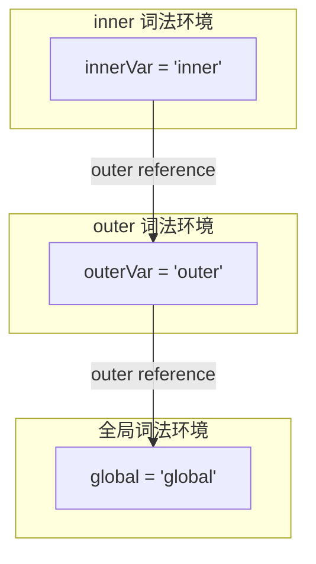
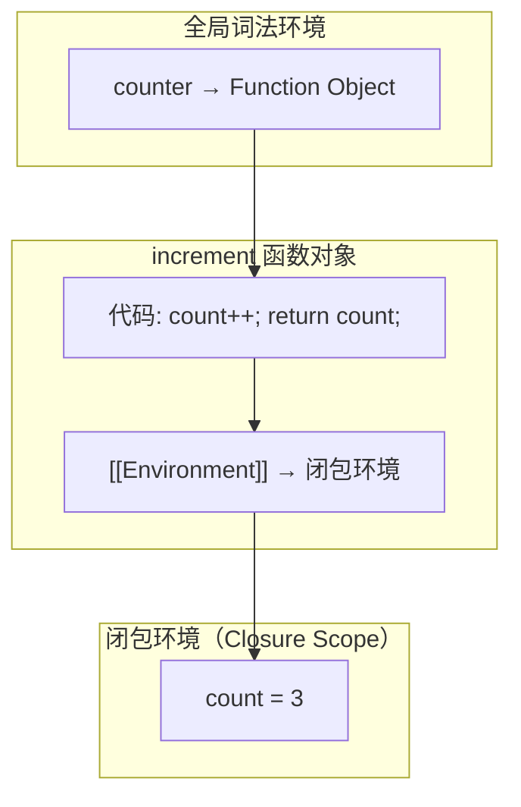
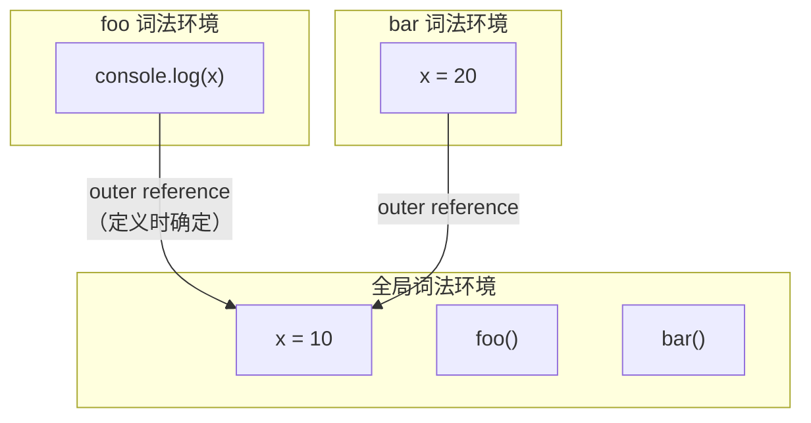

# 作用域链与闭包：JavaScript 的词法作用域模型

## 概述

作用域链（Scope Chain）和闭包（Closure）是 JavaScript 最核心的语言特性之一。作用域链决定了变量的查找路径，闭包则使函数能够访问其词法作用域外的变量。理解两者的本质，需要从词法环境（Lexical Environment）和执行上下文的视角进行分析。

---

## 1 词法作用域（Lexical Scoping）

### 1.1 作用域类型

| 类型 | 确定时机 | 特点 |
|------|----------|------|
| **词法作用域**（Lexical Scope） | 编译时（写代码时） | 由代码的嵌套结构决定，运行时不可改变 |
| **动态作用域**（Dynamic Scope） | 运行时（调用时） | 由函数调用链决定（Bash 等语言使用） |

JavaScript 采用**词法作用域**——函数的作用域在定义时确定，而非调用时。

### 1.2 作用域链的构建

作用域链通过词法环境的 **外部引用（Outer Reference）** 串联：

```javascript
let global = "global";

function outer() {
    let outerVar = "outer";

    function inner() {
        let innerVar = "inner";
        console.log(innerVar);  // 本地查找
        console.log(outerVar);  // 沿作用域链向上查找
        console.log(global);    // 沿作用域链查到全局
    }

    inner();
}
outer();
```



**变量查找过程**：引擎从当前词法环境开始查找变量，未命中则沿 outer reference 向上查找，直到全局词法环境。若全局也未命中，抛出 `ReferenceError`。

---

## 2 闭包的本质

### 2.1 定义

**闭包（Closure）** 是函数与其词法环境的组合。当函数在其词法作用域外被调用时，仍能访问定义时的变量——这些变量被闭包"捕获"并保持存活。

```javascript
function createCounter() {
    let count = 0;  // 局部变量

    return function increment() {
        count++;     // 访问外层函数的变量
        return count;
    };
}

const counter = createCounter();
console.log(counter()); // 1
console.log(counter()); // 2
console.log(counter()); // 3
// count 变量在 createCounter 返回后依然存活
```

### 2.2 闭包的内存模型



关键点：
- `createCounter` 执行完毕后，其执行上下文已从调用栈弹出
- 但 `increment` 函数对象持有对 `createCounter` 词法环境的引用（`[[Environment]]`，旧称 `[[Scope]]`）
- 因此 `count` 变量不会被垃圾回收，继续存在于堆内存中

### 2.3 闭包的工程应用

| 应用场景 | 示例 |
|----------|------|
| **数据封装/私有变量** | 模块模式、私有方法 |
| **函数工厂** | `createAdder(x) → (y) => x + y` |
| **回调与事件处理** | 保留上下文变量的回调函数 |
| **偏函数/柯里化** | 固定部分参数的高阶函数 |
| **React Hooks** | `useState`/`useEffect` 依赖闭包捕获状态 |

### 2.4 闭包的经典陷阱

#### 2.4.1 循环中的闭包（var）

```javascript
for (var i = 0; i < 3; i++) {
    setTimeout(function() {
        console.log(i);
    }, 100);
}
// 输出: 3, 3, 3
```

**原因**：`var i` 无块级作用域，三个闭包共享同一个 `i` 变量。循环结束后 `i = 3`。

**修复方案**：

```javascript
// 方案 1: let（推荐）
for (let i = 0; i < 3; i++) {
    setTimeout(() => console.log(i), 100);
}
// 输出: 0, 1, 2

// 方案 2: IIFE 创建新作用域
for (var i = 0; i < 3; i++) {
    (function(j) {
        setTimeout(() => console.log(j), 100);
    })(i);
}

// 方案 3: forEach
[0, 1, 2].forEach(i => {
    setTimeout(() => console.log(i), 100);
});
```

#### 2.4.2 React Hooks 中的闭包陷阱（Stale Closure）

```javascript
function Counter() {
    const [count, setCount] = useState(0);

    useEffect(() => {
        const id = setInterval(() => {
            console.log(count); // 始终输出 0（闭包捕获初始值）
            setCount(count + 1); // 始终设置 0 + 1 = 1
        }, 1000);
        return () => clearInterval(id);
    }, []); // 空依赖数组 → 闭包只捕获初始 count

    // 修复：使用函数式更新
    // setCount(prev => prev + 1);
}
```

---

## 3 执行上下文与作用域链的关系

### 3.1 全局执行上下文

全局执行上下文在 JavaScript 引擎初始化时创建，生命周期与程序相同。其词法环境包含：
- 全局对象（`globalThis`/`window`/`global`）的属性
- 顶层 `var`/`let`/`const`/`function` 声明

### 3.2 函数执行上下文

每次函数调用创建新的执行上下文，其词法环境的 outer reference 指向**定义时**的外层词法环境（而非调用时的词法环境）：

```javascript
let x = 10;

function foo() {
    console.log(x); // 10（词法作用域，定义时确定）
}

function bar() {
    let x = 20;
    foo(); // 调用 foo，但 foo 的作用域链不包含 bar
}

bar(); // 输出 10，非 20
```



---

## 4 闭包与垃圾回收

### 4.1 闭包对 GC 的影响

闭包持有的词法环境引用阻止了垃圾回收器回收其中的变量。这是闭包的代价——**延长了变量的生命周期**。

```javascript
function heavyClosure() {
    const hugeArray = new Array(1000000).fill('data');

    return function lightweight() {
        return hugeArray.length; // 仅使用 length，但 hugeArray 整体被保留
    };
}

const fn = heavyClosure();
// hugeArray 无法被 GC 回收，因为 fn 闭包引用了它
```

### 4.2 优化策略

若闭包仅需访问外层作用域的部分变量，可将其余变量设为 `null` 释放引用：

```javascript
function optimizedClosure() {
    let heavyData = processLargeData();
    const result = computeResult(heavyData);
    heavyData = null; // 释放大对象引用

    return function getResult() {
        return result; // 仅保留 result
    };
}
```

---

## 5 总结

| 概念 | 本质 | 关键要点 |
|------|------|----------|
| 词法作用域 | 编译时确定的作用域 | 由代码嵌套结构决定，运行时不可变 |
| 作用域链 | 词法环境的 outer reference 链 | 变量查找沿链向上遍历 |
| 闭包 | 函数 + 词法环境 | 使函数能访问定义时的外层变量 |
| 闭包代价 | 延长变量生命周期 | 阻止 GC 回收被引用的变量 |

作用域链和闭包是 JavaScript 语言设计的核心决策。词法作用域保证了代码的可预测性（变量查找不依赖调用上下文），闭包则在此基础上提供了强大的抽象能力（数据封装、函数工厂、异步回调）。理解两者的内存模型，是编写正确且高效 JavaScript 代码的前提。

---

## 参考文献

1. ECMAScript 2025: [Lexical Environments](https://tc39.es/ecma262/#sec-lexical-environments)
2. MDN: [Closures](https://developer.mozilla.org/en-US/docs/Web/JavaScript/Closures)
3. You Don't Know JS: [Scope & Closures](https://github.com/getify/You-Dont-Know-JS/tree/2nd-ed/scope-closures)
