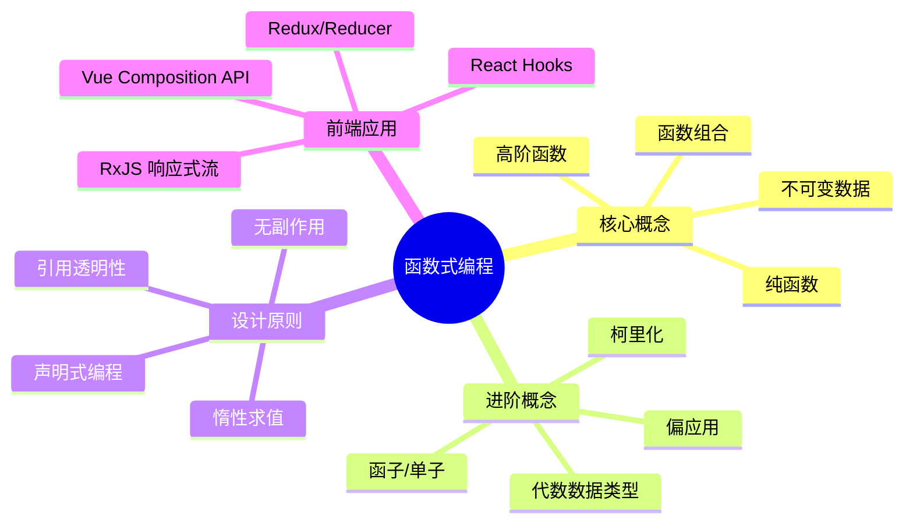

# 函数式编程

函数式编程（Functional Programming）是一种编程范式，它将计算视为数学函数的求值，并避免改变状态和可变数据。在前端开发中，函数式编程已经成为主流的开发模式，特别是在 React 生态系统中



## 为什么要学习函数式编程

### 历史背景

函数式编程是非常古老的编程范式，早于第一台计算机的诞生。了解[函数编程历史](https://zhuanlan.zhihu.com/p/24648375?refer=marisa)可以帮助我们更好地理解其发展脉络。

### 现代发展趋势

1. **React 生态系统的推动**：React Hooks 和函数组件的流行让函数式编程备受关注
2. **Vue 3 的拥抱**：Vue 3 的 Composition API 大量采用函数式编程思想
3. **前端框架演进**：现代前端框架越来越倾向于函数式编程模式
4. **工具库的成熟**：Lodash/fp、Ramda、Immer 等函数式工具库日趋完善，降低了使用门槛

那么，什么是函数式编程？

函数式编程（Functional Programming, FP）是一种编程范式，它将计算过程视为数学函数的求值，避免状态改变和可变数据。

**核心思想**：把现实世界的事物和事物之间的**联系**抽象到程序世界中，对运算过程进行抽象

### 基础示例对比

```javascript
// 非函数式 - 命令式编程
let num1 = 2
let num2 = 3
let sum = num1 + num2
console.log(sum) // 5

// 函数式 - 声明式编程
function add(n1, n2) {
  return n1 + n2
}
let sum2 = add(2, 3)
console.log(sum2) // 5
```

**关键区别**：函数式编程将计算逻辑封装在函数中，强调"做什么"而不是"怎么做"。

## 函数式编程的基本特征

函数式编程建立在几个核心特征之上，它们是整个函数式范式的基石。这里先做整体概览，后续章节会深入讲解每一项。

### 纯函数（Pure Functions）

纯函数是函数式编程的核心：**相同输入总是产生相同输出，且不产生副作用**（不修改外部状态）。

```javascript
// 纯函数：确定性 + 无副作用
const add = (a, b) => a + b
const increment = (count) => count + 1  // 返回新值，不修改外部

// 不纯的函数：修改外部状态
let counter = 0
const badIncrement = () => { counter++; return counter }
```

纯函数带来的核心优势是**可测试性、可缓存性、可并行性和可推理性**。完整深入内容见 [纯函数](15-纯函数.md)。

### 不可变数据（Immutable Data）

不可变数据是指**一旦创建就不能被修改**的数据结构。所有"更新"都通过返回新对象实现，原始数据保持不变。

```javascript
// 不可变更新：返回新对象
const updateUserAge = (user, newAge) => ({ ...user, age: newAge })

const user = { name: '张三', age: 25 }
const updated = updateUserAge(user, 26)
console.log(user.age)    // 25 - 原数据不变
console.log(updated.age) // 26
```

不可变性为状态管理和调试带来巨大好处。完整深入内容见 [不可变数据](16-不可变数据.md)。

### 高阶函数（Higher-Order Functions）

高阶函数是**接受函数作为参数或返回函数**的函数，是代码复用和组合的核心手段。包括 map/filter/reduce 等数组方法、柯里化、记忆化等。

```javascript
const numbers = [1, 2, 3, 4, 5]
const doubled = numbers.map((x) => x * 2)   // [2, 4, 6, 8, 10]
const evens = numbers.filter((x) => x % 2 === 0) // [2, 4]
const sum = numbers.reduce((acc, x) => acc + x, 0) // 15
```

高阶函数是 JavaScript 中最实用的函数式工具，详见 [高阶函数](07-高阶函数.md)。

### 函数组合（Function Composition）

函数组合将多个函数串联成一个新函数，让数据像流水线一样依次流过，是函数式编程"管道化"思想的体现。

```javascript
// 组合：从右往左
const compose = (...fns) => (value) => fns.reduceRight((acc, fn) => fn(acc), value)
// 管道：从左往右
const pipe = (...fns) => (value) => fns.reduce((acc, fn) => fn(acc), value)

const toUpperCase = (s) => s.toUpperCase()
const exclaim = (s) => s + '!'
const shout = compose(exclaim, toUpperCase)
console.log(shout('hello')) // 'HELLO!'
```

组合与高阶函数、柯里化共同构成函数式编程的"积木"，用于构建复杂逻辑。

> 函数式编程还有其他进阶抽象（函子 Functor、单子 Monad 等），详见 [函子与 Monad](17-函子.md)。

## 前端开发中的具体应用

### React 函数组件与 Hooks

React 16.8 引入的 Hooks 使得函数式编程在 React 中变得更加自然和强大。

```javascript
import React, { useState, useEffect, useMemo, useCallback } from "react"

// 纯函数组件
const UserProfile = ({ user, onUpdate }) => {
  // 使用useState管理状态
  const [isEditing, setIsEditing] = useState(false)
  const [editedUser, setEditedUser] = useState(user)

  // 使用useCallback创建稳定的回调函数
  const handleSave = useCallback(() => {
    onUpdate(editedUser)
    setIsEditing(false)
  }, [editedUser, onUpdate])

  // 使用useMemo缓存计算结果
  const displayName = useMemo(() => {
    return editedUser.name || "未知用户"
  }, [editedUser.name])

  const [theme, setTheme] = useState("light")
  const [language, setLanguage] = useState("zh")
  const toggleTheme = () => setTheme((t) => (t === "light" ? "dark" : "light"))

  useEffect(() => {
    document.title = `用户: ${displayName}`
  }, [displayName])

  return (
    <div>
      <h2>{displayName}</h2>
      {isEditing ? (
        <button onClick={handleSave}>保存</button>
      ) : (
        <button onClick={() => setIsEditing(true)}>编辑</button>
      )}
      <p>当前主题: {theme}</p>
      <button onClick={toggleTheme}>切换主题</button>
      <p>当前语言: {language}</p>
    </div>
  )
}
```

### Redux 中的 Reducer 纯函数实现

Redux 是函数式编程在前端状态管理中的典型应用，其核心概念都遵循函数式编程原则。

```javascript
// 纯函数reducer
const initialState = {
  users: [],
  loading: false,
  error: null
}

// Action Types
const ActionTypes = {
  FETCH_USERS_REQUEST: "FETCH_USERS_REQUEST",
  FETCH_USERS_SUCCESS: "FETCH_USERS_SUCCESS",
  FETCH_USERS_FAILURE: "FETCH_USERS_FAILURE"
}

// 纯函数 reducer：接收 (state, action) 返回新 state，不修改原 state
function usersReducer(state = initialState, action) {
  switch (action.type) {
    case ActionTypes.FETCH_USERS_REQUEST:
      return { ...state, loading: true, error: null }
    case ActionTypes.FETCH_USERS_SUCCESS:
      return { ...state, loading: false, users: action.payload }
    case ActionTypes.FETCH_USERS_FAILURE:
      return { ...state, loading: false, error: action.error }
    default:
      return state
  }
}

// 使用 Redux Toolkit 的 createSlice（基于 immer 的内部不可变更新）
const usersSlice = createSlice({
  name: "users",
  initialState,
  reducers: {
    addUser: (state, action) => {
      state.users.push(action.payload)
    },
    updateUser: (state, action) => {
      const index = state.users.findIndex((u) => u.id === action.payload.id)
      if (index !== -1) state.users[index] = action.payload
    },
    deleteUser: (state, action) => {
      state.users = state.users.filter((u) => u.id !== action.payload)
    }
  }
})

export const { addUser, updateUser, deleteUser } = usersSlice.actions
export default usersSlice.reducer
```

### Lodash/FP 等函数式工具库的使用

Lodash FP（Functional Programming）模块提供了函数式编程风格的工具函数。

```javascript
// 传统Lodash与Lodash FP的对比
import _ from "lodash"
import fp from "lodash/fp"

const users = [
  { name: "Alice", age: 25, active: true },
  { name: "Bob", age: 30, active: false },
  { name: "Charlie", age: 35, active: true }
]

// 传统Lodash - 数据在后
const result1 = _.map(users, (user) => user.name)

// Lodash FP - 数据最后传入，便于组合
const getNames = fp.map((user) => user.name)
const result2 = getNames(users)

// 组合多个 fp 操作：筛选出活跃用户的名字并排序
const getActiveUserNamesSorted = fp.flow(
  fp.filter((user) => user.active),
  fp.map((user) => user.name),
  fp.sortBy((name) => name)
)
const result3 = getActiveUserNamesSorted(users)

// 函数式工具封装（方便复用）
const UserUtils = {
  getActiveUsers: (list) => fp.filter((u) => u.active)(list),
  sortByAge: (list) => fp.sortBy((u) => u.age)(list),
  getActiveUserNamesSorted: getActiveUserNamesSorted
}

// 使用函数式工具
const activeUsers = UserUtils.getActiveUsers(users)
const sortedActiveUsers = UserUtils.sortByAge(activeUsers)
const activeUserNames = UserUtils.getActiveUserNamesSorted(users)
```

**创建通用的函数式工具：**

```javascript
// 函数式工具库
const FunctionalUtils = {
  // 管道操作符
  pipe:
    (...fns) =>
    (value) =>
      fns.reduce((acc, fn) => fn(acc), value),

  // 组合操作符
  compose:
    (...fns) =>
    (value) =>
      fns.reduceRight((acc, fn) => fn(acc), value),

  // 记忆化
  memoize: (fn) => {
    const cache = new Map()
    return (n) => {
      if (cache.has(n)) {
        return cache.get(n)
      }
      const result = fn(n)
      cache.set(n, result)
      return result
    }
  },

  // 柯里化
  curry: (fn) => {
    const arity = fn.length
    return function curried(...args) {
      if (args.length >= arity) {
        return fn(...args)
      }
      return (...more) => curried(...args, ...more)
    }
  }
}

// 使用 FunctionalUtils 记忆化
const expensiveCalculation = FunctionalUtils.memoize((n) => {
  console.log(`计算 ${n} 的平方...`)
  return n * n
})

console.log(expensiveCalculation(5)) // 计算并缓存
console.log(expensiveCalculation(5)) // 直接从缓存获取
```

### 异步操作的函数式处理

函数式编程在处理异步操作时，通常使用 Promise、async/await 等概念

```javascript
// 函数式的异步处理
class Task {
  constructor(fn) {
    this.fn = fn
  }

  static of(value) {
    return new Task((resolve) => resolve(value))
  }

  static reject(error) {
    return new Task((_, reject) => reject(error))
  }

  // 组合：将结果传给下一个 Task
  map(fn) {
    return new Task((resolve, reject) => {
      this.fn(
        (value) => resolve(fn(value)),
        reject
      )
    })
  }

  // 链式调用：展平嵌套 Task
  chain(fn) {
    return new Task((resolve, reject) => {
      this.fn(
        (value) => fn(value).run(resolve, reject),
        reject
      )
    })
  }

  // 执行 Task
  run(resolve, reject) {
    return this.fn(resolve, reject)
  }

  // 转换为 Promise
  toPromise() {
    return new Promise((resolve, reject) => this.run(resolve, reject))
  }
}

// 模拟带重试的异步请求
function fetchData(url, retries) {
  return new Task((resolve, reject) => {
    const attempt = (n) => {
      fetch(url)
        .then((r) => r.json())
        .then(resolve)
        .catch(() => {
          if (n > 0) {
            setTimeout(() => attempt(n - 1), 1000)
          } else {
            reject(new Error(`请求失败: ${url}`))
          }
        })
    }
    attempt(retries)
  })
}

const fetchDataWithRetry = fetchData("/api/data", 3)

fetchDataWithRetry
  .then((data) => console.log("成功获取数据:", data))
  .catch((error) => console.error("最终失败:", error))
```

## 与传统面向对象编程的对比

### 状态管理方式的差异

```javascript
// 面向对象编程 - 封装状态和方法
class UserManager {
  constructor() {
    this.users = []
    this.currentUser = null
  }

  addUser(user) {
    this.users.push(user)
  }

  setCurrentUser(userId) {
    this.currentUser = this.users.find((u) => u.id === userId) || null
  }
}

// 函数式编程 - 不可变状态管理（纯函数返回新状态）
const createUserManager = (initialState = { users: [], currentUser: null }) => {
  const addUser = (state, user) => ({
    ...state,
    users: [...state.users, user]
  })
  const setCurrentUser = (state, userId) => ({
    ...state,
    currentUser: state.users.find((u) => u.id === userId) || null
  })
  return { initialState, addUser, setCurrentUser }
}

// 使用：每次操作都返回全新状态，原状态不变
const { initialState, addUser, setCurrentUser } = createUserManager()
const state1 = addUser(initialState, { id: 1, name: "Alice" })
const state2 = setCurrentUser(state1, 1)
console.log(state1.currentUser) // null（原状态不变）
console.log(state2.currentUser) // { id: 1, name: "Alice" }
```

### 代码可测试性比较

```javascript
// 面向对象编程 - 需要mock和复杂的测试设置
class PaymentService {
  constructor(database, logger) {
    this.database = database
    this.logger = logger
  }

  async processPayment(userId, amount) {
    try {
      const user = await this.database.findUser(userId)
      if (user.balance < amount) {
        throw new Error("余额不足")
      }
      await this.database.updateBalance(userId, user.balance - amount)
      this.logger.log(`用户 ${userId} 支付 ${amount}`)
    } catch (error) {
      this.logger.error(error)
      throw error
    }
  }
}

// 函数式版本 - 依赖注入，测试无需 mock
const processPayment = (findUser, updateBalance, log, errorLog) =>
  async (userId, amount) => {
    try {
      const user = await findUser(userId)
      if (user.balance < amount) throw new Error("余额不足")
      await updateBalance(userId, user.balance - amount)
      log(userId, amount)
    } catch (error) {
      errorLog(error)
      throw error
    }
  }

// 函数式版本测试：直接传入 mock 依赖
// test("processPayment 调用 updateBalance", async () => {
//   const findUser = async (id) => ({ id, balance: 100 });
//   const updateBalance = jest.fn();
//   const log = jest.fn();
//   const errorLog = jest.fn();
//
//   const payment = processPayment(findUser, updateBalance, log, errorLog);
//   await payment(1, 50);
//
//   expect(updateBalance).toHaveBeenCalledWith(1, 50);
// });
```

### 性能优化策略的区别

```javascript
// 面向对象编程 - 通常使用缓存和状态管理
class DataProcessor {
  constructor() {
    this.cache = new Map()
  }

  processData(data) {
    const cacheKey = JSON.stringify(data)

    if (this.cache.has(cacheKey)) {
      return this.cache.get(cacheKey)
    }

    const result = this.processInternal(data)
    this.cache.set(cacheKey, result)
    return result
  }

  processInternal(data) {
    return data.map((item) => item * 2)
  }
}

// 函数式编程 - 利用框架的记忆化（useMemo）
function FunctionalDataComponent({ data }) {
  // 只有 data 变化时才重新计算，否则复用缓存
  const processedData = useMemo(() => {
    return expensiveOperation(data)
  }, [data])

  return <div>结果: {processedData}</div>
}
```

## 最佳实践案例

### 使用 Ramda 进行数据转换

```javascript
import R from "ramda"

// 示例数据
const users = [
  { id: 1, name: "Alice", age: 25, department: "Engineering", salary: 80000 },
  { id: 2, name: "Bob", age: 30, department: "Marketing", salary: 60000 },
  { id: 3, name: "Charlie", age: 35, department: "Engineering", salary: 90000 },
  { id: 4, name: "David", age: 28, department: "Sales", salary: 55000 },
  { id: 5, name: "Eve", age: 32, department: "Engineering", salary: 85000 }
]

// 1. 数据筛选和转换（Ramda 管道式组合）
const getEngineeringSalaries = R.pipe(
  R.filter((u) => u.department === "Engineering"),
  R.map((u) => u.salary)
)
const engineeringSalaries = getEngineeringSalaries(users)
console.log("工程部薪资:", engineeringSalaries)

// 2. 按部门分组统计
const groupByDepartment = R.pipe(
  R.groupBy((u) => u.department),
  R.mapObjIndexed((deptUsers) => deptUsers.length)
)
console.log("各部门人数:", groupByDepartment(users))

// 3. 可复用的函数式转换工具
const UserTransformations = {
  // 生成用户报告
  generateUserReport: R.pipe(
    R.sortBy((u) => u.salary),
    R.map((u) => ({ id: u.id, name: u.name, department: u.department }))
  ),
  // 计算某部门平均年龄
  getDepartmentAverageAge: (department) => R.pipe(
    R.filter((u) => u.department === department),
    R.map((u) => u.age),
    (ages) => R.sum(ages) / ages.length
  )
}

const report = UserTransformations.generateUserReport(users)
console.log("用户报告:", report)

const avgEngineeringAge =
  UserTransformations.getDepartmentAverageAge("Engineering")(users)
console.log("工程部平均年龄:", avgEngineeringAge)
```

### 实现可复用的函数式工具

```javascript
// 1. 函数式错误处理 - Either Monad
class Either {
  constructor(value, isRight = true) {
    this.value = value
    this.isRight = isRight
  }

  static right(value) {
    return new Either(value, true)
  }

  static left(value) {
    return new Either(value, false)
  }

  map(fn) {
    // Right 才应用函数，Left 保持原样（短路）
    return this.isRight ? Either.right(fn(this.value)) : this
  }

  chain(fn) {
    return this.isRight ? fn(this.value) : this
  }

  // 处理两个分支
  fold(onLeft, onRight) {
    return this.isRight ? onRight(this.value) : onLeft(this.value)
  }
}

// 使用 Either 处理大数据集
function processLargeDataset(dataset) {
  if (!Array.isArray(dataset) || dataset.length === 0) {
    return Promise.reject(new Error("数据集为空"))
  }
  // 逐条处理，遇到错误返回 Left
  const results = dataset.map((item) => {
    try {
      return Either.right(item.data.toUpperCase())
    } catch (e) {
      return Either.left(e)
    }
  })
  // 折叠：若全部成功返回 Right，否则返回 Left
  const failed = results.find((r) => !r.isRight)
  if (failed) {
    return Promise.reject(failed.value)
  }
  return Promise.resolve(results.map((r) => r.value))
}

const largeDataset = Array.from({ length: 100 }, (_, i) => ({
  data: `item_${i + 1}`
}))

processLargeDataset(largeDataset)
  .then((result) => console.log(`处理了 ${result.length} 条数据`))
  .catch((error) => console.error("处理失败:", error))
```

### 错误处理的函数式方案

```javascript
// 1. Maybe Monad - 处理空值
class Maybe {
  constructor(value) {
    this.value = value
  }

  static of(value) {
    return new Maybe(value)
  }

  static nothing() {
    return new Maybe(null)
  }

  // 空值检查：null/undefined 视为 Nothing
  isNothing() {
    return this.value === null || this.value === undefined
  }

  // 对值应用函数，空值则短路
  map(fn) {
    return this.isNothing() ? this : Maybe.of(fn(this.value))
  }

  // 链式调用，展平嵌套
  chain(fn) {
    return this.isNothing() ? this : fn(this.value)
  }

  // 提供默认值
  getOrElse(defaultValue) {
    return this.isNothing() ? defaultValue : this.value
  }
}

// 使用 Maybe 包装可能失败的异步操作
function safeOperation(input) {
  return new Promise((resolve, reject) => {
    try {
      const result = Maybe.of(input)
        .map((n) => n * 2)
        .map((n) => n + 10)
        .getOrElse("输入为空")
      resolve(result)
    } catch (e) {
      reject(new Error("无法恢复的错误: " + e.message))
    }
  })
}

// 测试
safeOperation(42)
  .then((result) => console.log("操作成功:", result))
  .catch((error) => console.error("无法恢复的错误:", error))
```

## 总结

函数式编程在前端开发中提供了许多优势：

1. **可预测性**：纯函数和不可变数据使得程序行为更加可预测
2. **可测试性**：纯函数易于单元测试，不需要复杂的测试环境
3. **可组合性**：函数组合和高阶函数提供了强大的代码复用能力
4. **并发安全**：无副作用的特性使得并发编程更加安全
5. **调试友好**：函数式代码通常更容易调试和理解

在实际项目中，函数式编程不是银弹，应该根据具体场景选择合适的编程范式。现代前端开发通常是多范式的，结合函数式编程和面向对象编程的优点，才能构建出既健壮又易于维护的应用程序。

通过合理使用纯函数、不可变数据、高阶函数、函数组合等概念，以及利用 Ramda、Lodash FP 等工具库，我们可以写出更加优雅和可维护的前端代码。同时，函数式编程的错误处理机制也为构建可靠的异步应用提供了强大的支持
