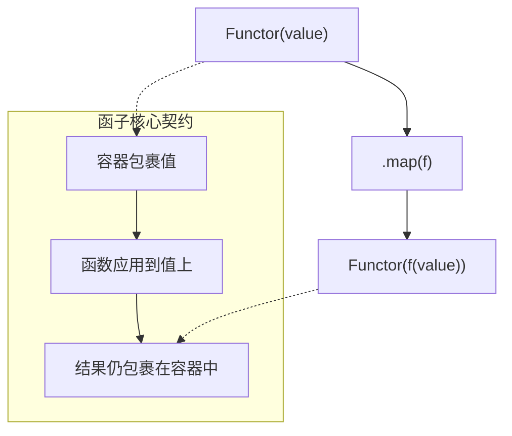

# 前端开发中的函子 (Functor) 详解

函子（Functor）是函数式编程中的一个核心概念，它源于范畴论，但在编程中可以被理解为一种设计模式。它提供了一种抽象，让我们能够以一种统一、可预测的方式来处理包裹在“容器”或“上下文”中的值。



> 📊 函子的核心契约：**映射后返回同类型的容器**，确保操作链可以持续组合。

## 1. 函子的基本定义

### 什么是函子？

在编程中，函子可以被认为是一个“容器”或者一个“盒子”，这个容器里装着一个值。这个容器最重要的一点是，它必须提供一个 `map` 方法。`map` 方法接收一个函数作为参数，然后将这个函数应用到容器内的值上，最后返回一个**新的、装着处理后结果的同类型容器**。

这个过程的关键在于，我们从不直接操作容器内的值。所有的操作都是通过 `map` 来委托执行的，这使得我们的操作是抽象和安全的。

## 2. 函子的数学背景与函数式编程角色

函子（Functor）概念源于范畴论（Category Theory），是数学中描述"结构之间保持关系的映射"的一种抽象。在函数式编程中，函子扮演着关键角色：

- **结构保持**：函子将值放进一个上下文（容器）中，并通过 `map` 保持容器的结构不变，只对内部值进行变换。
- **提升与封装**：它把普通值"提升"到某个上下文里，把副作用、空值、异常等边缘情况封装起来，让主逻辑保持纯粹。
- **组合基础**：函子是更高级抽象（应用函子、单子 Monad）的基石，是实现管道式数据流的基础设施。

可以这样理解：函子像一条"传送带"，你不需要自己把货物搬进搬出，只需在传送带上放置处理函数，货物就会被自动搬运并加工。

## 3. 函子的核心特征

### `map` 方法的实现

`map` 是函子的灵魂。一个标准的函子实现必须包含 `map` 方法。

```typescript
interface Functor<T> {
  map<U>(fn: (value: T) => U): Functor<U>
}
```

`map` 方法接收一个函数 `fn`，将其应用于内部值 `T`，然后返回一个包含新值 `U` 的同类型函子 `Functor<U>`。

### 函子定律 (Functor Laws)

为了保证函子的行为是可预测和可靠的，它必须遵守两条定律。这些定律不是由编译器强制执行的，而是需要开发者自觉遵守的约定。

1.  **同一律 (Identity)**

    > `F.map(x => x) === F`

    用 `map` 方法应用一个身份函数（即返回参数自身的函数），得到的结果应该和原函子相等。这意味着 `map` 不应该带来任何额外的副作用。

2.  **结合律 (Composition)**

    > `F.map(f).map(g) === F.map(x => g(f(x)))`

    将函子连续 `map` 两次（先 `f` 后 `g`），其结果应该等同于一次性 `map` 一个组合函数 `g(f(x))`。这保证了 `map` 操作的顺序无关紧要，可以安全地进行组合和重构。

---

## 4. 具体代码示例 (TypeScript)

### 基础函子

```typescript
class Functor<T> {
  protected constructor(protected readonly value: T) {}

  static of<T>(value: T): Functor<T> {
    return new Functor(value)
  }

  map<U>(fn: (value: T) => U): Functor<U> {
    return Functor.of(fn(this.value))
  }
}
```

### Maybe 函子实现

```typescript
// Maybe 抽象基类
abstract class Maybe<T> {
  static of<T>(value: T | null | undefined): Maybe<T> {
    return value == null ? new Nothing() : new Just(value)
  }

  abstract map<U>(fn: (value: T) => U): Maybe<U>
}

// Just 子类：有值的情况
class Just<T> extends Maybe<T> {
  constructor(private readonly value: T) {
    super()
  }

  map<U>(fn: (value: T) => U): Maybe<U> {
    return new Just(fn(this.value))
  }

  getOrElse(_default: T): T {
    return this.value
  }
}

// Nothing 子类：空值的情况
class Nothing<T> extends Maybe<T> {
  map<U>(_fn: (value: T) => U): Maybe<U> {
    return new Nothing()
  }

  getOrElse(defaultValue: T): T {
    return defaultValue
  }
}

// ---- 使用 ----
const user = { profile: { name: "Alice" } }
const noProfileUser = {}

function getName(u: { profile?: { name?: string } }): string {
  return Maybe.of(u.profile)
    .map((profile) => profile.name)
    .getOrElse("Guest")
}

console.log(getName(user)) // "Alice"
console.log(getName(noProfileUser)) // "Guest"
```

### Either 函子实现

```typescript
// Either 抽象基类
abstract class Either<L, R> {
  abstract map<U>(fn: (value: R) => U): Either<L, U>
  abstract chain<U>(fn: (value: R) => Either<L, U>): Either<L, U> // 用于 Monad
}

// Right 子类 (成功)
class Right<L, R> extends Either<L, R> {
  constructor(private readonly value: R) {
    super()
  }

  map<U>(fn: (value: R) => U): Either<L, U> {
    return new Right(fn(this.value))
  }

  chain<U>(fn: (value: R) => Either<L, U>): Either<L, U> {
    return fn(this.value)
  }
}

// Left 子类 (失败)
class Left<L, R> extends Either<L, R> {
  constructor(private readonly value: L) {
    super()
  }

  map<U>(_fn: (value: R) => U): Either<L, U> {
    return new Left(this.value) // 短路，跳过处理
  }

  chain<U>(_fn: (value: R) => Either<L, U>): Either<L, U> {
    return new Left(this.value) // 短路，跳过处理
  }
}

// ---- 使用：安全的 JSON 解析 ----
function parseJSON(json: string): Either<Error, any> {
  try {
    return new Right(JSON.parse(json))
  } catch (e) {
    return new Left(e as Error)
  }
}

parseJSON('{"a":1}')
  .map((data) => data.a)
  .map((a) => a + 1)
  .chain((result) => new Right(`Success: ${result}`)) // Right("Success: 2")

parseJSON("{invalid json}")
  .map((data) => data.a) // 不会执行
  .chain((result) => new Right(`Success: ${result}`)) // Left(Error: ...)
```

### IO 函子实现

```typescript
class IO<T> {
  constructor(private readonly effect: () => T) {}

  static of<T>(value: T): IO<T> {
    return new IO(() => value)
  }

  map<U>(fn: (value: T) => U): IO<U> {
    return new IO(() => fn(this.effect()))
  }

  // "不安全"的执行方法：真正触发现有副作用
  unsafePerformIO(): T {
    return this.effect()
  }
}

// ---- 使用：延迟副作用 ----
// 将可能失败的 I/O 操作延迟到真正需要时执行
const getStoredName = new IO(() => localStorage.getItem("username"))
  .map((name) => name ?? "Anonymous")
  .map((name) => name.toUpperCase())

// 此时副作用尚未发生，仅定义了执行计划

// 在需要时执行
// localStorage.setItem('username', 'bob');
const result = getStoredName.unsafePerformIO()
console.log(result) // "BOB"
```

---

## 5. 实际应用场景

1.  **安全地处理数据**：从 API 获取的数据结构可能不完整。使用 `Maybe` 函子可以安全地访问深层嵌套的属性，避免代码中充斥着 `&&` 逻辑判断。

2.  **优雅的错误处理**：在进行表单验证、数据解析或任何可能失败的计算时，`Either` 函子提供了一个清晰的成功/失败流程，使错误处理逻辑更加线性化和可组合。

3.  **隔离副作用**：在 React/Vue 等框架中，组件的渲染逻辑应该是纯的。可以将与外部世界的交互（如 API 请求、DOM 查询）封装在 `IO` 函子中，在组件的生命周期钩子（如 `useEffect`）或事件处理器中最后执行。

4.  **配置与组合**：函子允许我们构建可复用的、可组合的函数管道。例如，可以创建一个处理用户输入的管道，依次进行 `trim`、`toUpperCase`、`validate` 等操作，而无需关心初始输入是否存在。

---

## 6. 性能考量

- **开销**：每次调用 `map` 都会创建一个新的函子实例。在性能敏感或高频执行的场景（如动画循环）中，这可能会引入额外的内存分配和垃圾回收开销。
- **权衡**：函子的主要优势在于代码的可读性、可维护性和健壮性。在大多数前端应用中，性能瓶颈通常在于 DOM 操作、网络延迟或复杂的算法，而不是函子本身带来的开销。
- **优化建议**：
  - **避免滥用**：对于简单、无风险的操作，直接调用函数可能更高效。
  - **遵守定律**：利用函子定律进行代码重构，例如将多个 `map` 合并为一个，以减少中间实例的创建。
  - **性能分析**：在怀疑函子是性能瓶颈时，使用性能分析工具进行测量，而不是过早优化。

---

## 7. 与其他函数式概念的对比

函子是函数式编程中一系列相关概念的起点。

- **应用函子 (Applicative Functor)**

  - **是什么**：一个加强版的函子，它提供一个 `ap` 方法。`ap` 方法可以将一个**包裹在函子里的函数**应用到一个**包裹在函子里的值**上。
  - **关系**：所有应用函子都是函子。
  - **用途**：当一个函数有多个参数，且每个参数都来自一个函子时，应用函子非常有用。例如 `Maybe.of(add).ap(Maybe.of(2)).ap(Maybe.of(3))`。

- **单子 (Monad)**
  - **是什么**：一个加强版的应用函子，它提供一个 `flatMap`（或 `chain`）方法。`flatMap` 方法可以解决函子嵌套的问题（`Functor<Functor<T>>`）。它会执行 `map` 操作，然后将结果“压平”一层。
  - **关系**：所有单子都是应用函子，也都是函子。
  - **用途**：当一系列操作相互依赖，并且每一步都返回一个新的函子时，单子是必不可少的。例如，第一个 API 请求的结果是第二个 API 请求的参数。

| 概念                       | 核心方法             | 解决的问题                     | 示例                                |
| :------------------------- | :------------------- | :----------------------------- | :---------------------------------- |
| **函子 (Functor)**         | `map(a -> b)`        | 将普通函数应用于容器内的值     | `Maybe.of(5).map(x => x + 1)`       |
| **应用函子 (Applicative)** | `ap(F(a -> b))`      | 将容器内的函数应用于容器内的值 | `Maybe.of(add).ap(Maybe.of(2))`     |
| **单子 (Monad)**           | `flatMap(a -> M(b))` | 解决容器嵌套，实现依赖链式调用 | `getUser().flatMap(getPostsByUser)` |

通过理解函子，为掌握更高级的函数式概念（如应用函子和单子）打下了坚实的基础，从而能够编写出更强大、更优雅的前端代码
