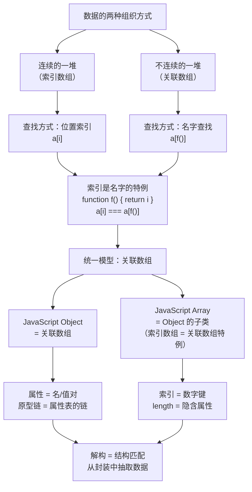

# 对象基础

## 概述

对象（Object）是 JavaScript 中最核心的数据类型，是一种**引用类型**（Reference Type），用于存储键值对（key-value pairs）的集合。对象是 JavaScript 中几乎所有复杂值的基础，理解对象的特性对于掌握 JavaScript 至关重要。

### 对象的特征

- **引用类型**：对象通过引用访问，而非值
- **动态性**：属性可以随时添加、修改或删除
- **灵活性**：键可以是字符串或 Symbol，值可以是任意类型
- **原型继承**：对象可以继承其他对象的属性和方法

### 对象与其他数据类型的区别

```javascript
// 原始类型（值类型）：按值访问
let a = 10
let b = a
b = 20
console.log(a)  // 10（值不受影响）

// 对象类型（引用类型）：按引用访问
let obj1 = { name: 'John' }
let obj2 = obj1
obj2.name = 'Jane'
console.log(obj1.name)  // 'Jane'（原对象被修改）
```

## 对象的创建

JavaScript 提供了多种创建对象的方式，每种方式都有其适用场景。

### 1. 对象字面量（推荐）

最常用、最简洁的对象创建方式：

```javascript
// 基本语法
const obj = {
  name: 'John',
  age: 30,
  sayHello: function() {
    console.log('Hello!')
  }
}

// ES6 属性简写
const name = 'John'
const age = 30
const obj = { name, age }  // 等价于 { name: 'John', age: 30 }

// ES6 方法简写
const obj2 = {
  name: 'John',
  sayHello() {  // 等价于 sayHello: function() { ... }
    console.log('Hello!')
  }
}

// 计算属性名（ES6）
const key = 'name'
const obj3 = {
  [key]: 'John',
  ['full' + 'Name']: 'John Doe'
}
console.log(obj3.name)      // 'John'
console.log(obj3.fullName)  // 'John Doe'
```

**适用场景**：创建一次性对象、配置对象、简单的数据结构。

### 2. new Object()

通过构造函数创建：

```javascript
const obj = new Object()
obj.name = 'John'
obj.age = 30

// 等价于
const obj = { name: 'John', age: 30 }
```

**注意**：这种方式较少使用，对象字面量更简洁。

### 3. Object.create()

创建指定原型的对象：

```javascript
// 创建无原型的纯净对象
const obj = Object.create(null)
obj.name = 'John'
console.log(obj.toString)  // undefined（无继承方法）

// 创建指定原型的对象
const proto = {
  sayHello() {
    console.log('Hello!')
  }
}
const obj = Object.create(proto)
obj.name = 'John'
obj.sayHello()  // 'Hello!'

// 创建带属性的对象
const obj2 = Object.create(Object.prototype, {
  name: {
    value: 'John',
    writable: true,
    enumerable: true
  }
})
```

**适用场景**：需要精确控制原型链、创建纯净对象（无原型）、实现继承。

### 4. 构造函数模式

使用函数构造对象：

```javascript
function Person(name, age) {
  // 实例属性
  this.name = name
  this.age = age
  
  // 实例方法（不推荐，每次创建都会创建新的函数）
  this.sayHello = function() {
    console.log('Hello!')
  }
}

// 原型方法（推荐，所有实例共享）
Person.prototype.sayHi = function() {
  console.log('Hi, I am ' + this.name)
}

const person = new Person('John', 30)
console.log(person.name)      // 'John'
person.sayHi()                // 'Hi, I am John'
```

**构造函数的执行过程**：
1. 创建一个新对象
2. 将新对象的 `__proto__` 指向构造函数的 `prototype`
3. 执行构造函数代码，绑定 `this` 到新对象
4. 返回新对象（除非构造函数返回对象）

### 5. class 语法（ES6）

语法糖，本质仍是构造函数：

```javascript
class Person {
  // 构造函数
  constructor(name, age) {
    this.name = name
    this.age = age
  }
  
  // 实例方法（自动添加到原型）
  sayHello() {
    console.log('Hello!')
  }

  // 访问器属性（定义在原型上）
  get info() {
    return `${this.name}, ${this.age} years old`
  }
  set info(value) {
    ;[this.name, this.age] = value.split(', ')
  }

  // 静态方法（定义在类上，而非实例上）
  static create(name, age) {
    return new Person(name, age)
  }
}

const person = new Person('John', 30)
console.log(person.info)  // 'John, 30 years old'
person.info = 'Jane, 25'
console.log(person.name)  // 'Jane'

// 静态方法调用
const person2 = Person.create('Bob', 28)
```

**适用场景**：创建多个相似对象、实现面向对象编程。

### 创建方式对比

| 方式 | 简洁性 | 灵活性 | 原型控制 | 适用场景 |
|------|--------|--------|----------|----------|
| 对象字面量 | ⭐⭐⭐⭐⭐ | ⭐⭐ | ⭐ | 简单对象、配置项 |
| new Object() | ⭐⭐ | ⭐⭐ | ⭐ | 较少使用 |
| Object.create() | ⭐⭐⭐ | ⭐⭐⭐⭐⭐ | ⭐⭐⭐⭐⭐ | 继承、纯净对象 |
| 构造函数 | ⭐⭐⭐ | ⭐⭐⭐ | ⭐⭐⭐⭐ | 批量创建对象 |
| class | ⭐⭐⭐⭐ | ⭐⭐⭐⭐ | ⭐⭐⭐⭐ | 面向对象编程 |

## 属性描述符 ⚠️

每个对象属性都有对应的属性描述符（Property Descriptor），用于定义属性的行为特性。属性描述符分为两种类型：

### 描述符类型

#### 1. 数据描述符（Data Descriptor）

包含属性值的描述符：

```javascript
{
  value: any,          // 属性值，默认 undefined
  writable: boolean,   // 是否可修改值，默认 false
  enumerable: boolean, // 是否可枚举，默认 false
  configurable: boolean // 是否可配置，默认 false
}
```

#### 2. 访问器描述符（Accessor Descriptor）

包含 getter/setter 的描述符：

```javascript
{
  get: function,       // getter 函数，默认 undefined
  set: function,       // setter 函数，默认 undefined
  enumerable: boolean, // 是否可枚举，默认 false
  configurable: boolean // 是否可配置，默认 false
}
```

**注意**：数据描述符和访问器描述符不能同时存在（`value/writable` 与 `get/set` 互斥）。

### 查看属性描述符

```javascript
const obj = { name: 'John' }

// 获取单个属性描述符
const descriptor = Object.getOwnPropertyDescriptor(obj, 'name')
console.log(descriptor)
// {
//   value: 'John',
//   writable: true,
//   enumerable: true,
//   configurable: true
// }

// 获取所有属性描述符（ES8）
const descriptors = Object.getOwnPropertyDescriptors(obj)
console.log(descriptors)
// {
//   name: {
//     value: 'John',
//     writable: true,
//     enumerable: true,
//     configurable: true
//   }
// }
```

### 属性特性详解

#### writable（可写性）

控制属性值是否可被修改：

```javascript
const obj = {}

Object.defineProperty(obj, 'name', {
  value: 'John',
  writable: false  // 不可写
})

obj.name = 'Jane'  // 静默失败
console.log(obj.name)  // 'John'

// 严格模式会抛出错误
'use strict'
obj.name = 'Jane'  // TypeError: Cannot assign to read only property
```

#### enumerable（可枚举性）

控制属性是否出现在枚举操作中：

```javascript
const obj = {}

Object.defineProperty(obj, 'name', {
  value: 'John',
  enumerable: true   // 可枚举
})

Object.defineProperty(obj, 'id', {
  value: 1,
  enumerable: false  // 不可枚举
})

console.log(Object.keys(obj))           // ['name']
console.log('name' in obj)              // true
console.log(obj.propertyIsEnumerable('name'))  // true
console.log(obj.propertyIsEnumerable('id'))    // false

// JSON.stringify 会忽略不可枚举属性
console.log(JSON.stringify(obj))  // '{"name":"John"}'
```

**影响 enumerable 的操作**：
- `for...in` 循环
- `Object.keys()`
- `Object.values()`
- `Object.entries()`
- `JSON.stringify()`

**不影响 enumerable 的操作**：
- `Object.getOwnPropertyNames()`
- `Object.getOwnPropertySymbols()`
- `Reflect.ownKeys()`

#### configurable（可配置性）

控制属性描述符是否可修改、属性是否可删除：

```javascript
const obj = {}

Object.defineProperty(obj, 'name', {
  value: 'John',
  writable: true,
  configurable: false  // 不可配置
})

// 不能再次定义属性
Object.defineProperty(obj, 'name', {
  value: 'Jane'
})  // TypeError: Cannot redefine property

// 不能删除属性
delete obj.name  // false
console.log(obj.name)  // 'John'

// 特殊情况：writable 从 true 改为 false 是允许的
Object.defineProperty(obj, 'name', {
  writable: false
})  // 成功
```

**注意**：`configurable: false` 后，属性类型不可改变，但 `writable: true` 可以改为 `false`。

### 定义属性

#### Object.defineProperty()

定义或修改单个属性：

```javascript
const obj = {}

// 定义数据属性
Object.defineProperty(obj, 'name', {
  value: 'John',
  writable: false,
  enumerable: true,
  configurable: false
})

obj.name = 'Jane'  // 无效
console.log(obj.name)  // 'John'

// 定义访问器属性
Object.defineProperty(obj, 'fullName', {
  get() {
    return this._firstName + ' ' + this._lastName
  },
  set(value) {
    [this._firstName, this._lastName] = value.split(' ')
  },
  enumerable: true,
  configurable: true
})

obj.fullName = 'John Doe'
console.log(obj.fullName)  // 'John Doe'
```

#### Object.defineProperties()

定义或修改多个属性：

```javascript
const obj = {}

Object.defineProperties(obj, {
  name: {
    value: 'John',
    writable: true,
    enumerable: true
  },
  age: {
    value: 30,
    writable: false,
    enumerable: true
  },
  info: {
    get() {
      return `${this.name}, ${this.age} years old`
    },
    enumerable: true
  }
})

console.log(obj.name)     // 'John'
console.log(obj.info)     // 'John, 30 years old'
```

### 实际应用场景

#### 1. 创建常量属性

```javascript
const config = {}

Object.defineProperty(config, 'API_URL', {
  value: 'https://api.example.com',
  writable: false,
  configurable: false
})

config.API_URL = 'other'  // 无效
delete config.API_URL     // 无效
```

#### 2. 实现数据双向绑定

```javascript
const data = {}

Object.defineProperty(data, 'value', {
  get() {
    console.log('读取 value')
    return this._value
  },
  set(newValue) {
    console.log('设置 value 为', newValue)
    this._value = newValue
    // 触发更新
    updateView(newValue)
  }
})

function updateView(value) {
  console.log('更新视图:', value)
}

data.value = 'Hello'  // 设置 value 为 Hello \n 更新视图: Hello
console.log(data.value)  // 读取 value \n Hello
```

#### 3. 隐藏内部属性

```javascript
const obj = {
  name: 'John'
}

Object.defineProperty(obj, '_internalId', {
  value: 12345,
  enumerable: false,  // 不可枚举，隐藏属性
  writable: false
})

console.log(Object.keys(obj))  // ['name']（_internalId 被隐藏）
console.log(obj._internalId)   // 12345（但可访问）
```

### 属性描述符默认值

使用 `Object.defineProperty()` 时，默认值为：

```javascript
Object.defineProperty(obj, 'name', {})
// 等价于
Object.defineProperty(obj, 'name', {
  value: undefined,
  writable: false,
  enumerable: false,
  configurable: false
})
```

**对比**：使用对象字面量创建的属性，默认为 `true`：

```javascript
const obj = { name: 'John' }
// 属性描述符默认：
// { value: 'John', writable: true, enumerable: true, configurable: true }
```

## Getter 和 Setter

Getter 和 Setter 是访问器属性的核心，用于拦截属性的读取和设置操作，实现数据封装和验证。

### 基本用法

#### 对象字面量语法

```javascript
const obj = {
  _name: 'John',  // 内部属性
  
  // getter
  get name() {
    console.log('读取 name 属性')
    return this._name
  },
  
  // setter
  set name(value) {
    console.log('设置 name 属性')
    if (typeof value === 'string' && value.trim()) {
      this._name = value.trim()
    } else {
      throw new Error('Invalid name')
    }
  }
}

console.log(obj.name)  // '读取 name 属性' \n 'John'
obj.name = 'Jane'      // '设置 name 属性'
console.log(obj.name)  // 'Jane'
```

#### defineProperty 语法

```javascript
const obj = {
  _firstName: 'John',
  _lastName: 'Doe'
}

Object.defineProperty(obj, 'fullName', {
  get() {
    return `${this._firstName} ${this._lastName}`
  },
  set(value) {
    const parts = value.split(' ')
    if (parts.length === 2) {
      this._firstName = parts[0]
      this._lastName = parts[1]
    }
  },
  enumerable: true,
  configurable: true
})

console.log(obj.fullName)  // 'John Doe'
obj.fullName = 'Jane Smith'
console.log(obj._firstName)  // 'Jane'
```

### 应用场景

#### 1. 数据验证

```javascript
class User {
  constructor(name, age) {
    this._name = name
    this._age = age
  }
  
  get name() {
    return this._name
  }
  
  set name(value) {
    if (typeof value !== 'string') {
      throw new TypeError('Name must be a string')
    }
    this._name = value
  }

  get age() {
    return this._age
  }

  set age(value) {
    if (value < 0 || value > 150) {
      throw new RangeError('Age must be between 0 and 150')
    }
    this._age = value
  }
}

const user = new User('John', 30)
user.age = -5  // RangeError: Age must be between 0 and 150
```

#### 2. 计算属性

```javascript
const rectangle = {
  width: 10,
  height: 5,
  
  get area() {
    return this.width * this.height
  },
  
  get perimeter() {
    return 2 * (this.width + this.height)
  }
}

console.log(rectangle.area)       // 50
console.log(rectangle.perimeter)  // 30

rectangle.width = 20
console.log(rectangle.area)       // 100（自动更新）
```

#### 3. 懒加载

```javascript
class DataLoader {
  constructor() {
    this._data = null
  }
  
  get data() {
    if (this._data === null) {
      console.log('首次访问，加载数据...')
      this._data = this.loadData()
    }
    return this._data
  }
  
  loadData() {
    // 模拟耗时操作
    return [1, 2, 3, 4, 5]
  }
}

const loader = new DataLoader()
console.log(loader.data)  // 首次访问，加载数据... \n [1, 2, 3, 4, 5]
console.log(loader.data)  // [1, 2, 3, 4, 5]（已缓存）
```

#### 4. 数据劫持（响应式原理）

```javascript
function observe(obj) {
  const watchers = new Map()

  return new Proxy(obj, {
    get(target, key) {
      if (key === 'watch') {
        return (watchKey, fn) => {
          if (!watchers.has(watchKey)) watchers.set(watchKey, [])
          watchers.get(watchKey).push(fn)
        }
      }
      return target[key]
    },
    set(target, key, value) {
      const oldValue = target[key]
      target[key] = value

      if (oldValue !== value) {
        ;(watchers.get(key) || []).forEach(fn => fn(value, oldValue))
      }
      return true  // set 拦截器必须返回 true，否则严格模式下报错
    }
  })
}

const data = observe({ name: 'John' })

data.watch('name', (newValue, oldValue) => {
  console.log(`name changed from ${oldValue} to ${newValue}`)
})

data.name = 'Jane'  // name changed from John to Jane
```

### 只读属性

只定义 getter，不定义 setter：

```javascript
const config = {
  _apiUrl: 'https://api.example.com',
  
  get apiUrl() {
    return this._apiUrl
  }
}

console.log(config.apiUrl)  // 'https://api.example.com'
config.apiUrl = 'other'     // 静默失败（严格模式报错）
```

### 注意事项

1. **命名约定**：内部属性通常以 `_` 开头，表示不应直接访问
2. **避免循环**：getter/setter 中不要访问同名属性，否则会无限循环
3. **性能考虑**：getter 每次访问都会执行，复杂计算应考虑缓存

```javascript
// ❌ 错误：无限循环
const obj = {
  get name() {
    return this.name  // 调用自身，无限循环
  }
}

// ✅ 正确：使用不同的属性名
const obj = {
  _name: 'John',
  get name() {
    return this._name
  }
}
```

## 属性操作

### 访问属性

#### 点语法 vs 方括号语法

```javascript
const obj = { name: 'John', age: 30 }

// 点语法（推荐）
console.log(obj.name)  // 'John'

// 方括号语法（动态属性名、特殊字符）
console.log(obj['name'])  // 'John'

// 动态属性名
const key = 'name'
console.log(obj[key])  // 'John'

// 特殊字符属性
const obj2 = { 'full-name': 'John Doe' }
console.log(obj2['full-name'])  // 'John Doe'
// obj2.full-name  // ❌ 语法错误
```

**选择原则**：
- 属性名是固定标识符 → 点语法
- 属性名是变量、包含特殊字符 → 方括号语法

#### 可选链操作符（ES2020）

安全访问深层属性：

```javascript
const user = {
  profile: {
    name: 'John'
  }
}

// 传统方式
const city = user && user.profile && user.profile.address && user.profile.address.city

// 可选链操作符
const city = user?.profile?.address?.city  // undefined（不会报错）

// 数组可选链
const users = [{ name: 'John' }]
console.log(users[0]?.name)  // 'John'
console.log(users[1]?.name)  // undefined

// 方法可选链
const obj = {
  method() { return 'Hello' }
}
console.log(obj.method?.())  // 'Hello'
console.log(obj.notExist?.())  // undefined
```

#### 空值合并运算符（ES2020）

提供默认值：

```javascript
const obj = {
  name: '',
  age: 0,
  city: null
}

// 传统方式（会将 0、''、false 视为 falsy）
console.log(obj.name || 'Unknown')  // 'Unknown'（错误，name 是空字符串）

// 空值合并运算符（只将 null/undefined 视为空）
console.log(obj.name ?? 'Unknown')  // ''（正确）
console.log(obj.age ?? 18)          // 0（正确）
console.log(obj.city ?? 'Unknown')  // 'Unknown'（正确）

// 结合可选链使用
const value = obj?.property ?? 'default'
```

### 添加属性

```javascript
const obj = {}

// 点语法
obj.name = 'John'

// 方括号语法
obj['age'] = 30

// 计算属性名（ES6）
const key = 'city'
const obj2 = {
  [key]: 'New York',
  ['full' + 'Name']: 'John Doe',
  [Symbol('id')]: 123  // Symbol 作为键
}

// 条件添加属性
const condition = true
const obj3 = {
  name: 'John',
  ...(condition && { age: 30 })  // 条件为 true 时添加 age
}
```

### 删除属性

```javascript
const obj = { name: 'John', age: 30 }

// delete 操作符
delete obj.age
console.log(obj)  // { name: 'John' }

// 删除不存在的属性
delete obj.city  // true（不报错）

// 删除不可配置的属性
Object.defineProperty(obj, 'id', {
  value: 1,
  configurable: false
})
delete obj.id  // false（严格模式报错）

// 删除后的属性访问
console.log(obj.id)  // undefined
console.log('id' in obj)  // true（仍存在）
```

**delete 的返回值**：
- 返回 `true`：删除成功或属性不存在
- 返回 `false`：属性不可配置（非严格模式）

**替代方案**：设置为 `undefined`

```javascript
const obj = { name: 'John', age: 30 }

obj.age = undefined
console.log(obj.age)        // undefined
console.log('age' in obj)   // true（属性仍存在）
console.log(obj.hasOwnProperty('age'))  // true
```

### 检查属性

```javascript
const obj = { name: 'John' }

// 1. in 操作符（检查原型链）
console.log('name' in obj)           // true
console.log('toString' in obj)       // true（继承属性）
console.log('age' in obj)            // false

// 2. hasOwnProperty（只检查自有属性）
console.log(obj.hasOwnProperty('name'))       // true
console.log(obj.hasOwnProperty('toString'))   // false

// 3. Object.hasOwn()（ES2022，推荐）
console.log(Object.hasOwn(obj, 'name'))       // true
console.log(Object.hasOwn(obj, 'toString'))   // false

// 4. propertyIsEnumerable（检查是否可枚举）
Object.defineProperty(obj, 'id', { value: 1, enumerable: false })
console.log(obj.propertyIsEnumerable('name'))  // true
console.log(obj.propertyIsEnumerable('id'))    // false

// 5. 检查属性值是否为 undefined
console.log(obj.name !== undefined)  // true
// 注意：值为 undefined 时会误判
obj.age = undefined
console.log('age' in obj)            // true
console.log(obj.age !== undefined)   // false
```

**对比表**：

| 方法 | 原型链属性 | 自有属性 | 值为 undefined | 不可枚举属性 |
|------|-----------|---------|---------------|-------------|
| `in` | ✓ | ✓ | ✓ | ✓ |
| `hasOwnProperty` | ✗ | ✓ | ✓ | ✓ |
| `Object.hasOwn()` | ✗ | ✓ | ✓ | ✓ |
| `propertyIsEnumerable` | ✗ | ✓ | ✓ | ✗ |
| `!== undefined` | - | ✓ | ✗ | ✓ |

### 枚举属性

#### for...in 循环

遍历对象及其原型链上的可枚举属性：

```javascript
const obj = {
  name: 'John',
  age: 30,
  city: 'New York'
}

// 遍历对象
for (const key in obj) {
  console.log(key, obj[key])
}
// name John
// age 30
// city New York

// 只遍历自有属性（推荐）
for (const key in obj) {
  if (Object.hasOwn(obj, key)) {
    console.log(key, obj[key])
  }
}
```

#### Object.keys() / values() / entries()

获取自有可枚举属性：

```javascript
const obj = {
  name: 'John',
  age: 30,
  city: 'New York'
}

// 获取键数组
console.log(Object.keys(obj))  // ['name', 'age', 'city']

// 获取值数组
console.log(Object.values(obj))  // ['John', 30, 'New York']

// 获取键值对数组
console.log(Object.entries(obj))
// [['name', 'John'], ['age', 30], ['city', 'New York']]

// 结合解构使用
for (const [key, value] of Object.entries(obj)) {
  console.log(`${key}: ${value}`)
}
```

#### Object.getOwnPropertyNames()

获取所有自有属性（包括不可枚举）：

```javascript
const obj = {
  name: 'John',
  age: 30
}

Object.defineProperty(obj, 'id', {
  value: 1,
  enumerable: false
})

console.log(Object.keys(obj))                    // ['name', 'age']
console.log(Object.getOwnPropertyNames(obj))     // ['name', 'age', 'id']
console.log(Reflect.ownKeys(obj))                // ['name', 'age', 'id']
```

#### Object.getOwnPropertySymbols()

获取所有 Symbol 属性：

```javascript
const sym = Symbol('id')
const obj = {
  name: 'John',
  [sym]: 123
}

console.log(Object.keys(obj))                    // ['name']
console.log(Object.getOwnPropertySymbols(obj))   // [Symbol(id)]
console.log(Reflect.ownKeys(obj))                // ['name', Symbol(id)]
```

#### Reflect.ownKeys()

获取所有自有属性键（字符串 + Symbol）：

```javascript
const obj = {
  name: 'John',
  [Symbol('id')]: 123
}

Object.defineProperty(obj, 'age', {
  value: 30,
  enumerable: false
})

console.log(Reflect.ownKeys(obj))
// ['name', 'age', Symbol(id)]（包含不可枚举和 Symbol）
```

### 枚举方法对比

| 方法 | 自有属性 | 可枚举 | Symbol | 不可枚举 | 原型链 |
|------|---------|--------|--------|---------|--------|
| `for...in` | ✓ | ✓ | ✗ | ✗ | ✓ |
| `Object.keys()` | ✓ | ✓ | ✗ | ✗ | ✗ |
| `Object.values()` | ✓ | ✓ | ✗ | ✗ | ✗ |
| `Object.entries()` | ✓ | ✓ | ✗ | ✗ | ✗ |
| `Object.getOwnPropertyNames()` | ✓ | - | ✗ | ✓ | ✗ |
| `Object.getOwnPropertySymbols()` | ✓ | - | ✓ | ✓ | ✗ |
| `Reflect.ownKeys()` | ✓ | - | ✓ | ✓ | ✗ |

### 属性顺序

ES2015+ 规范定义了属性枚举顺序：

```javascript
const obj = {
  2: 'two',
  1: 'one',
  'b': 'letter b',
  0: 'zero',
  'a': 'letter a'
}

console.log(Object.keys(obj))
// ['0', '1', '2', 'b', 'a']
// 顺序：数字键升序 → 字符串键（按添加顺序） → Symbol 键
```


## 对象比较

### 引用比较

对象是引用类型，比较的是内存地址：

```javascript
const obj1 = { name: 'John' }
const obj2 = { name: 'John' }
const obj3 = obj1

console.log(obj1 === obj2)  // false（不同引用）
console.log(obj1 === obj3)  // true（同一引用）
console.log(obj1 == obj2)   // false（== 也比较引用）
```

### 浅比较

比较对象的第一层属性：

```javascript
function shallowEqual(obj1, obj2) {
  // 引用相同
  if (obj1 === obj2) return true
  
  // 类型检查
  if (typeof obj1 !== 'object' || obj1 === null ||
      typeof obj2 !== 'object' || obj2 === null) {
    return false
  }
  
  // 属性数量检查
  const keys1 = Object.keys(obj1)
  const keys2 = Object.keys(obj2)
  if (keys1.length !== keys2.length) return false

  // 逐个比较第一层属性值
  return keys1.every(key => obj1[key] === obj2[key])
}

const obj1 = { a: 1, b: 2 }
const obj2 = { a: 1, b: 2 }
const obj3 = { a: 1, b: { c: 2 } }
const obj4 = { a: 1, b: { c: 2 } }

console.log(shallowEqual(obj1, obj2))  // true
console.log(shallowEqual(obj3, obj4))  // false（嵌套对象引用不同）
```

**应用场景**：React 的 `React.memo` 和 `PureComponent` 使用浅比较。

### 深度比较

递归比较对象的所有层级：

```javascript
function deepEqual(obj1, obj2) {
  // 基本类型或引用相同
  if (obj1 === obj2) return true
  
  // null 或非对象类型
  if (obj1 === null || obj2 === null) return false
  if (typeof obj1 !== 'object' || typeof obj2 !== 'object') return false
  
  // 特殊对象处理
  if (obj1 instanceof Date && obj2 instanceof Date) {
    return obj1.getTime() === obj2.getTime()
  }

  // 键数量检查
  const keys1 = Object.keys(obj1)
  const keys2 = Object.keys(obj2)
  if (keys1.length !== keys2.length) return false

  // 递归比较每个属性
  return keys1.every(key => deepEqual(obj1[key], obj2[key]))
}

const obj1 = { a: 1, b: { c: 2, d: [3, 4] } }
const obj2 = { a: 1, b: { c: 2, d: [3, 4] } }
console.log(deepEqual(obj1, obj2))  // true
```

### 使用第三方库

生产环境推荐使用成熟的库：

```javascript
// Lodash
import isEqual from 'lodash/isEqual'

const obj1 = { a: 1, b: { c: 2 } }
const obj2 = { a: 1, b: { c: 2 } }
console.log(isEqual(obj1, obj2))  // true

// fast-deep-equal（更快）
import deepEqual from 'fast-deep-equal'
console.log(deepEqual(obj1, obj2))  // true
```

### JSON 序列化比较

简单但有限制的方法：

```javascript
function jsonEqual(obj1, obj2) {
  return JSON.stringify(obj1) === JSON.stringify(obj2)
}

const obj1 = { a: 1, b: 2 }
const obj2 = { b: 2, a: 1 }
console.log(jsonEqual(obj1, obj2))  // false（属性顺序不同）

const obj3 = { a: undefined, b: function() {} }
const obj4 = {}
console.log(jsonEqual(obj3, obj4))  // true（undefined 和函数被忽略）
```

**局限性**：
- 属性顺序敏感
- 无法处理 `undefined`、函数、`Symbol`
- 无法处理循环引用
- 无法处理特殊对象（Date、RegExp、Map、Set 等）

## 对象扩展

### 扩展运算符（...）

ES2018 引入的对象扩展运算符，用于复制和合并对象：

#### 基本用法

```javascript
const obj1 = { a: 1, b: 2 }
const obj2 = { c: 3, d: 4 }

// 浅拷贝
const copy = { ...obj1 }
console.log(copy)            // { a: 1, b: 2 }
console.log(copy === obj1)   // false

// 合并对象
const merged = { ...obj1, ...obj2 }
console.log(merged)  // { a: 1, b: 2, c: 3, d: 4 }

// 覆盖属性
const obj3 = { a: 1, b: 2 }
const obj4 = { b: 3, c: 4 }
const result = { ...obj3, ...obj4 }
console.log(result)  // { a: 1, b: 3, c: 4 }
```

#### 高级用法

```javascript
// 添加新属性
const user = { name: 'John' }
const userWithAge = { ...user, age: 30 }
console.log(userWithAge)  // { name: 'John', age: 30 }

// 条件属性
const hasPermission = true
const config = {
  name: 'John',
  ...(hasPermission && { role: 'admin' })
}
console.log(config)  // { name: 'John', role: 'admin' }

// 更新嵌套属性（不可变方式）
const state = {
  user: { name: 'John', age: 30 }
}

const newState = {
  ...state,
  user: { ...state.user, age: 31 }
}
console.log(newState.user.age)  // 31

// 合并多个对象
const obj1 = { a: 1 }
const obj2 = { b: 2 }
const obj3 = { c: 3 }
const merged = { ...obj1, ...obj2, ...obj3, extra: 'value' }
```

#### 与 Object.assign 对比

```javascript
const obj = { a: 1, b: 2 }

// Object.assign 修改目标对象
const result1 = Object.assign(obj, { c: 3 })
console.log(obj === result1)  // true（obj 被修改）

// 扩展运算符创建新对象
const result2 = { ...obj, c: 3 }
console.log(obj === result2)  // false（obj 未被修改）
```

**推荐**：优先使用扩展运算符，更符合函数式编程原则。

### 对象解构赋值

从对象中提取属性：

```javascript
// 基本解构
const { name, age } = { name: 'John', age: 30 }
console.log(name)  // 'John'
console.log(age)   // 30

// 默认值
const { name, age, city = 'Unknown' } = { name: 'John', age: 30 }
console.log(city)  // 'Unknown'

// 重命名
const { name: userName, age: userAge } = { name: 'John', age: 30 }
console.log(userName)  // 'John'

  // ... 中间省略 ...


// 结合默认参数
function createUser({ name, age = 18, city = 'Unknown' } = {}) {
  return { name, age, city }
}
console.log(createUser())  // { name: undefined, age: 18, city: 'Unknown' }
```

### 链式操作

```javascript
const user = {
  name: 'John',
  age: 30,
  address: {
    city: 'NYC',
    country: 'USA'
  }
}

// 安全访问链
const city = user?.address?.city ?? 'Unknown'

// 条件更新
const updatedUser = {
  ...user,
  ...(condition && { age: 31 }),
  address: {
    ...user.address,
    city: 'LA'
  }
}
```

## Symbol 作为属性键

Symbol 是 ES6 引入的原始数据类型，用作对象属性键时具有唯一性和不可枚举性。

### 基本特性

```javascript
// 创建 Symbol
const sym1 = Symbol()
const sym2 = Symbol('description')  // 带描述符

// Symbol 是唯一的
console.log(Symbol('foo') === Symbol('foo'))  // false

// 全局 Symbol 注册表
const globalSym1 = Symbol.for('app.id')
const globalSym2 = Symbol.for('app.id')
console.log(globalSym1 === globalSym2)  // true

// 获取 Symbol 描述符
console.log(Symbol('foo').description)  // 'foo'
console.log(Symbol.for('app.id').description)  // 'app.id'
```

### 作为属性键

```javascript
const id = Symbol('id')
const name = Symbol('name')

const obj = {
  [id]: 123,
  [name]: 'John',
  age: 30
}

// 访问 Symbol 属性
console.log(obj[id])    // 123
console.log(obj[name])  // 'John'

// Symbol 属性不可枚举
console.log(Object.keys(obj))  // ['age']
console.log(Object.getOwnPropertyNames(obj))  // ['age']

// 获取 Symbol 属性
console.log(Object.getOwnPropertySymbols(obj))  // [Symbol(id), Symbol(name)]

// 获取所有属性
console.log(Reflect.ownKeys(obj))  // ['age', Symbol(id), Symbol(name)]
```

### 应用场景

#### 1. 私有属性

```javascript
const PrivateKey = Symbol('private')

class Person {
  constructor(name) {
    this.name = name
    this[PrivateKey] = 'secret'
  }
  
  getPrivate() {
    return this[PrivateKey]
  }
}

const person = new Person('John')
console.log(person.name)  // 'John'
console.log(Object.keys(person))  // ['name']（Symbol 属性被隐藏）
console.log(person.getPrivate())  // 'secret'
```

#### 2. 避免属性冲突

```javascript
// 模块 A
const moduleA = {
  [Symbol.for('moduleA.id')]: 'A',
  doSomething() {
    console.log('Module A')
  }
}

// 模块 B
const moduleB = {
  [Symbol.for('moduleB.id')]: 'B',
  doSomething() {
    console.log('Module B')
  }
}

// 合并模块，无属性冲突
const combined = { ...moduleA, ...moduleB }
console.log(combined[Symbol.for('moduleA.id')])  // 'A'
console.log(combined[Symbol.for('moduleB.id')])  // 'B'
```

#### 3. 元编程

```javascript
const obj = {
  name: 'John',
  [Symbol.toStringTag]: 'Person'
}

console.log(Object.prototype.toString.call(obj))  // '[object Person]'

// 自定义迭代器
const collection = {
  items: [1, 2, 3],
  [Symbol.iterator]() {
    let index = 0
    const items = this.items
    return {
      next() {
        return index < items.length
          ? { done: false, value: items[index++] }
          : { done: true }
      }
    }
  }
}

for (const item of collection) {
  console.log(item)  // 1, 2, 3
}
```

### 内置 Symbol

JavaScript 提供了多个内置 Symbol，用于自定义对象行为：

```javascript
const obj = {
  // 自定义类型转换
  [Symbol.toPrimitive](hint) {
    if (hint === 'number') return 1
    if (hint === 'string') return 'object'
    return true
  },
  
  // 自定义字符串标签
  [Symbol.toStringTag]: 'MyObject',
  
  // 自定义 instanceof 行为
  [Symbol.hasInstance](instance) {
    return instance.name === 'John'
  }
}

console.log(Number(obj))  // 1
console.log(String(obj))  // 'object'
console.log(Object.prototype.toString.call(obj))  // '[object MyObject]'
```

**常用内置 Symbol**：

| Symbol | 用途 | 示例 |
|--------|------|------|
| `Symbol.iterator` | 定义迭代器 | `for...of` 循环 |
| `Symbol.toStringTag` | 自定义类型标签 | `Object.prototype.toString` |
| `Symbol.toPrimitive` | 自定义类型转换 | `Number(obj)` |
| `Symbol.hasInstance` | 自定义 instanceof | `obj instanceof MyClass` |
| `Symbol.isConcatSpreadable` | 控制数组展开 | `[].concat(obj)` |
| `Symbol.species` | 创建派生对象 | `class MyArray extends Array` |

## 对象转换

### 转换为原始值

JavaScript 对象在需要原始值的上下文中会自动进行类型转换：

#### 转换流程

1. 如果有 `Symbol.toPrimitive` 方法，调用它
2. 否则，根据提示（hint）调用 `valueOf()` 或 `toString()`
3. 都没有返回原始值，抛出 `TypeError`

#### Symbol.toPrimitive（推荐）

```javascript
const obj = {
  value: 10,
  
  [Symbol.toPrimitive](hint) {
    console.log('Hint:', hint)
    
    switch (hint) {
      case 'number':
        return this.value
      case 'string':
        return `Value: ${this.value}`
      default:  // 'default'
        return this.value
    }
  }
}

console.log(Number(obj))   // Hint: number \n 10
console.log(String(obj))   // Hint: string \n Value: 10
console.log(obj + 5)       // Hint: default \n 15
```

#### valueOf() 和 toString()

```javascript
const obj = {
  value: 10,
  
  valueOf() {
    console.log('valueOf called')
    return this.value
  },
  
  toString() {
    console.log('toString called')
    return `Value: ${this.value}`
  }
}

// 数字上下文：优先 valueOf()
console.log(obj - 5)      // valueOf called \n 5

// 字符串上下文：优先 toString()
console.log(String(obj))  // toString called \n Value: 10

// 字符串拼接：优先 valueOf()
console.log(obj + '')     // valueOf called \n '10'
```

#### 转换优先级

| 上下文 | Hint | 优先级 |
|--------|------|--------|
| 数字运算 | `number` | valueOf → toString |
| 字符串转换 | `string` | toString → valueOf |
| 其他（如 `+`） | `default` | valueOf → toString |

### 特殊对象的转换

```javascript
// Date 对象
const date = new Date('2024-01-01')
console.log(Number(date))   // 1704067200000（时间戳）
console.log(String(date))   // 'Mon Jan 01 2024...'
console.log(date + '')      // 'Mon Jan 01 2024...'（优先 toString）

// 数组
const arr = [1, 2, 3]
console.log(Number(arr))    // NaN
console.log(String(arr))    // '1,2,3'
console.log(arr + [4, 5])   // '1,2,34,5'

// 空数组
console.log(Number([]))     // 0
console.log(Number([1]))    // 1
console.log(Number([1, 2])) // NaN
```

### 对象转 JSON

```javascript
const obj = {
  name: 'John',
  age: 30,
  married: false,
  hobbies: ['reading', 'coding'],
  sayHello() {  // 方法会被忽略
    console.log('Hello')
  },
  [Symbol('id')]: 123,  // Symbol 属性会被忽略
  undefined: undefined   // undefined 值会被忽略
}

// 第二个参数可传 replacer 过滤属性，第三个参数控制缩进（美化输出）
const obj3 = {
  name: 'John',
  password: 'secret',
  age: 30
}

const formatted = JSON.stringify(obj3, null, 2)
// {
//   "name": "John",
//   "password": "secret",
//   "age": 30
// }
```

### 对象转 URL 参数

```javascript
function objectToQueryString(obj) {
  return Object.entries(obj)
    .filter(([key, value]) => value !== undefined && value !== null)
    .map(([key, value]) => {
      if (Array.isArray(value)) {
        return value.map(v => `${encodeURIComponent(key)}=${encodeURIComponent(v)}`).join('&')
      }
      return `${encodeURIComponent(key)}=${encodeURIComponent(value)}`
    })
    .join('&')
}

const params = {
  name: 'John Doe',
  age: 30,
  tags: ['javascript', 'react']
}

console.log(objectToQueryString(params))
// 'name=John%20Doe&age=30&tags=javascript&tags=react'

// 使用 URLSearchParams（现代浏览器）
const searchParams = new URLSearchParams(params)
console.log(searchParams.toString())  // 'name=John+Doe&age=30&tags=javascript%2Creact'
```

### 类型转换总结

| 目标类型 | 方法 | 示例 |
|---------|------|------|
| 字符串 | `String(obj)`、`obj.toString()`、`'' + obj` | `String({})` → `'[object Object]'` |
| 数字 | `Number(obj)`、`+obj`、`obj - 0` | `Number(new Date())` → 时间戳 |
| 布尔值 | `Boolean(obj)`、`!!obj` | `Boolean({})` → `true`（对象总是 true） |
| JSON | `JSON.stringify(obj)` | `JSON.stringify({a: 1})` → `'{"a":1}'` |

## 性能优化

### 对象创建性能

```javascript
// ❌ 在循环中创建对象（性能差）
for (let i = 0; i < 10000; i++) {
  const obj = { x: i, y: i * 2 }
  process(obj)
}

// ✅ 对象池重用对象（性能好）
class ObjectPool {
  constructor() {
    this.pool = []
  }

  acquire() {
    return this.pool.pop() || {}
  }

  release(obj) {
    // 清空属性后回收
    for (const key in obj) {
      delete obj[key]
    }
    this.pool.push(obj)
  }
}

const pool = new ObjectPool()
for (let i = 0; i < 10000; i++) {
  const obj = pool.acquire()
  obj.x = i
  obj.y = i * 2
  process(obj)
  pool.release(obj)
}
```

### 属性访问优化

```javascript
const obj = { a: 1, b: 2, c: 3 }

// ✅ 缓存属性访问
function process(obj) {
  const a = obj.a  // 缓存到局部变量
  const b = obj.b
  // 多次使用 a、b
}

// ✅ 避免深层嵌套访问
const city = user?.profile?.address?.city  // 可选链

// ✅ 使用 Map 存储频繁查找的数据
const map = new Map([
  ['key1', 'value1'],
  ['key2', 'value2']
])
map.get('key1')  // O(1) 查找
```

### 避免内存泄漏

```javascript
// ❌ 闭包导致对象无法释放
function createHandler() {
  const largeData = new Array(1000000).fill('x')
  
  return {
    process() {
      console.log(largeData.length)  // largeData 无法释放
    }
  }
}

// ✅ 及时释放引用：用 WeakMap 存储私有数据，不阻止实例被回收
const privateData = new WeakMap()

class User {
  constructor(name) {
    privateData.set(this, { name })
  }

  getName() {
    return privateData.get(this).name
  }
}

// 当 User 实例被垃圾回收时，WeakMap 中的数据也会自动释放
```

### 对象冻结优化

```javascript
// ✅ 冻结配置对象（V8 优化）
const CONFIG = Object.freeze({
  API_URL: 'https://api.example.com',
  TIMEOUT: 5000
})

// V8 会优化冻结对象的结构，访问更快
```

## 最佳实践

### 1. 使用语义化的属性名

```javascript
// ❌ 不好的命名
const obj = {
  n: 'John',  // 不明确
  a: 30,      // 不明确
  f: true     // 不明确
}

// ✅ 好的命名
const user = {
  name: 'John',
  age: 30,
  isActive: true
}
```

### 2. 保持对象不可变性

```javascript
// ❌ 直接修改对象
function updateUser(user, newName) {
  user.name = newName
  return user
}

// ✅ 返回新对象
function updateUser(user, newName) {
  return { ...user, name: newName }
}

// ✅ 使用库（如 Immutable.js）
import { Map } from 'immutable'

const user = Map({ name: 'John', age: 30 })
const updatedUser = user.set('name', 'Jane')
console.log(user.get('name'))       // 'John'（原对象不变）
console.log(updatedUser.get('name'))  // 'Jane'
```

### 3. 使用对象字面量增强可读性

```javascript
// ❌ 使用 new Object()
const obj = new Object()
obj.name = 'John'
obj.age = 30

// ✅ 使用对象字面量
const obj = {
  name: 'John',
  age: 30
}
```

### 4. 合理使用对象方法

```javascript
// ✅ 使用 Object.hasOwn() 替代 hasOwnProperty
const obj = Object.create(null)  // 无原型对象
obj.name = 'John'

// ❌ 可能报错
// obj.hasOwnProperty('name')

// ✅ 安全的方法
Object.hasOwn(obj, 'name')  // true
```

### 5. 避免对象作为字典

```javascript
// ❌ 使用普通对象作为字典
const dict = {}
dict['key1'] = 'value1'
console.log(dict['toString'])  // function（原型链污染）

// ✅ 使用 Map
const map = new Map()
map.set('key1', 'value1')
console.log(map.get('toString'))  // undefined（无原型链问题）

// ✅ 使用 Object.create(null)
const dict = Object.create(null)
dict.key1 = 'value1'
console.log(dict.toString)  // undefined
```

### 6. 正确处理 this

```javascript
const obj = {
  name: 'John',
  
  // ❌ 箭头函数中 this 不指向对象
  getName: () => {
    return this.name  // undefined
  },
  
  // ✅ 使用普通函数
  getName() {
    return this.name  // 'John'
  },
  
  // ✅ 在回调中绑定 this
  getDelayedName() {
    setTimeout(() => {
      console.log(this.name)  // 'John'（箭头函数继承 this）
    }, 1000)
  }
}
```

## 常见陷阱

### 1. 浅拷贝陷阱

```javascript
const obj = { a: 1, b: { c: 2 } }
const copy = { ...obj }

copy.b.c = 3
console.log(obj.b.c)  // 3（原对象被修改）

// ✅ 深拷贝
const deepCopy = JSON.parse(JSON.stringify(obj))
// 或使用 lodash.cloneDeep()
```

### 2. 属性删除陷阱

```javascript
const obj = { a: 1, b: 2, c: 3 }

// 删除属性后，对象变为稀疏对象
delete obj.b

// ✅ 设置为 undefined（保持对象结构）
obj.b = undefined

// ✅ 使用对象解构（创建新对象）
const { b, ...rest } = obj
```

### 3. 属性遍历陷阱

```javascript
const obj = { a: 1, b: 2 }
Object.setPrototypeOf(obj, { c: 3 })

// ❌ for...in 会遍历原型链
for (const key in obj) {
  console.log(key)  // 'a', 'b', 'c'
}

// ✅ 只遍历自有属性
for (const key in obj) {
  if (Object.hasOwn(obj, key)) {
    console.log(key)  // 'a', 'b'
  }
}

// ✅ 使用 Object.keys()
Object.keys(obj).forEach(key => {
  console.log(key)  // 'a', 'b'
})
```

### 4. 对象比较陷阱

```javascript
const obj1 = { a: 1 }
const obj2 = { a: 1 }

console.log(obj1 == obj2)   // false
console.log(obj1 === obj2)  // false

// ✅ 深度比较或使用库
// lodash.isEqual(obj1, obj2)  // true
```

### 5. NaN 和 -0 比较

```javascript
const obj1 = { a: NaN }
const obj2 = { a: NaN }

// ❌ 使用 === 比较 NaN
console.log(obj1.a === obj2.a)  // false

// ✅ 使用 Object.is()
console.log(Object.is(obj1.a, obj2.a))  // true

// -0 和 +0
console.log(-0 === 0)         // true
console.log(Object.is(-0, 0)) // false
```

### 6. 循环引用

```javascript
const obj = { name: 'John' }
obj.self = obj  // 循环引用

// ❌ JSON.stringify 会报错
// JSON.stringify(obj)  // TypeError: Converting circular structure to JSON

// ✅ 使用自定义 replacer
const cache = new Set()
const json = JSON.stringify(obj, (key, value) => {
  if (typeof value === 'object' && value !== null) {
    if (cache.has(value)) {
      return '[Circular]'
    }
    cache.add(value)
  }
  return value
})
```

## 常见问题（FAQ）

### Q1: 如何判断一个变量是否为对象？

```javascript
function isObject(value) {
  return value !== null && typeof value === 'object'
}

console.log(isObject({}))           // true
console.log(isObject([]))           // true
console.log(isObject(null))         // false
console.log(isObject(function(){})) // false

// 只判断纯对象
function isPlainObject(value) {
  return Object.prototype.toString.call(value) === '[object Object]'
}

console.log(isPlainObject({}))      // true
console.log(isPlainObject([]))      // false
console.log(isPlainObject(new Date()))  // false
```

### Q2: 如何实现对象的深拷贝？

```javascript
// 方法1：JSON（简单但有局限）
function deepClone1(obj) {
  return JSON.parse(JSON.stringify(obj))
}
// 局限：无法处理函数、undefined、Symbol、循环引用

// 方法2：递归实现
function deepClone2(obj, cache = new WeakMap()) {
  if (obj === null || typeof obj !== 'object') return obj
  if (cache.has(obj)) return cache.get(obj)
  
  const clone = Array.isArray(obj) ? [] : {}
  cache.set(obj, clone)
  
  for (const key of Reflect.ownKeys(obj)) {
    clone[key] = deepClone2(obj[key], cache)
  }
  
  return clone
}

// 方法3：使用 structuredClone（现代浏览器）
const clone = structuredClone(obj)
// 支持循环引用、Date、Map、Set 等
```

### Q3: 如何合并多个对象？

```javascript
// 方法1：扩展运算符（推荐）
const merged = { ...obj1, ...obj2, ...obj3 }

// 方法2：Object.assign
const merged = Object.assign({}, obj1, obj2, obj3)

// 深度合并
function deepMerge(target, ...sources) {
  sources.forEach(source => {
    Object.keys(source).forEach(key => {
      const targetValue = target[key]
      const sourceValue = source[key]
      
      if (isObject(targetValue) && isObject(sourceValue)) {
        target[key] = deepMerge({}, targetValue, sourceValue)
      } else {
        target[key] = sourceValue
      }
    })
  })
  return target
}
```

### Q4: 如何判断对象是否为空？

```javascript
const obj = {}

// 方法1：Object.keys()
console.log(Object.keys(obj).length === 0)

// 方法2：for...in
function isEmpty(obj) {
  for (const key in obj) {
    if (Object.hasOwn(obj, key)) {
      return false
    }
  }
  return true
}

// 方法3：Reflect.ownKeys()（包含 Symbol）
console.log(Reflect.ownKeys(obj).length === 0)
```

### Q5: 如何动态设置对象属性？

```javascript
const key = 'name'
const value = 'John'

// 方法1：方括号语法
const obj = {}
obj[key] = value

// 方法2：计算属性名
const obj = { [key]: value }

// 方法3：动态属性路径
function setByPath(obj, path, value) {
  const keys = path.split('.')
  const lastKey = keys.pop()
  const target = keys.reduce((o, k) => o[k] = o[k] || {}, obj)
  target[lastKey] = value
}

const obj = {}
setByPath(obj, 'user.profile.name', 'John')
console.log(obj.user.profile.name)  // 'John'
```

### Q6: 如何遍历对象并修改属性？

```javascript
const obj = { a: 1, b: 2, c: 3 }

// ❌ 直接修改（不推荐）
for (const key in obj) {
  obj[key] *= 2
}

// ✅ 使用 Object.entries 和 reduce
const newObj = Object.entries(obj).reduce((acc, [key, value]) => {
  acc[key] = value * 2
  return acc
}, {})

// ✅ 使用 Object.fromEntries
const newObj = Object.fromEntries(
  Object.entries(obj).map(([key, value]) => [key, value * 2])
)
```

### 对象的历史演进与规范语义（核心原理深度）

> **规范层级**：ECMAScript 规范 · Property Access / ToObject / [[Get]]
> **原理来源**：JavaScript 核心原理解析 · 第 12 讲

#### 规范语义

表达式 `1 in 1..constructor` 揭示了 JavaScript 对象系统的深层历史。在 ECMAScript 规范中，这个表达式的求值过程涉及多个抽象操作的协作：

1. `1..constructor` 并非"数字 1 自身的 constructor 属性"——原始值没有属性表。规范通过 **ToObject** 抽象操作将原始值转换为对应的包装对象，然后在包装对象及其原型链上查找属性
2. `in` 运算符检查属性名是否存在于对象的**整条原型链**上，包括自有属性和继承属性
3. `1..constructor` 实际解析为 `Object(1.0).constructor`，而 `constructor` 属性继承自 `Number.prototype`

```javascript
// 逐步拆解 1 in 1..constructor 的求值过程

// Step 1: 1.. 是浮点数字面量 1.0
// 1..constructor 等价于 (1.0).constructor

// Step 2: 原始值属性访问触发 ToObject 装箱
// (1.0).constructor → Object(1.0).constructor

// Step 3: 查找 constructor 属性
// Object(1.0) 自身没有 constructor → 上溯原型链
// → Number.prototype.constructor → 指向 Number 函数自身

// Step 4: 1 in Number → 检查 Number 对象是否有属性名 "1"
// Number 自身没有索引 "1" → false
1 in 1..constructor  // false

// 但如果修改了原型链上的对象：
Number[1] = true
1 in 1..constructor  // true！
```

#### 执行机制

```mermaid
flowchart TD
    A["1 in 1..constructor"] --> B["解析 1.. 为浮点数 1.0"]
    B --> C["1.0.constructor 属性访问"]
    C --> D["ToObject(1.0) 装箱"]
    D --> E["创建临时 Number 包装对象"]
    E --> F{"包装对象自身<br>有 constructor?"}
    F -->|No| G["沿原型链查找<br>→ Number.prototype"]
    G --> H{"Number.prototype<br>有 constructor?"}
    H -->|Yes| I["返回 Number.prototype.constructor<br>= Number 函数自身"]
    I --> J["1 in Number"]
    J --> K{"Number 对象有<br>属性名 '1'?"}
    K -->|默认 No| L["结果: false"]
    K -->|若 Number[1] 被设置| M["结果: true"]
    E -.->|"临时对象"| N["包装对象用后即弃<br>无法保存新属性"]
```

#### 核心洞察

JavaScript 对象系统经历了四个历史阶段的演进：

| 阶段 | 版本 | 核心机制 | 对象本质 |
|------|------|---------|---------|
| 关联数组 | JS 1.0 | 类抄写（向 this 复制属性） | 简单键值对集合 |
| 原型继承 | JS 1.1~1.3 | prototype + 原型链 | 属性表 + 原型链委托 |
| 构造器统一 | ES3~ES5 | 属性描述符 + 规范统一 | 属性包 + 可控描述符 |
| 类语法 | ES6+ | class + super + [[Construct]] | 原型继承的语法封装 |

关键洞察：

- **原始值不是对象**，但通过自动装箱（Auto-boxing）可以访问属性。装箱创建的是**临时包装对象**，用后即弃，因此 `(1).x = 1` 赋值无效
- `in` 运算符揭示了统一的属性模型：自有属性 + 继承属性。`hasOwnProperty` 只检查自有属性，两者语义不同
- `1..constructor` 中的双点语法是浮点数字面量解析的结果：`1.` 是合法的浮点数表示，第二个 `.` 是属性存取运算符

```javascript
// 装箱的临时性：赋值无效
(1).x = 42
console.log((1).x)  // undefined — 每次访问都创建新的临时包装对象

// in 与 hasOwnProperty 的区别
const obj = { a: 1 }
'a' in obj                          // true（自有属性）
'toString' in obj                   // true（继承属性）
obj.hasOwnProperty('a')             // true
obj.hasOwnProperty('toString')      // false

// constructor 是继承属性，不是自有属性
const desc = Object.getOwnPropertyDescriptor(Number.prototype, 'constructor')
console.log(desc)
// { value: [Function: Number], writable: true, enumerable: false, configurable: true }
// enumerable: false — 所以 for...in 遍历不到

// 属性存取的不确定性：原型链上的修改会影响结果
const original = 1 in 1..constructor  // false
Number[1] = 'modified'
const modified = 1 in 1..constructor  // true
delete Number[1]
const restored = 1 in 1..constructor  // false
```

#### 代码实证

```javascript
// === 1. 字面量与属性存取的语法陷阱 ===

// 1.toString 会报错：浮点数解析歧义
// 1.toString  → SyntaxError

// 正确写法（不加调用括号时取到的是 Number.prototype 上的 toString 方法本身）
(1).toString()       // "1"
1..toString()        // "1" — 1. 是浮点数，第二个 . 是属性存取
1 .toString()        // "1" — 空格分隔

// === 2. 装箱机制的验证 ===

// 访问器属性每次求值都执行 getter
const obj = {
  get dynamic() {
    return {}  // 每次访问都返回一个新对象
  }
}

console.log(obj.dynamic !== obj.dynamic)  // true — 每次求值结果不同

// 原型链属性：值由原型决定
const child = Object.create({ inherited: 'from parent' })
console.log('inherited' in child)         // true
console.log(child.hasOwnProperty('inherited'))  // false
```

#### 与实战的关联

1. **扩展原生原型的危险性**：修改 `Number`、`Array` 等原生原型会通过原型链影响所有实例，导致不可预期的行为（如 `1 in 1..constructor` 的结果被改变）。这也是 `extends` 优于直接修改原型的重要原因

2. **属性查找性能**：`in` 运算符和属性访问都需要遍历原型链，过深的原型链会影响性能。在性能敏感场景中，使用 `Object.create(null)` 创建无原型对象可避免原型链查找

3. **安全的属性检查**：使用 `Object.hasOwn()`（ES2022）替代 `hasOwnProperty`，前者在 `Object.create(null)` 创建的对象上也能安全使用

4. **理解框架中的属性访问**：Vue 的响应式系统、React 的 props 检查都依赖属性访问机制，理解装箱和原型链有助于排查"为什么原始值上找不到属性"等问题

---

### 对象的本质：关联数组（核心原理深度）

> **规范层级**：ECMAScript 规范 · Property Key / Enumerable / [[DefineOwnProperty]]
> **原理来源**：JavaScript 核心原理解析 · 第 16 讲

#### 规范语义

在 JavaScript 的类型系统中，对象本质上是**关联数组（Associative Array）**——一种以键值对为基本单元的数据结构。ECMAScript 规范明确定义：

> In ECMAScript, an object is a collection of zero or more properties.

存在两种数据结构的统一模型：

| 数据结构 | 查找方式 | 键类型 | JavaScript 映射 |
|---------|---------|-------|----------------|
| 索引数组 | 位置索引 `a[i]` | 数字（连续） | Array |
| 关联数组 | 名字查找 `a[f()]` | 字符串/Symbol（离散） | Object |

索引数组本质上是关联数组的**特例**——键就是连续整数。JavaScript 中 `Array` 继承自 `Object`，正体现了这一统一关系：

```javascript
// 数组是特殊的对象
typeof []                    // 'object'
;[] instanceof Object        // true（行首 [ 需前置分号防 ASI 歧义）

// 数组的索引本质上是字符串键
const arr = ['a', 'b', 'c']
console.log(arr[0])          // 'a'
console.log(arr['0'])        // 'a' — 相同！

// 对象展开为数组：两种结构的桥梁
const obj = { a: 1, b: 2 }
const entries = Object.entries(obj)  // [['a', 1], ['b', 2]]
const fromEntries = Object.fromEntries(entries)  // { a: 1, b: 2 }
```

#### 执行机制



#### 核心洞察

1. **对象的本质是数据的封装，解构是从封装中抽取数据**。面向对象的三大特性（封装、继承、多态）中，封装是最原始、最根本的。解构赋值则是封装的逆操作

2. **`[a, b] = {a, b}` 的可行性分析**：左侧是数组赋值模板（使用迭代器协议取值），右侧是对象（关联数组）。只要让右侧对象实现 `Symbol.iterator`，两种数据结构之间就可以自由转换：

```javascript
// 默认情况下：对象不是可迭代对象
// [a, b] = {a, b}  → TypeError: {(intermediate value)} is not iterable

// 方法一：为对象添加迭代器
Object.prototype[Symbol.iterator] = function*() {
  yield* Object.values(this)
}

var a = 100, b = 200
;[a, b] = {a, b}  // 现在可以工作了！a=100, b=200

// 方法二：更常见的方式
;[a, b] = Object.values({a, b})
```

3. **展开语法是两种数据结构之间的桥梁**。对象展开只处理"可列举的、自有的"属性，不受原型链影响：

```javascript
// 数组展开到对象
const obj = {...[100, 200]}    // {0: 100, 1: 200}

// 对象展开到数组（需要迭代器）
const obj = {a: 1, b: 2}
obj[Symbol.iterator] = function*() { yield* Object.values(this) }
const arr = [...obj]           // [1, 2]
```

4. **赋值模板的三种语义**：解构赋值在规范中有三种不同的处理逻辑

```javascript
// 1. 赋值表达式：调用 DestructuringAssignmentEvaluation
;[a, b] = {a, b}

// 2. var 声明：调用 BindingInitialization，env 为函数作用域
var [a, b] = {a, b}

// 3. let/const 声明：调用 BindingInitialization，env 为当前词法环境
let [a, b] = {a, b}
```

#### 代码实证

```javascript
// === 1. 索引数组与关联数组的统一性 ===

// 数组的本质是对象
const arr = ['a', 'b', 'c']
console.log(Object.keys(arr))           // ['0', '1', '2']（length 不可枚举，不在其中）
console.log(arr['0'])                   // 'a' — 数字索引就是字符串键

// 对象可以模拟数组
const fakeArray = { 0: 'a', 1: 'b', 2: 'c', length: 3 }
const realArray = Array.from(fakeArray)
console.log(realArray)                  // ['a', 'b', 'c']

// === 2. 对象作为关联数组 ===

const dict = { a: 1, b: 2, c: 3 }

// 删除属性 = 从关联数组移除键值对
delete dict.b
console.log(Object.keys(dict))         // ['a', 'c']

// 添加属性 = 向关联数组添加键值对
dict.d = 4
console.log(Object.entries(dict))      // [['a', 1], ['c', 3], ['d', 4]]
```

#### 与实战的关联

1. **函数参数的解构模式**：理解对象的关联数组本质，就能理解为什么函数参数解构可以同时支持位置参数和命名参数

2. **React Hooks 的数组解构**：`const [state, setState] = useState()` 利用了数组的位置索引特性，而 `const { name, age } = props` 利用了关联数组的命名查找特性

3. **配置对象的提取**：`const { API_URL, TIMEOUT, ...rest } = config` 利用关联数组的命名查找 + 剩余运算符，安全地提取配置项

4. **JSON 数据处理**：`JSON.parse` 返回关联数组（对象），`Object.entries` 将其转为索引数组进行遍历，`Object.fromEntries` 再转回关联数组——两种数据结构的自由转换是日常数据处理的基础

---

## 总结

### 核心要点

1. **对象本质**：引用类型的键值对集合，通过引用访问
2. **属性描述符**：控制属性的行为特性（可写、可枚举、可配置）
3. **访问控制**：Getter/Setter 实现数据封装和验证
4. **属性操作**：区分自有属性和继承属性，注意枚举性
5. **对象保护**：freeze/seal/preventExtensions 提供不同层级的保护
6. **比较机制**：对象比较是引用比较，深度比较需递归
7. **扩展机制**：扩展运算符和 Object.assign 用于合并和拷贝
8. **类型转换**：通过 Symbol.toPrimitive/valueOf/toString 控制转换

### 最佳实践速查

| 场景 | 推荐 | 避免 |
|------|------|------|
| 创建对象 | 对象字面量 | `new Object()` |
| 检查属性 | `Object.hasOwn()` | `hasOwnProperty()` |
| 安全访问 | 可选链 `?.` | 手动判断 |
| 合并对象 | 扩展运算符 `...` | `Object.assign()`（修改原对象） |
| 字典存储 | `Map` 或 `Object.create(null)` | 普通对象 |
| 深拷贝 | `structuredClone()` 或库 | `JSON.parse(JSON.stringify())`（有局限） |
| 类型判断 | `Object.prototype.toString.call()` | `typeof`（无法区分对象类型） |

### 性能优化要点

- 避免在循环中频繁创建对象
- 使用对象池重用对象
- 冻结配置对象以获得 V8 优化
- 使用 Map 替代对象作为字典
- 及时释放引用避免内存泄漏

## 参考资料

- [ECMAScript 规范 - Objects](https://tc39.es/ecma262/#sec-objects)
- [MDN - Object](https://developer.mozilla.org/zh-CN/docs/Web/JavaScript/Reference/Global_Objects/Object)
- [MDN - 属性的可枚举性和所有权](https://developer.mozilla.org/zh-CN/docs/Web/JavaScript/Enumerability_and_ownership_of_properties)
- [JavaScript 深入之对象](https://github.com/mqyqingfeng/Blog/issues/6)
- [You Don't Know JS - Objects](https://github.com/getify/You-Dont-Know-JS/blob/1st-ed/this%20%26%20object%20prototypes/ch3.md)
