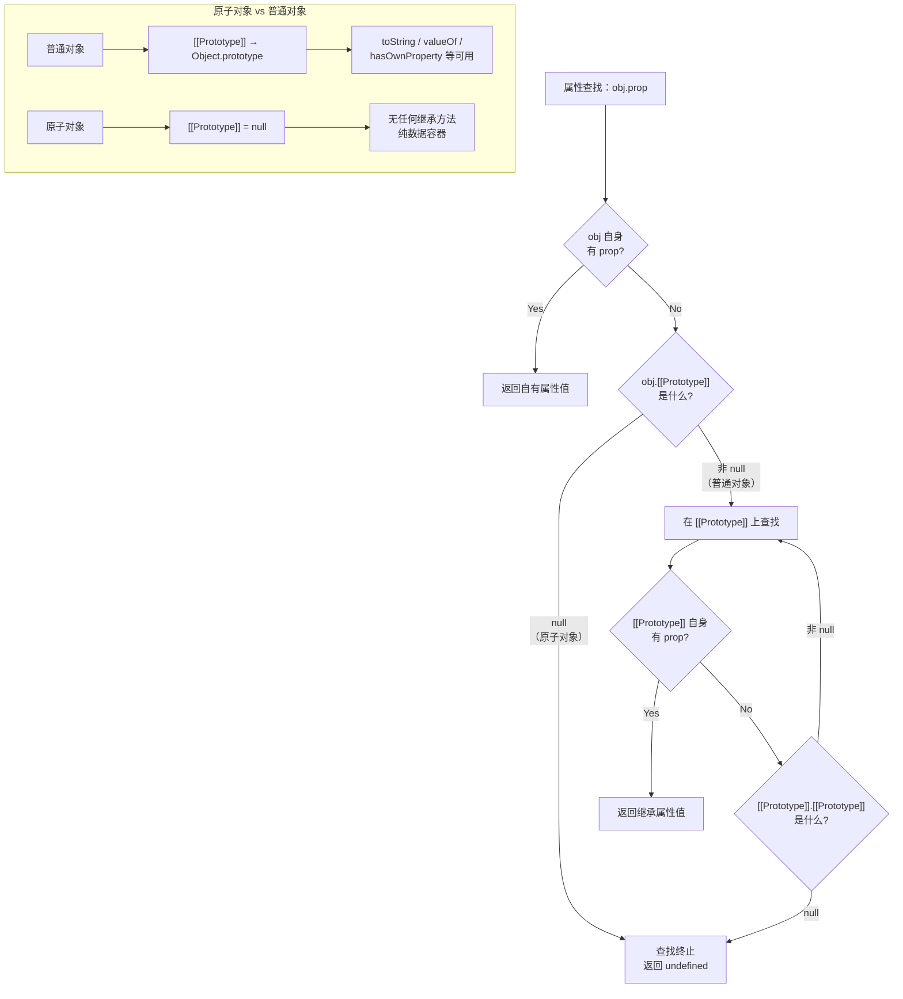

# 原型与原型链

原型链是 JavaScript 实现继承的核心机制，理解原型链对于掌握 JavaScript 的面向对象编程至关重要。

## 系统架构概述

### 原型链体系结构

```
┌─────────────────────────────────────────────────────────────┐
│                      JavaScript 对象模型                      │
├─────────────────────────────────────────────────────────────┤
│                                                               │
│   实例对象 (Instance)                                         │
│   ┌──────────────────┐                                       │
│   │ name: "John"     │                                       │
│   │ age: 30          │                                       │
│   │ __proto__ ───────┼───┐                                   │
│   └──────────────────┘   │                                   │
│                          ▼                                   │
│   构造函数原型 (Constructor.prototype)                       │
│   ┌──────────────────┐                                       │
│   │ sayHello: fn     │                                       │
│   │ constructor: fn  │                                       │
│   │ __proto__ ───────┼───┐                                   │
│   └──────────────────┘   │                                   │
│                          ▼                                   │
│   Object.prototype（所有对象的公共原型）                      │
│   ┌──────────────────┐                                       │
│   │ toString: fn     │                                       │
│   │ hasOwnProperty fn│                                       │
│   │ __proto__: null  │                                       │
│   └──────────────────┘                                       │
│                                                               │
│                    null (原型链终点)                          │
│                                                               │
└─────────────────────────────────────────────────────────────┘
```

### 核心关系图

```javascript
// 原型链关系示意图
function Person(name) {
  this.name = name
}

const person = new Person('John')

/*
┌─────────────────────────────────────────────────────────────┐
│                        原型链关系图                          │
├─────────────────────────────────────────────────────────────┤
│                                                             │
│   person 实例                                               │
│   ┌──────────────────┐                                      │
│   │ name: "John"     │                                      │
│   │ __proto__ ───────┼───┐                                  │
│   └──────────────────┘   │                                  │
│                          ▼                                  │
│   Person.prototype                                         │
│   ┌──────────────────┐                                      │
│   │ sayHello: fn     │                                      │
│   │ constructor ─────┼──► Person 函数                       │
│   │ __proto__ ───────┼───┐                                  │
│   └──────────────────┘   │                                  │
│                          ▼                                  │
│   Object.prototype                                         │
│   ┌──────────────────┐                                      │
│   │ toString: fn     │                                      │
│   │ constructor ─────┼─────────── Object 函数               │
│   │ __proto__: null  │                                      │
│   └──────────────────┘                                      │
│                                                             │
└─────────────────────────────────────────────────────────────┘
*/
```

---

## 核心概念

### 什么是原型？

**原型（Prototype）** 是 JavaScript 中实现对象继承的一种机制。每个 JavaScript 对象在创建时会关联另一个对象，这个对象就是它的原型。对象从原型继承属性和方法。

### 什么是原型链？

**原型链（Prototype Chain）** 是由原型对象组成的链式结构。当访问一个对象的属性时，JavaScript 引擎会沿着原型链逐层查找，直到找到该属性或到达原型链末端（`null`）。

### 为什么需要原型链？

1. **实现继承**：让对象可以继承其他对象的属性和方法
2. **内存优化**：多个实例共享原型上的方法，避免重复创建
3. **动态扩展**：可以动态地给原型添加新方法，所有实例立即可用

---

## 原型对象详解

### 1. prototype 属性

**定义**：每个函数都有一个 `prototype` 属性，指向一个对象（原型对象）。

**用途**：用于实现基于原型的继承和共享属性。

```javascript
// 基本用法
function Person(name) {
  this.name = name
}

// 查看原型对象
console.log(Person.prototype)
// 输出: { constructor: Person }

// 添加原型方法
Person.prototype.sayHello = function () {
  console.log('Hello, ' + this.name)
}

Person.prototype.greet = function (other) {
  console.log(`Hi ${other}, I'm ${this.name}`)
}

// 实例使用原型方法
const person = new Person('John')
person.sayHello()  // 'Hello, John'
person.greet('Jane')  // "Hi Jane, I'm John"

// 原型方法的内存共享特性
const person2 = new Person('Jane')
console.log(person.sayHello === person2.sayHello)  // true - 共享同一个函数
```

**原型对象的初始状态**：

```javascript
function Person(name) {
  this.name = name
}

// 原型对象默认只有一个 constructor 属性
console.log(Object.keys(Person.prototype))  // []
console.log(Person.prototype.hasOwnProperty('constructor'))  // true
console.log(Person.prototype.constructor === Person)  // true
```

### 2. `__proto__` 属性

**定义**：每个对象都有一个 `__proto__` 属性（访问器属性），指向其构造函数的 `prototype`。

**注意**：`__proto__` 已被废弃，推荐使用 `Object.getPrototypeOf()` 和 `Object.setPrototypeOf()`。

```javascript
function Person(name) {
  this.name = name
}

const person = new Person('John')

// __proto__ 指向构造函数的 prototype
console.log(person.__proto__ === Person.prototype)  // true

// Person.prototype 也是对象，它的 __proto__ 指向 Object.prototype
console.log(Person.prototype.__proto__ === Object.prototype)  // true

// Object.prototype 的 __proto__ 为 null（原型链终点）
console.log(Object.prototype.__proto__)  // null

// 原型链查找示例
console.log(person.__proto__.__proto__.__proto__)  // null
```

**完整原型链示例**：

```javascript
function Animal(name) {
  this.name = name
}

Animal.prototype.eat = function () {
  console.log(`${this.name} is eating`)
}

function Dog(name, breed) {
  Animal.call(this, name)
  this.breed = breed
}

Dog.prototype = Object.create(Animal.prototype)
Dog.prototype.constructor = Dog

const dog = new Dog('Max', 'Golden Retriever')

// 完整的原型链
console.log(dog.__proto__ === Dog.prototype)  // true
console.log(dog.__proto__.__proto__ === Animal.prototype)  // true
console.log(dog.__proto__.__proto__.__proto__ === Object.prototype)  // true
console.log(dog.__proto__.__proto__.__proto__.__proto__)  // null
```

### 3. constructor 属性

**定义**：每个原型对象都有一个 `constructor` 属性，指向关联的构造函数。

**作用**：标识对象的构造函数，可用于创建新实例。

```javascript
function Person(name) {
  this.name = name
}

console.log(Person.prototype.constructor === Person)  // true

const person = new Person('John')

// 通过实例访问 constructor
console.log(person.constructor === Person)  // true
console.log(person.__proto__.constructor === Person)  // true

// 使用 constructor 创建新实例
const person2 = new person.constructor('Jane')
console.log(person2.name)  // 'Jane'
console.log(person2 instanceof Person)  // true
```

#### constructor 丢失与修复

**问题**：重写原型对象会导致 `constructor` 属性丢失。

```javascript
function Person(name) {
  this.name = name
}

// ❌ 错误示例：直接重写原型
Person.prototype = {
  sayHello() {
    console.log('Hello, ' + this.name)
  }
}

console.log(Person.prototype.constructor === Person)  // false
console.log(Person.prototype.constructor === Object)  // true - 指向 Object

// 创建实例
const person = new Person('John')
console.log(person.constructor === Person)  // false - 错误！
console.log(person.constructor === Object)  // true
```

**修复方案**：

```javascript
// ✅ 方案一：手动指定 constructor
function Person(name) {
  this.name = name
}

Person.prototype = {
  constructor: Person,  // 手动设置 constructor
  sayHello() {
    console.log('Hello, ' + this.name)
  }
}

// ✅ 方案二：用 defineProperty 恢复（可保持不可枚举，与原生行为一致）
Object.defineProperty(Person.prototype, 'constructor', {
  value: Person,
  enumerable: false,
  writable: true,
  configurable: true
})

console.log(Person.prototype.constructor === Person)  // true
console.log(Object.keys(Person.prototype))  // ['sayHello'] - constructor 不可枚举
```

---

## 原型链查找机制

### 属性查找流程

```
访问 obj.property
        │
        ▼
┌───────────────────┐
│ obj 自身有该属性? │
└───────────────────┘
        │
        ├── Yes ──> 返回属性值
        │
        └── No ──> 继续
                    │
                    ▼
        ┌────────────────────────┐
        │ proto = obj.__proto__ │
        └────────────────────────┘
                    │
                    ▼
            ┌────────────────────┐
            │ proto 为 null?     │
            └────────────────────┘
                │           │
                No         Yes ──> 返回 undefined
                │
                ▼
    ┌────────────────────────────┐
    │ proto 自身有该属性?        │
    └────────────────────────────┘
                │
                ├── Yes ──> 返回属性值
                │
                └── No ──> 继续沿原型链向上查找
                            │
                            ▼
                        ┌──────────────────┐
                        │ __proto__ 为 null │
                        └──────────────────┘
                                │
                                ▼
                        返回 undefined
```

### 查找示例

```javascript
function Person(name) {
  this.name = name
}

Person.prototype.sayHello = function () {
  console.log('Hello, ' + this.name)
}

const person = new Person('John')

// 属性查找演示
console.log(person.name)      // 'John' - 自身属性
console.log(person.age)       // undefined - 自身和原型链上都不存在
person.sayHello()             // 'Hello, John' - 原型方法在原型上找到

// 模拟原型链查找过程
function tracePropertyLookup(obj, prop) {
  let current = obj
  let level = 0

  while (current !== null) {
    if (Object.prototype.hasOwnProperty.call(current, prop)) {
      console.log(`✓ 在第 ${level} 层找到 '${prop}'`)
      console.log(`  值:`, current[prop])
      return
    }
    console.log(`✗ 第 ${level} 层未找到 '${prop}'`)
    current = Object.getPrototypeOf(current)
    level++
  }
}

tracePropertyLookup(person, 'name')
// 输出:
//   ✓ 在第 0 层找到 'name'
//     值: John

tracePropertyLookup(person, 'toString')
// 输出:
// ✗ 第 0 层未找到 'toString'
// ✗ 第 1 层未找到 'toString'
//   ✓ 在第 2 层找到 'toString'
//     值: [Function: toString]
```

### 属性遮蔽（Shadowing）

```javascript
function Person(name) {
  this.name = name
}

Person.prototype.sayHello = function () {
  console.log('Hello from prototype')
}

const person = new Person('John')

// 第一次调用 - 使用原型方法
person.sayHello()  // 'Hello from prototype'

// 在实例上添加同名方法
person.sayHello = function () {
  console.log('Hello from instance')
}

// 第二次调用 - 使用实例方法（遮蔽原型方法）
person.sayHello()  // 'Hello from instance'

// 原型方法仍然存在
person.__proto__.sayHello.call(person)  // 'Hello from prototype'

// 删除实例方法后，原型方法重新可见
delete person.sayHello
person.sayHello()  // 'Hello from prototype'
```

---

## 核心 API 接口

### 1. Object.getPrototypeOf()

**语法**：`Object.getPrototypeOf(obj)`

**功能**：返回指定对象的原型（内部 `[[Prototype]]` 属性的值）。

**参数**：
- `obj`：要返回其原型的对象

**返回值**：给定对象的原型对象，如果没有继承属性则返回 `null`。

```javascript
function Person(name) {
  this.name = name
}

const person = new Person('John')

// 获取原型
console.log(Object.getPrototypeOf(person) === Person.prototype)  // true
console.log(Object.getPrototypeOf(Person.prototype) === Object.prototype)  // true
console.log(Object.getPrototypeOf(Object.prototype))  // null

// 与 __proto__ 的对比
console.log(Object.getPrototypeOf(person) === person.__proto__)  // true
```

**应用场景**：

```javascript
// 检查对象是否是某个构造函数的实例
function isInstanceOf(obj, Constructor) {
  let proto = Object.getPrototypeOf(obj)
  
  while (proto !== null) {
    if (proto === Constructor.prototype) {
      return true
    }
    proto = Object.getPrototypeOf(proto)
  }
  
  return false
}

console.log(isInstanceOf([], Array))   // true
console.log(isInstanceOf([], Object))  // true
console.log(isInstanceOf([], Date))    // false
```

### 2. Object.setPrototypeOf()

**语法**：`Object.setPrototypeOf(obj, prototype)`

**功能**：设置一个指定的对象的原型到另一个对象或 `null`。

**参数**：
- `obj`：要设置其原型的对象
- `prototype`：该对象的新原型（一个对象或 `null`）

**返回值**：指定的对象。

**警告**：此方法性能较差，应避免使用。推荐使用 `Object.create()` 创建新对象。

```javascript
const proto = {
  greet() {
    console.log('Hello!')
  }
}

const obj = { name: 'John' }

// 设置原型
Object.setPrototypeOf(obj, proto)

console.log(obj.name)  // 'John'
obj.greet()  // 'Hello!'

console.log(Object.getPrototypeOf(obj) === proto)  // true
```

**性能对比**：

```javascript
// ❌ 不推荐：修改现有对象的原型（性能差）
const obj1 = { a: 1 }
const proto1 = { b: 2 }
Object.setPrototypeOf(obj1, proto1)  // 性能开销大

// ✅ 推荐：创建新对象时指定原型
const obj2 = Object.create(proto1, {
  a: { value: 1, writable: true, enumerable: true, configurable: true }
})
```

### 3. Object.create()

**语法**：`Object.create(proto[, propertiesObject])`

**功能**：创建一个新对象，使用现有的对象来提供新创建的对象的 `__proto__`。

**参数**：
- `proto`：新创建对象的原型对象
- `propertiesObject`（可选）：要添加到新创建对象的可枚举属性

**返回值**：一个新对象，带着指定的原型对象和属性。

#### 基本用法

```javascript
// 创建没有原型的对象
const obj1 = Object.create(null)
console.log(Object.getPrototypeOf(obj1))  // null
console.log(obj1.toString)  // undefined - 没有 toString 方法

// 创建以普通对象为原型的对象
const proto = {
  sayHello() {
    console.log('Hello, ' + this.name)
  }
}

const obj2 = Object.create(proto)
obj2.name = 'John'
obj2.sayHello()  // 'Hello, John'

console.log(Object.getPrototypeOf(obj2) === proto)  // true
```

#### 使用属性描述符

```javascript
const obj = Object.create(
  // 原型对象
  {
    greet() {
      console.log('Hello!')
    }
  },
  // 属性描述符
  {
    name: {
      value: 'John',
      writable: true,
      enumerable: true,
      configurable: true
    },
    age: {
      value: 30,
      writable: false,  // 只读
      enumerable: true,
      configurable: true
    }
  }
)

console.log(obj.name)  // 'John'
console.log(obj.age)   // 30

obj.age = 31  // 严格模式下会报错
console.log(obj.age)   // 30 - 值未改变（只读属性）
```

#### 实现 Object.create()

```javascript
// 简化版实现
function myCreate(proto, propertiesObject) {
  // 参数校验
  if (proto === null || typeof proto !== 'object') {
    throw new TypeError('Object prototype may only be an Object or null')
  }
  
  // 创建临时构造函数
  function F() {}
  
  // 设置原型
  F.prototype = proto

  // 创建实例
  const obj = new F()

  if (propertiesObject !== undefined) {
    Object.defineProperties(obj, propertiesObject)
  }
  
  return obj
}
```

### 4. Object.getPrototypeOf() vs __proto__

```javascript
const obj = {}

// 推荐使用 Object.getPrototypeOf()
console.log(Object.getPrototypeOf(obj) === Object.prototype)  // true

// __proto__ 已废弃但仍然可用
console.log(obj.__proto__ === Object.prototype)  // true

// 两者的区别
console.log('getPrototypeOf 是静态方法')
console.log('__proto__ 是访问器属性')
console.log('getPrototypeOf 更安全，支持 null')
console.log('__proto__ 在某些环境中可能不存在')
```

### 5. instanceof 运算符

**语法**：`object instanceof constructor`

**功能**：检测构造函数的 `prototype` 属性是否出现在某个实例对象的原型链上。

**返回值**：布尔值，表示对象是否是指定构造函数的实例。

```javascript
function Person(name) {
  this.name = name
}

const person = new Person('John')

console.log(person instanceof Person)  // true
console.log(person instanceof Object)  // true

// 数组示例
console.log([] instanceof Array)   // true
console.log([] instanceof Object)  // true

// 日期示例
const date = new Date()
console.log(date instanceof Date)    // true
console.log(date instanceof Object)  // true

// 原始值不是任何对象的实例
console.log(42 instanceof Number)   // false
console.log('hi' instanceof String) // false
console.log(true instanceof Boolean) // false
```

#### 实现 instanceof

```javascript
function myInstanceOf(obj, Constructor) {
  // 右侧必须是函数
  if (typeof Constructor !== 'function') {
    throw new TypeError('Right-hand side of instanceof is not callable')
  }
  
  // 原始值直接返回 false
  if (obj === null || (typeof obj !== 'object' && typeof obj !== 'function')) {
    return false
  }
  
  // 获取对象的原型
  let proto = Object.getPrototypeOf(obj)

  // 沿原型链逐层向上查找
  while (proto !== null) {
    if (proto === Constructor.prototype) {
      return true
    }
    proto = Object.getPrototypeOf(proto)
  }

  return false
}

// 测试
console.log(myInstanceOf([], Array))    // true
console.log(myInstanceOf([], Object))   // true
console.log(myInstanceOf([], Date))     // false
console.log(myInstanceOf(null, Object)) // false
console.log(myInstanceOf(42, Number))   // false
```

### 6. isPrototypeOf() 方法

**语法**：`prototypeObj.isPrototypeOf(object)`

**功能**：检查一个对象是否存在于另一个对象的原型链上。

**返回值**：布尔值，表示调用对象是否在指定对象的原型链中。

```javascript
const proto = {
  greet() {
    console.log('Hello!')
  }
}

const obj = Object.create(proto)

// 检查原型关系
console.log(proto.isPrototypeOf(obj))  // true
console.log(Object.prototype.isPrototypeOf(obj))  // true

// 与 instanceof 的区别
function Person(name) {
  this.name = name
}

const person = new Person('John')

console.log(Person.prototype.isPrototypeOf(person))  // true
console.log(person instanceof Person)  // true

// isPrototypeOf 更灵活 - 可以检查任意对象
const customProto = { a: 1 }
Object.setPrototypeOf(person, customProto)

console.log(customProto.isPrototypeOf(person))  // true
console.log(person instanceof Person)  // false - Person.prototype 不在原型链上了
```

### 7. hasOwnProperty() 方法

**语法**：`obj.hasOwnProperty(prop)`

**功能**：返回一个布尔值，指示对象自身属性中是否具有指定的属性。

**返回值**：布尔值，表示对象是否具有指定的自身属性。

```javascript
function Person(name) {
  this.name = name
}

Person.prototype.age = 30

const person = new Person('John')

// 检查自身属性
console.log(person.hasOwnProperty('name'))  // true - 自身属性
console.log(person.hasOwnProperty('age'))   // false - 原型属性

// 遍历并区分自身属性和继承属性
function listOwnProperties(obj) {
  const own = []
  const inherited = []

  for (const key in obj) {
    if (Object.prototype.hasOwnProperty.call(obj, key)) {
      own.push(key)
    } else {
      inherited.push(key)
    }
  }

  return { own, inherited }
}

const result = listOwnProperties(person)
console.log(result.own)        // ['name']
console.log(result.inherited)  // ['age']
```

### 8. Object.getOwnPropertyNames()

**语法**：`Object.getOwnPropertyNames(obj)`

**功能**：返回一个由指定对象的所有自身属性的属性名（包括不可枚举属性但不包括 Symbol 值作为名称的属性）组成的数组。

```javascript
function Person(name) {
  this.name = name
}

Person.prototype.sayHello = function () {}

const person = new Person('John')

// 添加不可枚举属性
Object.defineProperty(person, 'id', {
  value: 123,
  enumerable: false
})

console.log(Object.keys(person))              // ['name'] - 只返回可枚举属性
console.log(Object.getOwnPropertyNames(person))  // ['name', 'id'] - 包括不可枚举属性
```

### API 对比表

| 方法 | 检查范围 | 包含不可枚举 | 包含 Symbol |
|------|---------|-------------|------------|
| `in` 操作符 | 自身 + 原型链 | ✓ | ✓ |
| `hasOwnProperty()` | 仅自身 | ✓ | ✓ |
| `Object.keys()` | 仅自身 | ✗ | ✗ |
| `Object.getOwnPropertyNames()` | 仅自身 | ✓ | ✗ |
| `Object.getOwnPropertySymbols()` | 仅自身 | ✓ | ✓ |
| `Reflect.ownKeys()` | 仅自身 | ✓ | ✓ |

---

## 原型链的应用场景

### 1. 方法共享

将方法定义在原型上，所有实例共享同一份方法实现，节省内存。

```javascript
// ❌ 不推荐：每次创建实例都会创建新的方法
function Person1(name) {
  this.name = name
  this.sayHello = function () {
    console.log('Hello, ' + this.name)
  }
}

const p1 = new Person1('John')
const p2 = new Person1('Jane')
console.log(p1.sayHello === p2.sayHello)  // false - 每个实例都有自己的方法

// ✅ 推荐：方法放在原型上，所有实例共享
function Person2(name) {
  this.name = name
}

Person2.prototype.sayHello = function () {
  console.log('Hello, ' + this.name)
}

const p3 = new Person2('John')
const p4 = new Person2('Jane')
console.log(p3.sayHello === p4.sayHello)  // true - 共享同一个方法
```

### 2. 实现继承

```javascript
// 父类
function Animal(name) {
  this.name = name
}

Animal.prototype.eat = function () {
  console.log(`${this.name} is eating`)
}

Animal.prototype.sleep = function () {
  console.log(`${this.name} is sleeping`)
}

// 子类
function Dog(name, breed) {
  Animal.call(this, name)
  this.breed = breed
}

// 继承父类原型
Dog.prototype = Object.create(Animal.prototype)
Dog.prototype.constructor = Dog

// 子类自己的方法
Dog.prototype.bark = function () {
  console.log(`${this.name} is barking`)
}

const dog = new Dog('Max', 'Golden Retriever')
dog.eat()               // 'Max is eating'（继承自 Animal）
dog.bark()              // 'Max is barking'

// 检查继承关系
console.log(dog instanceof Dog)    // true
console.log(dog instanceof Animal) // true
console.log(dog instanceof Object) // true
```

### 3. 动态扩展对象功能

```javascript
// 扩展所有数组的功能
Array.prototype.first = function () {
  return this[0]
}

Array.prototype.last = function () {
  return this[this.length - 1]
}

const arr = [1, 2, 3, 4, 5]
console.log(arr.first())  // 1
console.log(arr.last())   // 5

// ⚠️ 注意：不要修改原生对象的原型（仅用于演示）
```

### 4. 创建纯净对象

```javascript
// 创建没有原型的对象 - 适合作为字典使用
const dict = Object.create(null)

dict.name = 'John'
dict.age = 30

console.log(dict.toString)  // undefined - 没有 toString 方法
console.log(dict.hasOwnProperty)  // undefined - 没有 hasOwnProperty 方法

// 优势：没有继承的属性污染
console.log('name' in dict)  // true - 只检查自身属性
console.log('constructor' in dict)  // false - 没有继承 constructor
```

### 5. 实现 mixin 模式

```javascript
// 使用原型链实现 mixin
const canEat = {
  eat() {
    console.log(`${this.name} is eating`)
  }
}

const canSleep = {
  sleep() {
    console.log(`${this.name} is sleeping`)
  }
}

const canBark = {
  bark() {
    console.log(`${this.name} is barking`)
  }
}

function Dog(name) {
  this.name = name
}

// 多重继承（复制属性）
Object.assign(Dog.prototype, canEat, canSleep, canBark)

const dog = new Dog('Max')
dog.eat()   // 'Max is eating'
dog.sleep() // 'Max is sleeping'
dog.bark()  // 'Max is barking'
```

---

## 常见问题与陷阱

### 1. 引用类型共享问题

**问题**：原型上的引用类型属性会被所有实例共享。

```javascript
function Person() {
  this.hobbies = []  // ✅ 正确：放在实例上
}

Person.prototype = {
  constructor: Person,
  
  sharedHobbies: ['music'],  // ❌ 错误：会被所有实例共享
  
  getHobbies() {
    return this.hobbies
  }
}

const person1 = new Person()
const person2 = new Person()

person1.hobbies.push('reading')
console.log(person1.hobbies)  // ['reading']
console.log(person2.hobbies)  // [] - 正确，各自独立

// 问题：原型上的引用类型被共享
person1.sharedHobbies.push('sports')
console.log(person2.sharedHobbies)  // ['music', 'sports'] - 错误！被污染了
```

**解决方案**：

```javascript
// ✅ 方案一：将引用类型放在构造函数中
function Person(name) {
  this.name = name
  this.hobbies = []  // 每个实例都有自己的数组
}

Person.prototype.sayHello = function () {
  console.log('Hello, ' + this.name)
}

// ✅ 方案二：使用工厂方法创建引用类型
function Person(name) {
  this.name = name
}

Person.prototype.getHobbies = function () {
  // 每次调用都创建新数组
  if (!this._hobbies) {
    this._hobbies = []
  }
  return this._hobbies
}
```

### 2. 原型重写时机问题

**问题**：在创建实例后重写原型，会导致原型链断裂。

```javascript
function Person(name) {
  this.name = name
}

Person.prototype.sayHello = function () {
  console.log('Hello, ' + this.name)
}

const person = new Person('John')
person.sayHello()  // 'Hello, John'

// 重写原型
Person.prototype = {
  greet() {
    console.log('Hi, ' + this.name)
  }
}

person.sayHello()  // 'Hello, John' - 仍然可以访问旧方法
person.greet()     // TypeError: person.greet is not a function - 无法访问新方法

const person2 = new Person('Jane')
person2.greet()    // 'Hi, Jane' - 新实例使用新原型
person2.sayHello() // TypeError - 新实例无法访问旧方法
```

### 3. instanceof 的陷阱

**陷阱一**：跨 iframe 或 window 时，instanceof 可能失败。

```javascript
// 在主窗口中
const iframe = document.createElement('iframe')
document.body.appendChild(iframe)

const iframeArray = new iframe.contentWindow.Array()
console.log(iframeArray instanceof Array)  // false - 不同全局对象
console.log(Array.isArray(iframeArray))    // true - 正确的判断方式
```

**陷阱二**：修改原型后 instanceof 结果改变。

```javascript
function Person(name) {
  this.name = name
}

const person = new Person('John')
console.log(person instanceof Person)  // true

// 修改原型
Object.setPrototypeOf(person, {})
console.log(person instanceof Person)  // false
```

### 4. __proto__ 的性能问题

```javascript
// ❌ 不推荐：频繁修改 __proto__
const obj = {}

for (let i = 0; i < 1000; i++) {
  obj.__proto__ = { [`proto${i}`]: i }  // 性能很差
}

// ✅ 推荐：使用 Object.create() 创建新对象
for (let i = 0; i < 1000; i++) {
  const obj = Object.create({ [`proto${i}`]: i })  // 性能更好
}
```

### 5. 原型链过深问题

```javascript
// ❌ 不推荐：原型链过长
function Level1() {}
function Level2() {}
function Level3() {}
function Level4() {}
function Level5() {}

Level2.prototype = Object.create(Level1.prototype)
Level3.prototype = Object.create(Level2.prototype)
Level4.prototype = Object.create(Level3.prototype)
Level5.prototype = Object.create(Level4.prototype)

const obj = new Level5()

// 属性查找需要遍历很长的原型链
console.log(obj.toString)  // 需要查找 6 层（Level5 -> Level4 -> Level3 -> Level2 -> Level1 -> Object.prototype）
```

---

## 最佳实践

### 1. 方法放在原型上

```javascript
// ✅ 推荐
function Person(name) {
  this.name = name
}

Person.prototype.sayHello = function () {
  console.log('Hello, ' + this.name)
}

// ❌ 不推荐
function Person(name) {
  this.name = name
  this.sayHello = function () {  // 每个实例都创建新的函数
    console.log('Hello, ' + this.name)
  }
}
```

### 2. 数据属性放在实例上

```javascript
// ✅ 推荐
function Person(name, age) {
  this.name = name  // 实例属性
  this.age = age    // 实例属性
}

// ❌ 不推荐
function Person(name, age) {
  // ...
}

Person.prototype.name = 'default'  // 原型属性
Person.prototype.age = 0           // 原型属性
```

### 3. 使用 Object.create() 实现继承

```javascript
// ✅ 推荐
function Child() {
  Parent.call(this)
}

Child.prototype = Object.create(Parent.prototype)
Child.prototype.constructor = Child

// ❌ 不推荐
Child.prototype = new Parent()  // 无法传递参数，会执行父类构造函数
```

### 4. 使用 Object.getPrototypeOf() 替代 __proto__

```javascript
// ✅ 推荐
const proto = Object.getPrototypeOf(obj)
Object.setPrototypeOf(obj, newProto)

// ❌ 不推荐
const proto = obj.__proto__
obj.__proto__ = newProto
```

### 5. 检查属性时区分自身属性和原型属性

```javascript
// ✅ 推荐
if (obj.hasOwnProperty('name')) {
  console.log('name 是自身属性')
}

if ('name' in obj) {
  console.log('name 存在（可能是原型属性）')
}

// 使用 Object.hasOwn()（ES2022+）
if (Object.hasOwn(obj, 'name')) {
  console.log('name 是自身属性')
}
```

### 6. 避免修改原生对象的原型

```javascript
// ❌ 不推荐
Array.prototype.myMethod = function () {
  // ...
}

// ✅ 推荐：使用类继承
class MyArray extends Array {
  myMethod() {
    // ...
  }
}
```

---

## 常见问题解答

### Q1: `prototype` 和 `__proto__` 有什么区别？

**A**:

| 特性 | prototype | __proto__ |
|------|-----------|-----------|
| 所属 | 函数对象 | 所有对象 |
| 用途 | 定义实例的原型 | 访问对象的原型 |
| 访问方式 | `Func.prototype` | `obj.__proto__` |
| 关系 | 构造函数的原型对象 | 实例的原型引用 |

```javascript
function Person(name) {
  this.name = name
}

const person = new Person('John')

// prototype 是函数的属性
console.log(Person.prototype)

// __proto__ 是对象的属性
console.log(person.__proto__)

// 关系
console.log(person.__proto__ === Person.prototype)  // true
```

### Q2: `instanceof` 和 `typeof` 有什么区别？

**A**:

| 操作符 | 用途 | 返回值 |
|--------|------|--------|
| `typeof` | 检测数据类型 | 字符串（'number', 'string', 'object' 等） |
| `instanceof` | 检测原型链关系 | 布尔值 |

```javascript
// typeof 返回数据类型
console.log(typeof 42)           // 'number'
console.log(typeof 'hello')      // 'string'
console.log(typeof {})           // 'object'
console.log(typeof [])           // 'object'（无法区分数组）
console.log(typeof null)         // 'object'（历史遗留问题）
console.log(typeof undefined)    // 'undefined'

// instanceof 检查原型链
console.log([] instanceof Array)   // true
console.log([] instanceof Object)  // true
console.log(null instanceof Object) // false
```

### Q3: 为什么修改原型会影响所有实例？

**A**: 因为实例通过原型链引用原型对象，而不是复制。修改原型对象本身会立即反映在所有实例上。

```javascript
function Person(name) {
  this.name = name
}

const person1 = new Person('John')
const person2 = new Person('Jane')

// 修改原型
Person.prototype.sayHello = function () {
  console.log('Hello, ' + this.name)
}

// 所有实例立即获得新方法
person1.sayHello()  // 'Hello, John'
person2.sayHello()  // 'Hello, Jane'
```

### Q4: `Object.create(null)` 有什么用途？

**A**: 创建一个纯净的对象，没有原型，适合用作字典或映射。

```javascript
// 普通对象会继承 toString、hasOwnProperty 等方法
const normalObj = {}
console.log(normalObj.toString)  // [Function: toString]
console.log('toString' in normalObj)  // true

// 纯净对象没有继承任何属性
const pureObj = Object.create(null)
console.log(pureObj.toString)  // undefined
console.log('toString' in pureObj)  // false

// 适合用作字典 - 不会被原型属性污染
const dict = Object.create(null)
dict.name = 'John'
dict.age = 30

// 遍历时只有自身属性
for (const key in dict) {
  console.log(key)  // 'name', 'age' - 不会遍历到原型属性
}
```

### Q5: 如何正确判断数据类型？

**A**: 根据不同场景使用不同方法：

```javascript
// 1. typeof - 原始类型
console.log(typeof 42)           // 'number'
console.log(typeof 'hello')      // 'string'
console.log(typeof true)         // 'boolean'
console.log(typeof undefined)    // 'undefined'
console.log(typeof Symbol())     // 'symbol'
console.log(typeof 123n)         // 'bigint'

// 2. instanceof - 对象类型
console.log([] instanceof Array)   // true
console.log({} instanceof Object)  // true
console.log(new Date() instanceof Date)  // true

// 3. Object.prototype.toString - 精确判断内置类型
console.log(Object.prototype.toString.call([]))    // '[object Array]'
console.log(Object.prototype.toString.call(null))  // '[object Null]'

// 4. Array.isArray - 判断数组（可跨 iframe）
console.log(Array.isArray([]))     // true
console.log(Array.isArray({}))     // false

// 5. Number.isNaN() vs isNaN()
console.log(Number.isNaN(NaN))     // true
console.log(Number.isNaN('hello')) // false

console.log(isNaN(NaN))            // true
console.log(isNaN('hello'))        // true - 会先转换为数字
```

### Q6: ES6 class 与原型链的关系？

**A**: ES6 class 是原型继承的语法糖，底层仍然是基于原型的继承机制。

```javascript
// ES5 构造函数
function PersonES5(name) {
  this.name = name
}

PersonES5.prototype.sayHello = function () {
  console.log('Hello, ' + this.name)
}

// ES6 class
class PersonES6 {
  constructor(name) {
    this.name = name
  }

  sayHello() {
    console.log('Hello, ' + this.name)
  }
}

const personES6 = new PersonES6('John')
personES6.sayHello()  // 'Hello, John'

// class 本质仍是函数
console.log(typeof PersonES6)  // 'function'
console.log(PersonES6.prototype.constructor === PersonES6)  // true

// class 继承 = 原型链继承的语法封装
class Animal {
  constructor(name) {
    this.name = name
  }

  eat() {
    console.log(`${this.name} is eating`)
  }
}

class Dog extends Animal {
  bark() {
    console.log(`${this.name} is barking`)
  }
}

const dog = new Dog('Max')
dog.eat()   // 'Max is eating'（继承自 Animal）
dog.bark()  // 'Max is barking'

// 原型链关系
console.log(dog instanceof Dog)    // true
console.log(dog instanceof Animal) // true
console.log(Dog.prototype.__proto__ === Animal.prototype)  // true
```

---

### null 值与原子对象（核心原理深度）

> **规范层级**：ECMAScript 规范 · [[Prototype]] / OrdinaryGet / null type
> **原理来源**：JavaScript 核心原理解析 · 第 17 讲

#### 规范语义

在 ECMAScript 规范中，`null` 具有双重语义：

1. **作为值**：`null` 是 Null 类型的唯一值，表示"有意为空"
2. **作为原型链终结符**：`[[Prototype]]` 内部槽为 `null` 意味着原型链到此终止

`Object.setPrototypeOf(x, null)` 或 `Object.create(null)` 创建的对象被称为**原子对象（Atom Object）**——一个没有任何原型、不存在任何继承行为的"纯净"对象。这是 JavaScript 中**唯一能真正切断原型链的方式**。

规范中属性查找的抽象操作 `OrdinaryGet(O, P, Receiver)` 的核心逻辑：

```
1. 查找 O 的自有属性 P
2. 若找到，返回属性描述符
3. 若未找到，获取 O.[[Prototype]]
4. 若 [[Prototype]] 为 null，返回 undefined —— 查找终止
5. 若 [[Prototype]] 不为 null，递归在 [[Prototype]] 上查找
```

```javascript
// 原子对象：原型链的终结
const atom = Object.create(null)
console.log(Object.getPrototypeOf(atom))  // null

// 原子对象上没有继承的任何方法
atom.toString       // undefined
atom.valueOf        // undefined
atom.hasOwnProperty // undefined
```

#### 执行机制



#### 核心洞察

**1. null 的哲学意义：Tennent 对应原则**

Tennent 对应原则（Tennent Correspondence Principle）指出：程序中的任何表达式，都应当能够被一个返回该表达式值的函数调用所替换，而不改变程序的含义。类比到原型系统中：

- 任何原型链中的环节，都应当能够被 `null` 替换——即"切断继承"——而对象本身仍然有效
- `Object.create(null)` 正是这一原则的体现：即使没有原型，对象作为关联数组的本质不变

**2. null vs undefined 的语义区分**

在原型链语境下，两者有本质差异：`null` 可以作为 `[[Prototype]]` 的值，用于显式终止原型链；而 `undefined` 不行——试图把 `undefined` 设为原型会直接抛出 `TypeError`（详见下方代码）。

原子对象没有 `toString`、`valueOf`、`hasOwnProperty` 等继承方法，因此：

- 无法隐式转换为字符串或数字（防止意外类型转换）
- 不受 `Object.prototype` 污染影响（安全性）
- 只能通过 `Object.keys()`、`Object.entries()` 等"外部"方法操作

```
// === null 与 undefined 在原型链中的不同 ===

// null 可以作为 [[Prototype]]
Object.create(null)       // OK：创建原子对象
Object.setPrototypeOf({}, null)  // OK：切断原型链

// undefined 不能作为 [[Prototype]]
Object.create(undefined)  // TypeError: Object prototype may only be an Object or null
Object.setPrototypeOf({}, undefined)  // TypeError

// === typeof null 的历史 bug ===
typeof null        // 'object' — bug，但不予修复（破坏性太大）
typeof undefined   // 'undefined' — 正确
null instanceof Object  // false — null 不是对象实例
```

#### 代码实证

```javascript
// === 1. 原子对象：最干净的字典 ===

// 普通对象：原型链上有隐含属性
const normalDict = {}
console.log('toString' in normalDict)    // true — 来自原型链
console.log(Object.keys(normalDict))     // [] — 但 for...in 会遍历到继承属性

// 原子对象：纯净无继承
const cleanDict = Object.create(null)
console.log('toString' in cleanDict)     // false — 无继承
console.log(Object.keys(cleanDict))      // []

// === 2. 原型链污染演示 ===

// 给 Object.prototype 添加属性，所有普通对象都会"继承"到
Object.prototype.admin = true
console.log(normalDict.admin)            // true — 被污染
console.log(cleanDict.admin)             // undefined — 原子对象不受影响

delete Object.prototype.admin

// 使用原子对象防止污染
const safe = Object.create(null)
safe.__proto__ = { admin: true }   // 只是设置了一个名为 __proto__ 的自有属性
console.log(safe.admin)            // undefined — 不会污染原型链
```

#### 与实战的关联

1. **安全的数据存储**：在处理用户输入或外部数据时，使用 `Object.create(null)` 创建的原子对象可以防止 `__proto__` 注入攻击和 `Object.prototype` 污染。这是 Node.js 中 `dict` 模式的基础

2. **配置对象的纯净性**：框架中的配置对象（如 webpack 配置、ESLint 规则）使用原子对象可以避免与 `toString`、`valueOf` 等继承属性名冲突

3. **Map vs Object.create(null)**：ES6 的 `Map` 提供了更完善的字典功能（任意键类型、可迭代、size 属性），但在只需要字符串键的简单场景下，`Object.create(null)` 是更轻量的选择

4. **React 中的使用**：React 内部使用 `Object.create(null)` 创建空对象，避免原型链查找的开销和潜在的安全问题

---

## 总结

### 核心概念

- **原型对象**：每个对象都有原型对象，对象从原型继承属性和方法
- **原型链**：由原型对象组成的链式结构，是实现继承的核心机制
- **prototype**：函数的属性，指向原型对象
- **__proto__**：对象的属性，指向其原型（已废弃，使用 `Object.getPrototypeOf()` 替代）
- **constructor**：原型对象的属性，指向构造函数

### 关键要点

1. **方法放在原型上**，所有实例共享，节省内存
2. **数据属性放在实例上**，避免共享问题
3. **使用 `Object.create()` 实现继承**，避免直接实例化父类
4. **区分自身属性和原型属性**，使用 `hasOwnProperty()` 或 `Object.hasOwn()`
5. **避免修改原生对象的原型**，使用继承或组合模式替代
6. **使用 `Object.getPrototypeOf()` 替代 `__proto__`**

### 常用 API 总结

| API | 用途 |
|-----|------|
| `Object.getPrototypeOf(obj)` | 获取对象的原型 |
| `Object.setPrototypeOf(obj, proto)` | 设置对象的原型（不推荐） |
| `Object.create(proto)` | 创建指定原型的对象 |
| `instanceof` | 检查原型链关系 |
| `isPrototypeOf()` | 检查对象是否在原型链上 |
| `hasOwnProperty()` | 检查自身属性 |
| `Object.hasOwn()` | 检查自身属性（ES2022+） |

---

## 参考资料

- [ECMAScript 规范 - Prototype](https://tc39.es/ecma262/#sec-objects)
- [MDN - 继承与原型链](https://developer.mozilla.org/zh-CN/docs/Web/JavaScript/Inheritance_and_the_prototype_chain)
- [JavaScript 高级程序设计（第4版）](https://book.douban.com/subject/35175321/)
- [You Don't Know JS - this & Object Prototypes](https://github.com/getify/You-Dont-Know-JS)
