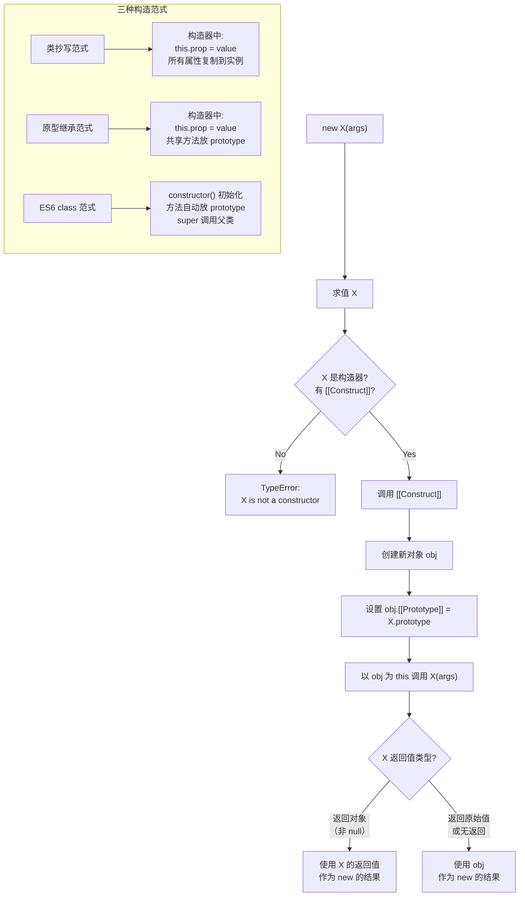

# 继承模式

JavaScript 提供了多种继承模式，每种模式都有其优缺点。理解这些模式有助于选择最适合的方案。ES6 引入的 `class` 语法本质上也是基于原型链的语法糖。

## 继承体系架构

### 继承模式演进路线

```
┌─────────────────────────────────────────────────────────────────────┐
│                      JavaScript 继承模式演进                          │
├─────────────────────────────────────────────────────────────────────┤
│                                                                       │
│  原型链继承 ──────► 构造函数继承 ──────► 组合继承                     │
│       │                 │                   │                        │
│       │                 │                   │                        │
│       └────────────────┬┴───────────────────┘                        │
│                        │                                              │
│                        ▼                                              │
│                   寄生组合式继承 ◄──── 原型式继承 + 寄生式继承         │
│                        │                                              │
│                        ▼                                              │
│                   ES6 class 继承（语法糖）                            │
│                                                                       │
└─────────────────────────────────────────────────────────────────────┘
```

### 继承模式分类

```
┌─────────────────────────────────────────────────────────────────────┐
│                         继承模式分类                                 │
├─────────────────────────────────────────────────────────────────────┤
│                                                                       │
│  基于类式继承                        基于对象式继承                   │
│  ┌────────────────────┐              ┌────────────────────┐         │
│  │ • 原型链继承        │              │ • 原型式继承        │         │
│  │ • 构造函数继承      │              │ • 寄生式继承        │         │
│  │ • 组合继承          │              │                    │         │
│  │ • 寄生组合式继承    │              └────────────────────┘         │
│  │ • ES6 class 继承   │                                             │
│  └────────────────────┘                                             │
│                                                                       │
└─────────────────────────────────────────────────────────────────────┘
```

---

## 原型链继承

利用原型链实现继承，子类的原型指向父类的实例。

### 工作原理

```
┌─────────────────────────────────────────────────────────────────────┐
│                        原型链继承原理                                 │
├─────────────────────────────────────────────────────────────────────┤
│                                                                       │
│  function Animal() {}                                                │
│  function Dog() {}                                                   │
│  Dog.prototype = new Animal()                                        │
│                                                                       │
│  ┌──────────────┐      ┌──────────────┐      ┌──────────────┐       │
│  │   dog 实例    │      │ Dog.prototype │      │ Animal.prototype │  │
│  │              │      │ (Animal实例) │      │              │      │
│  │ __proto__ ───┼─────►│ name: 'Max'  │      │ eat()        │      │
│  │              │      │ __proto__ ───┼─────►│ __proto__    │      │
│  └──────────────┘      └──────────────┘      └──────────────┘      │
│                                                       │               │
│                                                       ▼               │
│                                              ┌──────────────┐        │
│                                              │Object.prototype│       │
│                                              └──────────────┘        │
└─────────────────────────────────────────────────────────────────────┘
```

### 代码示例

```javascript
function Animal(name) {
  this.name = name
  this.colors = ['black', 'white']
}

Animal.prototype.eat = function () {
  console.log(this.name + ' is eating')
}

function Dog(name, breed) {
  this.breed = breed
}

// 设置原型链：子类原型指向父类实例
Dog.prototype = new Animal()

const dog1 = new Dog('Max', 'Golden Retriever')
const dog2 = new Dog('Buddy', 'Labrador')

// 问题 1：引用类型属性被所有实例共享
dog1.colors.push('brown')
console.log(dog2.colors)  // ['black', 'white', 'brown']

// 问题 2：无法向父类构造函数传递参数
console.log(dog1.name)    // undefined
```

### 优点

| 优点 | 说明 |
|------|------|
| 简单易懂 | 实现方式直观，易于理解 |
| 方法复用 | 父类原型上的方法可被子类实例共享 |
| 内存效率 | 方法定义在原型上，所有实例共享同一份 |

### 缺点

| 缺点 | 说明 |
|------|------|
| 引用类型共享 | 父类实例上的引用类型属性会被所有子类实例共享 |
| 无法传参 | 创建子类实例时无法向父类构造函数传递参数 |
| 冗余属性 | 子类原型（父类实例）上挂载了对子类无意义的属性 |

## 构造函数继承

在子类构造函数中调用父类构造函数，使用 `call()` 或 `apply()` 方法。

### 工作原理

```
┌─────────────────────────────────────────────────────────────────────┐
│                      构造函数继承原理                                 │
├─────────────────────────────────────────────────────────────────────┤
│                                                                       │
│  function Dog(name, breed) {                                         │
│    Animal.call(this, name)  // 在 this 上执行 Animal 的代码          │
│    this.breed = breed                                                │
│  }                                                                   │
│                                                                       │
│  ┌──────────────┐      ┌──────────────┐                             │
│  │   dog 实例    │      │ Animal.prototype │                          │
│  │              │      │              │                              │
│  │ name: 'Max'  │      │ eat()        │  ◄── 无法访问               │
│  │ colors: []   │      └──────────────┘                              │
│  │ breed: '...' │                                                    │
│  │ __proto__ ───┼─────► Dog.prototype（空）                          │
│  └──────────────┘                                                    │
│                                                                       │
└─────────────────────────────────────────────────────────────────────┘
```

### 代码示例

```javascript
function Animal(name) {
  this.name = name
  this.colors = ['black', 'white']
}

Animal.prototype.eat = function () {
  console.log(this.name + ' is eating')
}

function Dog(name, breed) {
  Animal.call(this, name)  // 调用父类构造函数，绑定 this
  this.breed = breed
}

const dog1 = new Dog('Max', 'Golden Retriever')
const dog2 = new Dog('Buddy', 'Labrador')

// 解决了引用类型共享问题
dog1.colors.push('brown')
console.log(dog2.colors)  // ['black', 'white']（独立副本）

// 问题：无法继承父类原型上的方法
dog1.eat()  // TypeError: dog1.eat is not a function
```

### 优点

| 优点 | 说明 |
|------|------|
| 避免引用共享 | 每个实例都有独立的引用类型属性副本 |
| 可传递参数 | 可以在子类构造函数中向父类传递参数 |
| 灵活初始化 | 可以根据需要动态传递不同的参数 |

### 缺点

| 缺点 | 说明 |
|------|------|
| 方法无法复用 | 方法只能定义在构造函数内，每个实例都会创建新的函数副本 |
| 无法继承原型 | 只能继承父类实例属性，访问不到父类原型上的方法 |
| 伪装继承 | 实例的原型仍是 `Dog.prototype`，`instanceof Animal` 为 false |

## 组合继承

结合原型链继承和构造函数继承，取长补短。

### 工作原理

```
┌─────────────────────────────────────────────────────────────────────┐
│                        组合继承原理                                   │
├─────────────────────────────────────────────────────────────────────┤
│                                                                       │
│  function Dog(name, breed) {                                         │
│    Animal.call(this, name)     // 第一次调用：获取实例属性            │
│    this.breed = breed                                                │
│  }                                                                   │
│  Dog.prototype = new Animal()  // 第二次调用：建立原型链              │
│                                                                       │
│  ┌──────────────┐      ┌──────────────┐      ┌──────────────┐       │
│  │   dog 实例    │      │ Dog.prototype │      │ Animal.prototype │  │
│  │              │      │ (Animal实例) │      │              │      │
│  │ name: 'Max'◄─┼──┐   │ name ◄───────┼──┐   │ eat()        │      │
│  │ colors: []◄──┼──┤   │ colors ◄─────┼──┤   │ __proto__    │      │
│  │ breed: '...' │  │   │ __proto__ ───┼──┼──►│              │      │
│  │ __proto__ ───┼──┼──►│              │  │   └──────────────┘      │
│  └──────────────┘  │   └──────────────┘  │                         │
│                    │                     │                          │
│                    ▼                     ▼                          │
│               实例自有属性（覆盖）    原型上的冗余属性                │
│                                                                       │
└─────────────────────────────────────────────────────────────────────┘
```

### 代码示例

```javascript
function Animal(name) {
  this.name = name
  this.colors = ['black', 'white']
}

Animal.prototype.eat = function () {
  console.log(this.name + ' is eating')
}

function Dog(name, breed) {
  Animal.call(this, name)  // 构造函数继承：获取实例属性
  this.breed = breed
}

// 原型链继承：建立原型链
Dog.prototype = new Animal()
Dog.prototype.constructor = Dog

const dog1 = new Dog('Max', 'Golden Retriever')
const dog2 = new Dog('Buddy', 'Labrador')

dog1.eat()  // 'Max is eating'
dog2.eat()  // 'Buddy is eating'

// instanceof 正常工作
console.log(dog1 instanceof Animal)  // true
console.log(dog1 instanceof Dog)     // true
```

### 优点

| 优点 | 说明 |
|------|------|
| 结合两者优点 | 拥有原型链继承和构造函数继承的优点 |
| 方法可复用 | 父类原型方法可被子类实例共享 |
| 可传递参数 | 可向父类构造函数传递参数 |
| 引用类型独立 | 避免引用类型共享问题 |
| 原型链完整 | `instanceof` 和 `isPrototypeOf()` 正常工作 |

### 缺点

| 缺点 | 说明 |
|------|------|
| 双重调用 | 父类构造函数被调用两次 |
| 冗余属性 | 原型上存在冗余的父类实例属性 |
| 性能开销 | 额外的构造函数调用带来性能开销 |

### 适用场景

- 需要完整的继承功能
- 对性能要求不是非常苛刻
- 兼容性要求高（ES5 环境）

---

## 原型式继承

使用 `Object.create()` 或类似方法，基于现有对象创建新对象。

### 工作原理

```
┌─────────────────────────────────────────────────────────────────────┐
│                       原型式继承原理                                  │
├─────────────────────────────────────────────────────────────────────┤
│                                                                       │
│  const animal = { name: 'animal', colors: [] }                      │
│  const dog = Object.create(animal)                                  │
│                                                                       │
│  ┌──────────────┐      ┌──────────────┐                             │
│  │   dog 对象    │      │  animal 对象 │                             │
│  │              │      │              │                             │
│  │ name: 'dog'  │      │ name: 'animal'│                            │
│  │ __proto__ ───┼─────►│ colors: []   │                             │
│  └──────────────┘      │ eat()        │                             │
│                        │ __proto__ ───┼──► Object.prototype         │
│                        └──────────────┘                             │
│                                                                       │
│  dog.colors.push('brown')  // 会影响原型对象                        │
│                                                                       │
└─────────────────────────────────────────────────────────────────────┘
```

### 代码示例

```javascript
// Object.create 的模拟实现
function createObject(proto) {
  function F() {}
  F.prototype = proto
  return new F()
}

const animal = {
  name: 'animal',
  colors: ['black', 'white'],
  eat() {
    console.log(this.name + ' is eating')
  }
}

const dog = Object.create(animal)
dog.name = 'dog'

// 引用类型共享问题
dog.colors.push('brown')
console.log(animal.colors)  // ['black', 'white', 'brown']

dog.eat()  // 'dog is eating'
```

### 使用属性描述符

```javascript
const animal = {
  name: 'animal',
  eat() {
    console.log(this.name + ' is eating')
  }
}

const dog = Object.create(animal, {
  name: {
    value: 'dog',
    writable: true,
    enumerable: true,
    configurable: true
  },
  breed: {
    value: 'Golden Retriever',
    writable: true,
    enumerable: true,
    configurable: true
  }
})

dog.eat()  // 'dog is eating'
```

### 优点

| 优点 | 说明 |
|------|------|
| 简单直接 | 无需创建构造函数 |
| 灵活性高 | 可以随时基于任意对象创建新对象 |
| 适合浅拷贝 | 适合对象之间的简单继承 |

### 缺点

| 缺点 | 说明 |
|------|------|
| 引用类型共享 | 包含引用类型值的属性会共享 |
| 无法复用方法 | 无法像构造函数一样实现方法复用 |

### 适用场景

- 对象之间的简单继承
- 不需要单独创建构造函数
- 浅拷贝场景

---

## 寄生式继承

在原型式继承基础上，通过封装函数来增强对象。

### 工作原理

```
┌─────────────────────────────────────────────────────────────────────┐
│                       寄生式继承原理                                  │
├─────────────────────────────────────────────────────────────────────┤
│                                                                       │
│  function createAnimal(proto) {                                      │
│    const clone = Object.create(proto)  // 创建副本                   │
│    clone.sayHello = function() {...}   // 增强对象                   │
│    return clone                                                    │
│  }                                                                   │
│                                                                       │
│  ┌──────────────┐      ┌──────────────┐                             │
│  │   dog 对象    │      │  animal 对象 │                             │
│  │              │      │              │                             │
│  │ name: 'dog'  │      │ name: 'animal'│                            │
│  │ sayHello() ◄─┼──┐   │ eat()        │                             │
│  │ __proto__ ───┼──┼──►│              │                             │
│  └──────────────┘  │   └──────────────┘                             │
│                    │                                                 │
│                    ▼                                                 │
│               新增的增强方法                                          │
│                                                                       │
└─────────────────────────────────────────────────────────────────────┘
```

### 代码示例

```javascript
function createAnimal(proto) {
  const clone = Object.create(proto)
  
  // 添加增强方法
  clone.sayHello = function () {
    console.log('Hello, I am ' + this.name)
  }
  
  return clone
}

const animal = {
  name: 'animal',
  eat() {
    console.log(this.name + ' is eating')
  }
}

const dog = createAnimal(animal)
dog.name = 'dog'

dog.eat()      // 'dog is eating'
dog.sayHello() // 'Hello, I am dog'
```

### 封装工厂函数

```javascript
// 更完整的寄生式继承工厂函数
function createDog(name, breed) {
  const animal = {
    eat() {
      console.log(this.name + ' is eating')
    }
  }
  
  const dog = Object.create(animal)
  dog.name = name
  dog.breed = breed
  
  dog.bark = function () {
    console.log(this.name + ' is barking')
  }
  
  return dog
}

const dog = createDog('Max', 'Golden Retriever')
dog.eat()   // 'Max is eating'
dog.bark()  // 'Max is barking'
```

### 优点

| 优点 | 说明 |
|------|------|
| 可增强对象 | 可以为新对象添加新的方法和属性 |
| 灵活性高 | 可以根据需要定制增强逻辑 |

### 缺点

| 缺点 | 说明 |
|------|------|
| 方法无法复用 | 每次创建对象都会创建新的方法副本 |
| 内存浪费 | 相同的方法在每个实例中重复存在 |

### 适用场景

- 需要为对象添加额外功能
- 不需要考虑方法复用的小型对象
- 与组合继承结合使用

---

## 寄生组合式继承 ⭐

最理想的 JavaScript 继承方案，解决了组合继承的双重调用问题。

### 工作原理

```
┌─────────────────────────────────────────────────────────────────────┐
│                     寄生组合式继承原理                                │
├─────────────────────────────────────────────────────────────────────┤
│                                                                       │
│  function inheritPrototype(Child, Parent) {                          │
│    const prototype = Object.create(Parent.prototype)                 │
│    prototype.constructor = Child                                     │
│    Child.prototype = prototype                                       │
│  }                                                                   │
│                                                                       │
│  ┌──────────────┐      ┌──────────────┐      ┌──────────────┐       │
│  │   dog 实例    │      │ Dog.prototype │      │ Animal.prototype │  │
│  │              │      │              │      │              │      │
│  │ name: 'Max'  │      │ constructor  │      │ eat()        │      │
│  │ colors: []   │      │ bark()       │      │ __proto__    │      │
│  │ breed: '...' │      │ __proto__ ───┼─────►│              │      │
│  │ __proto__ ───┼─────►│              │      └──────────────┘      │
│  └──────────────┘      └──────────────┘                             │
│                                                                       │
│  特点：Dog.prototype 直接指向 Animal.prototype 的副本                │
│       不需要调用 Animal() 构造函数                                    │
│                                                                       │
└─────────────────────────────────────────────────────────────────────┘
```

### 核心辅助函数

```javascript
/**
 * 寄生组合式继承的核心函数
 * @param {Function} Child - 子类构造函数
 * @param {Function} Parent - 父类构造函数
 */
function inheritPrototype(Child, Parent) {
  // 创建父类原型的副本
  const prototype = Object.create(Parent.prototype)
  // 修正 constructor 指向
  prototype.constructor = Child
  // 设置子类原型
  Child.prototype = prototype
}
```

### 完整代码示例

```javascript
// 辅助函数：实现寄生组合式继承
function inheritPrototype(Child, Parent) {
  const prototype = Object.create(Parent.prototype)
  prototype.constructor = Child
  Child.prototype = prototype
}

// 父类
function Animal(name) {
  this.name = name
  this.colors = ['black', 'white']
}

Animal.prototype.eat = function () {
  console.log(this.name + ' is eating')
}

// 子类
function Dog(name, breed) {
  Animal.call(this, name)  // 只调用一次父类构造函数
  this.breed = breed
}

// 建立原型链（不调用 Animal 构造函数）
inheritPrototype(Dog, Animal)

// 子类自己的方法
Dog.prototype.bark = function () {
  console.log(this.name + ' is barking')
}

const dog1 = new Dog('Max', 'Golden Retriever')
dog1.eat()   // 'Max is eating'
dog1.bark()  // 'Max is barking'

// instanceof 正常工作
console.log(dog1 instanceof Animal)  // true
console.log(dog1 instanceof Dog)     // true
```

### 与组合继承的对比

```javascript
// 组合继承：父类构造函数调用两次
function Dog(name, breed) {
  Animal.call(this, name)      // 第 1 次调用
  this.breed = breed
}
Dog.prototype = new Animal()    // 第 2 次调用

// 寄生组合式继承：父类构造函数只调用一次
function Dog(name, breed) {
  Animal.call(this, name)      // 只调用 1 次
  this.breed = breed
}
Dog.prototype = Object.create(Animal.prototype)  // 不调用构造函数
```

### 优点

| 优点 | 说明 |
|------|------|
| 单次调用 | 只调用一次父类构造函数 |
| 无冗余属性 | 避免在原型上创建不必要的属性 |
| 原型链完整 | 保持原型链的完整性 |
| 性能最优 | 在所有继承模式中性能最佳 |
| 功能完整 | 兼具所有继承模式的优点 |

### 缺点

| 缺点 | 说明 |
|------|------|
| 实现复杂 | 需要额外的辅助函数，代码比 class 繁琐 |
| 学习成本 | 必须理解原型链与构造函数协作的细节 |
| 现代替代 | 有 ES6 class 的情况下一般无需手写 |

## ES6 class 继承

ES6 引入的 `class` 语法提供了更清晰的继承实现方式，内部使用寄生组合式继承。

### 工作原理

```
┌─────────────────────────────────────────────────────────────────────┐
│                     ES6 class 继承原理                               │
├─────────────────────────────────────────────────────────────────────┤
│                                                                       │
│  class Dog extends Animal {                                          │
│    constructor(name, breed) {                                        │
│      super(name)            // 调用父类构造函数                      │
│      this.breed = breed                                              │
│    }                                                                 │
│  }                                                                   │
│                                                                       │
│  ┌──────────────┐      ┌──────────────┐      ┌──────────────┐       │
│  │   dog 实例    │      │ Dog.prototype │      │ Animal.prototype │  │
│  │              │      │              │      │              │      │
│  │ name: 'Max'  │      │ bark()       │      │ eat()        │      │
│  │ colors: []   │      │ constructor  │      │ constructor  │      │
│  │ breed: '...' │      │ __proto__ ───┼─────►│ __proto__    │      │
│  │ __proto__ ───┼─────►│              │      └──────────────┘      │
│  └──────────────┘      └──────────────┘                             │
│                                                                       │
│  内部实现：使用寄生组合式继承                                         │
│                                                                       │
└─────────────────────────────────────────────────────────────────────┘
```

### 基本语法

```javascript
class Animal {
  constructor(name) {
    this.name = name
    this.colors = ['black', 'white']
  }
  
  eat() {
    console.log(this.name + ' is eating')
  }
  
  // 静态方法
  static create(name) {
    return new this(name)
  }
}

class Dog extends Animal {
  constructor(name, breed) {
    super(name)  // 调用父类构造函数
    this.breed = breed
  }

  bark() {
    console.log(this.name + ' is barking')
  }

  // 重写父类方法，super 调用父类版本
  eat() {
    super.eat()
    console.log(this.name + ' has finished eating')
  }
}

const dog = new Dog('Max', 'Golden Retriever')
dog.eat()   // 'Max is eating' \n 'Max has finished eating'
dog.bark()  // 'Max is barking'
```

### super 关键字详解

```javascript
class Parent {
  constructor(name) {
    this.name = name
  }
  
  sayHello() {
    console.log('Hello from Parent')
  }
}

class Child extends Parent {
  constructor(name, age) {
    super(name)  // 调用父类构造函数
    this.age = age
  }

  sayHello() {
    super.sayHello()  // 调用父类方法
    console.log('Hello from Child')
  }
}

const child = new Child('Tom', 10)
child.sayHello()
// 'Hello from Parent'
// 'Hello from Child'
```

### 静态方法继承

```javascript
class Animal {
  constructor(name) {
    this.name = name
  }

  static create(name) {
    return new this(name)
  }
  
  static info() {
    return 'This is Animal class'
  }
}

class Dog extends Animal {
  constructor(name, breed) {
    super(name)
    this.breed = breed
  }
  
  // 子类可重写静态方法，并通过 super 调用父类版本
  static create(name, breed) {
    const dog = super.create(name)
    dog.breed = breed
    return dog
  }
}

const dog = Dog.create('Max', 'Golden Retriever')
console.log(dog.name)   // 'Max'
console.log(dog.breed)  // 'Golden Retriever'
```

### getter/setter 继承

```javascript
class Animal {
  constructor(name) {
    this._name = name
  }
  
  get name() {
    return this._name
  }
  
  set name(value) {
    this._name = value
  }
}

class Dog extends Animal {
  constructor(name, breed) {
    super(name)  // name 的 getter/setter 从 Animal 原型继承而来
    this._breed = breed
  }

  get breed() {
    return this._breed
  }

  set breed(value) {
    this._breed = value
  }
}

const dog = new Dog('Max', 'Golden Retriever')
console.log(dog.name)   // 'Max'
console.log(dog.breed)  // 'Golden Retriever'
```

### 优点

| 优点 | 说明 |
|------|------|
| 语法清晰 | 代码更易读、更接近传统面向对象语言 |
| 内部优化 | 内部使用寄生组合式继承，性能最优 |
| super 支持 | 支持 `super` 关键字调用父类方法 |
| 静态继承 | 静态方法也会被继承 |
| 原生支持 | 现代浏览器和 Node.js 原生支持 |

### 注意事项

```javascript
class Dog extends Animal {
  constructor(name, breed) {
    // 错误：在调用 super 之前访问 this
    // this.breed = breed  // ReferenceError
    
    super(name)  // 必须先调用 super()
    
    // 正确：在 super 之后访问 this
    this.breed = breed
  }
}

// 如果子类没有定义 constructor，会自动添加：
class Cat extends Animal {
  // 等同于：
  // constructor(...args) {
  //   super(...args)
  // }
}
```

### class 本质

```javascript
// class 本质上是构造函数的语法糖
class Animal {
  constructor(name) {
    this.name = name
  }
}

console.log(typeof Animal)  // 'function'
console.log(Animal.prototype.constructor === Animal)  // true

// class 与 ES5 构造函数的区别
// 1. class 声明不会被提升
// 2. class 内部代码自动运行在严格模式
// 3. class 方法不可枚举
// 4. class 必须使用 new 调用
```

---

## 继承模式对比

### 功能对比表

| 模式 | 引用类型共享 | 参数传递 | 方法复用 | 父类调用次数 | instanceof | 推荐指数 |
|------|:-----------:|:--------:|:-------:|:-----------:|:----------:|:--------:|
| 原型链继承 | ✓ | ✗ | ✓ | 1 | ✓ | ★★ |
| 构造函数继承 | ✗ | ✓ | ✗ | N | ✗ | ★★ |
| 组合继承 | ✗ | ✓ | ✓ | 2 | ✓ | ★★★ |
| 原型式继承 | ✓ | ✗ | ✓ | 0 | ✓ | ★★ |
| 寄生式继承 | ✓ | ✗ | ✗ | 0 | ✓ | ★★ |
| 寄生组合继承 | ✗ | ✓ | ✓ | 1 | ✓ | ★★★★★ |
| class 继承 | ✗ | ✓ | ✓ | 1 | ✓ | ★★★★★ |

### 选择指南

```
┌─────────────────────────────────────────────────────────────────────┐
│                       继承模式选择指南                               │
├─────────────────────────────────────────────────────────────────────┤
│                                                                       │
│  ┌─────────────────────┐                                            │
│  │ 需要继承什么？       │                                            │
│  └──────────┬──────────┘                                            │
│             │                                                         │
│     ┌───────┴───────┐                                               │
│     ▼               ▼                                               │
│  ┌──────────┐   ┌──────────┐                                        │
│  │实例属性   │   │原型方法   │                                        │
│  └────┬─────┘   └────┬─────┘                                        │
│       │               │                                              │
│       │               ▼                                              │
│       │       ┌──────────────────┐                                   │
│       │       │ 两者都需要？      │                                   │
│       │       └───┬──────────┬───┘                                   │
│       │           │Yes       │No                                     │
│       │           ▼          ▼                                       │
│       │  ┌────────────────┐ ┌──────────────────┐                     │
│       │  │ ES5 环境：      │ │ 现代环境：        │                     │
│       │  │寄生组合式继承   │ │ class 继承        │                     │
│       │  └────────────────┘ └──────────────────┘                     │
│       ▼                                                              │
│  仅扩展对象功能？──► 原型式/寄生式继承  按需选择                      │
│                                                                       │
│  最终推荐 ┌──────────────┐                                           │
│           │寄生组合式继承 │（ES5 环境）                               │
│           │或 class 继承 │（现代环境）                                │
│           └──────────────┘                                           │
│                                                                       │
└─────────────────────────────────────────────────────────────────────┘
```

---

## 多重继承模拟

JavaScript 不支持真正的多重继承（一个类有多个父类），但可以通过混入（Mixin）模式模拟。

### 对象混入

```javascript
class Animal {
  eat() {
    console.log('eating')
  }
}

// 混入对象
const Flyable = {
  fly() {
    console.log('flying')
  }
}

const Swimmable = {
  swim() {
    console.log('swimming')
  }
}

class Duck extends Animal {
  constructor() {
    super()
    // 将混入对象的方法复制到实例上
    Object.assign(this, Flyable, Swimmable)
  }
}

const duck = new Duck()
duck.eat()   // 'eating'
duck.fly()   // 'flying'
duck.swim()  // 'swimming'
```

### 原型混入

```javascript
// 原型级别混入函数
function mixin(target, ...sources) {
  Object.assign(target.prototype, ...sources)
  return target
}

class Animal {
  eat() {
    console.log('eating')
  }
}

const Flyable = {
  fly() {
    console.log('flying')
  }
}

const Swimmable = {
  swim() {
    console.log('swimming')
  }
}

class Duck extends Animal {}

// 将混入对象的方法复制到 Duck 的原型上（所有实例共享）
mixin(Duck, Flyable, Swimmable)

const duck = new Duck()
duck.eat()   // 'eating'
duck.fly()   // 'flying'
duck.swim()  // 'swimming'
```

### 类装饰器混入

```javascript
// 使用类工厂函数实现混入
function Flyable(Base) {
  return class extends Base {
    fly() {
      console.log('flying')
    }
  }
}

function Swimmable(Base) {
  return class extends Base {
    swim() {
      console.log('swimming')
    }
  }
}

class Animal {
  eat() {
    console.log('eating')
  }
}

// 链式混入
class Duck extends Swimmable(Flyable(Animal)) {}

const duck = new Duck()
duck.eat()   // 'eating'
duck.fly()   // 'flying'
duck.swim()  // 'swimming'
```

### 混入模式对比

| 模式 | 实现方式 | 优点 | 缺点 |
|------|---------|------|------|
| 对象混入 | `Object.assign(this, ...)` | 简单直接 | 每个实例都有方法副本 |
| 原型混入 | `Object.assign(prototype, ...)` | 方法共享 | 可能覆盖同名方法 |
| 类装饰器 | 类工厂函数 | 灵活可控 | 语法相对复杂 |

---

## 性能分析

### 内存占用对比

```javascript
// 测试代码
function testMemory(InheritanceMethod, count = 10000) {
  const instances = []
  
  console.time('创建实例')
  for (let i = 0; i < count; i++) {
    instances.push(new InheritanceMethod('test'))
  }
  console.timeEnd('创建实例')
  
  return instances
}
```

### 性能对比结果

```
┌─────────────────────────────────────────────────────────────────────┐
│                        性能对比（相对值）                            │
├─────────────────────────────────────────────────────────────────────┤
│                                                                       │
│  创建 10000 个实例耗时：                                              │
│                                                                       │
│  原型链继承      ████████████████████  1.0x (基准)                  │
│  构造函数继承    ████████████████████████████  1.5x                 │
│  组合继承        ██████████████████████████████████  1.8x           │
│  寄生组合继承    ████████████████████████  1.1x                     │
│  class 继承      ████████████████████  1.0x                         │
│                                                                       │
│  方法调用性能：                                                      │
│                                                                       │
│  原型方法        ████████████████████  最快                         │
│  实例方法        ████████████████████████████  较慢                 │
│                                                                       │
└─────────────────────────────────────────────────────────────────────┘
```

### 性能优化建议

```javascript
// ✗ 不推荐：方法在构造函数中定义（每次创建实例都会创建新方法）
function Dog(name) {
  this.name = name
  this.bark = function () {  // 每个实例都有独立副本
    console.log(this.name + ' is barking')
  }
}

// ✓ 推荐：方法定义在原型上（所有实例共享）
function Dog(name) {
  this.name = name
}
Dog.prototype.bark = function () {
  console.log(this.name + ' is barking')
}

// ✓ 推荐：使用 ES6 class
class Dog {
  constructor(name) {
    this.name = name
  }
  
  bark() {  // 自动定义在原型上
    console.log(this.name + ' is barking')
  }
}
```

---

## 最佳实践

### 推荐方案

```javascript
// 现代开发首选：ES6 class
class Animal {
  constructor(name) {
    this.name = name
  }
  
  eat() {
    console.log(`${this.name} is eating`)
  }
}

class Dog extends Animal {
  constructor(name, breed) {
    super(name)
    this.breed = breed
  }
  
  bark() {
    console.log(`${this.name} is barking`)
  }
}
```

### ES5 兼容方案

```javascript
// 兼容 ES5 的最佳方案：寄生组合式继承
function inheritPrototype(Child, Parent) {
  Child.prototype = Object.create(Parent.prototype, {
    constructor: {
      value: Child,
      enumerable: false,
      writable: true,
      configurable: true
    }
  })
}

function Animal(name) {
  this.name = name
}

Animal.prototype.eat = function () {
  console.log(this.name + ' is eating')
}

function Dog(name, breed) {
  Animal.call(this, name)
  this.breed = breed
}

inheritPrototype(Dog, Animal)

Dog.prototype.bark = function () {
  console.log(this.name + ' is barking')
}
```

### 设计原则

```javascript
// 1. 优先组合而非继承
// ✓ 推荐：使用组合
class Engine {
  start() { console.log('Engine started') }
}

class Car {
  constructor() {
    this.engine = new Engine()  // 组合
  }
  
  start() {
    this.engine.start()  // 委托给组合对象
  }
}

// 2. 依赖注入：依赖通过参数传入，便于替换与测试
class UserRepository {
  find(id) {
    return { id, name: 'John' }
  }
}

class UserService {
  constructor(repository) {
    this.repository = repository
  }
}
```

---

## 常见问题解答

### Q1: 为什么原型链继承会有引用类型共享问题？

```javascript
function Parent() {
  this.colors = ['red', 'blue']  // 引用类型
}

function Child() {}
Child.prototype = new Parent()

const child1 = new Child()
const child2 = new Child()

child1.colors.push('green')
console.log(child2.colors)  // ['red', 'blue', 'green']

// 原因：Child.prototype 是同一个 Parent 实例
// 所有 Child 实例共享这个原型对象上的 colors 属性
```

### Q2: 为什么组合继承会调用两次父类构造函数？

```javascript
function Parent(name) {
  this.name = name
  console.log('Parent called')
}

function Child(name, age) {
  Parent.call(this, name)  // 第 1 次：为实例添加属性
}

Child.prototype = new Parent()  // 第 2 次：建立原型链

// 解决方案：使用寄生组合式继承
Child.prototype = Object.create(Parent.prototype)  // 不调用构造函数
```

### Q3: `__proto__` 和 `prototype` 有什么区别？

```javascript
function Dog(name) {
  this.name = name
}

const dog = new Dog('Max')

// prototype：构造函数的属性，指向原型对象
console.log(Dog.prototype)  // Dog 的原型对象

// __proto__：对象的属性，指向其原型
console.log(dog.__proto__ === Dog.prototype)  // true

// 关系：实例.__proto__ === 构造函数.prototype
```

### Q4: 如何判断对象之间的继承关系？

```javascript
class Animal {}
class Dog extends Animal {}

const dog = new Dog()

// instanceof：检查原型链
console.log(dog instanceof Dog)     // true
console.log(dog instanceof Animal)  // true
console.log(dog instanceof Object)  // true

// isPrototypeOf：检查原型关系
console.log(Dog.prototype.isPrototypeOf(dog))      // true
console.log(Animal.prototype.isPrototypeOf(dog))   // true

// Object.getPrototypeOf：获取直接原型
console.log(Object.getPrototypeOf(dog) === Dog.prototype)  // true
```

### Q5: ES6 class 和 ES5 构造函数有什么区别？

```javascript
// ES5 构造函数
function Dog(name) {
  this.name = name
}
Dog.prototype.bark = function () {}

// ES6 class
class Dog {
  constructor(name) {
    this.name = name
  }
  bark() {}
}

// 主要区别：
// 1. class 声明不会被提升（存在暂时性死区）
// 2. class 内部自动运行在严格模式
// 3. class 方法不可枚举
// 4. class 必须使用 new 调用
// 5. class 内部无法重写类名
```

### Q6: 什么时候应该使用继承？

```javascript
// ✓ 适合使用继承：IS-A 关系
class Animal {}
class Dog extends Animal {}  // Dog IS-A Animal ✓

// ✗ 不适合使用继承：HAS-A 关系
class Engine {}
class Car extends Engine {}  // Car HAS-A Engine, 不是 IS-A ✗

// ✓ 正确做法：使用组合
class Car {
  constructor() {
    this.engine = new Engine()
  }
}
```

---

### 构造器的规范解析（核心原理深度）

> **规范层级**：ECMAScript 规范 · [[Construct]] / new.target / OrdinaryCreateFromConstructor
> **原理来源**：JavaScript 核心原理解析 · 第 13 讲

#### 规范语义

`new` 运算符的规范定义经历了三个范式的演进，每个范式对应 JavaScript 对象系统的不同阶段：

| 范式 | 时期 | 核心机制 | 对象构造方式 |
|------|------|---------|-------------|
| 类抄写 | JS 1.0 | 构造器向 this 复制属性 | `this.prop = value` |
| 原型继承 | JS 1.1+ | 构造器初始化 this + prototype 共享方法 | `Constructor.prototype.method = fn` |
| ES6 class | ES6+ | class 语法糖 + super + [[Construct]] | `class { constructor() {} method() {} }` |

ECMAScript 规范中，`new X(args)` 的执行由抽象操作 `[[Construct]]` 定义：

```
[[Construct](argumentsList,%20newTarget)]
1. 断言 newTarget 是构造器
2. 获取构造器的 prototype 属性（OrdinaryCreateFromConstructor 使用 newTarget.prototype）
3. 创建新对象，设置 [[Prototype]] = newTarget.prototype
4. 以新对象为 this 调用构造器
5. 若构造器返回对象类型：使用该返回值
6. 否则：使用步骤 3 创建的新对象
```

`new.target` 是一个**元属性（Meta-Property）**，仅在函数体内可用：

- 用 `new` 调用时，`new.target` 指向直接被 `new` 调用的构造器
- 普通函数调用时，`new.target` 为 `undefined`
- 在继承链中，父类构造器内的 `new.target` 指向**子类**（而非父类）

#### 执行机制



#### 核心洞察

**1. 类抄写范式：JavaScript 1.0 的对象构造**

在 JS 1.0 中，没有原型链。构造器的唯一作用就是向 `this` 复制属性——每个实例都拥有一份完整的属性副本，方法也不例外。这意味着每个实例的方法都是独立的函数对象：

```javascript
// 类抄写范式（JS 1.0 风格）
function PersonV1(name) {
  this.name = name
  this.sayHi = function() {  // 每个实例都有独立的 sayHi
    return 'Hi, I am ' + this.name
  }
}
const p1 = new PersonV1('Alice')
const p2 = new PersonV1('Bob')
console.log(p1.sayHi === p2.sayHi)  // false — 不同的函数对象
```

**2. 原型继承范式：共享方法，节省内存**

JS 1.1 引入原型链后，方法被放到 `prototype` 上共享，构造器只负责初始化实例自有属性：

```javascript
// 原型继承范式
function PersonV2(name) {
  this.name = name  // 只初始化自有属性
}
PersonV2.prototype.sayHi = function() {  // 方法共享
  return 'Hi, I am ' + this.name
}
const p1 = new PersonV2('Alice')
const p2 = new PersonV2('Bob')
console.log(p1.sayHi === p2.sayHi)  // true — 同一个函数对象
```

**3. ES6 class 范式：语法糖 + 语义增强**

ES6 class 本质上是原型继承范式的语法封装，但增加了重要的语义约束：

- 构造器必须用 `new` 调用（`new.target` 强制检查）
- 方法自动放到 `prototype` 上，且不可枚举
- `extends` 和 `super` 提供了规范的继承机制

```javascript
// ES6 class 范式
class PersonV3 {
  constructor(name) { this.name = name }
  sayHi() { return 'Hi, I am ' + this.name }
}
// 等价的原型写法：
// PersonV3.prototype.sayHi = function() { ... }
// Object.defineProperty(PersonV3.prototype, 'sayHi', { enumerable: false })
```

**4. 构造器返回值的覆盖规则**

如果构造器显式返回一个对象，`new` 的结果就是该返回值，而非新创建的对象。这是 JavaScript 对象构造中一个容易被忽视的行为：

```javascript
function Weird() {
  this.value = 1
  return { value: 2 }  // 返回对象覆盖了 this
}
const w = new Weird()
console.log(w.value)       // 2 — 返回的对象
console.log(w instanceof Weird)  // false — 不是 Weird 的实例！

// 返回原始值则不会覆盖
function Normal() {
  this.value = 1
  return 42  // 原始值，被忽略
}
const n = new Normal()
console.log(n.value)  // 1 — this 被使用
```

**5. new.target 的元编程能力**

`new.target` 使构造器能够感知自己是如何被调用的，这为元编程提供了基础：

```javascript
// 抽象类：禁止直接实例化
class Shape {
  constructor() {
    if (new.target === Shape) {
      throw new Error('Shape 是抽象类，不能直接实例化')
    }
  }
}
class Circle extends Shape {}
// new Shape()   // Error: Shape 是抽象类
new Circle()     // OK

// 防止忘记 new
function Person(name) {
  if (!new.target) {
    return new Person(name)  // 自动用 new 调用
  }
  this.name = name
}
Person('Alice')  // 等价于 new Person('Alice')
```

#### 代码实证

```javascript
// === 1. 三种范式的完整对比 ===

// 范式一：类抄写（JS 1.0）
function PersonCopy(name, age) {
  this.name = name
  this.age = age
  this.introduce = function() {
    return `${this.name}, ${this.age} years old`
  }
}

// 范式二：原型继承（JS 1.1+）
function PersonProto(name, age) {
  this.name = name
  this.age = age
}
PersonProto.prototype.introduce = function () {
  return `${this.name}, ${this.age} years old`
}
const pp1 = new PersonProto('Alice', 30)
const pp2 = new PersonProto('Bob', 25)
console.log(pp1.introduce === pp2.introduce)  // true — 共享同一份方法

// 范式三：ES6 class（方法自动放到 prototype 且不可枚举）
class PersonClass {
  constructor(name, age) {
    this.name = name
    this.age = age
  }
  introduce() {
    return `${this.name}, ${this.age} years old`
  }
}
console.log(Object.keys(PersonClass.prototype))  // [] — 方法不可枚举

function MyFunc() { this.x = 1 }
MyFunc.prototype.method = function() { return this.x }
Object.defineProperty(MyFunc.prototype, 'method', { enumerable: false })
MyFunc.staticMethod = function() { return 'static' }

console.log(Object.keys(MyFunc.prototype))  // [] — 同样不可枚举
```

#### 与实战的关联

1. **理解 class 的编译产物**：Babel 等工具将 ES6 class 转译为原型继承范式，理解三种范式的等价关系有助于调试转译后的代码

2. **new.target 在 React 中的应用**：React 类组件的构造器中，`new.target` 可用于检测组件是否被正确实例化。React 的 `React.Component` 基类利用类似机制确保继承链的正确性

3. **工厂模式与 new 的选择**：理解构造器返回值覆盖规则后，可以设计返回特定对象实例的工厂构造器。Vue 3 的 `createApp` 和 React 的 `createElement` 都涉及类似的模式

4. **抽象类的实现**：TypeScript 的 `abstract class` 编译后依赖 `new.target` 实现运行时检查。在纯 JavaScript 中，可以用 `new.target === ClassName` 手动实现抽象类

---

## 总结

### 核心要点

1. **原型链继承**：简单但有引用类型共享问题
2. **构造函数继承**：可传参但无法继承原型方法
3. **组合继承**：结合两者优点但调用两次父类构造函数
4. **寄生组合式继承**：最理想的 ES5 继承方案
5. **ES6 class**：现代开发推荐的继承方式
6. **混入模式**：模拟多重继承

### 选择建议

| 场景 | 推荐方案 |
|------|---------|
| 现代项目开发 | ES6 class |
| 需要兼容 ES5 | 寄生组合式继承 |
| 简单对象扩展 | Object.create() |
| 多重继承需求 | 混入模式 |

### 继承模式演进

```
原型链继承 → 构造函数继承 → 组合继承 → 寄生组合式继承 → ES6 class
```

---

## 参考资料

- [ECMAScript 规范 - Inheritance](https://tc39.es/ecma262/#sec-inheritance)
- [MDN - 类](https://developer.mozilla.org/zh-CN/docs/Web/JavaScript/Reference/Classes)
- [JavaScript 高级程序设计 - 继承](https://book.douban.com/subject/10546125/)
- [You Don't Know JS - this & Object Prototypes](https://github.com/getify/You-Dont-Know-JS)
