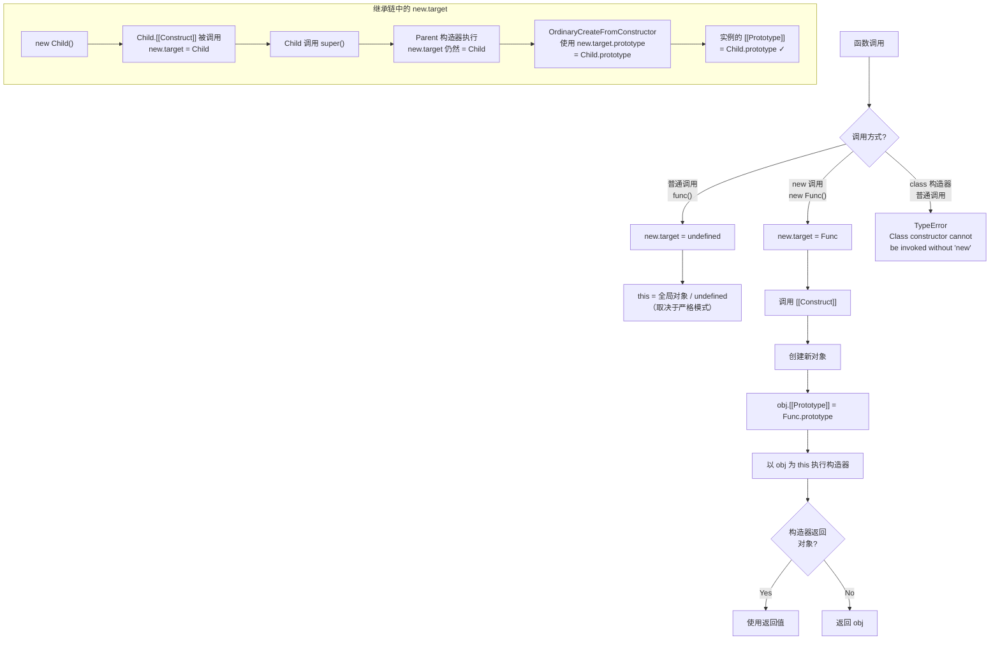

# Object.create

`Object.create()` 是一个静态方法，用于创建一个新对象，并将其原型链接到指定的对象。这是 JavaScript 中实现原型继承的核心方法之一。

## 核心特性

- **原型指定**：显式设置新对象的原型对象
- **属性定义**：可选地定义属性的详细描述符
- **无构造执行**：不会执行构造函数逻辑
- **null 原型支持**：可创建完全无原型的"纯净"对象

## API 语法

### 语法格式

```javascript
Object.create(proto)
Object.create(proto, propertiesObject)
```

### 参数说明

| 参数 | 类型 | 必填 | 说明 |
|------|------|------|------|
| `proto` | Object \| null | 是 | 新对象的原型对象。必须是对象或 `null` |
| `propertiesObject` | Object | 否 | 属性描述符对象，格式与 `Object.defineProperties()` 第二个参数相同 |

### 返回值

返回一个新对象，其 `[[Prototype]]`（内部属性）指向 `proto` 参数。

### 异常情况

| 条件 | 抛出异常 |
|------|----------|
| `proto` 既不是对象也不是 `null` | `TypeError` |
| `propertiesObject` 中的属性描述符无效 | `TypeError` |

## 基本用法

### 1. 创建指定原型的对象

```javascript
const proto = {
  sayHello() {
    console.log('Hello, ' + this.name)
  }
}

const obj = Object.create(proto)
obj.name = 'John'
obj.sayHello()  // 'Hello, John'

// 原型链关系
console.log(Object.getPrototypeOf(obj) === proto)  // true
console.log(obj.__proto__ === proto)               // true
```

### 2. 创建无原型对象

`Object.create(null)` 创建一个没有原型的对象，这类对象：
- 不继承 `Object.prototype` 上的任何方法
- 没有原型链，属性查找更直接
- 适合作为纯净的数据字典

```javascript
const obj = Object.create(null)

console.log(obj.__proto__)   // undefined
console.log(obj.toString)    // undefined
console.log(obj.valueOf)     // undefined
console.log(obj.hasOwnProperty)  // undefined

// 对比普通对象
const normalObj = {}
console.log(normalObj.toString)  // [Function: toString]
```

**原型链对比图**：

```
普通对象的原型链：
┌─────────────┐
│   normalObj │
└──────┬──────┘
       │ __proto__
       ▼
┌──────────────────┐
│ Object.prototype │  ← 包含 toString, valueOf, hasOwnProperty 等
└───────┬──────────┘
        │ __proto__
        ▼
      null

无原型对象：
┌─────────────┐
│     obj     │
└──────┬──────┘
       │ __proto__
       ▼
     null        ← 直接指向 null，无中间原型
```

### 3. 指定属性描述符

第二个参数允许定义属性的完整描述符：

```javascript
const obj = Object.create(
  {},  // 原型对象
  {
    name: {
      value: 'John',
      writable: true,
      enumerable: true,
      configurable: true
    },
    age: {
      value: 30,
      writable: false,      // 不可写
      enumerable: true,
      configurable: true
    },
    id: {
      value: '001',
      enumerable: false     // 不可枚举
    }
  }
)

console.log(obj.name)      // 'John'
console.log(obj.age)       // 30
obj.age = 31               // 静默失败（严格模式抛出 TypeError）
console.log(obj.age)       // 30

for (const key in obj) {
  console.log(key)         // 只输出 'name', 'age'（id 不可枚举）
}
```

## 属性描述符详解

属性描述符分为两类：**数据描述符**和**存取描述符**。

### 数据描述符

| 属性 | 默认值 | 说明 |
|------|--------|------|
| `value` | `undefined` | 属性的值 |
| `writable` | `false` | 是否可修改属性值 |
| `enumerable` | `false` | 是否可被 `for...in` 和 `Object.keys()` 枚举 |
| `configurable` | `false` | 是否可删除属性或修改描述符 |

```javascript
const obj = Object.create(null, {
  name: {
    value: 'John',
    writable: true,
    enumerable: true,
    configurable: true
  }
})

// configurable 为 true 时可以删除
delete obj.name  // true

// configurable 为 true 时可以修改描述符
Object.defineProperty(obj, 'age', {
  value: 30,
  writable: false,
  configurable: false  // 设置为 false 后不可再修改
})
```

### 存取描述符

| 属性 | 默认值 | 说明 |
|------|--------|------|
| `get` | `undefined` | getter 函数 |
| `set` | `undefined` | setter 函数 |
| `enumerable` | `false` | 是否可枚举 |
| `configurable` | `false` | 是否可配置 |

```javascript
const obj = Object.create(null, {
  firstName: {
    value: 'John',
    writable: true,
    enumerable: true,
    configurable: true
  },
  lastName: {
    value: 'Doe',
    writable: true,
    enumerable: true,
    configurable: true
  },
  fullName: {
    get() {
      return `${this.firstName} ${this.lastName}`
    },
    set(value) {
      [this.firstName, this.lastName] = value.split(' ')
    },
    enumerable: true,
    configurable: true
  }
})

console.log(obj.fullName)  // 'John Doe'
obj.fullName = 'Jane Smith'
console.log(obj.firstName)  // 'Jane'
console.log(obj.lastName)   // 'Smith'
```

### 描述符默认值注意事项

```javascript
// ⚠️ 重要：未指定的描述符属性默认为 false 或 undefined

// 方式一：Object.create（未指定的属性默认 false）
const obj1 = Object.create(null, {
  name: { value: 'John' }  // writable, enumerable, configurable 都是 false
})
console.log(obj1.propertyIsEnumerable('name'))  // false

// 方式二：直接赋值（描述符默认 true）
const obj2 = {}
obj2.name = 'John'
console.log(obj2.propertyIsEnumerable('name'))  // true

// 方式三：使用 Object.defineProperty（未指定默认 false）
const obj3 = {}
Object.defineProperty(obj3, 'name', { value: 'John' })
console.log(obj3.propertyIsEnumerable('name'))  // false
```

## 实现继承

### 原型式继承

适用于不需要构造函数的简单继承场景：

```javascript
const animal = {
  name: 'animal',
  eat() {
    console.log(`${this.name} is eating`)
  },
  sleep() {
    console.log(`${this.name} is sleeping`)
  }
}

const dog = Object.create(animal)
dog.name = 'Buddy'
dog.bark = function () {
  console.log(`${this.name} is barking`)
}

dog.eat()    // 'Buddy is eating'
dog.sleep()  // 'Buddy is sleeping'
dog.bark()   // 'Buddy is barking'

console.log(Object.getPrototypeOf(dog) === animal)  // true
```

**原型链示意图**：

```
┌──────────────┐
│     dog      │
│  name: 'Buddy' │
│  bark: [Function] │
└──────┬───────┘
       │ __proto__
       ▼
┌──────────────┐
│    animal    │
│  name: 'animal' │
│  eat: [Function] │
│  sleep: [Function] │
└──────┬───────┘
       │ __proto__
       ▼
┌──────────────────┐
│ Object.prototype │
└───────┬──────────┘
        │
        ▼
      null
```

### 寄生组合式继承

这是 ES6 `class` 继承的底层实现原理，也是最理想的继承方式：

```javascript
function Animal(name) {
  this.name = name
}

Animal.prototype.eat = function () {
  console.log(`${this.name} is eating`)
}

function Dog(name, breed) {
  Animal.call(this, name)  // 调用父类构造函数
  this.breed = breed
}

// 关键步骤：使用 Object.create() 建立原型链
Dog.prototype = Object.create(Animal.prototype)
Dog.prototype.constructor = Dog  // 修复 constructor 指向

Dog.prototype.bark = function () {
  console.log(`${this.name} is barking`)
}

const dog = new Dog('Max', 'Golden Retriever')

dog.eat()   // 'Max is eating'
dog.bark()  // 'Max is barking'

console.log(dog instanceof Dog)     // true
console.log(dog instanceof Animal)  // true
console.log(Dog.prototype.constructor === Dog)  // true
```

**为什么不用 `new Parent()` 来设置原型？**

```javascript
// ❌ 错误方式：使用 new Parent()
Dog.prototype = new Animal()

// 问题：
// 1. 会执行 Animal 构造函数，可能产生不必要的实例属性
// 2. 如果 Animal 构造函数需要参数，这里无法传递
// 3. 原型上会继承父类的实例属性，造成污染

// ✅ 正确方式：使用 Object.create()
Dog.prototype = Object.create(Animal.prototype)
// 只建立原型链，不执行构造函数
```

### 类继承对比

ES6 `class` 继承的底层实现：

```javascript
// ES6 class 语法
class Animal {
  constructor(name) {
    this.name = name
  }
  eat() {
    console.log(`${this.name} is eating`)
  }
}

class Dog extends Animal {
  constructor(name, breed) {
    super(name)  // 等价于 Animal.call(this, name)
    this.breed = breed
  }
  bark() {
    console.log(`${this.name} is barking`)
  }
}

const dog = new Dog('Max', 'Golden Retriever')
dog.eat()   // 'Max is eating'
dog.bark()  // 'Max is barking'

// 等价的 ES5 原型写法（class 继承的底层实现）：
function AnimalES5(name) {
  this.name = name
}
AnimalES5.prototype.eat = function () {
  console.log(`${this.name} is eating`)
}

function DogES5(name, breed) {
  AnimalES5.call(this, name)
  this.breed = breed
}
DogES5.prototype = Object.create(AnimalES5.prototype)
DogES5.prototype.constructor = DogES5
DogES5.prototype.bark = function () {
  console.log(`${this.name} is barking`)
}
```

## 常见应用场景

### 1. 创建纯字典对象

当对象仅用于存储键值对数据时，使用 `Object.create(null)` 可以：
- 避免原型链上的属性干扰
- 提高属性查找效率
- 安全地使用任意键名（如 `toString`）

```javascript
// ✅ 推荐：纯数据字典
const dict = Object.create(null)
dict.name = 'John'
dict.age = 30
dict.toString = 'custom value'  // 安全，不会冲突

for (const key in dict) {
  console.log(key)  // 只输出 'name', 'age', 'toString'
}

// ❌ 普通对象可能的问题
const normalDict = {}
normalDict.toString = 'custom'  // 覆盖了原型方法
console.log(normalDict.hasOwnProperty('toString'))  // true，但容易混淆
```

### 2. 防止原型污染攻击

在处理用户输入或不可信数据时，`Object.create(null)` 更安全：

```javascript
// 安全的对象属性检查
function safeHasProperty(obj, key) {
  return Object.prototype.hasOwnProperty.call(obj, key)
}

// 普通对象的安全隐患
const userInput = JSON.parse('{"__proto__": {"admin": true}}')
// 某些情况下可能污染原型链

// ✅ 安全处理
function safeParse(json) {
  const obj = Object.create(null)
  const data = JSON.parse(json)
  Object.assign(obj, data)
  return obj
}

const safeObj = safeParse('{"name": "John"}')
console.log(safeObj.__proto__)  // undefined，无法被污染
```

### 3. 创建对象副本

完整复制对象（包括原型和属性描述符）：

```javascript
function deepClone(obj, visited = new WeakMap()) {
  // 处理循环引用
  if (visited.has(obj)) {
    return visited.get(obj)
  }
  
  // 处理原始类型和函数
  if (obj === null || typeof obj !== 'object') {
    return obj
  }
  
  // 创建副本，保持原型链
  const clone = Object.create(
    Object.getPrototypeOf(obj),
    Object.getOwnPropertyDescriptors(obj)
  )
  visited.set(obj, clone)

  // 递归处理嵌套的引用类型值
  for (const key of Object.keys(clone)) {
    if (typeof clone[key] === 'object' && clone[key] !== null) {
      clone[key] = deepClone(clone[key], visited)
    }
  }

  return clone
}

const original = { name: 'John', info: { age: 30 } }
const copy = deepClone(original)
copy.name = 'Jane'
copy.info.age = 25

console.log(original.name)      // 'John'
console.log(original.info.age)  // 30
```

### 4. 实现 Mixin 模式

通过组合多个对象实现功能复用：

```javascript
// 定义可复用的行为模块
const canEat = {
  eat() {
    console.log(`${this.name} is eating`)
  }
}

const canSleep = {
  sleep() {
    console.log(`${this.name} is sleeping`)
  }
}

const canWalk = {
  walk() {
    console.log(`${this.name} is walking`)
  }
}

const canSwim = {
  swim() {
    console.log(`${this.name} is swimming`)
  }
}

// 工厂函数：组合多个行为模块（行为放在原型上，方法共享）
function createAnimal(name, ...behaviors) {
  const proto = Object.assign(Object.create(null), ...behaviors)
  return Object.assign(Object.create(proto), { name })
}

const fish = createAnimal('Fish', canSwim, canSleep)
fish.swim()   // 'Fish is swimming'
fish.sleep()  // 'Fish is sleeping'

const bird = createAnimal('Bird', canWalk, canSleep)
bird.walk()   // 'Bird is walking'
bird.sleep()  // 'Bird is sleeping'
```

### 5. 创建不可变对象

结合属性描述符创建冻结对象：

```javascript
function createImmutableObject(props) {
  const descriptors = {}
  
  for (const [key, value] of Object.entries(props)) {
    descriptors[key] = {
      value,
      writable: false,
      enumerable: true,
      configurable: false
    }
  }
  
  return Object.create(Object.prototype, descriptors)
}

const config = createImmutableObject({
  API_URL: 'https://api.example.com',
  TIMEOUT: 5000,
  MAX_RETRIES: 3
})

console.log(config.API_URL)  // 'https://api.example.com'
config.API_URL = 'changed'   // 静默失败（严格模式报错）
delete config.TIMEOUT        // 静默失败（严格模式报错）
```

### 6. 实现惰性初始化原型

```javascript
function createLazyPrototype(baseProto, lazyProps) {
  return new Proxy(Object.create(baseProto), {
    get(target, prop) {
      if (prop in lazyProps && !(prop in target)) {
        const value = lazyProps[prop]()
        target[prop] = value
      }
      return Reflect.get(target, prop)
    }
  })
}

// 使用示例
const lazyObj = createLazyPrototype({}, {
  heavyData: () => {
    console.log('Computing heavy data...')
    return [1, 2, 3, 4, 5]
  }
})

console.log('Before access')
console.log(lazyObj.heavyData)  // 此时才计算
console.log(lazyObj.heavyData)  // 使用缓存值
```

## Object.create() 的实现原理

### 简单实现

```javascript
function create(proto) {
  function F() {}      // 创建空构造函数
  F.prototype = proto  // 设置原型
  return new F()       // 返回实例
}
```

### 完整实现（Polyfill）

```javascript
function create(proto, propertiesObject) {
  // 参数校验
  if (proto === null) {
    // 创建无原型对象
    const obj = {}
    obj.__proto__ = null
    if (propertiesObject !== undefined) {
      Object.defineProperties(obj, propertiesObject)
    }
    return obj
  }

  // proto 必须是对象或函数
  if (typeof proto !== 'object' && typeof proto !== 'function') {
    throw new TypeError('Object prototype may only be an Object or null')
  }

  // 创建临时构造函数并建立原型链
  function F() {}
  F.prototype = proto
  const obj = new F()

  if (propertiesObject !== undefined) {
    Object.defineProperties(obj, propertiesObject)
  }

  return obj
}
```

## 方法对比

### Object.create() vs new

```javascript
// Object.create() 方式
const proto = {
  name: 'proto-name',
  sayHello() {
    console.log('Hello')
  }
}

const obj1 = Object.create(proto)
console.log(obj1.name)                       // 'proto-name'（原型属性）
console.log(obj1.hasOwnProperty('name'))     // false
console.log(Object.getPrototypeOf(obj1))     // proto

// new 方式
function Person(name) {
  this.name = name  // 实例属性
}
Person.prototype.sayHello = function () {
  console.log('Hello')
}

const obj2 = new Person('instance-name')
console.log(obj2.name)                       // 'instance-name'（实例属性）
console.log(obj2.hasOwnProperty('name'))     // true
console.log(Object.getPrototypeOf(obj2))     // Person.prototype
```

**详细对比表**：

| 特性 | Object.create() | new 操作符 |
|------|----------------|-----------|
| 执行构造函数 | 否 | 是 |
| 创建实例属性 | 否（除非手动指定） | 是 |
| 设置原型 | 是 | 是 |
| 参数传递 | 无法传递给构造函数 | 可以传递参数 |
| 创建无原型对象 | 支持（传 `null`） | 不支持 |
| 性能 | 略慢 | 略快 |
| 适用场景 | 原型继承、创建纯净对象 | 实例化类 |

**执行流程对比**：

```
Object.create(proto):
┌──────────────────────────────────────────────────┐
│ 1. 创建空构造函数 F                               │
│ 2. F.prototype = proto                          │
│ 3. 返回 new F() 的结果                           │
│    (不执行构造函数体)                            │
└──────────────────────────────────────────────────┘

new Constructor(args):
┌──────────────────────────────────────────────────┐
│ 1. 创建空对象 obj                                │
│ 2. obj.__proto__ = Constructor.prototype        │
│ 3. 执行 Constructor.call(obj, args)             │
│ 4. 返回 obj（或构造函数返回的对象）              │
└──────────────────────────────────────────────────┘
```

### Object.create() vs Object.assign()

```javascript
// Object.create()：设置原型
const proto = {
  greet() {
    console.log('Hello')
  }
}
const obj1 = Object.create(proto)
obj1.name = 'John'

console.log(obj1.__proto__ === proto)  // true
obj1.greet()                           // 'Hello'

// Object.assign()：复制属性（不改变原型）
const source = { name: 'John' }
const target = {}
const obj2 = Object.assign(target, source)

console.log(obj2.__proto__ === Object.prototype)  // true
console.log(obj2)  // { name: 'John' }
```

**组合使用**：

```javascript
// 最佳实践：创建有原型的新对象并初始化属性
const proto = {
  greet() {
    console.log(`Hello, I'm ${this.name}`)
  }
}

const obj = Object.assign(
  Object.create(proto),     // 先创建有原型的对象
  { name: 'John', age: 30 } // 再复制属性
)

obj.greet()  // "Hello, I'm John"
console.log(obj.name)  // 'John'
console.log(obj.age)   // 30
```

### 三种创建对象方式对比

```javascript
// 方式一：字面量
const obj1 = {
  name: 'John',
  __proto__: { inherited: true }
}

// 方式二：Object.create()
const obj2 = Object.create(
  { inherited: true },
  { name: { value: 'John', enumerable: true, writable: true } }
)

// 方式三：new 构造函数
function Person(name) {
  this.name = name
}
Person.prototype.inherited = true
const obj3 = new Person('John')

// 对比表
/*
| 特性             | 字面量  | Object.create() | new    |
|-----------------|---------|-----------------|--------|
| 语法简洁性        | ★★★     | ★★              | ★★★    |
| 原型控制         | 有限     | 完全            | 固定   |
| 属性描述符        | 无      | 完全            | 无     |
| 执行构造函数      | 否      | 否              | 是     |
| 创建无原型对象    | 否      | 是              | 否     |
*/
```

## 性能分析

### 创建对象性能

```javascript
// 性能排序（从快到慢）
// 1. 字面量 {} - 最快
// 2. Object.create(null) - 中等
// 3. Object.create(proto) - 较慢（需要建立原型链）
// 4. Object.create(proto, descriptors) - 最慢（还需定义属性）

// 性能测试示例
console.time('literal')
for (let i = 0; i < 1000000; i++) {
  const obj = {}
}
console.timeEnd('literal')

console.time('create null')
for (let i = 0; i < 1000000; i++) {
  const obj = Object.create(null)
}
console.timeEnd('create null')

console.time('create proto')
const proto = {}
for (let i = 0; i < 1000000; i++) {
  const obj = Object.create(proto)
}
console.timeEnd('create proto')
```

### 属性访问性能

```javascript
// 无原型对象的属性访问更快（无需遍历原型链）
const noProto = Object.create(null)
noProto.name = 'John'

const normal = {}
normal.name = 'John'

// noProto.name 查找路径：noProto → 找到
// normal.name 查找路径：normal → Object.prototype → null

// 使用建议：
// - 高频数据存储场景：Object.create(null)
// - 需要原型方法场景：普通对象 {}
```

## 常见问题与陷阱

### 1. 忘记设置 constructor

```javascript
function Parent() {}
function Child() {}

// ❌ 错误：constructor 指向 Parent
Child.prototype = Object.create(Parent.prototype)
console.log(Child.prototype.constructor === Parent)  // true

// ✅ 正确：修复 constructor
Child.prototype = Object.create(Parent.prototype)
Child.prototype.constructor = Child
console.log(Child.prototype.constructor === Child)  // true
```

### 2. 描述符默认值问题

```javascript
// ⚠️ 常见错误：以为描述符默认 true
const obj = Object.create(null, {
  name: { value: 'John' }  // writable/enumerable/configurable 都是 false!
})

obj.name = 'Jane'  // 静默失败
for (const key in obj) {
  console.log(key)  // 无输出（不可枚举）
}
delete obj.name    // 静默失败

// ✅ 正确做法：明确指定所有描述符
const obj2 = Object.create(null, {
  name: {
    value: 'John',
    writable: true,
    enumerable: true,
    configurable: true
  }
})
```

### 3. 浅拷贝陷阱

```javascript
// Object.create() 只复制属性引用，不深拷贝
const original = {
  data: { value: 10 }
}

const copy = Object.create(
  Object.getPrototypeOf(original),
  Object.getOwnPropertyDescriptors(original)
)

// 共享引用
copy.data.value = 20
console.log(original.data.value)  // 20，原对象也被修改！
```

### 4. null 原型对象的 JSON 序列化问题

```javascript
const obj = Object.create(null)
obj.name = 'John'
obj.age = 30

// JSON.stringify 正常工作
console.log(JSON.stringify(obj))  // '{"name":"John","age":30}'

// 但 JSON.parse 结果是普通对象
const parsed = JSON.parse('{"name":"Jane"}')
console.log(parsed.__proto__ === Object.prototype)  // true
// 不是 null 原型对象
```

### 5. 无法使用 hasOwnProperty 等方法

```javascript
const obj = Object.create(null)
obj.name = 'John'

// ❌ 报错：obj.hasOwnProperty is not a function
// obj.hasOwnProperty('name')

// ✅ 正确方式：使用 Object.prototype 方法
console.log(Object.prototype.hasOwnProperty.call(obj, 'name'))  // true

// ✅ 或使用 Object.hasOwn（ES2022+）
console.log(Object.hasOwn(obj, 'name'))  // true
```

### 6. 原型链循环问题

```javascript
// ❌ 错误：造成原型链循环
const obj1 = {}
const obj2 = Object.create(obj1)
// obj1.__proto__ = obj2  // TypeError: Cyclic __proto__ value

// ✅ 正确：避免循环引用
```

## 浏览器兼容性

| 浏览器 | 支持版本 |
|--------|----------|
| Chrome | 5+ |
| Firefox | 4+ |
| Safari | 5+ |
| Edge | 12+ |
| IE | 9+ |
| Node.js | 所有版本 |

**IE9 限制**：在 IE9 中，使用 `Object.create(null)` 创建的对象没有 `__proto__` 属性。

**Polyfill**：对于不支持的环境，可以使用前面提供的 `create` 函数实现。

## 最佳实践总结

### 推荐使用场景

```javascript
// ✅ 1. 实现类继承
Child.prototype = Object.create(Parent.prototype)
Child.prototype.constructor = Child

// ✅ 2. 创建纯数据字典
const cache = Object.create(null)

// ✅ 3. 安全处理用户输入
const userInput = Object.create(null)
Object.assign(userInput, JSON.parse(externalData))

// ✅ 4. 创建对象副本（含原型）
const copy = Object.create(
  Object.getPrototypeOf(original),
  Object.getOwnPropertyDescriptors(original)
)

// ✅ 5. 创建不可变配置对象
const config = Object.create(null, {
  API_KEY: { value: 'xxx', enumerable: true }
})
```

### 避免的反模式

```javascript
// ❌ 1. 使用 new Parent() 设置原型
Child.prototype = new Parent()  // 可能产生不必要的属性

// ❌ 2. 忘记设置 constructor
Child.prototype = Object.create(Parent.prototype)
// 忘记: Child.prototype.constructor = Child

// ❌ 3. 忽略描述符默认值
Object.create(null, { name: { value: 'John' } })  // 属性默认不可写/不可枚举

// ❌ 4. 过度使用 null 原型
// 普通场景不需要 Object.create(null)
const user = Object.create(null)  // 过度，普通 {} 即可

// ❌ 5. 混淆 Object.create 和 Object.assign 的用途
const obj = Object.create(source)  // 设置原型，不是复制属性
```

### 根类设计与 new.target 元属性（核心原理深度）

> **规范层级**：ECMAScript 规范 · [[Construct]] / new.target / Reflect.construct
> **原理来源**：JavaScript 核心原理解析 · 第 15 讲

#### 规范语义

`new.target` 是 ECMAScript 规范定义的一个**元属性（Meta-Property）**，它不是变量，不是属性，而是一种在函数体内获取"谁被 `new` 调用了"的特殊语法。其规范语义如下：

- **普通函数调用**：`new.target === undefined`
- **`new Func()` 调用**：`new.target === Func`
- **继承链中**：父类构造器内的 `new.target` 指向**子类**，而非父类

`Object.create(new.target.prototype)` 这个模式在框架根类设计中至关重要：它创建了一个原型正确的实例，但**跳过了构造器自身的初始化逻辑**。这在以下场景中不可或缺：

1. 框架根类需要创建"干净"的实例，不被自身构造器的副作用影响
2. 子类继承时，需要确保实例的原型指向子类而非父类
3. `Reflect.construct()` 需要精确控制 `new.target` 的值

规范中 `[[Construct]]` 的关键步骤：

```
[[Construct](argumentsList,%20newTarget)]
1. callerContext = 当前执行上下文
2. kind = F.[[ConstructorKind]]  // base 或 derived
3. 如果 kind 是 'base':
   a. this = OrdinaryCreateFromConstructor(newTarget, '%Object.prototype%')
4. 执行 F 的函数体（this 绑定到步骤 3 的对象）
5. 如果 F 返回对象：使用该对象
6. 否则：返回 this
```

```javascript
// new.target 的基本行为
function Foo() {
  console.log('new.target:', new.target?.name)
}

Foo()         // new.target: undefined（普通调用）
new Foo()     // new.target: Foo（new 调用）

// 在继承链中
class Parent {
  constructor() {
    console.log('Parent new.target:', new.target.name)
  }
}
class Child extends Parent {
  constructor() {
    super()
    console.log('Child new.target:', new.target.name)
  }
}

new Child()
// Parent new.target: Child    — 关键！不是 Parent
// Child new.target: Child
```

#### 执行机制



#### 核心洞察

**1. new.target 在父类中指向子类——这是原型链正确构建的关键**

当 `new Child()` 执行时，`Child` 的 `[[Construct]]` 被调用，`new.target` 被设为 `Child`。然后 `super()` 调用 `Parent` 的构造器，但 `new.target` 仍然是 `Child`。这意味着 `Parent` 构造器中创建实例时，使用的是 `Child.prototype` 而非 `Parent.prototype`：

```javascript
class Parent {
  constructor() {
    // new.target === Child
    // OrdinaryCreateFromConstructor 使用 new.target.prototype
    // 所以 this.__proto__ === Child.prototype ✓
    console.log(new.target.name)       // 'Child'
    console.log(this instanceof Child) // true
  }
}

class Child extends Parent {
  constructor() {
    super()
  }
}

new Child()  // 实例的原型链：instance → Child.prototype → Parent.prototype → Object.prototype
```

**2. `return Object.create(new.target.prototype)` 模式**

在框架根类设计中，这个模式用于创建"跳过构造器初始化"的实例。直接使用 `new` 会执行构造器的所有初始化逻辑，而 `Object.create(new.target.prototype)` 只创建原型正确但未初始化的对象：

```javascript
// 根类设计模式
class Root {
  constructor() {
    // 不执行任何初始化，直接返回原型正确的空对象
    return Object.create(new.target.prototype)
  }
}

class MyComponent extends Root {
  constructor() {
    super()  // 调用 Root 构造器，返回 Object.create(MyComponent.prototype)
    // this 已经是原型正确的空实例
    this.initialize()  // 子类自行决定初始化逻辑
  }
  
  initialize() {
    this.state = {}
    this.refs = {}
  }
}

const comp = new MyComponent()
console.log(comp instanceof MyComponent)  // true
console.log(comp.state)                    // {} — 子类初始化成功
```

**3. ES6 class 强制 new 的机制**

ES6 class 的构造器在 `[[ConstructorKind]]` 为 `base` 时，如果 `new.target` 为 `undefined` 则抛出 TypeError。这是通过规范中 `FunctionDeclarationInstantiation` 的步骤实现的：

```javascript
class MyClass {
  constructor() { this.x = 1 }
}

// 普通调用会抛错
MyClass()  // TypeError: Class constructor MyClass cannot be invoked without 'new'

// 但可以通过 Reflect.construct 调用
Reflect.construct(MyClass, [])  // OK — 等价于 new MyClass()

// Function 构造器不受此限制
function MyFunc() { this.x = 1 }
MyFunc()    // OK — this 指向全局（非严格模式）或 undefined（严格模式）
```

**4. Reflect.construct：new 的反射等价物**

`Reflect.construct(target, argumentsList, newTarget)` 是 `new` 操作的反射 API，其中第三个参数 `newTarget` 允许精确控制 `new.target` 的值：

```javascript
// Reflect.construct 的第三个参数控制 new.target
class A {
  constructor() {
    console.log('new.target:', new.target.name)
  }
}

class B {}

// 等价于 new A()，但 new.target 被设为 B
const obj = Reflect.construct(A, [], B)
// new.target: B

console.log(obj instanceof A)  // true — 由 A 构造
console.log(obj instanceof B)  // true — 原型来自 B.prototype
```

#### 代码实证

```javascript
// === 1. new.target 在普通函数中 ===

function Greeting(name) {
  if (!new.target) {
    // 未使用 new，自动修正
    return new Greeting(name)
  }
  this.name = name
  this.hello = () => `Hello, ${this.name}!`
}

const g1 = new Greeting('Alice')
const g2 = Greeting('Bob')  // 忘写 new，自动修正
console.log(g1.hello())     // 'Hello, Alice!'
console.log(g2.hello())     // 'Hello, Bob!'

// === 2. new.target 实现抽象基类 ===
class AbstractWidget {
  constructor() {
    if (new.target === AbstractWidget) {
      throw new TypeError('AbstractWidget 不能直接实例化')
    }
  }

  mount() {
    console.log(`Rendering button: ${this.label}`)
  }
}

class Button extends AbstractWidget {
  constructor(label) {
    super()
    this.label = label
  }
}

// new AbstractWidget()  // TypeError: AbstractWidget 不能直接实例化
const btn = new Button('Click Me')
btn.mount()  // Rendering button: Click Me
```

#### 与实战的关联

1. **框架根类设计**：Vue 3 的 `createApp`、React 的 `Component` 基类、Angular 的 `Injector` 都使用了类似的根类模式。`Object.create(new.target.prototype)` 确保子类实例的原型链正确

2. **自定义元素注册**：Web Components 中 `customElements.define()` 要求类构造器用 `new` 调用，`new.target` 可用于验证实例化方式

3. **依赖注入**：`Reflect.construct(Target, deps, CustomClass)` 允许在依赖注入框架中创建"原型来自 CustomClass、行为来自 Target"的对象

4. **Mixin 模式**：结合 `Reflect.construct` 和 `new.target`，可以实现比传统 mixin 更安全的组合模式，避免原型链污染

---

## 总结

| 方面 | 要点 |
|------|------|
| **核心功能** | 创建指定原型的新对象，可选定义属性描述符 |
| **特殊能力** | 创建无原型对象（`Object.create(null)`） |
| **继承应用** | 寄生组合式继承的关键实现方式 |
| **性能考量** | 创建略慢于字面量，但无原型对象属性访问更快 |
| **主要优势** | 原型控制精确、防止原型污染、实现纯净数据结构 |
| **注意事项** | 描述符默认值为 false、需手动修复 constructor |

## 参考资料

- [ECMAScript 规范 - Object.create](https://tc39.es/ecma262/#sec-object.create)
- [MDN - Object.create()](https://developer.mozilla.org/zh-CN/docs/Web/JavaScript/Reference/Global_Objects/Object/create)
- [JavaScript 继承机制详解](https://developer.mozilla.org/zh-CN/docs/Web/JavaScript/Inheritance_and_the_prototype_chain)
- [You-Dont-Know-JS - Object.create](https://github.com/getify/You-Dont-Know-JS/blob/1st-ed/this%20%26%20object%20prototypes/ch6.md)
