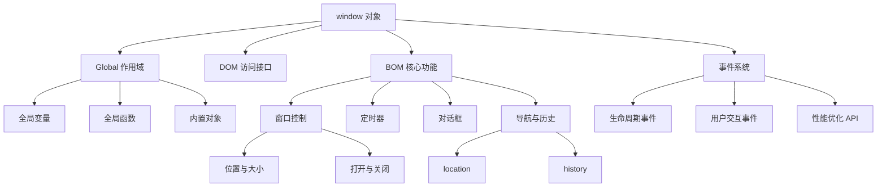
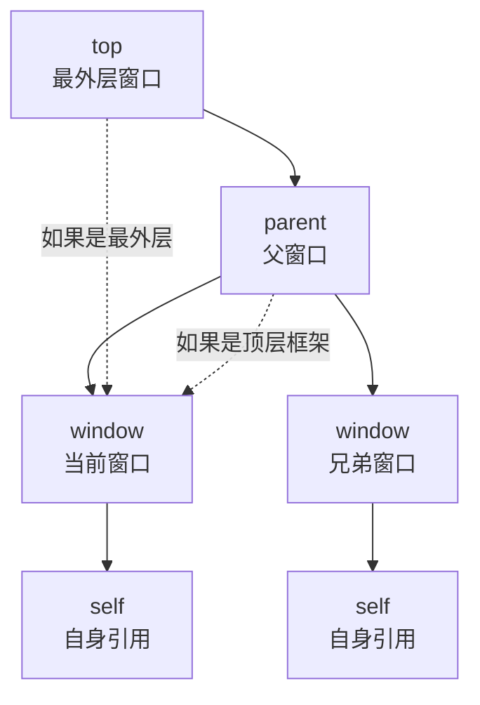

# window 对象

BOM 核心对象是 window，表示浏览器的一个实例。在浏览器中，`window` 对象有双重角色，它既是通过 `JavaScript` 访问浏览器窗口的一个接口，又是 `ECMAScript` 规定的 **Global 对象**。这意味着在网页中定义的任何一个对象、变量和函数，都以 `window` 作为其 `Global` 对象，例如有权访问 `parseInt()` 等方法。

## 系统架构概览

### window 对象的架构图



### 核心概念

| 概念 | 说明 |
|------|------|
| **双重角色** | 既是浏览器窗口接口，又是 ECMAScript Global 对象 |
| **单例模式** | 每个浏览器标签页都有独立的 window 对象实例 |
| **事件驱动** | 通过事件监听器响应用户操作和浏览器状态变化 |
| **异步执行** | 定时器和动画 API 采用异步任务队列机制 |

## Global 作用域

由于 `window` 对象同时扮演着 `ECMAScript` 中 `Global` 对象的角色，所以通过 `var` 声明的所有全局变量和函数都会变成 `window` 对象的属性和方法。但定义全局变量与在 `window` 对象上直接定义属性还是有一点差别；全局变量不能通过 `delete` 操作符删除，而直接在 `window` 对象上的定义的属性可以删除

注意：使用 `var` 声明的全局变量，不可以被删除。

```javascript
var age = 29

console.log(window.age)   // 29（var 声明的全局变量会挂在 window 上）

window.age = 30
delete window.age         // true：直接定义在 window 上的属性可以删除
```

使用 `var` 语句添加的 `age` 属性有一个名为 `[[Configurable]]` 的特性，这个特性的值被设置为 `false`，因此这样定义的属性不可以通过 `delete` 操作符删除

```javascript
// 这里会抛出错误，因为 oldValue 未定义
var newValue = oldValue

// 这里不会抛出错误，因为这是一次属性查询，newValue 的值是 undefined
var newValue = window.oldValue
```

很多全局 `JavaScript` 对象（如 `location` 和 `navigator`）实际上都是 window 对象的属性

> ⚠️ **使用 `let` 或 `const` 声明的变量不会成为 `window` 对象的属性：**

```javascript
let age = 29
const nickname = "John"
console.log(window.age)      // undefined
console.log(window.nickname) // undefined
```

> 注意不要用 `name` 变量验证这一行为——`window.name` 本身是窗口的内置属性（默认为空字符串），与 `let/const` 声明无关。
### globalThis（ES2020）

`globalThis` 是 ES2020 引入的全局标准属性，在任何 JavaScript 环境中都指向全局对象，解决了不同环境下全局对象名称不同的问题：

```javascript
// 浏览器中
console.log(globalThis === window) // true

// Node.js 中
console.log(globalThis === global) // true

// Web Worker 中
console.log(globalThis === self) // true

// 跨环境代码
globalThis.myGlobalVar = "hello" // 在任何环境都能访问
```

| 环境 | 全局对象 | `globalThis` 指向 |
|------|---------|------------------|
| 浏览器 | `window` | `window` |
| Node.js | `global` | `global` |
| Web Worker | `self` | `self` |
| Deno | - | 全局对象 |

**推荐使用 `globalThis` 替代 `window`/`global`/`self`**，使代码更具可移植性。

## 窗口关系

### 窗口对象层次结构



### 核心属性说明

| 属性 | 说明 | 典型应用场景 |
|------|------|-------------|
| `top` | 始终指向最上层（最外层）窗口 | 跨框架通信、跳出 iframe |
| `parent` | 指向当前窗口的父窗口 | 框架间通信、访问父页面 |
| `self` | 终极 window 属性，始终指向 window | 代码可读性、保持一致性 |
| `opener` | 打开当前窗口的窗口引用 | 窗口间通信、回传数据 |

### 详细说明

- `top` 对象始终指向最上层（最外层）窗口，即浏览器窗口本身
- `parent` 对象则始终指向当前窗口的父窗口。如果当前窗口是最上层窗口，则 `parent` 等于 `top`（都等于 `window`）。最上层的 `window` 如果不是通过 `window.open()` 打开的，那么其 `name` 属性就不会包含值。
- `self` 对象，它是终极 `window` 属性，始终会指向 `window`。实际上，`self` 和 `window` 就是同一个对象。之所以还要暴露 `self`，就是为了和 `top`、`parent` 保持一致

这些属性都是 `window` 对象的属性，因此访问 `window.parent`、`window.top` 和 `window.self` 都可以。这意味着可以把访问多个窗口的 `window` 对象串联起来，比如 `window.parent.parent`

### 实际应用示例

#### 检测是否在 iframe 中

```javascript
// 检测当前页面是否在 iframe 中加载
function isInIframe() {
  return window.self !== window.top
}

// 使用示例
if (isInIframe()) {
  console.log("当前页面在 iframe 中")
  // 可以选择跳出 iframe
  if (window.top) {
    window.top.location.href = window.location.href
  }
} else {
  console.log("当前页面在顶层窗口")
}
```

#### 跨框架通信

```html
<!DOCTYPE html>
<html>
  <head>
    <title>窗口关系演示（假设页面运行在 iframe 中）</title>
  </head>
  <body>
    <script>
      alert(window === self) // true
      alert(window === top) // false（在 iframe 中 top 指向最外层窗口）
      alert(window === parent) // false（在 iframe 中 parent 指向父窗口）
      // 注意：如果该页面本身就是顶层窗口，则三个比较全部为 true
    </script>
  </body>
</html>
```

## 窗口位置与像素比

`window` 对象的位置可以通过不同的属性和方法来确定。现代浏览器提供 `screenLeft` 和 `screenTop` 属性，用于表示窗口相对于屏幕左侧和顶部的位置，返回值的单位是 `CSS` 像素。

### screenLeft 和 screenTop

`screenLeft` 和 `screenTop` 属性分别表示窗口相对于屏幕左侧和顶部的像素距离：

```javascript
console.log(window.screenLeft) // 窗口距离屏幕左侧的距离
console.log(window.screenTop) // 窗口距离屏幕顶部的距离
```

### screenX 和 screenY

`screenX` 和 `screenY` 属性与 `screenLeft` 和 `screenTop` 相同，只是命名不同：

```javascript
console.log(window.screenX) // 窗口距离屏幕左侧的距离
console.log(window.screenY) // 窗口距离屏幕顶部的距离
```

### moveTo() 和 moveBy()

可以使用 `moveTo` 和 `moveBy` 方法移动窗口。这两个方法都接收两个参数：

- `moveTo` 接收要移动到的新位置的绝对坐标 `x` 和 `y`
- `moveBy` 接收相对当前位置在两个方向上移动的像素数

```javascript
// 把窗口移动到左上角
window.moveTo(0, 0)

// 把窗口向下移动 100 像素
window.moveBy(0, 100)
```

### 像素比

CSS 像素是 Web 开发中使用的统一像素单位。这个单位的背后其实是一个角度：`0.0213°`。如果屏幕距离人眼是一臂长，则以这个角度计算的 CSS 像素大小约为 1/96 英寸。这样定义像素大小是为了在不同设备上统一标准

比如，低分辨率平板设备上 12 像素（CSS 像素）的文字应该与高清 4K 屏幕下 12 像素（CSS 像素）的文字具有相同大小。这就带来了一个问题，不同像素密度的屏幕下就会有不同的缩放系数，以便把物理像素（屏幕实际的分辨率）转换为 CSS 像素（浏览器报告的虚拟分辨率）

`window.devicePixelRatio` 实际上与每英寸像素数（DPI，dots per inch）是对应的。`DPI` 表示单位像素密度，而 `window.devicePixelRatio` 表示物理像素与逻辑像素之间的缩放系数

## 窗口大小

在不同浏览器中确定浏览器窗口大小没有想象中那么容易。所有现代浏览器都支持 4 个属性：`innerWidth`、`innerHeight`、`outerWidth` 和 `outerHeight`

- `outerWidth` 和 `outerHeight` 返回浏览器窗口自身的大小（不管是在最外层 `window` 上使用，还是在窗格 `<frame>` 中使用）
- `innerWidth` 和 `innerHeight` 返回浏览器窗口中页面视口的大小（不包含浏览器边框和工具栏）

`document.documentElement.clientWidth` 和 `document.documentElement.clientHeight` 返回页面视口的宽度和高度

浏览器窗口自身的精确尺寸不好确定，但可以确定页面视口的大小，如下所示：

```javascript
let pageWidth = window.innerWidth,
  pageHeight = window.innerHeight

if (typeof pageWidth != "number") {
  if (document.compatMode == "CSS1Compat") {
    pageWidth = document.documentElement.clientWidth
    pageHeight = document.documentElement.clientHeight
  } else {
    pageWidth = document.body.clientWidth
    pageHeight = document.body.clientHeight
  }
}
```

首先将 `window.innerWidth` 和 `window.innerHeight` 的值分别赋给 `pageWidth` 和 `pageHeight`。然后检查 `pageWidth` 中保存的是否是一个数值；如果不是，则通过检查 `document.compatMode` 来确定页面是否处于标准模式

对于移动设备，`window.innerWidth` 和 `window.innerHeight` 返回视口大小，也就是屏幕上可见页面区域的大小。

在其他移动浏览器中，`document.documentElement` 度量的是布局视口，即渲染后页面的实际大小（与可见视口不同，可见视口只是整个页面中的一小部分）。移动 IE 浏览器把布局视口的信息保存在`document.body.clientWidth`和 `document.body.clientHeight` 中。这些值不会随着页面缩放变化

由于与桌面浏览器间存在这些差异，最好是先检测一下用户是否在使用移动设备，然后再决定使用哪个属性

使用 `resizeTo()` 和 `resizeBy()` 方法可以调整浏览器窗口的大小：

- `resizeTo` 接收浏览器窗口的新宽度和新高度
- `resizeBy` 接收新窗口与原窗口的宽度和高度之差

```javascript
// 调整到 100×100
window.resizeTo(100, 100)

// 调整到 200×150
window.resizeBy(100, 50)

// 调整到 300×300
window.resizeTo(300, 300)
```

与移动窗口的方法一样，缩放窗口的方法可能会被浏览器禁用，而且在某些浏览器中默认是禁用的。同样，缩放窗口的方法只能应用到最上层的 window 对象

## 视口位置

浏览器窗口尺寸通常无法满足完整显示整个页面，用户可以通过滚动在有限的视口中查看文档。度量文档相对于视口滚动距离的属性有两对，返回相等的值：

- `window.pageXoffset/window.scrollX`
- `window.pageYoffset/window.scrollY`

可以使用 `scroll()`、`scrollTo()` 和 `scrollBy()` 方法滚动页面。这 3 个方法都接收表示相对视口距离的 _x_ 和 _y_ 坐标，这两个参数在前两个方法中表示要滚动到的坐标，在最后一个方法中表示滚动的距离

```javascript
// 相对于当前视口向下滚动 100 像素
window.scrollBy(0, 100)

// 相对于当前视口向右滚动 40 像素
window.scrollBy(40, 0)

// 滚动到页面左上角
window.scrollTo(0, 0)

// 滚动到距离屏幕左边及顶边各 100 像素的位置
window.scrollTo(100, 100)
```

这几个方法都接收 `ScrollToOptions` 字典，除了提供偏移值，还可以通过 `behavior` 属性告诉浏览器是否平滑滚动

```javascript
// 正常滚动
window.scrollTo({
  left: 100,
  top: 100,
  behavior: "auto"
})

// 平滑滚动
window.scrollTo({
  left: 100,
  top: 100,
  behavior: "smooth"
})
```

示例：

```html
<!DOCTYPE html>
<html>
  <head>
    <title>视口位置和滚动</title>
    <style>
      body {
        height: 2000px;
      }
    </style>
  </head>
  <body>
    <h1>视口位置和滚动</h1>
    <script>
      // 每 1 秒报告一次当前视口位置
      setInterval(() => {
        window.scrollTo({
          left: 0,
          top: window.scrollY + 100,
          behavior: "smooth"
        })
        console.log("当前滚动位置:", window.scrollX, window.scrollY)
      }, 1000)
    </script>
  </body>
</html>
```

## 导航和打开窗口

使用 `window.open()` 方法可以导航到一个特定的 URL，也可以打开一个新的浏览器窗口。这个方法可以接收 4 个参数：

1. 要加载的 `URL`
2. 窗口目标
3. 一个特性字符串以及一个表示新页面是否取代浏览器历史记录中当前加载页面的布尔值
4. 通常只须传递第一个参数，最后一个参数只在不打开新窗口的情况下使用

如果为 `window.open()` 传递第二个参数，而且该参数是已有窗口或框架的名称，那么就会在具有该名称的窗口或框架中加载第一个参数指定的 URL。看下面的例子

```javascript
// 等同于< a href="http://www.wrox.com" target="topFrame"></a>
window.open("http://www.wrox.com/", "topFrame")
```

如果有个名叫 `topFrame` 的窗口或者框架，就会在该窗口或框架加载这个 `URL`；否则，就会创建一个新窗口并将其命名为 `topFrame`。此外，第二个参数也可以是下列任何一个特殊的窗口名称：`self`、`parent`、`top` 或 `blank`

### 弹出窗口

如果给 `window.open()` 传递的第二个参数并不是一个已经存在的窗口或框架，那么该方法就会根据在第三个参数位置上传入的字符串创建一个新窗口或新标签页。如果没有传入第三个参数，那么就会打开一个带有全部默认设置（工具栏、地址栏和状态栏等）的新浏览器窗口（或者打开一个新标签页——根据浏览器设置）。在不打开新窗口的情况下，会忽略第三个参数。

第三个参数是一个逗号分隔的设置字符串，表示在新窗口中都显示哪些特性

| **设置**   | **值**    | **说明**                                                                                                                  |
| ---------- | --------- | ------------------------------------------------------------------------------------------------------------------------- |
| fullscreen | yes 或 no | 表示浏览器窗口是否最大化。仅限 IE                                                                                         |
| height     | 数值      | 表示新窗口的高度。不能小于 100                                                                                            |
| left       | 数值      | 表示新窗口的左坐标。不能是负值                                                                                            |
| location   | yes 或 no | 表示是否在浏览器窗口中显示地址栏。不同浏览器的默认值不同。如果设置为 no，地址栏可能会隐藏，也可能会被禁用（取决于浏览器） |
| menubar    | yes 或 no | 表示是否在浏览器窗口中显示菜单栏。默认值为 no                                                                             |
| resizable  | yes 或 no | 表示是否可以通过拖动浏览器窗口的边框改变其大小。默认值为 no                                                               |
| scrollbars | yes 或 no | 表示如果内容在视口中显示不下，是否允许滚动。默认值为 no                                                                   |
| status     | yes 或 no | 表示是否在浏览器窗口中显示状态栏。默认值为 no                                                                             |
| toolbar    | yes 或 no | 表示是否在浏览器窗口中显示工具栏。默认值为 no                                                                             |
| top        | 数值      | 表示新窗口的上坐标。不能是负值                                                                                            |
| width      | 数值      | 表示新窗口的宽度。不能小于 100                                                                                            |

```javascript
// 打开一个新的可以调整大小的窗口，窗口初始大小为 400×400 像素，并且距屏幕上沿和左边各 10 像素
window.open("http://www.wrox.com/", "wroxWindow", "height=400,width=400,top=10,left=10,resizable=yes")
```

`window.open()` 方法会返回一个指向新窗口的引用。引用的对象与其他 `window` 对象大致相似，但可以对其进行更多控制。例如，有些浏览器在默认情况下可能不允许我们针对主浏览器窗口调整大小或移动位置，但却允许我们针对通过 window.open() 创建的窗口调整大小或移动位置。通过这个返回的对象，可以像操作其他窗口一样操作新打开的窗口

```javascript
var wroxWin = window.open("http://www.wrox.com/", "wroxWindow", "height=400,width=400,top=10,left=10,resizable=yes")

// 调整大小
wroxWin.resizeTo(500, 500)

// 移动位置
wroxWin.moveTo(100, 100)

// 调用 close() 方法还可以关闭新打开的窗口。
wroxWin.close()
alert(wroxWin.closed) //true
```

但是，这个方法仅适用于通过 `window.open()` 打开的弹出窗口。对于浏览器的主窗口，如果没有得到用户的允许是不能关闭它的。不过，弹出窗口倒是可以调用 `top.close()` 在不经用户允许的情况下关闭自己。弹出窗口关闭之后，窗口的引用仍然还在，但除了像下面这样检测其 closed 属性之外，已经没有其他用处了

```javascript
wroxWin.close()

alert(wroxWin.closed) //true
```

新创建的 `window` 对象有 `opener` 属性，其中保存着打开它的原始窗口对象。这个属性只在弹出窗口中的最外层 `window` 对象（top）中有定义，而且指向调用 `window.open()` 的窗口或框架

```javascript
var wroxWin = window.open("http://www.wrox.com/", "wroxWindow", "height=400,width=400,top=10,left=10,resizable=yes")

alert(wroxWin.opener == window) //true
```

虽然弹出窗口中有一个指针指向打开它的原始窗口，但原始窗口中并没有这样的指针指向弹出窗口。窗口并不跟踪记录它们打开的弹出窗口，因此我们只能在必要的时候自己来手动实现跟踪

在某些浏览器中，每个标签页会运行在独立的进程中。如果一个标签页打开了另一个，而 window 对象需要跟另一个标签页通信，那么标签便不能运行在独立的进程中。在这些浏览器中，可以将新打开的标签页的 opener 属性设置为 null，表示新打开的标签页可以运行在独立的进程中

```javascript
let wroxWin = window.open("http://www.wrox.com/", "wroxWindow", "height=400,width=400,top=10,left=10,resizable=yes")

wroxWin.opener = null
```

将 `opener` 属性设置为 `null` 就是告诉浏览器新创建的标签页不需要与打开它的标签页通信，因此可以在独立的进程中运行。标签页之间的联系一旦切断，将没有办法恢复

### 安全限制

弹出窗口有段时间被在线广告滥用。很多在线广告会把弹出窗口伪装成系统对话框，诱导用户点击。因为长得像系统对话框，所以用户很难分清这些弹窗的来源。为了让用户能够区分清楚，浏览器开始对弹窗施加限制。

IE 的早期版本实现针对弹窗的多重安全限制，包括不允许创建弹窗或把弹窗移出屏幕之外，以及不允许隐藏状态栏等。从 IE7 开始，地址栏也不能隐藏，而且弹窗默认是不能移动或缩放的。Firefox 1 禁用了隐藏状态栏的功能，因此无论 window.open() 的特性字符串是什么，都不会隐藏弹窗的状态栏

Firefox 3 强制弹窗始终显示地址栏。Opera 只会在主窗口中打开新窗口，但不允许它们出现在系统对话框的位置。

此外，浏览器会在用户操作下才允许创建弹窗。在网页加载过程中调用 window.open()没有效果，而且还可能导致向用户显示错误。弹窗通常可能在鼠标点击或按下键盘中某个键的情况下才能打开

> 注意 IE 对打开本地网页的窗口再弹窗解除了某些限制。同样的代码如果来自服务器，则会施加弹窗限制

### 弹出窗口屏蔽程序

所有现代浏览器都内置屏蔽弹窗的程序，因此大多数意料之外的弹窗都会被屏蔽。在浏览器屏蔽弹窗时，可能会发生一些事。如果浏览器内置的弹窗屏蔽程序阻止弹窗，那么 `window.open()` 很可能会返回 null。只要检查这个方法的返回值就可以知道弹窗是否被屏蔽：

```javascript
var wroxWin = window.open("http://www.wrox.com", "_blank")
if (wroxWin == null) {
  alert("The popup was blocked!")
}
```

如果是浏览器扩展或其他程序阻止的弹出窗口，那么 `window.open()` 通常会抛出一个错误。因此，要想准确地检测出弹出窗口是否被屏蔽，必须在检测返回值的同时，将对 `window.open()` 的调用封装在一个 `try-catch` 块中

```javascript
var blocked = false
try {
  var wroxWin = window.open("http://www.wrox.com", "_blank")
  if (wroxWin == null) {
    blocked = true
  }
} catch (ex) {
  blocked = true
}

if (blocked) {
  alert("The popup was blocked!")
}
```

无论弹窗是用什么方法屏蔽的，以上代码都可以准确判断调用 `window.open()` 的弹窗是否被屏蔽了

#### window.close()

`window.close()` 方法用于关闭窗口：

```javascript
// 关闭当前窗口
window.close()
```

## 定时器

`JavaScript` 在浏览器中以单线程方式运行，所有任务都会进入同一个任务队列按顺序执行。定时器 API（`setTimeout` 与 `setInterval`）允许我们把函数排入队列，让它们在未来某个时间点或以固定间隔执行。请记住，这些调用只是在指定的时间点把任务加入队列，真正的执行仍要看主线程何时空闲。

> ℹ️ **关于定时器的两个关键事实：**
> - 定时器回调始终在主线程上执行，不会并行运行
> - 延迟时间并非精确的执行时间，只是最短等待时间

### setTimeout()

`setTimeout(fn, delay, ...args)` 会在至少 `delay` 毫秒后将回调函数加入任务队列。如果此时队列为空，回调会立即执行；若队列繁忙，则需等待前面的任务完成。
```javascript
// 3 秒后打印一次日志
const timeoutId = setTimeout(() => {
  console.log("3 秒后执行")
}, 3000)
// 取消排期
clearTimeout(timeoutId)
```

⚠️ `setTimeout` 的第二个参数表示“何时把任务加入队列”，而不是“何时立即执行”。当主线程正忙时，任务会被推迟。此外，HTML 标准规定：嵌套调用的 `setTimeout` 超过 5 层后，延迟会被钳制为不小于 **4 毫秒**。

在非严格模式下，定时器回调里的 `this` 会默认指向 `window`；在严格模式下则为 `undefined`。使用箭头函数时，`this` 会保持定义时的词法作用域。

### setInterval()

`setInterval(fn, delay, ...args)` 会按照给定的时间间隔反复把任务加入队列，直到调用 `clearInterval()` 或页面卸载。

```javascript
let count = 0
const intervalId = setInterval(() => {
  count += 1
  console.log(`执行第 ${count} 次`)
  if (count === 10) {
    clearInterval(intervalId)
    console.log("Done")
  }
}, 500)
```

### 使用 setTimeout 模拟 setInterval

通过递归的 `setTimeout` 调用可以实现类似间隔执行的效果，同时避免任务堆积：

```javascript
function myInterval(callback, delay) {
  let timerId = null

  function execute() {
    callback()
    timerId = setTimeout(execute, delay)
  }

  timerId = setTimeout(execute, delay)
  return {
    clear() {
      clearTimeout(timerId)
    }
  }
}

const ticker = myInterval(() => {
  console.log("执行")
}, 1000)

setTimeout(() => {
  ticker.clear()
}, 5000)
```

## 系统对话框

浏览器通过 `window` 对象提供了三种系统对话框：`alert()`、`confirm()` 和 `prompt()`。这些对话框是同步的，显示时会阻止页面交互，直到用户响应。

### alert()

`alert()` 方法用于显示一个带有消息和确定按钮的对话框：

```javascript
alert("这是一个提示信息")
```

> ⚠️ **- `alert()` 只显示消息，用户只能点击确定** - 对话框标题由浏览器决定，无法自定义
> - 频繁使用会影响用户体验
> - 现代开发中不推荐使用，建议使用自定义 UI 组件替代
### confirm()

`confirm()` 方法显示一个带有消息、确定和取消按钮的对话框，返回布尔值：

```javascript
const result = confirm("确定要删除这条记录吗？")

if (result) {
  console.log("用户点击了确定")
  // 执行删除操作
} else {
  console.log("用户点击了取消")
}
```

**实际应用示例**：

```javascript
function deleteItem(id) {
  if (confirm("此操作不可撤销，确定要删除吗？")) {
    // 用户确认后执行删除
    fetch(`/api/items/${id}`, { method: "DELETE" })
      .then(() => {
        alert("删除成功")
      })
      .catch((error) => {
        alert("删除失败：" + error.message)
      })
  }
}
```

### prompt()

`prompt()` 方法显示一个带有输入框的对话框，返回用户输入的字符串或 `null`：

```javascript
const name = prompt("请输入您的姓名：", "默认值")

if (name !== null) {
  console.log("用户输入：" + name)
} else {
  console.log("用户取消了输入")
}
```

**语法**：

```javascript
const result = prompt(message, defaultValue)
```

| 参数 | 类型 | 说明 |
|------|------|------|
| `message` | string | 显示给用户的提示信息 |
| `defaultValue` | string | 可选，输入框的默认值 |

**返回值**：
- 用户点击确定：返回输入框中的文本（可能为空字符串）
- 用户点击取消：返回 `null`

**实际应用示例**：

```javascript
// 收集用户信息
function collectUserInfo() {
  const name = prompt("请输入您的姓名：")
  if (name === null) return // 用户取消

  const age = prompt("请输入您的年龄：", "18")
  if (age === null) return // 用户取消

  const email = prompt("请输入您的邮箱：")
  if (email === null) return // 用户取消

  return { name, age, email }
}

const userInfo = collectUserInfo()
if (userInfo) {
  console.log("用户信息：", userInfo)
}
```

### print()

`print()` 方法用于打开浏览器的打印对话框：

```javascript
// 打印当前页面
window.print()

// 条件打印
function printInvoice(orderId) {
  // 先加载打印内容
  loadInvoice(orderId).then(() => {
    window.print()
  })
}
```

### find()

`find()` 方法用于在页面中查找文本（浏览器支持有限）：

```javascript
// 查找页面中的文本
window.find("搜索内容")

// 带参数的查找
window.find("搜索内容", caseSensitive, backwards, wrapAround, wholeWord, searchInFrames, showDialog)
```

### 对话框的注意事项

> ⚠️ **系统对话框存在以下限制和注意事项：** 1. **同步阻塞**：对话框显示时会阻塞 JavaScript 执行，影响页面交互
> 2. **无法自定义样式**：对话框外观由浏览器和操作系统决定
> 3. **标题不可更改**：对话框标题由浏览器控制，开发者无法修改
> 4. **用户体验差**：频繁弹出的对话框会影响用户体验
> 5. **安全限制**：部分浏览器可能会阻止非用户操作触发的对话框
**最佳实践**：

```javascript
// ❌ 不推荐：直接使用系统对话框
function deleteUser(id) {
  if (confirm("确定删除？")) {
    // 删除操作
  }
}

// ✅ 推荐：使用自定义 Modal 组件
async function deleteUser(id) {
  const confirmed = await showCustomConfirm({
    title: "确认删除",
    message: "此操作不可撤销，确定要删除该用户吗？",
    confirmText: "删除",
    cancelText: "取消",
    type: "danger"
  })

  if (confirmed) {
    await api.deleteUser(id)
    showToast("删除成功")
  }
}
```

## 窗口事件

`window` 对象支持多种事件，用于响应窗口状态变化。

### load 事件

页面完全加载后触发：

```javascript
window.addEventListener("load", () => {
  console.log("页面完全加载完成")
})

// 或使用 onload 属性
window.onload = function () {
  console.log("页面完全加载完成")
}
```

### DOMContentLoaded 事件

DOM 构建完成后触发，不等待样式表、图片等资源：

```javascript
document.addEventListener("DOMContentLoaded", () => {
  console.log("DOM 构建完成，可以安全操作 DOM")
})
```

### resize 事件

窗口大小改变时触发：

```javascript
// 使用防抖优化 resize 事件
let resizeTimeout
window.addEventListener("resize", () => {
  clearTimeout(resizeTimeout)
  resizeTimeout = setTimeout(() => {
    console.log("窗口大小:", window.innerWidth, "x", window.innerHeight)
  }, 200)
})
```

### scroll 事件

页面滚动时触发：

```javascript
// 使用节流优化 scroll 事件
let ticking = false
window.addEventListener("scroll", () => {
  if (!ticking) {
    window.requestAnimationFrame(() => {
      console.log("滚动位置:", window.scrollY)
      ticking = false
    })
    ticking = true
  }
})
```

### beforeunload 事件

页面即将卸载时触发，可用于提醒用户保存数据：

```javascript
window.addEventListener("beforeunload", (event) => {
  // 检查是否有未保存的更改
  if (hasUnsavedChanges()) {
    // 标准做法
    event.preventDefault()
    // Chrome 需要设置 returnValue
    event.returnValue = "您有未保存的更改，确定要离开吗？"
    return "您有未保存的更改，确定要离开吗？"
  }
})
```

### unload 事件

页面卸载时触发：

```javascript
window.addEventListener("unload", () => {
  // 发送分析数据（使用 sendBeacon 确保发送成功）
  navigator.sendBeacon("/analytics", JSON.stringify({ page: "home" }))
})
```

### focus 和 blur 事件

窗口获得/失去焦点时触发：

```javascript
window.addEventListener("focus", () => {
  console.log("窗口获得焦点")
  // 可以暂停某些后台任务
})

window.addEventListener("blur", () => {
  console.log("窗口失去焦点")
  // 可以恢复后台任务
})
```

### hashchange 事件

URL 的 hash 部分改变时触发：

```javascript
window.addEventListener("hashchange", () => {
  console.log("Hash 变化:", location.hash)
  // 根据 hash 更新页面内容
  renderPage(location.hash)
})
```

### popstate 事件

历史记录变化时触发（用户点击前进/后退按钮）：

```javascript
window.addEventListener("popstate", (event) => {
  console.log("状态对象:", event.state)
  // 根据状态恢复页面
  restoreState(event.state)
})
```

## 性能优化相关 API

### requestAnimationFrame()

用于在下次重绘前执行动画回调，优化动画性能：

```javascript
let startTime = null
let animationId = null

function animate(timestamp) {
  if (!startTime) startTime = timestamp
  const progress = timestamp - startTime

  // 更新动画
  element.style.transform = `translateX(${progress / 10}px)`

  if (progress < 2000) {
    animationId = requestAnimationFrame(animate)
  }
}

// 开始动画
animationId = requestAnimationFrame(animate)

// 取消动画
// cancelAnimationFrame(animationId)
```

### requestIdleCallback()

在浏览器空闲时执行低优先级任务：

```javascript
// 在空闲时执行任务
requestIdleCallback((deadline) => {
  // deadline.timeRemaining() 返回剩余空闲时间
  // deadline.didTimeout 表示是否超时
  while (deadline.timeRemaining() > 0 && tasks.length > 0) {
    const task = tasks.shift()
    task()
  }

  // 如果还有任务未完成，继续调度
  if (tasks.length > 0) {
    requestIdleCallback(processTasks)
  }
})
```

### Intersection Observer

用于检测元素是否进入视口（常用于懒加载）：

```javascript
const observer = new IntersectionObserver(
  (entries) => {
    entries.forEach((entry) => {
      if (entry.isIntersecting) {
        // 元素进入视口
        const img = entry.target
        img.src = img.dataset.src
        observer.unobserve(img)
      }
    })
  },
  { rootMargin: "100px" }
)

// 观察所有需要懒加载的图片
document.querySelectorAll("img[data-src]").forEach((img) => {
  observer.observe(img)
})
```

## 存储相关

### localStorage 和 sessionStorage

```javascript
// localStorage：持久化存储，无过期时间
localStorage.setItem("username", "John")
const username = localStorage.getItem("username")
localStorage.removeItem("username")
localStorage.clear()

// sessionStorage：会话级存储，关闭标签页后清除
sessionStorage.setItem("tempData", JSON.stringify({ foo: "bar" }))
const tempData = JSON.parse(sessionStorage.getItem("tempData"))

// 监听 storage 变化（跨标签页通信）
window.addEventListener("storage", (event) => {
  console.log("Key:", event.key)
  console.log("Old Value:", event.oldValue)
  console.log("New Value:", event.newValue)
  console.log("URL:", event.url)
})
```

## 常见错误和最佳实践

### 1. 避免使用阻塞式对话框

```javascript
// ❌ 错误：使用阻塞式系统对话框
if (confirm("确定删除？")) {
  deleteUser(id)
}

// ✅ 正确：使用非阻塞式自定义对话框
showConfirmDialog("确定删除？").then((confirmed) => {
  if (confirmed) deleteUser(id)
})
```

### 2. 正确处理定时器

```javascript
// ❌ 错误：忘记清除定时器
function startPolling() {
  setInterval(() => {
    fetchData()
  }, 1000)
}

// ✅ 正确：保存定时器 ID 并在需要时清除
let pollingTimer = null

function startPolling() {
  pollingTimer = setInterval(() => {
    fetchData()
  }, 1000)
}

function stopPolling() {
  if (pollingTimer) {
    clearInterval(pollingTimer)
    pollingTimer = null
  }
}

// 组件卸载时清除
window.addEventListener("beforeunload", stopPolling)
```

### 3. 使用防抖和节流优化事件处理

```javascript
// 防抖：在事件停止触发后执行
function debounce(fn, delay) {
  let timer = null
  return function (...args) {
    clearTimeout(timer)
    timer = setTimeout(() => fn.apply(this, args), delay)
  }
}

// 节流：按固定频率执行
function throttle(fn, limit) {
  let inThrottle = false
  return function (...args) {
    if (!inThrottle) {
      fn.apply(this, args)
      inThrottle = true
      setTimeout(() => (inThrottle = false), limit)
    }
  }
}

// 应用到事件
window.addEventListener("resize", debounce(handleResize, 200))
window.addEventListener("scroll", throttle(handleScroll, 100))
```

### 4. 检测功能支持

```javascript
// ❌ 错误：假设功能一定存在
localStorage.setItem("key", "value")

// ✅ 正确：先检测功能支持
function isLocalStorageAvailable() {
  try {
    const test = "__test__"
    localStorage.setItem(test, test)
    localStorage.removeItem(test)
    return true
  } catch (e) {
    return false
  }
}

if (isLocalStorageAvailable()) {
  localStorage.setItem("key", "value")
} else {
  // 使用备用方案
  console.warn("localStorage 不可用")
}
```

## 浏览器兼容性

### API 兼容性表

| API | Chrome | Firefox | Safari | Edge | 说明 |
|-----|--------|---------|--------|------|------|
| `window.open()` | ✅ | ✅ | ✅ | ✅ | 所有浏览器支持 |
| `window.close()` | ⚠️ | ⚠️ | ⚠️ | ⚠️ | 仅能关闭由脚本打开的窗口 |
| `window.moveTo()` | ⚠️ | ⚠️ | ⚠️ | ⚠️ | 可能被浏览器禁用 |
| `window.resizeTo()` | ⚠️ | ⚠️ | ⚠️ | ⚠️ | 可能被浏览器禁用 |
| `requestAnimationFrame()` | ✅ | ✅ | ✅ | ✅ | 现代浏览器全面支持 |
| `requestIdleCallback()` | ✅ | ✅ | 16.4+ | ✅ | Safari 16.4 起已支持 |
| `devicePixelRatio` | ✅ | ✅ | ✅ | ✅ | 所有浏览器支持 |
| `screenLeft/screenTop` | ✅ | ✅ | ✅ | ✅ | 替代 screenX/screenY |

### Polyfill 和兼容性处理

#### requestIdleCallback Polyfill

```javascript
// 为不支持的浏览器提供兼容性处理
window.requestIdleCallback =
  window.requestIdleCallback ||
  function (callback) {
    const start = Date.now()
    return setTimeout(() => {
      callback({
        didTimeout: false,
        timeRemaining: () => Math.max(0, 50 - (Date.now() - start))
      })
    }, 1)
  }

window.cancelIdleCallback =
  window.cancelIdleCallback ||
  function (id) {
    clearTimeout(id)
  }
```

#### 窗口位置兼容性

```javascript
// 获取窗口位置的兼容性写法
function getWindowPosition() {
  return {
    left: window.screenLeft !== undefined ? window.screenLeft : window.screenX,
    top: window.screenTop !== undefined ? window.screenTop : window.screenY
  }
}
```

## 常见问题解答

### Q1: 为什么 setTimeout 的实际延迟时间比设定时间长？

**原因**：
1. **主线程阻塞**：JavaScript 单线程执行，如果主线程正在处理其他任务，定时器回调会被推迟
2. **最小延迟限制**：HTML 标准规定，嵌套的 setTimeout 超过 5 层后，延迟会被钳制为不小于 4ms
3. **后台标签页限制**：浏览器会对后台标签页的定时器进行节流，最小延迟可能达到 1000ms

**解决方案**：

```javascript
// 使用 Web Worker 避免主线程阻塞
const worker = new Worker("timer-worker.js")
worker.postMessage({ delay: 1000 })
worker.onmessage = (e) => {
  console.log("定时器触发", e.data)
}

// timer-worker.js
self.onmessage = (e) => {
  setTimeout(() => {
    self.postMessage("done")
  }, e.data.delay)
}
```

### Q2: 如何检测用户是否关闭了弹出窗口？

**方法**：

```javascript
const popup = window.open("https://example.com", "_blank")

// 方法 1：检查 closed 属性
const checkClosed = setInterval(() => {
  if (popup.closed) {
    console.log("弹出窗口已关闭")
    clearInterval(checkClosed)
  }
}, 500)

// 方法 2：监听 beforeunload 事件（需要跨域权限）
popup.addEventListener("beforeunload", () => {
  console.log("弹出窗口即将关闭")
})
```

### Q3: localStorage 和 sessionStorage 的区别是什么？

| 特性 | localStorage | sessionStorage |
|------|--------------|----------------|
| 生命周期 | 永久存储，除非手动清除 | 会话级存储，关闭标签页后清除 |
| 作用域 | 同源的所有标签页共享 | 仅当前标签页可用 |
| 存储大小 | 通常 5-10MB | 通常 5-10MB |
| 使用场景 | 用户偏好、主题设置 | 临时数据、表单状态 |

**示例**：

```javascript
// localStorage：持久化数据
localStorage.setItem("theme", "dark")
const theme = localStorage.getItem("theme") // 即使关闭浏览器也能获取

// sessionStorage：临时数据
sessionStorage.setItem("formDraft", JSON.stringify({ name: "张三" }))
const draft = JSON.parse(sessionStorage.getItem("formDraft")) // 仅当前会话有效
```

### Q4: 如何处理 beforeunload 事件？

**注意事项**：
- 现代浏览器会忽略自定义提示信息
- 必须调用 `event.preventDefault()`
- 需要设置 `event.returnValue`

**正确用法**：

```javascript
let hasUnsavedChanges = false

// 监听表单变化
document.querySelector("form").addEventListener("input", () => {
  hasUnsavedChanges = true
})

// 提交表单后清除标记
document.querySelector("form").addEventListener("submit", () => {
  hasUnsavedChanges = false
})

// beforeunload 事件处理
window.addEventListener("beforeunload", (event) => {
  if (hasUnsavedChanges) {
    // 标准做法
    event.preventDefault()
    // Chrome 要求设置 returnValue
    event.returnValue = ""
    // 返回空字符串（某些旧浏览器需要）
    return ""
  }
})
```

### Q5: 如何优化 resize 和 scroll 事件的性能？

**问题**：这些事件触发频率很高，可能导致性能问题。

**解决方案**：

```javascript
// 使用 requestAnimationFrame 优化
function optimizedScrollHandler(callback) {
  let ticking = false
  
  return function () {
    if (!ticking) {
      window.requestAnimationFrame(() => {
        callback()
        ticking = false
      })
      ticking = true
    }
  }
}

// 或使用防抖
function debounce(fn, delay) {
  let timer = null
  return function (...args) {
    clearTimeout(timer)
    timer = setTimeout(() => fn.apply(this, args), delay)
  }
}

const handleResize = debounce(() => {
  console.log("窗口大小:", window.innerWidth, window.innerHeight)
}, 200)
window.addEventListener("resize", handleResize)
```

### Q6: 如何在 iframe 中正确访问父窗口？

**安全限制**：
- 跨域 iframe 无法访问父窗口
- 需要设置 `sandbox` 属性或 CORS 策略

**解决方案**：

```javascript
// 在 iframe 中检测是否可以访问父窗口
function canAccessParent() {
  try {
    // 尝试访问父窗口
    return window.parent !== window.self && window.parent.location.href
  } catch (e) {
    // 跨域限制
    return false
  }
}

// 使用 postMessage 进行跨域通信
// 父窗口
const iframe = document.querySelector("iframe")
iframe.contentWindow.postMessage({ type: "ping" }, "https://child-domain.com")

window.addEventListener("message", (event) => {
  if (event.origin !== "https://child-domain.com") return
  console.log("收到消息:", event.data)
})

// 子窗口（iframe）
window.addEventListener("message", (event) => {
  if (event.origin !== "https://parent-domain.com") return
  
  if (event.data.type === "ping") {
    event.source.postMessage({ type: "pong" }, event.origin)
  }
})
```

### Q7: 如何检测用户是否处于空闲状态？

**方法**：

```javascript
class IdleDetector {
  constructor(options = {}) {
    this.timeout = options.timeout || 30000 // 默认 30 秒
    this.onIdle = options.onIdle || (() => {})
    this.onActive = options.onActive || (() => {})
    this.timerId = null
    this.isIdle = false
    
    this.setupListeners()
    this.startTimer()
  }

  setupListeners() {
    const reset = () => {
      if (this.isIdle) {
        this.isIdle = false
        this.onActive()
      }
      this.startTimer()
    }

    ;["mousemove", "keydown", "click", "scroll"].forEach((type) =>
      window.addEventListener(type, reset, { passive: true })
    )
  }

  startTimer() {
    clearTimeout(this.timerId)
    this.timerId = setTimeout(() => {
      this.isIdle = true
      this.onIdle()
    }, this.timeout)
  }
}

// 使用
const detector = new IdleDetector({
  timeout: 30000,
  onIdle: () => {
    console.log("用户已空闲")
    // 暂停轮询等任务
  },
  onActive: () => {
    console.log("用户恢复活动")
    // 恢复正常状态
  }
})
```

## 总结

`window` 对象作为 BOM 的核心，提供了丰富的功能：

| 功能类别 | 主要 API | 用途 |
|---------|----------|------|
| 全局作用域 | 全局变量、全局函数 | 全局命名空间 |
| 窗口操作 | `open()`, `close()`, `moveTo()`, `resizeTo()` | 控制浏览器窗口 |
| 定时器 | `setTimeout()`, `setInterval()` | 延迟执行和周期执行 |
| 系统对话框 | `alert()`, `confirm()`, `prompt()` | 与用户交互 |
| 页面导航 | `location`, `history` | URL 操作和历史管理 |
| 窗口信息 | `innerWidth`, `innerHeight`, `scrollX`, `scrollY` | 获取窗口尺寸和滚动位置 |
| 事件监听 | `load`, `resize`, `scroll`, `hashchange` 等 | 响应窗口状态变化 |
| 性能优化 | `requestAnimationFrame()`, `requestIdleCallback()` | 优化渲染性能 |
| 存储 | `localStorage`, `sessionStorage` | 本地数据存储 |

### 关键要点

1. **理解 window 的双重角色**：既是浏览器窗口接口，又是 ECMAScript Global 对象
2. **注意定时器的异步特性**：延迟时间只是最短等待时间，实际执行取决于主线程状态
3. **合理使用事件监听**：对高频事件使用防抖或节流优化性能
4. **关注浏览器兼容性**：某些 API 可能被浏览器限制或禁用
5. **遵循最佳实践**：避免使用阻塞式对话框、及时清除定时器、检测功能支持

掌握 `window` 对象是前端开发的基础，合理使用这些 API 可以构建更好的用户体验。

