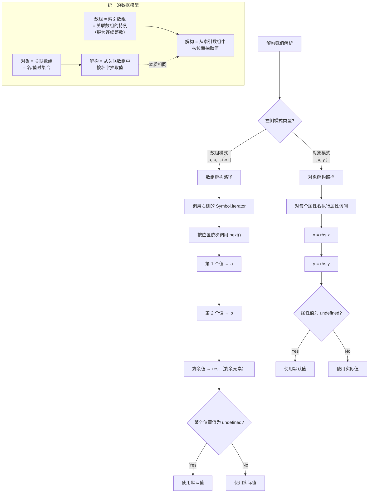

# 解构赋值

> 解构赋值是 ES6 引入的语法，允许从数组或对象中提取值，并按照对应位置/属性名赋值给变量。


## 概述

### 什么是解构赋值

解构赋值（Destructuring Assignment）是一种表达式，允许将数组或对象中的数据快速提取到独立的变量中。

### 核心分类

```
解构赋值
├── 数组解构  → 按位置匹配（使用 Iterator 接口）
├── 对象解构  → 按属性名匹配
├── 字符串解构 → 按位置匹配（字符串作为可迭代对象）
├── 数值解构   → 先转为对象
└── 布尔解构   → 先转为对象
```

### 解构的本质

```javascript
// 数组解构本质
const [a, b] = arr;
// 等价于
const a = arr[0];
const b = arr[1];

// 对象解构本质
const { name, age } = obj;
// 等价于
const name = obj.name;
const age = obj.age;
```

### 与 ES5 的对比

```javascript
// ES5 方式
var arr = [1, 2];
var a = arr[0];
var b = arr[1];

var obj = { name: 'Alice', age: 25 };
var name = obj.name;
var age = obj.age;

// ES6 解构方式
const [a, b] = [1, 2];
const { name, age } = { name: 'Alice', age: 25 };
```

---

## 一、数组解构

### 1.1 基本用法

```javascript
const arr = [1, 2, 3];

// 完全解构
const [a, b, c] = arr;
console.log(a, b, c); // 1 2 3

// 部分解构
const [x, y] = arr;
console.log(x, y); // 1 2

// 跳过元素
const [first, , third] = arr;
console.log(first, third); // 1 3

// 跳过多个元素
const [head, , , , tail] = [1, 2, 3, 4, 5];
console.log(head, tail); // 1 5
```

### 1.2 默认值

```javascript
// 基本默认值
const [a, b, c = 3] = [1, 2];
console.log(c); // 3

// undefined 触发默认值
const [x = 1, y = 2] = [undefined, 5];
console.log(x, y); // 1 5

// null 不触发默认值
const [m = 1] = [null];
console.log(m); // null

// 默认值可以引用其他变量（但必须已声明）
const [a = 1, b = a + 1] = [];
console.log(a, b); // 1 2

// 默认值是惰性求值的
let count = 0;
const [x = count++] = [1];
console.log(x);     // 1
console.log(count); // 0（默认值未执行）

const [y = count++] = [];
console.log(y);     // 0
console.log(count); // 1（默认值已执行）
```

### 1.3 剩余元素

```javascript
const [first, ...rest] = [1, 2, 3, 4, 5];
console.log(first); // 1
console.log(rest);  // [2, 3, 4, 5]

// 剩余元素必须是最后一个
const [...copy] = [1, 2, 3];
console.log(copy); // [1, 2, 3]

// ❌ 错误：剩余元素后面不能有逗号
// const [...rest, last] = [1, 2, 3];
```

### 1.4 交换变量

```javascript
let a = 1;
let b = 2;

// 不需要临时变量
[a, b] = [b, a];
console.log(a, b); // 2 1

// 交换多个变量
let x = 1, y = 2, z = 3;
[x, y, z] = [z, x, y];
console.log(x, y, z); // 3 1 2
```

### 1.5 嵌套解构

```javascript
const arr = [1, [2, 3], 4];
const [a, [b, c], d] = arr;
console.log(a, b, c, d); // 1 2 3 4

// 更深层嵌套
const nested = [1, [2, [3, [4, 5]]]];
const [a, [b, [c, [d, e]]]] = nested;
console.log(a, b, c, d, e); // 1 2 3 4 5
```

### 1.6 解构 Iterator 接口的对象

任何部署了 Iterator 接口的对象都可以使用数组解构：

```javascript
// Set 解构
const [a, b] = new Set([1, 2]);
console.log(a, b); // 1 2

// Map 解构（取 entries）
const map = new Map([['a', 1], ['b', 2]]);
const [[k1, v1], [k2, v2]] = map;
console.log(k1, v1); // 'a' 1

// 自定义 Iterator 对象
const iterable = {
  [Symbol.iterator]() {
    let i = 0;
    return {
      next: () => ({ value: i++, done: i > 3 })
    };
  }
};

const [x, y, z] = iterable;
console.log(x, y, z); // 0 1 2
```

---

## 二、对象解构

### 2.1 基本用法

```javascript
const obj = { name: 'Alice', age: 25 };

// 按属性名匹配
const { name, age } = obj;
console.log(name, age); // 'Alice' 25

// 顺序无关
const { age, name } = obj;
console.log(name, age); // 'Alice' 25

// 解构不存在的属性
const { gender } = obj;
console.log(gender); // undefined
```

### 2.2 重命名变量

```javascript
const obj = { name: 'Alice', age: 25 };

// oldName: newName
const { name: userName, age: userAge } = obj;
console.log(userName, userAge); // 'Alice' 25

// 注意：name 是匹配模式，userName 才是变量
const { foo: bar } = { foo: 'value' };
console.log(bar); // 'value'
// console.log(foo); // ReferenceError: foo is not defined
```

### 2.3 默认值

```javascript
const obj = { name: 'Alice' };

// 没有的属性使用默认值
const { name, age = 18 } = obj;
console.log(age); // 18

// 重命名 + 默认值
const { name: n, gender: g = 'unknown' } = obj;
console.log(n); // 'Alice'
console.log(g); // 'unknown'

// 默认值生效的条件：属性值严格等于 undefined
const { a = 1 } = { a: undefined };
console.log(a); // 1

const { b = 1 } = { b: null };
console.log(b); // null
```

### 2.4 剩余属性

```javascript
const obj = { a: 1, b: 2, c: 3 };
const { a, ...rest } = obj;
console.log(a);    // 1
console.log(rest); // { b: 2, c: 3 }

// 剩余运算符必须是最后一个属性
// ❌ 错误
// const { ...rest, a } = obj;

// 剩余属性会继承原型链上的可枚举属性
const proto = { inherited: 'value' };
const child = Object.create(proto);
child.own = 'ownValue';

const { own, ...rest } = child;
console.log(rest); // {}（不包含继承的属性）
```

### 2.5 嵌套解构

```javascript
const obj = {
  user: {
    name: 'Alice',
    address: {
      city: 'Beijing',
      country: 'China'
    },
  },
};

const {
  user: {
    name,
    address: { city, country },
  },
} = obj;
console.log(name, city, country); // 'Alice' 'Beijing' 'China'

// 嵌套解构的默认值
const data = {
  config: {
    database: {
      host: 'localhost'
    }
  }
};

const { config: { database: { host, port = 3306 } = {} } = {} } = data;
console.log(host, port); // 'localhost' 3306
```

### 2.6 计算属性名

```javascript
const key = 'name';
const obj = { name: 'Alice' };

// 使用方括号进行动态属性名解构
const { [key]: value } = obj;
console.log(value); // 'Alice'

// 结合 Symbol
const sym = Symbol('unique');
const obj2 = { [sym]: 'symbolValue' };
const { [sym]: val } = obj2;
console.log(val); // 'symbolValue'
```

### 2.7 解构原型链上的属性

```javascript
const proto = { inherited: 'value' };
const obj = Object.create(proto);
obj.own = 'ownValue';

const { own, inherited } = obj;
console.log(own);       // 'ownValue'
console.log(inherited); // 'value'（从原型链继承）
```

---

## 三、其他类型的解构

### 3.1 字符串解构

字符串既可以作为数组解构，也可以作为对象解构：

```javascript
// 数组方式解构
const [a, b, c] = 'hello';
console.log(a, b, c); // 'h' 'e' 'l'

// 剩余元素
const [first, ...rest] = 'hello';
console.log(first); // 'h'
console.log(rest);  // ['e', 'l', 'l', 'o']

// 对象方式解构（字符串有 length 属性）
const { length } = 'hello';
console.log(length); // 5

// 同时解构
const [char, ...others] = 'hello';
const { length: len } = 'hello';
console.log(char, others, len); // 'h' ['e','l','l','o'] 5
```

### 3.2 数值和布尔值解构

数值和布尔值会先被转为包装对象：

```javascript
// 数值解构
const { toString } = 123;
console.log(toString === Number.prototype.toString); // true

// 布尔值解构
const { valueOf } = true;
console.log(valueOf === Boolean.prototype.valueOf); // true

// 解构包装对象的属性
const numObj = new Number(123);
const { toString: ts } = numObj;
console.log(ts.call(456)); // '456'
```

### 3.3 Map 和 Set 解构

```javascript
// Map 解构
const map = new Map([
  ['name', 'Alice'],
  ['age', 25]
]);

// 解构 entries
for (const [key, value] of map) {
  console.log(`${key}: ${value}`);
}
// name: Alice
// age: 25

// Set 解构
const set = new Set([1, 2, 3]);
const [first, second] = set;
console.log(first, second); // 1 2
```

### 3.4 函数返回值解构

```javascript
// 返回数组
function getCoords() {
  return [10, 20];
}
const [x, y] = getCoords();

// 返回对象
function getUser() {
  return { name: 'Alice', age: 25 };
}
const { name, age } = getUser();

// 迭代器返回值
function* generator() {
  yield 1;
  yield 2;
  yield 3;
}
const [a, b, c] = generator();
console.log(a, b, c); // 1 2 3
```

---

## 四、函数参数解构

### 4.1 对象参数解构

```javascript
// 传统方式
function greet(user) {
  console.log(`Hello, ${user.name}!`);
}

// 解构参数
function greet({ name, age = 18 }) {
  console.log(`Hello, ${name}, age ${age}`);
}

greet({ name: 'Alice' }); // 'Hello, Alice, age 18'

// 必须提供参数对象
greet(); // TypeError: Cannot destructure property 'name' of 'undefined' as it is undefined.
```

### 4.2 数组参数解构

```javascript
function sum([a, b, c]) {
  return a + b + c;
}

sum([1, 2, 3]); // 6

// 带默认值
function process([first, second = 0, third = 0]) {
  return first + second + third;
}

process([1]); // 1
```

### 4.3 默认值结合

```javascript
// 参数对象默认为空对象
function connect({ host = 'localhost', port = 3000 } = {}) {
  console.log(`Connecting to ${host}:${port}`);
}

connect();                        // 'Connecting to localhost:3000'
connect({});                      // 'Connecting to localhost:3000'
connect({ port: 8080 });          // 'Connecting to localhost:8080'
connect({ host: 'example.com' }); // 'Connecting to example.com:3000'
```

### 4.4 复杂参数解构

```javascript
// 嵌套参数解构
function init({
  config: {
    db: { host, port } = {},
    cache: { enabled = true } = {}
  } = {}
} = {}) {
  console.log(host, port, enabled);
}

init({ config: { db: { host: 'localhost', port: 3306 } } });
// localhost 3306 true

init();
// undefined undefined true
```

### 4.5 剩余参数解构

```javascript
function fn(...[a, b, c]) {
  console.log(a, b, c);
}

fn(1);          // 1 undefined undefined
fn(1, 2);       // 1 2 undefined
fn(1, 2, 3);    // 1 2 3
fn(1, 2, 3, 4); // 1 2 3
```

---

## 五、实际应用场景

### 5.1 从函数返回多个值

```javascript
function getMinMax(arr) {
  return {
    min: Math.min(...arr),
    max: Math.max(...arr),
  };
}

const { min, max } = getMinMax([1, 2, 3, 4, 5]);
console.log(min, max); // 1 5

// 返回数组形式
function getRange(arr) {
  return [Math.min(...arr), Math.max(...arr)];
}

const [start, end] = getRange([1, 5]);
```

### 5.2 处理 API 响应数据

```javascript
// 处理 JSON 数据
const response = {
  code: 200,
  message: 'success',
  data: {
    users: [{ id: 1, name: 'Alice' }],
    pagination: { total: 100, page: 1 },
  },
};

const {
  code,
  data: { users, pagination: { total } },
} = response;

// 解构 + 重命名 + 默认值
const { 
  data: { users: userList = [] } = {},
  message: msg = 'Unknown error'
} = response;
```

### 5.3 函数配置项

```javascript
function createRequest({
  url,
  method = 'GET',
  headers = {},
  body = null,
  timeout = 5000,
  credentials = 'same-origin',
} = {}) {
  const config = { url, method, headers, body, timeout, credentials };
  console.log(config);
  return config;
}

createRequest({
  url: '/api/users',
  method: 'POST',
  body: { name: 'Alice' },
});
```

### 5.4 模块导入

```javascript
// 只导入需要的方法
import { useState, useEffect } from 'react';
import { map, filter, reduce } from 'lodash';
import { createStore, combineReducers } from 'redux';

// 重命名导入
import { Component as ReactComponent } from 'react';
```

### 5.5 遍历数据结构

```javascript
// 遍历对象
const obj = { a: 1, b: 2, c: 3 };

for (const [key, value] of Object.entries(obj)) {
  console.log(`${key}: ${value}`);
}

// 遍历 Map
const map = new Map([['a', 1], ['b', 2]]);

for (const [key, value] of map) {
  console.log(`${key} => ${value}`);
}

// 遍历数组（带索引）
const arr = ['a', 'b', 'c'];

for (const [index, value] of arr.entries()) {
  console.log(`${index}: ${value}`);
}
```

### 5.6 React/Vue 组件

```javascript
// React 组件
function UserCard({ name, age, avatar = '/default.png', ...props }) {
  return (
    <div {...props}>
      
      <p>{name}, {age}</p>
    </div>
  );
}

// React Hook 解构
const [state, setState] = useState(initialState);
const [value, setValue] = useLocalStorage('key', defaultValue);

// Vue 组件
export default {
  props: {
    name: String,
    age: { type: Number, default: 18 },
  },
  setup({ name, age, ...rest }) {
    console.log(name, age);
    // ...
  },
};
```

### 5.7 正则表达式匹配结果

```javascript
const url = 'https://example.com:8080/path';

// 解构正则匹配结果
const [, protocol, host, port] = url.match(/^(\w+):\/\/([^:]+):(\d+)/);
console.log(protocol, host, port); // 'https' 'example.com' '8080'

// 解构 exec 结果
const pattern = /(\d+)-(\d+)-(\d+)/;
const [, year, month, day] = pattern.exec('2024-01-15');
console.log(year, month, day); // '2024' '01' '15'
```

### 5.8 深拷贝辅助

```javascript
// 浅拷贝对象
const original = { a: 1, b: 2, c: 3 };
const { ...shallowCopy } = original;

// 排除某些属性
const { password, ...safeUser } = user;

// 合并对象
const defaults = { theme: 'light', lang: 'en' };
const options = { lang: 'zh' };
const merged = { ...defaults, ...options };
console.log(merged); // { theme: 'light', lang: 'zh' }
```

---

## 六、解构与声明

### 6.1 解构时声明

```javascript
// 数组解构声明
const [a, b] = [1, 2];
let [x, y] = [3, 4];
var [m, n] = [5, 6];

// 对象解构声明
const { name, age } = { name: 'Alice', age: 25 };
```

### 6.2 先声明后解构

```javascript
let a, b;

// 对象解构需要加括号，否则 {} 被解释为代码块
({ a, b } = { a: 1, b: 2 });
console.log(a, b); // 1 2

// 数组解构不需要括号
[a, b] = [3, 4];
console.log(a, b); // 3 4
```

### 6.3 括号的作用

```javascript
// ❌ 错误：JavaScript 将 {} 解释为代码块
let x;
{ x } = { x: 1 }; // SyntaxError

// ✅ 正确：括号表明这是一个表达式
({ x } = { x: 1 });

// 数组解构不需要括号，因为 [] 不会被解释为代码块
let y;
[y] = [1];
```

---

## 七、解构失败与错误处理

### 7.1 数组越界

```javascript
const [a, b] = [1];
console.log(a); // 1
console.log(b); // undefined

// 使用默认值避免
const [x = 0, y = 0] = [1];
console.log(x, y); // 1 0
```

### 7.2 对象属性不存在

```javascript
const { foo } = { bar: 1 };
console.log(foo); // undefined

// 使用默认值
const { foo = 'default' } = { bar: 1 };
console.log(foo); // 'default'
```

### 7.3 解构 null 或 undefined

```javascript
// ❌ 报错！
const { a } = null;      // TypeError: Cannot destructure property 'a' of 'null' as it is null.
const { b } = undefined; // TypeError: Cannot destructure property 'b' of 'undefined' as it is undefined.

// ✅ 安全做法：提供默认值
const { a } = null || {};        // a = undefined
const { b } = undefined ?? {};   // b = undefined

// ✅ 函数参数默认值
function fn({ a } = {}) {
  console.log(a);
}
fn();          // undefined
fn(null);      // TypeError
fn(undefined); // undefined
```

### 7.4 嵌套解构父级不存在

```javascript
const obj = {};

// ❌ 报错：obj.foo 是 undefined，无法解构
const { foo: { bar } } = obj;

// ✅ 提供默认值
const { foo: { bar } = {} } = obj;
console.log(bar); // undefined

// ✅ 更安全的写法
const { foo = {} } = obj;
const { bar } = foo;
```

### 7.5 对不可迭代对象使用数组解构

```javascript
// ❌ 报错：普通对象不可迭代
const [a, b] = { a: 1, b: 2 }; // TypeError

// ✅ 正确：使用 Object.values 或 entries
const [x, y] = Object.values({ a: 1, b: 2 });
console.log(x, y); // 1 2

const [[k1, v1]] = Object.entries({ a: 1 });
console.log(k1, v1); // 'a' 1
```

---

## 八、解构赋值的陷阱

### 8.1 已声明变量的对象解构

```javascript
let a, b;

// ❌ 错误：{a, b} 被解释为代码块
{a, b} = {a: 1, b: 2};

// ✅ 正确：用括号包裹
({a, b} = {a: 1, b: 2});
```

### 8.2 默认值与重命名的顺序

```javascript
const obj = { name: 'Alice' };

// ❌ 错误：默认值应该放在重命名之后
const { name = 'Bob': userName } = obj; // SyntaxError

// ✅ 正确顺序：属性名: 新变量名 = 默认值
const { name: userName = 'Bob' } = obj;
console.log(userName); // 'Alice'
```

### 8.3 重命名后原属性名不可用

```javascript
const obj = { name: 'Alice' };

const { name: userName } = obj;
console.log(userName); // 'Alice'
// console.log(name);  // ReferenceError: name is not defined
```

### 8.4 剩余元素的位置限制

```javascript
// ❌ 错误：剩余元素必须是最后一个
const [...rest, last] = [1, 2, 3]; // SyntaxError

// ✅ 正确
const [first, ...rest] = [1, 2, 3];
```

### 8.5 解构不会复制原型方法

```javascript
const obj = Object.create({ inheritedMethod() {} });
obj.ownMethod = function() {};

const { ownMethod, inheritedMethod } = obj;
console.log(typeof ownMethod);       // 'function'
console.log(typeof inheritedMethod); // 'function'
// 但方法内部的 this 绑定可能丢失
```

### 8.6 循环中的解构

```javascript
const users = [
  { name: 'Alice', age: 25 },
  { name: 'Bob', age: 30 }
];

// ✅ 正确：每次循环都创建新的作用域
for (const { name, age } of users) {
  console.log(name, age);
}

// ✅ 也可以赋值给循环外已声明的变量
// （for-of 头部处于表达式位置，{ name } 按赋值模式解析，无需额外括号）
let name;
for ({ name } of users) {
  console.log(name);
}
```

---

## 九、复杂解构示例

### 9.1 解构数组对象

```javascript
const users = [
  { id: 1, name: 'Alice', age: 25 },
  { id: 2, name: 'Bob', age: 30 },
];

const [{ name: firstName }, { id: secondId }] = users;
console.log(firstName); // 'Alice'
console.log(secondId);  // 2
```

### 9.2 混合解构

```javascript
const data = {
  items: [
    { name: 'Apple', price: 5 },
    { name: 'Banana', price: 3 },
  ],
  meta: { total: 2, page: 1 },
};

const {
  items: [firstItem, { price: secondPrice }],
  meta: { total, page = 1 },
} = data;

console.log(firstItem);    // { name: 'Apple', price: 5 }
console.log(secondPrice);  // 3
console.log(total);        // 2
```

### 9.3 解构函数 arguments

```javascript
function foo() {
  const [first, second] = arguments;
  console.log(first, second);
}

foo(1, 2, 3); // 1 2
```

### 9.4 解构 Promise.all 结果

```javascript
async function fetchAll() {
  const [users, posts, comments] = await Promise.all([
    fetch('/api/users').then(r => r.json()),
    fetch('/api/posts').then(r => r.json()),
    fetch('/api/comments').then(r => r.json()),
  ]);
  
  return { users, posts, comments };
}
```

### 9.5 解构 Class 实例

```javascript
class User {
  constructor(name, age) {
    this.name = name;
    this.age = age;
  }
}

const user = new User('Alice', 25);
const { name, age } = user;
console.log(name, age); // 'Alice' 25
```

---

## 十、最佳实践

### 10.1 保持简单

```javascript
// ❌ 过于复杂的解构
const { a: { b: { c: { d } } } } = obj;

// ✅ 分步解构，更易读
const { a } = obj;
const { b } = a;
const { d } = b;

// ✅ 或者使用可选链
const d = obj?.a?.b?.c?.d;
```

### 10.2 提供安全的默认值

```javascript
// ✅ 安全的配置解构
function init({ 
  config: { port = 3000, host = 'localhost' } = {} 
} = {}) {
  console.log(`Server running at ${host}:${port}`);
}

init();                           // Server running at localhost:3000
init({});                         // Server running at localhost:3000
init({ config: {} });             // Server running at localhost:3000
init({ config: { port: 8080 } }); // Server running at localhost:8080
```

### 10.3 使用语义化的重命名

```javascript
// ❌ 变量名不清晰
const { a: x } = obj;

// ✅ 语义化的重命名
const { id: userId, name: userName } = user;

// ✅ 避免命名冲突
const { name: parentName } = parent;
const { name: childName } = child;
```

### 10.4 利用剩余运算符分离属性

```javascript
// 分离敏感信息
const user = { id: 1, name: 'Alice', password: 'secret', email: 'test@example.com' };
const { password, ...safeUser } = user;
console.log(safeUser); // { id: 1, name: 'Alice', email: 'test@example.com' }

// 提取特定属性，保留其他
const { id, ...updateData } = formData;
updateUser(id, updateData);
```

### 10.5 对象解构优于数组解构

```javascript
// ❌ 数组解构：位置敏感，不易扩展
function getConfig([host, port, timeout]) {
  // ...
}
getConfig(['localhost', 3000, 5000]);

// ✅ 对象解构：清晰、可扩展、顺序无关
function getConfig({ host, port, timeout = 5000 }) {
  // ...
}
getConfig({ host: 'localhost', port: 3000 });
```

### 10.6 解构配合展开运算符

```javascript
// 合并配置
const defaults = { theme: 'dark', lang: 'en' };
const userConfig = { lang: 'zh' };

const config = { ...defaults, ...userConfig };
console.log(config); // { theme: 'dark', lang: 'zh' }

// 覆盖特定属性
const newState = { ...state, count: state.count + 1 };
```

---

## 十一、常见问题解答

### Q1: 解构赋值会创建新的对象吗？

```javascript
const obj = { a: 1 };
const { a } = obj;

console.log(obj.a === a); // true（基本类型值相同）
// 但 a 是独立的变量，修改不影响原对象

const arr = [{ name: 'Alice' }];
const [user] = arr;
user.name = 'Bob';
console.log(arr[0].name); // 'Bob'（引用类型会互相影响）
```

**答：** 解构只是提取值的引用或副本，不会创建新对象。引用类型的修改会影响原数据。

### Q2: 如何跳过多层嵌套？

```javascript
const data = {
  response: {
    data: {
      result: {
        value: 'target'
      }
    }
  }
};

// 使用可选链 + 空值合并
const value = data?.response?.data?.result?.value ?? 'default';

// 或者分步解构
const { response: { data: { result } = {} } = {} } = data;
const { value } = result || {};
```

### Q3: 解构可以用于 const 声明吗？

```javascript
// ✅ 可以，但必须提供初始值
const { a, b } = obj;  // 正确

// ❌ 不能先声明后赋值
const a, b;
({ a, b } = obj); // SyntaxError
```

### Q4: 如何解构带 Symbol 属性的对象？

```javascript
const sym = Symbol('key');
const obj = { [sym]: 'value', name: 'Alice' };

// 解构 Symbol 属性
const { [sym]: symValue } = obj;
console.log(symValue); // 'value'

// 获取所有 Symbol 属性
const symbols = Object.getOwnPropertySymbols(obj);
```

### Q5: 解构和 Object.assign 有什么区别？

```javascript
const target = { a: 1 };
const source = { b: 2 };

// Object.assign：修改目标对象，返回目标对象
const result1 = Object.assign(target, source);
console.log(target === result1); // true

// 展开运算符：创建新对象
const result2 = { ...target, ...source };
console.log(target === result2); // false

// 解构：提取值到变量
const { a, b } = source;
```

---

## 十二、性能考虑

### 12.1 解构的性能特点

```javascript
// 解构在 V8 引擎中经过优化，通常性能良好
const obj = { a: 1, b: 2, c: 3 };

// 简单解构（推荐）
const { a, b } = obj;

// vs 多次属性访问
const a = obj.a;
const b = obj.b;
```

### 12.2 避免过度解构

```javascript
// ❌ 创建了不需要的变量
const { a, b, c, d, e, f, g } = hugeObject;
// 只用了 a 和 b

// ✅ 只解构需要的
const { a, b } = hugeObject;
```

### 12.3 嵌套解构的性能

```javascript
// 深层嵌套解构可能稍慢
const { a: { b: { c } } } = deepObject;

// 如果需要多次访问，可分步解构
const { a } = deepObject;
const { b } = a;
// 后续可复用 a 和 b
```

### 12.4 函数参数解构的优化

```javascript
// 函数参数解构会在每次调用时执行
function process({ a, b, c }) {
  // ...
}

// 对于热路径（频繁调用的函数），考虑避免解构
function process(obj) {
  const a = obj.a;
  const b = obj.b;
  // ...
}
```

---

## 十三、浏览器兼容性

### 13.1 支持情况

| 特性 | Chrome | Firefox | Safari | Edge | Node.js |
|------|--------|---------|--------|------|---------|
| 数组解构 | 49+ | 41+ | 8+ | 14+ | 6.0+ |
| 对象解构 | 49+ | 41+ | 8+ | 14+ | 6.0+ |
| 剩余属性 | 60+ | 55+ | 11.1+ | 79+ | 8.3+ |
| 计算属性名 | 49+ | 41+ | 8+ | 14+ | 6.0+ |

### 13.2 Polyfill 与转译

```javascript
// 使用 Babel 转译
// 原始代码
const { name, age } = user;

// 转译后（ES5）
var _user = user;
var name = _user.name;
var age = _user.age;
```

### 13.3 注意事项

- **IE 浏览器**：不支持解构赋值，需要 Babel 转译
- **移动端**：iOS Safari 8+ 支持，Android 5+ 部分支持
- **Node.js**：v6.0+ 完整支持

---

### 解构赋值的规范语义（核心原理深度）

> **规范层级**：ECMAScript 规范 · DestructuringAssignmentEvaluation / IteratorDestructuringAssignmentEvaluation / BindingInitialization
> **原理来源**：JavaScript 核心原理解析 · 第 16 讲

#### 规范语义

解构赋值的本质是**结构模式匹配（Structural Pattern Matching）**——左侧是一个"绑定模式（Binding Pattern）"，它声明了变量的名字和期望的数据形状，右侧是被匹配的数据。ECMAScript 规范定义了两条核心解构路径：

| 解构类型 | 规范抽象操作 | 匹配方式 | 适用右侧类型 |
|---------|-------------|---------|-------------|
| 数组解构 | `IteratorDestructuringAssignmentEvaluation` | 位置匹配（迭代器） | 任何可迭代对象 |
| 对象解构 | `ObjectDestructuringAssignmentEvaluation` | 名字匹配（属性访问） | 任何对象 |

解构赋值在规范中有三种不同的语义上下文：

```
1. 赋值表达式：[a, b] = obj    → DestructuringAssignmentEvaluation
2. var 声明：  var [a, b] = obj → BindingInitialization（env = 函数作用域）
3. let/const： let [a, b] = obj → BindingInitialization（env = 当前词法环境）
```

这三者调用相同的"初始器赋值"过程，但语义不同：声明时作为值绑定的初始器，赋值时作为赋值操作的参数。

```javascript
// 数组解构：通过迭代器协议按位置匹配
const [a, b, c] = [1, 2, 3]
// 等价于：
// const _iter = [1, 2, 3][Symbol.iterator]()
// const a = _iter.next().value  // 1
// const b = _iter.next().value  // 2
// const c = _iter.next().value  // 3

// 对象解构：通过属性访问按名字匹配
const { x, y } = { x: 1, y: 2 }
// 等价于：
// const x = { x: 1, y: 2 }.x  // 1
// const y = { x: 1, y: 2 }.y  // 2
```

#### 执行机制



#### 核心洞察

**1. 解构统一了两种数据访问模式**

JavaScript 中只有两种数据结构：索引数组（按位置访问）和关联数组（按名字访问）。解构赋值将这两种访问模式统一为声明式的"模式匹配"语法：

```javascript
// 位置匹配：数组解构
const [first, second] = [10, 20]

// 名字匹配：对象解构
const { name, age } = { name: 'Alice', age: 30 }

// 两种模式可以混合使用
const [{ name }, second] = [{ name: 'Alice' }, 20]
const { items: [first, ...rest] } = { items: [1, 2, 3] }
```

**2. 左侧模板是声明式的——它描述"形状"，而非"操作"**

左侧的解构模式在语法解析阶段就完成了处理，不会产生运行时的执行过程。它只是声明了变量名和它们与数据结构的对应关系：

```javascript
// 左侧模板在解析阶段确定结构
// 右侧的求值在运行时执行
let [a, b] = complexFunction()
// 解析时：确定 a 对应位置 0，b 对应位置 1
// 运行时：执行 complexFunction()，按位置提取值
```

**3. 嵌套解构 = 嵌套结构匹配**

解构的嵌套对应数据的嵌套，每一层都是独立的模式匹配：

```javascript
const data = {
  users: [
    { name: 'Alice', address: { city: 'Beijing' } },
    { name: 'Bob', address: { city: 'Shanghai' } }
  ],
  meta: { total: 2 }
}

// 嵌套解构：逐层匹配
const {
  users: [{ name: firstName, address: { city } }],  // 第一层：对象 → 数组 → 对象
  meta: { total }
} = data

console.log(firstName)  // 'Alice'
console.log(city)        // 'Beijing'
console.log(total)       // 2
```

**4. 默认值仅在解构值为 undefined 时生效**

```javascript
// undefined 触发默认值
const { a = 1 } = { a: undefined }  // a = 1

// null 不触发默认值
const { b = 1 } = { b: null }       // b = null

// 默认值是惰性求值的
let count = 0
const { x = count++ } = { x: 1 }    // count 仍为 0（默认值未执行）
const { y = count++ } = {}           // count 为 1（默认值执行）
```

**5. 计算属性名在解构中的使用**

```javascript
const key = 'name'
const { [key]: value } = { name: 'Alice' }
console.log(value)  // 'Alice'

// 动态键 + 重命名 + 默认值
function extract(obj, propName, defaultValue) {
  const { [propName]: result = defaultValue } = obj
  return result
}

console.log(extract({ name: 'Alice' }, 'name', 'Unknown'))  // 'Alice'
console.log(extract({}, 'name', 'Unknown'))                  // 'Unknown'
```

**6. `[a, b] = {a, b}` 的可行性分析**

这个表达式默认会报错（对象不可迭代），但理解了两种数据结构的统一性后，可以使其工作：

```javascript
// 方法一：为对象添加迭代器
Object.prototype[Symbol.iterator] = function*() {
  yield* Object.values(this)
}
var a = 100, b = 200
;[a, b] = {a, b}  // a=100, b=200 ✓

// 方法二：更常见的做法
;[a, b] = Object.values({a, b})  // a=100, b=200 ✓

// 反向：数组赋给对象模板
;({0: x, 1: y} = [100, 200])  // x=100, y=200 ✓
```

#### 代码实证

```javascript
// === 1. 嵌套对象解构的完整示例 ===

const response = {
  code: 200,
  data: {
    users: [
      { id: 1, name: 'Alice', profile: { avatar: 'alice.jpg' } },
      { id: 2, name: 'Bob', profile: { avatar: 'bob.jpg' } }
    ],
    pagination: { page: 1, total: 100 }
  }
}

  // ... 中间省略 ...


// 展开实现对象到数组的转换
const obj2 = { x: 10, y: 20, z: 30 }
obj2[Symbol.iterator] = function*() { yield* Object.values(this) }
const arr = [...obj2]
console.log(arr)  // [10, 20, 30]
```

#### 与实战的关联

1. **函数参数模式**：解构赋值最常见的应用是函数参数。`function fn({ x, y = 0 } = {})` 利用了对象解构 + 默认值 + 空对象兜底，是现代 JavaScript 库的标配模式

2. **React Hooks 模式**：`const [state, setState] = useState(initial)` 利用数组解构的位置匹配，`const { name, age } = props` 利用对象解构的名字匹配。两种解构模式在 React 中无处不在

3. **配置提取**：`const { API_URL, TIMEOUT, ...rest } = config` 一步完成：提取需要的配置项、收集剩余配置、保持不可变性

4. **模块导入**：`import { useState, useEffect } from 'react'` 本质上是对象解构的语法变体（命名导入），`import * as React from 'react'` 则类似剩余运算符

5. **API 响应处理**：`const { data: { items, pagination: { total } }, code } = response` 一行代码即可从深层嵌套的 API 响应中提取所需数据

---

## 小结

### 核心语法速查表

| 类型 | 语法 | 说明 |
|------|------|------|
| 数组解构 | `const [a, b] = arr` | 按位置匹配 |
| 对象解构 | `const { name } = obj` | 按属性名匹配 |
| 默认值 | `const { a = 1 } = {}` | undefined 触发 |
| 重命名 | `const { name: n } = obj` | `old: new` |
| 剩余元素 | `const [first, ...rest] = arr` | 收集剩余项 |
| 跳过元素 | `const [a, , c] = arr` | 空位跳过 |
| 嵌套解构 | `const { a: { b } } = obj` | 深层提取 |
| 计算属性 | `const { [key]: val } = obj` | 动态属性名 |

### 使用场景对照表

| 场景 | 推荐方式 | 示例 |
|------|----------|------|
| 函数参数配置 | 对象解构 + 默认值 | `fn({ opt = 'default' } = {})` |
| 交换变量 | 数组解构 | `[a, b] = [b, a]` |
| 提取 API 数据 | 嵌套对象解构 | `const { data: { items } } = res` |
| 模块导入 | 对象解构 | `import { useState } from 'react'` |
| 遍历集合 | 数组解构 | `for (const [k, v] of map)` |
| 过滤属性 | 剩余运算符 | `const { pwd, ...safe } = user` |

---

> 💡 **核心要点**：解构赋值是 ES6 最常用的特性之一，它简化了数据提取、函数参数处理和模块导入等操作。掌握解构赋值能显著提升代码的可读性和简洁性。

> ⚠️ **注意事项**：对 `null` 和 `undefined` 解构会报错，建议使用默认值 `= {}` 进行保护。对象解构时已声明的变量需要用括号包裹。
