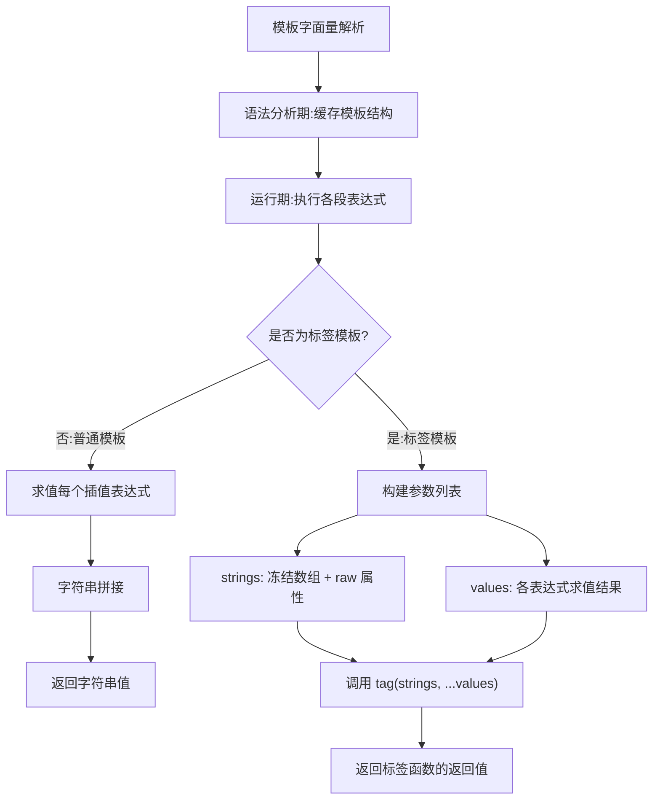

# 模板字符串

> 模板字符串（Template Literals）是 ES6 引入的字符串语法，使用反引号 `` ` `` 包裹，支持换行和变量嵌入。

## 概述

### 什么是模板字符串

模板字符串是增强版的字符串，使用反引号（`` ` ``）作为界定符，提供了更强大的字符串处理能力。

### 核心特性

```
模板字符串
├── 多行字符串   → 直接换行，无需 \n
├── 字符串插值   → ${expression} 嵌入变量和表达式
├── 标签模板     → 自定义字符串处理函数
└── 原始字符串   → String.raw 不处理转义
```

### 模板字符串的本质

```javascript
// 模板字符串本质
const name = 'Alice';
const greeting = `Hello, ${name}!`;

// 等价于传统方式
const greetingClassic = 'Hello, ' + name + '!';
```

### 与 ES5 的对比

```javascript
const name = 'Alice';
const age = 25;

// ES5 传统方式
var str1 = 'User: ' + name + ', Age: ' + age;
var str2 = 'Line1\nLine2\nLine3';

// ES6 模板字符串
const str3 = `User: ${name}, Age: ${age}`;
const str4 = `Line1
Line2
Line3`;
```

---

## 一、基本语法

### 1.1 使用反引号

```javascript
// 传统字符串
const str1 = 'Hello World';
const str2 = "Hello World";

// 模板字符串
const str3 = `Hello World`;

// 长度相同
console.log(str1.length); // 11
console.log(str3.length); // 11
```

### 1.2 多行字符串

```javascript
// ❌ 传统方式需要使用 \n
const str1 = '第一行\n第二行\n第三行';

// ❌ 传统多行拼接（性能差，可读性低）
const str2 = '第一行\n' +
             '第二行\n' +
             '第三行';

// ✅ 模板字符串直接换行
const str3 = `第一行
第二行
第三行`;

console.log(str3);
// 第一行
// 第二行
// 第三行

// 注意：模板字符串保留所有空格和换行
const str4 = `
  indented
`;
console.log(str4.length); // 12（包含首尾换行和缩进空格）
```

### 1.3 字符串插值

使用 `${expression}` 嵌入变量或表达式：

```javascript
const name = 'Alice';
const age = 25;

// 变量插值
const greeting = `Hello, ${name}!`;
console.log(greeting); // 'Hello, Alice!'

// 表达式插值
const info = `${name} is ${age} years old, next year ${age + 1}`;
console.log(info); // 'Alice is 25 years old, next year 26'

// 函数调用
const upper = `Hello, ${name.toUpperCase()}!`;
console.log(upper); // 'Hello, ALICE!'

// 三元表达式
const status = `Status: ${age >= 18 ? 'Adult' : 'Minor'}`;
console.log(status); // 'Status: Adult'

// 逻辑运算符
const user = null;
const displayName = `Hello, ${user || 'Guest'}!`;
console.log(displayName); // 'Hello, Guest!'
```

---

## 二、字符串插值详解

### 2.1 支持的表达式类型

```javascript
const a = 10;
const b = 20;
const user = { name: 'Alice', age: 25 };
const arr = [1, 2, 3];

// 数学运算
console.log(`${a} + ${b} = ${a + b}`);           // '10 + 20 = 30'
console.log(`${a} / ${b} = ${a / b}`);           // '10 / 20 = 0.5'

// 对象属性访问
console.log(`User: ${user.name}`);               // 'User: Alice'
console.log(`Deep: ${user?.address?.city}`);     // 'Deep: undefined'

// 数组操作
console.log(`Array: ${arr.join(', ')}`);         // 'Array: 1, 2, 3'
console.log(`First: ${arr[0]}`);                 // 'First: 1'

// JSON 序列化
console.log(`JSON: ${JSON.stringify(user)}`);    // 'JSON: {"name":"Alice","age":25}'

// 方法调用
console.log(`Random: ${Math.random().toFixed(2)}`);
```

### 2.2 复杂表达式

```javascript
// 立即执行函数
console.log(`Result: ${(function() { return 10 * 20; })()}`); // 'Result: 200'

// 箭头函数
console.log(`Double: ${(x => x * 2)(5)}`); // 'Double: 10'

// 条件渲染
const isLoggedIn = true;
const userName = 'Alice';
const nav = `Welcome, ${isLoggedIn ? userName : 'Guest'}`;
console.log(nav); // 'Welcome, Alice'

// 对象解构
const { x, y } = { x: 10, y: 20 };
console.log(`Point: (${x}, ${y})`); // 'Point: (10, 20)'
```

### 2.3 模板字符串嵌套

```javascript
// 嵌套生成列表
const items = ['Apple', 'Banana', 'Cherry'];
const list = `
<ul>
  ${items.map(item => `  <li>${item}</li>`).join('\n')}
</ul>`;

console.log(list);
// <ul>
//   <li>Apple</li>
//   <li>Banana</li>
//   <li>Cherry</li>
// </ul>

// 嵌套条件渲染
const todos = [
  { id: 1, text: 'Learn JS', done: true },
  { id: 2, text: 'Build app', done: false },
];

const todoList = `
<ul>
  ${todos.map(todo => `
  <li class="${todo.done ? 'completed' : 'pending'}">
    ${todo.text}
  </li>`).join('')}
</ul>`;
```

---

## 三、标签模板

标签模板是一种高级用法，允许自定义模板字符串的处理方式。

### 3.1 基本语法

```javascript
function tag(strings, ...values) {
  console.log(strings);  // 字符串部分数组
  console.log(values);   // 插值部分数组
  return strings.join('');
}

const name = 'Alice';
const age = 25;

tag`Hello ${name}, you are ${age} years old`;
// strings: ['Hello ', ', you are ', ' years old']
// values:  ['Alice', 25]
```

### 3.2 标签函数参数详解

```javascript
function detailedTag(strings, ...values) {
  console.log('字符串部分:', strings);
  console.log('原始字符串:', strings.raw);
  console.log('插值部分:', values);
  console.log('字符串数量:', strings.length);
  console.log('插值数量:', values.length);
  
  // strings 总比 values 多一个
  return strings.reduce((result, str, i) => {
    return result + str + (values[i] !== undefined ? values[i] : '');
  }, '');
}

const a = 1, b = 2;
detailedTag`${a} + ${b} = ${a + b}`;
// 字符串部分: ['', ' + ', ' = ', '']
// 原始字符串: ['', ' + ', ' = ', '']
// 插值部分: [1, 2, 3]
// 字符串数量: 4
// 插值数量: 3
```

### 3.3 应用示例

#### HTML 转义（防 XSS）

```javascript
function safeHtml(strings, ...values) {
  const escape = (str) => {
    if (str === null || str === undefined) return '';
    return String(str)
      .replace(/&/g, '&amp;')
      .replace(/</g, '&lt;')
      .replace(/>/g, '&gt;')
      .replace(/"/g, '&quot;')
      .replace(/'/g, '&#039;');
  };

  let result = strings[0];
  for (let i = 0; i < values.length; i++) {
    result += escape(values[i]) + strings[i + 1];
  }
  return result;
}

const userInput = '<script>alert("XSS")</script>';
const html = safeHtml`<div>${userInput}</div>`;
console.log(html);
// '<div>&lt;script&gt;alert(&quot;XSS&quot;)&lt;/script&gt;</div>'
```

#### 国际化

```javascript
const i18n = {
  en: {
    hello: 'Hello',
    welcome: 'Welcome',
  },
  zh: {
    hello: '你好',
    welcome: '欢迎',
  },
};

let currentLang = 'zh';

function t(strings, ...values) {
  const key = strings.join('{}');
  const template = i18n[currentLang]?.[key] || strings.join('');
  
  return template.replace(/{}/g, () => values.shift() || '');
}

const name = 'Alice';
console.log(t`hello ${name}`); // '你好 Alice'
```

#### SQL 查询构建（防注入）

```javascript
function sql(strings, ...values) {
  const params = [];
  
  const query = strings.reduce((result, str, i) => {
    if (i < values.length) {
      params.push(values[i]);
      return result + str + '?';
    }
    return result + str;
  }, '');

  return { query, params };
}

const userId = 1;
const status = 'active';

const result = sql`
  SELECT * FROM users
  WHERE id = ${userId}
  AND status = ${status}
`;

console.log(result.query);
// '\n  SELECT * FROM users\n  WHERE id = ?\n  AND status = ?\n'
console.log(result.params);
// [1, 'active']
```

#### 代码高亮

```javascript
function highlight(strings, ...values) {
  let result = strings[0];
  for (let i = 0; i < values.length; i++) {
    result += `\x1b[31m${values[i]}\x1b[0m${strings[i + 1]}`;
  }
  return result;
}

const name = 'Alice';
const score = 95;
console.log(highlight`Player ${name} scored ${score} points!`);
// Player Alice scored 95 points!（name 和 score 显示红色）
```

#### 字符串模板引擎

```javascript
function template(strings, ...values) {
  return function(data) {
    const resolved = values.map(v => {
      if (typeof v === 'function') return v(data);
      if (typeof v === 'string' && v.startsWith('$')) return data[v.slice(1)];
      return v;
    });
    
    return strings.reduce((result, str, i) => {
      return result + str + (resolved[i] ?? '');
    }, '');
  };
}

const greet = template`Hello, ${'$name'}! Today is ${(d) => d.day}`;
console.log(greet({ name: 'Alice', day: 'Monday' }));
// 'Hello, Alice! Today is Monday'
```

---

## 四、原始字符串

### 4.1 String.raw 基本用法

使用 `String.raw` 获取原始字符串（不处理转义字符）：

```javascript
// 普通模板字符串会处理转义
const str1 = `Line1\nLine2`;
console.log(str1);
// Line1
// Line2

// 原始字符串不处理转义
const str2 = String.raw`Line1\nLine2`;
console.log(str2); // 'Line1\nLine2'（\n 是两个字符）

// 获取文件路径
const path = String.raw`C:\Users\Alice\Documents`;
console.log(path); // 'C:\Users\Alice\Documents'

// 正则表达式
const regex = String.raw`\d+\.\d+`;
console.log(new RegExp(regex)); // /\d+\.\d+/
```

### 4.2 String.raw 与标签函数

```javascript
// String.raw 本质是一个标签函数
console.log(String.raw`Hi\n${1 + 2}`); // 'Hi\\n3'

// 手动实现 raw
function myRaw(strings, ...values) {
  let result = strings.raw[0];
  for (let i = 0; i < values.length; i++) {
    result += values[i] + strings.raw[i + 1];
  }
  return result;
}

console.log(myRaw`Hello\nWorld`); // 'Hello\\nWorld'
```

### 4.3 使用场景

```javascript
// Windows 路径
const winPath = String.raw`C:\Program Files\NodeJS`;
// 而不是 'C:\\Program Files\\NodeJS'

// 正则表达式模式
const pattern = String.raw`^(https?:\/\/)?([\da-z\.-]+)\.([a-z\.]{2,6})([\/\w \.-]*)*\/?$`;

// LaTeX 公式
const latex = String.raw`\frac{a}{b} = \int_{0}^{\infty} f(x) dx`;
```

---

## 五、实际应用场景

### 5.1 HTML 模板

```javascript
const user = { name: 'Alice', age: 25, avatar: '/avatar.jpg' };

// 简单卡片
const card = `
<div class="card">
  
  <h2>${user.name}</h2>
  <p>Age: ${user.age}</p>
</div>`;

document.body.innerHTML = card;

// 条件渲染
const renderUser = (user) => `
<div class="user">
  ${user.avatar ? `` : '<div class="placeholder"></div>'}
  <span>${user.name}</span>
  ${user.isAdmin ? '<span class="badge">Admin</span>' : ''}
</div>`;
```

### 5.2 SQL 查询

```javascript
// 使用标签模板防止 SQL 注入
function buildQuery(strings, ...values) {
  return {
    sql: strings.join('?'),
    params: values,
  };
}

const userId = 1;
const status = 'active';

const { sql, params } = buildQuery`
  SELECT u.*, p.*
  FROM users u
  LEFT JOIN profiles p ON u.id = p.user_id
  WHERE u.id = ${userId}
  AND u.status = ${status}
  ORDER BY u.created_at DESC
  LIMIT 10
`;

// 执行：db.query(sql, params)
```

### 5.3 错误消息

```javascript
// 验证错误
function validate(name, value) {
  if (!value) {
    throw new Error(`Validation failed: ${name} is required`);
  }
  if (typeof value === 'string' && value.length < 3) {
    throw new Error(
      `${name} must be at least 3 characters, got ${value.length}`
    );
  }
  if (typeof value === 'number' && value < 0) {
    throw new Error(`${name} must be positive, got ${value}`);
  }
}

// HTTP 错误响应
function httpError(status, message, details = {}) {
  return {
    status,
    body: JSON.stringify({
      error: true,
      message,
      timestamp: new Date().toISOString(),
      ...details,
    }),
  };
}

const error = httpError(404, `User ${42} not found`);
```

### 5.4 日志输出

```javascript
function log(level, message, data = {}) {
  const timestamp = new Date().toISOString();
  const prefix = `[${timestamp}] [${level}]`;
  
  console.log(`${prefix} ${message}`, Object.keys(data).length ? data : '');
}

log('INFO', 'User logged in', { userId: 1, ip: '192.168.1.1' });
// [2026-02-12T10:30:00.000Z] [INFO] User logged in { userId: 1, ip: '192.168.1.1' }

log('ERROR', 'Database connection failed', { error: 'ETIMEDOUT' });
// [2026-02-12T10:30:00.000Z] [ERROR] Database connection failed { error: 'ETIMEDOUT' }
```

### 5.5 URL 构建

```javascript
const baseUrl = 'https://api.example.com';
const userId = 123;

// 基础 URL
const url = `${baseUrl}/users/${userId}`;
console.log(url); // 'https://api.example.com/users/123'

// 带查询参数
const params = new URLSearchParams({
  page: 1,
  limit: 10,
  sort: 'created_at',
});
const fullUrl = `${baseUrl}/users?${params}`;
console.log(fullUrl);
// 'https://api.example.com/users?page=1&limit=10&sort=created_at'

// RESTful API 路径
const apiPath = (resource, id, action) => 
  `${baseUrl}/${resource}${id ? `/${id}` : ''}${action ? `/${action}` : ''}`;

console.log(apiPath('users', 1, 'posts')); // 'https://api.example.com/users/1/posts'
```

### 5.6 CSS-in-JS

```javascript
const theme = {
  primary: '#007bff',
  danger: '#dc3545',
  padding: '16px',
  radius: '4px',
};

const buttonStyles = `
.button {
  padding: ${theme.padding};
  border-radius: ${theme.radius};
  background-color: ${theme.primary};

  // ... 中间省略 ...

const createCard = (color) => `
<style>
  .card { border-left: 4px solid ${color}; }
</style>
<div class="card">Content</div>
`;
```

### 5.7 GraphQL 查询

```javascript
const query = `
  query GetUser($id: ID!) {
    user(id: $id) {
      id
      name
      email
      posts(first: 10) {
        title
        createdAt
      }
    }
  }
`;

const mutation = `
  mutation CreateUser($input: CreateUserInput!) {
    createUser(input: $input) {
      id
      name
    }
  }
`;
```

### 5.8 正则表达式辅助

```javascript
// 使用 String.raw 构建正则
const word = String.raw`\w+`;
const number = String.raw`\d+`;
const email = String.raw`${word}@${word}\.${word}`;

const emailRegex = new RegExp(`^${email}$`);
console.log(emailRegex.test('test@example.com')); // true

// 多行正则
const multilineRegex = new RegExp(String.raw`
  ^           # 开始
  \s*         # 可选空格
  (\d+)       # 捕获数字
  \s*         # 可选空格
  $           # 结束
`.replace(/\s+#.*/g, '').replace(/\s+/g, ''), 'gm');
```

### 5.9 Node.js 文件路径

```javascript
const path = require('path');

// 跨平台路径
const dataPath = path.join(__dirname, 'data', 'config.json');

// 使用原始字符串表示 Windows 路径
const winConfig = String.raw`C:\Users\Admin\AppData\Roaming\app\config.json`;

// 相对路径
const componentName = 'UserCard';
const relativePath = `./src/components/${componentName}/${componentName}.jsx`;
```

### 5.10 国际化字符串

```javascript
const translations = {
  en: {
    greeting: 'Hello, {name}!',
    items: 'You have {count} items',
  },
  zh: {
    greeting: '你好，{name}！',
    items: '你有 {count} 个项目',
  },
};

function i18n(key, data) {
  const currentLang = 'zh';
  let template = translations[currentLang][key] || key;
  
  Object.entries(data).forEach(([k, v]) => {
    template = template.replace(`{${k}}`, v);
  });
  
  return template;
}

console.log(i18n('greeting', { name: 'Alice' })); // '你好，Alice！'
```

---

## 六、模板字符串 vs 传统字符串

### 对比表格

| 特性 | 传统字符串 | 模板字符串 |
|------|-----------|-----------|
| 多行 | 需要 `\n` 或 `+` | 直接换行 |
| 变量插值 | `+ name +` | `${name}` |
| 表达式 | 需要拼接 | `${expression}` |
| 嵌套引号 | 需要转义 | 不需要转义 |
| 标签模板 | 不支持 | 支持 |
| 原始字符串 | 不支持 | `String.raw` |
| 可读性 | 较差 | 优秀 |

### 代码对比

```javascript
const name = 'Alice';
const age = 25;

// 传统字符串拼接
const str1 = 'User: ' + name + ', Age: ' + age + ', Next year: ' + (age + 1);

// 模板字符串
const str2 = `User: ${name}, Age: ${age}, Next year: ${age + 1}`;

// 传统多行字符串
const html1 = '<div>\n' +
              '  <h1>' + name + '</h1>\n' +
              '  <p>Age: ' + age + '</p>\n' +
              '</div>';

// 模板字符串多行
const html2 = `
<div>
  <h1>${name}</h1>
  <p>Age: ${age}</p>
</div>`;
```

---

## 七、注意事项

### 7.1 反引号中的反引号需要转义

```javascript
const str = `He said, \`Hello\``;
console.log(str); // 'He said, `Hello`'

// 代码示例中使用反引号
const code = `const str = \`Hello World\`;`;
console.log(code); // 'const str = `Hello World`;'
```

### 7.2 美元符号与大括号

```javascript
// 美元符号需要转义（如果后跟大括号）
const price = `Price: \$100`;
console.log(price); // 'Price: $100'

// 或者使用 ${'$'}
const price2 = `Price: ${'$'}100`;
console.log(price2); // 'Price: $100'

// 字面量 ${ 需要转义
const template = `Template syntax: \${expression}`;
console.log(template); // 'Template syntax: ${expression}'
```

### 7.3 缩进问题

```javascript
// 模板字符串保留缩进
const str = `
    indented
`;
console.log(str.length); // 14（包含空格和换行）

// 解决方案 1：使用 trim()
const trimmed = `
    indented
`.trim();

// 解决方案 2：使用 dedent 等第三方标签函数库自动去除缩进
const str3 = dedent`
    function hello() {
        console.log("Hello");
    }
`;
```

### 7.4 XSS 风险

```javascript
// ⚠️ 危险：直接插入用户输入
const userInput = '<script>alert("XSS")</script>';
const html = `<div>${userInput}</div>`; // 可能导致 XSS 攻击

// ✅ 安全：使用转义函数
function escapeHtml(str) {
  return String(str)
    .replace(/&/g, '&amp;')
    .replace(/</g, '&lt;')
    .replace(/>/g, '&gt;')
    .replace(/"/g, '&quot;')
    .replace(/'/g, '&#039;');
}

const safeHtml = `<div>${escapeHtml(userInput)}</div>`;
console.log(safeHtml);
// '<div>&lt;script&gt;alert(&quot;XSS&quot;)&lt;/script&gt;</div>'

// ✅ 或使用 textContent 而非 innerHTML
element.textContent = userInput; // 自动转义
```

### 7.5 空格和换行的处理

```javascript
// 注意：所有空格、换行都会保留
const str1 = `
Line 1
Line 2
`;
console.log(str1.length); // 包含首尾换行

// 使用技巧：首行留空
const str2 = `Line 1
Line 2
Line 3`;

// 或者使用 trim() 处理
const str3 = `
  Line 1
  Line 2
`.trim();
```

### 7.6 性能注意

```javascript
// 在循环中使用模板字符串
const items = [1, 2, 3, 4, 5];

// ❌ 避免在循环中频繁创建大模板
let html = '';
for (let i = 0; i < 10000; i++) {
  html += `<div>${i}</div>`;
}

// ✅ 使用数组 join
const parts = [];
for (let i = 0; i < 10000; i++) {
  parts.push(`<div>${i}</div>`);
}
const html2 = parts.join('');
```

---

## 八、ES2022+ 增强

### 8.1 at() 方法

虽然不是模板字符串特有，但配合使用很方便：

```javascript
const str = `Hello World`;
console.log(str.at(0));   // 'H'
console.log(str.at(-1));  // 'd'（最后一个字符）
console.log(str.at(-2));  // 'l'
```

### 8.2 模板字符串类型检查

```javascript
// TypeScript 中的模板字面量类型
type EventName<T extends string> = `on${Capitalize<T>}`;
type Click = EventName<'click'>; // 'onClick'
type MouseOver = EventName<'mouseOver'>; // 'onMouseOver'

type HTTPMethod = 'GET' | 'POST' | 'PUT' | 'DELETE';
type Endpoint = `/api/${string}`;
type Route = `${HTTPMethod} ${Endpoint}`;
// 'GET /api/users' | 'POST /api/users' | ...
```

---

## 九、最佳实践

### 9.1 保持简洁

```javascript
// ❌ 过于复杂的插值表达式
const str = `Result: ${(function() {
  const temp = data.items.filter(x => x.active).map(x => x.value);
  return temp.reduce((a, b) => a + b, 0);
})()}`;

// ✅ 提前计算
const total = data.items
  .filter(x => x.active)
  .map(x => x.value)
  .reduce((a, b) => a + b, 0);
const str = `Result: ${total}`;
```

### 9.2 使用标签函数处理复杂逻辑

```javascript
// 安全的 HTML 模板
function html(strings, ...values) {
  const escape = (str) => String(str)
    .replace(/&/g, '&amp;')
    .replace(/</g, '&lt;')
    .replace(/>/g, '&gt;');
  
  return strings.reduce((result, str, i) => {
    const value = values[i - 1];
    return result + (value !== undefined ? escape(value) : '') + str;
  });
}

const userContent = html`<div>${userInput}</div>`;
```

### 9.3 合理使用 trim()

```javascript
// ✅ 使用 trim() 去除不必要的空白
const query = `
  SELECT * FROM users
  WHERE status = 'active'
`.trim();

// 或者使用标签函数自动处理
function sql(strings, ...values) {
  return strings.reduce((result, str, i) => {
    return result + str + (values[i] ?? '');
  }, '').trim().replace(/\s+/g, ' ');
}
```

### 9.4 避免 XSS 攻击

```javascript
// ✅ 始终转义用户输入
const renderComment = (comment) => {
  const { author, content, createdAt } = comment;
  return `
    <div class="comment">
      <span class="author">${escapeHtml(author)}</span>
      <span class="time">${new Date(createdAt).toLocaleString()}</span>
      <p>${escapeHtml(content)}</p>
    </div>
  `;
};
```

### 9.5 使用 String.raw 处理特殊字符

```javascript
// Windows 路径
const configPath = String.raw`C:\Users\Admin\config.json`;

// 正则表达式
const pattern = String.raw`^(https?:\/\/)?([\da-z.-]+)\.([a-z.]{2,6})([\/\w .-]*)*\/?$`;

// LaTeX 公式
const formula = String.raw`\int_{0}^{\infty} e^{-x^2} dx = \frac{\sqrt{\pi}}{2}`;
```

---

## 十、常见问题解答

### Q1: 模板字符串可以用于对象属性名吗？

```javascript
// ✅ 可以，作为计算属性名
const key = 'name';
const obj = {
  [`${key}Value`]: 'Alice',
  [`get${key[0].toUpperCase()}${key.slice(1)}`]() {
    return this[`${key}Value`];
  }
};

console.log(obj.nameValue); // 'Alice'
console.log(obj.getName()); // 'Alice'
```

### Q2: 如何在模板字符串中使用反引号？

```javascript
// 方法 1：转义
const str1 = `Use \`backticks\` here`;
console.log(str1); // 'Use `backticks` here'

// 方法 2：使用变量
const backtick = '`';
const str2 = `Use ${backtick}backticks${backtick} here`;
console.log(str2); // 'Use `backticks` here'
```

### Q3: 模板字符串会影响性能吗？

```javascript
// 模板字符串在现代引擎中性能已优化
// 通常与传统拼接性能相当

// ❌ 但在极端情况下需要优化
let result = '';
for (let i = 0; i < 1000000; i++) {
  result += `<div>${i}</div>`; // 每次创建新字符串
}

// ✅ 使用数组 join
const parts = [];
for (let i = 0; i < 1000000; i++) {
  parts.push(`<div>${i}</div>`);
}
const result2 = parts.join('');
```

### Q4: 如何处理模板字符串中的 null 或 undefined？

```javascript
const user = null;

// ❌ 直接使用会显示 'null'
const str1 = `Hello, ${user}`; // 'Hello, null'

// ✅ 使用默认值
const str2 = `Hello, ${user ?? 'Guest'}`; // 'Hello, Guest'

// ✅ 使用可选链
const name = user?.name ?? 'Guest';
const str3 = `Hello, ${name}`; // 'Hello, Guest'

// ✅ 使用函数处理
const display = (value) => value ?? 'N/A';
const str4 = `Value: ${display(user)}`; // 'Value: N/A'
```

### Q5: 标签模板和普通函数调用有什么区别？

```javascript
function fn() {
  console.log(arguments);
}

// 普通函数调用
fn`Hello ${'World'}`;
// Arguments: [['Hello ', ''], 'World']
// - 第一个是字符串数组（含 raw 属性）
// - 后面是各个插值

// 标签函数调用
fn(['Hello ', ''], 'World');
// Arguments: [['Hello ', ''], 'World']
// - 只有数组，没有 raw 属性

// 主要区别：标签模板的第一个参数有 raw 属性
function tagFn(strings, ...values) {
  console.log(strings.raw); // 原始字符串（未处理转义）
}
```

---

## 十一、性能考虑

### 11.1 模板字符串的性能特点

```javascript
// 模板字符串在 V8 引擎中高度优化
const name = 'Alice';

// 这两种方式性能接近
const str1 = 'Hello, ' + name + '!';
const str2 = `Hello, ${name}!`;

// 对于简单插值，模板字符串通常更快
// 因为引擎可以更好地优化字符串拼接
```

### 11.2 避免过度使用

```javascript
// ❌ 不必要的模板字符串
const str1 = `${'Hello'}`; // 简单字符串
const str2 = `${''}`; // 空字符串

// ✅ 直接使用
const str1 = 'Hello';
const str2 = '';

// ❌ 复杂计算在模板中
const result = `Total: ${arr.reduce((a, b) => a + b, 0)}`;

// ✅ 分离计算和展示
const total = arr.reduce((a, b) => a + b, 0);
const result = `Total: ${total}`;
```

### 11.3 大量字符串拼接

```javascript
// ❌ 在循环中频繁拼接
let html = '';
for (let i = 0; i < 10000; i++) {
  html += `<div>${i}</div>`;
}

// ✅ 使用数组 join（性能更好）
const parts = [];
for (let i = 0; i < 10000; i++) {
  parts.push(`<div>${i}</div>`);
}
const html2 = parts.join('');

// ✅ 或使用 map + join
const html3 = Array.from({ length: 10000 }, (_, i) => `<div>${i}</div>`).join('');
```

### 11.4 标签模板性能

```javascript
// 标签模板比普通模板字符串稍慢
// 因为需要创建额外数据结构

// 对于性能敏感场景，考虑缓存
const cache = new Map();

function highlight(strings, ...values) {
  // 缓存结果（如果输入相同）
  const key = strings.join('|') + values.join('|');
  if (cache.has(key)) return cache.get(key);
  
  // 处理逻辑
  const result = strings.reduce((r, s, i) => {
    return r + s + (values[i] ? `\x1b[31m${values[i]}\x1b[0m` : '');
  }, '');
  
  cache.set(key, result);
  return result;
}
```

---

## 十二、浏览器兼容性

### 支持情况

| 特性 | Chrome | Firefox | Safari | Edge | Node.js |
|------|--------|---------|--------|------|---------|
| 模板字符串 | 41+ | 34+ | 9+ | 12+ | 4.0+ |
| 标签模板 | 41+ | 34+ | 9+ | 12+ | 4.0+ |
| String.raw | 41+ | 34+ | 9+ | 12+ | 4.0+ |
| 转义序列 | 41+ | 34+ | 9+ | 12+ | 4.0+ |

### Babel 转译

```javascript
// 原始代码
const name = 'Alice';
const greeting = `Hello, ${name}!`;

// Babel 转译后
var name = 'Alice';
var greeting = 'Hello, ' + name + '!';

// 多行字符串转译
const html = `
<div>
  ${content}
</div>
`;

// 转译后
var html = '\n<div>\n  ' + content + '\n</div>\n';
```

### 注意事项

- **IE 浏览器**：不支持，需要 Babel 转译
- **移动端**：iOS 9+ 完整支持，Android 4.4+ 支持
- **Node.js**：v4.0+ 完整支持

---

## 十三、与其他语言对比

| 特性 | JavaScript | Python | Ruby | PHP |
|------|-----------|--------|------|-----|
| 字符串插值 | `` `${var}` `` | `f'{var}'` | `"#{var}"` | `"$var"` |
| 多行字符串 | `` `line1\nline2` `` | `'''line1\nline2'''` | `<<HEREDOC` | `<<<HEREDOC` |
| 原始字符串 | `String.raw` | `r''` | `%q{}` | `'...'` |
| 自定义处理 | 标签模板 | 无 | 无 | 无 |

```python
# Python f-string
name = "Alice"
age = 25
print(f"{name} is {age} years old")
```

```ruby
# Ruby 字符串插值
name = "Alice"
age = 25
puts "#{name} is #{age} years old"
```

```php
// PHP 字符串插值
$name = "Alice";
$age = 25;
echo "$name is $age years old";
```

---

### 模板字符串的可执行结构解析（核心原理深度）

> **规范层级**：ECMAScript 规范 · Template Literals · Tagged Templates
> **原理来源**：JavaScript 核心原理解析·第07讲

#### 规范语义

模板字面量（Template Literal）并非简单的字符串替换工具——它是 JavaScript 中**所有可执行结构的集大成者**。在模板之前，JavaScript 中已有多种特殊可执行结构：

| 可执行结构 | 执行结果 | 本质 |
|-----------|---------|------|
| 参数表 | argArray（参数列表） | 名字与值的绑定 |
| 缺省参数 | 初始器赋值 | 延迟求值的表达式 |
| 赋值模板 | 作用域中的名字绑定 | lhs 与 rhs 的映射 |
| 引用（Reference） | 发现（Resolve）的结果 | 过程信息的保留 |
| **模板字面量** | **字符串值** | **结果与计算过程的关系** |

模板字面量调动了包括引用、求值、标识符绑定、内部可执行结构存储，以及执行函数调用在内的**全部能力**。它是 JavaScript 厘清了所有基础可执行结构之后，才在语法层面将它们融汇如一的结果。

**两种参数形式**：
- **简单形式**：字符串部分数组（strings），对应普通模板字面量
- **扩展形式**：带有 `raw` 属性的字符串数组（strings.raw 保留原始转义），对应标签模板

标签模板接收的参数列表：`tag(strings, ...values)`，其中 `strings` 是冻结数组，`strings.raw` 是原始字符串数组，`values` 是各插值表达式的求值结果。

#### 执行机制



#### 核心洞察

1. **概念完整性（Conceptual Completeness）**：JavaScript 找到了两种"执行字符串"的方式——`eval(str)` 执行语句，`` `${str}` `` 执行表达式。这是语言设计中概念完整性的体现：语句的执行求值用 `eval`，表达式的执行求值用模板。二者共同构成了"字符串即代码"的完整抽象。

```javascript
// eval 执行语句
eval('{ 1; 2; 3; }'); // 3（语句执行，返回最后语句的完成值）

// 模板执行表达式
`${1 + 2}`; // '3'（表达式求值，转为字符串）
```

2. **模板字面量是最晚出现的语法之一**，因为它是"集大成者"——只有当所有基础可执行结构（参数表、赋值模板、引用等）都已稳定后，才有可能将它们融合进模板这一语法中。

3. **模板字面量的引用形态**：模板字面量既可作为值来读取（返回字符串），也可作为引用来使用（传递给标签函数）。标签模板是唯一使用模板字面量引用形态的操作：

```javascript
var x = 1;
var foo = (...args) => console.log(...args);
foo`${x}`; // [ '', '' ] 1（strings 数组 + 插值）
```

4. **引擎只解析一次模板**：模板结构在语法分析期被解析并缓存为可执行结构，运行期只使用缓存的引用。这是性能优化的关键设计。

#### 代码实证

```javascript
// 1. eval 与模板的对比
console.log(eval('{}'));   // undefined（块语句返回空）
console.log(`${{}}`);      // '[object Object]'（表达式求值后转字符串）

// 2. 标签模板的参数结构
function inspect(strings, ...values) {
  console.log('strings:', strings);
  console.log('raw:', strings.raw);
  console.log('values:', values);
  console.log('strings 是否冻结:', Object.isFrozen(strings));
}
const name = 'Alice';
const age = 25;

function upper(strings, ...values) {
  return strings.reduce((result, str, i) => {
    return result + str + (i < values.length ? String(values[i]).toUpperCase() : '');
  }, '');
}
console.log(upper`Hello ${name}, age ${age}!`); // 'Hello ALICE, age 25!'
```

#### 与实战的关联

1. **标签模板的实战应用场景**：

```javascript
// 国际化：根据 key 查找翻译模板
function i18n(strings, ...values) {
  const key = strings.join('{}');
  const template = translations[currentLang][key] || strings.join('');
  return template.replace(/\{}/g, () => values.shift() || '');
}

// SQL 防注入：参数化查询
function sql(strings, ...values) {
  return {
    query: strings.join('?'),
    params: values
  };
}
const { query, params } = sql`SELECT * FROM users WHERE id = ${userId}`;

// HTML 模板安全转义
function safeHtml(strings, ...values) {
  const escape = s => String(s).replace(/&/g,'&amp;').replace(/</g,'&lt;').replace(/>/g,'&gt;');
  return strings.reduce((r, s, i) => r + s + (i < values.length ? escape(values[i]) : ''), '');
}
```

2. **理解字符串执行的对偶性**：当需要"从字符串执行代码"时，`eval` 执行语句返回完成值，模板执行表达式返回字符串——选择哪种方式取决于你要执行的是语句还是表达式。

3. **模板缓存的性能含义**：同一模板字面量只会被解析一次，重复使用时直接使用缓存的可执行结构。但在循环中频繁构造不同的模板字符串仍会产生新的可执行结构，应当注意。

---

## 小结

### 核心语法速查表

| 语法 | 说明 | 示例 |
|------|------|------|
| `` `${var}` `` | 变量插值 | `` `Hello, ${name}!` `` |
| `` `${expr}` `` | 表达式插值 | `` `${a + b}` `` |
| 反引号换行 | 多行字符串 | `` `Line1\nLine2` `` |
| 标签函数 | 自定义处理 | `tag\`text\`` |
| `String.raw` | 原始字符串 | `String.raw\`C:\\path\`` |
| `\`` | 转义反引号 | `` `Use \`backtick\`` `` |
| `\$` | 转义美元符号 | `` `Price: \$100` `` |

### 使用场景对照表

| 场景 | 推荐方式 | 示例 |
|------|----------|------|
| 变量拼接 | 模板字符串 | `` `Hello, ${name}` `` |
| 多行文本 | 模板字符串 | `` `Line1\nLine2` `` |
| HTML 模板 | 标签函数 + 转义 | `safeHtml\`<div>${input}</div>\`` |
| SQL 查询 | 标签函数防注入 | `sql\`SELECT * WHERE id=${id}\`` |
| 文件路径 | String.raw | `String.raw\`C:\\path\`` |
| 正则模式 | String.raw | `String.raw\`\d+\.\d+\`` |
| URL 构建 | 模板字符串 + URLSearchParams | `` `${base}?${params}` `` |

---

> 💡 **核心要点**：模板字符串是 ES6 最实用的特性之一，显著提升了字符串处理的可读性和便捷性。它支持多行文本、变量插值、标签模板等强大功能，是现代 JavaScript 开发的基础技能。

> ⚠️ **安全提醒**：直接将用户输入插入 HTML 模板字符串可能导致 XSS 攻击。始终对用户输入进行转义，或使用 `textContent` 替代 `innerHTML`。

> 🔧 **性能提示**：对于大量字符串拼接，优先使用数组 `join()` 方法。标签模板虽然强大，但有少量性能开销。
