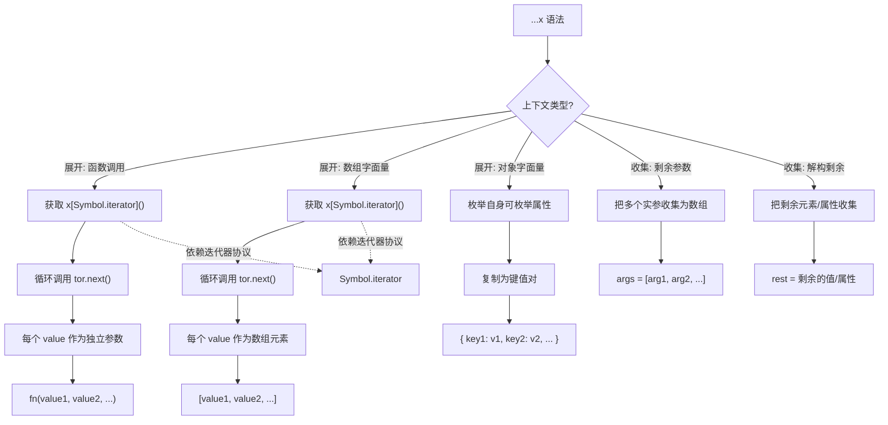

# 扩展运算符

> 扩展运算符（Spread Operator）使用 `...` 语法，可以将数组或对象展开为独立的元素或属性。它是 ES6 引入的重要特性，极大地简化了数据操作。


## 概述

扩展运算符（`...`）主要有两种用途：

| 用途 | 说明 | 示例 |
|------|------|------|
| **展开（Spread）** | 将数组/对象展开为独立元素 | `[...arr]`、`{ ...obj }` |
| **收集（Rest）** | 将多个元素收集为数组 | `function fn(...args)` |

### 版本历史

- **ES6 (2015)**：引入数组扩展运算符和剩余参数
- **ES2018**：引入对象扩展运算符与对象剩余属性（复制自身可枚举属性，包括 Symbol 键）

---

## 工作原理

### 1. 数组扩展运算符与迭代器

数组扩展运算符依赖于 **迭代器协议（Iterator Protocol）**。只有实现了 `Symbol.iterator` 方法的对象才能被展开。

```javascript
// 查看数组的迭代器
const arr = [1, 2, 3];
console.log(typeof arr[Symbol.iterator]); // 'function'

// 手动调用迭代器
const iterator = arr[Symbol.iterator]();
console.log(iterator.next()); // { value: 1, done: false }
console.log(iterator.next()); // { value: 2, done: false }
console.log(iterator.next()); // { value: 3, done: false }
console.log(iterator.next()); // { value: undefined, done: true }

// 自定义可迭代对象
const customIterable = {
  [Symbol.iterator]() {
    let i = 0;
    return {
      next() {
        if (i < 3) {
          return { value: ++i, done: false };
        }
        return { done: true };
      }
    };
  }
};

console.log([...customIterable]); // [1, 2, 3]
```

### 2. 对象扩展运算符与属性枚举

对象扩展运算符通过 `Object.assign()` 的浅拷贝机制实现，只复制对象自身的、可枚举的属性。

```javascript
const obj = {
  a: 1,
  b: 2,
  get c() {
    return this.a + this.b;
  }
};

// 扩展运算符会触发 getter
const copy = { ...obj };
console.log(copy); // { a: 1, b: 2, c: 3 }

// copy.c 现在是值，不是 getter
copy.a = 10;
console.log(copy.c); // 3（不会重新计算）
```

### 3. 浅拷贝机制

扩展运算符只复制第一层属性，嵌套对象仍然是引用。

```javascript
const original = {
  name: 'Alice',
  preferences: {
    theme: 'dark',
    language: 'en'
  }
};

const copy = { ...original };

// 第一层是独立的
copy.name = 'Bob';
console.log(original.name); // 'Alice'（未受影响）

// 嵌套对象是共享引用
copy.preferences.theme = 'light';
console.log(original.preferences.theme); // 'light'（被修改！）

// 内存示意图
/*
original ──→ { name: 'Alice', preferences: ──→ { theme: 'dark', ... } }
                                                    ↑
copy ──→ { name: 'Bob',   preferences: ────────────┘ }
*/
```

---

## 一、数组扩展运算符

### 1. 基本用法

```javascript
const arr = [1, 2, 3];

// 展开数组（作为函数参数）
console.log(...arr); // 1 2 3

// 创建新数组
console.log([...arr]); // [1, 2, 3]
```

### 2. 复制数组

```javascript
const arr = [1, 2, 3];

// ❌ 直接赋值：共享引用
const wrong = arr;
wrong[0] = 100;
console.log(arr); // [100, 2, 3]（原数组被修改）

// ✅ 扩展运算符：创建新数组
const right = [...arr];
right[0] = 999;
console.log(arr);   // [1, 2, 3]（原数组不变）
console.log(right); // [999, 2, 3]

// 其他方法对比
const copy1 = [...arr];        // 扩展运算符
const copy2 = arr.slice();     // slice()
const copy3 = Array.from(arr); // Array.from()
const copy4 = arr.concat();    // concat()
// 以上四种方法效果相同
```

### 3. 合并数组

```javascript
const arr1 = [1, 2];
const arr2 = [3, 4];
const arr3 = [5, 6];

// 基本合并
const merged = [...arr1, ...arr2, ...arr3];
console.log(merged); // [1, 2, 3, 4, 5, 6]

// 与其他元素混合
const mixed = [0, ...arr1, 2.5, ...arr2, 10];
console.log(mixed); // [0, 1, 2, 2.5, 3, 4, 10]

// 对比 concat()
// 扩展运算符方式
const spread = [...arr1, ...arr2];
// concat 方式
const concat = arr1.concat(arr2);
// 结果相同，但扩展运算符更灵活
```

### 4. 函数调用中的应用

```javascript
const numbers = [1, 2, 3, 4, 5];

// 替代 Function.prototype.apply
console.log(Math.max(...numbers)); // 5
console.log(Math.min(...numbers)); // 1

// 等同于
console.log(Math.max.apply(null, numbers)); // 旧写法
console.log(Math.max(1, 2, 3, 4, 5));       // 直接传参

// 动态参数
function multiply(a, b, c) {
  return a * b * c;
}
const args = [2, 3, 4];
console.log(multiply(...args)); // 24

// 构造函数
const dateArgs = [2024, 0, 1]; // 2024年1月1日
const date = new Date(...dateArgs);
console.log(date); // Mon Jan 01 2024 00:00:00
```

### 5. 数组解构中的剩余元素

```javascript
// 基本用法
const [first, second, ...rest] = [1, 2, 3, 4, 5];
console.log(first);  // 1
console.log(second); // 2
console.log(rest);   // [3, 4, 5]

// 跳过元素
const [head, ...tail] = [1, 2, 3, 4, 5];
console.log(head); // 1
console.log(tail); // [2, 3, 4, 5]

// 只取第一个元素
const [firstOnly, ...empty] = [1];
console.log(firstOnly); // 1
console.log(empty);     // []
```

### 6. 字符串转数组

```javascript
const str = 'Hello';

// 扩展运算符
const chars = [...str];
console.log(chars); // ['H', 'e', 'l', 'l', 'o']

// 对比其他方法
const chars2 = str.split('');     // split 方法
const chars3 = Array.from(str);   // Array.from
const chars4 = [...str];          // 扩展运算符
// 以上四种方法结果相同

// 处理 Unicode 字符（如 emoji）
const emoji = '👨‍👩‍👧‍👦';
console.log([...emoji]); // ['👨', '‍', '👩', '‍', '👧', '‍', '👦']
// 注意：复杂 emoji 可能被拆分成多个字符
```

### 7. 类数组转数组

```javascript
// NodeList 转数组
const divs = document.querySelectorAll('div');
const divArray = [...divs];

// arguments 转数组
function example() {
  // ❌ 旧方法
  const argsOld = Array.prototype.slice.call(arguments);
  
  // ✅ 新方法
  const argsNew = [...arguments];
  
  console.log(argsNew);
}
example(1, 2, 3); // [1, 2, 3]

// 其他类数组对象
function logArgs() {
  const args = [...arguments];
  args.forEach(arg => console.log(arg));
}
logArgs('a', 'b', 'c'); // 'a', 'b', 'c'
```

### 8. 数组操作技巧

```javascript
// 在任意位置插入元素
const insertAt = (arr, index, ...items) => [
  ...arr.slice(0, index),
  ...items,
  ...arr.slice(index)
];
const arr = [1, 5];
console.log(insertAt(arr, 1, 2, 3, 4)); // [1, 2, 3, 4, 5]

// 删除指定位置的元素
const removeAt = (arr, index) => [
  ...arr.slice(0, index),
  ...arr.slice(index + 1)
];
console.log(removeAt([1, 2, 3, 4], 2)); // [1, 2, 4]

// 数组去重（配合 Set）
const unique = [...new Set([1, 2, 2, 3, 3, 3])];
console.log(unique); // [1, 2, 3]

// 数组扁平化（一层）
const flatten = arr => [].concat(...arr);
console.log(flatten([[1, 2], [3, 4], 5])); // [1, 2, 3, 4, 5]
```

---

## 二、对象扩展运算符

> **版本要求**：对象扩展运算符在 ES2018 中引入，需要现代浏览器或适当的转译器支持。

### 1. 基本用法

```javascript
const obj = { a: 1, b: 2 };

// 复制对象
const copy = { ...obj };
console.log(copy); // { a: 1, b: 2 }

// 确认是新对象
console.log(obj === copy); // false
```

### 2. 合并对象

```javascript
const obj1 = { a: 1, b: 2 };
const obj2 = { c: 3, d: 4 };
const obj3 = { e: 5 };

// 合并多个对象
const merged = { ...obj1, ...obj2, ...obj3 };
console.log(merged); // { a: 1, b: 2, c: 3, d: 4, e: 5 }
```

### 3. 属性覆盖

```javascript
const defaults = {
  host: 'localhost',
  port: 3000,
  debug: false,
  timeout: 5000
};

const config = {
  ...defaults,
  port: 8080,    // 覆盖 port
  debug: true,   // 覆盖 debug
  env: 'production' // 新增属性
};

console.log(config);
// { host: 'localhost', port: 8080, debug: true, timeout: 5000, env: 'production' }
```

### 4. 属性添加与修改

```javascript
const user = { name: 'Alice', age: 25 };

// 添加新属性
const withEmail = { ...user, email: 'alice@example.com' };
console.log(withEmail); // { name: 'Alice', age: 25, email: 'alice@example.com' }

// 修改现有属性
const updatedAge = { ...user, age: 26 };
console.log(updatedAge); // { name: 'Alice', age: 26 }

// 原对象不变
console.log(user); // { name: 'Alice', age: 25 }
```

### 5. 属性删除（配合解构）

```javascript
const user = {
  name: 'Alice',
  age: 25,
  password: 'secret',
  email: 'alice@example.com'
};

// 删除单个属性
const { password, ...safeUser } = user;
console.log(safeUser); // { name: 'Alice', age: 25, email: 'alice@example.com' }

// 删除多个属性
const { password: pwd, email: mail, ...minimal } = user;
console.log(minimal); // { name: 'Alice', age: 25 }
```

### 6. 嵌套对象处理

```javascript
const obj1 = {
  a: 1,
  nested: { x: 1, y: 2 }
};

const obj2 = {
  b: 2,
  nested: { y: 20, z: 3 }
};

// ⚠️ 浅合并：后面的对象会完全覆盖前面的同名属性
const shallowMerged = { ...obj1, ...obj2 };
console.log(shallowMerged);
// { a: 1, b: 2, nested: { y: 20, z: 3 } }
// 注意：nested.x 丢失了！

// ✅ 深度合并：手动处理嵌套对象
const deepMerged = {
  ...obj1,
  ...obj2,
  nested: { ...obj1.nested, ...obj2.nested }
};
console.log(deepMerged);
// { a: 1, b: 2, nested: { x: 1, y: 20, z: 3 } }
```

### 7. 条件属性添加

```javascript
const isDev = true;
const isProduction = false;

const config = {
  host: 'localhost',
  port: 3000,
  
  // 条件添加：如果 isDev 为真，展开该对象
  ...(isDev && { debug: true, logger: console }),
  
  // 条件添加：如果 isProduction 为真，展开该对象
  ...(isProduction && { 
    optimization: true,
    minify: true 
  })
};

console.log(config);
// { host: 'localhost', port: 3000, debug: true, logger: console }
```

### 8. 动态属性名

```javascript
const key = 'dynamic';
const value = 'value';

const obj = {
  static: 'value1',
  ...{ [key]: value } // 动态属性名
};

console.log(obj); // { static: 'value1', dynamic: 'value' }
```

---

## 三、剩余参数（Rest Parameters）

剩余参数使用相同的 `...` 语法，但作用是 **收集** 参数，与扩展运算符的 **展开** 作用相反。

### 1. 函数参数收集

```javascript
// 收集所有参数
function sum(...numbers) {
  return numbers.reduce((acc, cur) => acc + cur, 0);
}
console.log(sum(1, 2, 3, 4, 5)); // 15

// 与其他参数配合
function greet(greeting, punctuation, ...names) {
  return `${greeting}, ${names.join(' and ')}${punctuation}`;
}
console.log(greet('Hello', '!', 'Alice', 'Bob', 'Charlie')); 
// 'Hello, Alice and Bob and Charlie!'
```

### 2. 箭头函数中的使用

```javascript
// 箭头函数没有 arguments，必须使用剩余参数
const multiply = (...args) => args.reduce((a, b) => a * b, 1);
console.log(multiply(2, 3, 4)); // 24

// 配合其他参数
const format = (prefix, ...items) => {
  return items.map(item => `${prefix}: ${item}`);
};
console.log(format('Item', 'A', 'B', 'C')); 
// ['Item: A', 'Item: B', 'Item: C']
```

### 3. 与 arguments 的区别

| 特性 | arguments | 剩余参数 |
|------|-----------|----------|
| 类型 | 类数组对象 | 真正的数组 |
| 数组方法 | ❌ 无 | ✅ 有 |
| 箭头函数 | ❌ 不支持 | ✅ 支持 |
| 只包含实际参数 | ✅ 是 | ✅ 是 |
| 包含所有参数 | ✅ 是 | ✅ 是 |

```javascript
// ❌ arguments：类数组，不支持数组方法
function oldWay() {
  console.log(arguments);        // Arguments { 0: 1, 1: 2, 2: 3 }
  console.log(arguments.map);    // undefined
  console.log(Array.isArray(arguments)); // false
  
  // 必须先转换
  const args = Array.from(arguments);
  return args.map(x => x * 2);
}

// ✅ 剩余参数：真正的数组
function newWay(...args) {
  console.log(args);             // [1, 2, 3]
  console.log(args.map);         // function
  console.log(Array.isArray(args)); // true
  
  return args.map(x => x * 2);
}

console.log(newWay(1, 2, 3)); // [2, 4, 6]
```

### 4. 解构中的剩余参数

```javascript
// 数组解构
const [first, second, ...rest] = [1, 2, 3, 4, 5];
console.log(first);  // 1
console.log(second); // 2
console.log(rest);   // [3, 4, 5]

// 对象解构
const { a, b, ...others } = { a: 1, b: 2, c: 3, d: 4 };
console.log(a);      // 1
console.log(b);      // 2
console.log(others); // { c: 3, d: 4 }

// 嵌套解构
const { 
  user: { name, ...userRest },
  ...rest 
} = { 
  user: { name: 'Alice', age: 25, email: 'a@b.com' },
  timestamp: Date.now()
};

console.log(name);     // 'Alice'
console.log(userRest); // { age: 25, email: 'a@b.com' }
console.log(rest);     // { timestamp: ... }
```

### 5. 函数参数默认值配合

```javascript
function createUser({
  name,
  age,
  role = 'user',
  status = 'active',
  ...rest
} = {}) {
  return {
    name,
    age,
    role,
    status,
    ...rest
  };
}

const user = createUser({
  name: 'Alice',
  age: 25,
  email: 'alice@example.com',
  department: 'Engineering'
});
console.log(user);
// {
//   name: 'Alice',
//   age: 25, 
//   role: 'user', 
//   status: 'active',
//   email: 'alice@example.com',
//   department: 'Engineering'
// }
```

---

## 四、实际应用场景

### 1. React 组件 Props 透传

```jsx
function Button({ className, variant, children, ...props }) {
  return (
    <button 
      className={`btn btn-${variant} ${className || ''}`}
      {...props}
    >
      {children}
    </button>
  );
}

// 使用
<Button 
  variant="primary" 
  onClick={handleClick} 
  disabled 
  type="submit">
  Submit
</Button>

// 实际渲染
// <button class="btn btn-primary " disabled type="submit">
//   Submit
// </button>
```

### 2. Redux/Vuex 状态管理

```javascript
// Redux reducer：不可变更新
function todosReducer(state = { todos: [], filter: 'all' }, action) {
  switch (action.type) {
    case 'ADD_TODO':
      return {
        ...state,
        todos: [...state.todos, action.payload]
      };
    
    case 'TOGGLE_TODO':
      return {
        ...state,
        todos: state.todos.map(todo =>
          todo.id === action.payload
            ? { ...todo, done: !todo.done }
            : todo
        )
      };
    
    default:
      return state;
  }
}
```

### 3. 柯里化与函数组合

```javascript
// 柯里化
function curry(fn) {
  return function curried(...args) {
    if (args.length >= fn.length) {
      return fn.apply(this, args);
    }
    return function(...moreArgs) {
      return curried.apply(this, [...args, ...moreArgs]);
    };
  };
}

const add = (a, b, c) => a + b + c;
const curriedAdd = curry(add);

console.log(curriedAdd(1)(2)(3)); // 6
console.log(curriedAdd(1, 2)(3)); // 6
console.log(curriedAdd(1)(2, 3)); // 6

// 函数组合
const compose = (...fns) => x => 
  fns.reduceRight((acc, fn) => fn(acc), x);

const double = x => x * 2;
const addOne = x => x + 1;
const square = x => x * x;

const transform = compose(double, addOne, square);
console.log(transform(3)); // ((3²) + 1) * 2 = 20
```

### 4. 配置对象合并

```javascript
// 默认配置与用户配置合并
const DEFAULT_CONFIG = {
  api: {
    baseURL: 'https://api.example.com',
    timeout: 5000,
    headers: {
      'Content-Type': 'application/json'
    }
  },
  retry: {
    maxAttempts: 3,
    delay: 1000
  }
};

const userConfig = {
  api: {
    timeout: 10000,
    headers: {
      'Authorization': 'Bearer token'
    }
  }
};

// ⚠️ 浅合并：userConfig.api 整体覆盖 DEFAULT_CONFIG.api（baseURL 丢失）
const merged = { ...DEFAULT_CONFIG, ...userConfig };

// ✅ 深合并：手动处理嵌套对象
const deepMerged = {
  ...DEFAULT_CONFIG,
  ...userConfig,
  api: { ...DEFAULT_CONFIG.api, ...userConfig.api },
  retry: { ...DEFAULT_CONFIG.retry, ...userConfig.retry }
};
// deepMerged.api.baseURL 保留，timeout 被覆盖为 10000
```

### 5. 数据转换与映射

```javascript
const users = [
  { id: 1, name: 'Alice', age: 25, department: 'Engineering' },
  { id: 2, name: 'Bob', age: 30, department: 'Marketing' },
  { id: 3, name: 'Charlie', age: 28, department: 'Engineering' }
];

// 添加计算字段
const enrichedUsers = users.map(user => ({
  ...user,
  isAdult: user.age >= 18,
  fullName: `${user.name} Smith`
}));

// 分组
function groupBy(list, key) {
  return list.reduce((acc, item) => {
    const group = item[key];
    return {
      ...acc,
      [group]: [...(acc[group] || []), item]
    };
  }, {});
}

const byDepartment = groupBy(users, 'department');
```

### 6. 防抖与节流

```javascript
// 防抖函数
function debounce(fn, delay) {
  let timer = null;
  return function(...args) {
    clearTimeout(timer);
    timer = setTimeout(() => fn.apply(this, args), delay);
  };
}

// 节流函数
function throttle(fn, limit) {
  let inThrottle = false;
  return function(...args) {
    if (!inThrottle) {
      fn.apply(this, args);
      inThrottle = true;
      setTimeout(() => inThrottle = false, limit);
    }
  };
}

// 使用示例
const debouncedSearch = debounce((query) => {
  console.log('Searching for:', query);
}, 300);

debouncedSearch('React');
debouncedSearch('React hooks'); // 只有这个会执行
```

---

## 五、扩展运算符 vs 其他方法

### 1. 对比 Object.assign

| 特性 | 扩展运算符 | Object.assign |
|------|-----------|---------------|
| 语法简洁度 | ✅ 更简洁 | 较繁琐 |
| 返回值 | 新对象 | 目标对象（会修改第一个参数） |
| getter 处理 | 执行 getter，复制值 | 执行 getter，复制值 |
| setter 处理 | 不触发 setter | 触发 setter |
| 性能 | 略慢 | 略快 |
| 浏览器支持 | ES2018+ | ES6+ |

```javascript
const source = {
  get value() { return 123; }
};

const target = {};

// 扩展运算符
const copy1 = { ...source };
console.log(copy1); // { value: 123 }
// copy1.value 是值 123，不是 getter

// Object.assign
const copy2 = Object.assign({}, source);
console.log(copy2); // { value: 123 }
// copy2.value 也是值 123

// Object.assign 会修改第一个参数
Object.assign(target, source);
console.log(target); // { value: 123 }
// target 被修改了！

// 扩展运算符总是返回新对象
const newObj = { ...source };
console.log(newObj === source); // false
```

### 2. 对比 concat / slice

```javascript
const arr1 = [1, 2];
const arr2 = [3, 4];

// 合并数组
const merged1 = [...arr1, ...arr2]; // 扩展运算符
const merged2 = arr1.concat(arr2);  // concat

// 结果相同
console.log(merged1); // [1, 2, 3, 4]
console.log(merged2); // [1, 2, 3, 4]

// 扩展运算符更灵活
const flexible = [0, ...arr1, 2.5, ...arr2, 5];
console.log(flexible); // [0, 1, 2, 2.5, 3, 4, 5]

// 复制数组
const copy1 = [...arr1];  // 扩展运算符
const copy2 = arr1.slice(); // slice
const copy3 = arr1.concat(); // concat
const copy4 = Array.from(arr1); // Array.from

// 结果相同
console.log(copy1, copy2, copy3, copy4);
```

### 3. 对比 Array.from

```javascript
const nodeList = document.querySelectorAll('div');

// 扩展运算符
const arr1 = [...nodeList];

// Array.from
const arr2 = Array.from(nodeList);

// 结果相同
console.log(arr1 instanceof Array); // true
console.log(arr2 instanceof Array); // true

// Array.from 有额外功能
const mapped = Array.from([1, 2, 3], x => x * 2);
console.log(mapped); // [2, 4, 6]

// 初始化数组
const filled = Array.from({ length: 5 }, (_, i) => i);
console.log(filled); // [0, 1, 2, 3, 4]
```

### 4. 性能对比

```javascript
// 大数组测试（简化版）
const largeArray = new Array(100000).fill(0);

console.time('spread');
const copy1 = [...largeArray];
console.timeEnd('spread');

console.time('slice');
const copy2 = largeArray.slice();
console.timeEnd('slice');

console.time('Array.from');
const copy3 = Array.from(largeArray);
console.timeEnd('Array.from');

// 典型结果（不同环境可能不同）：
// slice: ~2-5ms（最快）
// spread: ~3-7ms
// Array.from: ~10-20ms（最慢）
```

---

## 六、常见陷阱与注意事项

### 1. 浅拷贝陷阱

```javascript
const obj = {
  name: 'Alice',
  details: {
    age: 25,
    address: {
      city: 'NYC'
    }
  }
};

// 浅拷贝：嵌套对象仍共享引用
const copy = { ...obj };
copy.details.age = 30;
copy.details.address.city = 'LA';

console.log(obj.details.age);        // 30（被修改！）
console.log(obj.details.address.city); // 'LA'（被修改！）

// 解决方案：深拷贝
const deepCopy1 = JSON.parse(JSON.stringify(obj));
// 或使用结构化克隆
const deepCopy2 = structuredClone(obj);
// 或使用深拷贝库（如 lodash.cloneDeep）
```

### 2. 原型链属性不会被复制

```javascript
class Person {
  constructor(name) {
    this.name = name;
  }
  greet() {
    return `Hello, ${this.name}`;
  }
}

const person = new Person('Alice');
const copy = { ...person };

console.log(copy.name);    // 'Alice'
console.log(copy.greet);   // undefined（方法在原型上）

// 解决方案：手动复制
const fullCopy = {
  ...person,
  greet: person.greet.bind(copy)
};
```

### 3. 不可枚举属性不会被复制

```javascript
const obj = { a: 1 };

// 添加不可枚举属性
Object.defineProperty(obj, 'hidden', {
  value: 'secret',
  enumerable: false
});

// 添加 Symbol 属性
const sym = Symbol('symbol');
obj[sym] = 'symbol value';

const copy = { ...obj };
console.log(copy);           // { a: 1 }
console.log(copy.hidden);    // undefined（不可枚举属性丢失）
console.log(copy[sym]);      // 'symbol value'（Symbol 属性会被复制）
```

### 4. 循环引用问题

```javascript
const obj = { a: 1 };
obj.self = obj; // 循环引用

// ✅ 扩展运算符是浅拷贝，不递归展开，循环引用不会报错
const copy = { ...obj };
console.log(copy.self === obj); // true（self 仍指向原对象）

// ❌ 真正会抛 TypeError 的是 JSON.stringify（递归序列化遇到循环）
try {
  JSON.stringify(obj);
} catch (e) {
  console.log(e); // TypeError: Converting circular structure to JSON
}

// ✅ 需要保留循环引用的深拷贝：使用 structuredClone
const clone = structuredClone(obj);
console.log(clone.self === clone); // true
```

### 5. 剩余参数位置限制

```javascript
// ❌ 错误：剩余参数必须是最后一个参数
function wrong(...rest, last) {} // SyntaxError

// ✅ 正确
function right(first, ...rest) {}

// ✅ 正确：对象解构中剩余属性也必须在最后
const { a, ...rest, b } = obj; // SyntaxError
const { a, b, ...rest } = obj; // 正确
```

### 6. 扩展运算符只能用于可迭代对象

```javascript
// ✅ 数组：可迭代
console.log(...[1, 2, 3]); // 1 2 3

// ✅ 字符串：可迭代
console.log(...'hello'); // h e l l o

// ✅ Set/Map：可迭代
console.log(...new Set([1, 2, 3])); // 1 2 3

// ❌ 数字：不可迭代
console.log(...123); // TypeError: Spread syntax requires ...iterable[Symbol.iterator] to be a function

// ❌ null/undefined：不可迭代
console.log(...null);      // TypeError
console.log(...undefined); // TypeError

// ✅ 对象：不可迭代（但在对象字面量中可以使用）
const obj = { a: 1 };
const copy = { ...obj }; // 正确
console.log(...obj);     // TypeError（不能在函数调用中展开）
```

### 7. null 和 undefined 的处理

```javascript
// ❌ 会报错
const obj1 = { ...null };      // TypeError（在某些旧版本中）
const obj2 = { ...undefined }; // TypeError（在某些旧版本中）

// ✅ 现代浏览器会忽略 null 和 undefined
const config = {
  ...(null),
  ...(undefined),
  a: 1
};
console.log(config); // { a: 1 }

// 但最好还是避免
function mergeConfig(base, extra) {
  return {
    ...base,
    ...(extra || {}) // 安全处理
  };
}
```

---

## 七、性能分析

### 1. 数组操作性能

```javascript
// 小数组：性能差异可忽略
const small = [1, 2, 3];

// 大数组：slice 可能更快
const large = new Array(1000000).fill(0);

// 性能测试
console.time('spread copy');
for (let i = 0; i < 100; i++) {
  const copy = [...large];
}
console.timeEnd('spread copy');

console.time('slice copy');
for (let i = 0; i < 100; i++) {
  const copy = large.slice();
}
console.timeEnd('slice copy');
```

### 2. 对象操作性能

```javascript
const obj = {};
for (let i = 0; i < 10000; i++) {
  obj[`key${i}`] = i;
}

console.time('spread');
for (let i = 0; i < 1000; i++) {
  const copy = { ...obj };
}
console.timeEnd('spread');

console.time('Object.assign');
for (let i = 0; i < 1000; i++) {
  const copy = Object.assign({}, obj);
}
console.timeEnd('Object.assign');

// Object.assign 通常略快
```

### 3. 优化建议

```javascript
// ❌ 避免在循环中频繁使用扩展运算符
for (let i = 0; i < 10000; i++) {
  const newObj = { ...oldObj, value: i };
}

// ✅ 使用其他方法或减少使用频率
const results = Array.from({ length: 10000 }, (_, i) => ({
  ...oldObj,
  value: i
}));

// ✅ 对于超大数组，考虑使用 TypedArray
const largeArray = new Float64Array(1000000);
const copy = largeArray.slice(); // 更快

// ✅ 深拷贝：选择合适的方案
const obj = { /* 深层嵌套对象 */ };

// 方案 1：JSON（快，但有局限）
const copy1 = JSON.parse(JSON.stringify(obj));

// 方案 2：structuredClone（推荐，现代 API）
const copy2 = structuredClone(obj);

// 方案 3：深拷贝库（功能完整）
import { cloneDeep } from 'lodash';
const copy3 = cloneDeep(obj);
```

---

## 八、浏览器兼容性

### 1. 支持情况

| 特性 | Chrome | Firefox | Safari | Edge | Node.js |
|------|--------|---------|--------|------|---------|
| 数组扩展运算符 | 46+ | 16+ | 8+ | 12+ | 5.0+ |
| 剩余参数 | 47+ | 43+ | 10+ | 12+ | 6.0+ |
| 对象扩展运算符 | 60+ | 55+ | 11.1+ | 79+ | 8.3+ |
| 对象剩余属性 | 60+ | 55+ | 11.1+ | 79+ | 8.3+ |

### 2. 转译配置

```javascript
// Babel 配置
{
  "presets": [
    ["@babel/preset-env", {
      "targets": {
        "chrome": "60",
        "firefox": "55",
        "safari": "11.1"
      }
    }]
  ]
}

// TypeScript 配置
{
  "compilerOptions": {
    "target": "ES2018", // 支持对象扩展运算符
    "module": "ESNext"
  }
}
```

### 3. Polyfill 方案

```javascript
// 对于不支持对象扩展运算符的环境
// 使用 Object.assign 替代

// 转换前
const obj = { ...source, a: 1 };

// 转换后
const obj = Object.assign({}, source, { a: 1 });

// Babel 会自动进行这种转换
```

---

## 九、最佳实践

### 1. 优先使用扩展运算符

```javascript
// ✅ 推荐：简洁易读
const copy = [...arr];
const merged = { ...obj1, ...obj2 };

// ❌ 避免：旧语法，除非有性能要求
const copy = arr.slice();
const merged = Object.assign({}, obj1, obj2);
```

### 2. 注意浅拷贝

```javascript
// ⚠️ 警惕嵌套对象
const state = {
  user: { name: 'Alice', settings: { theme: 'dark' } }
};

// ✅ 深层更新
const newState = {
  ...state,
  user: {
    ...state.user,
    settings: {
      ...state.user.settings,
      theme: 'light'
    }
  }
};

// ✅ 使用辅助函数
function updateNested(obj, path, value) {
  // 实现深层更新逻辑
}
```

### 3. 配合不可变数据模式

```javascript
// ✅ 不可变更新
const todos = [
  { id: 1, text: 'Learn JS', done: false },
  { id: 2, text: 'Learn React', done: false }
];

// 添加
const added = [...todos, { id: 3, text: 'Learn Node', done: false }];

// 删除
const removed = todos.filter(t => t.id !== 1);

// 更新
const updated = todos.map(t =>
  t.id === 1 ? { ...t, done: true } : t
);

// 排序（不修改原数组）
const sorted = [...todos].sort((a, b) => a.id - b.id);
```

### 4. 类型安全（TypeScript）

```typescript
// 明确类型
interface User {
  id: number;
  name: string;
  email?: string;
}

const user: User = { id: 1, name: 'Alice' };
const updated: User = { ...user, email: 'alice@example.com' };

// 泛型函数
function merge<T extends object>(target: T, source: Partial<T>): T {
  return { ...target, ...source };
}

// 深层更新类型安全
function updateDeep<T extends object>(
  obj: T,
  updates: Partial<T>
): T {
  return { ...obj, ...updates };
}
```

### 5. 错误处理

```javascript
// ✅ 安全的对象合并
function safeMerge(base, ...sources) {
  return sources.reduce((acc, source) => {
    if (source && typeof source === 'object') {
      return { ...acc, ...source };
    }
    return acc;
  }, { ...base });
}

// ✅ 数组合并（处理 null/undefined）
function safeConcat(...arrays) {
  return arrays.reduce((acc, arr) => {
    if (Array.isArray(arr)) {
      return [...acc, ...arr];
    }
    return acc;
  }, []);
}
```

### 6. 代码组织

```javascript
// ✅ 配置文件组织
const baseConfig = {
  api: { /* ... */ },
  ui: { /* ... */ }
};

const devConfig = {
  ...baseConfig,
  debug: true
};

const prodConfig = {
  ...baseConfig,
  debug: false,
  optimization: true
};

// ✅ 使用工厂模式
function createConfig(env) {
  const configs = { development: devConfig, production: prodConfig };
  return configs[env] || baseConfig;
}
```

---

### 展开语法的函数式本质（核心原理深度）

> **规范层级**：ECMAScript 规范 · SpreadElement · Spread Arguments · Rest Parameters
> **原理来源**：JavaScript 核心原理解析·第09讲

#### 规范语义

`...x` 既不是表达式，也不是语句，更不是函数——但它却能"执行"。它是纯粹的**语法**，封装了一个确定的语义：**展开或收集可迭代对象**。

作为语法，`...x` 不返回值、不返回引用、不返回 Empty——它返回的是**处理逻辑**。在不同的上下文中，它被解释为不同的语义：

| 上下文 | 语义 | 效果 |
|--------|------|------|
| 函数调用 `fn(...x)` | 展开参数 | 消费迭代器，展开为多个参数 |
| 数组字面量 `[...x]` | 展开数组 | 消费迭代器，展开为多个元素 |
| 对象字面量 `{ ...x }` | 展开属性 | 枚举自身可枚举属性 |
| 函数参数 `fn(...x)` | 剩余参数 | 收集多个参数为数组 |
| 解构赋值 `[a, ...x]` | 剩余元素 | 收集剩余元素为数组 |
| 解构赋值 `{ a, ...x }` | 剩余属性 | 收集剩余属性为对象 |

展开语法与函数的三个语义组件存在深层对应关系——它可以修改函数的**参数**（剩余参数）、**执行体**（生成器）和**结果**（展开在数组/函数调用中）。

**递归与迭代的同一性**：递归将循环映射为"函数调用的重复"，迭代将循环映射为"函数体的重复执行"。二者是同一语义的两种实现，区别仅在于：递归不改变函数的三个语义组件，而迭代需要对执行体进行重造。

#### 执行机制



#### 核心洞察

1. **迭代协议统一了所有展开/收集操作**：无论是函数参数展开、数组展开还是剩余参数收集，其底层都通过 `Symbol.iterator` → `next()` 的迭代协议实现。这是 JavaScript 中"一次设计，多处复用"的典范。

2. **修改函数三组件是函数式语言的核心技巧**：递归不改变函数的参数、执行体和结果，因此与函数执行完全没有冲突。而迭代/展开语法则改造了这三者：
   - **参数**：剩余参数 `...x` 改变了参数收集方式
   - **执行体**：生成器 `function*` 将执行体变为可暂停的片段
   - **结果**：展开语法 `[...x]` 将单次返回变为多次产出

3. **迭代过程的生存周期管理**：迭代器对象的生存周期交由使用它的语法来管理。不同的语法有不同的管理策略：

```javascript
// for...of：管理迭代过程，能通知 return/throw 事件
for (let i of iterable) {
  if (i === 2) break; // 触发 tor.return()
}

// 展开语法 ...x：不管理迭代过程，无法通知 return/throw
try { console.log(...iterable); } catch(e) {}
// 如果 iterable 的 next() 抛异常，tor.return() 和 tor.throw() 都不会被调用
```

4. **展开语法的"不完整性"**：展开语法 `...x` 所在位置是表达式，无法在表达式内部使用 `try-catch`，因此它既没有管理迭代过程（不理解 `tor.return`），也没有在异常发生时向内通知 `tor.throw` 的能力。而 `for...of` 可以隐式地向内通知 `tor.return`，但不能通知 `tor.throw`。

#### 代码实证

```javascript
// 1. 剩余参数：收集
function sum(...numbers) {
  return numbers.reduce((a, b) => a + b, 0);
}
console.log(sum(1, 2, 3, 4, 5)); // 15

// 2. 展开参数：展开可迭代对象
const args = [1, 2, 3];
console.log(Math.max(...args)); // 3
// 等价于 Math.max.apply(null, args)

// 3. 展开数组：合并与复制
const merged = [...[1, 2], ...[3, 4]];
console.log(merged); // [1, 2, 3, 4]

// 4. 迭代器生存周期管理：带 return/throw 通知的迭代器
const obj = {
  [Symbol.iterator]() {
    let i = 0;
    return {
      next() {
        return { value: ++i, done: i > 3 };
      },
      return() {
        console.log('RETURN!');
        return { done: true };
      },
      throw() {
        console.log('THROW!');
        return { done: true };
      }
    };
  }
};

// for...of + break：触发 return
for (let i of obj) { break; } // 输出: RETURN!

// 展开语法 + try-catch：不触发 return 和 throw
try { console.log([...obj]); } catch(e) {} // 不输出 RETURN! 或 THROW!
// 展开语法不管理迭代过程的退出事件
```

#### 与实战的关联

1. **大型可迭代对象的性能问题**：展开语法会消费整个迭代器并将所有值收集到内存中。对于大型或无限迭代器，这可能导致内存溢出：

```javascript
// 危险：无限迭代器展开
function* infinite() { let i = 0; while (true) yield i++; }
// [...infinite()]; // 内存溢出！

// 安全：使用 for...of 配合 break 或 take
const gen = infinite();
for (const v of gen) {
  if (v >= 100) break; // 只取前 100 个
}
```

2. **实用的 rest/spread 模式**：

```javascript
// 不可变状态更新（Redux 风格）
const updateTodo = (todos, id, changes) =>
  todos.map(t => t.id === id ? { ...t, ...changes } : t);

// 条件属性展开
const config = {
  ...baseConfig,
  ...(isDev ? { debug: true } : {}),
  ...(isProd ? { optimization: true } : {})
};

// 函数参数转发
const wrapper = (fn, ...args) => {
  console.log('calling with:', args);
  return fn(...args);
};
```

3. **理解迭代器资源管理的差异**：在需要资源清理的场景中，`for...of` 比展开语法更安全，因为它会在 `break`/`return` 时触发 `tor.return()` 事件，允许迭代器执行清理逻辑。

---

## 小结

### 快速参考表

| 操作 | 语法 | 说明 |
|------|------|------|
| 复制数组 | `[...arr]` | 创建数组副本 |
| 合并数组 | `[...arr1, ...arr2]` | 合并多个数组 |
| 函数参数 | `fn(...arr)` | 展开为参数 |
| 复制对象 | `{ ...obj }` | 创建对象副本 |
| 合并对象 | `{ ...obj1, ...obj2 }` | 合并多个对象 |
| 剩余参数 | `function fn(...args)` | 收集参数为数组 |
| 解构剩余 | `const [a, ...rest] = arr` | 解构时收集剩余元素 |
| 条件属性 | `{ ...(cond && obj) }` | 条件添加属性 |

### 核心要点

1. **扩展运算符是浅拷贝**：嵌套对象仍共享引用
2. **只能展开可迭代对象**：数组、字符串、Set、Map 等
3. **对象扩展运算符**：只复制自身可枚举属性
4. **剩余参数必须是最后一个**：位置有严格限制
5. **性能略低于原生方法**：但在大多数场景可忽略
6. **优先使用扩展运算符**：代码更简洁易读

---

> 💡 **提示**：扩展运算符是实现不可变数据更新的首选方式，在 React、Redux 等现代前端开发中广泛应用。掌握其原理和注意事项，能帮助你编写更健壮的代码。

---

## 参考资料

- [MDN - Spread syntax (...)](https://developer.mozilla.org/en-US/docs/Web/JavaScript/Reference/Operators/Spread_syntax)
- [ECMAScript 2015 Language Specification](https://www.ecma-international.org/ecma-262/6.0/)
- [ECMAScript 2018 Language Specification](https://www.ecma-international.org/ecma-262/9.0/)
