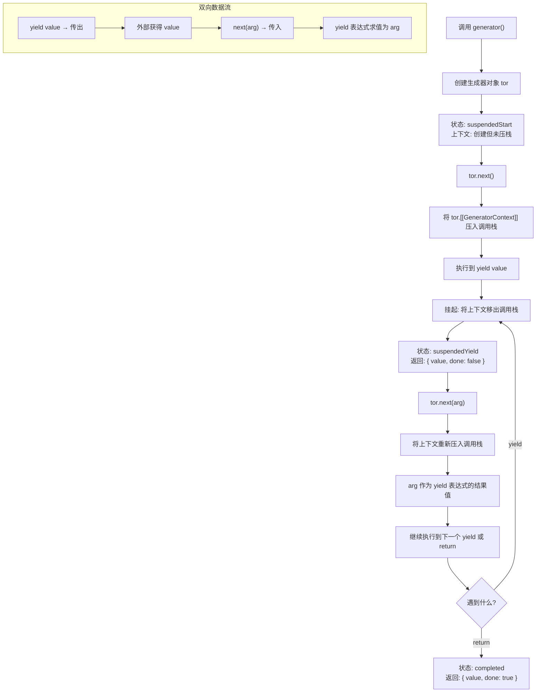

# 迭代器与生成器

> 迭代器(Iterator)和生成器(Generator)是 ES6 引入的核心特性,提供了一种统一的数据遍历机制和流程控制能力。


## 概述

### 核心概念

- **迭代器(Iterator)**：一种协议,定义了统一的遍历集合的方式,提供 `next()` 方法按需获取下一个值
- **生成器(Generator)**：一种特殊的函数,可以暂停执行并逐步产出值,简化迭代器的创建
- **可迭代对象(Iterable)**：实现了 `[Symbol.iterator]` 方法的对象,可以被 `for...of` 等语法遍历

### 工作流程图

```
┌─────────────────────────────────────────────────────────┐
│                    迭代器工作流程                          │
├─────────────────────────────────────────────────────────┤
│                                                         │
│  可迭代对象(Object)                                      │
│       │                                                 │
│       │ [Symbol.iterator]()                             │
│       ▼                                                 │
│  迭代器(Iterator)                                        │
│       │                                                 │
│       │ next()                                          │
│       ▼                                                 │
│  { value: any, done: boolean }                          │
│       │                                                 │
│       ├─ done: false → 继续调用 next()                   │
│       └─ done: true  → 迭代结束                          │
│                                                         │
└─────────────────────────────────────────────────────────┘
```

## 一、迭代器（Iterator）

### 1.1 迭代协议详解

ES6 定义了两层协议:

#### 1.1.1 可迭代协议(Iterable Protocol)

对象实现 `[Symbol.iterator]()` 方法,该方法返回一个迭代器对象:

```javascript
const iterable = {
  [Symbol.iterator]() {
    return {
      current: 0,
      last: 5,
      next() {
        if (this.current <= this.last) {
          return { value: this.current++, done: false };
        }
        return { value: undefined, done: true };
      }
    };
  }
};

// 验证是否可迭代
console.log(typeof iterable[Symbol.iterator]); // 'function'
```

#### 1.1.2 迭代器协议(Iterator Protocol)

迭代器对象必须实现 `next()` 方法,返回包含 `value` 和 `done` 的对象:

| 属性 | 类型 | 说明 |
|------|------|------|
| `value` | any | 当前迭代的值,迭代结束时可为 undefined |
| `done` | boolean | 是否已迭代完毕 |

**协议要求:**
- `next()` 方法必须返回对象 `{ value, done }`
- `done` 为 `true` 时表示迭代结束
- 迭代结束后可继续调用 `next()`,应始终返回 `{ done: true }`

### 1.2 手动实现迭代器

```javascript
// 简单迭代器对象
const iterator = {
  current: 0,
  last: 5,
  next() {
    if (this.current <= this.last) {
      return { value: this.current++, done: false };
    }
    return { value: undefined, done: true };
  },
};

// 使用迭代器
console.log(iterator.next()); // { value: 0, done: false }
console.log(iterator.next()); // { value: 1, done: false }
console.log(iterator.next()); // { value: 2, done: false }
console.log(iterator.next()); // { value: 3, done: false }
```

### 1.3 创建可迭代对象

让对象可迭代,需要实现 `[Symbol.iterator]()` 方法:

```javascript
// 示例1: 创建数字范围迭代器
const range = {
  start: 1,
  end: 5,
  [Symbol.iterator]() {
    let current = this.start;
    const end = this.end;
    return {
      next() {
        if (current <= end) {
          return { value: current++, done: false };
        }
        return { done: true };
      }
    };
  }
};

// 使用 for...of
for (const num of range) {
  console.log(num); // 1, 2, 3, 4, 5
}

// 使用解构赋值
const [first, second, ...rest] = range;
console.log(first, second, rest); // 1, 2, [3, 4, 5]

// 使用 Array.from
console.log(Array.from(range)); // [1, 2, 3, 4, 5]
```

```javascript
// 示例2: 创建自定义集合类
class MyCollection {
  constructor(...items) {
    this.items = items;
  }
  
  [Symbol.iterator]() {
    let index = 0;
    const items = this.items;
    
    return {
      next() {
        if (index < items.length) {
          return { value: items[index++], done: false };
        }
        return { done: true };
      }
    };
  }
}

const collection = new MyCollection(1, 2, 3, 4, 5);
for (const item of collection) {
  console.log(item); // 1, 2, 3, 4, 5
}
```

### 1.4 内置可迭代对象

JavaScript 中以下内置对象默认实现了可迭代协议:

| 对象类型 | 说明 | 迭代内容 |
|---------|------|---------|
| `Array` | 数组 | 元素值 |
| `String` | 字符串 | 字符编码单元 |
| `Map` | 映射表 | [key, value] 键值对 |
| `Set` | 集合 | 元素值 |
| `arguments` | 函数参数 | 参数值 |
| `NodeList` | DOM 节点列表 | DOM 节点 |
| `TypedArray` | 类型化数组 | 元素值 |
| `Int8Array` 等 | 具体类型数组 | 元素值 |

**内置对象迭代示例:**

```javascript
// 1. 数组迭代
const arr = [1, 2, 3];
for (const item of arr) {
  console.log(item); // 1, 2, 3
}

// 数组迭代器
const arrIterator = arr[Symbol.iterator]();
console.log(arrIterator.next()); // { value: 1, done: false }
console.log(arrIterator.next()); // { value: 2, done: false }

// 2. 字符串迭代
for (const char of 'ab') {
  console.log(char); // 'a', 'b'
}

// 3. Map 迭代（键值对）
const map = new Map([['a', 1], ['b', 2]]);
for (const [key, value] of map) {
  console.log(key, value); // 'a' 1, 'b' 2
}

// 4. Set 迭代
for (const val of new Set([1, 2])) {
  console.log(val); // 1, 2
}

// 5. arguments 迭代
(function () {
  for (const arg of arguments) {
    console.log(arg); // 'x', 'y'
  }
})('x', 'y');

// 6. NodeList 迭代
const divs = document.querySelectorAll('div');
for (const div of divs) {
  console.log(div);
}
```

### 1.5 迭代器的可选方法

完整的迭代器还可以实现两个可选方法:

#### return(value)

当迭代提前终止时调用(如使用 `break`、`return` 或抛出异常):

```javascript
const iterable = {
  [Symbol.iterator]() {
    let i = 0;
    return {
      next() {
        if (i < 5) {
          return { value: i++, done: false };
        }
        return { done: true };
      },
      return(value) {
        console.log('清理资源');
        return { value, done: true };
      }
    };
  }
};

// 提前终止会调用 return
for (const item of iterable) {
  if (item === 2) break;
  console.log(item); // 0, 1
}
// 输出: 清理资源
```

#### throw(error)

主要用于生成器,向生成器抛出错误(稍后在生成器部分详细说明)。

---

## 二、生成器（Generator）

### 2.1 基本语法

生成器使用 `function*` 声明,内部使用 `yield` 产出值:

```javascript
// 基本生成器
function* generator() {
  yield 1;
  yield 2;
  yield 3;
}

const gen = generator();

console.log(gen.next()); // { value: 1, done: false }
console.log(gen.next()); // { value: 2, done: false }
console.log(gen.next()); // { value: 3, done: false }
console.log(gen.next()); // { value: undefined, done: true }
```

**语法要点:**
- 函数声明时在 `function` 后添加 `*`
- 可以是 `function* name()` 或 `function *name()` (推荐前者)
- 内部使用 `yield` 表达式产出值
- 调用生成器函数返回一个生成器对象(也是迭代器)

### 2.2 yield 表达式详解

`yield` 表达式具有双向通信能力:

#### 2.2.1 产出值

```javascript
function* generator() {
  yield 1;
  yield 2;
  yield 3;
}

const gen = generator();
console.log(gen.next()); // { value: 1, done: false }
console.log(gen.next()); // { value: 2, done: false }
console.log(gen.next()); // { value: 3, done: false }
console.log(gen.next()); // { value: undefined, done: true }
```

#### 2.2.2 接收值

```javascript
function* generator() {
  console.log('开始');
  const a = yield 1;       // yield 表达式的返回值
  console.log('a:', a);
  const b = yield 2;
  console.log('b:', b);
  return 3;
}

const gen = generator();

// 第一次调用 next(),启动生成器,执行到第一个 yield
console.log(gen.next());
// 输出: 开始
// 返回: { value: 1, done: false }

// 第二次调用 next('A'),从上次暂停处继续,将 'A' 作为 yield 表达式的返回值
console.log(gen.next('A'));
// 输出: a: A
// 返回: { value: 2, done: false }

// 第三次调用
console.log(gen.next('B'));
// 输出: b: B
// 返回: { value: 3, done: true }
```

**执行流程图:**

```
┌─────────────────────────────────────────────────────────┐
│              生成器执行流程                               │
├─────────────────────────────────────────────────────────┤
│                                                         │
│  gen.next()         → 启动生成器,执行到 yield 1          │
│                         ↓                               │
│                     { value: 1, done: false }           │
│                         ↓                               │
│  gen.next('A')      → 恢复执行,'A' → a,执行到 yield 2    │
│                         ↓                               │
│                     { value: 2, done: false }           │
│                         ↓                               │
│  gen.next('B')      → 恢复执行,'B' → b,执行到 return 3   │
│                         ↓                               │
│                     { value: 3, done: true }            │
│                                                         │
└─────────────────────────────────────────────────────────┘
```

#### 2.2.3 yield 表达式的值

```javascript
function* generator() {
  // yield 表达式本身的值是 undefined(如果没有通过 next() 传值)
  let result = yield 'first';
  console.log('接收到的值:', result); // 接收到的值: undefined
  
  // 可以通过 next(value) 传递值
  result = yield 'second';
  console.log('接收到的值:', result); // 接收到的值: hello
}

const gen = generator();
gen.next();              // { value: 'first', done: false }
gen.next();              // 接收到的值: undefined, { value: 'second', done: false }
gen.next('hello');       // 接收到的值: hello, { value: undefined, done: true }
```

### 2.3 yield* 委托表达式

`yield*` 用于委托给另一个生成器或可迭代对象:

```javascript
function* generator1() {
  yield 1;
  yield 2;
}

function* generator2() {
  yield 'a';
  yield* generator1();  // 委托给 generator1
  yield* [3, 4];        // 委托给数组
  yield 'b';
}

for (const value of generator2()) {
  console.log(value);
}
// 输出: 'a', 1, 2, 3, 4, 'b'
```

**yield* 的特点:**
- 委托给任何可迭代对象(数组、字符串、Set、Map、其他生成器等)
- 会完全消耗被委托的迭代器
- yield* 表达式的值是被委托迭代器的返回值

```javascript
function* generator1() {
  yield 1;
  yield 2;
  return 'done';  // 生成器的返回值
}

function* generator2() {
  const result = yield* generator1();  // result = 'done'
  console.log('委托结果:', result);
  yield 3;
}

const gen = generator2();
console.log(gen.next()); // { value: 1, done: false }
console.log(gen.next()); // { value: 2, done: false }
console.log(gen.next()); // 委托结果: done, { value: 3, done: false }
```

**应用场景:**

```javascript
// 嵌套结构扁平化
function* flattenArray(arr) {
  for (const item of arr) {
    if (Array.isArray(item)) {
      yield* flattenArray(item);  // 递归委托
    } else {
      yield item;
    }
  }
}

const nested = [1, [2, 3], [4, [5, 6]]];
console.log([...flattenArray(nested)]); // [1, 2, 3, 4, 5, 6]
```

### 2.4 生成器方法

生成器对象有三个方法:

| 方法 | 说明 | 返回值 |
|------|------|--------|
| `next(value)` | 恢复执行 | `{ value, done }` |
| `return(value)` | 终止生成器 | `{ value, done: true }` |
| `throw(error)` | 抛出错误 | `{ value, done }` |

#### 2.4.1 next(value)

恢复生成器执行,可选传入值:

```javascript
function* generator() {
  const input = yield;
  console.log('Received:', input);
}

const gen = generator();
gen.next();          // 启动生成器,执行到第一个 yield
gen.next('Hello');   // Received: Hello
```

**注意事项:**
- 第一次调用 `next()` 时传递的值会被忽略
- 因为第一次调用只是启动生成器,执行到第一个 `yield` 处暂停
- 从第二次调用开始,传入的值会作为上一个 `yield` 表达式的返回值

```javascript
function* generator() {
  console.log('Start');
  const a = yield 1;
  console.log('a =', a);
  const b = yield 2;
  console.log('b =', b);
}

const gen = generator();

// ❌ 错误示范:第一次调用传入的值被忽略
gen.next('ignored');   // Start, { value: 1, done: false }
gen.next('A');         // a = A, { value: 2, done: false }
gen.next('B');         // b = B, { value: undefined, done: true }

// ✅ 正确示范:从第二次开始传值
const gen2 = generator();
gen2.next();           // Start, { value: 1, done: false }
gen2.next('A');        // a = A, { value: 2, done: false }
gen2.next('B');        // b = B, { value: undefined, done: true }
```

#### 2.4.2 return(value)

立即终止生成器并返回值:

```javascript
function* generator() {
  yield 1;
  yield 2;
  yield 3;
}

const gen = generator();
console.log(gen.next());           // { value: 1, done: false }
console.log(gen.return('done'));   // { value: 'done', done: true }
console.log(gen.next());           // { value: undefined, done: true }
```

**触发 return 的场景:**

```javascript
function* generator() {
  try {
    yield 1;
    yield 2;
    yield 3;
  } finally {
    console.log('清理资源');  // finally 块总是执行
  }
}

// 场景1: 显式调用 return()
const gen1 = generator();
gen1.next();            // { value: 1, done: false }
gen1.return();          // 清理资源, { value: undefined, done: true }

// 场景2: for...of 提前退出（return/break）
function findValue() {
  const gen = generator();
  for (const value of gen) {
    if (value === 2) return value;  // 触发 return()
  }
}
console.log(findValue());  // 清理资源, 2
```

**注意:**
- 如果生成器有 `finally` 块,`return()` 会先执行 `finally` 块
- `finally` 块执行后,生成器进入完成状态
- 后续的 `next()` 调用总是返回 `{ value: undefined, done: true }`

#### 2.4.3 throw(error)

向生成器内部抛出错误:

```javascript
function* generator() {
  try {
    yield 1;
    yield 2;
  } catch (error) {
    console.log('Caught:', error.message);
  }
  yield 3;
}

const gen = generator();
console.log(gen.next());                      // { value: 1, done: false }
console.log(gen.throw(new Error('Error!'))); // Caught: Error!, { value: 3, done: false }
console.log(gen.next());                      // { value: undefined, done: true }
```

**错误处理流程:**

```javascript
function* generator() {
  try {
    console.log('Start');
    yield 1;
    console.log('After yield 1');
    yield 2;
  } catch (error) {
    console.log('Caught error:', error.message);
    yield 'recovered';
  } finally {
    console.log('Finally');
  }
  yield 3;
}

const gen = generator();
console.log(gen.next());                        // Start, { value: 1, done: false }

// 抛出错误:错误会被当前的 try-catch 捕获
console.log(gen.throw(new Error('Oops!')));
// 输出: Caught error: Oops!
// 返回: { value: 'recovered', done: false }

console.log(gen.next());  // Finally, { value: 3, done: false }
console.log(gen.next());  // { value: undefined, done: true }
```

**如果错误未被捕获:**

```javascript
function* generator() {
  yield 1;
  yield 2;  // 没有 try-catch
}

const gen = generator();
gen.next();  // { value: 1, done: false }

try {
  gen.throw(new Error('Not caught'));
} catch (error) {
  console.log('外部捕获:', error.message);  // 外部捕获: Not caught
}

// 生成器已关闭
console.log(gen.next());  // { value: undefined, done: true }
```

### 2.5 生成器的特殊形式

#### 2.5.1 对象方法

```javascript
const obj = {
  // 简写形式
  *generator1() {
    yield 1;
    yield 2;
  },
  
  // 完整形式
  generator2: function*() {
    yield 3;
    yield 4;
  }
};

console.log([...obj.generator1()]); // [1, 2]
console.log([...obj.generator2()]); // [3, 4]
```

#### 2.5.2 类方法

```javascript
class MyClass {
  // 实例方法
  *generator() {
    yield this.value;
  }
  
  // 静态方法
  static *staticGenerator() {
    yield 'static';
  }
}

const instance = new MyClass();
instance.value = 42;
console.log([...instance.generator()]);  // [42]
console.log([...MyClass.staticGenerator()]); // ['static']
```

#### 2.5.3 匿名生成器

```javascript
// 函数表达式
const gen1 = function*() {
  yield 1;
};

// 箭头函数 ❌ 不支持
// const gen2 = *() => { yield 1; };  // SyntaxError

// 作为参数传入（生成器函数是一等公民）
function* processItems(items, transform) {
  for (const item of items) {
    yield* transform(item);
  }
}

const doubled = processItems([1, 2, 3], function* (x) { yield x * 2; });
console.log([...doubled]); // [2, 4, 6]
```

---

## 三、异步迭代器与异步生成器

> ES2018 引入了异步迭代器和异步生成器,用于处理异步数据流。

### 3.1 异步迭代协议

异步迭代使用 `[Symbol.asyncIterator]` 方法:

```javascript
const asyncIterable = {
  [Symbol.asyncIterator]() {
    let i = 0;
    return {
      next() {
        if (i < 3) {
          return Promise.resolve({ value: i++, done: false });
        }
        return Promise.resolve({ done: true });
      }
    };
  }
};

// 使用 for await...of 遍历
(async () => {
  for await (const value of asyncIterable) {
    console.log(value);  // 0, 1, 2
  }
})();
```

### 3.2 异步生成器

使用 `async function*` 声明异步生成器:

```javascript
// 异步生成器
async function* asyncGenerator() {
  const data = await fetch('/api/data');
  const json = await data.json();
  
  for (const item of json) {
    yield item;
  }
}

// 使用 for await...of
(async () => {
  for await (const item of asyncGenerator()) {
    console.log(item);
  }
})();
```

### 3.3 实际应用示例

#### 示例1: 分页数据异步迭代

```javascript
async function* fetchPages(url) {
  let page = 1;
  let hasMore = true;
  
  while (hasMore) {
    const response = await fetch(`${url}?page=${page}`);
    const data = await response.json();
    
    yield data.items;
    
    hasMore = data.hasMore;
    page++;
  }
}

// 使用
(async () => {
  for await (const items of fetchPages('/api/users')) {
    for (const item of items) {
      console.log(item);
    }
  }
})();
```

#### 示例2: 文件行读取

```javascript
async function* readLines(filePath) {
  const fileHandle = await fs.promises.open(filePath, 'r');
  const stream = fileHandle.createReadStream();
  const reader = readline.createInterface({
    input: stream,
    crlfDelay: Infinity
  });
  
  for await (const line of reader) {
    yield line;
  }
  
  await fileHandle.close();
}

// 使用
(async () => {
  for await (const line of readLines('./data.txt')) {
    console.log(line);
  }
})();
```

#### 示例3: 实时数据流

```javascript
async function* eventStream(url) {
  const response = await fetch(url);
  const reader = response.body.getReader();
  const decoder = new TextDecoder();
  
  while (true) {
    const { done, value } = await reader.read();
    if (done) break;
    
    const chunk = decoder.decode(value, { stream: true });
    yield chunk;
  }
}

// 使用
(async () => {
  for await (const chunk of eventStream('/api/stream')) {
    processChunk(chunk);
  }
})();
```

### 3.4 异步迭代器 vs 同步迭代器

| 特性 | 同步迭代器 | 异步迭代器 |
|------|-----------|-----------|
| Symbol | `[Symbol.iterator]` | `[Symbol.asyncIterator]` |
| next() 返回值 | `{ value, done }` | `Promise<{ value, done }>` |
| 遍历语法 | `for...of` | `for await...of` |
| 使用场景 | 内存中的数据集合 | 异步数据流、网络请求 |
| 性能特点 | 立即返回 | 每次迭代都可能是异步操作 |

### 3.5 内置异步可迭代对象

#### ReadableStream

```javascript
// 浏览器环境
const response = await fetch('/api/data');
const reader = response.body.getReader();

// ReadableStream 实现了异步迭代
for await (const chunk of response.body) {
  console.log(chunk);
}
```

#### Node.js 可读流

```javascript
// Node.js 环境
const fs = require('fs');

async function processFile() {
  const stream = fs.createReadStream('./data.txt', { encoding: 'utf8' });
  
  for await (const chunk of stream) {
    console.log(chunk);
  }
}
```

---

## 四、生成器实现迭代器

生成器是创建迭代器的简便方法:

### 4.1 传统方式 vs 生成器方式

```javascript
// ❌ 传统迭代器:冗长且易错
const range1 = {
  start: 1,
  end: 5,
  [Symbol.iterator]() {
    let current = this.start;
    const end = this.end;
    return {
      next() {
        if (current <= end) {
          return { value: current++, done: false };
        }
        return { done: true };
      }
    };
  }
};

// ✅ 生成器方式:简洁
const range2 = {
  start: 1,
  end: 5,
  *[Symbol.iterator]() {
    for (let i = this.start; i <= this.end; i++) {
      yield i;
    }
  }
};

for (const num of range2) {
  console.log(num); // 1, 2, 3, 4, 5
}
```

### 4.2 带返回值的迭代器

```javascript
const range = {
  start: 1,
  end: 5,
  *[Symbol.iterator]() {
    for (let i = this.start; i <= this.end; i++) {
      yield i;
    }
    return '完成';  // 迭代器返回值
  }
};

const iterator = range[Symbol.iterator]();
let result;
while (!(result = iterator.next()).done) {
  console.log(result.value);  // 1, 2, 3, 4, 5
}
console.log(result.value);  // '完成'
```

### 4.3 支持提前终止的迭代器

```javascript
const range = {
  start: 1,
  end: 5,
  *[Symbol.iterator]() {
    try {
      for (let i = this.start; i <= this.end; i++) {
        yield i;
      }
    } finally {
      console.log('清理资源');
    }
  }
};

// 提前终止会执行 finally
for (const num of range) {
  console.log(num);  // 1, 2
  if (num === 2) break;
}
// 输出: 清理资源
```

---

## 五、实际应用场景

### 5.1 无限序列

```javascript
// 无限数字序列
function* infiniteSequence() {
  let i = 0;
  while (true) {
    yield i++;
  }
}

const gen = infiniteSequence();
console.log(gen.next().value); // 0
console.log(gen.next().value); // 1
console.log(gen.next().value); // 2

// 质数序列
function* primes() {
  const found = [];
  let n = 2;
  while (true) {
    if (!found.some(p => n % p === 0)) {
      yield n;
      found.push(n);
    }
    n++;
  }
}

const primeGen = primes();
console.log([...Array(10)].map(() => primeGen.next().value));
// [2, 3, 5, 7, 11, 13, 17, 19, 23, 29]
```

### 5.2 懒加载与按需计算

```javascript
// 懒加载示例
function* lazyRange(start, end) {
  console.log('Starting...');
  for (let i = start; i <= end; i++) {
    console.log(`Generating ${i}`);
    yield i;
  }
}

const range = lazyRange(1, 5);
console.log('Created');
console.log(range.next().value); // Starting... Generating 1, 1

// 按行处理文本
function* readLines(text) {
  for (const line of text.split('\n')) {
    yield line;
  }
}

const content = '第一行\n第二行\n第三行';
for (const line of readLines(content)) {
  console.log(line);
}
// 第一行
// 第二行
// 第三行
```

### 5.3 异步流程控制(旧方案)

```javascript
// 使用生成器进行异步流程控制(ES6 时代的方案)
function* asyncTask() {
  try {
    const user = yield fetchUser();
    const posts = yield fetchPosts(user.id);
    const comments = yield fetchComments(posts[0].id);
    return comments;
  } catch (error) {
    console.error('Error:', error);
  }
}

// 简易运行器:驱动生成器,把 yield 的 Promise 结果传回
function run(genFn) {
  const gen = genFn();
  function step(nextFn) {
    const { value, done } = nextFn();
    if (done) return Promise.resolve(value);
    return Promise.resolve(value).then(
      result => step(() => gen.next(result)),
      error => step(() => gen.throw(error))
    );
  }
  return step(() => gen.next());
}

run(asyncTask).then(comments => console.log(comments));

// 现代写法:async/await(生成器方案的语法糖)
async function asyncTaskModern() {
  try {
    const user = await fetchUser();
    const posts = await fetchPosts(user.id);
    const comments = await fetchComments(posts[0].id);
    return comments;
  } catch (error) {
    console.error('Error:', error);
  }
}
```

### 5.4 树结构遍历

```javascript
// 二叉树节点
class TreeNode {
  constructor(value, left = null, right = null) {
    this.value = value;
    this.left = left;
    this.right = right;
  }

  // 中序遍历
  *[Symbol.iterator]() {
    if (this.left) yield* this.left;
    yield this.value;
    if (this.right) yield* this.right;
  }
}

const tree = new TreeNode(2, new TreeNode(1), new TreeNode(3));
console.log([...tree]); // [1, 2, 3]

// DOM 树遍历
function* walkDOM(node) {
  yield node;
  for (const child of node.children) {
    yield* walkDOM(child);
  }
}

// 使用
for (const node of walkDOM(document.body)) {
  console.log(node.tagName);
}
```

### 5.5 大数据分块处理

```javascript
// 数组分块
function* chunk(array, size) {
  for (let i = 0; i < array.length; i += size) {
    yield array.slice(i, i + size);
  }
}

const largeArray = Array.from({ length: 1000 }, (_, i) => i);

for (const chunk of chunk(largeArray, 100)) {
  console.log(`Processing chunk: ${chunk[0]} - ${chunk[chunk.length - 1]}`);
}

// 异步分块读取大文件
async function* processLargeFile(filePath) {
  const fs = require('fs');
  const stream = fs.createReadStream(filePath, { highWaterMark: 64 * 1024 });
  for await (const data of stream) {
    yield data;
  }
}

// 使用
(async () => {
  for await (const chunk of processLargeFile('./large-file.bin')) {
    await processChunk(chunk);
  }
})();
```

### 5.6 状态机实现

```javascript
// 简单状态机
function* stateMachine() {
  while (true) {
    yield 'idle';
    yield 'processing';
    yield 'done';
  }
}

const machine = stateMachine();
console.log(machine.next().value); // 'idle'
console.log(machine.next().value); // 'processing'

// 双向通信的任务处理器
function* taskProcessor() {
  const tasks = [];
  while (true) {
    const action = yield tasks;
    if (action.type === 'add') {
      tasks.push(action.task);
    } else if (action.type === 'complete') {
      const index = tasks.indexOf(action.task);
      if (index !== -1) tasks.splice(index, 1);
    }
  }
}

const processor = taskProcessor();
processor.next(); // 初始化
console.log(processor.next({ type: 'add', task: 'Task 1' }).value); // ['Task 1']
console.log(processor.next({ type: 'add', task: 'Task 2' }).value); // ['Task 1', 'Task 2']
console.log(processor.next({ type: 'complete', task: 'Task 1' }).value); // ['Task 2']
```

### 5.7 协程实现

```javascript
// 简单协程调度器
class Scheduler {
  constructor() {
    this.tasks = [];
  }
  
  add(generator) {
    this.tasks.push({
      iterator: generator(),
      state: 'ready'
    });
  }

  run() {
    while (this.tasks.some(t => t.state === 'ready')) {
      for (const task of this.tasks) {
        if (task.state !== 'ready') continue;
        const { value, done } = task.iterator.next();
        if (done) {
          task.state = 'done';
        } else {
          console.log(value);
        }
      }
    }
  }
}

// 使用:两个任务交错执行
const scheduler = new Scheduler();
scheduler.add(function* () {
  for (let i = 0; i < 3; i++) yield `Task A: ${i}`;
});
scheduler.add(function* () {
  for (let i = 0; i < 3; i++) yield `Task B: ${i}`;
});
scheduler.run();
// Task A: 0
// Task B: 0
// Task A: 1
// Task B: 1
// Task A: 2
// Task B: 2
```

### 5.8 数据管道

```javascript
// 生成器管道
function* numbers() {
  yield 1;
  yield 2;
  yield 3;
  yield 4;
  yield 5;
}

function* filter(iterable, predicate) {
  for (const item of iterable) {
    if (predicate(item)) {
      yield item;
    }
  }
}

function* map(iterable, transform) {
  for (const item of iterable) {
    yield transform(item);
  }
}

// 组合管道:偶数 → 平方
const result = map(
  filter(numbers(), x => x % 2 === 0),
  x => x * x
);

console.log([...result]); // [4, 16]
```

---

## 六、迭代器工具方法

### 6.1 自定义迭代器工具

```javascript
// 迭代器工具类
class IteratorTools {
  // 生成范围
  static *range(start, end, step = 1) {
    for (let i = start; i < end; i += step) {
      yield i;
    }
  }
  
  // 重复值
  static *repeat(value, times = Infinity) {
    for (let i = 0; i < times; i++) {
      yield value;
    }
  }

  // 齐平组合
  static *zip(...iterables) {
    const iters = iterables.map(it => it[Symbol.iterator]());
    while (true) {
      const results = iters.map(it => it.next());
      if (results.some(r => r.done)) return;
      yield results.map(r => r.value);
    }
  }

  // 带索引
  static *enumerate(iterable, start = 0) {
    let i = start;
    for (const item of iterable) {
      yield [i++, item];
    }
  }

  // 反向（仅数组等可索引结构）
  static *reverse(array) {
    for (let i = array.length - 1; i >= 0; i--) {
      yield array[i];
    }
  }
}

// 使用示例
console.log([...IteratorTools.range(0, 5)]); // [0, 1, 2, 3, 4]
console.log([...IteratorTools.repeat('hi', 3)]); // ['hi', 'hi', 'hi']
console.log([...IteratorTools.zip([1, 2], ['a', 'b'])]); // [[1, 'a'], [2, 'b']]
console.log([...IteratorTools.enumerate(['a', 'b'])]); // [[0, 'a'], [1, 'b']]
console.log([...IteratorTools.reverse([1, 2, 3])]); // [3, 2, 1]
```

### 6.2 Iterator Helpers（ES2025 内置）

ES2025 为所有内置迭代器原型（`Iterator.prototype`）新增了标准的辅助方法，无需再手动实现上述工具类。这些方法支持**惰性链式调用**，不会创建中间数组：

```javascript
// ES2025 Iterator Helpers - 原生支持
function* naturals() {
  let i = 0
  while (true) yield i++
}

// 链式操作（惰性求值）
const result = naturals()
  .take(10)                    // 取前 10 个
  .filter(x => x % 2 === 0)   // 过滤偶数
  .map(x => x ** 2)           // 平方
  .drop(1);                   // 跳过第一个

console.log([...result]); // [4, 16, 36, 64]

const expanded = [1, 2, 3].values().flatMap(x => [x, x * 10])
console.log([...expanded]) // [1, 10, 2, 20, 3, 30]

// from() - 从迭代器创建新的迭代器
const iter = Iterator.from([1, 2, 3])
console.log([...iter.map(x => x * 2)]) // [2, 4, 6]
```

**Iterator Helper 方法完整列表：**

| 方法 | 说明 | 返回类型 | 惰性/即时 |
|------|------|---------|----------|
| `.map(fn)` | 映射每个元素 | Iterator | 惰性 |
| `.filter(fn)` | 过滤元素 | Iterator | 惰性 |
| `.take(n)` | 取前 n 个 | Iterator | 惰性 |
| `.drop(n)` | 跳过前 n 个 | Iterator | 惰性 |
| `.flatMap(fn)` | 映射后扁平化 | Iterator | 惰性 |
| `.reduce(fn, init)` | 累计计算 | 值 | 即时 |
| `.toArray()` | 转为数组 | Array | 即时 |
| `.forEach(fn)` | 遍历 | undefined | 即时 |
| `.some(fn)` | 存在性检测 | boolean | 即时 |
| `.every(fn)` | 全量检测 | boolean | 即时 |
| `.find(fn)` | 查找元素 | 值 | 即时 |
| `Iterator.from(iterable)` | 创建迭代器 | Iterator | 惰性 |

---

## 七、性能优化与最佳实践

### 7.1 性能考虑

#### 内存效率

```javascript
// ❌ 不好的做法:一次性加载所有数据
const allData = loadData(); // 占用大量内存
for (const item of allData) {
  process(item);
}

// ✅ 好的做法:使用生成器按需加载
function* loadDataLazy() {
  let page = 1;
  while (hasMore(page)) {
    const data = fetchPage(page++);
    for (const item of data) {
      yield item;
    }
  }
}

for (const item of loadDataLazy()) {
  process(item); // 每次只占用当前项的内存
}
```

#### 提前终止

```javascript
// 使用 return() 进行清理
function* readLines(file) {
  const fd = openFile(file);
  try {
    while (hasMore(fd)) {
      yield readLine(fd);
    }
  } finally {
    closeFile(fd); // 确保资源释放
  }
}

// for...of 会自动调用 return() 当使用 break/return 时
for (const line of readLines('data.txt')) {
  if (line.includes('ERROR')) {
    break; // 触发 finally,关闭文件
  }
}
```

### 7.2 最佳实践

#### 1. 使用生成器简化迭代器创建

```javascript
// ❌ 冗长的传统方式
const iterable1 = {
  data: [1, 2, 3],
  [Symbol.iterator]() {
    let index = 0;
    const data = this.data;
    return {
      next() {
        if (index < data.length) {
          return { value: data[index++], done: false };
        }
        return { done: true };
      }
    };
  }
};

// ✅ 简洁的生成器方式
const iterable2 = {
  data: [1, 2, 3],
  *[Symbol.iterator]() {
    for (const item of this.data) {
      yield item;
    }
  }
};
```

#### 2. 避免在生成器中保存外部状态

```javascript
// ❌ 不好:依赖外部状态
let counter = 0;
function* badGenerator() {
  while (true) {
    yield counter++; // 外部可修改
  }
}

// ✅ 好:内部维护状态
function* goodGenerator() {
  let counter = 0;
  while (true) {
    yield counter++;
  }
}
```

#### 3. 合理使用 yield*

```javascript
// ✅ 委托给其他迭代器
function* flatten(arr) {
  for (const item of arr) {
    if (Array.isArray(item)) {
      yield* flatten(item);
    } else {
      yield item;
    }
  }
}

console.log([...flatten([1, [2, [3, 4]], 5])]); // [1, 2, 3, 4, 5]
```

#### 4. 使用 for...of 而非手动迭代

```javascript
const iterable = [1, 2, 3];

// ❌ 冗长
const iterator = iterable[Symbol.iterator]();
let result = iterator.next();
while (!result.done) {
  console.log(result.value);
  result = iterator.next();
}

// ✅ 简洁
for (const item of iterable) {
  console.log(item);
}
```

#### 5. 处理异步数据流

```javascript
// ✅ 使用异步生成器处理异步数据
async function* fetchAllPages(baseUrl) {
  let page = 1;
  while (true) {
    const response = await fetch(`${baseUrl}?page=${page}`);
    const data = await response.json();
    
    if (data.items.length === 0) break;
    
    yield data.items;
    page++;
  }
}

// 使用 for await...of
(async () => {
  for await (const items of fetchAllPages('/api/data')) {
    for (const item of items) {
      console.log(item);
    }
  }
})();
```

### 7.3 性能对比

```javascript
// 性能测试:生成器 vs 数组
function* generatorRange(size) {
  for (let i = 0; i < size; i++) {
    yield i;
  }
}

function arrayRange(size) {
  return Array.from({ length: size }, (_, i) => i);
}

// 测试内存占用
const size = 1000000;

// 生成器:几乎不占用内存
const gen = generatorRange(size);

// 数组:占用大量内存
const arr = arrayRange(size);

console.log(process.memoryUsage()); // 数组方式内存占用明显更高
```

### 7.4 使用场景指南

| 场景 | 推荐方案 | 原因 |
|------|---------|------|
| 大数据集处理 | 生成器 | 按需生成,节省内存 |
| 无限序列 | 生成器 | 无法创建无限数组 |
| 文件流处理 | 异步生成器 | 逐块处理,不阻塞 |
| 树结构遍历 | 生成器 + yield* | 简化递归代码 |
| 数据转换管道 | 生成器 | 懒加载,可组合 |
| 简单数组遍历 | for...of | 性能最优,代码简洁 |
| 需要随机访问 | 数组 | 生成器不支持索引访问 |

---

## 八、常见问题与陷阱

### 8.1 for...of 与 for...in 的区别

```javascript
const arr = ['a', 'b', 'c'];

// for...of：遍历值
for (const value of arr) {
  console.log(value); // 'a', 'b', 'c'
}

// for...in：遍历键（索引）
for (const key in arr) {
  console.log(key); // '0', '1', '2'
}

const obj = { a: 1, b: 2 };

// for...of：不能直接遍历普通对象
// for (const value of obj) { } // TypeError

// for...in：可以遍历对象
for (const key in obj) {
  console.log(key, obj[key]); // 'a' 1, 'b' 2
}
```


### 8.2 生成器是一次性的

```javascript
function* generator() {
  yield 1;
  yield 2;
}

const gen = generator();
console.log([...gen]); // [1, 2]
console.log([...gen]); // [](已经消耗完毕)

// ✅ 解决方案:重新创建
const gen2 = generator();
console.log([...gen2]); // [1, 2]

// ✅ 或创建工厂函数
function createGenerator() {
  return generator();
}

const gen3 = createGenerator();
console.log([...gen3]); // [1, 2]
```

### 8.3 第一次 next() 的值被忽略

```javascript
function* generator() {
  const value = yield 1;
  console.log(value);
}

const gen = generator();

// ❌ 错误:第一次传入的值被忽略
gen.next('ignored'); // 启动生成器,执行到 yield 1

// ✅ 正确:从第二次开始传值
gen.next('received'); // received
```

### 8.4 不能使用箭头函数

```javascript
// ❌ 错误:箭头函数不能作为生成器
const gen = *() => {
  yield 1;
}; // SyntaxError

// ✅ 正确:使用普通函数
function* gen() {
  yield 1;
}

// ✅ 或使用函数表达式
const gen2 = function*() {
  yield 1;
};
```

### 8.5 生成器中的 this

```javascript
// ❌ 问题:生成器函数中的 this
function* generator() {
  yield this.value; // this 可能不是预期的对象
}

const obj = {
  value: 42,
  gen: generator
};

const gen = obj.gen();
console.log(gen.next()); // { value: 42, done: false }（作为方法调用,this 绑定到 obj）

// ⚠️ 但脱离对象直接调用时,this 不再指向 obj
const gen2 = generator();
console.log(gen2.next()); // { value: undefined, done: false }（非严格模式下 this 指向 globalThis）

// ✅ 正确:使用对象方法简写,明确 this 绑定
const obj3 = {
  value: 42,
  *gen() {
    yield this.value;
  }
};

const gen3 = obj3.gen();
console.log(gen3.next()); // { value: 42, done: false }
```

### 8.6 for...of 不能遍历普通对象

```javascript
const obj = { a: 1, b: 2 };

// ❌ 错误:普通对象不可迭代
for (const item of obj) {
  console.log(item);
}
// TypeError: obj is not iterable

// ✅ 解决方案1:使用 for...in
for (const key in obj) {
  console.log(key, obj[key]);
}

// ✅ 解决方案2:让对象可迭代
const iterableObj = {
  data: { a: 1, b: 2 },
  [Symbol.iterator]() {
    return Object.entries(this.data)[Symbol.iterator]();
  }
};

for (const [key, value] of iterableObj) {
  console.log(key, value);
}
```

### 8.7 yield 的操作数是完整表达式

```javascript
// yield 的操作数是整个 AssignmentExpression,而不是紧邻的那个字面量:
function* example() {
  const r = yield 1 + 2; // 等价于 yield (1 + 2),产出 3
}
const gen = example();
console.log(gen.next()); // { value: 3, done: false }

// ✅ 想"先产出 1,再把 next() 传入的值加 2"时,必须用括号:
function* good() {
  console.log((yield 1) + 2);
}
const gen2 = good();
gen2.next();     // { value: 1, done: false }（产出 1,挂起）
gen2.next(10);   // 输出 12（yield 表达式的值是传入的 10,10 + 2）

// ✅ 或先计算再 yield
function* good2() {
  const value = 1 + 2;
  yield value; // 产出 3
}
```

### 8.8 异步生成器的错误处理

```javascript
async function* asyncGenerator() {
  // ❌ 错误可能未被正确捕获
  const data = await fetchData();
  yield data;
}

// ✅ 正确:添加错误处理
async function* safeAsyncGenerator() {
  try {
    const data = await fetchData();
    yield data;
  } catch (error) {
    console.error('Error:', error);
    yield { error: error.message };
  }
}

// 使用时也要捕获错误
(async () => {
  try {
    for await (const item of safeAsyncGenerator()) {
      console.log(item);
    }
  } catch (error) {
    console.error('Outer error:', error);
  }
})();
```

### 8.9 return 语句的影响

```javascript
function* generator() {
  yield 1;
  return 'done'; // 提前返回
  yield 2;       // 不会执行
}

const gen = generator();
console.log(gen.next()); // { value: 1, done: false }
console.log(gen.next()); // { value: 'done', done: true }

// 注意:return 的值会被 for...of 忽略
for (const item of generator()) {
  console.log(item); // 只输出 1
}
```

### 8.10 常见错误对比表

| 错误场景 | 错误代码 | 正确代码 |
|---------|---------|---------|
| 生成器复用 | `[...gen, ...gen]` | `[...generator(), ...generator()]` |
| 第一次 next 传值 | `gen.next('value')` | `gen.next(); gen.next('value')` |
| 箭头生成器 | `const g = *() => {}` | `const g = function*() {}` |
| 遍历普通对象 | `for (const v of obj)` | `for (const v of Object.values(obj))` |
| yield 优先级 | `yield a + b` | `yield (a + b)` |
| 生成器中的 this | `yield this.value` | 使用对象方法简写 `*gen()` |

---

## 九、API 参考

### 9.1 迭代器协议

#### next() 方法

```typescript
interface IteratorResult<T> {
  value: T | undefined;
  done: boolean;
}

interface Iterator<T> {
  next(value?: any): IteratorResult<T>;
  return?(value?: any): IteratorResult<T>;
  throw?(e?: any): IteratorResult<T>;
}
```

#### 可迭代协议

```typescript
interface Iterable<T> {
  [Symbol.iterator](): Iterator<T>;
}
```

### 9.2 生成器对象方法

| 方法 | 参数 | 返回值 | 说明 |
|------|------|--------|------|
| `next(value?)` | 传递给 yield 的值 | `{ value, done }` | 恢复执行 |
| `return(value?)` | 返回值 | `{ value, done: true }` | 终止生成器 |
| `throw(error)` | 错误对象 | `{ value, done }` | 抛出错误 |

### 9.3 生成器函数语法

```javascript
// 函数声明
function* name() { yield; }

// 函数表达式
const gen = function*() { yield; };

// 对象方法
const obj = {
  *method() { yield; }
};

// 类方法
class MyClass {
  *method() { yield; }
  static *staticMethod() { yield; }
}
```

### 9.4 for...of vs for...in

```javascript
const arr = ['a', 'b', 'c'];

// for...of:遍历值
for (const value of arr) {
  console.log(value); // 'a', 'b', 'c'
}

// for...in:遍历键(索引)
for (const key in arr) {
  console.log(key); // '0', '1', '2'
}

const obj = { a: 1, b: 2 };

// for...of:不能直接遍历普通对象
// for (const value of obj) { } // TypeError

// for...in:可以遍历对象
for (const key in obj) {
  console.log(key, obj[key]); // 'a' 1, 'b' 2
}
```

**对比表:**

| 特性 | for...of | for...in |
|------|---------|----------|
| 遍历内容 | 值 | 键(属性名) |
| 适用对象 | 可迭代对象 | 可枚举对象 |
| 数组遍历 | 元素值 | 索引(字符串) |
| 对象遍历 | ❌ 不支持 | ✅ 支持 |
| Symbol 属性 | ✅ 支持 | ❌ 忽略 |
| 原型链属性 | ❌ 忽略 | ✅ 包含 |
| 性能 | 较快 | 较慢 |

生成器把函数的三个语义组件都改造成了可暂停的形式:

- **参数**：每次 `next(arg)` 可以传入不同的值，作为 `yield` 表达式的结果
- **执行体**：由 `next()` 推动的多个可暂停片段
- **结果**：每次 `yield` 产出一个值，而非单次 `return`

#### 执行机制



#### 核心洞察

1. **生成器桥接命令式迭代与函数式递归**：递归将循环映射为函数调用的重复，迭代将循环映射为函数体的重复执行。生成器通过 `yield` 将迭代过程"函数式化"——把一系列迭代步骤转化为一系列函数调用（`next()`），每次调用都有独立的输入（`arg`）和输出（`value`）。

2. **`x = yield x` 展示了 yield 的双重身份**：
   - 作为**输出接口**：`yield x` 向外部发送 `x` 的值
   - 作为**输入接口**：`x = ...` 接收 `next(arg)` 传入的 `arg` 并赋值给 `x`
   - 这使得生成器的参数界面从传统的"单向传入"变为"双向通信"

3. **生成器上下文在栈外**：所有普通函数的执行上下文都在调用栈上，而生成器的上下文（多数时间）在**栈的外面**。`yield` 挂起时，将执行现场（包括执行位置和环境）从栈上移除；`next()` 恢复时，再将上下文压回栈顶。这是生成器能"暂停"而不阻塞整个线程的关键。

4. **生成器闭包保持重入间的状态**：生成器在多次 `next()` 调用之间保持闭包状态——局部变量的值在 `yield` 挂起时被保留，`next()` 恢复时继续使用。这与函数闭包保持调用间状态是同一机制。

5. **"迭代过程的函数式化"**：生成器将迭代过程从命令式的循环语句转化为函数式的连续调用。每个 `next()` 调用都是一个独立的"函数执行"，有自己的输入参数和输出结果，而生成器闭包则维护了这些"调用"之间的状态连续性。

#### 代码实证

```javascript
// 1. 双向通信：yield 既是输出也是输入
function* bidirectional(x = 5) {
  console.log('初始值:', x--); // 5（来自 generator() 调用）
  x = yield x;                 // 传出 4，接收外部传入的值
  console.log('接收值:', x);    // 100（来自 next(100)）
  return x;
}

const tor = bidirectional();
const r1 = tor.next();         // 初始值: 5，返回 { value: 4, done: false }
console.log(r1.value);         // 4
const r2 = tor.next(100);      // 接收值: 100，返回 { value: 100, done: true }

// 2. 无限序列:斐波那契数列
function* fibonacci() {
  let a = 1, b = 1;
  while (true) {
    yield a;
    [a, b] = [b, a + b];
  }
}

const fib = fibonacci();
const first10 = Array.from({ length: 10 }, () => fib.next().value);
console.log(first10); // [1, 1, 2, 3, 5, 8, 13, 21, 34, 55]
```

#### 与实战的关联

1. **懒求值（Lazy Evaluation）**：生成器只在 `next()` 被调用时才计算下一个值，这使得处理无限序列或大数据集时不会一次性占用全部内存：

```javascript
// 懒加载：只在需要时才获取下一页数据
async function* lazyPages(api) {
  let cursor = null;
  do {
    const { data, nextCursor } = await api.fetchPage(cursor);
    yield* data;
    cursor = nextCursor;
  } while (cursor);
}
```

2. **状态机实现**：生成器的双向通信能力使其天然适合实现状态机——每次 `next(action)` 传入动作，生成器根据当前状态和动作产出新状态：

```javascript
function* trafficLight() {
  while (true) {
    const action = yield 'RED';
    if (action === 'next') {
      const action2 = yield 'GREEN';
      if (action2 === 'next') {
        const action3 = yield 'YELLOW';
      }
    }
  }
}
```

3. **Redux-Saga 模式**：在 Redux-Saga 中，生成器被用于描述副作用（Side Effects）的执行流程。`yield` 产出的是"指令描述"（如 `call(fn)`、`put(action)`），由 saga 中间件解释执行。这是生成器"双向通信"能力的经典应用——生成器描述"要做什么"，中间件负责"怎么做"并返回结果。

---

## 十、总结

### 核心概念总结

| 概念 | 语法 | 说明 | 使用场景 |
|------|------|------|---------|
| 迭代器协议 | `next()` | 定义遍历规则 | 自定义数据结构遍历 |
| 可迭代协议 | `[Symbol.iterator]()` | 返回迭代器 | for...of、展开、解构 |
| 生成器 | `function*` + `yield` | 简化迭代器创建 | 惰性序列、状态机 |
| 异步迭代 | `Symbol.asyncIterator` | 异步遍历 | 流式数据、分页请求 |

使用注意:

- 不要用 `for...of` 遍历普通对象
- 不要在生成器中依赖外部可变状态
- 不要忽略异步生成器的错误处理

### 使用场景决策树

```
需要遍历数据?
├─ 数据在内存中
│  ├─ 数组/字符串等内置类型 → for...of
│  └─ 自定义数据结构 → 实现 [Symbol.iterator]
│
├─ 数据量很大/无限
│  ├─ 同步生成 → 生成器
│  └─ 异步加载 → 异步生成器
│
└─ 需要异步获取
   ├─ 一次性获取 → async/await + 数组
   └─ 流式获取 → 异步生成器 + for await...of
```

### 性能建议

1. **内存优化:** 生成器是懒执行的,适合大数据集
2. **提前终止:** 使用 `break` 或 `return()` 释放资源
3. **避免不必要的计算:** 只在需要时才计算下一个值
4. **异步并发:** 异步生成器可以结合 `Promise.all` 并发处理

### 兼容性

| 特性 | Chrome | Firefox | Safari | Edge | Node.js |
|------|--------|---------|--------|------|---------|
| 迭代器 | ✅ 38+ | ✅ 36+ | ✅ 9+ | ✅ 12+ | ✅ 4.0+ |
| 生成器 | ✅ 39+ | ✅ 26+ | ✅ 10+ | ✅ 12+ | ✅ 4.0+ |
| for...of | ✅ 38+ | ✅ 13+ | ✅ 7+ | ✅ 12+ | ✅ 0.12+ |
| 异步迭代器 | ✅ 63+ | ✅ 57+ | ✅ 12+ | ✅ 79+ | ✅ 10.0+ |
| 异步生成器 | ✅ 63+ | ✅ 57+ | ✅ 12+ | ✅ 79+ | ✅ 10.0+ |

---

> 💡 **提示:** 生成器提供了一种优雅的方式来创建迭代器,特别适合处理大数据集、异步流程和复杂的数据结构遍历。在现代 JavaScript 开发中,它已成为处理流式数据和实现懒加载的重要工具。

> ⚠️ **注意:** 虽然生成器功能强大,但对于简单的数组遍历,传统的 `for` 循环或 `forEach` 方法在性能上可能更有优势。选择合适的工具解决特定问题才是最佳实践。
