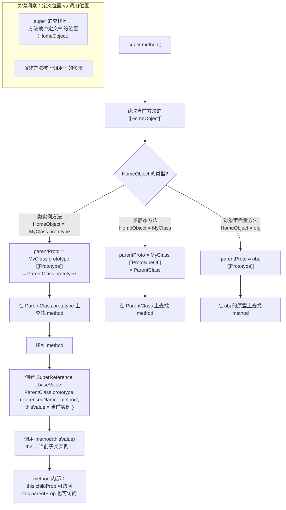

# 类与继承

> ES6 引入了 `class` 关键字，作为 JavaScript 原型继承的语法糖，提供了更清晰、更面向对象的语法。

## 概述

### 核心概念

- **类（Class）**：对象的模板，定义了对象的属性和方法
- **构造函数（Constructor）**：类的初始化方法，用于创建对象实例
- **继承（Inheritance）**：子类继承父类的属性和方法，实现代码复用
- **原型链（Prototype Chain）**：JavaScript 实现继承的底层机制
- **静态成员（Static Members）**：属于类本身的属性和方法，不被实例继承
- **私有字段（Private Fields）**：ES2022 引入，只能在类内部访问的字段

### 类的原型链结构图

```
┌─────────────────────────────────────────────────────────┐
│                    类的原型链结构                          │
├─────────────────────────────────────────────────────────┤
│                                                         │
│  Dog（类/构造函数）                                       │
│   │                                                     │
│   │ prototype                                           │
│   ▼                                                     │
│  Dog.prototype ────────────┐                            │
│   │                        │                            │
│   │ constructor            │ __proto__                  │
│   │ = Dog                  ▼                            │
│   │                  Animal.prototype                   │
│   │                        │                            │
│   │                        │ __proto__                  │
│   │                        ▼                            │
│   │                   Object.prototype                  │
│   │                        │                            │
│   │                        │ __proto__                  │
│   │                        ▼                            │
│   │                         null                        │
│   │                                                     │
│   ▼                                                     │
│  dog 实例                                                │
│   │                                                     │
│   │ __proto__ = Dog.prototype                           │
│                                                         │
└─────────────────────────────────────────────────────────┘
```

### 继承关系示意

```
┌──────────────────────────────────────────────────────┐
│              Animal (父类)                            │
│  ┌────────────────────────────────────────────────┐  │
│  │ 属性：name                                      │  │
│  │ 方法：speak(), move()                           │  │
│  └────────────────────────────────────────────────┘  │
│         ▲                ▲                ▲          │
│         │                │                │          │
│    ┌────┴────┐      ┌────┴────┐      ┌────┴────┐    │
│    │   Dog   │      │   Cat   │      │  Bird   │    │
│    ├─────────┤      ├─────────┤      ├─────────┤    │
│    │breed    │      │color    │      │canFly   │    │
│    │bark()   │      │meow()   │      │fly()    │    │
│    │fetch()  │      │climb()  │      │         │    │
│    └─────────┘      └─────────┘      └─────────┘    │
└──────────────────────────────────────────────────────┘
```

---

## 一、类的基本语法

### 声明类

```javascript
class Person {
  constructor(name, age) {
    this.name = name
    this.age = age
  }

  // 实例方法
  sayHello() {
    console.log(`Hello, I'm ${this.name}`)
  }

  // Getter
  get info() {
    return `${this.name}, ${this.age} years old`
  }

  // Setter
  set setAge(age) {
    this.age = age
  }
}

const person = new Person("Alice", 25)
person.sayHello() // "Hello, I'm Alice"
console.log(person.info) // "Alice, 25 years old"
person.setAge = 26
console.log(person.age) // 26
```

### 类表达式

```javascript
// 命名类表达式
const Person = class PersonClass {
  sayHello() {
    console.log("Hello")
  }
}

// 匿名类表达式
const Animal = class {
  speak() {
    console.log("Sound")
  }
}
```

### 静态方法

```javascript
class MathUtils {
  static PI = 3.14159

  static square(x) {
    return x * x
  }

  static cube(x) {
    return x * x * x
  }
}

console.log(MathUtils.PI) // 3.14159
console.log(MathUtils.square(3)) // 9
console.log(MathUtils.cube(3)) // 27

// 静态方法不会被实例继承
const math = new MathUtils()
math.square(3) // TypeError: math.square is not a function
```

### 静态代码块

ES2022 引入静态代码块，用于类初始化：

```javascript
class Config {
  static settings = {}

  static {
    // 类加载时执行
    this.settings.apiKey = "default-key"
    this.settings.timeout = 5000
    console.log("Config initialized")
  }
}

console.log(Config.settings) // { apiKey: 'default-key', timeout: 5000 }
```

### 类字段初始化（ES2022）

ES2022 引入了类字段的公共和私有字段声明：

```javascript
class Person {
  // 公共字段（实例属性）
  name = "Unknown"
  age = 0

  // 私有字段
  #id = Math.random()

  // 静态公共字段
  static species = "Human"

  // 静态私有字段
  static #count = 0

  constructor(name, age) {
    this.name = name
    this.age = age
    Person.#count++
  }

  static getCount() {
    return Person.#count
  }
}

const p1 = new Person("Alice", 25)
const p2 = new Person("Bob", 30)

console.log(p1.name) // 'Alice'
console.log(p1.age) // 25
console.log(Person.species) // 'Human'
console.log(Person.getCount()) // 2
```

**字段初始化时机：**

```
┌────────────────────────────────────────────────┐
│          字段初始化执行顺序                      │
├────────────────────────────────────────────────┤
│                                                │
│  1. 创建新对象                                  │
│     ↓                                          │
│  2. 初始化父类字段（如果有继承）                  │
│     ↓                                          │
│  3. 初始化当前类的字段                          │
│     ↓                                          │
│  4. 执行 constructor 构造函数                   │
│                                                │
└────────────────────────────────────────────────┘
```

### 计算属性名

类支持使用表达式作为属性名和方法名：

```javascript
const methodName = "sayHello"
const fieldName = "age"

class Person {
  // 计算属性名
  [fieldName] = 25;

  // 计算方法名
  [methodName]() {
    return "Hello!"
  }

  // 使用 Symbol 作为方法名
  [Symbol.iterator]() {
    let index = 0
    const data = [this[fieldName]]
    return {
      next: () => ({
        value: data[index++],
        done: index > data.length
      })
    }
  }
}

const person = new Person()
console.log(person.age) // 25
console.log(person.sayHello()) // 'Hello!'
console.log([...person]) // [25]
```

### 类 API 速查表

#### 实例成员

| 类型     | 语法                 | 说明                         | 示例               |
| -------- | -------------------- | ---------------------------- | ------------------ |
| 公共字段 | `fieldName = value`  | 实例属性，所有实例共享初始值 | `name = 'Unknown'` |
| 私有字段 | `#fieldName = value` | 只能在类内部访问             | `#balance = 0`     |
| 方法     | `methodName() {}`    | 实例方法，定义在原型上       | `sayHello() {}`    |
| 私有方法 | `#methodName() {}`   | 只能在类内部调用             | `#validate() {}`   |
| Getter   | `get name() {}`      | 属性访问器                   | `get info() {}`    |
| Setter   | `set name(v) {}`     | 属性设置器                   | `set age(v) {}`    |

#### 静态成员

| 类型         | 语法                        | 说明               | 示例                    |
| ------------ | --------------------------- | ------------------ | ----------------------- |
| 静态字段     | `static fieldName = value`  | 类本身的属性       | `static PI = 3.14`      |
| 静态私有字段 | `static #fieldName = value` | 类的私有属性       | `static #count = 0`     |
| 静态方法     | `static methodName() {}`    | 类方法，通过类调用 | `static create() {}`    |
| 静态代码块   | `static {}`                 | 类初始化时执行     | `static { /* init */ }` |

---

## 二、类的继承

### extends 关键字

```javascript
class Animal {
  constructor(name) {
    this.name = name
  }

  speak() {
    console.log(`${this.name} makes a sound`)
  }
}

class Dog extends Animal {
  constructor(name, breed) {
    super(name) // 调用父类构造函数
    this.breed = breed
  }

  speak() {
    console.log(`${this.name} barks`)
  }

  fetch() {
    console.log(`${this.name} fetches the ball`)
  }
}

const dog = new Dog("Buddy", "Golden Retriever")
dog.speak() // "Buddy barks"
dog.fetch() // "Buddy fetches the ball"
```

### super 关键字

```javascript
class Parent {
  constructor(value) {
    this.value = value
  }

  method() {
    console.log("Parent method")
  }
}

class Child extends Parent {
  constructor(value, extra) {
    super(value) // 调用父类构造函数
    this.extra = extra
  }

  method() {
    super.method() // 调用父类方法
    console.log("Child method")
  }
}

const child = new Child(1, 2)
child.method()
// "Parent method"
// "Child method"
```

### 方法重写

```javascript
class Shape {
  constructor(color) {
    this.color = color
  }

  getArea() {
    return 0
  }

  describe() {
    return `A ${this.color} shape with area ${this.getArea()}`
  }
}

class Rectangle extends Shape {
  constructor(color, width, height) {
    super(color)
    this.width = width
    this.height = height
  }

  getArea() {
    return this.width * this.height
  }
}

class Circle extends Shape {
  constructor(color, radius) {
    super(color)
    this.radius = radius
  }

  getArea() {
    return Math.round(Math.PI * this.radius ** 2 * 100) / 100
  }
}

const rect = new Rectangle("red", 4, 5)
const circle = new Circle("blue", 3)

console.log(rect.describe()) // "A red shape with area 20"
console.log(circle.describe()) // "A blue shape with area 28.27..."
```

### 继承内置类

ES6 允许继承 JavaScript 的内置类（如 Array、Error、Map 等）：

```javascript
// 继承 Array
class PowerArray extends Array {
  isEmpty() {
    return this.length === 0
  }

  first() {
    return this[0]
  }

  last() {
    return this[this.length - 1]
  }
}

const nums = new PowerArray(1, 2, 3)
console.log(nums.isEmpty()) // false
console.log(nums.first()) // 1
console.log(nums.last()) // 3

// 继承 Map
class ExtendedMap extends Map {
  getOrDefault(key, defaultValue) {
    return this.has(key) ? this.get(key) : defaultValue
  }
}

const map = new ExtendedMap([
  ["a", 1],
  ["b", 2],
  ["c", 3]
])
console.log(map.getOrDefault("d", 0)) // 0
```

### 多重继承与 Mixin 模式

JavaScript 不支持多重继承，但可以通过 Mixin 模式实现功能复用：

```javascript
// Mixin 定义（注意：对象字面量中不能使用 static 关键字）
const Serializable = {
  serialize() {
    return JSON.stringify(this);
  }
};

const Loggable = {
  log() {
    console.log(`[User] ${this.toString()}`);
  }
};

class User {
  constructor(name, email) {
    this.name = name;
    this.email = email;
  }

  equals(other) {
    return this.name === other.name && this.email === other.email;
  }

  toString() {
    return `User(${this.name}, ${this.email})`;
  }
}

// 应用 Mixin（后应用的会覆盖先应用的同名方法）
Object.assign(User.prototype, Serializable, Loggable);

const user1 = new User('Alice', 'alice@example.com');
const user2 = new User('Alice', 'alice@example.com');

user1.log();                          // "[User] User(Alice, alice@example.com)"
console.log(user1.equals(user2));    // true
console.log(user1.serialize());       // '{"name":"Alice","email":"alice@example.com"}'
```

**Mixin 最佳实践：**

```
┌────────────────────────────────────────────────┐
│            Mixin 使用原则                        │
├────────────────────────────────────────────────┤
│                                                │
│  1. 单一职责：每个 Mixin 只提供一类功能            │
│     ✓ Serializable - 序列化相关                 │
│     ✓ Loggable - 日志相关                       │
│                                                │
│  2. 无状态：Mixin 不应维护实例状态                 │
│     ✗ 避免在 Mixin 中定义数据属性                │
│     ✓ 只定义方法                                │
│                                                │
│  3. 命名约定：Mixin 名称以 -able 或 -ing 结尾     │
│     ✓ Comparable, Serializable                 │
│                                                │
│  4. 避免冲突：注意 Mixin 方法名冲突                │
│     后应用的 Mixin 会覆盖前面的同名方法            │
│                                                │
└────────────────────────────────────────────────┘
```

---

## 三、私有属性和方法

ES2022 引入了私有字段，使用 `#` 前缀：

```javascript
class BankAccount {
  // 私有字段
  #balance = 0
  #pin

  constructor(initialBalance, pin) {
    this.#balance = initialBalance
    this.#pin = pin
  }

  // 私有方法
  #validatePin(pin) {
    return pin === this.#pin
  }

  get balance() {
    return this.#balance
  }

  deposit(amount, pin) {
    if (!this.#validatePin(pin)) return "Invalid PIN"
    this.#balance += amount
    return `Deposited ${amount}, balance: ${this.#balance}`
  }

  withdraw(amount, pin) {
    if (!this.#validatePin(pin)) return "Invalid PIN"
    this.#balance -= amount
    return `Withdrew ${amount}, balance: ${this.#balance}`
  }
}

const account = new BankAccount(1500, "1234")
account.withdraw(200, "1234") // "Withdrew 200, balance: 1300"
account.withdraw(200, "wrong") // "Invalid PIN"

// 无法从外部访问私有字段
console.log(account.balance) // 1300（通过 getter）
console.log(account.#balance) // SyntaxError: Private field
```

### 私有静态字段

```javascript
class Counter {
  static #count = 0

  static increment() {
    this.#count++
    console.log(`Count: ${this.#count}`)
  }

  static getCount() {
    return this.#count
  }
}

Counter.increment() // Count: 1
Counter.increment() // Count: 2
console.log(Counter.getCount()) // 2
console.log(Counter.#count) // SyntaxError
```

### 私有字段的特点

```javascript
class Example {
  #privateField = "secret"
  publicField = "public"

  getPrivate() {
    return this.#privateField
  }
}

const ex = new Example()

// 特点 1: 完全私有
console.log(ex.getPrivate()) // 'secret'
console.log(ex.#privateField) // SyntaxError（类外部不可访问）

// 特点 2: 私有字段不会被 for...in / Object.keys 枚举
console.log(Object.keys(ex)) // ['publicField']

// 特点 3: 子类不能直接访问父类的私有字段
class Parent {
  #secret = "parent secret"

  getSecret() {
    return this.#secret
  }
}

class Child extends Parent {
  showSecret() {
    return this.getSecret() // ✓ 通过公共方法访问
  }
}

const child = new Child()
console.log(child.showSecret()) // 'parent secret'
```

**私有字段检查：**

```javascript
class Example {
  #private = "secret"

  static hasPrivate(obj) {
    // 使用 try-catch 检测私有字段
    try {
      obj.#private
      return true
    } catch {
      return false
    }
  }
}

const ex = new Example()
console.log(Example.hasPrivate(ex)) // true
console.log(Example.hasPrivate({})) // false

// 使用 in 操作符检查（ES2022+）
console.log(#private in ex) // true
```

---

## 四、类的本质

类是构造函数的语法糖：

```javascript
class Person {
  constructor(name) {
    this.name = name
  }

  sayHello() {
    console.log(`Hello, I'm ${this.name}`)
  }
}

// 等价于
function Person(name) {
  this.name = name
}

Person.prototype.sayHello = function () {
  console.log(`Hello, I'm ${this.name}`)
}
```

### 查看原型链

```javascript
class Animal {}

class Dog extends Animal {}

console.log(typeof Dog) // 'function'
console.log(Dog.prototype.constructor === Dog) // true
console.log(Object.getPrototypeOf(Dog) === Animal) // true
console.log(Dog.prototype.__proto__ === Animal.prototype) // true
```

### 类与构造函数的对比

```javascript
// ES5 构造函数
function PersonES5(name, age) {
  this.name = name
  this.age = age
}

// 方法需要手动添加到原型
PersonES5.prototype.sayHello = function () {
  console.log(`Hello, I'm ${this.name}`)
}

// 静态方法
PersonES5.create = function (name, age) {
  return new PersonES5(name, age)
}

// ES6 类
class PersonES6 {
  constructor(name, age) {
    this.name = name
    this.age = age
  }

  static create(name, age) {
    return new PersonES6(name, age)
  }
}

class StudentES6 extends PersonES6 {
  constructor(name, age, grade) {
    super(name, age)
    this.grade = grade
  }
}
```

**转换关系图：**

```
┌────────────────────────────────────────────────┐
│       ES6 类 ⇄ ES5 构造函数 对应关系             │
├────────────────────────────────────────────────┤
│                                                │
│  class Person {                                │
│    constructor() { }  ────→  构造函数本身        │
│                                                │
│    method() { }       ────→  Person.prototype  │
│                                                │
│    static method() { } ───→  Person.method     │
│                                                │
│    get prop() { }     ────→  Object.define-    │
│    set prop(v) { }              Property()     │
│                                                │
│    #private           ────→  WeakMap 实现      │
│                                                │
│  }                                             │
│                                                │
│  class Child extends Parent {                  │
│    super()            ────→  Parent.call()     │
│  }                                             │
│                                                │
│  Child extends Parent ───→  Object.setProto-   │
│                               typeOf(Child,    │
│                                       Parent)  │
│                                                │
└────────────────────────────────────────────────┘
```

---

## 五、new.target

`new.target` 用于检测是否被 new 调用：

```javascript
class Person {
  constructor(name) {
    if (new.target === Person) {
      this.name = name
    } else {
      throw new Error("Must be called with new")
    }
  }
}

const p1 = new Person("Alice") // OK
const p2 = Person("Bob") // Error

// 应用：禁止直接实例化"抽象类"
class Shape {
  constructor(radius) {
    if (new.target === Shape) {
      throw new Error("Shape cannot be instantiated")
    }
    this.radius = radius
  }
}

class Circle extends Shape {}

const circle = new Circle(5) // OK
const shape = new Shape() // Error
```

---

## 六、实际应用示例

### 1. 创建链式调用

```javascript
class Calculator {
  constructor(value = 0) {
    this.value = value
  }

  add(n) {
    this.value += n
    return this
  }

  subtract(n) {
    this.value -= n
    return this
  }

  multiply(n) {
    this.value *= n
    return this
  }

  divide(n) {
    this.value /= n
    return this
  }

  getResult() {
    return this.value
  }
}

const result = new Calculator(10).add(5).multiply(2).subtract(10).divide(2).getResult()

console.log(result) // 10
```

### 2. 实现单例模式

```javascript
class Singleton {
  static #instance

  constructor() {
    if (Singleton.#instance) {
      return Singleton.#instance
    }
    Singleton.#instance = this
  }

  static getInstance() {
    if (!Singleton.#instance) {
      Singleton.#instance = new Singleton()
    }
    return Singleton.#instance
  }
}

const a = new Singleton()
const b = new Singleton()
console.log(a === b) // true
```

### 3. 发布订阅模式

```javascript
class EventEmitter {
  #events = {}

  on(event, callback) {
    if (!this.#events[event]) {
      this.#events[event] = []
    }
    this.#events[event].push(callback)
    return this
  }

  off(event, callback) {
    if (!this.#events[event]) return this
    this.#events[event] = this.#events[event].filter((cb) => cb !== callback)
    return this
  }

  emit(event, data) {
    if (!this.#events[event]) return this
    this.#events[event].forEach((callback) => callback(data))
    return this
  }
}

const emitter = new EventEmitter()

emitter.on("message", (msg) => console.log(`Received: ${msg}`))
emitter.emit("message", "Hello") // "Received: Hello"
```

### 4. React 组件类

```javascript
class Counter extends React.Component {
  constructor(props) {
    super(props)
    this.state = { count: 0 }
  }

  increment = () => {
    this.setState((prev) => ({ count: prev.count + 1 }))
  }

  render() {
    return (
      <div>
        <p>Count: {this.state.count}</p>
        <button onClick={this.increment}>+</button>
      </div>
    )
  }
}
```

### 5. 构建器模式（Builder Pattern）

```javascript
class QueryBuilder {
  #table = ""
  #fields = []
  #conditions = []
  #orderBy = ""
  #limit = null

  select(...fields) {
    this.#fields = fields
    return this
  }

  from(table) {
    this.#table = table
    return this
  }

  where(condition) {
    this.#conditions.push(condition)
    return this
  }

  orderBy(field) {
    this.#orderBy = field
    return this
  }

  limit(n) {
    this.#limit = n
    return this
  }

  build() {
    let query = `SELECT ${this.#fields.join(", ")} FROM ${this.#table}`
    if (this.#conditions.length) {
      query += ` WHERE ${this.#conditions.join(" AND ")}`
    }
    if (this.#orderBy) {
      query += ` ORDER BY ${this.#orderBy}`
    }
    if (this.#limit !== null) {
      query += ` LIMIT ${this.#limit}`
    }
    return query
  }
}

const query = new QueryBuilder()
  .select("id", "name", "email")
  .from("users")
  .where("age > 18")
  .where('status = "active"')
  .orderBy("created_at")
  .limit(10)
  .build()

console.log(query)
// SELECT id, name, email FROM users WHERE age > 18 AND status = "active" ORDER BY created_at LIMIT 10
```

### 6. 工厂模式（Factory Pattern）

```javascript
// 抽象产品类
class Vehicle {
  constructor(type) {
    this.type = type
  }

  start() {
    throw new Error("start() must be implemented")
  }
}

// 具体产品类
class Car extends Vehicle {
  start() {
    return "Car engine started: Vroom!"
  }
}

class Motorcycle extends Vehicle {
  start() {
    return "Motorcycle engine started: Vroom vroom!"
  }
}

class Truck extends Vehicle {
  start() {
    return "Truck engine started: Rumble rumble!"
  }
}

// 工厂类
class VehicleFactory {
  static create(type) {
    switch (type) {
      case "car":
        return new Car()
      case "motorcycle":
        return new Motorcycle()
      case "truck":
        return new Truck()
      default:
        throw new Error(`Unknown vehicle type: ${type}`)
    }
  }
}

const car = VehicleFactory.create("car")
const motorcycle = VehicleFactory.create("motorcycle")
const truck = VehicleFactory.create("truck")

console.log(car.start()) // Car engine started: Vroom!
console.log(motorcycle.start()) // Motorcycle engine started: Vroom vroom!
console.log(truck.start()) // Truck engine started: Rumble rumble!
```

### 7. 观察者模式

```javascript
class Subject {
  #observers = new Set()

  subscribe(observer) {
    this.#observers.add(observer)
    return () => this.#observers.delete(observer)
  }

  notify(data) {
    this.#observers.forEach((observer) => observer(data))
  }

  unsubscribe(observer) {
    this.#observers.delete(observer)
  }
}

// 使用
const subject = new Subject()
const unsub = subject.subscribe((data) => console.log("Observed:", data))
subject.notify("hello") // Observed: hello
unsub()

// 简易状态 Store
class Store {
  #state = {}
  #listeners = new Set()

  setState(partial) {
    this.#state = { ...this.#state, ...partial }
    this.#listeners.forEach((listener) => listener(this.#state))
  }

  subscribe(listener) {
    this.#listeners.add(listener)
    return () => this.#listeners.delete(listener)
  }
}

const store = new Store()
const unsubscribe = store.subscribe((state) =>
  console.log("State changed:", state)
)

store.setState({ user: 'Alice' })
// State changed: { user: 'Alice' }

store.setState({ age: 25 })
// State changed: { user: 'Alice', age: 25 }

unsubscribe()
```

### 8. 资源管理类（ES2025）

ES2025 的显式资源管理（Explicit Resource Management）通过 `Symbol.dispose` 和 `Symbol.asyncDispose` 让类可以配合 `using` / `await using` 声明实现自动资源释放：

```javascript
class DatabaseConnection {
  #connected = false

  constructor(url) {
    this.url = url
    this.#connect()
  }

  #connect() {
    console.log(`连接数据库: ${this.url}`)
    this.#connected = true
  }

  query(sql) {
    if (!this.#connected) throw new Error("Not connected")
    return `Result of ${sql}`
  }

  [Symbol.dispose]() {
    if (this.#connected) {
      console.log(`断开连接: ${this.url}`)
      this.#connected = false
    }
  }
}

// using 声明：离开作用域时自动调用 [Symbol.dispose]()
function queryData() {
  using conn = new DatabaseConnection("postgres://localhost")
  return conn.query("SELECT 1")
}

// 异步资源
class AsyncFileReader {
  async open() {
    console.log("文件已打开")
  }

  async read() {
    return "file content"
  }

  async close() {
    console.log("文件已关闭")
  }

  [Symbol.asyncDispose]() {
    return this.close()
  }
}

async function readFile() {
  await using reader = new AsyncFileReader("data.json")
  await reader.open()
  const content = await reader.read()
  return content
} // 离开作用域时自动调用 [Symbol.asyncDispose]()
```

---

## 七、类 vs 构造函数

| 特性     | 构造函数       | 类                     |
| -------- | -------------- | ---------------------- |
| 提升     | 有             | 无（必须先定义后使用） |
| 严格模式 | 可选           | 默认严格模式           |
| 静态方法 | 手动添加       | static 关键字          |
| 继承     | 手动设置原型链 | extends 关键字         |
| 私有字段 | 使用闭包或约定 | # 前缀                 |

---

## 八、注意事项

### 1. 类不会提升

```javascript
// ❌ 错误
const p = new Person() // ReferenceError

class Person {}
```

### 2. 必须使用 new 调用

```javascript
class Person {}

// ❌ 错误
Person() // TypeError: Class constructor Person cannot be invoked without 'new'

// ✅ 正确
new Person()
```

### 3. 子类必须调用 super

```javascript
class Parent {
  constructor(value) {
    this.value = value
  }
}

class Child extends Parent {
  constructor(value) {
    // ❌ 错误：必须先调用 super()
    this.extra = value
    super(value)
  }

  // ✅ 正确
  // constructor(value) {
  //   super(value);
  //   this.extra = value;
  // }
}
```

---

## 九、常见问题（FAQ）

### Q1: 类表达式和类声明有什么区别？

```javascript
// 类声明 - 不会提升
class Person1 {}

// 类表达式 - 不会提升
const Person2 = class {}

// 命名类表达式 - 内部名称只在类内部可用
const Person3 = class PersonClass {
  static whoAmI() {
    return PersonClass.name // 'PersonClass'
  }
}

console.log(Person3.whoAmI()) // 'PersonClass'
console.log(typeof PersonClass) // 'undefined' (外部不可见)
```

### Q2: 箭头函数作为类方法有什么特点？

```javascript
class Button {
  constructor(label) {
    this.label = label
  }

  // 普通方法 - 定义在原型上，this 动态绑定
  handleClick() {
    console.log(this.label)
  }

  // 箭头函数 - 定义在实例上，this 永久绑定
  handlePress = () => {
    console.log(this.label)
  }
}

const btn = new Button("Click Me")

const { handleClick, handlePress } = btn

handleClick() // undefined (this 丢失)
handlePress() // 'Click Me' (this 正确绑定)

// 箭头函数方法占用更多内存（每个实例一份）
console.log(Object.keys(btn)) // ['label', 'handlePress']
```

### Q3: 如何实现类的深拷贝？

```javascript
class Person {
  constructor(name, age) {
    this.name = name
    this.age = age
  }

  clone() {
    return new this.constructor(this.name, this.age)
  }
}

class Employee extends Person {
  constructor(name, age, position) {
    super(name, age)
    this.position = position
  }

  clone() {
    return new this.constructor(this.name, this.age, this.position)
  }
}

const emp1 = new Employee("Alice", 30, "Developer")
const emp2 = emp1.clone()

console.log(emp2) // Employee { name: 'Alice', age: 30, position: 'Developer' }
console.log(emp1 === emp2) // false
```

### Q4: 如何防止类被实例化？

```javascript
// 方法 1: 使用 new.target
class AbstractClass {
  constructor() {
    if (new.target === AbstractClass) {
      throw new Error("AbstractClass cannot be instantiated")
    }
  }
}

// 方法 2: 抽象方法约定（配合 new.target）
class BaseComponent {
  constructor() {
    if (new.target === BaseComponent) {
      throw new Error("BaseComponent is abstract")
    }
  }

  method() {
    throw new Error("method() must be implemented")
  }
}

class ConcreteComponent extends BaseComponent {
  method() {
    return "implemented"
  }
}

console.log(new ConcreteComponent().method()) // 'implemented'
new BaseComponent() // Error: BaseComponent is abstract
```

### Q5: 如何实现类的多重继承效果？

```javascript
// 使用 Mixin 组合
const CanFly = (Base) =>
  class extends Base {
    fly() {
      console.log("Flying...")
    }
  }

const CanSwim = (Base) =>
  class extends Base {
    swim() {
      console.log("Swimming...")
    }
  }

const CanWalk = (Base) =>
  class extends Base {
    walk() {
      console.log("Walking...")
    }
  }

class Animal {}

class Duck extends CanFly(CanSwim(CanWalk(Animal))) {}

const duck = new Duck()
duck.walk() // Walking...
duck.swim() // Swimming...
duck.fly() // Flying...
```

---

## 十、性能考虑

### 1. 方法定义位置的影响

```javascript
// ❌ 不推荐：箭头函数方法在构造函数中创建（每个实例一份）
class Bad {
  constructor() {
    this.method = () => {
      // 每个实例都会创建新的函数对象
    }
  }
}

// ✅ 推荐：普通方法定义在原型上（所有实例共享）
class Good {
  method() {
    // 所有实例共享同一个函数
  }
}

// 性能对比
const createBad = () => new Bad()
const createGood = () => new Good()

console.time("Bad")
for (let i = 0; i < 100000; i++) createBad()
console.timeEnd("Bad") // 箭头字段版本更慢（每个实例都创建函数对象）

console.time("Good")
for (let i = 0; i < 100000; i++) createGood()
console.timeEnd("Good") // 原型方法版本更快（耗时为示意量级，实际因引擎而异）
```

### 2. 私有字段的性能

```javascript
// 私有字段使用 WeakMap 实现，性能略低于普通字段
class WithPrivate {
  #secret = "data"
}

class WithPublic {
  secret = "data"
}

// 普通字段访问更快
// 但私有字段提供了真正的封装性，性能差异通常可以忽略
```

### 3. 继承层级的影响

```javascript
// 继承层级过深会影响性能
class A {
  method() {}
}
class B extends A {
  method() {
    super.method()
  }
}
class C extends B {
  method() {
    super.method()
  }
}
class D extends C {
  method() {
    super.method()
  }
}
class E extends D {
  method() {
    super.method()
  }
}

// 保持继承层级在 2-3 层以内最佳
// 超过 3 层应考虑重构
```

---

## 十一、最佳实践

### 1. 类设计原则

```javascript
// ✅ 单一职责：一个类只做一件事
class User {
  constructor(name, email) {
    this.name = name
    this.email = email
  }
}

class UserRepository {
  save(user) {
    /* ... */
  }
}

// ✅ 面向抽象编程
class PaymentProcessor {
  process(amount) {
    throw new Error("process() must be implemented")
  }
}

class StripeProcessor extends PaymentProcessor {
  process(amount) {
    // Stripe 实现
  }
}

class PayPalProcessor extends PaymentProcessor {
  process(amount) {
    // PayPal 实现
  }
}
```

### 2. 命名约定

```javascript
// ✅ 类名：PascalCase
class ShoppingCart {}
class UserController {}

// ✅ 方法名：camelCase
class Example {
  calculateTotal() {}
  getUserInfo() {}
}

// ✅ 私有字段：#camelCase
class Example {
  #age = 0

  setAge(value) {
    this.#age = value
  }

  get isAdult() {
    return this.#age >= 18
  }
}
```

### 3. 错误处理

```javascript
// ✅ 在构造函数中验证参数
class User {
  constructor(name, email) {
    if (!name || typeof name !== "string") {
      throw new TypeError("name must be a non-empty string")
    }
    if (!email || !email.includes("@")) {
      throw new TypeError("email must be a valid email address")
    }

    this.name = name
    this.email = email
  }
}

// ✅ 使用自定义错误类
class ValidationError extends Error {
  constructor(message, field) {
    super(message)
    this.name = "ValidationError"
    this.field = field
  }
}
```

### 4. 文档注释

```javascript
/**
 * 表示银行账户的类
 * @class BankAccount
 * @example
 * const account = new BankAccount(1000, '1234');
 * account.deposit(500);
 * console.log(account.balance); // 1500
 */
class BankAccount {
  /**
   * 初始余额
   * @type {number}
   */
  #balance = 0

  constructor(initialBalance = 0) {
    this.#balance = initialBalance
  }

  /**
   * 存入金额
   * @param {number} amount
   * @returns {number} 存入后的余额
   */
  deposit(amount) {
    if (amount < 0) {
      throw new Error("Amount cannot be negative")
    }
    this.#balance += amount
    return this.#balance
  }
}
```

---

### super 的规范语义（核心原理深度）

> **规范层级**：ECMAScript 规范 · [[HomeObject]] / SuperReference / MakeSuperPropertyReference
> **原理来源**：JavaScript 核心原理解析 · 第 14 讲

#### 规范语义

`super` 不是简单的"父类引用"——它是基于 `[[HomeObject]]` 的**相对查找机制**。规范定义了两种 `super` 的使用方式：

1. **`super()`（SuperCall）**：调用父类构造函数。在类构造器中，`super` 通过**调用栈**查找当前函数的父类构造器，而非通过 `[[HomeObject]]`
2. **`super.xxx`（SuperProperty）**：访问父类原型上的属性。通过 `[[HomeObject]].[[Prototype]]` 定位父类原型，创建一个 **SuperReference**，并绑定 `thisValue`

核心规范操作 `MakeSuperPropertyReference(propertyKey, thisValue, strict)` 的行为：

```
1. 获取当前方法的 [[HomeObject]]
2. parentProto = [[HomeObject]].[[Prototype]]
3. 创建 SuperReference = { baseValue: parentProto, referencedName: propertyKey, thisValue }
4. 当 super.xxx() 被调用时，xxx 方法中的 this = thisValue（当前实例）
```

这揭示了 `super.xxx()` 的一个关键特性：**方法在父类原型上查找，但 `this` 仍然是当前子类的实例**。这就是所谓的"super.xxx() 悖论"——方法从父类的视角执行，但使用子类的状态。

#### 执行机制



#### 核心洞察

**1. super 的查找基于"定义位置"，而非"调用位置"**

`[[HomeObject]]` 在方法定义时就被固定，永不改变。这意味着无论方法通过何种路径被调用，`super` 总是查找定义该方法时所在的原型：

```javascript
class Parent {
  method() { return 'Parent method' }
}

class Child extends Parent {
  method() {
    return super.method() + ' + Child method'
    // super 的 HomeObject = Child.prototype
    // super.method() 在 Child.prototype.[[Prototype]] = Parent.prototype 上查找
  }
}

const child = new Child()
child.method()  // 'Parent method + Child method'

// 即使将方法提取出来调用，super 仍然有效
const extractedMethod = child.method
extractedMethod()  // 'Parent method + Child method' — HomeObject 不变！
```

**2. `super.xxx()` 中 `this` 是当前实例，不是父类实例**

这是"开放递归（Open recursion）"模式：父类方法通过 `this` 调用的方法，会在子类的实例上查找，可能触发子类的重写版本：

```javascript
class Base {
  algorithm() {
    return this.step1() + this.step2()  // this 是子类实例
  }
  step1() { return 1 }
  step2() { return 2 }
}

class Extended extends Base {
  step1() { return 10 }  // 重写 step1
  algorithm() {
    return super.algorithm()  // 调用父类的 algorithm
    // 但 algorithm 中的 this.step1() 调用的是子类的 step1！
    // 结果：10 + 2 = 12，而非 1 + 2 = 3
  }
}

const ext = new Extended()
ext.algorithm()  // 12 — 父类方法 + 子类状态 = 开放递归
```

**3. `super.method()` vs `Parent.prototype.method.call(this)`**

两者行为类似但有本质区别：

```javascript
// 方式一：super.method()
class Child extends Parent {
  method() {
    super.method()
    // HomeObject = Child.prototype
    // 查找：Child.prototype.[[Prototype]] = Parent.prototype
    // this = 当前实例
  }
}

// 方式二：Parent.prototype.method.call(this)
class Child extends Parent {
  method() {
    Parent.prototype.method.call(this)
    // 直接硬编码了 Parent.prototype
    // 如果继承层级改变，需要手动修改
  }
}
```

`super` 的优势在于它是**相对查找**——不硬编码父类名称，在继承层级改变时自动适应。

**4. 在对象字面量中也能使用 super**

因为对象字面量中的方法声明同样会设置 `[[HomeObject]]`：

```javascript
const parent = {
  greet() { return 'Hello from parent' }
}

const child = {
  greet() { return super.greet() + ' and child' }
  // [[HomeObject]] = child
  // super = child.[[Prototype]]
}

Object.setPrototypeOf(child, parent)
child.greet()  // 'Hello from parent and child'
```

**5. 箭头函数中的 super 从外层作用域继承**

与 `this` 类似，箭头函数没有自己的 `[[HomeObject]]`，因此 `super` 从包含它的普通方法中继承：

```javascript
class Parent {
  method() { return 'Parent' }
}

class Child extends Parent {
  method() {
    const arrow = () => super.method()  // super 继承自 method()
    return arrow() + ' + Child'
  }
}

new Child().method()  // 'Parent + Child'
```

**6. 构造器中的 `super()` 有特殊处理**

构造器中的 `[[HomeObject]]` 是 `MyClass.prototype`（而非 `MyClass`），因此 `super.xxx` 查找的是 `MyClass.prototype.[[Prototype]]`（即 `ParentClass.prototype`）。但 `super()` 调用父类构造器需要的是 `ParentClass` 本身，这存在矛盾。规范通过**调用栈查找**来处理 `super()`：

```javascript
class MyClass extends Object {
  constructor() {
    // constructor 的 [[HomeObject]] = MyClass.prototype
    // super.xxx → MyClass.prototype.__proto__ → Object.prototype（查找原型属性）
    // super() → 从调用栈查找当前函数 MyClass → Object（查找构造器）
    // 二者机制不同！
    // super()       // SuperCall：通过调用栈查找
    super.toString()  // SuperProperty：通过 HomeObject 查找
  }
}
```

#### 代码实证

```javascript
// === 1. super 在类方法中的行为 ===

class Animal {
  constructor(name) {
    this.name = name
  }
  
  speak() {
    return `${this.name} makes a sound`
  }
  
  describe() {
    return `[Animal] ${this.speak()}`
  }
}

class Dog extends Animal {
  speak() {
    return `${this.name} barks`
  }

  describe() {
    return `[Dog] ${super.speak()}` // super.speak() 的 this 仍是 Dog 实例
  }
}

console.log(new Dog('Rex').describe()) // '[Dog] Rex barks'

// === 2. new.target 与 super ===
class BaseClass {
  constructor() {
    console.log('constructor:', new.target.name)
  }

  instanceMethod() {
    return 'instance'
  }
}

class DerivedClass extends BaseClass {
  constructor() {
    super()
    console.log('super.instanceMethod():', super.instanceMethod())
  }
}

new DerivedClass()
// constructor: new.target.name = DerivedClass
// super.instanceMethod(): 'instance'
```

#### 与实战的关联

1. **Mixin 模式中的 super**：使用类工厂函数（Mixin）时，`super` 的相对查找特性使得多个 Mixin 可以形成协作链——每个 Mixin 的 `super.method()` 都会调用前一个 Mixin 的方法，而非硬编码的父类

2. **React 类组件的继承**：React.Component 基类中的生命周期方法通过 `this` 调用，子类重写这些方法时，基类的 `this.setState()` 仍然能正确工作——这就是"开放递归"模式在框架中的实际应用

3. **深层继承的 super 遍历**：在三层以上的继承链中，`super` 的相对查找确保每一层都能正确地调用上一层的实现，而不需要显式引用中间类的名称

4. **对象字面量中的 super**：在构建基于对象的继承体系时（非 class），`super` 同样可用，只是需要先通过 `Object.setPrototypeOf` 设置原型

---

## 小结

### 核心语法速查

| 概念          | 语法                               | 说明                              |
| ------------- | ---------------------------------- | --------------------------------- |
| 类声明        | `class Name {}`                    | 定义类的基本方式                  |
| 类表达式      | `const Name = class {}`            | 匿名或命名类表达式                |
| 构造函数      | `constructor() {}`                 | 初始化实例属性                    |
| 实例方法      | `methodName() {}`                  | 定义在原型上的方法                |
| 实例字段      | `fieldName = value`                | ES2022+，实例属性                 |
| 静态方法      | `static methodName() {}`           | 类方法，通过类调用                |
| 静态字段      | `static fieldName = value`         | 类属性                            |
| 静态代码块    | `static {}`                        | 类初始化代码                      |
| Getter/Setter | `get name() {}` / `set name(v) {}` | 属性访问器                        |
| 继承          | `class Child extends Parent {}`    | 单继承                            |
| 调用父类      | `super()` / `super.method()`       | 调用父类构造函数或方法            |
| 私有字段      | `#privateField`                    | ES2022+，真正的私有字段           |
| 私有方法      | `#privateMethod() {}`              | ES2022+，私有方法                 |
| 资源释放      | `[Symbol.dispose]()`               | ES2025，配合 `using` 声明自动释放 |
| 异步资源释放  | `[Symbol.asyncDispose]()`          | ES2025，配合 `await using` 声明   |

### 关键特性对比

| 特性        | ES5 构造函数              | ES6 类                 |
| ----------- | ------------------------- | ---------------------- |
| 提升        | 有（变量提升）            | 无（必须先定义后使用） |
| 严格模式    | 可选                      | 默认严格模式           |
| 静态方法    | 手动添加到构造函数        | `static` 关键字        |
| 继承        | 手动设置原型链            | `extends` 关键字       |
| 私有字段    | 使用闭包或命名约定        | `#` 前缀（ES2022+）    |
| 调用方式    | 可作为普通函数调用        | 必须使用 `new`         |
| `this` 指向 | 可改变（call/apply/bind） | 方法内 this 默认指向实例，仍可被 call/apply 改变 |

### 设计模式实现

| 模式       | 关键技术                    | 适用场景           |
| ---------- | --------------------------- | ------------------ |
| 单例模式   | 私有静态字段 + 构造函数检查 | 全局唯一实例       |
| 工厂模式   | 静态工厂方法 + 类注册表     | 根据类型创建对象   |
| 观察者模式 | Set + subscribe/notify      | 事件监听、状态管理 |
| 构建器模式 | 链式调用 + 私有字段         | 复杂对象构建       |
| 发布订阅   | EventEmitter 类             | 模块间通信         |

### 常见陷阱与解决方案

| 问题             | 错误示例                                 | 正确做法                   |
| ---------------- | ---------------------------------------- | -------------------------- |
| 类不存在提升     | `new C(); class C {}`                    | 先定义后使用               |
| 忘记使用 new     | `Person()`                               | 使用 `new Person()`        |
| 子类未调用 super | `class C extends P { constructor() {} }` | 在构造函数中调用 `super()` |
| this 绑定丢失    | `const fn = obj.method; fn()`            | 使用箭头函数或 bind        |
| 私有字段未声明   | 使用 `#field` 但未声明                   | 在类顶部声明所有私有字段   |

---

## 参考资源

### ECMA 规范

- [ECMAScript 2015 (ES6) - Classes](https://www.ecma-international.org/ecma-262/6.0/#sec-class-definitions)
- [ECMAScript 2022 - Private Fields](https://github.com/tc39/proposal-private-fields)
- [ECMAScript 2022 - Static Class Features](https://github.com/tc39/proposal-static-class-features)

### 兼容性

| 特性         | Chrome | Firefox | Safari | Edge | Node.js |
| ------------ | ------ | ------- | ------ | ---- | ------- |
| 类基础语法   | 49+    | 45+     | 9+     | 13+  | 6.0+    |
| 私有字段 (#) | 74+    | 90+     | 14.1+  | 79+  | 12.0+   |
| 静态字段     | 74+    | 90+     | 14.1+  | 79+  | 12.0+   |
| 静态代码块   | 94+    | 93+     | 15.4+  | 94+  | 16.11+  |
| 私有方法     | 84+    | 90+     | 15.4+  | 84+  | 16.0+   |

> 💡 **提示**：ES6 类是原型继承的语法糖，让代码更清晰、更易维护，但理解原型链仍然很重要。在实际开发中，应遵循单一职责原则，保持类的简洁性，合理使用继承和组合模式。
