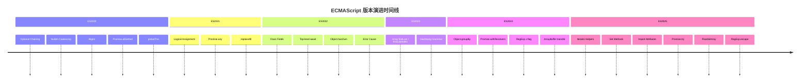
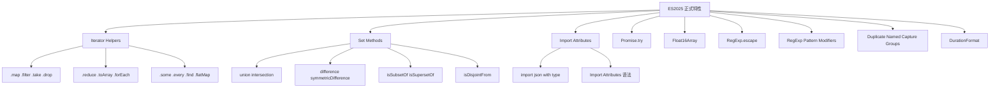
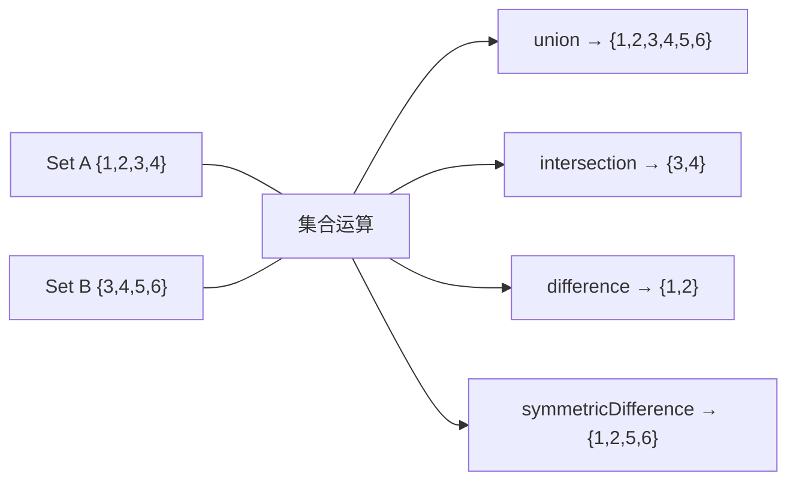
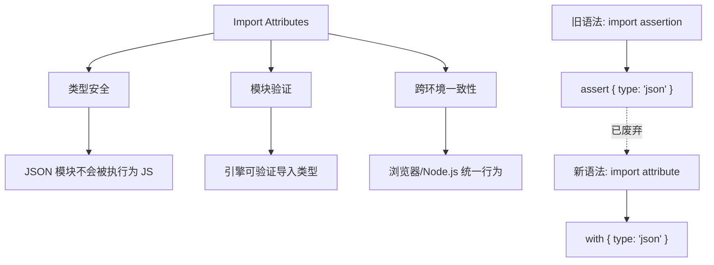

# ES2020-ES2025 新特性完全指南

> 本文档系统介绍 ES2020 至 ES2025 的核心新特性，帮助开发者掌握现代 JavaScript 的最新能力。ES2025 已于 2025 年 6 月 25 日由 Ecma International 正式批准为 ECMA-262 第 16 版标准。



---

## ES2020 新特性

### 1. Optional Chaining (`?.`)

可选链操作符允许安全地访问嵌套对象属性，无需显式检查每个层级。

```javascript
// ❌ 旧写法：冗长的空值检查
const nameOld = user && user.profile && user.profile.name

// ✅ ES2020：简洁的可选链
const name = user?.profile?.name

// 数组访问
const firstItem = arr?.[0]

// 函数调用
const result = obj.method?.()

// 结合默认值
const displayName = user?.profile?.name ?? "Anonymous"
```

### 2. Nullish Coalescing (`??`)

空值合并运算符在左侧为 `null` 或 `undefined` 时返回右侧值。

```javascript
// ❌ 旧写法：|| 会将 0、''、false 视为 falsy
const countOld = config.count || 10 // 如果 count=0，会错误地使用 10

// ✅ ES2020：?? 只检查 null/undefined
const count = config.count ?? 10 // 如果 count=0，正确使用 0

// 常见应用场景
const timeout = options.timeout ?? 5000
const name = user.name ?? "Guest"
const enabled = config.enabled ?? true
```

### 3. BigInt

BigInt 允许表示任意精度的整数，突破 Number.MAX_SAFE_INTEGER 限制。

```javascript
// 创建 BigInt
const big = 9007199254740993n // 超出 Number.MAX_SAFE_INTEGER（9007199254740991）
const big2 = BigInt("9007199254740993") // ✅ 用字符串创建，无精度问题
const big3 = BigInt(9007199254740993) // ⚠️ 用 Number 创建，精度丢失（得到 9007199254740992n）

// 运算
const sum = big + big2
const product = big * 2n

// 比较
console.log(big > Number.MAX_SAFE_INTEGER) // true
console.log(big === big2) // true
console.log(big === big3) // false（Number 转换丢失精度）

// 注意：不能与 Number 混用运算
// big + 1; // TypeError
big + BigInt(1) // OK

// 实际应用场景：处理大整数 ID、时间戳、加密计算
const userId = 123456789012345678901234567890n
const timestamp = BigInt(Date.now())
```

### 4. Promise.allSettled()

等待所有 Promise 完成，无论成功或失败。

```javascript
const promises = [fetch("/api/users"), fetch("/api/posts"), fetch("/api/comments")]

const results = await Promise.allSettled(promises)

results.forEach((result, index) => {
  if (result.status === "fulfilled") {
    console.log(`请求 ${index} 成功:`, result.value)
  } else {
    console.log(`请求 ${index} 失败:`, result.reason)
  }
})

// 实际应用场景：批量上传、多数据源加载
```

### 5. globalThis

提供统一的全局对象访问方式，兼容浏览器、Node.js、Web Worker 等环境。

```javascript
// ❌ 旧写法：环境检测
const legacyGlobal =
  typeof window !== "undefined"
    ? window
    : typeof global !== "undefined"
      ? global
      : typeof self !== "undefined"
        ? self
        : {}

// ✅ ES2020：统一访问
const globalObj = globalThis

// 跨平台兼容
console.log(globalThis === window) // 浏览器环境
console.log(globalThis === global) // Node.js 环境
```

---

## ES2021 新特性

### 1. Logical Assignment Operators

逻辑赋值运算符结合逻辑运算和赋值。

```javascript
// ||= 逻辑或赋值（左侧 falsy 时赋值）
config.timeout ||= 5000
// 等价于：config.timeout || (config.timeout = 5000);

// &&= 逻辑与赋值（左侧 truthy 时赋值）
user.token &&= user.token.trim()
// 等价于：user.token && (user.token = user.token.trim());

// ??= 空值赋值（左侧 null/undefined 时赋值）
options.retry ??= 3
// 等价于：options.retry ?? (options.retry = 3);

// 实际应用场景
function initConfig(config) {
  config.timeout ||= 5000
  config.retry ??= 3
  config.debug &&= config.debug.toLowerCase() === "true"
  return config
}
```

### 2. Promise.any()

返回第一个成功完成的 Promise。

```javascript
const promises = [fetch("/api/primary"), fetch("/api/backup"), fetch("/api/fallback")]

try {
  const first = await Promise.any(promises)
  console.log("最快响应:", first)
} catch (error) {
  console.log("所有请求都失败:", error.errors)
}

// 实际应用场景：多源数据获取、竞速请求
```

### 3. String.prototype.replaceAll()

替换字符串中所有匹配项。

```javascript
const text = "hello world, hello universe"

// ❌ 旧写法：使用正则
const replaced = text.replace(/hello/g, "hi")

// ✅ ES2021：直接替换所有
const replaced = text.replaceAll("hello", "hi")
// 'hi world, hi universe'

// 实际应用场景
const sanitized = input.replaceAll("<", "&lt;").replaceAll(">", "&gt;")
const normalized = path.replaceAll("\\", "/")
```

### 4. Numeric Separators

数字分隔符提高大数字可读性。

```javascript
// 提高可读性
const billion = 1_000_000_000
const price = 99_999.99
const binary = 0b1010_0001_1000_0101
const hex = 0xdead_beef

// 实际应用场景
const MAX_SIZE = 10_485_760 // 10MB
const API_TIMEOUT = 30_000 // 30秒
const CHUNK_SIZE = 1_024 * 1_024 // 1MB
```

---

## ES2022 新特性

### 1. Class Fields

类字段语法，支持公共和私有字段。

```javascript
class User {
  // 公共字段
  name = "Anonymous"
  age = 0

  // 私有字段
  #password
  #createdAt = new Date()

  // 静态公共字段
  static VERSION = "1.0.0"

  constructor(name, age, password) {
    this.name = name
    this.age = age
    this.#password = password
  }

  getInfo() {
    return { name: this.name, age: this.age }
  }
}

const user = new User("Alice", 25, "secret123")
console.log(user.name) // 'Alice'
console.log(user.getInfo()) // { name: 'Alice', age: 25 }
// console.log(user.#password); // SyntaxError
```

### 2. Array.at()

支持负索引的数组访问方法。

```javascript
const arr = [10, 20, 30, 40, 50]

// 访问最后一个元素
console.log(arr.at(-1)) // 50
console.log(arr.at(-2)) // 40

// 访问第一个元素
console.log(arr.at(0)) // 10

// 对比旧写法
console.log(arr[arr.length - 1]) // 50（旧写法）
console.log(arr.at(-1)) // 50（新写法）

// 实际应用场景
const lastLog = logs.at(-1)
const secondToLast = items.at(-2)
```

### 3. Object.hasOwn()

检查对象自身属性（替代 hasOwnProperty）。

```javascript
const obj = { name: "Alice" }

// ❌ 旧写法：可能被覆盖
obj.hasOwnProperty("name") // true

// ✅ ES2022：更安全
Object.hasOwn(obj, "name") // true

// 处理 null prototype 对象
const nullProto = Object.create(null)
nullProto.value = 42
// nullProto.hasOwnProperty('value'); // TypeError
Object.hasOwn(nullProto, "value") // true

// 实际应用场景
function processConfig(config) {
  if (Object.hasOwn(config, "timeout")) {
    // 处理 timeout
  }
}
```

### 4. Error Cause

错误链，传递错误上下文。

```javascript
async function loadConfig() {
  try {
    const response = await fetch("/api/config")
    const config = await response.json()
    return config
  } catch (error) {
    throw new Error("加载配置失败", { cause: error })
  }
}

try {
  await loadConfig()
} catch (error) {
  console.log(error.message) // '加载配置失败'
  console.log(error.cause) // 原始错误
}

// 实际应用场景：错误追踪、日志记录
```

### 5. Top-level await

模块顶层直接使用 await。

```javascript
// config.js
const response = await fetch("/api/config")
export const config = await response.json()

// app.js
import { config } from "./config.js"
console.log(config) // 已加载的配置

// 实际应用场景：动态导入、数据库连接、配置加载
const db = await connectDatabase()
export { db }
```

---

## ES2023 新特性

### 1. Array.findLast() / findLastIndex()

从后向前查找数组元素。

```javascript
const numbers = [1, 2, 3, 4, 5, 4, 3, 2, 1]

// 查找最后一个偶数
const lastEven = numbers.findLast((n) => n % 2 === 0)
console.log(lastEven) // 2

// 查找最后一个偶数的索引
const lastEvenIndex = numbers.findLastIndex((n) => n % 2 === 0)
console.log(lastEvenIndex) // 7

// 实际应用场景
const lastError = logs.findLast((log) => log.level === "error")
const lastActiveUser = users.findLastIndex((u) => u.isActive)
```

### 2. Hashbang Grammar

支持脚本首行的 shebang 语法。

```javascript
#!/usr/bin/env node
// script.js

console.log("Hello from Node.js!")

// 直接执行
// chmod +x script.js
// ./script.js
```

---

## ES2024 新特性

### 1. Object.groupBy() / Map.groupBy()

数组分组方法。

```javascript
const users = [
  { name: "Alice", age: 25, role: "admin" },
  { name: "Bob", age: 30, role: "user" },
  { name: "Charlie", age: 25, role: "user" },
  { name: "David", age: 35, role: "admin" }
]

// 按角色分组
const groupedByRole = Object.groupBy(users, (user) => user.role)
console.log(groupedByRole)
// {
//   admin: [{ name: 'Alice', ... }, { name: 'David', ... }],
//   user: [{ name: 'Bob', ... }, { name: 'Charlie', ... }]
// }

// 按年龄分组
const groupedByAge = Object.groupBy(users, (user) => user.age)

// Map 版本（保持插入顺序）
const mapGrouped = Map.groupBy(users, (user) => user.role)

// 实际应用场景
const groupedByStatus = Object.groupBy(tasks, (task) => task.status)
const groupedByType = Object.groupBy(files, (file) => file.type)
```

### 2. Promise.withResolvers()

分离 Promise 创建和解决逻辑。

```javascript
// 创建 Promise 及其 resolve/reject 函数
const { promise, resolve, reject } = Promise.withResolvers()

// 在事件监听器中使用
button.addEventListener("click", () => {
  resolve("Button clicked!")
})

// 等待结果
const result = await promise
console.log(result) // 'Button clicked!'

// 实际应用场景：流处理、队列、事件驱动
function createStreamProcessor(stream) {
  const { promise, resolve, reject } = Promise.withResolvers()

  stream.on("data", resolve)
  stream.on("error", reject)

  return promise
}
```

### 3. RegExp v flag (unicodeSets)

增强的 Unicode 正则支持。

```javascript
// 使用 v flag 的正则
const emojiRegex = /\p{Emoji}/v
console.log(emojiRegex.test("😀")) // true

// 字符类交集、并集、差集
const regex1 = /[\p{Letter}--\p{ASCII}]/v // 非 ASCII 字母
const regex2 = /[\p{Emoji}&&\p{Extended_Pictographic}]/v // 交集

// 实际应用场景
const hasEmoji = /\p{Emoji}/v.test(text)
const cleanText = text.replace(/\p{Emoji}/gv, "")
```

### 4. ArrayBuffer transfer

ArrayBuffer 转移方法。

```javascript
const buffer = new ArrayBuffer(8)
const view = new Uint8Array(buffer)
view.set([1, 2, 3, 4, 5, 6, 7, 8])

// 转移 buffer（原 buffer 变为 detached）
const transferred = buffer.transfer()

// 实际应用场景：Web Worker 通信、内存优化
const worker = new Worker("worker.js")
worker.postMessage(buffer, [buffer]) // 转移所有权
```

---

## ES2025 新特性（已正式发布）

> ES2025（ECMA-262 第 16 版）已于 2025 年 6 月 25 日由 Ecma International 正式批准。本次更新包含 9 项已确认提案，是近年来最实用的版本之一。



### 1. Iterator Helper Methods

ES2025 引入了全新的 `Iterator` 全局对象及其原型方法，为迭代器提供了类似数组的函数式操作能力。这是本次更新中最具影响力的特性。

```javascript
function* fibonacci() {
  let [prev, curr] = [0, 1]
  while (true) {
    yield curr
    ;[prev, curr] = [curr, prev + curr]
  }
}

const result = fibonacci()
  .take(10)
  .filter((x) => x % 2 === 0)
  .map((x) => x * x)
  .toArray()

console.log(result)
```

#### 支持方法一览

| 方法                | 说明                     | 返回值      |
| ------------------- | ------------------------ | ----------- |
| `.map(fn)`          | 映射转换每个元素         | 新 Iterator |
| `.filter(fn)`       | 过滤元素                 | 新 Iterator |
| `.take(n)`          | 取前 n 个元素            | 新 Iterator |
| `.drop(n)`          | 跳过前 n 个元素          | 新 Iterator |
| `.flatMap(fn)`      | 映射后展平               | 新 Iterator |
| `.reduce(fn, init)` | 归约计算                 | 最终值      |
| `.toArray()`        | 转为数组                 | Array       |
| `.forEach(fn)`      | 遍历执行                 | undefined   |
| `.some(fn)`         | 是否存在满足条件的元素   | boolean     |
| `.every(fn)`        | 是否所有元素都满足条件   | boolean     |
| `.find(fn)`         | 查找第一个满足条件的元素 | 元素值      |

#### 核心优势：惰性求值

```javascript
// Iterator Helpers 最大的优势是惰性求值，可以处理无限迭代器
function* naturalNumbers() {
  let n = 1
  while (true) yield n++
}

// 从自然数中取前 100 个偶数的平方和
const sum = naturalNumbers()
  .filter((n) => n % 2 === 0)
  .map((n) => n * n)
  .take(100)
  .reduce((acc, val) => acc + val, 0)

console.log(sum)

// 对比数组方式（无法处理无限序列，必须先创建有限数组）
// const arr = Array.from({ length: 200 }, (_, i) => i + 1)
// const sum2 = arr.filter(n => n % 2 === 0).map(n => n * n).slice(0, 100).reduce(...)
```

#### Iterator.from() 静态方法

```javascript
// 从任意可迭代对象创建 Iterator
const iter = Iterator.from([1, 2, 3, 4, 5])

// 从生成器函数创建
function* gen() {
  yield 1
  yield 2
  yield 3
}
const iterFromGen = Iterator.from(gen())

// 链式操作
const result = Iterator.from("hello world")
  .filter((char) => char !== " ")
  .map((char) => char.toUpperCase())
  .toArray()

console.log(result)
```

#### 实际应用场景

```javascript
// 场景 1：大数据流处理（无需一次性加载全部数据）
function* readLines(text) {
  for (const line of text.split("\n")) {
    yield line
  }
}

const lines = Iterator.from(readLines(largeText))
  .map((line) => line.trim())
  .filter((line) => line.length > 0 && !line.startsWith("#"))
  .take(100)
  .toArray()

// 场景 2：配合自定义可迭代对象
class Range {
  constructor(start, end) {
    this.start = start
    this.end = end
  }
  *[Symbol.iterator]() {
    for (let i = this.start; i <= this.end; i++) yield i
  }
}

const squares = Iterator.from(new Range(1, 100))
  .filter((n) => n % 3 === 0)
  .map((n) => n ** 2)
  .take(5)
  .toArray()
// [9, 36, 81, 144, 225]
```

### 2. Set Methods

ES2025 为 `Set` 原型新增了 7 个集合操作方法，使得集合运算不再需要手动实现。



#### 完整方法列表

```javascript
const setA = new Set([1, 2, 3, 4])
const setB = new Set([3, 4, 5, 6])

// 并集
setA.union(setB)
// Set {1, 2, 3, 4, 5, 6}

// 交集
setA.intersection(setB)
// Set {3, 4}

// 差集（A 中有但 B 中没有的）
setA.difference(setB)
// Set {1, 2}

// 对称差集（并集减交集）
setA.symmetricDifference(setB)
// Set {1, 2, 5, 6}

// 子集判断
new Set([1, 2]).isSubsetOf(setA)
// true

// 超集判断
setA.isSupersetOf(new Set([1, 2]))
// true

// 是否不相交（无公共元素）
new Set([1, 2]).isDisjointFrom(new Set([3, 4]))
// true
```

#### 对比旧写法

```javascript
const setA = new Set([1, 2, 3, 4])
const setB = new Set([3, 4, 5, 6])

// ❌ 旧写法：手动实现集合运算
const union = new Set([...setA, ...setB])
const intersection = new Set([...setA].filter((x) => setB.has(x)))
const difference = new Set([...setA].filter((x) => !setB.has(x)))
const isSubset = [...setA].every((x) => setB.has(x))

// ✅ ES2025：原生方法，语义清晰、性能更优
const union2 = setA.union(setB)
const intersection2 = setA.intersection(setB)
const difference2 = setA.difference(setB)
const isSubset2 = setA.isSubsetOf(setB)
```

#### 实际应用场景

```javascript
// 场景 1：权限管理
const adminPermissions = new Set(["read", "write", "delete", "manage"])
const userPermissions = new Set(["read", "write"])

const missingPermissions = adminPermissions.difference(userPermissions)
console.log([...missingPermissions])

const hasAll = userPermissions.isSubsetOf(adminPermissions)
console.log(hasAll)

// 场景 2：数据对比
const todayActiveUsers = new Set(["alice", "bob", "charlie"])
const yesterdayActiveUsers = new Set(["bob", "charlie", "david"])

const newUsers = todayActiveUsers.difference(yesterdayActiveUsers)
const churnedUsers = yesterdayActiveUsers.difference(todayActiveUsers)
const retainedUsers = todayActiveUsers.intersection(yesterdayActiveUsers)

console.log("新增用户:", [...newUsers])
console.log("流失用户:", [...churnedUsers])
console.log("留存用户:", [...retainedUsers])

// 场景 3：标签系统
const requiredTags = new Set(["javascript", "frontend"])
const articleTags = new Set(["javascript", "vue", "css"])

const isRelevant = requiredTags.isSubsetOf(articleTags)
console.log(isRelevant)
```

### 3. Import Attributes & JSON Modules

ES2025 正式支持导入 JSON 模块，并引入了 Import Attributes 语法来声明导入模块的类型。

```javascript
// 导入 JSON 模块（必须使用 with 声明类型）
import config from "./config.json" with { type: "json" }

console.log(config.version)
console.log(config.settings)

// 动态导入 JSON
const data = await import("./data.json", { with: { type: "json" } })

// Import Attributes 语法也可用于其他模块类型
import styles from "./styles.css" with { type: "css" }
```

#### Import Attributes 的意义



```javascript
// ❌ 旧语法（Import Assertions，已废弃）
import config from "./config.json" assert { type: "json" }

// ✅ ES2025 新语法（Import Attributes）
import config from "./config.json" with { type: "json" }

// 实际应用：配置文件加载
import dbConfig from "./database.json" with { type: "json" }
import i18n from "./locales/zh-CN.json" with { type: "json" }

// 动态导入
async function loadConfig(env) {
  const config = await import(`./config/${env}.json`, {
    with: { type: "json" }
  })
  return config.default
}
```

### 4. Promise.try()

`Promise.try()` 是一种更简洁的方式来启动 Promise 链，它会立即执行一个函数并返回其结果的 Promise，无论该函数是同步抛出异常还是返回 Promise。

```javascript
// ❌ 旧写法：需要 new Promise 包装
function fetchData() {
  return new Promise((resolve) => {
    const result = mightThrow()
    resolve(result)
  })
}

// ❌ 旧写法：async 函数包装
async function fetchData() {
  return mightThrow()
}

// ✅ ES2025：Promise.try()
const result = Promise.try(() => mightThrow())
```

#### 与 async 函数的对比

```javascript
// async 函数：总是返回 Promise，但需要声明 async
async function getData() {
  const data = parseInput(rawInput)
  return fetch(`/api/${data.id}`)
}

// Promise.try：无需声明 async，更灵活
const getData = (rawInput) =>
  Promise.try(() => parseInput(rawInput)).then((data) => fetch(`/api/${data.id}`))
```

#### 实际应用场景

```javascript
// 场景 1：统一同步/异步错误处理
Promise.try(() => {
  const config = JSON.parse(configString)
  return fetch(config.apiUrl)
})
  .then((response) => response.json())
  .catch((error) => {
    console.error("配置解析或请求失败:", error)
  })

// 场景 2：链式调用中的同步验证
function processOrder(order) {
  return Promise.try(() => {
    if (!order.items.length) throw new Error("订单不能为空")
    return validateOrder(order) // 同步或异步验证都可以
  }).then(() => submitOrder(order))
}

// ✅ 使用 Promise.try 简化
function loadUser(id) {
  return Promise.try(() => findUserInCache(id) || fetchUserFromAPI(id))
}
```

### 5. Float16Array（16 位浮点数）

ES2025 新增了半精度浮点数（16-bit float）支持，包括 `Float16Array` 类型化数组、`DataView` 读写方法和 `Math.f16round()` 函数。

```javascript
// 创建 Float16Array
const f16 = new Float16Array([1.0, 2.5, 3.14, 65504.0])
console.log(f16)
// Float16Array [1, 2.5, 3.140625, 65504]

// Float16 的精度范围有限
const precise = new Float16Array([0.123456789])
console.log(precise[0])
// 0.12347412109375（精度损失）

// Math.f16round：将数字舍入到最接近的 Float16 值
console.log(Math.f16round(0.123456789))
// 0.12347412109375

// DataView 支持
const buffer = new ArrayBuffer(4)
const view = new DataView(buffer)
view.setFloat16(0, 3.14)
console.log(view.getFloat16(0))
// 3.140625
```

#### 应用场景

```javascript
// 场景 1：机器学习/深度学习中的模型权重存储（减少内存占用）
const weights = new Float16Array(1024 * 1024)
console.log(`Float32: ${((1024 * 1024 * 4) / 1024 / 1024).toFixed(0)}MB`)
console.log(`Float16: ${((1024 * 1024 * 2) / 1024 / 1024).toFixed(0)}MB`)

// 场景 2：GPU 数据传输（WebGPU 原生支持 Float16）
const vertexData = new Float16Array([0.0, 0.5, 0.0, -0.5, -0.5, 0.0, 0.5, -0.5, 0.0])

// 场景 3：图像处理中的 HDR 数据
const hdrPixels = new Float16Array(width * height * 4)
```

### 6. RegExp.escape()

`RegExp.escape()` 用于将字符串转义为安全的正则表达式字面量，避免特殊字符被解释为正则元字符。

```javascript
// 从用户输入构建正则表达式
const userInput = "file.txt"
const regex = new RegExp(RegExp.escape(userInput))
console.log(regex)
// /file\.txt/

// ❌ 旧写法：手动转义（容易遗漏）
const escaped = userInput.replace(/[.*+?^${}()|[\]\\]/g, "\\$&")

// ✅ ES2025：原生方法
const escaped2 = RegExp.escape(userInput)
```

#### 实际应用场景

```javascript
// 场景 1：搜索高亮
function highlightText(text, keyword) {
  const escaped = RegExp.escape(keyword)
  const regex = new RegExp(`(${escaped})`, "gi")
  return text.replace(regex, "<mark>$1</mark>")
}

console.log(highlightText("Price: $10.00", "$10.00"))
// "Price: <mark>$10.00</mark>"

// 场景 2：动态路由匹配
function createRoutePattern(path) {
  const escaped = RegExp.escape(path)
  return new RegExp(`^${escaped}/?$`)
}

// 场景 3：批量替换
function replaceAllSafe(text, search, replacement) {
  const escaped = RegExp.escape(search)
  return text.replace(new RegExp(escaped, "g"), replacement)
}
```

### 7. RegExp Pattern Modifiers（正则表达式内联标志修饰符）

ES2025 允许在正则表达式内部使用 `(?flags:...)` 语法来局部启用或禁用标志位。

```javascript
// 在正则表达式内部局部启用 i 标志（不区分大小写）
const regex = /hello (?i:world)/
console.log(regex.test("hello World"))
// true
console.log(regex.test("Hello World"))
// false（外部 i 未启用）

// 局部禁用标志
const regex2 = /(?-i:hello) world/i
console.log(regex2.test("HELLO world"))
// false（hello 部分禁用了 i 标志，必须小写）
console.log(regex2.test("hello WORLD"))
// true（world 部分仍受 i 标志影响）
```

#### 实际应用场景

```javascript
// 场景：配置文件中的正则表达式（无法执行代码，但可以使用内联标志）
const config = {
  pattern: "(?i:error|warning):\\s*(.+)"
}

const regex = new RegExp(config.pattern)
console.log(regex.test("ERROR: disk full"))
// true
console.log(regex.test("Warning: low memory"))
// true
```

### 8. Duplicate Named Capture Groups（重复命名捕获组）

ES2025 允许在正则表达式的不同分支中使用相同的命名捕获组名称。

```javascript
// ❌ 旧写法：不允许重复命名
// const regex = /(?<year>\d{4})-\d{2}|\d{2}-(?<year>\d{4})/
// SyntaxError: Duplicate capture group name

// ✅ ES2025：允许在不同分支中重复命名
const dateRegex =
  /^(?:(?<year>\d{4})-(?<month>\d{2})-(?<day>\d{2})|(?<day>\d{2})\.(?<month>\d{2})\.(?<year>\d{4}))$/

const match1 = dateRegex.exec("2025-06-25")
console.log(match1.groups)
// { year: "2025", month: "06", day: "25" }

const match2 = dateRegex.exec("25.06.2025")
console.log(match2.groups)
// { year: "2025", month: "06", day: "25" }
```

### 9. Intl.DurationFormat（时长格式化）

ES2025 在国际化 API 中新增了 `Intl.DurationFormat`，用于格式化时间时长。

```javascript
const duration = {
  hours: 2,
  minutes: 30,
  seconds: 45
}

// 中文格式
const zhFormatter = new Intl.DurationFormat("zh-CN", { style: "long" })
console.log(zhFormatter.format(duration))
// "2小时30分钟45秒钟"

// 英文格式
const enFormatter = new Intl.DurationFormat("en-US", { style: "long" })
console.log(enFormatter.format(duration))
// "2 hours, 30 minutes, 45 seconds"

// 数字格式
const digitalFormatter = new Intl.DurationFormat("zh-CN", { style: "digital" })
console.log(digitalFormatter.format(duration))
// "2:30:45"

// 自定义精度
const preciseFormatter = new Intl.DurationFormat("en-US", {
  hours: "numeric",
  minutes: "2-digit",
  seconds: "2-digit",
  fractionalDigits: 3
})
console.log(preciseFormatter.format({ hours: 1, minutes: 5, seconds: 3.456 }))
// "1:05:03.456"
```

---

## Stage 3+ 提案特性

> 以下特性仍在 TC39 提案流程中，尚未成为正式标准，但部分已在主流浏览器中实现。建议关注进展，但生产环境使用需谨慎。

### 1. Temporal API（Stage 3）

现代日期时间 API，旨在替代 `Date` 对象，提供更精确、更易用的日期时间处理能力。

```javascript
// Temporal 提供了不可变的日期时间对象
const now = Temporal.Now.zonedDateTimeISO()
console.log(now.toString())

const date = Temporal.PlainDate.from("2025-06-25")
console.log(date.year, date.month, date.day)

const tomorrow = date.add({ days: 1 })
const diff = date.until(tomorrow)
console.log(diff.toString())
```

### 2. Decorators（Stage 3）

TC39 标准装饰器语法，用于类和类成员的元编程。

```javascript
// 标准装饰器语法（与 TypeScript 装饰器不同）
function logged(originalMethod, context) {
  return function (...args) {
    console.log(`调用 ${context.name}，参数:`, args)
    return originalMethod.call(this, ...args)
  }
}

function bound(originalMethod, context) {
  const methodName = context.name
  return function (...args) {
    return originalMethod.call(this, ...args)
  }
}

class Calculator {
  @logged
  @bound
  add(a, b) {
    return a + b
  }
}
```

### 3. Pipeline Operator（Stage 2）

管道操作符，简化函数组合，使数据流更清晰。

```javascript
// 提案语法（Hack 风格）
const result = "hello world"
  |> ^?.split(" ")
  |> ^?.map((s) => s.charAt(0).toUpperCase() + s.slice(1))
  |> ^?.join(" ")

// 等价于
const result2 = join(map(split("hello world", " "), capitalize), " ")
```

---

## 版本演进对比表

| 特性                     | ES2020 | ES2021 | ES2022 | ES2023 | ES2024 | ES2025 |
| ------------------------ | ------ | ------ | ------ | ------ | ------ | ------ |
| Optional Chaining        | ✅     | ✅     | ✅     | ✅     | ✅     | ✅     |
| Nullish Coalescing       | ✅     | ✅     | ✅     | ✅     | ✅     | ✅     |
| BigInt                   | ✅     | ✅     | ✅     | ✅     | ✅     | ✅     |
| Promise.allSettled       | ✅     | ✅     | ✅     | ✅     | ✅     | ✅     |
| Logical Assignment       |        | ✅     | ✅     | ✅     | ✅     | ✅     |
| Promise.any              |        | ✅     | ✅     | ✅     | ✅     | ✅     |
| Class Fields / 私有字段  |        |        | ✅     | ✅     | ✅     | ✅     |
| Top-level await          |        |        | ✅     | ✅     | ✅     | ✅     |
| Object.hasOwn            |        |        | ✅     | ✅     | ✅     | ✅     |
| findLast / findLastIndex |        |        |        | ✅     | ✅     | ✅     |
| Object.groupBy           |        |        |        |        | ✅     | ✅     |
| Promise.withResolvers    |        |        |        |        | ✅     | ✅     |
| Iterator Helpers         |        |        |        |        |        | ✅     |
| Set Methods              |        |        |        |        |        | ✅     |
| Import Attributes (with) |        |        |        |        |        | ✅     |
| Promise.try              |        |        |        |        |        | ✅     |
| Float16Array             |        |        |        |        |        | ✅     |
| RegExp.escape            |        |        |        |        |        | ✅     |

---

## 最佳实践

### 1. 优先使用新特性

```
// ✅ 使用 Optional Chaining + Nullish Coalescing
const name = user?.profile?.name ?? 'Anonymous';

// ✅ 使用 Array.at()
const last = arr.at(-1);

// ✅ 使用 Object.hasOwn()
if (Object.hasOwn(obj, 'key')) { ... }
```

### 2. 兼容性处理

```javascript
// 使用 Babel 或 TypeScript 编译
// 使用 polyfill 支持旧浏览器
// 检查浏览器兼容性：https://caniuse.com/
```

### 3. 渐进式采用

```javascript
// 先在内部项目试用
// 逐步推广到生产环境
// 监控兼容性和性能影响
```

---

## 参考资料

- [MDN JavaScript Reference](https://developer.mozilla.org/en-US/docs/Web/JavaScript)
- [TC39 Proposals](https://github.com/tc39/proposals)
- [Temporal Polyfill](https://github.com/js-temporal/temporal-polyfill)
- [Can I Use](https://caniuse.com/)
