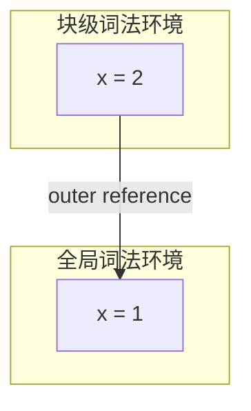
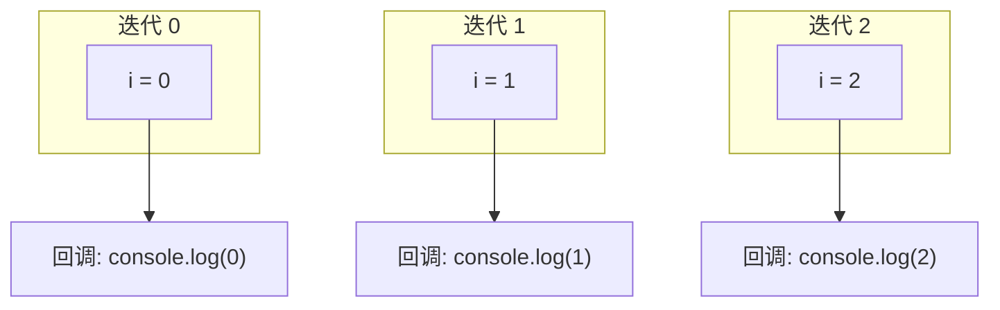
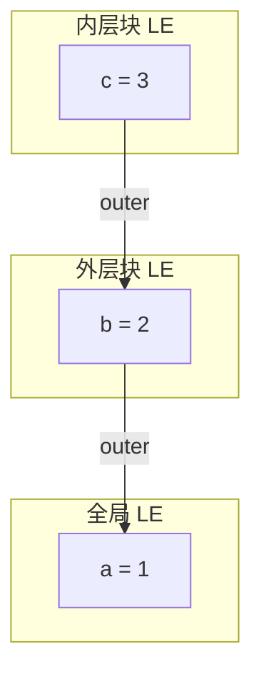

# 块级作用域：var 的缺陷与 let/const 的引入

## 概述

JavaScript 最初仅支持函数作用域和全局作用域，`var` 声明的变量无视块级边界，导致变量泄漏、重复声明等一系列问题。ES6 引入 `let`/`const` 实现块级作用域，从根本上修复了 `var` 的设计缺陷。本文将从词法环境的机制层面分析 `var` 的问题及 `let`/`const` 的解决方案。

---

## 1 var 的三大缺陷

### 1.1 变量泄漏（Variable Leakage）

`var` 声明的变量作用域为最近的函数体或全局，穿透 `if`/`for`/`while` 等块级结构：

```javascript
if (true) {
    var x = 10;
}
console.log(x); // 10 — x 泄漏到函数/全局作用域

for (var i = 0; i < 3; i++) { /* ... */ }
console.log(i); // 3 — i 泄漏到函数/全局作用域
```

### 1.2 变量覆盖（Variable Hoisting Collision）

变量提升导致内层 `var` 声明覆盖外层同名变量，且在声明前即可访问（值为 `undefined`）：

```javascript
var x = 1;
function foo() {
    console.log(x); // undefined（非 1）— var x 提升覆盖了外层 x
    var x = 2;
}
foo();
```

### 1.3 重复声明

同一作用域内 `var` 可重复声明，静默覆盖，无任何警告：

```javascript
var x = 1;
var x = 2; // 无错误，x 被覆盖
```

---

## 2 let/const 的块级作用域

### 2.1 词法环境的嵌套实现

`let`/`const` 在 `{}` 块内创建独立的词法环境，变量仅在该块内可见：

```javascript
let x = 1;
{
    let x = 2; // 新的块级词法环境
    console.log(x); // 2
}
console.log(x); // 1（外部词法环境不受影响）
```



### 2.2 循环中的块级绑定

`for` 循环中 `let` 的行为是 ES6 规范的特殊设计：**每次迭代创建独立的词法环境**：

```javascript
for (let i = 0; i < 3; i++) {
    setTimeout(() => console.log(i), 100);
}
// 输出: 0, 1, 2
```

其等价模型：



而 `var` 版本中，三个回调共享同一个 `i`，循环结束后 `i = 3`：

```javascript
for (var i = 0; i < 3; i++) {
    setTimeout(() => console.log(i), 100);
}
// 输出: 3, 3, 3
```

### 2.3 暂时性死区（Temporal Dead Zone, TDZ）

`let`/`const` 声明存在提升，但不会初始化。从块开始到声明语句之间的区域为**暂时性死区**，访问变量抛出 `ReferenceError`：

```javascript
{
    // TDZ 开始
    console.log(x); // ReferenceError: Cannot access 'x' before initialization
    let x = 1;      // TDZ 结束
    console.log(x); // 1
}
```

TDZ 的工程意义：**将运行时静默的 `undefined` 行为变为显式的错误**，帮助开发者更早发现问题。

### 2.4 const 的语义

`const` 在 `let` 基础上增加**不可重新赋值**的约束，但**不意味着值不可变**：

```javascript
const obj = { x: 1 };
obj.x = 2;       // ✅ 修改属性（对象本身可变）
obj = { x: 2 };  // ❌ TypeError: 重新赋值

const arr = [1, 2];
arr.push(3);      // ✅ 修改数组
arr = [4, 5];     // ❌ TypeError: 重新赋值
```

深度不可变需使用 `Object.freeze()`：

```javascript
const obj = Object.freeze({ x: 1 });
obj.x = 2; // 静默失败（严格模式下抛出 TypeError）
```

---

## 3 块级作用域的底层实现

### 3.1 词法环境栈

V8 通过词法环境的嵌套链实现块级作用域的变量查找：

```javascript
let a = 1;
{
    let b = 2;
    {
        let c = 3;
        console.log(a, b, c); // 1, 2, 3
    }
}
```



变量查找从当前 LE 开始，沿 `outer` 引用向上遍历，命中即返回。

### 3.2 编译时确定作用域

JavaScript 的作用域在**编译阶段**（而非执行阶段）确定。引擎通过静态分析代码的嵌套结构，预先构建作用域链，运行时仅沿链查找——这是词法作用域（Lexical Scoping）的核心特征。

---

## 4 最佳实践

| 场景 | 推荐 | 原因 |
|------|------|------|
| 不可变绑定（常量） | `const` | 防止意外重新赋值，语义清晰 |
| 可变绑定 | `let` | 块级作用域，避免泄漏 |
| 旧代码兼容 | `var` | 仅在维护旧代码时使用 |

> **原则**：默认使用 `const`，需要重新赋值时使用 `let`，永远不要在新代码中使用 `var`。

---

## 5 总结

| 声明方式 | 作用域 | 提升 | 重复声明 | TDZ |
|----------|--------|------|----------|-----|
| `var` | 函数/全局 | ✅ 初始化为 `undefined` | ✅ 允许 | 无 |
| `let` | 块级 | ✅ 不初始化 | ❌ SyntaxError | 有 |
| `const` | 块级 | ✅ 不初始化 | ❌ SyntaxError | 有 |

`let`/`const` 通过块级词法环境和暂时性死区，系统性地解决了 `var` 的三大缺陷。理解其底层实现机制，有助于在工程中正确使用并避免常见陷阱。

---

## 参考文献

1. ECMAScript 2025: [Lexical Environments](https://tc39.es/ecma262/#sec-lexical-environments)
2. MDN: [let](https://developer.mozilla.org/en-US/docs/Web/JavaScript/Reference/Statements/let)
3. MDN: [const](https://developer.mozilla.org/en-US/docs/Web/JavaScript/Reference/Statements/const)
