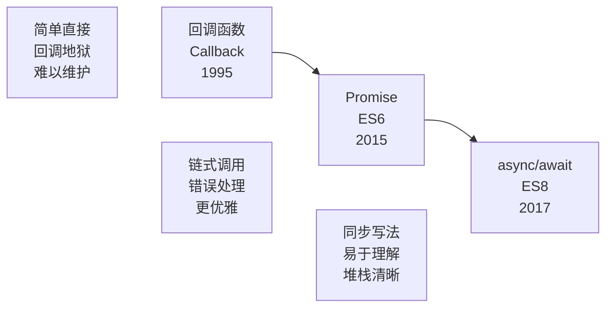

# 异步编程概述

> 异步编程是 JavaScript 处理耗时操作的核心技术，是现代 Web 开发必须掌握的重要概念。

## 一、为什么需要异步

### JavaScript 的单线程特性

JavaScript 是一门**单线程**语言，意味着同一时间只能执行一个任务。这个设计源于其最初的用途——处理用户交互和 DOM 操作，避免多线程带来的复杂同步问题。

```javascript
// 同步操作会阻塞主线程
console.log('开始')
for (let i = 0; i < 1000000000; i++) {
  // 模拟耗时计算
}
console.log('结束')
// 页面在这期间会卡住，无法响应用户操作
```

### 异步的必要性

单线程模型的局限在于：耗时操作会阻塞整个程序，导致页面无响应。异步编程通过**将耗时任务交给浏览器其他线程处理**，解决了这个问题：

```
┌─────────────────────────────────────────────────────────────┐
│                      浏览器架构                              │
├─────────────────────────────────────────────────────────────┤
│  JavaScript 主线程（单线程）                                  │
│  ├── 执行 JavaScript 代码                                    │
│  ├── 处理用户交互事件                                        │
│  └── 更新 DOM                                                │
├─────────────────────────────────────────────────────────────┤
│  浏览器其他线程                                              │
│  ├── 定时器线程（setTimeout/setInterval）                    │
│  ├── 网络请求线程（HTTP 请求）                               │
│  ├── GUI 渲染线程                                           │
│  └── 事件触发线程                                           │
└─────────────────────────────────────────────────────────────┘
```

---

## 二、核心机制：事件循环

### 执行栈与任务队列

JavaScript 通过**事件循环（Event Loop）**机制实现异步：

```
┌───────────────────────────────────────────────────────────┐
│                    事件循环机制                            │
├───────────────────────────────────────────────────────────┤
│                                                           │
│    ┌─────────────┐      ┌─────────────┐                  │
│    │   调用栈     │      │   任务队列   │                  │
│    │  (Call Stack)│      │(Task Queue) │                  │
│    │             │      │             │                  │
│    │  foo()      │      │  宏任务队列  │                  │
│    │  bar()      │      │  微任务队列  │                  │
│    └─────────────┘      └─────────────┘                  │
│           ↑                    │                          │
│           │                    ↓                          │
│    ┌──────────────────────────────────┐                   │
│    │          事件循环 (Event Loop)     │                   │
│    │                                  │                   │
│    │  1. 执行调用栈中的同步代码          │                   │
│    │  2. 调用栈清空后，检查微任务队列    │                   │
│    │  3. 执行所有微任务                 │                   │
│    │  4. 取出一个宏任务执行             │                   │
│    │  5. 重复步骤 2-4                   │                   │
│    └──────────────────────────────────┘                   │
│                                                           │
└───────────────────────────────────────────────────────────┘
```

### 执行顺序示例

```javascript
console.log('1. 同步代码开始')

setTimeout(() => {
  console.log('2. setTimeout 宏任务')
}, 0)

Promise.resolve()
  .then(() => {
    console.log('3. Promise 微任务')
  })

console.log('4. 同步代码结束')

// 执行顺序：1 → 4 → 3 → 2
// 解析：
// 1. 执行同步代码：输出 1、4
// 2. 调用栈清空，检查微任务队列
// 3. 执行微任务：输出 3
// 4. 执行宏任务：输出 2
```

---

## 三、异步编程方式

### 发展历程



> 📊 图表解读：异步编程经历了从回调函数到 Promise 再到 async/await 的演进，每次演进都在可读性和错误处理方面有显著提升。

### 方式对比

| 特性 | 回调函数 | Promise | async/await |
|------|----------|---------|-------------|
| 发布时间 | 1995 | ES6 (2015) | ES8 (2017) |
| 可读性 | ⭐⭐ | ⭐⭐⭐ | ⭐⭐⭐⭐⭐ |
| 错误处理 | 分散 | 集中 catch | try/catch |
| 代码嵌套 | 深层嵌套 | 链式调用 | 扁平化 |
| 调试难度 | 困难 | 中等 | 容易 |
| 学习成本 | 低 | 中 | 低 |

### 1. 回调函数

最原始的异步方式，将函数作为参数传递。

```javascript
// 基本示例
console.log('开始')
setTimeout(() => {
  console.log('定时器执行')
}, 1000)
console.log('结束')
// 输出：开始 → 结束 → 定时器执行

// 回调地狱示例（不推荐）
getUser(userId, function(user) {
  getPosts(user.id, function(posts) {
    getComments(posts[0].id, function(comments) {
      console.log(comments)
    })
  })
})
```

> ⚠️ **注意**：回调函数在复杂场景下容易形成"回调地狱"，代码难以维护。详见 [02-回调函数](02-回调函数.md)。

### 2. Promise

ES6 引入的异步解决方案，采用链式调用，避免回调地狱。

```javascript
// 创建 Promise
const promise = new Promise((resolve, reject) => {
  setTimeout(() => {
    resolve('成功数据')
  }, 1000)
})

// 使用 Promise
promise
  .then(data => {
    console.log('成功:', data)
    return processData(data)
  })
  .then(result => console.log('处理结果:', result))
  .catch(error => console.error('错误:', error))
  .finally(() => console.log('完成'))

// Promise 链式调用
fetch('/api/user')
  .then(response => response.json())
  .then(user => fetch(`/api/posts/${user.id}`))
  .then(response => response.json())
  .then(posts => console.log(posts))
```

> 💡 **提示**：Promise 有三种状态：Pending（进行中）、Fulfilled（已成功）、Rejected（已失败）。状态一旦改变，不可逆转。详见 [03-Promise详解](03-Promise详解.md)。

### 3. async/await

ES8 引入的语法糖，让异步代码看起来像同步代码。

```javascript
// async 函数声明
async function fetchUserData() {
  try {
    const response = await fetch('/api/user')
    const user = await response.json()
    console.log('用户信息:', user)
    return user
  } catch (error) {
    console.error('获取失败:', error)
    throw error
  }
}

// 调用 async 函数
fetchUserData()
  .then(user => console.log('完成'))
  .catch(error => console.error(error))

// 并行执行多个异步操作
async function fetchAllData() {
  const [users, posts] = await Promise.all([
    fetch('/api/users').then(r => r.json()),
    fetch('/api/posts').then(r => r.json())
  ])
  return { users, posts }
}
```

> 💡 **提示**：async/await 基于 Promise，是 Promise 的语法糖，本质仍是异步。详见 [04-async函数](04-async函数.md)。

---

## 四、异步 vs 同步

| 特性 | 同步 | 异步 |
|------|------|------|
| **执行顺序** | 按代码顺序执行 | 非顺序执行，先注册后执行 |
| **阻塞行为** | 会阻塞后续代码 | 不会阻塞主线程 |
| **代码复杂度** | 简单直观 | 相对复杂 |
| **错误处理** | try/catch | 回调/Promise/try-catch |
| **适用场景** | 快速计算操作 | 网络请求、定时器、文件读写 |
| **响应性** | 可能卡顿 | 保持流畅 |

```javascript
// 同步执行
function syncDemo() {
  console.log('任务1')
  console.log('任务2')
  console.log('任务3')
}
syncDemo()
// 输出：任务1 → 任务2 → 任务3（按顺序）

// 异步执行
function asyncDemo() {
  console.log('任务1')
  setTimeout(() => console.log('任务2'), 0)
  console.log('任务3')
}
asyncDemo()
// 输出：任务1 → 任务3 → 任务2（任务2异步执行）
```

---

## 五、异步操作模式与流程控制

### 异步操作模式

异步任务的写法决定了程序的组织方式，常见有三种模式：回调、事件监听、发布/订阅。

#### 1. 回调函数

回调函数是异步操作最基本的方法，将后续逻辑作为函数参数传入。

```javascript
function f1(callback) {
  // ... 异步操作
  callback();
}
function f2() {}
f1(f2);
```

**优点**：简单、容易理解。**缺点**：不利于代码阅读与维护，各部分高度耦合，流程难以追踪（尤其多层嵌套时），且每个任务只能指定一个回调函数。

#### 2. 事件监听

事件驱动模式下，异步任务的执行不取决于代码顺序，而取决于某个事件是否发生。

```javascript
// f1 为一个继承了 EventEmitter 的对象（示意），为它绑定 done 事件，触发后执行 f2
f1.on('done', f2);

function f1() {
  setTimeout(function () {
    // ... 操作完成
    f1.trigger('done'); // 触发事件
  }, 1000);
}
```

**优点**：容易理解，可绑定多个事件、每个事件可指定多个回调，且能「去耦合」，利于模块化。**缺点**：整个程序变成事件驱动型，运行流程不清晰，难以看出主流程。

#### 3. 发布/订阅

发布/订阅模式（Publish-Subscribe，又称观察者模式）引入一个「信号中心」，任务完成时向中心发布信号，其他任务订阅该信号以获知执行时机。

```javascript
// f2 向信号中心订阅 done 信号
jQuery.subscribe('done', f2);

function f1() {
  setTimeout(function () {
    // ... 操作完成
    jQuery.publish('done'); // 发布信号
  }, 1000);
}

// 不再需要时取消订阅
jQuery.unsubscribe('done', f2);
```

**优点**：性质与事件监听类似但更优——可通过查看消息中心，了解存在多少信号、每个信号的订阅者数量，从而监控程序运行。发布/订阅的实现可参考 [手写 EventEmitter](11-核心原理-手写EventEmitter.md)。

### 异步操作的流程控制

有多个异步操作时，需要确定执行顺序。以 6 个耗时 1 秒的异步任务为例，全部完成后执行 `final` 函数，三种流程控制方式对比：

#### 1. 串行执行

一个任务完成后再执行下一个，代码最直观但耗时最长。

```javascript
var items = [1, 2, 3, 4, 5, 6];
var results = [];

function async(arg, callback) {
  setTimeout(function () {
    callback(arg * 2);
  }, 1000);
}

function series(item) {
  if (item) {
    async(item, function (result) {
      results.push(result);
      series(items.shift());
    });
  } else {
    final(results[results.length - 1]);
  }
}
series(items.shift()); // 需要 6 秒完成
```

#### 2. 并行执行

所有任务同时执行，效率最高但可能耗尽系统资源。

```javascript
items.forEach(function (item) {
  async(item, function (result) {
    results.push(result);
    if (results.length === items.length) {
      final(results[results.length - 1]);
    }
  });
});
// 只需 1 秒即可完成
```

#### 3. 并行与串行结合（限制并发）

设置并发上限 `limit`，每次最多并行执行 n 个任务，兼顾效率与资源。

```javascript
var running = 0;
var limit = 2;

function launcher() {
  while (running < limit && items.length > 0) {
    var item = items.shift();
    async(item, function (result) {
      results.push(result);
      running--;
      if (items.length > 0) {
        launcher();
      } else if (running === 0) {
        final(results);
      }
    });
    running++;
  }
}
launcher(); // 需要 3 秒完成，介于串行与并行之间
```

**三种方式对比**：

| 方式 | 完成时间 | 优点 | 缺点 |
|------|---------|------|------|
| 串行执行 | 6 秒 | 直观、占用资源少 | 慢 |
| 并行执行 | 1 秒 | 快 | 任务多时易耗尽资源 |
| 限流并发 | 3 秒 | 效率与资源平衡 | 需额外实现 |

现代开发中，通常使用 `Promise.all` 实现并行、`for...of` + `await` 实现串行、`mapLimit` 或任务队列实现限流并发，详见 [异步编程实践](06-异步编程实践.md)。

---

## 六、常见异步场景

### 1. 网络请求

```javascript
// fetch API
async function fetchUser(id) {
  const response = await fetch(`/api/users/${id}`)
  const user = await response.json()
  return user
}

// axios 库
async function getUser(id) {
  const { data } = await axios.get(`/api/users/${id}`)
  return data
}
```

### 2. 定时器

```javascript
// 延迟执行
setTimeout(() => {
  console.log('3秒后执行')
}, 3000)

// 定时执行
const timer = setInterval(() => {
  console.log('每秒执行一次')
}, 1000)

// 清除定时器
clearInterval(timer)
```

### 3. 事件监听

```javascript
// DOM 事件
document.getElementById('btn').addEventListener('click', (e) => {
  console.log('按钮被点击')
})

// 自定义事件
const eventEmitter = new EventTarget()
eventEmitter.addEventListener('custom', (e) => {
  console.log('自定义事件触发', e.detail)
})
eventEmitter.dispatchEvent(new CustomEvent('custom', { detail: '数据' }))
```

### 4. 文件操作（Node.js）

```javascript
// 回调方式
const fs = require('fs')
fs.readFile('file.txt', 'utf8', (err, data) => {
  if (err) throw err
  console.log(data)
})
```

```javascript
// Promise 方式
const fsp = require('fs/promises')
async function readFile() {
  const data = await fsp.readFile('file.txt', 'utf8')
  console.log(data)
}
```

---

## 七、常见问题

### Q1: setTimeout 设置为 0 会立即执行吗？

**不会**。setTimeout 的回调会被放入**宏任务队列**，等待调用栈清空和微任务执行完毕后才执行。

```javascript
console.log('1')
setTimeout(() => console.log('2'), 0)
Promise.resolve().then(() => console.log('3'))
console.log('4')
// 输出：1 → 4 → 3 → 2
```

### Q2: Promise 和 async/await 可以混用吗？

**可以**。async/await 是 Promise 的语法糖，两者完全兼容。

```javascript
async function demo() {
  // 混用示例
  const promise = Promise.resolve('数据')
  const result = await promise  // await 可以接收 Promise
  return result
}

// async 函数返回 Promise
demo().then(data => console.log(data))
```

### Q3: 如何处理多个异步操作的错误？

```javascript
// 方式1：Promise.allSettled（不中断）
const results = await Promise.allSettled([
  fetch('/api/1'),
  fetch('/api/2'),
  fetch('/api/3')
])
// 所有请求都会完成，不会因单个失败而中断

// 方式2：单独捕获每个错误
async function fetchAll() {
  const [r1, r2, r3] = await Promise.all([
    fetch('/api/1').catch(e => null),
    fetch('/api/2').catch(e => null),
    fetch('/api/3').catch(e => null)
  ])
  return [r1, r2, r3]
}
```

### Q4: async 函数中的错误如何传递？

```javascript
async function fetchData() {
  const response = await fetch('/api/data')
  if (!response.ok) {
    throw new Error('请求失败')  // 会被外层 catch 捕获
  }
  return response.json()
}

// 调用方处理错误
fetchData()
  .then(data => console.log(data))
  .catch(error => console.error('捕获错误:', error))

// 或使用 try/catch
try {
  const data = await fetchData()
} catch (error) {
  console.error('捕获错误:', error)
}
```

### Q5: 如何实现异步操作的取消？

```javascript
// AbortController 取消 fetch
const controller = new AbortController()

async function fetchWithCancel() {
  try {
    const response = await fetch('/api/data', {
      signal: controller.signal
    })
    return response.json()
  } catch (error) {
    if (error.name === 'AbortError') {
      console.log('请求已取消')
    }
    throw error
  }
}

// 取消请求
controller.abort()
```

---

## 八、最佳实践

### 1. 优先使用 async/await

```javascript
// ✅ 推荐：async/await
async function getUser(id) {
  const response = await fetch(`/api/users/${id}`)
  return response.json()
}

// ❌ 不推荐：回调嵌套
function getUser(id, callback) {
  fetch(`/api/users/${id}`)
    .then(response => response.json())
    .then(data => callback(null, data))
    .catch(error => callback(error))
}
```

### 2. 合理使用并行与串行

```javascript
// 串行执行（有依赖关系）
async function serial() {
  const user = await fetchUser()
  const posts = await fetchPosts(user.id)  // 依赖 user
  return posts
}

// 并行执行（无依赖关系）
async function parallel() {
  const [users, posts] = await Promise.all([
    fetchUsers(),   // 无依赖，可并行
    fetchPosts()
  ])
  return { users, posts }
}
```

### 3. 始终处理错误

```javascript
// ✅ 好的做法
async function safeFetch() {
  try {
    const response = await fetch('/api/data')
    return response.json()
  } catch (error) {
    console.error('请求失败:', error)
    return null  // 提供默认值
  }
}

// ❌ 不好的做法
async function unsafeFetch() {
  const response = await fetch('/api/data')  // 可能抛出错误
  return response.json()
}
```

---

## 九、知识图谱

```
异步编程
├── 基础机制
│   ├── 单线程模型
│   ├── 事件循环（Event Loop）
│   ├── 调用栈（Call Stack）
│   └── 任务队列（Task Queue）
│       ├── 宏任务（Macro Task）
│       └── 微任务（Micro Task）
│
├── 编程方式
│   ├── 回调函数（Callback）
│   ├── Promise
│   │   ├── 状态管理
│   │   ├── 链式调用
│   │   └── 静态方法
│   └── async/await
│       ├── async 函数
│       ├── await 表达式
│       └── 错误处理
│
└── 应用场景
    ├── 网络请求（fetch, axios）
    ├── 定时器（setTimeout, setInterval）
    ├── 事件监听（DOM Events）
    └── 文件操作（Node.js）
```

---

## 参考资料

- [MDN - 异步 JavaScript](https://developer.mozilla.org/zh-CN/docs/Learn/JavaScript/Asynchronous)
- [MDN - 事件循环](https://developer.mozilla.org/zh-CN/docs/Web/JavaScript/Event_loop)
- [JavaScript Info - 事件循环：微任务和宏任务](https://zh.javascript.info/event-loop)

---

> 💡 **延伸阅读**：
> - [02-回调函数](02-回调函数.md) - 异步编程的基础
> - [03-Promise详解](03-Promise详解.md) - Promise 完整指南
> - [04-async函数](04-async函数.md) - 同步风格的异步编程
> - [07-单线程任务管理](07-单线程任务管理.md) - 单线程模型与调用栈
> - [10-核心原理-事件循环与异步编程](10-核心原理-事件循环与异步编程.md) - 事件循环、宏任务与微任务详解
