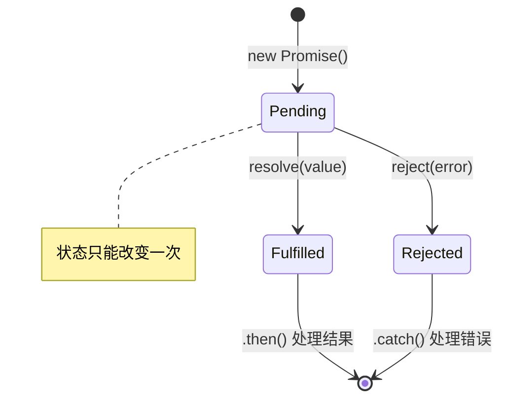

# Promise 完全指南

Promise 是 JavaScript 异步编程的核心解决方案，为异步操作提供了统一的接口和更优雅的链式调用方式。本节系统讲解 Promise 的 API 用法与最佳实践。

## Promise 是什么

Promise 是一个代表异步操作最终完成或失败的对象。它提供了更合理的方式来处理异步操作，避免了传统回调函数的「回调地狱」问题。

```javascript
// ❌ 回调地狱
getData(function (a) {
  getMoreData(a, function (b) {
    getMoreData(b, function (c) {
      // 嵌套越来越深...
    });
  });
});

// ✅ Promise 链式调用
getData()
  .then((a) => getMoreData(a))
  .then((b) => getMoreData(b))
  .then((c) => console.log(c))
  .catch((error) => console.error(error));
```

## Promise 状态

Promise 有三种状态，状态一旦改变就不可逆：

| 状态 | 含义 | 特点 |
|------|------|------|
| Pending | 进行中 | 初始状态，尚未完成 |
| Fulfilled | 已成功 | 操作成功完成 |
| Rejected | 已失败 | 操作失败 |



```javascript
const promise = new Promise((resolve, reject) => {
  resolve('成功');
  reject('失败'); // ❌ 无效，状态已经改变
});
```

Promise 状态从 Pending 只能单向流转到 Fulfilled 或 Rejected，状态一旦确定便不可逆转，这是 Promise 设计的核心保证。

## 创建 Promise

```javascript
// 基本创建
const promise = new Promise((resolve, reject) => {
  setTimeout(() => {
    const success = true;
    if (success) {
      resolve('操作成功'); // 状态改为 Fulfilled
    } else {
      reject('操作失败'); // 状态改为 Rejected
    }
  }, 1000);
});

// 封装异步操作
function readFile(path) {
  return new Promise((resolve, reject) => {
    fs.readFile(path, 'utf-8', (err, data) => {
      if (err) reject(err);
      else resolve(data);
    });
  });
}

readFile('./data.txt')
  .then((data) => console.log(data))
  .catch((error) => console.error(error));
```

`new Promise(executor)` 中的 executor 是**同步执行**的函数，接收 `resolve` 和 `reject` 两个参数，用于改变 Promise 状态。

## 实例方法

### then() - 处理成功

```javascript
promise.then(onFulfilled, onRejected);
```

`then()` 接收两个可选参数，返回一个新的 Promise，从而支持链式调用。

```javascript
const promise = new Promise((resolve, reject) => {
  setTimeout(() => resolve('成功'), 1000);
});

promise.then(
  (value) => console.log('成功:', value), // onFulfilled
  (reason) => console.error('失败:', reason) // onRejected
);
```

### catch() - 处理失败

`catch()` 是 `then(null, onRejected)` 的语法糖，专门处理错误。

```javascript
promise
  .then((value) => console.log(value))
  .catch((error) => console.error('捕获错误:', error));
```

### finally() - 清理操作

无论成功还是失败，`finally()` 都会执行，适合做清理工作。它不接收参数，且返回的 Promise 会沿用原 Promise 的状态。

```javascript
showLoading();

fetchData()
  .then((data) => render(data))
  .catch((error) => showError(error))
  .finally(() => hideLoading()); // 无论成败都会执行
```

### 实例方法对比

| 方法 | 成功时 | 失败时 | 返回值 | 用途 |
|------|--------|--------|--------|------|
| then | 执行 | 执行 | 新 Promise | 处理结果 |
| catch | 不执行 | 执行 | 新 Promise | 捕获错误 |
| finally | 执行 | 执行 | 新 Promise | 清理操作 |

## 静态方法

### 方法对比总览

| 方法 | 特点 | 适用场景 |
|------|------|---------|
| `Promise.resolve()` | 返回一个已成功的 Promise | 将值包装为 Promise |
| `Promise.reject()` | 返回一个已失败的 Promise | 快速生成失败 Promise |
| `Promise.all()` | 全部成功才成功 | 多个请求都需成功 |
| `Promise.race()` | 第一个 settled 决定结果 | 超时控制、竞速 |
| `Promise.allSettled()` | 全部完成后返回结果 | 关注所有请求结果 |
| `Promise.any()` | 任一成功即成功 | 只要一个成功即可 |

### Promise.all()

`Promise.all()` 接收一个 Promise 数组，全部成功才成功，返回结果按传入顺序排列；任一失败则立即失败。

```javascript
const p1 = fetchData('/api/user');
const p2 = fetchData('/api/posts');
const p3 = fetchData('/api/comments');

Promise.all([p1, p2, p3])
  .then((results) => {
    const [user, posts, comments] = results;
    console.log(user, posts, comments);
  })
  .catch((error) => console.error('任一请求失败:', error));
```

适用场景：页面初始化时需要并行加载轮播图、店铺信息、分类列表等多个**互不依赖**的数据。

### Promise.race()

`Promise.race()` 返回第一个**改变状态**的 Promise 的结果，常用于「图片加载 + 超时判断」等竞争场景。

```javascript
function requestImg() {
  return new Promise((resolve, reject) => {
    const img = new Image();
    img.onload = () => resolve(img);
    img.src = 'https://example.com/large.jpg';
  });
}

function timeout(delay) {
  return new Promise((resolve, reject) => {
    setTimeout(() => reject(new Error('图片加载超时')), delay);
  });
}

Promise.race([requestImg(), timeout(5000)])
  .then((img) => document.body.appendChild(img))
  .catch((error) => console.error(error));
```

### Promise.allSettled()

`Promise.allSettled()` 等待所有 Promise 完成，无论成功或失败，返回每个 Promise 的状态结果数组，不会因某个失败而中断。

```javascript
const settledPromise = Promise.allSettled([
  Promise.resolve(2),
  Promise.reject(-1),
]);

settledPromise.then((results) => console.log(results));
// [
//   { status: 'fulfilled', value: 2 },
//   { status: 'rejected', reason: -1 }
// ]
```

适用场景：需要统计多个请求的成功/失败情况，但某个失败不应影响整体统计。

### Promise.any()

`Promise.any()` 只要其中一个 Promise 成功即返回该结果；若全部失败才失败（抛出 `AggregateError`）。

```javascript
Promise.any([
  Promise.reject(new Error('a')),
  Promise.resolve(2),
  Promise.resolve(3),
]).then((value) => console.log(value)); // 2
```

### Promise.resolve() 与 Promise.reject()

```javascript
Promise.resolve('value'); // 立即返回已成功的 Promise
Promise.resolve(existingPromise); // 若传入 Promise，则直接返回该 Promise

Promise.reject(new Error('reason')); // 立即返回已失败的 Promise
```

### Promise.withResolvers()（ES2024）

ES2024 引入的 `Promise.withResolvers()` 将 Promise 的 `resolve` 和 `reject` 函数暴露到外部，避免了「在 executor 中捕获 resolve/reject」的写法，语义更清晰：

```javascript
// 传统方式：在 executor 中捕获
let resolve, reject;
const promise = new Promise((res, rej) => {
  resolve = res;
  reject = rej;
});

// ES2024 方式
const { promise, resolve, reject } = Promise.withResolvers();
```

它常用于「在事件监听器或回调中触发 resolve/reject」的场景，例如可取消的延迟：

```javascript
function createCancellableDelay(ms) {
  const { promise, resolve } = Promise.withResolvers();
  const timer = setTimeout(resolve, ms);
  return { promise, cancel: () => clearTimeout(timer) };
}
```

### Promise.try()（ES2025）

ES2025 引入的 `Promise.try()` 统一了「同步返回和异步返回」的 Promise 化处理，无论回调是同步抛错还是返回 rejected Promise，都会被统一封装为 Promise：

```javascript
// 传统方式：需区分同步/异步错误
function run(fn) {
  try {
    return Promise.resolve(fn());
  } catch (error) {
    return Promise.reject(error);
  }
}

// ES2025 方式
const promise = Promise.try(() => {
  // 这里无论是同步抛错、返回值，还是返回 Promise，都会统一处理
  return someOperation();
});
```

`Promise.try()` 适用于封装可能同步执行也可能异步执行的回调，统一错误处理路径。

## 链式调用

`then()` 返回新 Promise，从而实现链式调用。回调中返回的值或 Promise 会「穿透」到下一环。

```javascript
readFilePromise('a.json')
  .then((data) => JSON.parse(data))
  .then((user) => readFilePromise(user.postsUrl))
  .then((posts) => console.log(posts))
  .catch((error) => console.error(error));
```

**值的传递**：每个 `then` 回调的返回值会成为下一个 `then` 的参数；若返回 Promise，则会等待其 settle 后再继续。

**错误冒泡**：链中任意环节的错误会沿链向后传递，直至被 `.catch()` 捕获，实现集中错误处理。

**中断链式调用**：在 `then` 中返回一个永远不会 settle 的 Promise（如 `new Promise(() => {})`），可以中断后续链的执行。

## Promise 如何解决回调地狱

回调函数时代，异步编程存在两大问题：**多层嵌套**（后续操作依赖前一步结果时回调层层嵌套）和**错误处理分散**（每个操作都需分别处理成败）。Promise 通过三大技术手段解决：**回调函数延迟绑定、返回值穿透、错误冒泡**。

### 回调函数延迟绑定

回调函数不是发起操作时直接传入，而是通过后续的 `.then()` 方法传入，即在异步操作完成、状态确定之后再绑定处理函数。

```javascript
function readFilePromise(filename) {
  return new Promise((resolve, reject) => {
    fs.readFile(filename, (err, data) => {
      if (err) reject(err);
      else resolve(data);
    });
  });
}

// 回调通过 then 延迟传入
readFilePromise('1.json').then((data) => {
  return readFilePromise('2.json');
});
```

### 返回值穿透

`.then()` 中回调函数的返回值会被包装为新的 Promise 并「穿透」到外层，供后续链式调用，从而将深层嵌套改写为扁平的链式结构。

```javascript
readFilePromise('1.json')
  .then((data) => readFilePromise('2.json'))
  .then((data) => readFilePromise('3.json'))
  .then((data) => readFilePromise('4.json'));
```

延迟绑定与返回值穿透共同作用，产生链式调用效果，解决了多层嵌套问题。

### 错误冒泡

Promise 链中的错误会沿链向后传递，直至被 `.catch()` 捕获，实现错误的集中处理，解决了「每个任务分别判断错误」的分散问题。

```javascript
readFilePromise('1.json')
  .then((data) => readFilePromise('2.json'))
  .then((data) => readFilePromise('3.json'))
  .then((data) => readFilePromise('4.json'))
  .catch((err) => {
    // 前面任意环节的错误都会冒泡到这里
    console.error(err);
  });
```

## 错误处理

### 两种方式对比

```javascript
// 方式1：then 的第二个参数
promise.then(
  (value) => console.log(value),
  (reason) => console.error(reason)
);

// 方式2：catch（推荐）
promise.then((value) => console.log(value)).catch((reason) => console.error(reason));
```

### catch 捕获范围

`catch` 不仅能捕获 Promise 被 reject 的错误，也能捕获 `then` 回调中抛出的同步异常：

```javascript
Promise.resolve()
  .then(() => {
    throw new Error('then 回调中的错误');
  })
  .catch((error) => console.error(error)); // 能捕获
```

### 全局错误处理

对于未捕获的 Promise 错误，可在全局层面兜底：

```javascript
// 浏览器
window.addEventListener('unhandledrejection', (event) => {
  console.error('未处理的 Promise 拒绝:', event.reason);
});

// Node.js
process.on('unhandledRejection', (reason) => {
  console.error('未处理的 Promise 拒绝:', reason);
});
```

## 高级应用

### Promise 限制并发

当需要同时执行大量异步任务（如批量下载图片）时，应控制并发数量以避免资源耗尽。

```javascript
async function mapLimit(tasks, limit, fn) {
  const results = [];
  let index = 0;

  async function worker() {
    while (index < tasks.length) {
      const current = index++;
      results[current] = await fn(tasks[current]);
    }
  }

  const workers = Array.from({ length: limit }, () => worker());
  await Promise.all(workers);
  return results;
}

// 使用：最多同时 3 个并发请求
mapLimit(urls, 3, fetchUrl).then((results) => console.log(results));
```

### Promise 超时重试

对不稳定接口增加超时与重试机制，提升健壮性。

```javascript
function withTimeout(promise, ms) {
  return Promise.race([
    promise,
    new Promise((_, reject) =>
      setTimeout(() => reject(new Error(`请求超时(${ms}ms)`)), ms)
    ),
  ]);
}

async function retry(fn, { retries = 3, delay = 1000, timeout = 5000 } = {}) {
  for (let i = 0; i < retries; i++) {
    try {
      return await withTimeout(fn(), timeout);
    } catch (error) {
      if (i === retries - 1) throw error;
      await new Promise((resolve) => setTimeout(resolve, delay));
    }
  }
}
```

### 将回调转换为 Promise

使用 `promisify` 将基于回调的函数封装为返回 Promise 的函数。

```javascript
function promisify(fn) {
  return function (...args) {
    return new Promise((resolve, reject) => {
      fn.call(this, ...args, (error, result) => {
        if (error) reject(error);
        else resolve(result);
      });
    });
  };
}

const readFilePromise = promisify(fs.readFile);
```

## 常见问题

### Q1: Promise 和回调函数的区别？

- 回调通过嵌套组织顺序，Promise 通过链式调用组织顺序，可读性更好。
- 回调错误分散在各层，Promise 通过 `catch` 统一处理。
- Promise 状态一旦改变不可逆，语义更清晰。

### Q2: Promise.all 和 Promise.allSettled 的区别？

- `Promise.all`：任一失败则整体失败，适合「全部成功才算成功」的场景。
- `Promise.allSettled`：等待全部完成并返回各自状态，适合「需要统计所有结果」的场景。

### Q3: 如何处理 Promise 中的异步错误？

- 使用 `.catch()` 或 `.then(null, onRejected)` 捕获。
- 全局兜底使用 `unhandledrejection` / `unhandledRejection`。
- 在 async/await 中优先使用 `try/catch`。

### Q4: Promise 状态可以改变多次吗？

不可以。Promise 状态只能从 Pending 单向改变一次为 Fulfilled 或 Rejected，之后无论调用多少次 `resolve` / `reject` 均无效。

### Q5: then 和 catch 的返回值？

`then()` 和 `catch()` 都会返回一个新的 Promise，因此可以无限链式调用。回调的返回值（含 Promise）会成为新 Promise 的结果。

### Q6: 如何取消 Promise？

Promise 本身不支持取消。可通过 `AbortController` 取消底层请求，或用 `Promise.race` 实现「超时即视为取消」的效果。

## 最佳实践

- **总是使用 catch**：确保每个 Promise 链都有错误处理。
- **合理使用 finally**：在加载态、清理等场景使用 `finally` 保证执行。
- **避免 Promise 构造函数反模式**：已经返回 Promise 的函数不要再用 `new Promise` 包裹，直接使用现成 Promise。
- **并行执行不依赖的操作**：使用 `Promise.all`，避免不必要的串行等待。
- **使用 async/await 简化代码**：复杂流程优先使用 async/await + try/catch。

```javascript
// ✅ 良好实践：async/await 组合
async function loadPageData() {
  showLoading();
  try {
    const [user, posts, comments] = await Promise.all([
      fetchData('/api/user'),
      fetchData('/api/posts'),
      fetchData('/api/comments'),
    ]);
    render({ user, posts, comments });
  } catch (error) {
    showError(error);
  } finally {
    hideLoading();
  }
}
```

## 总结

- Promise 是有限状态机，状态单向且不可逆，通过实例方法 `then` / `catch` / `finally` 处理结果。
- 静态方法 `all` / `race` / `allSettled` / `any` 提供了丰富的并行控制能力。
- 掌握链式调用、错误冒泡与并发控制，可编写健壮、可维护的异步代码。
- Promise 是 async/await 的基础，理解它能更好地掌握现代异步编程。
