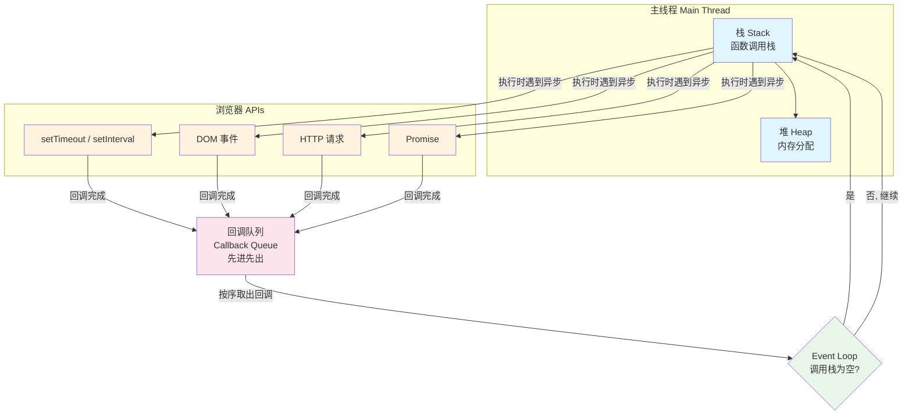

# 单线程任务管理

JavaScript 代码运行过程中的语法分析、编译和执行阶段属于微观层面的运行逻辑，本讲从宏观角度介绍 JavaScript 的运行过程，包括单线程设计、事件循环的并发模型以及任务的调度管理。

## 为什么 JavaScript 是单线程

JavaScript 最初被设计为浏览器脚本语言，主要用途包括对页面的操作、与浏览器的交互、与用户的交互、页面逻辑处理等。如果将 JavaScript 设计为多线程，那么当多个线程同时对同一个 DOM 节点进行操作时，线程间的同步问题会变得很复杂。

因此，为避免复杂性，JavaScript 被设计为**单线程**。

单线程意味着任务需要一个接一个地处理。如果有一个任务是等待用户输入，那么用户操作前所有其他任务都处于等待状态，页面会进入假死状态。为了高效进行页面的交互与渲染，JavaScript 围绕「任务执行是否阻塞主线程」，将任务分为**同步任务**和**异步任务**。

### 同步任务与异步任务

- 同步任务：在主线程上排队执行的任务，前一个任务完整地执行完成后，后一个任务才会被执行。
- 异步任务：不会阻塞主线程，在其任务执行完成之后，会再根据一定的规则去执行相关的回调。
我们先来看一下同步任务在浏览器中的是怎样执行的。

#### 同步任务与函数调用栈

在 JavaScript 中，同步任务基本上可以认为是执行 JavaScript 代码。在前文内容中，我们提到 JavaScript 在执行过程中每进入一个不同的运行环境时，都会创建一个相应的执行上下文。那么，当我们执行一段 JavaScript 代码时，通常会创建多个执行上下文。

而 JavaScript 解释器会以栈的方式管理这些执行上下文、以及函数之间的调用关系，形成函数调用栈（call stack）（调用栈可理解为一个存储函数调用的栈结构，遵循 FILO（先进后出）的原则）。

JavaScript 中代码的执行过程如下：

- 首先进入全局环境，全局执行上下文被创建并添加进栈中；
- 每调用一个函数，该函数执行上下文会被添加进调用栈，并开始执行；
- 如果正在调用栈中执行的 A 函数还调用了 B 函数，那么 B 函数也将会被添加进调用栈；
- 一旦 B 函数被调用，便会立即执行；
- 当前函数执行完毕后，JavaScript 解释器将其清出调用栈，继续执行当前执行环境下的剩余的代码。
由此可见，JavaScript 代码执行过程中，**函数调用栈栈底永远是全局执行上下文，栈顶永远是当前执行上下文**。

在不考虑全局执行上下文时，我们可以理解为刚开始的时候调用栈是空的，每当有函数被调用，相应的执行上下文都会被添加到调用栈中。执行完函数中相关代码后，该执行上下文又会自动被调用栈移除，最后调用栈又回到了空的状态（同样不考虑全局执行上下文）。

由于栈的容量是有限制的，所以当我们没有合理调用函数的时候，可能会导致爆栈异常：

```javascript
function loop() {
  loop(); // 无限递归，最终导致栈溢出
}
loop(); // RangeError: Maximum call stack size exceeded
```

这样的一个函数调用栈结构，可以理解为 JavaScript 中同步任务的执行环境，同步任务也可以理解为 JavaScript 代码片段的执行。

同步任务的执行会阻塞主线程，也就是说，一个函数执行的时候不会被抢占，只有在它执行完毕之后，才会去执行任何其他的代码。**这意味着如果我们一个任务执行的时间过长，浏览器就无法处理与用户的交互，例如点击或滚动**。

因此，我们还需要用到异步任务。

#### 异步任务与回调队列

异步任务包括一些需要等待响应的任务，包括用户交互、HTTP 请求、定时器等。

我们知道，I/O 类型的任务会有较长的等待时间，对于这类无法立刻得到结果的事件，可以使用异步任务的方式。这个过程中 JavaScript 线程就不用处于等待状态，CPU 也可以处理其他任务。

异步任务需要提供回调函数，当异步任务有了运行结果之后，该任务则会被添加到回调队列中，主线程在适当的时候会从回调队列中取出相应的回调函数并执行。

这里提到的回调队列又是什么呢？

实际上，JavaScript 在运行的时候，除了函数调用栈之外，还包含了一个待处理的回调队列。在回调队列中的都是已经有了运行结果的异步任务，每一个异步任务都会关联着一个回调函数。

回调队列则遵循 FIFO（先进先出）的原则，JavaScript 执行代码过程中，会进行以下的处理：

- 运行时，会从最先进入队列的任务开始，处理队列中的任务；
- 被处理的任务会被移出队列，该任务的运行结果会作为输入参数，并调用与之关联的函数，此时会产生一个函数调用栈；
- 函数会一直处理到调用栈再次为空，然后 Event Loop 将会处理队列中的下一个任务。
这里我们提到了 Event Loop，它主要是用来管理单线程的 JavaScript 中同步任务和异步任务的执行问题。

### 单线程的 JavaScript 是如何管理任务的

我们知道，单线程的设计会存在阻塞问题，为此 JavaScript 中任务被分为同步和异步任务。那么，同步任务和异步任务之间是按照什么顺序来执行的呢？

JavaScript 有一个基于事件循环的并发模型，称为事件循环（Event Loop），它的设计解决了同步任务和异步任务的管理问题。

根据 JavaScript 运行环境的不同，Event Loop 也会被分成浏览器的 Event Loop 和 Node.js 中的 Event Loop。

#### 浏览器的 Event Loop

在浏览器里，每当一个被监听的事件发生时，事件监听器绑定的相关任务就会被添加进回调队列。通过事件产生的任务是异步任务，常见的事件任务包括：

- 用户交互事件产生的事件任务，比如输入操作；
- 计时器产生的事件任务，比如`setTimeout`；
- 异步请求产生的事件任务，比如 HTTP 请求。
JavaScript 的运行过程，可以借用 Philip Roberts 演讲《Help, I'm stuck in an event-loop》中经典的一张图来描述：



如图，主线程运行的时候，会产生堆（heap）和栈（stack），其中堆为内存、栈为函数调用栈。我们能看到，Event Loop 负责执行代码、收集和处理事件以及执行队列中的子任务，具体包括以下过程。

- JavaScript 有一个主线程和调用栈，所有的任务最终都会被放到调用栈等待主线程执行。
- 同步任务会被放在调用栈中，按照顺序等待主线程依次执行。
- 主线程之外存在一个回调队列，回调队列中的异步任务最终会在主线程中以调用栈的方式运行。
- 同步任务都在主线程上执行，栈中代码在执行的时候会调用浏览器的 API，此时会产生一些异步任务。
- 异步任务会在有了结果（比如被监听的事件发生时）后，将异步任务以及关联的回调函数放入回调队列中。
- 调用栈中任务执行完毕后，此时主线程处于空闲状态，会从回调队列中获取任务进行处理。
上述过程会不断重复，这就是 JavaScript 的运行机制，称为事件循环机制（Event Loop）。

Event Loop 的设计会带来一些问题，比如`setTimeout`、`setInterval`的时间精确性。这两个方法会设置一个计时器，当计时器计时完成，需要执行回调函数，此时才把回调函数放入回调队列中。

如果当回调函数放入队列时，假设队列中还有大量的回调函数在等待执行，此时就会造成任务执行时间不精确。

要优化这个问题，可以使用系统时钟来补偿计时器的不准确性，从而提升精确度。举个例子，如果你的计时器会在回调时触发二次计时，可以在每次回调任务结束的时候，根据最初的系统时间和该任务的执行时间进行差值比较，来修正后续的计时器时间。

### Node.js 中的 Event Loop

除了浏览器，Node.js 中同样存在 Event Loop。由于 JavaScript 是单线程的，Event Loop 的设计使 Node.js 可以通过将操作转移到系统内核中，来执行非阻塞 I/O 操作。

Node.js 中的事件循环执行过程为：

- 当 Node.js 启动时将初始化事件循环，处理提供的输入脚本；
- 提供的输入脚本可以进行异步 API 调用，然后开始处理事件循环；
- 在事件循环的每次运行之间，Node.js 会检查它是否正在等待任何异步 I/O 或计时器，如果没有，则将其干净地关闭。
与浏览器不一样，Node.js 中事件循环分成不同的阶段：

```text
   ┌───────────────────────────┐
┌─>│           timers          │
│  └─────────────┬─────────────┘
│  ┌─────────────┴─────────────┐
│  │     pending callbacks     │
│  └─────────────┬─────────────┘
│  ┌─────────────┴─────────────┐
│  │       idle, prepare       │
│  └─────────────┬─────────────┘      ┌───────────────┐
│  ┌─────────────┴─────────────┐      │   incoming:   │
│  │           poll            │<─────┤               │
│  └─────────────┬─────────────┘      │   data, etc.  │
│  ┌─────────────┴─────────────┐      └───────────────┘
│  │           check           │
│  └─────────────┬─────────────┘
│  ┌─────────────┴─────────────┐
└──┤      close callbacks      │
   └───────────────────────────┘
```

由于事件循环阶段划分不一致，Node.js 和浏览器在对宏任务和微任务的处理上也不一样。

### 宏任务和微任务

事件循环中的异步回调队列有两种：宏任务（MacroTask）和微任务（MicroTask）队列。

什么是宏任务和微任务呢？

- 宏任务：包括 script 全部代码、`setTimeout`、`setInterval`、`setImmediate`（Node.js）、`requestAnimationFrame`（浏览器）、I/O 操作、UI 渲染（浏览器），这些代码执行便是宏任务。
- 微任务：包括`process.nextTick`（Node.js）、`Promise`、`MutationObserver`，这些代码执行便是微任务。
为什么要将异步任务分为宏任务和微任务呢？这是为了避免回调队列中等待执行的异步任务（宏任务）过多，导致某些异步任务（微任务）的等待时间过长。在每个宏任务执行完成之后，会先将微任务队列中的任务执行完毕，再执行下一个宏任务。

因此，前面我们所说的回调队列可以理解为宏任务队列，同时还有另外一个任务队列为微任务队列。

在浏览器的异步回调队列中，宏任务和微任务的执行过程如下：

- 宏任务队列一次只从队列中取一个任务执行，执行完后就去执行微任务队列中的任务。
- 微任务队列中所有的任务都会被依次取出来执行，直到微任务队列为空。
- 在执行完所有的微任务之后，执行下一个宏任务之前，浏览器会执行 UI 渲染操作、更新界面。
我们能看到，在浏览器中每个宏任务执行完成后，会执行微任务队列中的任务。而在 Node.js 中，事件循环分为 6 个阶段，微任务会在事件循环的各个阶段之间执行。也就是说，每当一个阶段执行完毕，就会去执行微任务队列的任务。

宏任务和微任务的执行顺序，常常会被用作面试题，比如下面这道考察`Promise`、`setTimeout`、`async/await`等 API 执行顺序的题目：

```javascript
console.log("script start");

setTimeout(() => {
  console.log("setTimeout");
}, 1000);

Promise.resolve()
  .then(function () {
    console.log("promise1");
  })
  .then(function () {
    console.log("promise2");
  });

async function errorFunc() {
  try {
    await Promise.reject("error!!!");
  } catch (e) {
    console.log("error caught");
  }
  console.log("errorFunc");
  return Promise.resolve("errorFunc success");
}
errorFunc().then((res) => console.log("errorFunc then res"));

console.log("script end");
```

**执行顺序分析：**

1. 同步代码先执行：`script start` → 进入 `errorFunc`（`await` 前为同步）→ `script end`。
2. 微任务队列依次执行：`promise1` → `error caught`（`await` 的 rejection 由 catch 捕获，注册早于第二个 `then`）→ `errorFunc`（catch 块之后的同步代码）→ `promise2` → `errorFunc then res`。
3. 宏任务最后执行：`setTimeout`。

完整输出（Node 24 实测）：

```
script start
script end
promise1
error caught
errorFunc
promise2
errorFunc then res
setTimeout
```
