# 事件循环与异步编程：从消息队列到 async/await

## 1 概述

浏览器渲染进程的主线程承担了 JavaScript 执行、DOM 解析与操作、样式计算、布局、绘制以及用户交互事件处理等全部职责。为使这些异构任务有序执行，浏览器引入了基于消息队列的事件循环（Event Loop）机制。随着 Web 应用复杂度的持续增长，单一的宏任务队列已无法满足实时性与效率的权衡需求，微任务（Microtask）机制应运而生。在此基础上，JavaScript 语言层面经历了从回调函数到 Promise、再到 async/await 的异步编程范式演进，同时 Fetch API、AbortController、Scheduler API、Promise.withResolvers()、Top-level await、异步迭代器等新特性不断丰富着异步编程的工具链。

本文将系统性地阐述事件循环的完整运行机制、宏任务与微任务的调度模型、定时器与网络请求的底层实现、Promise 规范细节、async/await 的协程本质，以及截至 2026 年的异步编程最新进展。

---

## 2 事件循环机制

### 2.1 消息队列与主线程循环

渲染进程的主线程采用一种持续运行的循环结构——事件循环——来驱动所有任务的执行。其核心模型如下：

```c
// 事件循环的简化伪代码
TaskQueue task_queue;
bool keep_running = true;

void MainThread() {
  for (;;) {
    Task task = task_queue.takeTask();
    ProcessTask(task);

    if (!keep_running)
      break;
  }
}
```

主线程从消息队列中按先进先出（FIFO）顺序取出任务并执行。新产生的任务（如用户交互事件、网络回调、定时器回调等）被追加至队列尾部，等待后续循环周期处理。这种设计保证了页面任务的有序执行，但也意味着：**当前任务执行时间过长将阻塞后续所有任务的调度**。

### 2.2 多优先级队列与动态调度

Chromium 的实际实现远比单一消息队列复杂。为解决队头阻塞（Head-of-Line Blocking）问题，Chromium 经历了四次迭代：

1. **单消息队列**：所有任务共享一个队列，低优先级任务可阻塞高优先级任务。
2. **引入高优先级队列**：将紧急任务（用户输入、合成事件）放入高优先级队列，调度器优先处理。
3. **按任务类型划分队列**：为输入事件、合成任务、默认任务、空闲任务分别创建不同优先级的队列，保证同类任务的相对执行顺序。
4. **动态调度策略**：根据页面生命周期阶段（加载阶段 vs 交互阶段）动态调整队列优先级，并引入权重机制防止低优先级任务饿死。

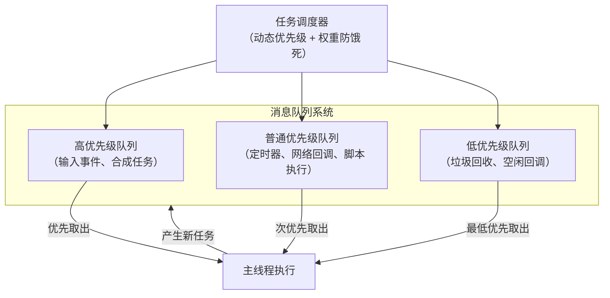

### 2.3 完整的事件循环处理模型

根据 WHATWG HTML 规范的定义，浏览器事件循环的一次迭代（即一个"事件循环回合"）包含以下步骤：

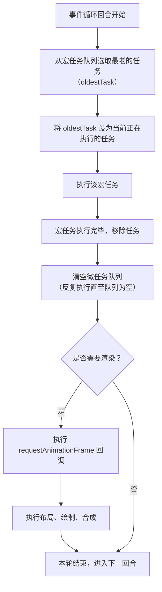

关键要点：

- **微任务在当前宏任务结束后、下一个宏任务开始前全部执行完毕**。
- 微任务执行期间新产生的微任务也在当前回合内执行，不会推迟到下一轮。
- `requestAnimationFrame` 回调在微任务之后、浏览器渲染之前执行，与 VSync 信号同步。
- 浏览器可能跳过某些帧的渲染（当没有视觉变更时），但宏任务和微任务的处理不会跳过。

---

## 3 宏任务与微任务

### 3.1 宏任务（Macrotask）

宏任务是事件循环调度的基本单位。典型的宏任务来源包括：

| 来源 | 说明 |
|------|------|
| 脚本执行 | `<script>` 标签中的顶层代码 |
| 定时器 | `setTimeout` / `setInterval` 回调 |
| I/O 回调 | 网络请求完成、文件读写完成 |
| 用户交互 | 点击、滚动、键盘事件 |
| 渲染相关 | DOM 解析、布局计算、绘制 |
| `requestAnimationFrame` | 帧渲染前的回调（部分规范归为宏任务的特殊类别） |

宏任务的时间粒度较粗，两个连续宏任务之间可能被系统插入其他任务，因此无法保证精确的执行时序。

### 3.2 微任务（Microtask）

微任务是在当前宏任务结束后、下一宏任务开始前执行的异步函数。其核心特征：

- **每个宏任务关联一个微任务队列**。
- 微任务的执行时机称为**检查点（Checkpoint）**，位于当前宏任务的 JavaScript 执行上下文退出时。
- 微任务队列清空过程中新产生的微任务在本轮继续执行。
- 微任务的执行时长直接影响当前宏任务的总耗时。

微任务的主要来源：

| 来源 | 说明 |
|------|------|
| `Promise.then/catch/finally` | Promise 状态变更后的回调 |
| `MutationObserver` | DOM 变更记录的回调 |
| `queueMicrotask()` | 显式入队微任务 |
| `Object.observe`（已废弃） | 对象变更观察 |

### 3.3 执行顺序与优先级

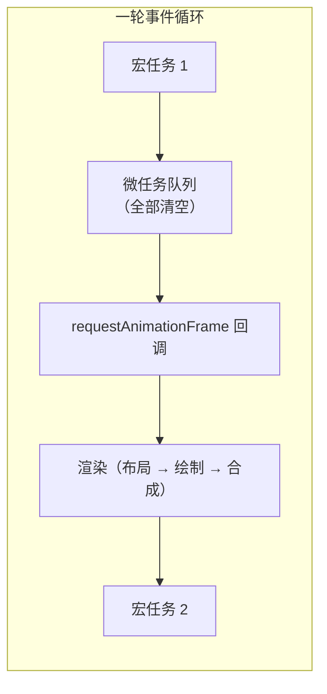

执行优先级从高到低：

1. **同步代码**（当前宏任务内的同步执行部分）
2. **微任务**（`Promise.then`、`queueMicrotask`、`MutationObserver`）
3. **`requestAnimationFrame` 回调**（渲染前）
4. **渲染操作**（布局、绘制、合成）
5. **下一个宏任务**（`setTimeout` 回调、I/O 回调等）

### 3.4 执行顺序示例分析

```javascript
console.log('script start');

setTimeout(() => {
  console.log('setTimeout');
}, 0);

Promise.resolve()
  .then(() => {
    console.log('promise 1');
  })
  .then(() => {
    console.log('promise 2');
  });

queueMicrotask(() => {
  console.log('microtask');
});

console.log('script end');
```

输出顺序：

```
script start
script end
promise 1
microtask
promise 2
setTimeout
```

分析路径：

1. 执行顶层脚本（宏任务）：输出 `script start`、`script end`。
2. `setTimeout` 回调被注册到宏任务队列。
3. `Promise.resolve().then()` 注册微任务；`queueMicrotask()` 注册微任务。
4. 脚本执行完毕，进入微任务检查点：依次执行 `promise 1` → `microtask` → `promise 2`（第二个 `.then` 产生的微任务在本轮清空）。
5. 微任务队列清空，进入下一宏任务：执行 `setTimeout` 回调。

---

## 4 定时器机制

### 4.1 setTimeout 的实现原理

浏览器为支持定时器功能，在普通消息队列之外维护了一个**延迟队列（Delayed Incoming Queue）**。当调用 `setTimeout(callback, delay)` 时，渲染进程创建一个延迟任务结构体并加入延迟队列：

```c
struct DelayTask {
  int64 id;
  CallBackFunction cbf;
  int start_time;
  int delay_time;
};
```

事件循环在处理完每个普通消息队列任务后，调用 `ProcessDelayTask()` 函数，检查延迟队列中是否有到期任务（`current_time >= start_time + delay_time`），若有则取出执行。

```c
void MainThread() {
  for (;;) {
    Task task = task_queue.takeTask();
    ProcessTask(task);

    ProcessDelayTask();  // 处理到期的延迟任务

    if (!keep_running)
      break;
  }
}
```

取消定时器（`clearTimeout`）的实现则是根据 ID 从延迟队列中查找并移除对应任务。

### 4.2 精度问题与限制

#### 4.2.1 当前任务执行时间的影响

`setTimeout(callback, 0)` 并不意味着立即执行。回调必须等待当前宏任务执行完毕后才能被调度。若当前宏任务耗时 500ms，则即使设置延迟为 0，回调也会被推迟 500ms 执行。

#### 4.2.2 嵌套调用的最小延迟（4ms）

根据 Chromium 实现，当 `setTimeout` 嵌套调用深度超过 5 层时，最小延迟被强制设为 4ms：

```c
static const int kMaxTimerNestingLevel = 5;
static constexpr base::TimeDelta kMinimumInterval =
    base::TimeDelta::FromMilliseconds(4);
```

此限制旨在防止 CPU 空转循环对系统性能的过度消耗。HTML 规范亦明确规定：嵌套深度超过 5 时，最小间隔为 4ms。

#### 4.2.3 后台标签页节流

当页面处于非激活状态（后台标签页）时，浏览器为降低功耗和资源消耗，将 `setTimeout` 的最小延迟提升至 **1000ms**（部分浏览器实现可能为 1000ms 以上）。此行为由浏览器自行决定，规范未做强制要求。

#### 4.2.4 延迟值上限

Chrome、Safari、Firefox 均使用 32 位有符号整数存储延迟值，最大值为 2,147,483,647ms（约 24.8 天）。超过此值的延迟会被截断为 0，导致定时器立即执行。

#### 4.2.5 this 指向问题

当 `setTimeout` 的回调为对象方法时，`this` 指向全局对象（非严格模式）或 `undefined`（严格模式），而非方法所属对象。解决方案：

```javascript
// 方案一：箭头函数包装
setTimeout(() => obj.method(), 100);

// 方案二：bind 绑定
setTimeout(obj.method.bind(obj), 100);
```

### 4.3 setInterval 的注意事项

`setInterval` 的回调执行间隔并非严格等于设定值。若某次回调执行时间超过设定间隔，后续回调不会按预期频率触发——浏览器保证的是回调之间的最小间隔不小于设定值，而非精确的等间隔触发。对于需要精确时间序列的场景，推荐使用递归 `setTimeout` 替代 `setInterval`。

### 4.4 requestAnimationFrame

`requestAnimationFrame`（rAF）是浏览器提供的与显示器刷新率同步的帧调度 API。其核心优势：

- **与 VSync 信号同步**：回调在浏览器准备重绘之前调用，确保每帧只执行一次。
- **自动节流**：页面处于后台时，rAF 回调自动暂停，避免不必要的计算。
- **时间戳参数**：回调接收高精度 `DOMHighResTimeStamp` 参数，便于计算帧间差值。

```javascript
function animate(timestamp) {
  // timestamp 为上一帧 rAF 回调执行到当前的时间差
  element.style.transform = `translateX(${timestamp * 0.1}px)`;
  requestAnimationFrame(animate);
}
requestAnimationFrame(animate);
```

rAF 与 setTimeout 的关键区别：

| 特性 | setTimeout | requestAnimationFrame |
|------|-----------|----------------------|
| 调度时机 | 宏任务队列 | 渲染前（VSync 同步） |
| 帧率同步 | 否 | 是 |
| 后台行为 | 节流至 1s | 自动暂停 |
| 精度 | 受 4ms 最小延迟限制 | 与显示器刷新率一致 |

### 4.5 requestIdleCallback

`requestIdleCallback`（rIC）在浏览器空闲时段执行低优先级任务。回调接收 `IdleDeadline` 对象，可查询剩余空闲时间以决定是否继续执行：

```javascript
requestIdleCallback((deadline) => {
  while (deadline.timeRemaining() > 0 && tasks.length > 0) {
    performTask(tasks.pop());
  }
  if (tasks.length > 0) {
    requestIdleCallback(processRemainingTasks);
  }
});
```

rIC 的执行时机位于一帧的空闲阶段（合成完成到下一个 VSync 信号之间），其 `timeRemaining()` 最大值为 50ms，防止空闲回调占用过长导致帧丢失。

### 4.6 Node.js 事件循环

以上讨论的是浏览器的事件循环。Node.js 的事件循环与之不同，被划分为 **6 个阶段**，会按顺序反复运行：

```text
   ┌───────────────────────────┐
┌─>│           timers          │
│  └─────────────┬─────────────┘
│  ┌─────────────┴─────────────┐
│  │     pending callbacks     │
│  └─────────────┬─────────────┘
│  ┌─────────────┴─────────────┐
│  │       idle, prepare       │
│  └─────────────┬─────────────┘
│  ┌─────────────┴─────────────┐
│  │           poll            │
│  └─────────────┬─────────────┘
│  ┌─────────────┴─────────────┐
│  │           check           │
│  └─────────────┬─────────────┘
│  ┌─────────────┴─────────────┐
└──┤      close callbacks      │
   └───────────────────────────┘
```

| 阶段 | 作用 |
|------|------|
| **timers** | 执行 `setTimeout` 和 `setInterval` 的回调 |
| **pending callbacks** | 执行推迟到下一轮循环的 I/O 回调 |
| **idle, prepare** | 仅供系统内部使用 |
| **poll** | 获取新的 I/O 事件；执行到点的定时器；若 poll 队列空则进入 check 阶段 |
| **check** | 执行 `setImmediate` 回调 |
| **close callbacks** | 执行 close 事件（如 socket 关闭） |

在 Node 中，微任务会在**每个阶段完成后立即执行**。由于事件循环阶段划分不同，Node.js 与浏览器对宏任务/微任务的处理也存在差异，相同的代码可能输出不同结果：

```javascript
setTimeout(() => {
  console.log('timer1');
  Promise.resolve().then(() => console.log('promise1'));
}, 0);

setTimeout(() => {
  console.log('timer2');
  Promise.resolve().then(() => console.log('promise2'));
}, 0);

// 浏览器中一定打印：timer1, promise1, timer2, promise2
// Node 中可能打印：timer1, timer2, promise1, promise2（取决于进入事件循环是否超过 1ms）
```

Node 特有的 `process.nextTick` 优先级高于 Promise 微任务：

```javascript
Promise.resolve().then(() => console.log('promise'));
process.nextTick(() => console.log('nextTick'));
// 输出：nextTick → promise
```

### 4.6.1 浏览器 vs Node.js 关键区别

将浏览器与 Node.js 的事件循环并排对比，能更清晰地把握两者的差异：

| 方面 | 浏览器 | Node.js |
|------|--------|---------|
| 实现依据 | HTML/WHATWG 规范 | libuv |
| 微任务优先级 | Promise → MutationObserver | `process.nextTick` → Promise |
| 宏任务分类 | 无细分（单宏任务队列） | timers / poll / check 等 6 阶段 |
| 渲染 | 每轮循环后可能渲染 | 无渲染概念 |
| requestAnimationFrame | 有 | 无 |
| setImmediate | 无 | 有（check 阶段） |

**核心差异**：浏览器以"渲染"为核心目标，rAF 与渲染管线深度绑定；Node.js 以"I/O 事件处理"为核心，微任务在每个阶段完成后执行，且 `process.nextTick` 优先级高于 Promise 微任务（可能导致微任务饥饿，官方推荐用 `queueMicrotask` 或 `Promise.resolve().then()` 替代）。

---

### 4.7 宏任务与微任务经典面试题

#### 题目一：async/await 的执行顺序

```javascript
async function async1() {
  console.log('async1 start');
  await async2();
  console.log('async1 end');
}
async function async2() {
  console.log('async2');
}

console.log('script start');
async1();
console.log('script end');

// script start → async1 start → async2 → script end → async1 end
```

**解析**：`await async2()` 会先同步执行 `async2`（打印 async2），再将后续代码（`async1 end`）作为微任务入队；同步代码执行完后，微任务 `async1 end` 才执行。

#### 题目二：宏任务中产生微任务

```javascript
console.log('start');
setTimeout(() => {
  console.log('setTimeout1');
  Promise.resolve().then(() => console.log('promise'));
}, 0);
setTimeout(() => {
  console.log('setTimeout2');
}, 0);
console.log('end');

// start → end → setTimeout1 → promise → setTimeout2
```

**解析**：宏任务 `setTimeout1` 执行时产生的微任务 `promise`，会在下一个宏任务（setTimeout2）之前执行。

#### 题目三：微任务中产生微任务

```javascript
console.log('start');
Promise.resolve()
  .then(() => {
    console.log('promise1');
    Promise.resolve().then(() => console.log('promise2'));
  });
console.log('end');

// start → end → promise1 → promise2
```

**解析**：微任务产生的微任务会在同一轮循环中继续执行（微任务队列一次性清空）。

---

## 5 网络请求：从 XMLHttpRequest 到 Fetch API

### 5.1 XMLHttpRequest 的运作机制

XMLHttpRequest 的完整请求流程涉及渲染进程与网络进程的协作：

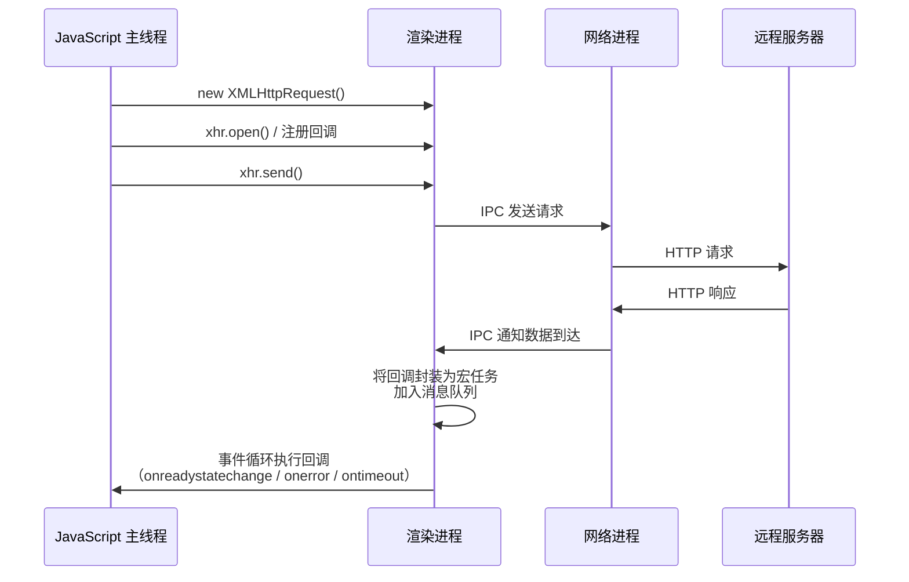

XMLHttpRequest 的回调属于异步回调，其执行方式有两种：

1. **封装为宏任务**：将回调函数添加到消息队列尾部，等待后续事件循环执行。
2. **封装为微任务**：将回调添加到微任务队列，在当前宏任务末尾执行。

XMLHttpRequest 的回调采用第一种方式（宏任务），这也是其响应延迟较高的原因之一。

### 5.2 Fetch API

Fetch API 是 XMLHttpRequest 的现代替代方案，基于 Promise 设计，提供了更简洁、更强大的网络请求接口：

```javascript
// 基本用法
const response = await fetch('https://api.example.com/data', {
  method: 'POST',
  headers: { 'Content-Type': 'application/json' },
  body: JSON.stringify({ key: 'value' }),
});

if (!response.ok) {
  throw new Error(`HTTP ${response.status}: ${response.statusText}`);
}

const data = await response.json();
```

Fetch 与 XMLHttpRequest 的核心差异：

| 特性 | XMLHttpRequest | Fetch API |
|------|---------------|-----------|
| 返回值 | void（基于事件回调） | Promise\<Response\> |
| 流式处理 | 有限支持 | 原生支持 ReadableStream |
| 请求取消 | xhr.abort() | AbortController |
| 超时处理 | xhr.timeout 属性 | 需手动实现（AbortController + setTimeout） |
| 进度监控 | onprogress 事件 | Response.body 流式读取 |
| Cookie 控制 | withCredentials 属性 | credentials 选项 |
| 重定向控制 | 有限 | redirect 选项（manual/follow/error） |
| 缓存控制 | 有限 | cache 选项 |
| CORS | 受限 | 模式可控（cors/no-cors/same-origin） |

### 5.3 AbortController 与可取消的异步操作

AbortController 是 Web 平台提供的统一取消机制，可用于 Fetch 请求及其他异步操作：

```javascript
const controller = new AbortController();
const signal = controller.signal;

// 取消 Fetch 请求
fetch('https://api.example.com/data', { signal })
  .then(response => response.json())
  .then(data => console.log(data))
  .catch(err => {
    if (err.name === 'AbortError') {
      console.log('请求已被取消');
    }
  });

// 5 秒后取消
setTimeout(() => controller.abort(), 5000);
```

AbortController 也可用于自定义异步操作的取消：

```javascript
async function cancellableDelay(ms, signal) {
  return new Promise((resolve, reject) => {
    const timer = setTimeout(resolve, ms);

    signal.addEventListener('abort', () => {
      clearTimeout(timer);
      reject(new DOMException('操作已取消', 'AbortError'));
    }, { once: true });
  });
}
```

---

## 6 Promise 规范与实现细节

### 6.1 Promise 的设计动机

JavaScript 的单线程异步模型导致回调函数成为处理异步操作的基本手段，但回调模式存在两个根本性问题：

1. **嵌套调用（回调地狱）**：后续异步操作依赖前一步结果时，回调函数必须嵌套在前一步的回调内部，导致代码缩进层级急剧加深，可读性严重下降。
2. **错误处理分散**：每个异步操作都有成功与失败两种可能，需在每个回调中分别处理错误，导致错误处理逻辑重复且分散。

Promise 通过三项核心技术解决上述问题：

- **回调函数延迟绑定**：先创建 Promise 对象，再通过 `.then()` 绑定回调，而非在发起操作时传入回调。
- **回调函数返回值穿透**：`.then()` 的返回值自动包装为新的 Promise，实现链式调用，消除嵌套。
- **错误冒泡**：未被处理的 rejection 沿 Promise 链向后传递，直至被 `.catch()` 捕获，实现错误的集中处理。

### 6.2 Promise 状态机

Promise 对象拥有三种状态，状态转换严格单向：

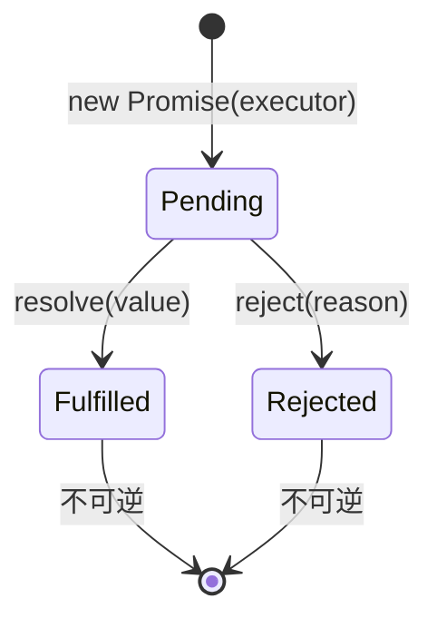

- **Pending**：初始状态，既未兑现也未拒绝。
- **Fulfilled**：操作成功完成，关联一个终值（value）。
- **Rejected**：操作失败，关联一个拒因（reason）。

状态一旦从 Pending 转为 Fulfilled 或 Rejected，即不可再变更。多次调用 `resolve` 或 `reject` 仅第一次生效。

### 6.3 Thenable 与 Promise 解析过程

Promise 规范定义了 **Promise 解析过程（Promise Resolution Procedure）**，处理 `.then()` 回调返回值的包装逻辑。当返回值为 Thenable 对象（即拥有 `.then()` 方法的对象）时，解析过程会调用其 `.then()` 方法，将其状态与外层 Promise 关联：

```javascript
// Thenable 示例
const thenable = {
  then(resolve, reject) {
    resolve(42);
  }
};

const p = Promise.resolve(thenable);
// p 的状态由 thenable.then 的调用结果决定
// p 最终为 Fulfilled，值为 42
```

Thenable 机制使得不同 Promise 实现之间可以互操作，但也引入了潜在的兼容性风险——任何带有 `.then()` 方法的对象都会被当作 Thenable 处理。

### 6.4 链式调用的实现机制

`.then()` 方法始终返回一个新的 Promise 对象，其状态由回调函数的执行结果决定：

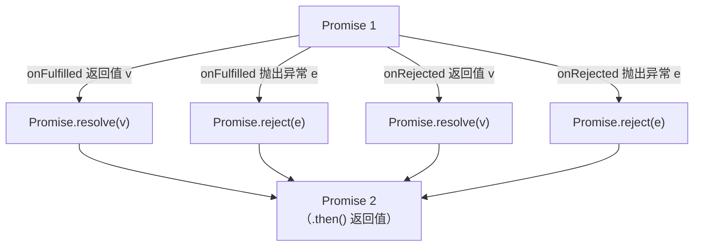

关键规则：

- 若回调返回普通值，新 Promise 状态为 Fulfilled，值为返回值。
- 若回调返回 Promise 或 Thenable，新 Promise 的状态与返回的 Promise 一致。
- 若回调抛出异常，新 Promise 状态为 Rejected，拒因为抛出的错误。
- 若未提供对应状态的回调（如 Fulfilled 状态但未提供 `onFulfilled`），值穿透至下一个 Promise。

### 6.5 错误冒泡机制

Promise 链中的 rejection 会沿链向后传递，直至遇到 `onRejected` 回调或 `.catch()` 方法：

```javascript
Promise.resolve()
  .then(() => { throw new Error('step 1 failed'); })
  .then(() => { console.log('不会执行'); })
  .then(() => { console.log('不会执行'); })
  .catch(err => { console.log(err.message); }); // "step 1 failed"
```

`.catch(onRejected)` 等价于 `.then(undefined, onRejected)`。由于错误冒泡的存在，通常只需在 Promise 链末端设置一个 `.catch()` 即可捕获链中任意环节的错误。

### 6.6 Promise 与微任务

Promise 的回调通过微任务机制执行。当调用 `resolve(value)` 时，V8 引擎不会立即执行 `.then()` 注册的回调，而是将其封装为微任务加入当前宏任务的微任务队列。这一设计源于**回调函数延迟绑定**的需求——在 `resolve()` 被调用时，`.then()` 可能尚未执行，回调函数尚未注册，因此必须延迟执行。

以下代码模拟了 Promise 的核心机制（简化版）：

```javascript
class Bromise {
  constructor(executor) {
    this.onResolve_ = null;
    this.onReject_ = null;

    const resolve = (value) => {
      // 使用微任务延迟执行，而非 setTimeout
      queueMicrotask(() => this.onResolve_(value));
    };

    const reject = (reason) => {
      queueMicrotask(() => this.onReject_(reason));
    };

    executor(resolve, reject);
  }

  then(onResolve, onReject) {
    this.onResolve_ = onResolve;
    this.onReject_ = onReject;
  }
}
```

使用 `queueMicrotask` 而非 `setTimeout` 的原因：微任务在当前宏任务末尾执行，时序更精确，且避免了宏任务队列中可能插入其他任务导致的延迟。

### 6.7 Promise.withResolvers()（ES2024）

ES2024 引入的 `Promise.withResolvers()` 提供了一种将 Promise 的 `resolve` 和 `reject` 函数暴露到外部的方式，避免了传统的"在 executor 中捕获 resolve/reject"模式：

```javascript
// 传统模式
let resolve, reject;
const promise = new Promise((res, rej) => {
  resolve = res;
  reject = rej;
});

// Promise.withResolvers()
const { promise, resolve, reject } = Promise.withResolvers();

// 使用场景：将回调式 API 转换为 Promise
function readStream(stream) {
  const { promise, resolve, reject } = Promise.withResolvers();
  const reader = stream.getReader();
  const chunks = [];

  function pump() {
    reader.read().then(({ done, value }) => {
      if (done) { resolve(chunks); return; }
      chunks.push(value);
      pump();
    }).catch(reject);
  }
  pump();
  return promise;
}
```

`Promise.withResolvers()` 的优势在于 `resolve` 和 `reject` 与 `promise` 在同一作用域声明，语义更清晰，且无需闭包捕获。

### 6.8 Promise 静态方法体系

| 方法 | 说明 |
|------|------|
| `Promise.resolve(value)` | 返回以给定值解析的 Promise |
| `Promise.reject(reason)` | 返回以给定拒因拒绝的 Promise |
| `Promise.all(iterable)` | 全部 Fulfilled 则 Fulfilled；任一 Rejected 则 Rejected |
| `Promise.allSettled(iterable)` | 全部 settled 后 Fulfilled，值为各结果对象数组 |
| `Promise.any(iterable)` | 任一 Fulfilled 则 Fulfilled；全部 Rejected 则 AggregateError |
| `Promise.race(iterable)` | 第一个 settled 的 Promise 决定结果 |
| `Promise.withResolvers()` | 返回 { promise, resolve, reject } 三元组 |

---

## 7 async/await：协程与语法糖

### 7.1 生成器与协程

async/await 的底层技术基础之一是**生成器（Generator）**，而生成器是**协程（Coroutine）**在 JavaScript 中的实现形式。

协程是一种比线程更轻量的并发单元，运行于用户态，由程序自身控制切换。一个线程上可存在多个协程，但同一时刻只有一个协程处于执行状态。协程间的切换通过 `yield`（暂停当前协程，交还控制权）和 `.next()`（恢复目标协程）配合完成。

```javascript
function* genDemo() {
  console.log('执行第一段');
  yield 'result 1';

  console.log('执行第二段');
  yield 'result 2';

  console.log('执行第三段');
  return 'done';
}

const gen = genDemo();
console.log(gen.next()); // { value: 'result 1', done: false }
console.log(gen.next()); // { value: 'result 2', done: false }
console.log(gen.next()); // { value: 'done', done: true }
```

协程切换时，V8 引擎保存当前协程的调用栈信息并恢复目标协程的调用栈信息，这一过程完全在用户态完成，不涉及内核态切换，因此开销极低。

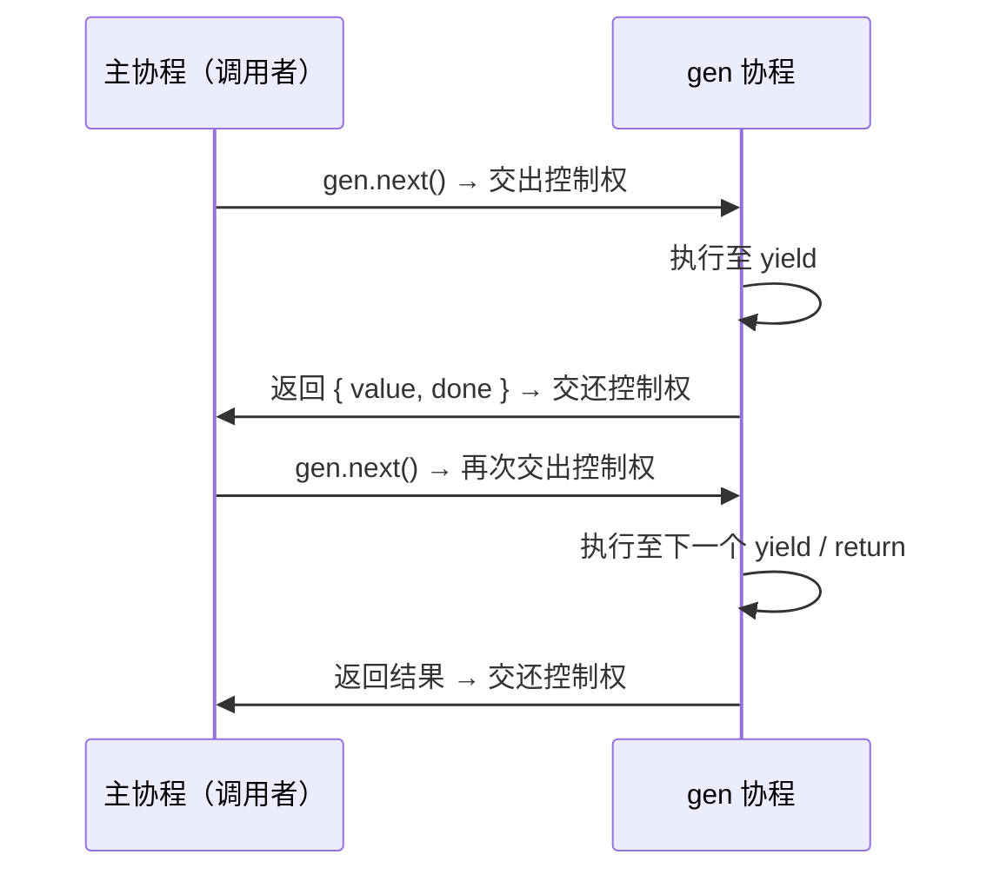

### 7.2 async 函数

`async` 关键字修饰的函数具有两个核心特征：

1. **异步执行**：函数体内的代码在协程中执行，可通过 `await` 暂停。
2. **隐式返回 Promise**：`async` 函数的返回值自动通过 `Promise.resolve()` 包装。

```javascript
async function foo() {
  return 2;
}
console.log(foo()); // Promise { <fulfilled>: 2 }
```

即使 `async` 函数内部未使用 `await`，其返回值依然是 Promise 对象。

### 7.3 await 的执行机制

`await` 表达式的执行过程是 async/await 的核心。以下面代码为例：

```javascript
async function foo() {
  console.log(1);
  const a = await 100;
  console.log(a);
  console.log(2);
}

console.log(0);
foo();
console.log(3);
```

执行流程：

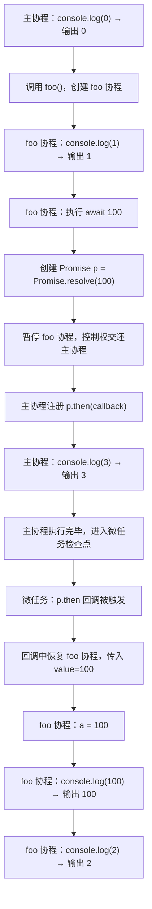

输出顺序：`0 → 1 → 3 → 100 → 2`

`await` 的本质操作可分解为：

1. 将 `await` 后的表达式值包装为 Promise（若已是 Promise 则直接使用）。
2. 暂停当前 async 函数的协程执行，将控制权交还调用者（父协程）。
3. 注册 `.then()` 回调，当 Promise settled 时恢复协程执行。
4. 回调通过微任务机制触发，确保在当前宏任务的微任务检查点执行。

### 7.4 async/await 的错误处理

async/await 允许使用 `try...catch` 语法处理异步错误，这是其相对于 Promise 链式 `.catch()` 的主要语法优势：

```javascript
async function fetchData() {
  try {
    const response1 = await fetch('https://api.example.com/data1');
    const data1 = await response1.json();

    const response2 = await fetch('https://api.example.com/data2');
    const data2 = await response2.json();

    return { data1, data2 };
  } catch (error) {
    // 捕获任意 await 的 rejection 或同步异常
    console.error('请求失败:', error);
    throw error; // 可选择重新抛出
  }
}
```

`try...catch` 能捕获 `await` 表达式的 rejection，其机制是：当 awaited Promise 被 reject 时，V8 引擎将 rejection reason 作为异常抛出到协程的执行上下文中，由 `catch` 块捕获。

### 7.5 Top-level await（ES2022）

ES2022 允许在模块的顶层直接使用 `await`，无需包裹在 `async` 函数中：

```javascript
// module.mjs（顶层 await 仅在 ES Module 中可用）
const config = await fetch('/config.json').then(r => r.json());
const db = await connectDatabase(config.dbUrl);

export { db };
```

Top-level await 的语义：

- **模块级阻塞**：使用顶层 `await` 的模块会等待 awaited Promise settled 后再执行后续模块代码，但不会阻塞同一模块中不依赖该 await 的其他导出。
- **依赖模块延迟**：导入该模块的父模块会等待其完成，形成依赖图的异步解析。
- **仅限 ES Module**：CommonJS 模块不支持顶层 `await`。

---

## 8 Scheduler API 与任务优先级调度

### 8.1 Scheduler API 概述

Scheduler API（`scheduler.postTask()` 和 `scheduler.yield()`）是浏览器提供的显式任务优先级调度接口，允许开发者以比 `setTimeout` 更精细的方式控制任务执行顺序：

```javascript
// scheduler.postTask — 按优先级调度任务
const controller = new TaskController({ priority: 'user-blocking' });

scheduler.postTask(() => {
  // 高优先级任务：用户交互响应
  updateUI();
}, { priority: 'user-blocking', signal: controller.signal });

scheduler.postTask(() => {
  // 普通优先级任务：数据加载
  loadData();
}, { priority: 'user-visible' });

scheduler.postTask(() => {
  // 低优先级任务：日志上报
  sendAnalytics();
}, { priority: 'background' });
```

优先级层级（从高到低）：

| 优先级 | 说明 | 典型场景 |
|--------|------|----------|
| `user-blocking` | 最高优先级 | 用户交互响应、关键 UI 更新 |
| `user-visible` | 普通优先级 | 数据加载、非关键 UI 更新 |
| `background` | 最低优先级 | 日志上报、预加载、垃圾回收 |

### 8.2 scheduler.yield()

`scheduler.yield()` 用于主动让出主线程，允许更高优先级的任务插入执行，随后恢复当前任务：

```javascript
async function processLargeDataset(items) {
  for (const item of items) {
    processItem(item);
    // 每处理一项后让出主线程，保持页面响应性
    await scheduler.yield();
  }
}
```

与 `setTimeout(fn, 0)` 的区别：`scheduler.yield()` 返回的 Promise 在让出后优先恢复当前任务（而非排到宏任务队列末尾），且可被更高优先级任务抢占。

### 8.3 TaskController 与任务取消

Scheduler API 的 `TaskController` 与 `AbortController` 类似，支持取消已调度的任务：

```javascript
const controller = new TaskController({ priority: 'user-visible' });

const taskId = scheduler.postTask(() => {
  performLongOperation();
}, { signal: controller.signal });

// 取消任务
controller.abort();

// 动态调整优先级
controller.setPriority('background');
```

---

## 9 异步迭代器与 for await...of

### 9.1 异步迭代协议

ES2018 引入的异步迭代器（Async Iterator）协议扩展了同步迭代器，支持异步数据源的消费。异步迭代器对象需实现 `[Symbol.asyncIterator]()` 方法，返回一个 `{ next() }` 对象，其 `next()` 方法返回 `Promise<{ value, done }>`：

```javascript
// 自定义异步可迭代对象
class AsyncRange {
  constructor(start, end, delay) {
    this.start = start;
    this.end = end;
    this.delay = delay;
  }

  [Symbol.asyncIterator]() {
    let current = this.start;
    const end = this.end;
    const delay = this.delay;

    return {
      async next() {
        if (current <= end) {
          await new Promise(resolve => setTimeout(resolve, delay));
          return { value: current++, done: false };
        }
        return { value: undefined, done: true };
      }
    };
  }
}

// 使用 for await...of 消费
(async () => {
  for await (const num of new AsyncRange(1, 5, 1000)) {
    console.log(num); // 每秒输出 1, 2, 3, 4, 5
  }
})();
```

### 9.2 异步生成器

异步生成器函数（`async function*`）结合了 `async` 和 `function*` 的特性，可使用 `await` 和 `yield`：

```javascript
async function* fetchPages(baseUrl) {
  let page = 1;
  while (true) {
    const response = await fetch(`${baseUrl}?page=${page}`);
    const data = await response.json();

    if (data.length === 0) return;
    yield data;
    page++;
  }
}

// 消费异步生成器
for await (const page of fetchPages('https://api.example.com/items')) {
  for (const item of page) {
    render(item);
  }
}
```

### 9.3 异步迭代与流式处理

异步迭代器与 Web Streams API 天然契合，`ReadableStream` 本身即为异步可迭代对象：

```javascript
async function readStream(url) {
  const response = await fetch(url);
  const reader = response.body.getReader();
  const decoder = new TextDecoder();

  for await (const chunk of response.body) {
    const text = decoder.decode(chunk, { stream: true });
    processText(text);
  }
}
```

---

## 10 综合执行流程分析

### 10.1 完整的事件循环时序图

以下展示一个包含多种异步操作的事件循环完整时序：

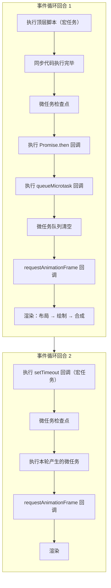

### 10.2 综合示例

```javascript
async function asyncTask() {
  console.log('asyncTask start');
  await Promise.resolve();
  console.log('asyncTask after await');
}

console.log('script start');

setTimeout(() => {
  console.log('setTimeout 1');

  Promise.resolve().then(() => {
    console.log('promise inside setTimeout');
  });
}, 0);

requestAnimationFrame(() => {
  console.log('rAF callback');
});

asyncTask();

new Promise((resolve) => {
  console.log('promise executor');
  resolve();
}).then(() => {
  console.log('promise then 1');
}).then(() => {
  console.log('promise then 2');
});

queueMicrotask(() => {
  console.log('microtask');
});

console.log('script end');
```

输出顺序及分析（Node 24 实测）：

```
script start              ← 同步执行
asyncTask start           ← 同步执行（进入 async 函数）
promise executor          ← 同步执行（Promise executor 立即执行）
script end                ← 同步执行完毕

--- 微任务检查点 ---
asyncTask after await     ← await 恢复协程（微任务，asyncTask() 调用时最先注册）
promise then 1            ← 第一个 .then() 回调（微任务）
microtask                 ← queueMicrotask 回调（微任务）
promise then 2            ← 第二个 .then() 回调（微任务，由第一个 .then 返回的 Promise 触发）

--- requestAnimationFrame ---
rAF callback              ← rAF 回调（渲染前）

--- 下一宏任务 ---
setTimeout 1              ← setTimeout 回调（宏任务）
promise inside setTimeout ← 宏任务内产生的微任务
```

### 10.3 MutationObserver 的微任务应用

MutationObserver 是微任务机制在 DOM 监听领域的典型应用。其设计经历了三个阶段：

1. **轮询检测**：使用 `setTimeout`/`setInterval` 定时检查 DOM 变更，实时性差或性能浪费。
2. **Mutation Events**：DOM 变更时同步触发回调，实时性好但性能极差（频繁触发导致页面卡顿）。
3. **MutationObserver**：采用"异步 + 微任务"策略——DOM 变更记录被收集并封装为微任务，在当前宏任务末尾批量处理，兼顾实时性与性能。

```javascript
const observer = new MutationObserver((mutations) => {
  // mutations 为自上次回调以来的所有变更记录
  mutations.forEach(mutation => {
    console.log('DOM 变更类型:', mutation.type);
  });
});

observer.observe(document.getElementById('container'), {
  childList: true,
  attributes: true,
  subtree: true,
});
```

---

## 10.4 用 Chrome DevTools 调试事件循环

理解宏任务与微任务的调度，最直观的方式是在 Performance 面板中观察它们的实际执行时机。Performance 面板能清晰展示 Event Loop 的执行过程：

1. 打开 Chrome DevTools → Performance 面板。
2. 点击录制按钮。
3. 执行一段包含宏任务和微任务的代码。
4. 停止录制，在火焰图中观察。

在 Main 轨道火焰图中可以看到：

- Main 线程上任务的执行顺序。
- 宏任务（Scripting 黄色块）与微任务（紧跟在宏任务后的短任务）的执行时机。
- 渲染帧（绿色块）的位置。

> **2024-2026 更新**：Chrome DevTools Performance 面板新增了 **Interactions** 轨道，可以可视化用户交互事件（click、keydown 等）与 Event Loop 的关系，帮助分析 INP（Interaction to Next Paint）性能指标。

### 实战：观察宏任务嵌套微任务

以下代码同时包含宏任务与微任务，可用于在 Performance 面板中验证执行顺序：

```javascript
console.log('1: 同步代码');

setTimeout(() => {
    console.log('2: 宏任务 setTimeout');
    Promise.resolve().then(() => {
        console.log('3: 微任务（在宏任务中）');
    });
}, 0);

Promise.resolve().then(() => {
    console.log('4: 微任务 Promise');
    Promise.resolve().then(() => {
        console.log('5: 微任务中的微任务');
    });
});

console.log('6: 同步代码');
```

**执行顺序**：`1` → `6` → `4` → `5` → `2` → `3`。

在 Performance 面板的 Main 轨道中可以看到两个宏任务，每个宏任务内部都紧跟微任务：

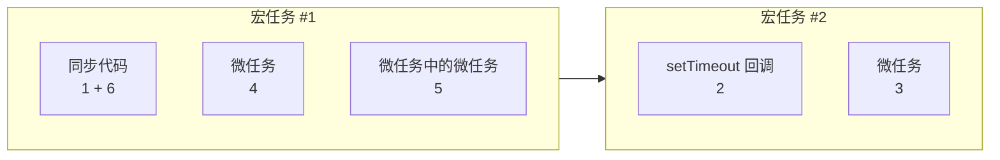

### 实战：观察 async/await 的执行顺序

```javascript
async function async1() {
    console.log('async1 start');
    await async2();
    console.log('async1 end');  // 微任务
}
async function async2() { console.log('async2'); }

console.log('script start');
setTimeout(() => { console.log('setTimeout'); }, 0);
async1();
new Promise((resolve) => {
    console.log('promise1');
    resolve();
}).then(() => { console.log('promise2'); });
console.log('script end');
```

**执行顺序**：

```
script start → async1 start → async2 → promise1 → script end
async1 end（微任务）→ promise2（微任务）→ setTimeout（宏任务）
```

**关键点**：`await async2()` 之后的代码等价于 `.then()`，属于微任务，在同步代码之后执行。可在 Performance 面板中观察到 `async1 end` 与 `promise2` 同处微任务检查点。

---

## 10.5 Vue nextTick：微任务的应用

理解了事件循环的原理，就能明白为什么 Vue 的 `nextTick` 优先使用 `Promise` 而不是 `setTimeout`：

```javascript
// Vue 3 的 nextTick 实现（简化版）
const resolvedPromise = Promise.resolve();
let currentFlushPromise = null;

export function nextTick(fn) {
    const p = currentFlushPromise || resolvedPromise;
    return fn ? p.then(fn) : p;
}
```

**为什么优先用 Promise？**

因为 `Promise.then` 是微任务，会在当前宏任务结束后立即执行，而 `setTimeout` 是宏任务，要等到下一次 Event Loop 迭代才执行。Vue 更新 DOM 后需要尽快执行回调来读取更新后的 DOM，微任务比宏任务更快。

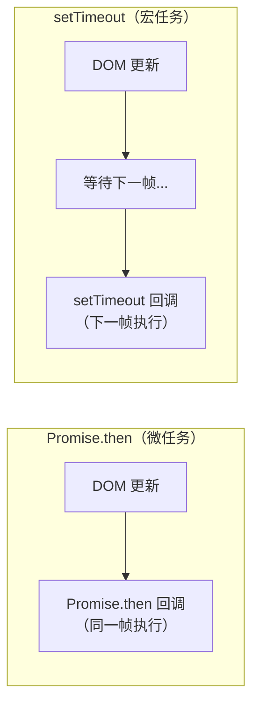

**批处理时序**：Vue 用 `nextTick`（微任务）延迟 DOM 更新，确保同一宏任务内的多次数据变更只触发一次 DOM 更新：

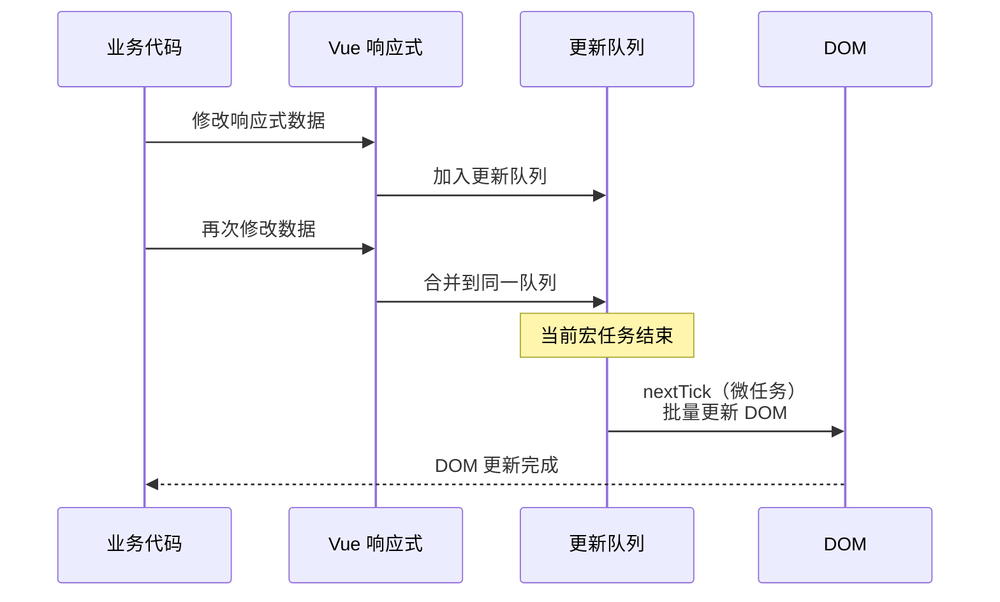

> 关于 `process.nextTick` 与 Vue nextTick 的详细原理，参见本目录《13-核心原理-nextTick原理》。

---

## 11 异步编程范式演进总结

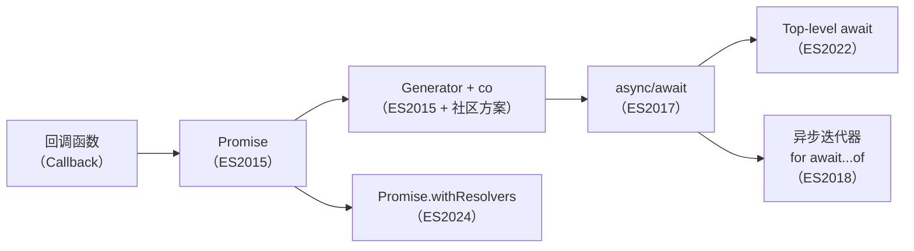

| 阶段 | 核心机制 | 优势 | 局限 |
|------|----------|------|------|
| 回调函数 | 异步回调 | 简单直接 | 回调地狱、错误处理分散 |
| Promise | 微任务 + 链式调用 | 消除嵌套、错误冒泡 | 语义不够直观、大量 `.then()` |
| Generator + co | 协程 + 执行器 | 同步风格编写 | 需要执行器包装、非语言原生 |
| async/await | 协程 + Promise + 语法糖 | 原生同步风格、try/catch | 需理解底层微任务时序 |
| Top-level await | 模块级异步等待 | 简化模块初始化 | 仅限 ES Module、可能阻塞依赖图 |
| 异步迭代器 | 异步迭代协议 | 流式消费异步数据源 | 需理解异步迭代协议 |

---

## 12 关键技术要点速查

### 12.1 事件循环核心规则

1. 每个宏任务拥有独立的微任务队列。
2. 微任务在当前宏任务结束后、下一宏任务开始前全部清空。
3. 微任务执行期间新产生的微任务在本轮继续执行。
4. `requestAnimationFrame` 在微任务之后、渲染之前执行。
5. `requestIdleCallback` 在帧空闲时段执行，单次最大 50ms。

### 12.2 定时器精度规则

1. `setTimeout(fn, 0)` 实际最小延迟为 0ms（非嵌套）或 4ms（嵌套深度 ≥ 5）。
2. 后台标签页最小延迟为 1000ms。
3. 延迟值上限为 2,147,483,647ms（约 24.8 天），超出视为 0。
4. `setInterval` 不保证精确间隔，推荐递归 `setTimeout` 替代。

### 12.3 Promise 核心规则

1. 状态转换单向：Pending → Fulfilled / Rejected，不可逆。
2. `.then()` 始终返回新 Promise，实现链式调用。
3. Thenable 对象会被递归解析。
4. 未处理的 rejection 会冒泡至链末端。
5. Promise 回调通过微任务执行。

### 12.4 async/await 核心规则

1. `async` 函数隐式返回 Promise。
2. `await` 暂停当前协程，交还控制权给调用者。
3. `await` 的恢复通过微任务触发（`.then()` 回调）。
4. `try...catch` 可捕获 `await` 的 rejection。
5. Top-level await 仅在 ES Module 中可用。

### 12.5 新特性速查

| 特性 | 标准版本 | 核心用途 |
|------|----------|----------|
| `Promise.allSettled` | ES2020 | 等待所有 Promise 完成（不论成功失败） |
| `Promise.any` | ES2021 | 竞争首个成功的 Promise |
| `Top-level await` | ES2022 | 模块顶层直接使用 await |
| `Promise.withResolvers()` | ES2024 | 外部暴露 resolve/reject |
| `scheduler.postTask` | 2023+ | 显式优先级任务调度 |
| `scheduler.yield` | 2023+ | 主动让出主线程 |
| `AbortController` | 2020+ | 统一的异步操作取消机制 |
| `for await...of` | ES2018 | 异步可迭代对象消费 |
| `async function*` | ES2018 | 异步生成器函数 |
