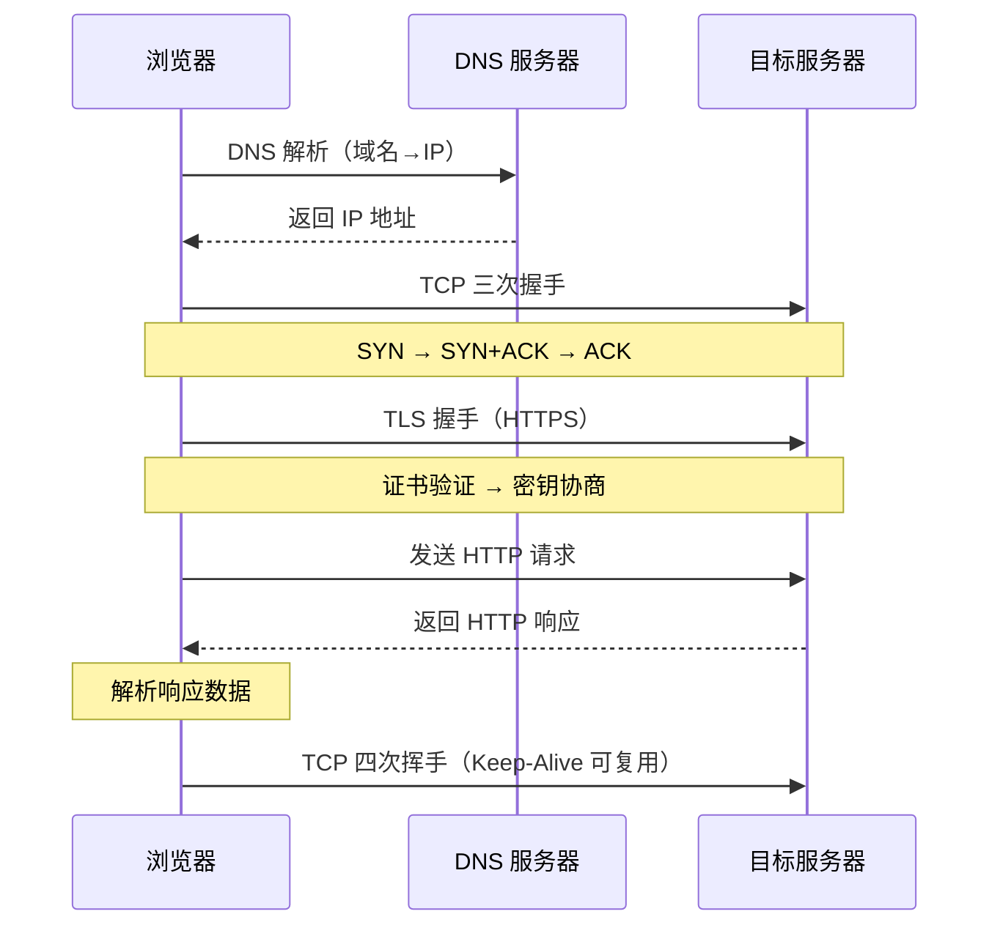

# Ajax 基础

> Ajax（Asynchronous JavaScript and XML）是前端与服务器异步通信的核心技术。从 XMLHttpRequest 到 Fetch API，再到第三方库 Axios，HTTP 请求方式经历了从回调到 Promise 的演进。理解 Ajax 的底层原理是掌握网络请求的基础。

## HTTP 请求生命周期



> 📊 图表解读：一次完整的 HTTP 请求经历 DNS 解析 → TCP 握手 → TLS 握手（HTTPS）→ 请求/响应 → 连接关闭。其中 DNS 解析和 TCP/TLS 握手是性能优化的关键环节，可通过 DNS 预解析、HTTP/2 多路复用等手段优化。

> Ajax（Asynchronous JavaScript and XML，异步 JavaScript 和 XML）是一种创建交互式网页应用的网页开发技术，允许网页在不刷新的情况下与服务器交换数据并更新部分页面内容。

## 概述

### 什么是 Ajax

Ajax 不是一种单一的技术，而是多种技术的组合：

| 技术 | 作用 |
|------|------|
| HTML/XHTML | 页面结构和内容 |
| CSS | 页面样式 |
| JavaScript | 操作 DOM、发送请求、处理响应 |
| XMLHttpRequest | 与服务器异步通信 |
| XML/JSON | 数据交换格式 |

### Ajax 工作原理

```
┌─────────────┐                      ┌─────────────┐
│   浏览器     │                      │   服务器     │
│             │                      │             │
│  ┌───────┐  │   1. 发送请求          │             │
│  │ 用户   │  │ ──────────────────────▶│             │
│  │ 操作   │  │                      │             │
│  └───────┘  │   2. 处理请求          │             │
│      ↓      │ ◀──────────────────────│  ┌───────┐  │
│  ┌───────┐  │   3. 返回数据          │  │ 数据库 │  │
│  │XHR异步│  │                      │  └───────┘  │
│  │ 请求  │  │                      │             │
│  └───────┘  │   4. 更新页面（无刷新）  │             │
│      ↓      │ ──────────────────────▶│             │
│  ┌───────┐  │                      │             │
│  │ 更新  │  │                      │             │
│  │ DOM   │  │                      │             │
│  └───────┘  │                      │             │
└─────────────┘                      └─────────────┘
```

### Ajax 的优势与局限

**优势：**

- 无需刷新页面即可更新数据，用户体验好
- 异步通信，不阻塞用户操作
- 按需获取数据，减少网络传输量
- 前后端分离，便于维护

**局限：**

- 不支持浏览器后退按钮（需要额外处理）
- 搜索引擎优化（SEO）困难
- 存在跨域限制
- 对 JavaScript 依赖性强

---

## 一、XMLHttpRequest 对象

XMLHttpRequest（简称 XHR）是实现 Ajax 的核心 API，用于在浏览器与服务器之间传输数据。

### 创建 XHR 对象

```javascript
// 现代浏览器
const xhr = new XMLHttpRequest();

// 兼容 IE6 及更早版本（已淘汰，仅作了解）
// const xhr = new ActiveXObject('Microsoft.XMLHTTP');
```

### 基本用法

```javascript
const xhr = new XMLHttpRequest();

// 1. 配置请求
xhr.open('GET', '/api/data', true);

// 2. 设置响应类型
xhr.responseType = 'json';

// 3. 监听状态变化
xhr.onreadystatechange = function() {
  if (xhr.readyState === 4) {
    if (xhr.status === 200) {
      console.log('请求成功:', xhr.response);
    } else {
      console.error('请求失败:', xhr.status, xhr.statusText);
    }
  }
};

// 4. 监听网络错误
xhr.onerror = function() {
  console.error('网络错误，请检查网络连接');
};

// 5. 发送请求
xhr.send();
```

### readyState 状态

`readyState` 属性表示请求的当前状态：

| 值 | 状态常量 | 说明 | 触发时机 |
|---|---------|------|---------|
| 0 | UNSENT | 未打开 | XHR 对象创建后 |
| 1 | OPENED | 已打开 | 调用 `open()` 后 |
| 2 | HEADERS_RECEIVED | 已获取响应头 | 接收到响应头后 |
| 3 | LOADING | 正在下载响应体 | 正在接收响应体 |
| 4 | DONE | 完成 | 响应体下载完成 |

**状态变化流程：**

```
UNSENT(0) → OPENED(1) → HEADERS_RECEIVED(2) → LOADING(3) → DONE(4)
```

### 事件监听方式对比

```javascript
// 方式一：onreadystatechange（传统方式）
xhr.onreadystatechange = function() {
  if (xhr.readyState === 4 && xhr.status === 200) {
    console.log(xhr.response);
  }
};

// 方式二：onload/onerror（推荐，更简洁）
xhr.onload = function() {
  if (xhr.status === 200) {
    console.log(xhr.response);
  }
};
xhr.onerror = function() {
  console.error('请求失败');
};

// 方式三：addEventListener（可绑定多个监听器）
xhr.addEventListener('load', function() {
  if (xhr.status === 200) {
    console.log(xhr.response);
  }
});
xhr.addEventListener('error', function() {
  console.error('请求失败');
});
```

---

## 二、发送请求

### GET 请求

GET 请求用于获取数据，参数通过 URL 查询字符串传递：

```javascript
function get(url, params) {
  return new Promise((resolve, reject) => {
    const xhr = new XMLHttpRequest();

    // 构建查询字符串
    const query = params ? new URLSearchParams(params).toString() : '';
    const fullUrl = query ? `${url}?${query}` : url;

    xhr.open('GET', fullUrl, true);
    xhr.responseType = 'json';

    xhr.onload = function() {
      if (xhr.status >= 200 && xhr.status < 300) {
        resolve(xhr.response);
      } else {
        reject(new Error(`请求失败，状态码: ${xhr.status}`));
      }
    };

    xhr.onerror = function() {
      reject(new Error('网络错误'));
    };

    xhr.send();
  });
}

// 使用
try {
  const data = await get('/api/users', { page: 1, limit: 10 });
  console.log(data);
} catch (error) {
  console.error(error);
}
```

**手动构建查询字符串：**

```javascript
// 方法一：URLSearchParams（推荐）
const params = new URLSearchParams({ name: '张三', age: 25 });
console.log(params.toString()); // name=%E5%BC%A0%E4%B8%89&age=25

// 方法二：Object.entries + encodeURIComponent
function buildQueryString(obj) {
  return Object.entries(obj)
    .map(([key, value]) => `${encodeURIComponent(key)}=${encodeURIComponent(value)}`)
    .join('&');
}

// 方法三：URL 对象
const url = new URL('https://example.com/api');
url.searchParams.set('page', 1);
url.searchParams.set('limit', 10);
console.log(url.toString()); // https://example.com/api?page=1&limit=10
```

### POST 请求

POST 请求用于提交数据，数据通过请求体传递：

```javascript
function post(url, data) {
  return new Promise((resolve, reject) => {
    const xhr = new XMLHttpRequest();

    xhr.open('POST', url, true);
    xhr.setRequestHeader('Content-Type', 'application/json');
    xhr.responseType = 'json';

    xhr.onload = function() {
      if (xhr.status >= 200 && xhr.status < 300) {
        resolve(xhr.response);
      } else {
        reject(new Error(`请求失败: ${xhr.status}`));
      }
    };

    xhr.onerror = () => reject(new Error('网络错误'));
    xhr.send(JSON.stringify(data));
  });
}

// 使用示例
try {
  const result = await post('/api/users', { name: 'Alice', email: 'alice@example.com' });
  console.log(result);
} catch (error) {
  console.error(error);
}
```

### 常见 Content-Type 类型

| Content-Type | 说明 | 数据格式 |
|--------------|------|---------|
| `application/json` | JSON 格式 | `{"name":"Alice"}` |
| `application/x-www-form-urlencoded` | 表单默认格式 | `name=Alice&age=25` |
| `multipart/form-data` | 文件上传 | 分段数据 |
| `text/plain` | 纯文本 | 纯文本内容 |

**发送表单数据：**

```javascript
function postForm(url, data) {
  return new Promise((resolve, reject) => {
    const xhr = new XMLHttpRequest();

    xhr.open('POST', url, true);
    xhr.setRequestHeader('Content-Type', 'application/x-www-form-urlencoded');

    xhr.onload = function() {
      if (xhr.status >= 200 && xhr.status < 300) {
        resolve(xhr.response);
      } else {
        reject(new Error(`请求失败: ${xhr.status}`));
      }
    };

    xhr.onerror = () => reject(new Error('网络错误'));

    // 发送表单格式数据
    const formData = new URLSearchParams(data).toString();
    xhr.send(formData);
  });
}

// 使用
await postForm('/api/login', { username: 'admin', password: '123456' });
```

### 其他 HTTP 方法

```javascript
// PUT - 更新资源
async function put(url, data) {
  const xhr = new XMLHttpRequest();
  xhr.open('PUT', url, true);
  xhr.setRequestHeader('Content-Type', 'application/json');
  xhr.send(JSON.stringify(data));
}

// DELETE - 删除资源
async function del(url) {
  const xhr = new XMLHttpRequest();
  xhr.open('DELETE', url, true);
  xhr.send();
}

// PATCH - 部分更新
async function patch(url, data) {
  const xhr = new XMLHttpRequest();
  xhr.open('PATCH', url, true);
  xhr.setRequestHeader('Content-Type', 'application/json');
  xhr.send(JSON.stringify(data));
}
```

---

## 三、文件上传

### 基本文件上传

```javascript
function uploadFile(url, file) {
  return new Promise((resolve, reject) => {
    const xhr = new XMLHttpRequest();
    const formData = new FormData();
    formData.append('file', file);

    xhr.open('POST', url, true);

    // 上传进度
    xhr.upload.onprogress = function(e) {
      if (e.lengthComputable) {
        const percent = (e.loaded / e.total) * 100;
        console.log(`上传进度: ${percent.toFixed(2)}%`);
      }
    };

    xhr.onload = function() {
      if (xhr.status >= 200 && xhr.status < 300) {
        resolve(xhr.response);
      } else {
        reject(new Error(`上传失败，状态码: ${xhr.status}`));
      }
    };

    xhr.onerror = function() {
      reject(new Error('网络错误'));
    };

    xhr.send(formData);
  });
}

// 使用
async function upload() {
  try {
    const fileInput = document.getElementById('fileInput');
    const result = await uploadFile('/api/upload', fileInput.files[0]);
    console.log('上传成功:', result);
  } catch (error) {
    console.error('上传失败:', error);
  }
}
```

### 带进度显示的文件上传

```html
<!-- HTML 结构 -->
<input type="file" id="fileInput" />
<div id="progressContainer" style="display: none;">
  <progress id="progressBar" value="0" max="100"></progress>
  <span id="progressText">0%</span>
</div>
<div id="uploadResult"></div>
```

```javascript
function uploadWithProgress(url, file, onProgress) {
  return new Promise((resolve, reject) => {
    const xhr = new XMLHttpRequest();
    const formData = new FormData();
    formData.append('file', file);

    xhr.open('POST', url, true);

    // 上传进度回调
    xhr.upload.onprogress = function(e) {
      if (e.lengthComputable) {
        const percent = Math.round((e.loaded / e.total) * 100);
        onProgress(percent, e.loaded, e.total);
      }
    };

    xhr.onload = function() {
      if (xhr.status >= 200 && xhr.status < 300) {
        resolve(xhr.response);
      } else {
        reject(new Error(`上传失败，状态码: ${xhr.status}`));
      }
    };

    xhr.onerror = function() {
      reject(new Error('网络错误'));
    };

    xhr.send(formData);
  });
}

// 使用带进度的上传
async function uploadFileWithProgress(file) {
  try {
    const progressBar = document.getElementById('progressBar');
    const progressText = document.getElementById('progressText');
    const result = await uploadWithProgress('/api/upload', file, (percent) => {
      progressBar.value = percent;
      progressText.textContent = percent + '%';
    });
    document.getElementById('uploadResult').textContent = '上传完成: ' + result.name;
  } catch (error) {
    console.error('上传失败:', error);
  }
}

// 格式化文件大小
function formatSize(bytes) {
  if (bytes < 1024) return bytes + ' B';
  if (bytes < 1024 * 1024) return (bytes / 1024).toFixed(2) + ' KB';
  return (bytes / (1024 * 1024)).toFixed(2) + ' MB';
}
```

### 多文件上传

```javascript
function uploadMultipleFiles(url, files) {
  return new Promise((resolve, reject) => {
    const xhr = new XMLHttpRequest();
    const formData = new FormData();

    // 添加多个文件
    Array.from(files).forEach((file, index) => {
      formData.append('files', file); // 使用相同字段名
      // 或使用不同字段名：formData.append(`file${index}`, file);
    });

    xhr.open('POST', url, true);

    xhr.onload = function() {
      if (xhr.status >= 200 && xhr.status < 300) {
        resolve(xhr.response);
      } else {
        reject(new Error(`上传失败，状态码: ${xhr.status}`));
      }
    };

    xhr.onerror = function() {
      reject(new Error('网络错误'));
    };

    xhr.send(formData);
  });
}

// 使用：多文件选择
const fileInput = document.getElementById('fileInput');
fileInput.addEventListener('change', async function(e) {
  const files = e.target.files;
  if (files.length > 0) {
    const result = await uploadMultipleFiles('/api/upload-multiple', files);
    console.log(result);
  }
});
```

### 拖拽上传

```javascript
const dropZone = document.getElementById('dropZone');

dropZone.addEventListener('dragover', function(e) {
  e.preventDefault();
  dropZone.classList.add('drag-over');
});

dropZone.addEventListener('dragleave', function(e) {
  e.preventDefault();
  dropZone.classList.remove('drag-over');
});

dropZone.addEventListener('drop', async function(e) {
  e.preventDefault();
  dropZone.classList.remove('drag-over');

  const files = e.dataTransfer.files;
  if (files.length > 0) {
    try {
      const result = await uploadMultipleFiles('/api/upload', files);
      console.log('上传成功:', result);
    } catch (error) {
      console.error('上传失败:', error);
    }
  }
});
```

---

## 四、请求头设置

### 设置请求头

```javascript
const xhr = new XMLHttpRequest();
xhr.open('GET', '/api/data', true);

// 设置单个请求头
xhr.setRequestHeader('Authorization', 'Bearer token');
xhr.setRequestHeader('Content-Type', 'application/json');

xhr.send();
```

### 常用请求头

| 请求头 | 说明 | 示例值 |
|--------|------|--------|
| `Content-Type` | 请求体类型 | `application/json` |
| `Authorization` | 认证信息 | `Bearer token` |
| `Accept` | 接受的响应类型 | `application/json` |
| `Cache-Control` | 缓存控制 | `no-cache` |
| `X-Requested-With` | 标识 Ajax 请求 | `XMLHttpRequest` |

### 获取响应头

```javascript
const xhr = new XMLHttpRequest();
xhr.open('GET', '/api/data', true);

xhr.onload = function() {
  // 获取单个响应头
  const contentType = xhr.getResponseHeader('Content-Type');
  console.log('Content-Type:', contentType);

  // 获取所有响应头
  const allHeaders = xhr.getAllResponseHeaders();
  console.log('所有响应头:', allHeaders);
};

xhr.send();
```

### 携带认证信息的请求

```javascript
// 方式一：Bearer Token
xhr.setRequestHeader('Authorization', `Bearer ${token}`);

// 方式二：Basic Auth
const credentials = btoa(`${username}:${password}`);
xhr.setRequestHeader('Authorization', `Basic ${credentials}`);

// 方式三：Cookie（需要服务端配置 CORS）
xhr.withCredentials = true; // 跨域请求携带 Cookie
```

---

## 五、超时与取消

### 超时处理

```javascript
const xhr = new XMLHttpRequest();
xhr.open('GET', '/api/data', true);

// 设置超时时间（毫秒）
xhr.timeout = 5000;

xhr.ontimeout = function() {
  console.error('请求超时，请稍后重试');
};

xhr.onload = function() {
  if (xhr.status === 200) {
    console.log(xhr.response);
  }
};

xhr.send();
```

### 取消请求

```javascript
let xhr = null;

function fetchData() {
  // 取消之前的请求
  if (xhr) {
    xhr.abort();
  }

  xhr = new XMLHttpRequest();
  xhr.open('GET', '/api/data', true);

  xhr.onload = function() {
    if (xhr.status === 200) {
      console.log('数据:', xhr.response);
    } else {
      console.error('请求失败，状态码:', xhr.status);
    }
  };

  xhr.onabort = function() {
    console.log('请求已取消');
  };

  xhr.send();
}

document.getElementById('cancelBtn').addEventListener('click', function() {
  if (xhr) {
    xhr.abort();
    xhr = null;
  }
});
```

### 防抖与节流应用

```javascript
// 搜索输入防抖
let xhr = null;
let timer = null;

const searchInput = document.getElementById('search');
searchInput.addEventListener('input', function(e) {
  const keyword = e.target.value.trim();

  // 清除定时器
  clearTimeout(timer);

  // 取消之前的请求
  if (xhr) {
    xhr.abort();
  }

  // 防抖：延迟 300ms 发送请求
  timer = setTimeout(() => {
    xhr = new XMLHttpRequest();
    xhr.open('GET', `/api/search?q=${encodeURIComponent(keyword)}`, true);
    xhr.onload = function() {
      if (xhr.status === 200) {
        renderResults(xhr.response);
      }
    };
    xhr.send();
  }, 300);
});
```

---

## 六、完整封装

### 基础封装

```javascript
function ajax(options) {
  const {
    url,
    method = 'GET',
    data = null,
    params = null, // GET 请求参数
    headers = {},
    timeout = 0,
    responseType = 'json',
    withCredentials = false,
  } = options;

  return new Promise((resolve, reject) => {
    const xhr = new XMLHttpRequest();

    // 构建 URL（处理 GET 参数）
    let query = '';
    if (params) {
      query = '?' + new URLSearchParams(params).toString();
    }
    const fullUrl = (method === 'GET' && data) 
      ? url + '?' + new URLSearchParams(data).toString() 
      : url + query;

    xhr.open(method, fullUrl, true);
    xhr.timeout = timeout;
    xhr.responseType = responseType;
    xhr.withCredentials = withCredentials;

    // 设置请求头
    Object.entries(headers).forEach(([key, value]) => {
      xhr.setRequestHeader(key, value);
    });

    xhr.onload = function() {
      if (xhr.status >= 200 && xhr.status < 300) {
        resolve(xhr.response);
      } else {
        reject(new Error(`请求失败，状态码: ${xhr.status}`));
      }
    };

    xhr.onerror = function() {
      reject(new Error('网络错误'));
    };

    xhr.ontimeout = function() {
      reject(new Error('请求超时'));
    };

    // 发送请求体（JSON 自动序列化）
    let body = null;
    if (data && method !== 'GET') {
      body = typeof data === 'string' ? data : JSON.stringify(data);
    }
    xhr.send(body);
  });
}

// 使用
const result = await ajax({
  url: '/api/users',
  method: 'POST',
  data: { name: 'Alice', email: 'alice@example.com' },
  headers: { 'Authorization': 'Bearer token' },
});
```

### 高级封装（带拦截器）

```javascript
class Ajax {
  constructor(config = {}) {
    this.baseURL = config.baseURL || '';
    this.timeout = config.timeout || 10000;
    this.headers = config.headers || {};

    // 请求拦截器队列
    this.requestInterceptors = [];
    // 响应拦截器队列
    this.responseInterceptors = [];
  }

  // 注册请求拦截器
  addRequestInterceptor(interceptor) {
    this.requestInterceptors.push(interceptor);
  }

  // 注册响应拦截器
  addResponseInterceptor(interceptor) {
    this.responseInterceptors.push(interceptor);
  }

  // 核心请求方法
  request(config) {
    let newConfig = { ...config, baseURL: this.baseURL, timeout: this.timeout, headers: { ...this.headers, ...config.headers } };

    // 执行请求拦截器
    this.requestInterceptors.forEach((interceptor) => {
      newConfig = interceptor(newConfig) || newConfig;
    });

    return ajax(newConfig).then((response) => {
      let newResponse = response;
      // 执行响应拦截器
      this.responseInterceptors.forEach((interceptor) => {
        newResponse = interceptor(newResponse) || newResponse;
      });
      return newResponse;
    });
  }

  get(url, params) {
    return this.request({ url, method: 'GET', params });
  }

  post(url, data) {
    return this.request({ url, method: 'POST', data });
  }
}

// 使用
const http = new Ajax({ baseURL: '/api' });
http.addRequestInterceptor((config) => {
  console.log('请求拦截器:', config);
  return config;
});
http.addResponseInterceptor((response) => {
  console.log('响应拦截器:', response);
  return response;
});

// 发送请求
const users = await http.get('/users', { page: 1 });
const result = await http.post('/users', { name: 'Alice' });
```

---

## 七、XMLHttpRequest API 参考

### 属性

| 属性 | 类型 | 说明 |
|------|------|------|
| `readyState` | number | 请求状态（0-4） |
| `status` | number | HTTP 状态码（如 200、404） |
| `statusText` | string | 状态文本（如 "OK"） |
| `response` | any | 响应体内容 |
| `responseType` | string | 响应类型 |
| `responseText` | string | 响应文本（仅文本响应） |
| `responseXML` | Document | 响应 XML 文档 |
| `timeout` | number | 超时时间（毫秒） |
| `withCredentials` | boolean | 跨域请求是否携带凭证 |
| `upload` | XMLHttpRequestUpload | 上传对象（用于监听上传进度） |

### responseType 支持的类型

| 类型 | 说明 |
|------|------|
| `""` | 空字符串，默认值，同 `text` |
| `text` | 文本字符串 |
| `json` | JSON 对象 |
| `document` | XML 或 HTML 文档 |
| `blob` | 二进制 Blob 对象 |
| `arraybuffer` | ArrayBuffer 对象 |

### 方法

| 方法 | 说明 |
|------|------|
| `open(method, url, async)` | 初始化请求 |
| `send(data)` | 发送请求 |
| `abort()` | 取消请求 |
| `setRequestHeader(name, value)` | 设置请求头 |
| `getResponseHeader(name)` | 获取指定响应头 |
| `getAllResponseHeaders()` | 获取所有响应头 |
| `overrideMimeType(mime)` | 覆盖响应的 MIME 类型 |

### 事件

| 事件 | 说明 |
|------|------|
| `onreadystatechange` | `readyState` 变化时触发 |
| `onload` | 请求成功完成时触发 |
| `onerror` | 请求失败时触发 |
| `onprogress` | 数据传输中触发 |
| `onabort` | 请求被取消时触发 |
| `ontimeout` | 请求超时时触发 |
| `onloadstart` | 请求开始时触发 |
| `onloadend` | 请求结束时触发（无论成功或失败） |

---

## 八、常见问题解答

### 1. 如何处理跨域问题？

**问题描述：** 浏览器出于安全考虑，限制跨域请求（同源策略）。

**解决方案：**

```javascript
// 方案一：服务器设置 CORS 响应头
// Access-Control-Allow-Origin: *
// Access-Control-Allow-Methods: GET, POST, PUT, DELETE
// Access-Control-Allow-Headers: Content-Type, Authorization

// 方案二：携带凭证的跨域请求
const xhr = new XMLHttpRequest();
xhr.withCredentials = true; // 携带 Cookie
xhr.open('GET', 'https://api.example.com/data', true);
xhr.send();

// 方案三：JSONP（仅支持 GET 请求，已淘汰）
function jsonp(url, callback) {
  const script = document.createElement('script');
  const callbackName = 'jsonp_' + Date.now();

  window[callbackName] = function(data) {
    callback(data);
    delete window[callbackName];
    document.body.removeChild(script);
  };

  script.src = `${url}?callback=${callbackName}`;
  document.body.appendChild(script);
}
```

### 2. GET 和 POST 请求的区别？

| 特性 | GET | POST |
|------|-----|------|
| 参数位置 | URL 查询字符串 | 请求体 |
| 参数长度 | 受 URL 长度限制 | 无限制 |
| 缓存 | 可被缓存 | 默认不缓存 |
| 安全性 | 参数暴露在 URL | 参数在请求体 |
| 幂等性 | 幂等 | 非幂等 |
| 用途 | 获取数据 | 提交数据 |

### 3. 如何处理请求并发限制？

```javascript
// 并发请求控制
async function concurrentRequest(urls, maxConcurrent = 3) {
  const results = [];
  let index = 0;

  async function processQueue() {
    while (index < urls.length) {
      const currentIndex = index++;
      const url = urls[currentIndex];

      try {
        const response = await ajax({ url });
        results[currentIndex] = response;
      } catch (error) {
        results[currentIndex] = { error: error.message };
      }
    }
  }

  // 启动 maxConcurrent 个并发 worker
  const workers = Array.from({ length: Math.min(maxConcurrent, urls.length) }, processQueue);
  await Promise.all(workers);
  return results;
}

// 使用示例
const urls = ['/api/1', '/api/2', '/api/3', '/api/4', '/api/5'];
const results = await concurrentRequest(urls, 2); // 最多 2 个并发
```

### 4. 如何实现请求重试？

```javascript
async function requestWithRetry(url, options = {}, retries = 3, delay = 1000) {
  for (let i = 0; i < retries; i++) {
    try {
      const response = await ajax({ url, ...options });
      return response;
    } catch (error) {
      if (i === retries - 1) {
        throw error; // 最后一次重试失败，抛出错误
      }
      console.log(`请求失败，${delay}ms 后重试（第 ${i + 1} 次）`);
      await new Promise(resolve => setTimeout(resolve, delay));
      delay *= 2; // 指数退避
    }
  }
}

// 使用示例
try {
  const data = await requestWithRetry('/api/data', {}, 3, 1000);
} catch (error) {
  console.error('重试后仍失败:', error);
}
```

### 5. 如何判断请求是否成功？

```javascript
const xhr = new XMLHttpRequest();
xhr.open('GET', '/api/data', true);
xhr.responseType = 'json';

xhr.onload = function() {
  // 注意：HTTP 错误状态码（如 404、500）也会触发 onload
  if (xhr.status >= 200 && xhr.status < 300) {
    console.log('请求成功:', xhr.response);
  } else {
    console.error('HTTP 错误:', xhr.status, xhr.statusText);
  }
};

xhr.onerror = function() {
  // 网络错误、跨域错误等
  console.error('网络错误或跨域错误');
};

xhr.send();
```

### 6. 同步请求和异步请求的区别？

```javascript
// 异步请求（推荐）
xhr.open('GET', '/api/data', true); // 第三个参数为 true

// 同步请求（不推荐，已废弃）
xhr.open('GET', '/api/data', false); // 第三个参数为 false
// 同步请求会阻塞主线程，影响用户体验
// 现代浏览器已在主线程上废弃同步请求
```

---

## 九、XMLHttpRequest vs Fetch API

| 特性 | XMLHttpRequest | Fetch API |
|------|---------------|-----------|
| 接口风格 | 事件回调 | Promise |
| 进度监控 | 原生支持 | 需要通过 Response.body |
| 超时控制 | `timeout` 属性 | 无内建属性，可用 `AbortSignal.timeout()` 或 Promise.race 实现 |
| 取消请求 | `abort()` 方法 | AbortController |
| 跨域处理 | `withCredentials` | `credentials` 选项 |

### 选型建议

- **现代新项目**：优先使用 Fetch API，基于 Promise 语法更简洁，配合 `async/await` 可读性更好
- **需要上传进度**：XHR 原生支持上传进度监听，Fetch 需要基于 `Response.body` 手动实现
- **需要兼容旧浏览器**：XHR 兼容性更好，但 Fetch 可通过 polyfill 解决
- **取消请求**：两者都支持，XHR 用 `abort()`，Fetch 用 `AbortController`

---

## 小结

### XHR 核心流程

```
创建 XHR → 配置请求(open) → 设置事件监听 → 发送请求(send) → 处理响应
```

### 常用方法速查

| 方法 | 说明 |
|------|------|
| `open(method, url, async)` | 配置请求 |
| `setRequestHeader(name, value)` | 设置请求头 |
| `send(data)` | 发送请求 |
| `abort()` | 取消请求 |

---

> 💡 **提示：** 现代开发推荐使用 Fetch API 或 axios 库，XMLHttpRequest 主要用于需要上传进度监听或兼容老项目的场景。Fetch API 提供了更简洁的 Promise 接口和更好的异步处理能力。
