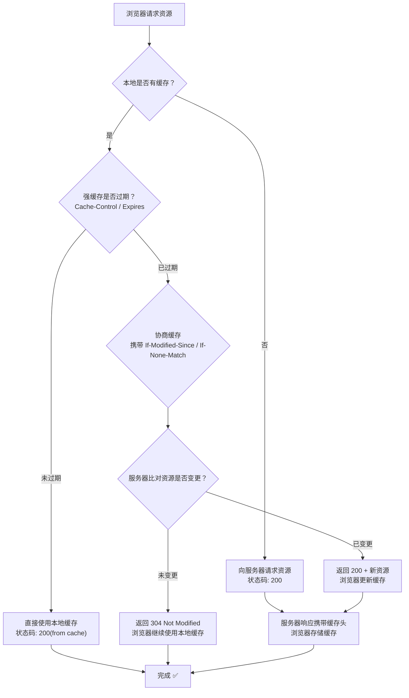
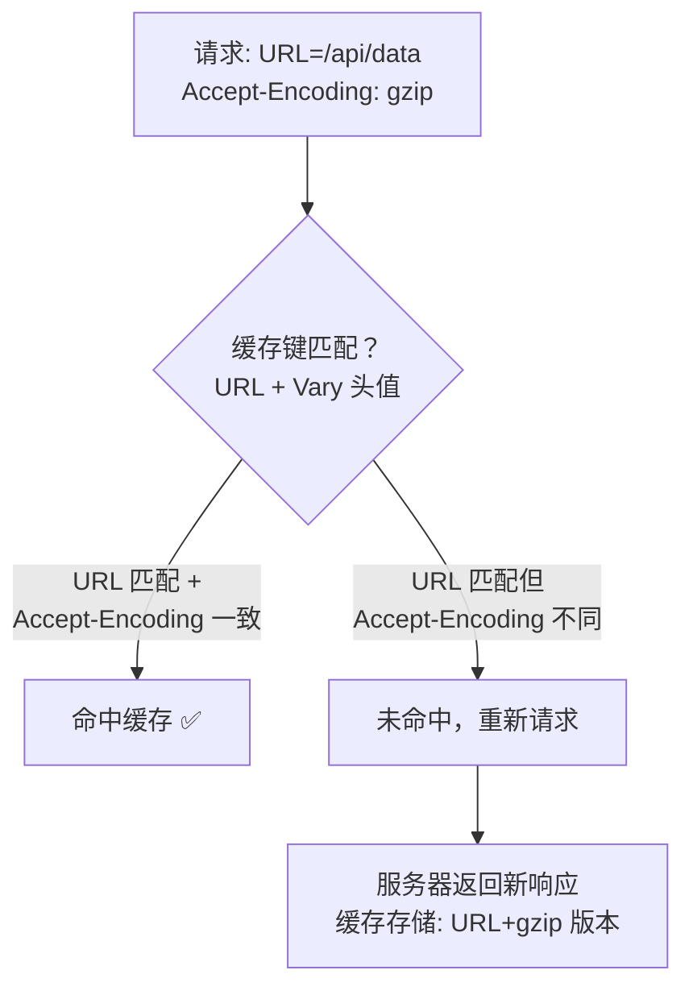
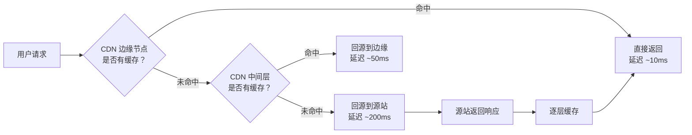

# HTTP 缓存机制

> HTTP 缓存是前端性能优化中投入产出比最高的手段之一。当浏览器请求资源时，若缓存命中则无需与服务器通信，直接从本地读取，大幅减少网络延迟与服务器压力。HTTP 缓存按失效策略分为**强缓存**和**协商缓存**，两者相辅相成。

## 缓存决策流程



> 📊 图表解读：HTTP 缓存决策的核心逻辑是「先查强缓存 → 过期则协商缓存」。强缓存命中时完全不与服务器通信（最快），协商缓存命中时仅传输头部信息（次快），两者均未命中则完整请求（最慢）。

## 请求响应头中的缓存字段

HTTP 报文由请求行/状态行、报头和正文三部分组成。与缓存相关的首部字段分布在请求报头和响应报头中，可在浏览器 Network 面板的 `Request Headers` 和 `Response Headers` 中查看。

首部字段分为四种类型：

- [通用首部字段](https://www.w3.org/Protocols/rfc2616/rfc2616-sec4.html#sec4.5)（请求和响应都会用到）
- [请求首部字段](https://www.w3.org/Protocols/rfc2616/rfc2616-sec5.html#sec5.3)（仅请求报头使用）
- [响应首部字段](https://www.w3.org/Protocols/rfc2616/rfc2616-sec6.html#sec6.2)（仅响应报头使用）
- [实体首部字段](https://www.w3.org/Protocols/rfc2616/rfc2616-sec7.html#sec7.1)（针对报文实体部分）

与缓存相关的首部字段可归纳如下：

```
HTTP 缓存首部字段
├── 强缓存
│   ├── Expires（响应，HTTP/1.0，绝对时间）
│   └── Cache-Control（通用，HTTP/1.1，相对时间 + 多种指令）
└── 协商缓存
    ├── Last-Modified / If-Modified-Since（响应/请求，基于修改时间）
    └── ETag / If-None-Match（响应/请求，基于内容标识）
```

## 强缓存

命中强缓存时，**浏览器不与服务器通信**，直接从本地缓存读取资源。状态码为 `200 (from disk cache)` 或 `200 (from memory cache)`。

### 强缓存的生成与生效

**首次访问**：浏览器发起请求 → 浏览器缓存无数据 → 向服务器请求 → 服务器返回资源 → 浏览器将响应数据存入缓存。

**再次访问**：浏览器发起请求 → 浏览器缓存发现资源未过期 → 直接返回缓存数据，**不与服务器交互**。

以某电商首页为例，首次加载耗时约 1.76s、传输 1.1MB；再次访问时大部分资源命中 `disk cache`，耗时降至约 1.10s，传输仅 44.3KB；若不关闭 Tab 刷新，资源命中 `memory cache`，耗时进一步降至约 766ms。

### Expires

`Expires` 是 HTTP/1.0 中定义的缓存字段，给出缓存过期的**绝对时间**（GMT 格式），属于实体首部字段。

```http
Expires: Wed, 11 May 2029 16:12:18 GMT
```

**问题**：Expires 依赖客户端本地时间，若时间不准确则缓存失效。例如将客户端时间改为过期时间之后，即使资源实际未过期，浏览器也会重新请求。

### Cache-Control

`Cache-Control` 是 HTTP/1.1 中定义的缓存字段，用于控制缓存行为，可组合多种指令（逗号分隔），属于通用首部字段。

#### 常用指令

| 指令 | 作用域 | 说明 |
|------|--------|------|
| `max-age=<seconds>` | 请求/响应 | 缓存有效期的相对时间（秒） |
| `s-maxage=<seconds>` | 响应 | 仅适用于代理服务器（CDN），优先级高于 max-age |
| `public` | 响应 | 允许任何节点缓存（客户端 + 代理服务器） |
| `private` | 响应 | 仅允许客户端（浏览器）缓存，代理服务器等共享缓存不得存储 |
| `no-cache` | 请求/响应 | 客户端可缓存，但**每次使用前必须向服务器验证** |
| `no-store` | 请求/响应 | **完全不缓存**，真正的不缓存指令 |
| `immutable` | 响应 | 资源永不改变，配合 max-age 使用 |
| `must-revalidate` | 响应 | 过期后必须重新验证 |

```http
Cache-Control: max-age=31536000, s-maxage=3600, public
Cache-Control: no-cache
Cache-Control: max-age=0, must-revalidate
```

#### 关键细节

- **max-age 与 Expires 同时存在时，max-age 优先级更高**。通常两者都设置以做向下兼容。
- **s-maxage 仅在代理服务器中生效**，且会覆盖 max-age。当设置了 `private` 时 s-maxage 被忽略。
- **no-cache ≠ no-store**：`no-cache` 允许缓存但要求每次验证；`no-store` 完全禁止缓存。
- 可在 HTML 中通过 meta 标签设置：`<meta http-equiv="Cache-Control" content="no-cache" />`

### Expires vs Cache-Control

| 维度 | Expires | Cache-Control |
|------|---------|---------------|
| 协议版本 | HTTP/1.0 | HTTP/1.1 |
| 时间类型 | 绝对时间（依赖客户端时钟） | 相对时间（不受时钟影响） |
| 优先级 | 较低 | **较高**（同时存在时以 Cache-Control 为准） |
| 推荐度 | 仅做向下兼容 | **推荐使用** |

## 缓存新鲜度与使用期算法

强缓存是否有效取决于一个核心公式：

```
强缓存是否新鲜 = 缓存新鲜度 > 缓存使用期
```

### 缓存新鲜度

缓存新鲜度即缓存的"保质期"，计算公式：

```
缓存新鲜度 = max-age || (expires - date)
```

- 当 `max-age` 存在时，新鲜度等于 max-age 的秒数
- 当 `max-age` 不存在时，新鲜度等于 `expires - date`（过期时间减去报文创建时间）

`Date` 首部字段表示创建报文的日期时间，即服务器返回新资源的时间。

### 缓存使用期

缓存使用期即浏览器已经使用该资源的时间，计算公式：

```
缓存使用期 = 响应使用期 + 传输延迟时间 + 停留缓存时间
```

#### 响应使用期

```
apparent_age = max(0, response_time - date_value)
响应使用期 = max(apparent_age, age_value)
```

- `response_time`：浏览器缓存收到响应的本地时间
- `date_value`：响应首部 Date 值
- `age_value`：响应首部 Age 值（资源创建经过时间，单位秒）

`Age` 首部字段表示推算资源创建经过时间，接近 0 表示刚从源服务器获取，较大值表示在代理服务器中存储了较长时间。

#### 传输延迟时间

```
传输延迟时间 = response_time - request_time
```

- `response_time`：收到响应的本地时间
- `request_time`：发起请求的本地时间

#### 停留缓存时间

```
停留缓存时间 = now - response_time
```

- `now`：客户端当前时间
- `response_time`：收到响应的本地时间

### max-age 仍受本地时间影响

影响缓存使用期的因素中，`request_time`、`response_time` 和 `now` 都取自客户端本地时间。**一旦修改客户端时间为未来时间，停留缓存时间会变大，导致缓存使用期超出新鲜度范围，强缓存失效。** 这就是 max-age 仍然受本地时间影响的原因。

## 协商缓存

当强缓存未命中时，浏览器携带缓存标识向服务器询问资源是否变化：

- **未变化** → 返回 `304 Not Modified`，浏览器从缓存读取
- **已变化** → 返回 `200 OK` 及新资源内容

### 协商缓存生效流程

```
1. 浏览器发起请求
2. 强缓存未命中（过期或 no-cache）
3. 浏览器携带缓存标识（If-Modified-Since / If-None-Match）向服务器请求
4. 服务器判断资源是否更新
   ├── 未更新 → 304 Not Modified → 浏览器从缓存读取
   └── 已更新 → 200 OK + 新资源 → 浏览器更新缓存
```

### Last-Modified / If-Modified-Since

`Last-Modified`（响应首部）表示资源最后修改时间。浏览器首次接收后存储，下次请求时通过 `If-Modified-Since`（请求首部）发送给服务器验证。

```http
# 响应头
Last-Modified: Fri, 14 May 2021 17:23:13 GMT

# 请求头（后续请求携带）
If-Modified-Since: Fri, 14 May 2021 17:23:13 GMT
```

**Last-Modified 的局限**：
- 精度仅到**秒**，毫秒级修改会被漏判
- 编辑文件但内容不变时，修改时间仍会更新，导致不必要的重新请求

### ETag / If-None-Match

`ETag`（响应首部）表示资源的唯一性标识，服务器按规则生成。浏览器首次接收后存储，下次请求时通过 `If-None-Match`（请求首部）发送给服务器验证。

```http
# 响应头
ETag: "29322-09SpAhH3nXWd8KIVqB10hSSz66"

# 请求头（后续请求携带）
If-None-Match: "29322-09SpAhH3nXWd8KIVqB10hSSz66"
```

#### ETag 的生成原理

以 Node.js 的 [etag](https://www.npmjs.com/package/etag) 包为例，有两种生成方式：

1. **文件 Stats 对象**：使用文件大小 + 最后修改时间 → `强 ETag`
2. **非文件内容**：使用内容 hash 值 + 内容长度 → `强 ETag`

**强 ETag**：实体发生任何细微变化都会改变值。

**弱 ETag**：仅当资源发生根本改变时才变化，字段值前附加 `W/`：

```http
ETag: W/"29322-09SpAhH3nXWd8KIVqB10hSSz66"
```

### ETag vs Last-Modified

| 维度 | ETag | Last-Modified |
|------|------|---------------|
| 准确性 | 高（基于内容标识） | 低（仅精确到秒） |
| 开销 | 需服务端计算标识 | 低（仅记录时间戳） |
| 局限 | — | 修改但内容不变时误判；快速编辑时漏判 |
| **优先级** | **更高** | 较低 |

**结论**：ETag 与 Last-Modified 通常**同时使用**，ETag 优先级更高。当两者同时出现时，只有 ETag 生效。

### 启发式缓存

当响应报头中**没有 max-age（s-maxage）和 Expires** 时，浏览器仍可能走强缓存，触发**启发式缓存**：

```http
date: Thu, 02 Sep 2021 13:28:56 GMT
age: 10467792
cache-control: public
last-modified: Mon, 26 Apr 2021 09:56:06 GMT
```

启发式缓存新鲜度计算公式：

```
缓存新鲜度 = max(0, (date - last-modified)) × 10%
```

即取 Date 与 Last-Modified 差值的 10% 作为缓存时间。启发式缓存容易被忽视，不了解时可能导致难以排查的缓存问题。

## 缓存决策流程

```
资源请求开始
    │
    ▼
┌─────────────────┐
│ Cache-Control   │── no-store ──→ 直接请求服务器，不缓存
│ 是否为 no-store？│
└────────┬────────┘
         │ 否
         ▼
┌─────────────────┐
│ Cache-Control   │── no-cache ──→ 进入协商缓存
│ 是否为 no-cache？│
└────────┬────────┘
         │ 否
         ▼
┌─────────────────────┐
│ 强缓存是否过期？      │── 未过期 ──→ 200 (from cache) ✓
│ (max-age/s-maxage)  │
└────────┬────────────┘
         │ 已过期
         ▼
┌─────────────────────┐
│ 协商缓存：           │
│ ETag / Last-Modified │── 304 ──→ 从缓存读取 ✓
│ 向服务器验证         │── 200 ──→ 返回新资源并更新缓存
└─────────────────────┘
```

## HTTP 缓存方案解析

### 单页应用缓存策略

现代前端框架（Vue、React 等）以单页应用（SPA）模式著称，页面跳转通过异步加载 JS 等资源实现。刷新页面时大部分资源命中强缓存，唯独 HTML 走协商缓存。

**原因**：
- JS、CSS 等资源经打包工具可自动生成 hash 文件名，变化时 hash 更新，浏览器当作新资源请求；未变化的资源直接读取缓存
- HTML 文件名不变，若走强缓存则新版本发布后用户可能读到旧 HTML 导致页面空白

**缓存方案**：

| 资源类型 | 缓存策略 | 说明 |
|----------|----------|------|
| HTML | 协商缓存 | `Cache-Control: max-age=0` + `Last-Modified` |
| JS/CSS/图片 | 强缓存 | hash 命名 + `Cache-Control: max-age=31536000` |

```http
# HTML 文件：强缓存立即失效，走协商缓存
Cache-Control: max-age=0
Last-Modified: Sat, 04 Sep 2021 08:59:40 GMT
```

### Webpack 中的 Hash 模式

前端资源 hash 命名有三种类型，各有适用场景：

#### hash（项目级别）

整个项目只要有文件改变，hash 值就变化，所有文件共用同一 hash。**不推荐**，因为未改动资源也会重新请求。

```javascript
// webpack 配置
output: {
  filename: 'js/[name].[hash:8].js',
}
```

#### chunkhash（入口级别）

根据入口文件依赖打包，不同入口生成不同 chunkhash。公共模块（vendor）的 chunkhash 不受业务模块修改影响。

```javascript
// Webpack 4+ 写法：optimization.splitChunks 提取公共模块
// （下例 CommonsChunkPlugin 为 Webpack 3 及更早的写法，现已废弃，仅作历史对照）
output: {
  filename: 'js/[name].[chunkhash:8].js',
}
```

#### contenthash（内容级别）

根据文件内容变化而变化。CSS 使用 contenthash 后，即使 JS 修改导致 chunk 变化，CSS 内容不变则 contenthash 不变，避免重复构建。

```javascript
// 现代 Webpack 5 写法：MiniCssExtractPlugin（旧版 ExtractTextPlugin 已废弃）
plugins: [
  new MiniCssExtractPlugin({ filename: 'css/[name].[contenthash:8].css' })
]
```

**最佳实践**：`chunkhash` + `contenthash` 组合使用，最大化利用强缓存优势。

> **Tips**：在 module rules 中为图片/字体设置 hash 或 chunkhash 不生效，默认使用 contenthash。

### API 响应缓存策略

| 场景 | Cache-Control | 说明 |
|------|---------------|------|
| 实时数据 | `no-store` | 不缓存，每次请求最新数据 |
| 低频更新数据 | `max-age=60` | 短期强缓存 + 过期后协商 |
| 静态配置 | `max-age=86400, immutable` | 长期强缓存，资源不变 |

## Vary 头与缓存键

`Vary` 响应头决定了缓存的**区分维度**——浏览器/CDN 在判断"是否命中缓存"时，不仅看 URL，还要看 `Vary` 指定的请求头是否一致。

### 常见 Vary 值

```http
Vary: Accept-Encoding
Vary: Accept-Encoding, User-Agent
Vary: *
```

| Vary 值 | 含义 | 典型场景 |
|---------|------|----------|
| `Accept-Encoding` | 按压缩方式区分缓存 | 同一 URL 返回 gzip/br 不同版本 |
| `User-Agent` | 按浏览器区分缓存 | 移动端/PC 端返回不同 HTML |
| `Accept-Language` | 按语言区分缓存 | 多语言站点 |
| `*` | 所有请求头都区分 | 等于不缓存（极少使用） |

### Vary 的工作原理



> 📊 图表解读：`Vary: Accept-Encoding` 意味着缓存键 = URL + Accept-Encoding 值。同一 URL 的 gzip 和 br 版本会分别缓存。

### Vary 的常见陷阱

```http
# ❌ 错误：Vary 设置过多导致缓存命中率极低
Vary: User-Agent, Accept-Language, Cookie

# ✅ 正确：只按必要的维度区分
Vary: Accept-Encoding

# ❌ 错误：移动端适配用 Vary: User-Agent
# User-Agent 有上千种变体，会导致缓存碎片化
# ✅ 正确：使用单独的 URL（如 m.example.com）或 SSR 动态检测
```

## CDN 缓存策略

CDN（内容分发网络）在用户和源站之间增加了一层代理缓存，是 HTTP 缓存在网络架构层面的延伸。

### CDN 缓存架构



> 📊 图表解读：CDN 采用多层缓存架构。边缘节点离用户最近（延迟最低），中间层覆盖区域更大，源站是最终数据源。`s-maxage` 指令专门控制 CDN 层的缓存时间。

### CDN 与浏览器缓存的协作

| 层级 | 缓存控制 | 失效策略 |
|------|----------|----------|
| **浏览器** | `max-age`、`Expires` | 用户刷新、过期 |
| **CDN 边缘** | `s-maxage`、`public` | 过期、API 主动刷新 |
| **CDN 中间层** | `s-maxage` | 过期、回源验证 |
| **源站** | — | 数据库更新 |

```http
# CDN 友好的缓存头配置
Cache-Control: public, max-age=60, s-maxage=86400
# 浏览器缓存 60 秒，CDN 缓存 1 天
# 浏览器 60 秒后协商缓存，CDN 1 天内直接返回
```

### CDN 缓存刷新策略

```javascript
// 1. URL 变更（最可靠）
// 修改文件 hash → 新 URL → CDN 视为新资源
/app.[contenthash:8].js

// 2. 主动刷新 API（CDN 服务商提供）
// 阿里云 CDN
await cdnClient.refreshObjectCaches({
  ObjectPath: 'https://cdn.example.com/js/app.js',
  ObjectType: 'File'   // File | Directory
})

// 3. Cache-Control: no-cache
// CDN 收到带 no-cache 的请求会回源验证
```

## 实战：Nginx 缓存配置

### 静态资源缓存

```11-Nginx基础概述
server {
    listen 80;
    server_name static.example.com;

    # 静态资源：长期强缓存
    location ~* \.(js|css|png|jpg|jpeg|gif|ico|svg|woff2?)$ {
        root /var/www/static;
        expires 1y;                          # 等价于 Cache-Control: max-age=31536000
        add_header Cache-Control "public, immutable";
        add_header Vary "Accept-Encoding";
        access_log off;                      # 静态资源不写日志
    }

    # HTML 文件：协商缓存
    location ~* \.html$ {
        root /var/www/static;
        add_header Cache-Control "no-cache";
        # Nginx 自动处理 If-Modified-Since / If-None-Match
    }
}
```

### 代理缓存（Nginx 作为 CDN）

```11-Nginx基础概述
# 缓存路径配置
proxy_cache_path /var/cache/11-Nginx基础概述
    levels=1:2                    # 两级目录结构
    keys_zone=api_cache:10m      # 共享内存区域，10MB 存储键
    max_size=1g                   # 磁盘最大 1GB
    inactive=60m                  # 60 分钟无访问则删除
    use_temp_path=off;            # 避免跨磁盘复制

server {
    location /api/ {
        proxy_cache api_cache;
        proxy_cache_key "$scheme$request_method$host$request_uri";
        proxy_cache_valid 200 10m;       # 200 响应缓存 10 分钟
        proxy_cache_valid 404 1m;        # 404 缓存 1 分钟
        proxy_cache_valid any 5m;        # 其他状态码缓存 5 分钟
        proxy_cache_use_stale error timeout updating;  # 回源失败时使用过期缓存
        add_header X-Cache-Status $upstream_cache_status;  # HIT/MISS/EXPIRED
        proxy_pass http://backend;
    }
}
```

### 缓存状态头

Nginx 的 `$upstream_cache_status` 变量标识缓存命中情况：

| 值 | 含义 |
|----|------|
| `MISS` | 未命中，请求转发到后端 |
| `HIT` | 命中缓存，直接返回 |
| `EXPIRED` | 缓存已过期，回源验证 |
| `UPDATING` | 缓存过期但正在更新（stale-while-revalidate） |
| `STALE` | 回源失败，使用过期缓存 |

## 实战：Node.js 缓存配置

### Express 静态资源缓存

```javascript
const express = require('express')
const app = express()

// 静态资源：1 年强缓存
app.use('/static', express.static('public', {
  maxAge: '1y',               // Cache-Control: max-age=31536000
  immutable: true,            // 追加 immutable 指令
  etag: true,                 // 启用 ETag（默认开启）
  lastModified: true,         // 启用 Last-Modified（默认开启）
  setHeaders: (res, path) => {
    if (path.endsWith('.html')) {
      // HTML 文件：协商缓存
      res.set('Cache-Control', 'no-cache')
    } else {
      // 其他资源：强缓存 + Vary
      res.set('Vary', 'Accept-Encoding')
    }
  }
}))
```

### Koa 自定义缓存中间件

```javascript
const Koa = require('koa')
const conditional = require('koa-conditional-get')
const etag = require('koa-etag')

const app = new Koa()

// 协商缓存中间件（必须在路由之前）
app.use(conditional())
app.use(etag())

// API 缓存策略
app.use(async (ctx, next) => {
  await next()

  // 只对 GET 请求设置缓存
  if (ctx.method === 'GET') {
    const config = getCacheConfig(ctx.url)

    if (config && ctx.status < 400) {
      const directives = []

      // 根据接口类型设置缓存策略
      if (config.type === 'static') {
        directives.push(`max-age=${config.maxAge}`) // 静态数据：强缓存
      } else {
        directives.push('no-cache') // 动态数据：协商缓存
        if (config.mustRevalidate) directives.push('must-revalidate')
        ctx.set('Cache-Control', directives.join(', '))
      }
    }
  }
})
```

### 手动实现 ETag 生成

```javascript
const crypto = require('crypto')

function generateETag(content, encoding = 'utf-8') {
  // 强 ETag：基于内容 hash
  const hash = crypto
    .createHash('sha256')
    .update(content, encoding)
    .digest('base64')

  return `"${hash}"`
}

// 弱 ETag：基于内容大小 + hash 前缀
function generateWeakETag(content) {
  return `W/${generateETag(content)}`
}

// 手动设置协商缓存响应头
function setConditionalHeaders(ctx, content) {
  ctx.set('ETag', generateETag(content))
  ctx.set('Cache-Control', 'no-cache')
}

// 响应拦截中间件：为响应自动添加 ETag
function etagMiddleware() {
  return function (req, res, next) {
    const originalEnd = res.end

    res.end = function (data, encoding) {
      // 为响应内容生成 ETag
      if (!res.getHeader('ETag') && data) {
        res.setHeader('ETag', generateETag(data.toString()))
      }
      originalEnd.call(this, data, encoding)
    }

    next()
  }
}
```

## 缓存调试技巧

### Chrome DevTools 缓存分析

| 面板 | 位置 | 用途 |
|------|------|------|
| Network → Size 列 | 显示 `(memory cache)` / `(disk cache)` | 判断强缓存命中 |
| Network → Headers | 查看 Request/Response 缓存头 | 分析缓存策略 |
| Network → Disable cache | 勾选后禁用缓存 | 模拟首次访问 |
| Application → Cache Storage | 查看 Service Worker 缓存 | 分析 SW 缓存内容 |

### 常见缓存问题排查

```bash
# 1. 查看完整缓存头
curl -I https://example.com/app.js

# 2. 模拟协商缓存请求
curl -H 'If-None-Match: "abc123"' -I https://example.com/app.js

# 3. 强制跳过缓存
curl -H 'Cache-Control: no-cache' https://example.com/app.js

# 4. 查看 CDN 缓存状态
curl -I https://cdn.example.com/app.js | grep X-Cache
```

| 现象 | 可能原因 | 解决方案 |
|------|----------|----------|
| 更新后用户看到旧页面 | HTML 走了强缓存 | HTML 设置 `no-cache` |
| CSS/JS 更新不生效 | 文件名无 hash | 使用 contenthash 命名 |
| CDN 缓存不刷新 | s-maxage 过长 | 缩短 s-maxage 或主动刷新 |
| 接口返回旧数据 | API 走了强缓存 | API 设置 `no-store` 或短 max-age |
| gzip/br 版本混乱 | 缺少 Vary 头 | 添加 `Vary: Accept-Encoding` |
