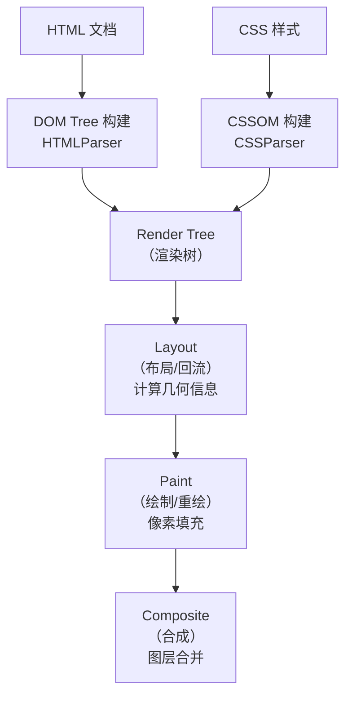

# 浏览器渲染机制

> 理解浏览器如何将代码转换为像素，是进行渲染优化的前提。

## 浏览器运行机制

### 浏览器内核

浏览器内核（Rendering Engine）决定了浏览器解释网页语法的方式。现代主流内核：

| 内核 | 使用浏览器 | 说明 |
|------|-----------|------|
| **Blink** | Chrome, Edge, Opera, Brave | 基于 Webkit 分支 |
| **WebKit** | Safari, iOS browsers | Blink 的源头 |
| **Gecko** | Firefox | Mozilla 自研 |
| **Trident** | IE（已废弃） | 旧版 IE 内核 |

### 从输入 URL 到页面渲染

```
┌─────────────────────────────────────────────────────────────┐
│                     浏览器渲染流程                            │
│                                                             │
│  1. 解析 HTML  ──→ 构建 DOM 树                              │
│         │                                                   │
│  2. 解析 CSS  ──→ 构建 CSSOM 树（与 DOM 并行解析）           │
│         │                                                   │
│  3. 合并      ──→ 构建渲染树（Render Tree）                  │
│         │                                                   │
│  4. 布局（Layout/Reflow）───→ 计算每个元素的几何属性          │
│         │                                                   │
│  5. 绘制（Paint/Repaint）───→ 将元素绘制为像素                │
│         │                                                   │
│  6. 合成（Composite）─────→ 合并图层，输出到屏幕              │
│                                                             │
└─────────────────────────────────────────────────────────────┘
```

#### 阶段详解

| 阶段 | 说明 | 输出 |
|------|------|------|
| **DOM 构建** | HTML → 词法分析 → 节点树 | DOM Tree |
| **CSSOM 构建** | CSS → 规则解析 → 样式规则树 | CSSOM Tree |
| **渲染树** | DOM + CSSOM = 可见元素的布局树 | Render Tree |
| **布局** | 计算每个元素的位置和尺寸 | 带坐标的 Layout Tree |
| **绘制** | 将元素逐个绘制到图层 | Paint Records |
| **合成** | GPU 合并各图层，显示在屏幕上 | 屏幕像素 |

### 关键渲染路径（Critical Rendering Path）

**Critical Rendering Path** 指的是浏览器将 HTML/CSS/JS 转换为屏幕上像素所经历的关键步骤。

#### CRP 优化目标

```
优化前：HTML → CSS → JS → DOM → CSSOM → RenderTree → Layout → Paint → Display
优化后：尽快完成关键路径，延迟非关键资源
```

#### 具体优化手段

**HTML 优化**

- 减小文档大小
- 尽早输出 `<head>` 内容

**CSS 优化**

```html
<!-- ✅ 推荐：CSS 放在 head 中 -->
<head>
  <link rel="stylesheet" href="styles.css" />
</head>

<!-- ❌ 避免：CSS 放在 body 底部或使用 @import -->
<body>
  <!-- ...内容... -->
  <link rel="stylesheet" href="styles.css" />  <!-- 阻塞渲染！ -->
</body>
```

**为什么 CSS 会阻塞渲染？**

浏览器必须等 CSSOM 构建完成后才能构建渲染树。如果 CSS 未加载完成，即使 DOM 已就绪也不会渲染任何内容——这是为了避免没有样式的页面"裸奔"闪现。

### CSS 与 JS 对渲染的影响

#### JavaScript 加载策略

JS 的执行会阻塞 DOM 解析和 CSSOM 构建。

```html
<!-- 方式一：正常加载（阻塞） -->
<script src="app.js"></script>

<!-- 方式二：异步加载（不阻塞 DOM，下载完立即执行） -->
<script async src="analytics.js"></script>
<!-- 适用：独立脚本（如统计脚本），不依赖 DOM 和其他脚本 -->

<!-- 方式三：延迟加载（不阻塞 DOM，DOMContentLoaded 前按顺序执行） -->
<script defer src="app.js"></script>
<!-- 适用：依赖 DOM 或其他脚本的模块化代码 -->

<!-- 方式四：ES Module（默认 defer 行为） -->
<script type="module" src="module.js"></script>
```

| 特性 | `<script>` | `async` | `defer` | `type="module"` |
|------|-----------|---------|---------|-----------------|
| 阻塞 HTML 解析 | ✅ 是 | ❌ 否 | ❌ 否 | ❌ 否 |
| 执行时机 | 立即 | 下载后立即 | DOMContentLoaded 前 | DOMContentLoaded 前 |
| 执行顺序 | 按出现顺序 | 无保证 | 按出现顺序 | 按出现顺序 |
| 依赖 DOM | 可访问之前的部分 | 不确定 | ✅ 完整 DOM | ✅ 完整 DOM |

#### CSS 选择器性能

**CSS 选择器是从右向左匹配的！**

```css
/* 浏览器的匹配过程：
   1. 找到页面上所有 li 元素
   2. 对每个 li，检查其祖先是否有 #myList
*/
#myList li { } /* 匹配代价高 */

/* 更好的写法 */
.myList-item { } /* 直接匹配类名 */
```

**选择器性能排名（从快到慢）**

```
#id                    — 最快（唯一）
.class                 — 快
.tag                   — 较快
.tag.class             — 中等
.tag > .class          — 中等
.tag .tag              — 较慢
.tag .tag .class       — 慢
*                      — 最慢（避免使用）
```

**CSS 优化建议**

1. **避免通配符选择器** `* { }`
2. **减少嵌套深度**（不超过 3 层）
3. **用 class 替代标签选择器**
4. **避免过于复杂的选择器**
5. **利用继承**减少重复定义

#### 渲染流程



> 📊 图表解读：浏览器渲染核心流程为「DOM + CSSOM → 渲染树 → 布局 → 绘制 → 合成」。其中布局（Layout）也称回流（Reflow），是性能开销最大的环节，应尽量避免频繁触发。

#### CSS 与 JS 的阻塞总结

```
HTML 解析 ──→ DOM 构建
    │
    ├── 遇到 CSS（link/style）──→ DOM 继续解析，但渲染需等待 CSSOM 完成
    │
    └── 遇到 JS（script）───────→ 暂停 DOM + CSSOM，等待 JS 执行完毕
                                    │
                                    ├── 正常 script：立即执行
                                    ├── async script：异步下载，下载完立即执行
                                    └── defer script：异步下载，DOM 完成后执行
```

## Event Loop 与异步更新

> 理解事件循环机制是掌握异步 DOM 更新策略的基础。Vue、React 等框架的批量更新能力均基于此原理。

### 宏任务与微任务

| 类型 | 说明 | 常见来源 |
|------|------|----------|
| **宏任务（Macro Task）** | 主队列，每次取一个执行 | `setTimeout`、`setInterval`、`setImmediate`、I/O、UI 渲染 |
| **微任务（Micro Task）** | 微队列，每次清空整个队列 | `Promise.then`、`MutationObserver`、`queueMicrotask` |

### Event Loop 运行机制

```
┌───────────────────────────────────┐
│           Event Loop 循环          │
│                                   │
│  1. 执行当前宏任务（script）        │
│     ↓                              │
│  2. 执行所有微任务（清空微任务队列） │
│     ↓                              │
│  3. UI 渲染（如果需要）            │
│     ↓                              │
│  4. 取下一个宏任务 → 回到步骤 1    │
│                                   │
└───────────────────────────────────┘
```

```
时间线示意：

[Macro: script] ──→ [Micro 全部执行] ──→ [Render] ──→ [Macro: setTimeout]
                                                              ↓
                                                    [Micro 全部执行] → [Render] → ...
```

#### 渲染时机与异步策略

**关键问题：DOM 更新该用 Macro 还是 Micro？**

```javascript
// 方案 A：使用 Macro（setTimeout）
setTimeout(() => {
  // 更新 DOM...
}, 0)
// 问题：本次 render 时 DOM 尚未更新 → 浪费一次无效渲染

// 方案 B：使用 Micro（Promise）
Promise.resolve().then(() => {
  // 更新 DOM...
})
// 优势：Micro 在 render 之前执行 → DOM 更新后立即渲染，无需额外等待
```

**结论**：在异步任务中进行 DOM 更新时，使用 **MicroTask 更优**——更新时机更靠近渲染节点。

### 异步更新策略（Vue/React 的批量更新原理）

Vue 的响应式数据更新不会立即触发 DOM 修改，而是将更新推入队列，在适当时机**批量执行**。

#### 核心源码解析：nextTick

```javascript
// Vue 2 nextTick 核心逻辑（简化版）
// （Vue 3 已简化为直接基于 Promise.then：const p = Promise.resolve();
//   export function nextTick(fn) { return fn ? p.then(fn) : p }）
const callbacks = []
let pending = false

export function nextTick(cb?: Function, ctx?: Object): Promise<void> {
  let _resolve

  callbacks.push(() => {
    if (cb) {
      try { cb.call(ctx) }
      catch (e) { handleError(e, ctx, "nextTick") }
    } else if (_resolve) {
      _resolve(ctx)
    }
  })

  // 首次调用时派发一次批量更新
  if (!pending) {
    pending = true
    queueFlush()
  }

  // 未传入回调时返回 Promise
  if (!cb && typeof Promise !== "undefined") {
    return new Promise((resolve) => {
      _resolve = resolve
    })
  }

  return Promise.resolve()
}

function queueFlush() {
  // 用微任务派发，保证所有同步更新在同一批次处理
  Promise.resolve().then(flushCallbacks)
}

function flushCallbacks() {
  pending = false
  const copies = callbacks.slice(0)
  callbacks.length = 0
  for (let i = 0; i < copies.length; i++) {
    copies[i]()
  }
}
```

**关键设计**：
- 使用 **Promise（MicroTask）** 作为默认派发方式
- 通过 `pending` 锁确保同一批次只派发一次
- 支持回调函数和 Promise 两种调用方式

#### 异步更新的优势

```javascript
// 同步更新：3 次 DOM 操作
this.count = 1   // 操作 DOM 第 1 次
this.count = 2   // 操作 DOM 第 2 次
this.count = 3   // 操作 DOM 第 3 次 — 实际只需要这次结果

// 异步更新（Vue）：3 次赋值被合并为 1 次 DOM 操作
this.count = 1   // 推入队列
this.count = 2   // 推入队列
this.count = 3   // 推入队列
// 队列刷新时：只操作 DOM 1 次，使用最终值 3
```

> **核心思想**："只看结果，不为过程买单"——渲染引擎不需要为中间状态付出渲染代价。

#### Macro vs Micro 派发方式对比

**宏任务派发优先级**

```javascript
// 优先级从高到低
// 1. setImmediate（仅 Node.js / IE10+）
if (typeof setImmediate !== "undefined") {
  macroTimerFunc = () => setImmediate(flushCallbacks)
}
// 2. MessageChannel（现代浏览器推荐）
else if (typeof MessageChannel !== "undefined") {
  const channel = new MessageChannel()
  channel.port1.onmessage = flushCallbacks
  macroTimerFunc = () => channel.port2.postMessage(1)
}
// 3. setTimeout（兼容性最好）
else {
  macroTimerFunc = () => setTimeout(flushCallbacks, 0)
}
```

**微任务派发方式**

```javascript
// 优先级：Promise > MutationObserver > 降级为 Macro
if (typeof Promise !== "undefined" && isNative(Promise)) {
  const p = Promise.resolve()
  microTimerFunc = () => p.then(flushCallbacks)
} else {
  microTimerFunc = macroTimerFunc // 无法派发 Micro 则退化为 Macro
}
```
