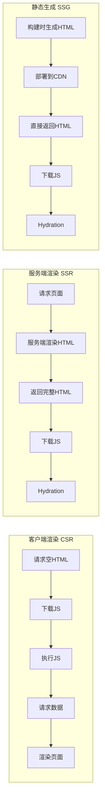
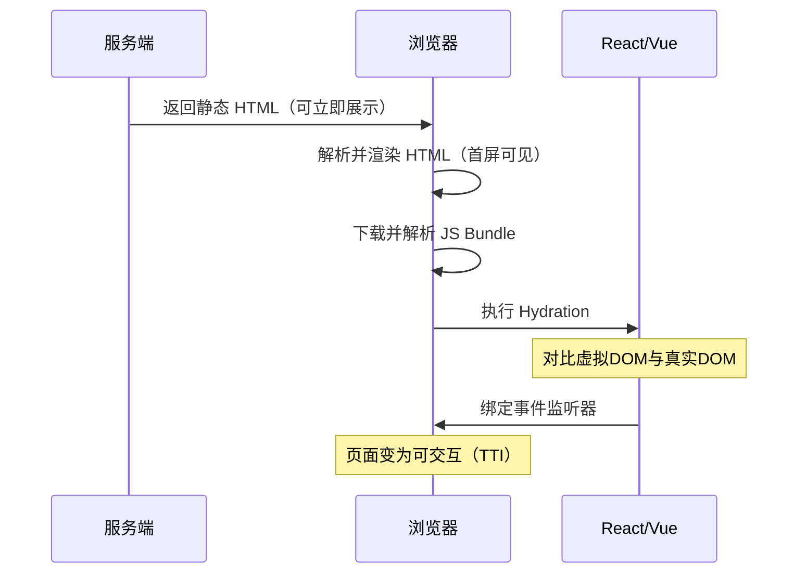
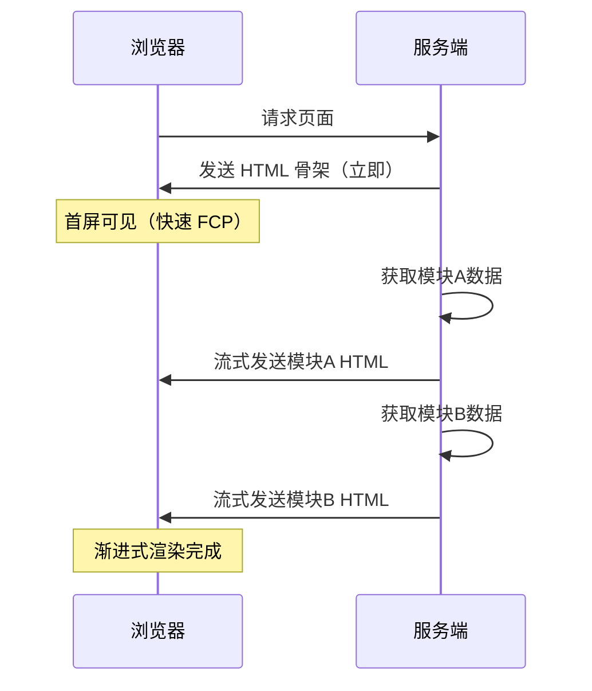
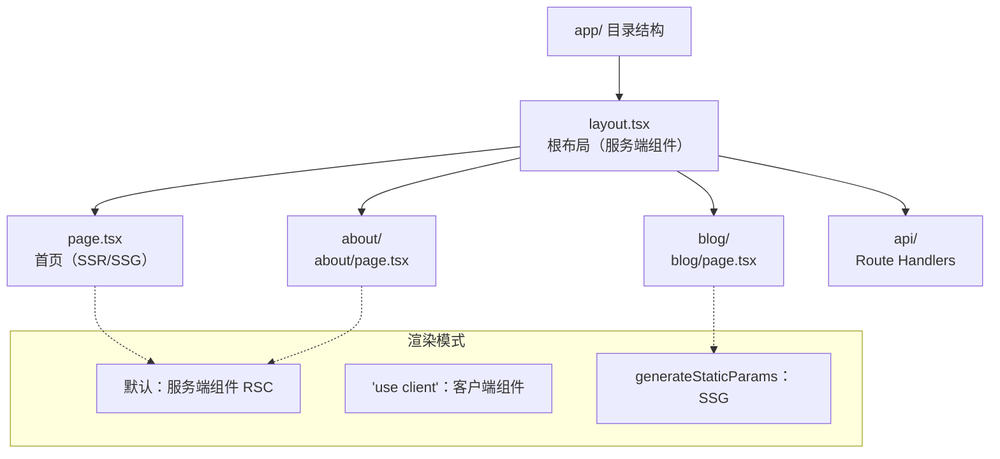
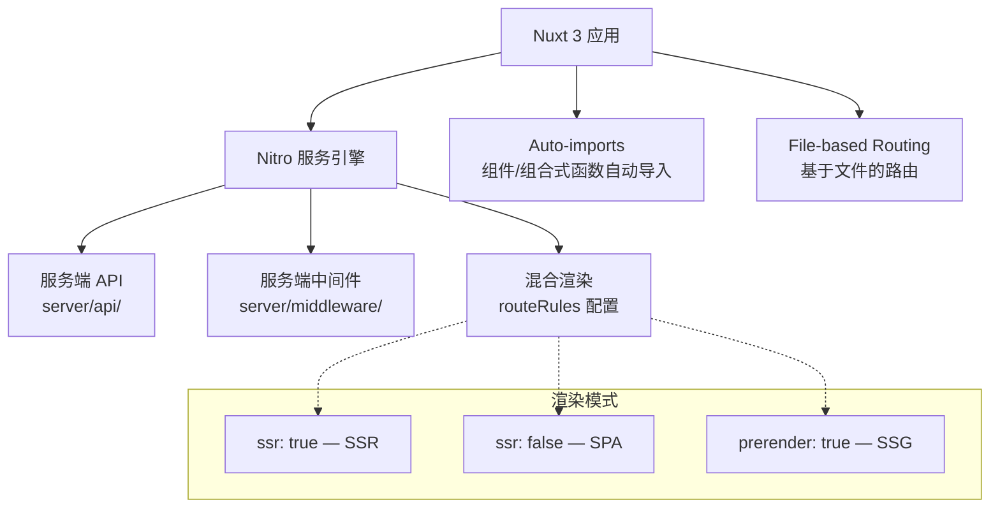

# 服务端渲染 SSR

> 服务端渲染（Server-Side Rendering）将渲染工作从浏览器转移到服务器，可显著提升首屏加载速度和 SEO 表现。

## SSR 的前世今生

### 客户端渲染（CSR）

```
用户请求 → 返回空 HTML + JS → 浏览器执行 JS → 渲染 DOM → 用户看到内容
                    ↑                              ↑
              白屏等待时间                      首屏内容出现
```

```html
<!-- HTML 结构省略，仅展示关键 JS 逻辑 -->
```

**特点**：HTML 源文件中看不到实际内容，需要 JS 执行后才能呈现。

### 服务端渲染（SSR）

```
用户请求 → 服务端执行组件代码 → 生成完整 HTML → 返回给浏览器 → 即时展示
                                        ↑
                                首屏内容已包含在 HTML 中
```

**特点**：HTML 源文件中包含完整的页面内容，"所见即所得"。

## SSR 原理与实现

### React SSR

```javascript
// server.js — Express 服务端入口
import express from "express"
import React from "react"
import { renderToString } from "react-dom/server"
import App from "./App"

const app = express()

app.get("/", (req, res) => {
  // 将 React 组件渲染为 HTML 字符串
  const html = renderToString(<App />)

  res.send(`
    <!DOCTYPE html>
    <html lang="zh-CN">
      <head>
        <meta charset="UTF-8" />
        <title>SSR 示例</title>
      </head>
      <body>
        <div id="root">${html}</div>
        <script src="/client.js"></script>
      </body>
    </html>
  `)
})

app.listen(3000, () => console.log("服务运行在 http://localhost:3000"))
```

### Vue SSR

以下为 Vue 2 经典写法（`vue-server-renderer`）；Vue 3 的 SSR 建议使用 Nuxt 3 或 `@vue/server-renderer`（见下文 Nuxt 实战）。

```javascript
// server.js — Vue SSR 入口
const express = require("express")
const { createRenderer } = require("vue-server-renderer")
const Vue = require("vue")

const server = express()
const renderer = createRenderer()

server.get("*", (req, res) => {
  const app = new Vue({
    data: { url: req.url },
    template: `<div>访问的 URL 是：{{ url }}</div>`
  })

  renderer.renderToString(app, (err, html) => {
    if (err) {
      res.status(500).end("Internal Server Error")
      return
    }
    res.end(`
      <!DOCTYPE html>
      <html lang="zh-CN">
        <head><title>Vue SSR 示例</title></head>
        <body>${html}</body>
      </html>
    `)
  })
})

server.listen(8080)
```

### 现代 SSR 方案

#### 主流框架官方方案

| 框架 | 方案 | 特点 |
|------|------|------|
| Next.js | React | 全栈框架，SSR/SSG/API Routes |
| Nuxt.js | Vue | 自动路由、中间件、SSG/SSR 切换 |
| Remix | React | 嵌套布局、错误边界、渐进增强 |
| Astro | 框架无关 | 默认零 JS、岛屿架构 |

#### SSG（静态站点生成）

介于纯 CSR 和 SSR 之间的方案：**构建时**生成静态 HTML，部署到 CDN。

```
构建阶段: 执行组件代码 → 生成静态 HTML 文件 → 部署到 CDN
运行阶段: 用户请求 → CDN 直接返回 HTML（无需服务器计算）
```

优势：兼具 SSR 的首屏速度和 SEO 优势，同时拥有 CSR 的低运维成本。

## SSR 的利与弊

### SSR 解决的问题

| 问题 | 说明 |
|------|------|
| **首屏速度慢** | CSR 需等 JS 加载+执行后才渲染，SSR 直接返回 HTML |
| **SEO 不友好** | 搜索引擎爬虫不执行 JS，CSR 页面难以被索引 |
| **社交分享差** | 分享卡片抓取不到动态内容 |

### SSR 的代价

| 代价 | 说明 |
|------|------|
| **服务器压力增加** | 本该由各浏览器分担的渲染压力集中到服务器 |
| **开发复杂度高** | 需处理同构代码、hydration、数据预取等问题 |
| **TTFB 增加** | 服务端渲染需要计算时间，Time to First Byte 变长 |
| **运维成本上升** | 需要 Node.js 服务器环境 |

## 渲染模式对比



> 📊 图表解读：三种渲染模式的核心差异在于 HTML 的生成时机——CSR 在浏览器端、SSR 在服务端实时、SSG 在构建时。首屏速度：SSG > SSR > CSR；动态能力：CSR > SSR > SSG。

## Hydration 机制

Hydration（水合/注水）是 SSR 的核心环节——服务端返回的静态 HTML 需要在客户端"激活"为可交互的应用。

### Hydration 工作流程



> 📊 图表解读：Hydration 阶段是 SSR 应用从"可看"到"可用"的关键转折点。在此期间，框架会比对服务端渲染的 DOM 与客户端虚拟 DOM，确保一致后绑定事件。

### Hydration 注意事项

- **DOM 一致性**：服务端和客户端渲染的 DOM 结构必须一致，否则会触发警告甚至重新渲染
- **不支持的生命周期**：`componentDidMount`、`useEffect` 等仅在客户端执行
- **窗口对象限制**：服务端没有 `window`、`document`、`navigator` 等浏览器 API

```javascript
// ❌ 服务端渲染会报错
function MyComponent() {
  const [width, setWidth] = useState(window.innerWidth) // ReferenceError: window is not defined
  // ...
}

// ✅ 正确做法：延迟到客户端执行
function MyComponent() {
  const [width, setWidth] = useState(0)
  useEffect(() => {
    setWidth(window.innerWidth) // 仅在客户端执行
  }, [])
  // ...
}
```

## 数据预取（Data Fetching）

SSR 的关键优势是在服务端预先获取数据，将完整页面返回给客户端。

### Next.js 数据预取方案

| 方法 | 执行时机 | 适用场景 |
|------|----------|----------|
| `getServerSideProps` | 每次请求时 | 动态数据、个性化内容 |
| `getStaticProps` | 构建时 | 静态内容、博客文章 |
| `getStaticPaths` | 构建时 | 动态路由的静态生成 |
| React Server Components | 服务端流式渲染 | Next.js 13+ App Router |

```javascript
// Next.js Pages Router - getServerSideProps
export async function getServerSideProps(context) {
  const { params, req, res, query } = context

  // 服务端获取数据
  const data = await fetch(`https://api.example.com/posts/${params.id}`)
  const post = await data.json()

  // 传递给页面组件作为 props
  return {
    props: { post },  // 序列化后注入到页面 HTML 中
  }
}

// 页面组件直接使用预取数据
function PostPage({ post }) {
  return <article><h1>{post.title}</h1><p>{post.content}</p></article>
}
```

## 流式 SSR（Streaming SSR）

传统 SSR 需要等所有数据获取完毕后才能返回 HTML，流式 SSR 允许分块传输，显著降低 TTFB。



> 📊 图表解读：流式 SSR 的核心优势是「边获取数据、边传输 HTML」，用户可以更快看到页面内容。React 18 的 `renderToPipeableStream` 和 Vue 3 的 `renderToNodeStream` 均支持此特性。

## SSR 实践指南

### 选型建议

```
你的项目需要什么？
├── 内容型网站 / 博客 / 文档站 → SSG（Next.js/Nuxt/Astro）
├── 强 SEO 需求 + 动态内容 → SSR（Next.js/Nuxt/Remix）
├── 管理后台 / 工具类应用 → CSR（Vite SPA）
└── 混合需求 → 混合渲染（部分 SSG + 部分 CSR）
```

> **实践建议**：优先使用低成本优化手段（代码分割、懒加载、CDN、缓存策略），当这些手段用尽后仍无法满足性能需求时，再考虑引入 SSR。

## Next.js 实战

Next.js 是 React 生态最成熟的 SSR 框架，支持 SSR、SSG、ISR 等多种渲染模式。

### App Router 架构（Next.js 13+）



> 📊 图表解读：App Router 中组件默认是服务端组件（RSC），零客户端 JS。只有标记 `'use client'` 的组件才会在客户端执行。`generateStaticParams` 可以将动态路由静态化。

### 博客项目实战

**项目结构：**

```
app/
├── layout.tsx              # 根布局
├── page.tsx                # 首页
├── blog/
│   ├── page.tsx            # 博客列表（SSG）
│   └── [slug]/
│       └── page.tsx        # 博客详情（SSG + ISR）
├── dashboard/
│   └── page.tsx            # 用户面板（SSR）
└── api/
    └── revalidate/
        └── route.ts        # 按需刷新 API
```

**layout.tsx — 根布局（服务端组件）：**

```tsx
// app/layout.tsx — 默认是服务端组件，不发送 JS 到客户端
import './globals.css'

export const metadata = {
  title: '我的博客',
  description: '基于 Next.js App Router 构建',
}

export default function RootLayout({ children }) {
  return (
    <html lang="zh-CN">
      <body>
        <nav>
          <a href="/">首页</a>
          <a href="/blog">博客</a>
          <a href="/dashboard">面板</a>
        </nav>
        <main>{children}</main>
      </body>
    </html>
  )
}
```

**博客列表 — SSG（构建时生成）：**

```tsx
// app/blog/page.tsx
interface Post {
  id: string
  title: string
  excerpt: string
  date: string
}

// 构建时获取数据
async function getPosts(): Promise<Post[]> {
  const res = await fetch('https://api.example.com/posts', {
    cache: 'force-cache',              // SSG：构建时缓存
  })
  return res.json()
}

export default async function BlogListPage() {
  const posts = await getPosts()

  return (
    <section>
      {posts.map((post) => (
        <article key={post.id}>
          <h2>{post.title}</h2>
          <time>{post.date}</time>
        </article>
      ))}
    </section>
  )
}
```

**博客详情 — 动态路由 SSG + ISR：**

```tsx
// app/blog/[slug]/page.tsx

// 告诉 Next.js 哪些路径需要预渲染
export async function generateStaticParams() {
  const posts = await fetch('https://api.example.com/posts').then(r => r.json())
  return posts.map(post => ({ slug: post.id }))
}

// 动态数据获取
async function getPost(slug: string) {
  const res = await fetch(`https://api.example.com/posts/${slug}`, {
    next: { revalidate: 600 },  // ISR：每 10 分钟重新验证
  })
  return res.json()
}

export default async function PostPage({ params }) {
  const post = await getPost(params.slug)

  return (
    <article>
      <h1>{post.title}</h1>
      <div dangerouslySetInnerHTML={{ __html: post.html }} />
    </article>
  )
}
```

**用户面板 — SSR（每次请求时渲染）：**

```tsx
// app/dashboard/page.tsx
import { cookies } from 'next/headers'
import { redirect } from 'next/navigation'

async function getUserData(token: string) {
  const res = await fetch('https://api.example.com/me', {
    headers: { Authorization: `Bearer ${token}` },
    cache: 'no-store',               // SSR：每次请求都获取最新数据
  })
  return res.json()
}

export default async function DashboardPage() {
  const token = cookies().get('token')?.value
  if (!token) {
    // 服务端重定向
    redirect('/login')
  }

  const user = await getUserData(token)

  return (
    <section>
      <h1>欢迎，{user.name}</h1>
      <p>邮箱：{user.email}</p>
      {/* 客户端交互组件 */}
      <InteractiveChart data={user.stats} />
    </section>
  )
}
```

**按需刷新 — On-Demand Revalidation：**

```typescript
// app/api/revalidate/route.ts
import { revalidatePath, revalidateTag } from 'next/cache'
import { NextRequest } from 'next/server'

export async function POST(request: NextRequest) {
  const { path, tag, secret } = await request.json()

  // 验证请求来源
  if (secret !== process.env.REVALIDATION_SECRET) {
    return Response.json({ error: 'Invalid secret' }, { status: 401 })
  }

  if (tag) {
    // 按标签刷新（批量）
    revalidateTag(tag)
  } else if (path) {
    // 按路径刷新（精确）
    revalidatePath(path)
  }

  return Response.json({ revalidated: true, now: Date.now() })
}

// CMS 发布文章后调用此 API 触发页面刷新
// POST /api/revalidate { "path": "/blog/my-post", "secret": "xxx" }
```

### Next.js 渲染模式速查

| 模式 | fetch 选项 | 数据获取时机 | 适用场景 |
|------|-----------|-------------|---------|
| **SSG** | `cache: 'force-cache'` | 构建时 | 博客、文档、营销页 |
| **ISR** | `next: { revalidate: 600 }` | 构建时 + 定期验证 | 内容型网站 |
| **SSR** | `cache: 'no-store'` | 每次请求 | 用户面板、实时数据 |
| **On-demand** | `revalidatePath()` / `revalidateTag()` | CMS 触发时 | CMS 发布后刷新 |

## Nuxt 实战

Nuxt 3 是 Vue 生态的全栈框架，内置 Nitro 服务引擎，支持 SSR/SSG/混合渲染。

### Nuxt 3 核心架构



> 📊 图表解读：Nuxt 3 的 Nitro 引擎是独立的服务层，支持多种部署目标（Node.js、Cloudflare Workers、Vercel）。通过 `routeRules` 可以对每个路由配置不同的渲染模式。

### 博客项目实战

**项目结构：**

```
nuxt-app/
├── nuxt.config.ts           # Nuxt 配置
├── server/
│   ├── api/
│   │   └── posts/
│   │       ├── index.get.ts # GET /api/posts
│   │       └── [id].get.ts  # GET /api/posts/:id
│   └── middleware/
│       └── auth.ts          # 认证中间件
├── pages/
│   ├── index.vue            # 首页
│   ├── blog/
│   │   ├── index.vue        # 博客列表
│   │   └── [id].vue         # 博客详情
│   └── dashboard.vue        # 用户面板
├── composables/
│   └── useAuth.ts           # 认证组合式函数
└── layouts/
    └── default.vue          # 默认布局
```

**nuxt.config.ts — 混合渲染配置：**

```typescript
export default defineNuxtConfig({
  // 全局渲染模式
  ssr: true,

  routeRules: {
    // 首页：SSR + 短期缓存
    '/': { swr: 60 },

    // 博客列表：SSG + ISR（60 秒重新验证）
    '/blog': { swr: 60, prerender: true },

    // 博客详情：SSG + ISR
    '/blog/**': { swr: 60, prerender: true },

    // 管理后台：纯 SPA（不 SEO）
    '/dashboard': { ssr: false },

    // API 接口：不渲染
    '/api/**': { cache: { maxAge: 60 } },
  },

  prerender: {
    crawlLinks: true,     // 自动爬取链接
    routes: ['/sitemap.xml'],
  },
})
```

**博客列表页面：**

```vue
<!-- pages/blog/index.vue -->
<script setup>
// useFetch 自动处理 SSR 数据预取和客户端 hydration
const { data: posts, pending, error, refresh } = await useFetch('/api/posts', {
  // 服务端缓存：60 秒内返回缓存数据
  getCachedData(key, nuxtApp) {
    const cached = nuxtApp.payload.data[key]
    if (!cached) return null
    const expirationDate = new Date(cached.fetchedAt)
    expirationDate.setSeconds(expirationDate.getSeconds() + 60)
    if (expirationDate < new Date()) return null
    return cached.data
  },
})
</script>

<template>
  <div>
    <article v-for="post in posts" :key="post.id">
      <h2>{{ post.title }}</h2>
      <p>{{ post.excerpt }}</p>
    </article>

    <!-- 手动刷新 -->
    <button @click="refresh()">刷新</button>
  </div>
</template>
```

**博客详情 — 动态路由：**

```vue
<!-- pages/blog/[id].vue -->
<script setup>
const route = useRoute()

const { data: post } = await useFetch(`/api/posts/${route.params.id}`, {
  key: `post-${route.params.id}`,  // 自定义缓存键
  watch: [() => route.params.id],   // 路由参数变化时重新获取
})

// 动态 SEO
useHead({
  title: () => post.value?.title || '加载中...',
  meta: [
    { name: 'description', content: () => post.value?.excerpt || '' },
    { property: 'og:title', content: () => post.value?.title || '' },
  ],
})
</script>

<template>
  <article v-if="post">
    <h1>{{ post.title }}</h1>
    <div v-html="post.content" />
  </article>
</template>
```

**Server API — Nitro 服务端：**

```typescript
// server/api/posts/index.get.ts
export default defineEventHandler(async (event) => {
  // Nitro 自动缓存（基于文件系统的缓存）
  const posts = await fetch('https://cms.example.com/api/posts')
    .then(r => r.json())

  return posts
})

// server/api/posts/[id].get.ts
export default defineEventHandler(async (event) => {
  const id = getRouterParam(event, 'id')
  const post = await fetch(`https://cms.example.com/api/posts/${id}`)
    .then(r => r.json())

  if (!post) {
    throw createError({ statusCode: 404, message: '文章不存在' })
  }

  return post
})
```

### Nuxt 数据获取方法对比

| 方法 | SSR 预取 | 客户端导航 | 响应式 | 适用场景 |
|------|---------|-----------|--------|---------|
| `useFetch` | ✅ | ✅ 客户端 fetch | ✅ | 通用数据获取 |
| `useAsyncData` | ✅ | ✅ | ✅ | 自定义异步逻辑 |
| `$fetch` | ❌ | ✅ | ❌ | 仅客户端请求 |
| `useLazyFetch` | ✅（不阻塞） | ✅ | ✅ | 非关键数据 |

## SSR 性能优化清单

| 优化项 | 方法 | 影响 |
|--------|------|------|
| **减少 TTFB** | 流式 SSR、缓存渲染结果 | ⭐⭐⭐ |
| **减少 JS 体积** | 代码分割、Tree Shaking | ⭐⭐⭐ |
| **优化 Hydration** | Partial Hydration、Islands 架构 | ⭐⭐ |
| **预取关键数据** | 服务端数据预取、并行请求 | ⭐⭐⭐ |
| **CDN 边缘渲染** | Vercel Edge、Cloudflare Workers | ⭐⭐ |
| **静态化优先** | 能 SSG 就不 SSR | ⭐⭐⭐ |
| **图片优化** | next/image、nuxt/image | ⭐⭐ |

## SSR 白屏时间优化实战

SSR 已能大幅缩短白屏时间（一般可到 200ms，标准是 300ms）。若要进一步将白屏时间优化到 **100ms 以内**，可实施两方面工作：

### 1. 利用服务端性能优势

服务端性能远高于手机，可把很多原本在客户端做的事挪到服务端，比如模块文件加载、首屏切分等。以列表页为例，CSR 渲染需要 600ms，SSR 下只需 300ms。

### 2. 利用服务端统一缓存机制

服务端缓存是**统一公用**的——只要一个用户访问过，后续所有访问都可使用这份缓存。可用 **LRU** 和 **Redis** 做好缓存：

- **LRU-Cache**：页面级缓存。对于数据统一性页面（非千人千面数据），缓存当前请求的数据资源；为降低缓存颗粒度、提高复用性，还可对渲染后的组件进行缓存。
- **Redis**：跨页面的数据接口缓存。SSR 应用部署在多服务、多进程下，进程内缓存不共享导致命中率低，Redis 可解决此问题，将整体渲染时间再减少约 100ms。

### SSR 实施注意事项

- **安全**：服务端取接口数据时，避免敏感信息（如订单信息）直接展示在页面源码中，需掌握服务端安全知识。
- **高并发与降级**：SSR 服务高并发时需要扩容，前端可让运维/后端协助，同时做好 **CSR 降级**，遇到问题可快速回退。
- **同构处理**：确保客户端与服务端获取完全相同的数据，否则 hydration 会因状态不一致失败；服务端没有 `window`/`document`，需做好同构处理。
