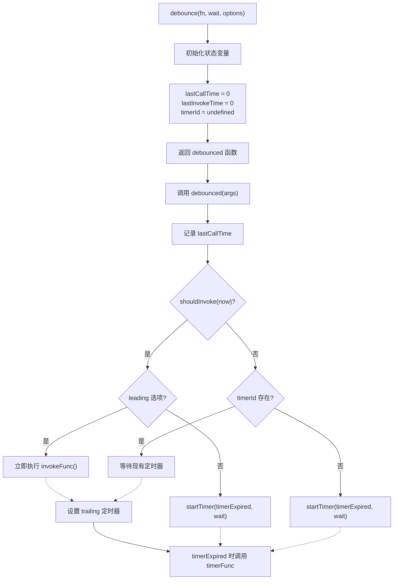

# 防抖与节流

> 防抖和节流是限制函数执行频率的两种核心技术，用于优化 scroll、resize、mousemove、input 等高频事件的性能表现，提升页面流畅度和用户体验。

## 为什么需要防抖与节流

以下事件容易被频繁触发，导致大量不必要的计算：

| 事件类型 | 触发场景 | 风险 |
|----------|----------|------|
| `scroll` | 页面滚动 | 懒加载计算、吸顶效果判断 |
| `resize` | 窗口大小变化 | 响应式布局重算 |
| `mousemove` | 鼠标移动 | 拖拽、绘图 |
| `input` / `keyup` | 输入框输入 | 搜索建议、表单验证 |

**高频回调的后果**：页面卡顿、抖动、CPU 占用过高。防抖与节流正是解决这一类问题的核心策略。

核心区别图示：

```
防抖 (Debounce)：
┌─────────────────────────────────────────────────────┐
│ 触发:  ████████████████                              │
│        ↑ ↑ ↑ ↑ ↑ ↑ ↑                                 │
│        └─┴─┴─┴─┴─┴─ 重置计时器                        │
│                                                     │
│ 执行:                        ████████               │
│                              ↑                      │
│                              └─ 停止触发后执行        │
└─────────────────────────────────────────────────────┘
特点：最后一次触发后等待一定时间再执行

节流 (Throttle)：
┌─────────────────────────────────────────────────────┐
│ 触发:  ████████████████████████████████              │
│        ↑ ↑ ↑ ↑ ↑ ↑ ↑ ↑ ↑ ↑ ↑ ↑                       │
│                                                     │
│ 执行:  ████        ████        ████                  │
│        ↑           ↑           ↑                    │
│        └─ 固定间隔执行                              │
└─────────────────────────────────────────────────────┘
特点：固定时间间隔执行一次
```

---

## 防抖（Debounce）

### 原理与实现

> **最后一个人说了算** — 在指定时间内反复触发则重新计时，只在停止触发后执行一次。

```
时间轴：
触发 → 重置定时器 → 触发 → 重置定时器 → 触发 → ... → 停止 → [执行]
                    ↑                              ↑ 等待 delay 后
              每次触发都清除旧的定时器并新建
```

#### 基础实现

```javascript
/**
 * 基础防抖：停止触发后延迟执行
 * @param {Function} fn - 要执行的函数
 * @param {number} delay - 延迟时间（毫秒）
 * @returns {Function} 防抖后的函数
 */
function debounce(fn, delay) {
  let timer = null;

  return function (...args) {
    const context = this;

    // 每次触发都清除上一次的定时器
    if (timer) clearTimeout(timer);

    // 设置新的定时器
    timer = setTimeout(() => {
      fn.apply(context, args);
    }, delay);
  };
}
```

### 应用场景（搜索框输入、窗口 resize）

```javascript
// 1. 搜索输入框
const searchInput = document.getElementById('search');

const debouncedSearch = debounce(async (query) => {
  if (query.length < 2) return;

  const results = await fetch(`/api/search?q=${query}`);
  showSuggestions(results);
}, 300);

searchInput.addEventListener('input', (e) => {
  debouncedSearch(e.target.value);
});

// 2. 自动保存（用户停止输入 1 秒后保存）
const autoSave = debounce(() => {
  showToast('已自动保存');
}, 1000);

editor.addEventListener('change', () => {
  autoSave(editor.getContent());
});
```

---

## 节流（Throttle）

### 原理与实现

> **第一个人说了算** — 在指定时间间隔内，只执行第一次触发的回调。

```
时间轴：
触发 → [执行] → 忽略 → 忽略 → 忽略 → 触发 → [执行] → ...
       ↑ t=0s                          ↑ t=1s
       （间隔内后续触发全部忽略）
```

#### 时间戳实现

特点：第一次触发立即执行。

```javascript
/**
 * 基础节流：固定时间间隔执行，间隔内忽略后续调用
 * @param {Function} fn - 要执行的函数
 * @param {number} interval - 时间间隔（毫秒）
 * @returns {Function} 节流后的函数
 */
function throttle(fn, interval) {
  let lastTime = 0;

  return function (...args) {
    const context = this;
    const now = Date.now();

    if (now - lastTime >= interval) {
      lastTime = now;
      fn.apply(context, args);
    }
  };
}
```

#### 定时器实现

特点：最后一次触发后仍会执行一次。

```javascript
function throttle(fn, delay) {
  let timer = null;

  return function (...args) {
    const context = this;

    if (!timer) {
      timer = setTimeout(() => {
        fn.apply(context, args);
        timer = null;
      }, delay);
    }
  };
}
```

#### 带尾调用的节流版本

基础版本的节流在间隔结束后的最后一次触发会被"丢弃"。如果需要保证最后一次触发也能执行：

```javascript
function throttleWithTrailing(fn, delay) {
  let lastTime = 0;
  let timer = null;

  return function (...args) {
    const context = this;
    const now = Date.now();

    if (now - lastTime < delay) {
      // 间隔未到，设置定时器确保最后执行一次
      if (timer) clearTimeout(timer);
      timer = setTimeout(() => {
        lastTime = Date.now();
        fn.apply(context, args);
      }, delay - (now - lastTime));
    } else {
      // 间隔已到，立即执行
      lastTime = now;
      fn.apply(context, args);
    }
  };
}
```

#### 完整实现（支持 leading / trailing 选项）

```javascript
/**
 * 节流函数 - 完整版本
 * @param {Function} fn - 要执行的函数
 * @param {number} delay - 间隔时间（毫秒）
 * @param {Object} options - 配置选项
 * @param {boolean} options.leading - 是否首次触发执行（默认 true）
 * @param {boolean} options.trailing - 是否结束后执行最后一次（默认 true）
 */
function throttle(fn, delay, options = {}) {
  let timer = null;
  let lastTime = 0;
  const { leading = true, trailing = true } = options;

  const throttled = function (...args) {
    const context = this;
    const now = Date.now();

    // leading：首次触发立即执行
    if (!lastTime && leading === false) lastTime = now;

    if (now - lastTime >= delay) {
      if (trailing) {
        lastTime = now;
        fn.apply(context, args);
      }
    } else if (trailing && !timer) {
      // trailing：间隔结束后执行最后一次
      timer = setTimeout(() => {
        timer = null;
        lastTime = Date.now();
        fn.apply(context, args);
      }, delay - (now - lastTime));
    }
  };

  throttled.cancel = () => {
    clearTimeout(timer);
    timer = null;
    lastTime = 0;
  };

  return throttled;
}
```

### 应用场景（滚动事件、拖拽）

```javascript
// 1. 滚动事件
const throttledScroll = throttle(() => {
  const scrollTop = window.scrollY;

  // 更新导航栏样式
  updateNavbar(scrollTop);

  // 懒加载图片
  checkLazyLoad();
}, 200);

window.addEventListener('scroll', throttledScroll, { passive: true });

// 2. 拖拽事件（配合 mousemove）
class Draggable {
  constructor(element) {
    this.element = element;
    // 节流拖拽处理，避免每帧都执行
    this.handleDrag = throttle(this.drag.bind(this), 16);
    this.bindEvents();
  }

  bindEvents() {
    this.element.addEventListener('mousedown', (e) => {
      this.dragging = true;
      document.addEventListener('mousemove', this.handleDrag);
    });
    document.addEventListener('mouseup', () => {
      this.dragging = false;
      document.removeEventListener('mousemove', this.handleDrag);
    });
  }

  drag(e) {
    this.element.style.left = e.clientX + 'px';
    this.element.style.top = e.clientY + 'px';
  }
}
```

---

## 进阶用法

### 带立即执行选项

有时需要在首次触发时立即执行一次，之后才进入防抖逻辑：

```javascript
/**
 * 可配置防抖：支持立即执行选项
 * @param {Function} fn - 要执行的函数
 * @param {number} delay - 延迟时间（毫秒）
 * @param {boolean} [immediate=false] - 是否立即执行首次触发
 * @returns {Function} 防抖后的函数
 */
function debounce(fn, delay, immediate = false) {
  let timer = null;

  return function (...args) {
    const context = this;

    if (timer) clearTimeout(timer);

    // 立即执行模式：首次触发立即执行
    if (immediate && !timer) {
      fn.apply(context, args);
    }

    timer = setTimeout(() => {
      if (!immediate) {
        fn.apply(context, args);
      }
      timer = null;
    }, delay);
  };
}
```

使用示例——按钮防重复提交：

```javascript
const submitBtn = document.getElementById('submit');

const debouncedSubmit = debounce(async () => {
  await submitForm();
}, 2000, true); // 立即执行，防止重复提交

submitBtn.addEventListener('click', debouncedSubmit);

// 执行效果：
// 点击 ──立即执行── 等待2秒 ── 可以再次执行
```

### 带取消功能

```javascript
function debounce(fn, delay, immediate = false) {
  let timer = null;

  const debounced = function (...args) {
    const context = this;

    if (timer) clearTimeout(timer);

    if (immediate && !timer) {
      fn.apply(context, args);
    }

    timer = setTimeout(() => {
      if (!immediate) fn.apply(context, args);
      timer = null;
    }, delay);
  };

  // 取消待执行的调用
  debounced.cancel = function () {
    clearTimeout(timer);
    timer = null;
  };

  debounced.pending = function () {
    return timer !== null;
  };

  return debounced;
}
```

使用示例——组件卸载时取消：

```javascript
const debounced = debounce(fn, 300);

// 取消
debounced.cancel();

// React 中的清理
useEffect(() => {
  return () => {
    debounced.cancel();
  };
}, []);
```

### requestAnimationFrame 节流

适合动画场景，保证每帧只执行一次，与浏览器渲染节奏同步：

```javascript
/**
 * 使用 requestAnimationFrame 的节流
 * @param {Function} fn - 要执行的函数
 * @returns {Function} 节流后的函数
 */
function rafThrottle(fn) {
  let locked = false;

  return function (...args) {
    const context = this;

    if (locked) return;
    locked = true;

    requestAnimationFrame(() => {
      fn.apply(context, args);
      locked = false;
    });
  };
}

// 使用示例：平滑滚动动画
window.addEventListener('scroll', rafThrottle(() => {
  updateParallax();
  updateNavbarOpacity();
}), { passive: true });
```

### 防抖 + 节流组合

确保至少每 N 毫秒执行一次，同时也不会遗漏最终的调用：

```javascript
function debounceWithThrottle(fn, debounceDelay, throttleDelay) {
  let debounceTimer = null;
  let lastExecuteTime = 0;

  return function (...args) {
    const context = this;
    const now = Date.now();

    // 清除防抖定时器
    clearTimeout(debounceTimer);

    // 节流：超过间隔时间立即执行
    if (now - lastExecuteTime >= throttleDelay) {
      fn.apply(context, args);
      lastExecuteTime = now;
    } else {
      // 防抖：延迟执行
      debounceTimer = setTimeout(() => {
        fn.apply(context, args);
        lastExecuteTime = Date.now();
      }, debounceDelay);
    }
  };
}

// 使用场景：确保搜索请求不会太频繁，但也不会太延迟
const smartSearch = debounceWithThrottle(search, 300, 1000);
```

### 支持异步函数

```javascript
// 等待上一次执行完成才允许下一次
function throttleAsync(fn, delay) {
  let lastTime = 0;
  let pending = false;

  return async function (...args) {
    if (pending) return;

    const now = Date.now();
    if (now - lastTime < delay) return;

    pending = true;
    lastTime = now;

    try {
      return await fn.apply(this, args);
    } finally {
      pending = false;
    }
  };
}

// 使用示例
const throttledFetch = throttleAsync(fetchData, 1000);
const debouncedFetch = debounce(fetchData, 300);
const result = await debouncedFetch('query');
```

### 函数装饰器

```javascript
// ES5 简化装饰器
function debounceMethod(target, name, descriptor) {
  const original = descriptor.value;
  let timer = null;

  descriptor.value = function (...args) {
    clearTimeout(timer);
    timer = setTimeout(() => original.apply(this, args), 300);
  };

  return descriptor;
}

class SearchComponent {
  @debounceMethod
  handleInput(value) {
    this.search(value);
  }
}
```

### React Hooks 封装

```javascript
// 防抖 Hook
function useDebounce(fn, delay) {
  const fnRef = useRef(fn);
  fnRef.current = fn;

  const debouncedFn = useMemo(() => {
    return debounce((...args) => fnRef.current(...args), delay);
  }, [delay]);

  useEffect(() => {
    return () => debouncedFn.cancel();
  }, [debouncedFn]);

  return debouncedFn;
}

// 使用：输入停止 300ms 后才发起搜索
function SearchComponent() {
  const [query, setQuery] = useState('');
  const debouncedSearch = useDebounce((q) => fetchResults(q), 300);

  function handleChange(e) {
    setQuery(e.target.value);
    debouncedSearch(e.target.value);
  }

  return <input value={query} onChange={handleChange} />;
}
```

### Vue 组合式函数

```javascript
import { ref, onUnmounted } from 'vue';

// 防抖
export function useDebounce(fn, delay) {
  let timer = null;

  const debounced = (...args) => {
    clearTimeout(timer);
    timer = setTimeout(() => fn(...args), delay);
  };

  const cancel = () => {
    clearTimeout(timer);
    timer = null;
  };

  onUnmounted(cancel);

  return { debounced, cancel };
}

// 节流
export function useThrottle(fn, delay) {
  let lastTime = 0;

  const throttled = (...args) => {
    const now = Date.now();
    if (now - lastTime >= delay) {
      lastTime = now;
      fn(...args);
    }
  };

  const cancel = () => {
    lastTime = 0;
  };

  onUnmounted(cancel);

  return { throttled, cancel };
}
```

---

## 防抖 vs 节流对比

### 核心对比

| 维度 | 防抖（Debounce） | 节流（Throttle） |
|------|------------------|------------------|
| **核心逻辑** | 延迟到停止触发后执行 | 固定频率执行 |
| **执行时机** | 停止触发后 | 持续触发时定期执行 |
| **执行次数** | 通常只执行一次 | 可能多次（按固定间隔） |
| **响应延迟** | 取决于停止触发时间 | 固定间隔 |
| **首触发** | 可配置是否立即执行 | 立即执行（可配置） |
| **末触发** | 保证执行（停止后） | 可能丢失（可配置 trailing） |
| **比喻** | "等所有人都上车后再发车" | "每 N 秒发一班车" |

### 适用场景对比

| 场景 | 防抖 | 节流 |
|------|------|------|
| 搜索输入 | ✅ | ❌ |
| 窗口调整 | ✅ | ✅ |
| 滚动事件 | ❌ | ✅ |
| 鼠标移动 | ❌ | ✅ |
| 按钮防重复 | ❌ | ✅ |
| 表单验证 | ✅ | ❌ |

### 场景选型决策

```
用户操作特征是什么？
├── 持续性操作（如滚动、拖拽）
│   └── 需要持续反馈 → 使用 Throttle
│
└── 间歇性操作（如输入、搜索）
    ├── 需要即时反馈 → Throttle 或 立即执行版 Debounce
    └── 需要最终结果 → Debounce
```

### 延迟时间参考

| 场景 | 建议延迟 | 理由 |
|------|----------|------|
| 搜索建议 | 200-500ms | 用户输入时有停顿 |
| 窗口调整 | 100-200ms | 调整过程较快 |
| 滚动事件 | 100-200ms | 滚动流畅性 |
| 自动保存 | 1000-3000ms | 避免频繁请求 |
| 鼠标移动 | 16-50ms | 接近帧率，平滑跟踪 |

---

## 实际案例

### 搜索建议

```javascript
class Autocomplete {
  constructor(input, options = {}) {
    this.input = input;
    this.minChars = options.minChars || 2;
    this.delay = options.delay || 300;
    this.debounceSearch = debounce(this.search.bind(this), this.delay);

    this.bindEvents();
  }

  bindEvents() {
    this.input.addEventListener('input', (e) => {
      const value = e.target.value;
      if (value.length >= this.minChars) {
        this.debounceSearch(value);
      } else {
        this.hideSuggestions();
      }
    });
  }

  search(query) {
    // 请求搜索接口并展示建议
  }

  hideSuggestions() {
    // 隐藏建议列表
  }
}
```

### 无限滚动

```javascript
class InfiniteScroll {
  constructor(options = {}) {
    this.container = options.container || window;
    this.threshold = options.threshold || 100;
    this.loadMore = options.loadMore;
    this.loading = false;

    this.throttledCheck = throttle(this.checkScroll.bind(this), 200);
    this.bindEvents();
  }

  bindEvents() {
    this.container.addEventListener('scroll', this.throttledCheck, {
      passive: true,
    });
  }

  checkScroll() {
    // 滚动到底部附近时加载更多
    if (this.loading) return;
    const scrollHeight = document.documentElement.scrollHeight;
    const scrollTop = window.scrollY;
    const clientHeight = window.innerHeight;

    if (scrollHeight - scrollTop - clientHeight < this.threshold) {
      this.loadMore();
    }
  }

  destroy() {
    this.container.removeEventListener('scroll', this.throttledCheck);
    this.throttledCheck.cancel();
  }
}
```

### 实时协作编辑

```javascript
class CollaborativeEditor {
  constructor(editor) {
    this.editor = editor;
    this.localChanges = [];

    // 防抖：本地保存
    this.debouncedSave = debounce(this.saveLocal.bind(this), 1000);

    // 节流：同步到服务器
    this.throttledSync = throttle(this.syncToServer.bind(this), 5000);

    this.bindEvents();
  }

  bindEvents() {
    // 输入时防抖保存本地
    this.editor.on('change', () => {
      this.localChanges.push(this.editor.getContent());
      this.debouncedSave();
    });
    // 周期同步到服务器
    this.editor.on('change', this.throttledSync);
  }

  saveLocal() {
    // 保存到本地存储
  }

  syncToServer() {
    const changes = this.localChanges;
    this.localChanges = [];
    try {
      this.server.sync(changes);
    } catch (error) {
      // 同步失败，恢复变更
      this.localChanges = [...changes, ...this.localChanges];
    }
  }
}
```

---

## 生产环境建议

生产环境中推荐使用 Lodash 的成熟实现：

```javascript
import { throttle, debounce } from 'lodash-es';

// 节流
const handleScroll = throttle(() => { /* ... */ }, 100);

// 防抖（支持 leading / trailing 选项）
const handleInput = debounce(() => { /* ... */ }, 300, { leading: true, trailing: true });
```

## Lodash 源码分析

Lodash 的 `debounce` 和 `throttle` 是业界最成熟的实现，理解其源码有助于深入掌握防抖节流的边界处理。

### debounce 核心源码解析

Lodash debounce 的核心逻辑远比基础实现复杂，它处理了以下边界情况：



> 📊 图表解读：Lodash debounce 的核心是 `shouldInvoke` 判断和 `remainingWait` 计算。它通过精确的时间差计算来决定是立即执行、设置定时器还是等待，确保 leading/trailing 选项正确工作。

#### 关键源码片段

```javascript
// Lodash debounce 核心逻辑（简化版，保留关键设计）
function debounce(func, wait, options = {}) {
  let lastArgs, lastThis, result, timerId, lastCallTime
  let lastInvokeTime = 0
  let maxing = false  // 是否启用 maxWait

  const leading = !!options.leading
  const trailing = 'trailing' in options ? !!options.trailing : true
  const maxWait = options.maxWait  // debounce + throttle 组合的关键

  if (maxWait !== undefined) {
    maxing = true
  }

  // 判断是否应该调用（处理系统时间回退等边界）
  function shouldInvoke(time) {
    const timeSinceLastCall = time - lastCallTime
    const timeSinceLastInvoke = time - lastInvokeTime

    // 首次调用、超过等待时间、系统时间回退、超过 maxWait
    return (
      lastCallTime === undefined ||
      timeSinceLastCall >= wait ||
      timeSinceLastCall < 0 ||
      (maxing && timeSinceLastInvoke >= maxWait)
    )
  }

  // 核心：调用函数
  function invokeFunc(time) {
    const args = lastArgs
    const thisArg = lastThis
    lastArgs = lastThis = undefined
    lastInvokeTime = time
    result = func.apply(thisArg, args)
    return result
  }

  // 启动定时器（重新计算剩余等待时间）
  function startTimer(pendingFunc, waitTime) {
    return setTimeout(pendingFunc, waitTime)
  }

  function debounced(...args) {
    const time = Date.now()
    lastArgs = args
    lastThis = this
    lastCallTime = time

    if (shouldInvoke(time)) {
      return invokeFunc(time)
    }
    timerId = startTimer(timerExpired, wait)
    return result
  }

  debounced.cancel = function () {
    clearTimeout(timerId)
    lastArgs = lastThis = timerId = undefined
  }

  debounced.pending = function () {
    return timerId !== undefined
  }

  return debounced
}
```

### Lodash debounce 的关键设计

| 设计点 | 说明 | 基础实现是否覆盖 |
|--------|------|:---:|
| **系统时间回退** | `timeSinceLastCall < 0` 处理切换时区等场景 | ❌ |
| **maxWait 选项** | 设置最大等待时间，实现 debounce + throttle 组合 | ❌ |
| **trailing 定时器** | leading 执行后仍设置 trailing 定时器 | ❌ |
| **lastArgs/lastThis** | 保存最后一次调用的参数和 this | ❌ |
| **flush 方法** | 立即执行待处理的调用 | ❌ |
| **pending 方法** | 检查是否有待执行的调用 | ❌ |
| **递归定时器** | `timerExpired` 中重新计算 `remainingWait` | ❌ |

### throttle 是 debounce 的特例

Lodash 的 `throttle` 实际上是 `debounce` 的语法糖：

```javascript
// Lodash throttle 源码
function throttle(func, wait, options = {}) {
  const leading = 'leading' in options ? !!options.leading : true
  const trailing = 'trailing' in options ? !!options.trailing : true

  return debounce(func, wait, {
    leading,
    trailing,
    maxWait: wait,  // 关键：maxWait = wait 确保最多等 wait 时间就执行
  })
}
```

> 💡 **核心洞察**：`throttle(fn, 1000)` 等价于 `debounce(fn, 1000, { leading: true, trailing: true, maxWait: 1000 })`。`maxWait` 保证了即使持续触发，最多等 `maxWait` 时间就会执行一次，这就是节流的效果。

### Lodash vs 基础实现对比

```javascript
// 场景：持续触发 5 秒，wait = 1000ms

// 基础 debounce：只在停止触发后执行 1 次
// 0s ─── 1s ─── 2s ─── 3s ─── 4s ─── 5s ─── 停止 ─── 6s [执行1次]

// Lodash debounce + maxWait=1000（默认 leading:false）：最多每 1 秒执行 1 次 + 停止后 1 次
// 0s 触发 ─── 1s [执行] ─── 2s [执行] ─── 3s [执行] ─── 4s [执行] ─── 5s [执行] ─── 停止 ─── 6s [trailing]

// Lodash throttle：每 1 秒执行 1 次
// 0s [执行] ─── 1s [执行] ─── 2s [执行] ─── 3s [执行] ─── 4s [执行] ─── 5s [执行]
```

### 常见边界情况

```javascript
// 1. 系统时间回退（切换时区、NTP 校时）
// Lodash 通过 timeSinceLastCall < 0 检测并立即执行
// 基础实现会卡住，直到"追上"回退的时间

// 2. 连续调用中 this 变化
const obj1 = { name: 'A' }
const obj2 = { name: 'B' }
const debounced = debounce(function() { console.log(this.name) }, 100)

debounced.call(obj1)  // lastThis = obj1
debounced.call(obj2)  // lastThis = obj2（Lodash 保存最后一次的 this）
// 停止后执行 → 输出 'B'（正确）

// 3. flush 在 React 中的使用
// 确保组件卸载前执行最后一次防抖调用
useEffect(() => {
  return () => debouncedSearch.flush()
}, [])

// 4. pending 检查
// 避免在防抖等待期间显示"已保存"
const debouncedSave = debounce(save, 1000)
const isSaving = debouncedSave.pending()
```

---

## 常见问题

### leading 和 trailing 选项有什么作用？

```javascript
// leading: true - 首次触发立即执行
// trailing: true - 最后一次触发后执行

// 默认配置（首次和尾部都执行）
throttle(fn, 100); // { leading: true, trailing: true }

// 只在首次执行
throttle(fn, 100, { leading: true, trailing: false });

// 只在尾部执行（类似防抖）
throttle(fn, 100, { leading: false, trailing: true });

// 都不执行（Lodash 会直接抛错：leading 与 trailing 不能同时为 false）
throttle(fn, 100, { leading: false, trailing: false });
```

### 防抖和节流如何选择？

```javascript
// 场景1：只需要最终结果
// 搜索、表单验证、自动保存 → 防抖

// 场景2：需要持续反馈
// 滚动、拖拽、鼠标跟踪 → 节流

// 场景3：防止重复提交
// 按钮点击 → 节流（带立即执行）

// 场景4：不确定时的决策
// 用户输入有预期延迟 → 防抖
// 用户操作有即时反馈需求 → 节流
```

---

## 优化总结

| 技术 | 执行时机 | 适用场景 | 延迟建议 |
|------|----------|----------|----------|
| 防抖 | 停止触发后 | 搜索、保存、验证 | 200-1000ms |
| 节流 | 固定间隔 | 滚动、拖拽、移动 | 16-200ms |
| 组合 | 混合模式 | 复杂交互 | 按需配置 |

> 提示：防抖适合"最后一次为准"的场景，节流适合"定期执行"的场景。选择合适的技术能显著提升用户体验。
