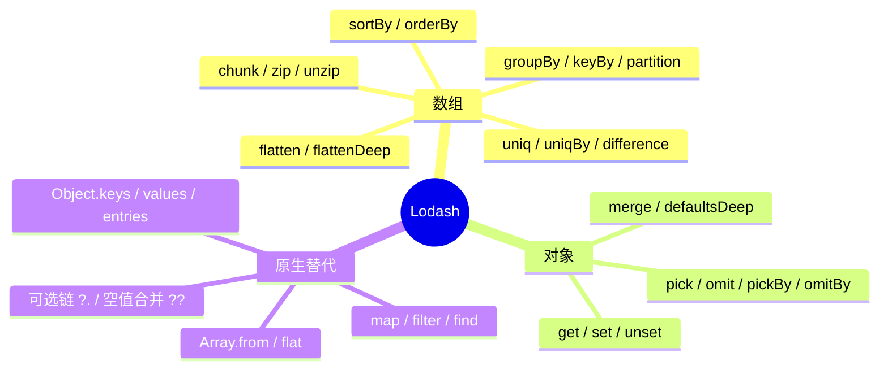
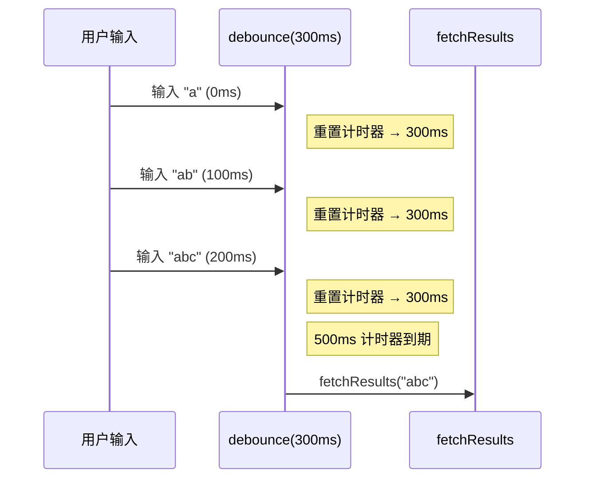
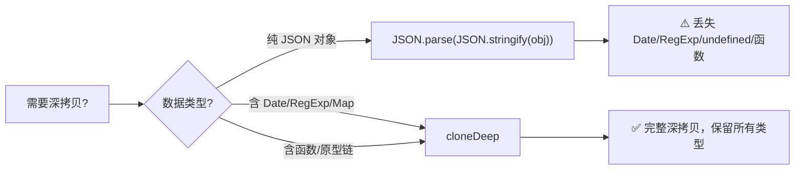
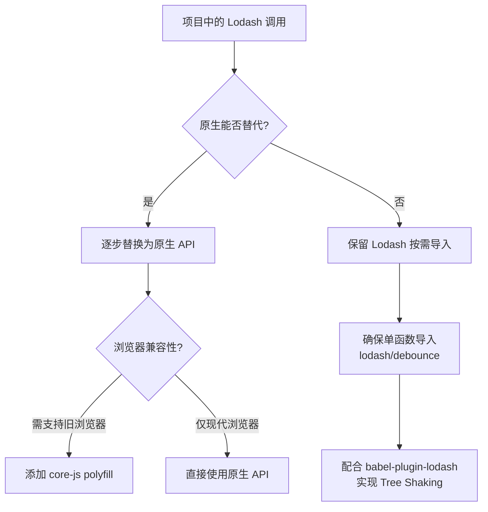

# Lodash 使用

> Lodash 是最流行的 JavaScript 实用工具库，提供了模块化、高性能的函数式编程工具。它弥补了原生 JavaScript 在深拷贝、防抖节流、复杂对象操作等方面的不足，是现代前端工程中不可或缺的基础设施。



---

## 一、安装与导入

### 安装

```bash
npm install lodash
npm install lodash-es  # ES Module 版本
```

### 按需导入策略

```javascript
// ✅ 推荐：按需导入 — Tree Shaking 友好
import debounce from 'lodash/debounce';
import throttle from 'lodash/throttle';
import cloneDeep from 'lodash/cloneDeep';
import isEqual from 'lodash/isEqual';

// ✅ 也可以：lodash-es 支持 Tree Shaking
import { debounce, throttle, cloneDeep } from 'lodash-es';

// ❌ 不推荐：导入整个库（全量约 72KB minified / 25KB gzipped）
import _ from 'lodash';
```

> ⚠️ **Tree Shaking 注意事项**：使用 `lodash`（CommonJS 版本）时，`import { debounce } from 'lodash'` 无法被 Webpack/Vite 的 Tree Shaking 移除未使用代码。必须使用 `lodash/debounce` 单独导入，或切换到 `lodash-es`。

### 按需导入的 Babel 插件

```bash
npm install lodash-webpack-plugin babel-plugin-lodash --save-dev
```

```javascript
// babel.config.js
module.exports = {
  plugins: ['lodash']
};
```

```javascript
// webpack.config.js
const LodashModuleReplacementPlugin = require('lodash-webpack-plugin');

module.exports = {
  plugins: [new LodashModuleReplacementPlugin()]
};
```

> 💡 配合 `babel-plugin-lodash` + `lodash-webpack-plugin`，`import { debounce } from 'lodash'` 也能实现 Tree Shaking，同时保持代码简洁。

---

## 二、数组方法

### chunk — 数组分块

```javascript
import chunk from 'lodash/chunk';

chunk([1, 2, 3, 4, 5], 2);
// [[1, 2], [3, 4], [5]]

// 实战场景：分页渲染
const items = Array.from({ length: 97 }, (_, i) => i + 1);
const pageSize = 10;
const pages = chunk(items, pageSize);
// pages.length === 10，最后一页 7 条
```

### flattenDeep — 深层扁平化

```javascript
import flattenDeep from 'lodash/flattenDeep';

flattenDeep([1, [2, [3, [4]]]]);
// [1, 2, 3, 4]

// 原生替代（ES2019+）
[1, [2, [3, [4]]]].flat(Infinity);
// [1, 2, 3, 4]
```

### uniq / uniqBy — 去重

```javascript
import uniq from 'lodash/uniq';
import uniqBy from 'lodash/uniqBy';

uniq([1, 1, 2, 2, 3]);
// [1, 2, 3]

// 按属性去重
const users = [
  { id: 1, name: 'Alice' },
  { id: 2, name: 'Bob' },
  { id: 1, name: 'Alice Clone' }
];

uniqBy(users, 'id');
// [{ id: 1, name: 'Alice' }, { id: 2, name: 'Bob' }]

// 原生替代（ES2015+，Set + 展开运算符）
[...new Set([1, 1, 2, 2, 3])]; // 简单值去重
```

### groupBy — 分组

```javascript
import groupBy from 'lodash/groupBy';

const users = [
  { name: 'Alice', age: 25 },
  { name: 'Bob', age: 25 },
  { name: 'Charlie', age: 30 }
];

groupBy(users, 'age');
// { 25: [{...}, {...}], 30: [{...}] }

// 函数作为分组依据
groupBy([6.1, 4.2, 6.3], Math.floor);
// { 4: [4.2], 6: [6.1, 6.3] }

// 原生替代（ES2024+）
Object.groupBy(users, u => u.age);
```

### keyBy — 键值映射

```javascript
import keyBy from 'lodash/keyBy';

const users = [
  { id: 'a', name: 'Alice' },
  { id: 'b', name: 'Bob' }
];

keyBy(users, 'id');
// { a: { id: 'a', name: 'Alice' }, b: { id: 'b', name: 'Bob' } }
```

### difference / intersection — 集合运算

```javascript
import difference from 'lodash/difference';
import intersection from 'lodash/intersection';
import union from 'lodash/union';

difference([2, 1], [2, 3]);       // [1] — 在 A 不在 B
intersection([2, 1], [2, 3]);     // [2] — 交集
union([2, 1], [2, 3]);            // [2, 1, 3] — 并集
```

### sortBy / orderBy — 排序

```javascript
import sortBy from 'lodash/sortBy';
import orderBy from 'lodash/orderBy';

const users = [
  { name: 'Alice', age: 30 },
  { name: 'Bob', age: 25 },
  { name: 'Charlie', age: 35 }
];

sortBy(users, 'age');
// 按 age 升序

orderBy(users, ['age', 'name'], ['desc', 'asc']);
// 按 age 降序，相同则按 name 升序
```

---

## 三、对象方法

### get — 安全访问嵌套属性

```javascript
import get from 'lodash/get';

const obj = { a: { b: { c: 1 } } };

get(obj, 'a.b.c');     // 1
get(obj, 'a.b.d');     // undefined
get(obj, 'a.b.d', 0);  // 0 (默认值)

// 支持数组路径
get(obj, ['a', 'b', 'c']); // 1

// 原生替代（ES2020+）
obj?.a?.b?.c   // 1
obj?.a?.b?.d   // undefined
obj?.a?.b?.d ?? 0  // 0
```

> 💡 **何时仍需 `get`**：当属性路径是动态字符串时（如来自 API 配置），`get(obj, dynamicPath, default)` 比手写 `?.` 链更灵活。

### set — 安全设置嵌套属性

```javascript
import set from 'lodash/set';

const obj = { a: 1 };
set(obj, 'b.c', 2);
// { a: 1, b: { c: 2 } }

// 自动创建中间路径
set(obj, 'x.y.z[0]', 'hello');
// { a: 1, b: { c: 2 }, x: { y: { z: ['hello'] } } }
```

### pick / omit — 属性筛选

```javascript
import pick from 'lodash/pick';
import omit from 'lodash/omit';
import pickBy from 'lodash/pickBy';
import omitBy from 'lodash/omitBy';

const obj = { a: 1, b: 2, c: 3 };

pick(obj, ['a', 'b']);  // { a: 1, b: 2 }
omit(obj, ['a']);       // { b: 2, c: 3 }

// 函数式筛选
pickBy(obj, v => v > 1);    // { b: 2, c: 3 }
omitBy(obj, v => v === 2);  // { a: 1, c: 3 }

// 原生替代
const { a, ...rest } = obj; // rest = { b: 2, c: 3 } — 等价于 omit(obj, ['a'])
```

### merge — 深度合并

```javascript
import merge from 'lodash/merge';
import defaultsDeep from 'lodash/defaultsDeep';

const obj1 = { a: 1, b: { x: 1 } };
const obj2 = { b: { y: 2 }, c: 3 };

merge(obj1, obj2);
// { a: 1, b: { x: 1, y: 2 }, c: 3 }

// defaultsDeep — 只填充缺失值，不覆盖已有值
const config = { api: { timeout: 5000 } };
const defaults = { api: { timeout: 3000, retries: 3 }, debug: false };

defaultsDeep(config, defaults);
// { api: { timeout: 5000, retries: 3 }, debug: false }
```

> ⚠️ **`merge` vs `Object.assign` vs 展开运算符**：`Object.assign` 和 `{...a, ...b}` 只做浅合并，嵌套对象会被整体覆盖而非深度合并。需要深度合并时使用 `merge`。

### mapKeys / mapValues — 键值映射

```javascript
import mapKeys from 'lodash/mapKeys';
import mapValues from 'lodash/mapValues';

const obj = { a: 1, b: 2, c: 3 };

mapKeys(obj, (v, k) => k.toUpperCase());
// { A: 1, B: 2, C: 3 }

mapValues(obj, v => v * 2);
// { a: 2, b: 4, c: 6 }
```

---

## 四、函数方法

### debounce — 防抖

```javascript
import debounce from 'lodash/debounce';

const handleSearch = debounce((query) => {
  fetchResults(query);
}, 300);

input.addEventListener('input', (e) => {
  handleSearch(e.target.value);
});

// 取消待执行的调用
handleSearch.cancel();

// 立即执行（如果存在待执行的调用）
handleSearch.flush();

// 组件卸载时务必取消
// React 示例
useEffect(() => {
  return () => handleSearch.cancel();
}, []);
```



> 📊 防抖的核心：每次输入都重置计时器，只在最后一次输入后等待指定时间才执行。

### throttle — 节流

```javascript
import throttle from 'lodash/throttle';

const handleScroll = throttle(() => {
  updatePosition();
}, 200);

window.addEventListener('scroll', handleScroll);

// 取消
handleScroll.cancel();

// 带选项的节流
const handler = throttle(fn, 200, {
  leading: true,   // 首次立即执行（默认 true）
  trailing: true    // 结尾再执行一次（默认 true）
});
```

> 💡 **debounce vs throttle**：
> - **debounce**：等待用户停止操作后才执行（搜索框、表单验证）
> - **throttle**：以固定频率执行，不管中间触发多少次（滚动、resize、游戏循环）

### memoize — 记忆化

```javascript
import memoize from 'lodash/memoize';

// 缓存计算结果
const factorial = memoize((n) => {
  return n <= 1 ? 1 : n * factorial(n - 1);
});

factorial(5);  // 计算 → 120
factorial(5);  // 缓存命中 → 120
factorial(6);  // 部分缓存命中 → 720

// 自定义缓存键
const getUser = memoize(
  (id) => fetch(`/api/users/${id}`).then(r => r.json()),
  (id) => id  // 使用 id 作为缓存键
);

// 清除缓存
getUser.cache.clear();
```

### curry — 柯里化

```javascript
import curry from 'lodash/curry';

const add = curry((a, b, c) => a + b + c);

add(1)(2)(3);     // 6
add(1, 2)(3);     // 6
add(1)(2, 3);     // 6

// 实战：创建可复用的过滤器
const filterBy = curry((key, value, items) =>
  items.filter(item => item[key] === value)
);

const filterByStatus = filterBy('status');
const activeItems = filterByStatus('active', allItems);
const pendingItems = filterByStatus('pending', allItems);
```

### flow / flowRight — 函数组合

```javascript
import flow from 'lodash/flow';
import flowRight from 'lodash/flowRight';

const trim = s => s.trim();
const toLower = s => s.toLowerCase();
const split = s => s.split(' ');

const normalize = flow([trim, toLower, split]);

normalize('  Hello World  ');
// ['hello', 'world']

// flowRight 从右往左执行（等同 compose）
const compose = flowRight;
```

---

## 五、深拷贝与比较

### cloneDeep — 深拷贝

```javascript
import cloneDeep from 'lodash/cloneDeep';

const obj = { a: { b: 1 }, date: new Date(), regex: /test/ };
const copy = cloneDeep(obj);

copy.a.b = 2;
console.log(obj.a.b); // 1 (原对象不变)

// cloneDeep 能正确处理：
// - Date → 新 Date 对象
// - RegExp → 新 RegExp 对象
// - Map / Set → 新 Map / Set
// - 循环引用
// - Buffer / TypedArray
```



### isEqual — 深度比较

```javascript
import isEqual from 'lodash/isEqual';

const obj1 = { a: 1, b: { c: 2 } };
const obj2 = { a: 1, b: { c: 2 } };

isEqual(obj1, obj2); // true
obj1 === obj2;       // false（引用比较）

// React 性能优化：深度比较 props
React.memo(Component, (prev, next) => isEqual(prev, next));
```

---

## 六、原生替代方案对照表

### 完全可替代（推荐使用原生）

| Lodash | 原生替代 | ES 版本 |
|--------|----------|---------|
| `_.map` | `arr.map` | ES5 |
| `_.filter` | `arr.filter` | ES5 |
| `_.find` | `arr.find` | ES6 |
| `_.forEach` | `arr.forEach` | ES5 |
| `_.reduce` | `arr.reduce` | ES5 |
| `_.includes` | `arr.includes` | ES2016 |
| `_.flatten` / `_.flattenDeep` | `arr.flat(1)` / `arr.flat(Infinity)` | ES2019 |
| `_.fromPairs` | `Object.fromEntries` | ES2019 |
| `_.keys` / `_.values` / `_.entries` | `Object.keys` / `Object.values` / `Object.entries` | ES5 / ES2017 / ES2017 |
| `_.assign` | `Object.assign` | ES6 |
| `_.isArray` | `Array.isArray` | ES5 |
| `_.isNaN` | `Number.isNaN` | ES6 |
| `_.now` | `Date.now` | ES5 |
| `_.padStart` / `_.padEnd` | `str.padStart` / `str.padEnd` | ES2017 |

---

## 七、性能优化与最佳实践

### Bundle 体积优化

```
// ❌ 全量导入：全量约 72KB minified / 25KB gzipped
import _ from 'lodash';

// ✅ 按需导入：每个函数 ~1-3KB
import debounce from 'lodash/debounce';

// ✅ 使用 lodash-es + Tree Shaking
import { debounce } from 'lodash-es';
```

### 源码解析：debounce 实现原理

```javascript
// 简化版 debounce 实现（理解原理）
function debounce(func, wait) {
  let timerId = null;

  function debounced(...args) {
    // 每次调用都清除上一个计时器
    if (timerId !== null) {
      clearTimeout(timerId);
    }

    // 设置新的计时器，到期后执行
    timerId = setTimeout(() => {
      timerId = null;
      func.apply(this, args);
    }, wait);
  }

  // 取消待执行的调用
  debounced.cancel = function () {
    if (timerId !== null) {
      clearTimeout(timerId);
      timerId = null;
    }
  };

  return debounced;
}
```

### 常见陷阱

```javascript
// ❌ 陷阱 1：每次渲染创建新的 debounced 函数
function SearchBox() {
  // 每次渲染都会创建新实例，防抖失效！
  const handleSearch = debounce(query => fetch(query), 300);
}

// ✅ 修复：使用 useRef 或 useMemo
function SearchBox() {
  const handleSearch = useMemo(
    () => debounce(query => fetch(query), 300),
    []
  );

  useEffect(() => () => handleSearch.cancel(), []);
}

// ❌ 陷阱 2：merge 会修改原对象
const original = { a: 1 };
const merged = merge(original, { b: 2 });
console.log(original); // { a: 1, b: 2 } — 原对象被修改！

// ✅ 修复：传入空对象作为第一个参数
const merged = merge({}, original, { b: 2 });
```

---

## 八、从 Lodash 迁移到原生方案



> 💡 **迁移策略**：不建议一次性全部替换。新代码优先使用原生 API，旧代码在重构时逐步替换。`debounce`、`cloneDeep`、`isEqual`、`merge` 等核心工具可长期保留 Lodash。
