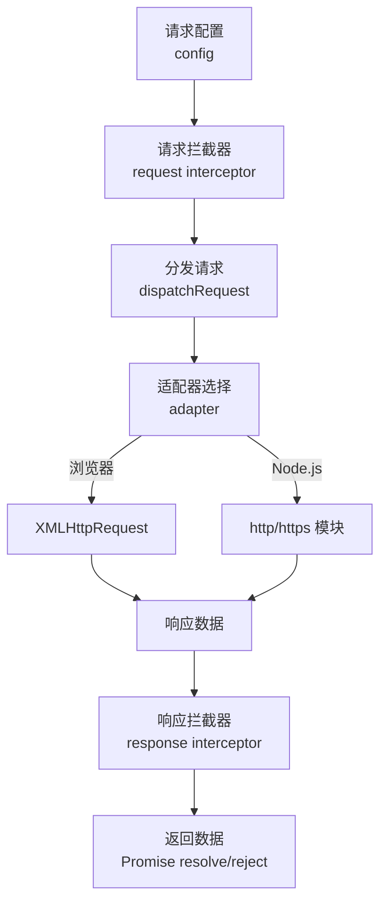
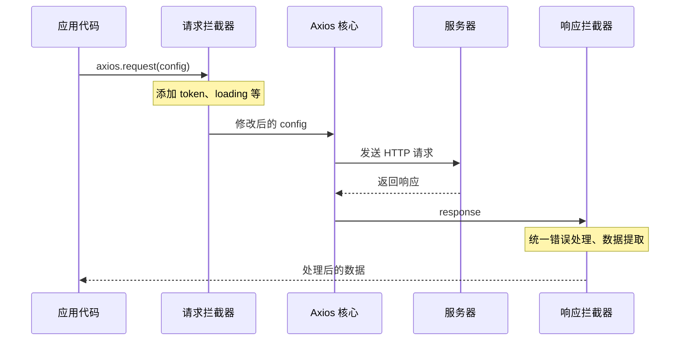
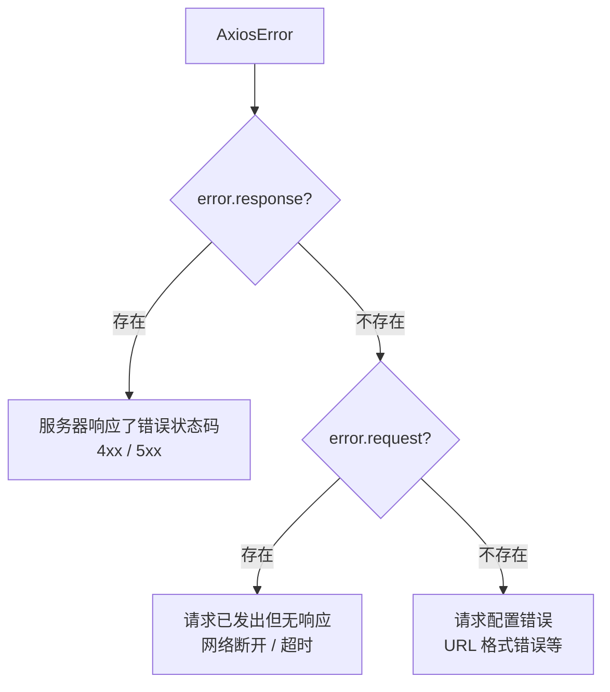

# Axios 请求库

> Axios 是基于 Promise 的 HTTP 客户端，支持浏览器和 Node.js 环境。其核心优势在于拦截器机制、请求取消、自动 JSON 转换和错误处理，是前端项目中最流行的 HTTP 请求库。

## Axios 架构



> 📊 图表解读：Axios 的请求生命周期为「配置 → 请求拦截 → 适配器分发 → 响应拦截 → 返回」。拦截器链是 Axios 最强大的特性，可以在请求和响应阶段统一处理逻辑。

---

## 一、基础使用

### 1.1 安装与引入

```bash
npm install axios
```

```javascript
// ES Module
import axios from 'axios'

// CommonJS
const axios = require('axios')
```

### 1.2 基本请求方法

| 方法 | 说明 | 示例 |
|------|------|------|
| `axios.get()` | GET 请求 | `axios.get('/api/users')` |
| `axios.post()` | POST 请求 | `axios.post('/api/users', data)` |
| `axios.put()` | PUT 请求 | `axios.put('/api/users/1', data)` |
| `axios.delete()` | DELETE 请求 | `axios.delete('/api/users/1')` |
| `axios.patch()` | PATCH 请求 | `axios.patch('/api/users/1', data)` |
| `axios.request()` | 通用请求 | `axios.request({ method, url })` |

### 1.3 请求配置

```javascript
axios({
  method: 'post',       // 请求方法
  url: '/api/users',    // 请求地址
  baseURL: 'https://api.example.com', // 基础 URL
  headers: {            // 请求头
    'Content-Type': 'application/json',
    'Authorization': 'Bearer token123'
  },
  params: {             // URL 查询参数 (?page=1&size=10)
    page: 1,
    size: 10
  },
  data: {               // 请求体数据
    name: '张三',
    age: 25
  },
  timeout: 5000,        // 超时时间（ms）
  withCredentials: true, // 跨域请求是否携带 Cookie
  responseType: 'json',  // 响应数据类型
})
```

---

## 二、拦截器机制

拦截器是 Axios 最核心的特性，允许在请求或响应被处理前进行拦截和修改。

### 2.1 拦截器执行流程



> 📊 图表解读：请求拦截器在请求发出前执行（如添加 token），响应拦截器在响应返回后执行（如统一错误处理）。拦截器的执行顺序：请求拦截器**后注册的先执行**（后进先出），响应拦截器**按注册顺序执行**（先进先出）。

### 2.2 请求拦截器

```javascript
const requestInterceptor = axios.interceptors.request.use(
  (config) => {
    // 添加认证 token
    const token = localStorage.getItem('token')
    if (token) {
      config.headers.Authorization = `Bearer ${token}`
    }

    // ✅ 显示全局加载状态
    NProgress.start()

    return config  // 必须返回 config
  },
  (error) => Promise.reject(error)
)

// 移除拦截器
axios.interceptors.request.eject(requestInterceptor)
```

### 2.3 响应拦截器

```javascript
axios.interceptors.response.use(
  (response) => {
    NProgress.done()
    // 直接返回业务数据，省去 .then(res => res.data)
    return response.data
  },
  (error) => {
    NProgress.done()

    if (error.response) {
      switch (error.response.status) {
        case 401:
          // 未认证：清除凭证并跳转登录页
          localStorage.removeItem('token')
          // router.push('/login')
          break
        case 403:
          Message.error('没有权限访问该资源')
          break
        case 404:
          Message.error('请求的资源不存在')
          break
        case 500:
          Message.error('服务器内部错误')
          break
        default:
          Message.error(`请求失败：${error.response.status}`)
      }
    } else if (error.request) {
      // 请求已发出但没有收到响应
      Message.error('网络异常，请稍后重试')
    } else {
      // 请求配置出错
      Message.error('请求配置错误')
    }

    return Promise.reject(error)
  }
)
```

---

## 三、实例与配置

### 3.1 创建实例

```javascript
// 针对不同 API 服务使用不同配置
const apiClient = axios.create({
  baseURL: 'https://api.example.com',
  timeout: 10000,
  headers: { 'Content-Type': 'application/json' }
})

// ✅ 多服务场景
const userService = axios.create({ baseURL: 'https://user-api.example.com' })
const orderService = axios.create({ baseURL: 'https://order-api.example.com' })
```

### 3.2 配置优先级

```javascript
// 优先级：请求配置 > 实例配置 > 全局默认配置

// 1. 全局默认配置（最低）
axios.defaults.baseURL = 'https://api.example.com'

// 2. 实例配置（中等）
const instance = axios.create({ baseURL: 'https://other-api.example.com' })

// 3. 请求配置（最高）
instance.get('/users', { timeout: 3000 })  // 覆盖实例/默认配置中的 timeout
```

> 💡 合并按上述优先级逐键进行：请求配置中已设置的顶层键（如 `timeout`）会整体覆盖实例与全局默认中的同名键；`headers` 是例外，axios v1 会按头逐项合并而非整体替换。

---

## 四、取消请求

### 4.1 AbortController（推荐）

> 📌 AbortController 是 WHATWG Web 标准 API（现代浏览器与 Node.js 15+ 均已内置），axios 自 v0.22 起支持 `signal` 配置项，推荐使用；旧版的 `CancelToken` 已废弃，新代码请使用 AbortController。

```javascript
const controller = new AbortController()

axios.get('/api/users', { signal: controller.signal })

// 取消请求
controller.abort()
```

### 4.2 React 中取消请求

```javascript
function UserList() {
  const [users, setUsers] = useState([])

  useEffect(() => {
    const controller = new AbortController()

    axios.get('/api/users', { signal: controller.signal })
      .then(data => setUsers(data))
      .catch(err => {
        if (axios.isCancel(err)) {
          console.log('请求已取消')  // ✅ 组件卸载时正常取消
        }
      })

    // ✅ 清理函数：组件卸载时取消未完成请求
    return () => controller.abort()
  }, [])

  return <ul>{users.map(u => <li key={u.id}>{u.name}</li>)}</ul>
}
```

---

## 五、错误处理

### 5.1 错误类型



> 📊 图表解读：Axios 错误分为三类——服务器错误响应、网络无响应、配置错误。通过检查 `error.response` 和 `error.request` 可以精确区分。

### 5.2 统一错误封装

```javascript
class HttpClient {
  constructor(config) {
    this.instance = axios.create(config)
    this._setupInterceptors()
  }

  _setupInterceptors() {
    this.instance.interceptors.response.use(
      (response) => response.data,
      (error) => {
        // 取消请求不作为错误提示
        if (!axios.isCancel(error)) {
          this._handleError(error)
        }
        return Promise.reject(error)
      }
    )
  }

  _handleError(error) {
    if (error.response) {
      Message.error(`请求失败：${error.response.status}`)
    } else if (error.request) {
      Message.error('网络异常，请稍后重试')
    } else {
      Message.error('请求配置错误')
    }
  }

  get(url, params, config) { return this.instance.get(url, { params, ...config }) }
  post(url, data, config) { return this.instance.post(url, data, config) }
}

const http = new HttpClient({ baseURL: '/api', timeout: 10000 })
const users = await http.get('/users', { page: 1 })
```

---

## 六、请求重试

```javascript
axios.interceptors.response.use(null, async (error) => {
  const config = error.config
  if (!config.__retryCount) config.__retryCount = 0

  const maxRetry = config.retry || 3
  const shouldRetry =
    config.__retryCount < maxRetry &&
    (error.code === 'ECONNABORTED' || !error.response || error.response.status >= 500)

  if (shouldRetry) {
    config.__retryCount++
    // ✅ 指数退避：避免重试风暴
    const delay = 1000 * Math.pow(2, config.__retryCount - 1)
    await new Promise(resolve => setTimeout(resolve, delay))
    return axios(config)  // 如在自定义实例上注册此拦截器，应改为 return this.instance(config)
  }

  return Promise.reject(error)
})
```

---

## 七、Axios vs Fetch 对比

| 特性 | Axios | Fetch |
|------|-------|-------|
| 浏览器支持 | 需安装 | 原生支持 |
| Node.js 支持 | ✅ 原生 | ⚠️ 需 Node 18+ |
| 请求超时 | ✅ `timeout` | ❌ 需 `AbortController` + `setTimeout` |
| 拦截器 | ✅ 内置 | ❌ 需自行封装 |
| 自动 JSON | ✅ 自动解析 | ❌ 需 `.json()` |
| 错误处理 | ✅ 区分网络/服务器错误 | ❌ HTTP 错误不 reject |
| 上传进度 | ✅ `onUploadProgress` | ⚠️ 较复杂 |
| XSRF 防护 | ✅ 内置 | ❌ 需手动 |

> 💡 建议：简单请求用 Fetch，复杂场景（拦截器、取消、重试、上传进度）用 Axios。项目内应统一选择。

---

## 八、最佳实践

1. **统一封装**：创建 `HttpClient` 类，封装拦截器、错误处理、重试
2. **多实例管理**：不同 API 服务使用不同实例
3. **请求取消**：组件卸载时取消未完成请求
4. **TypeScript 泛型**：定义请求和响应类型

```typescript
// ✅ TypeScript 泛型封装
interface User { id: number; name: string; email: string }
interface ApiResponse<T> { code: number; data: T; message: string }

const response = await http.get<ApiResponse<User[]>>('/users')
// response.data 类型为 User[]
```
