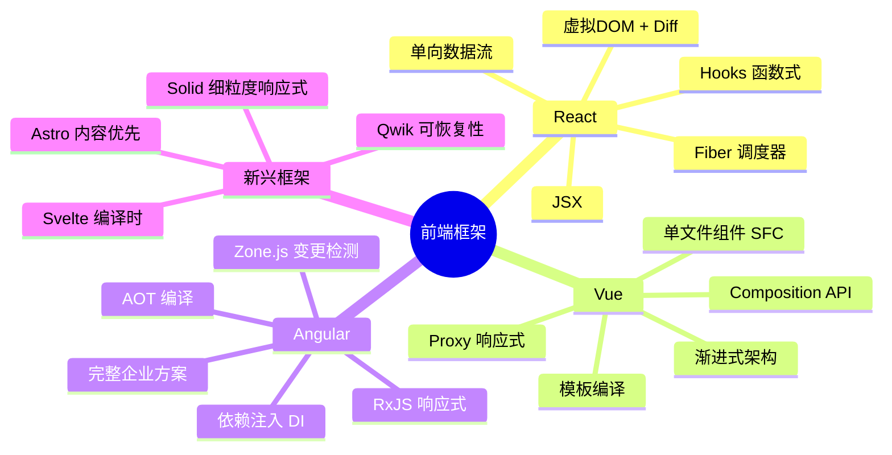
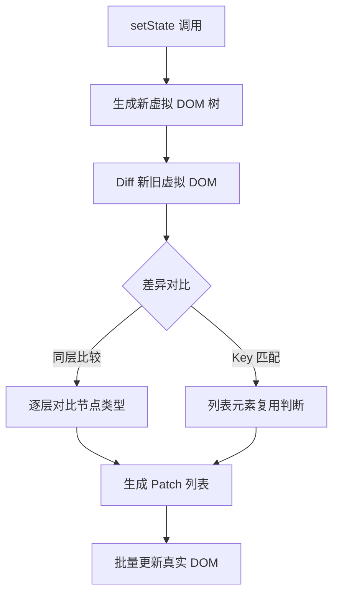
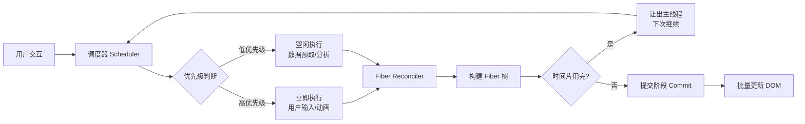
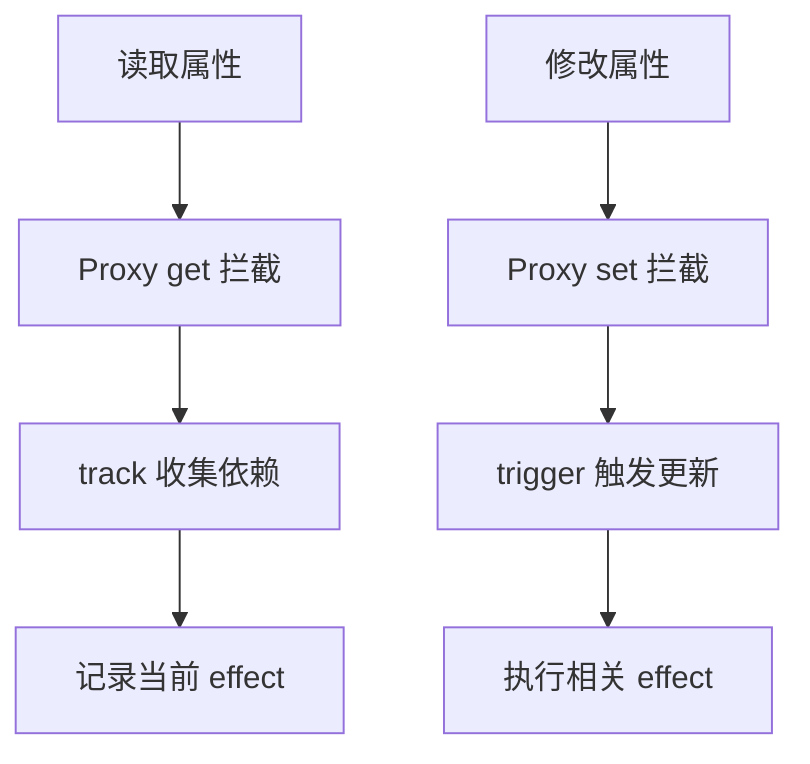
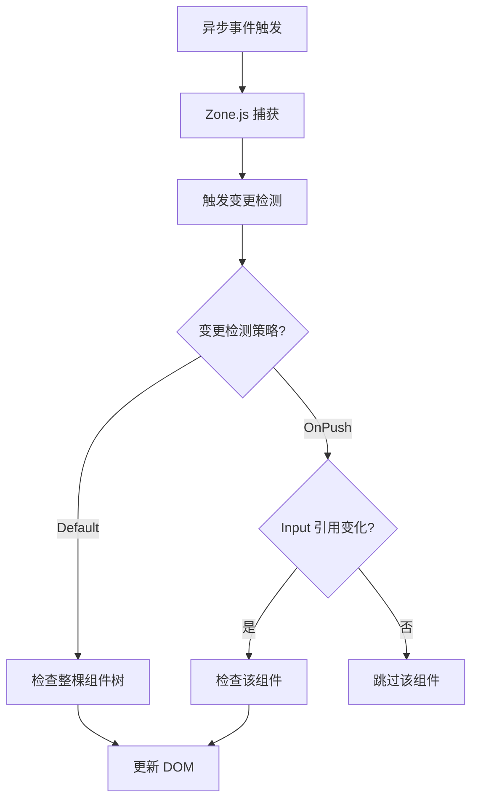
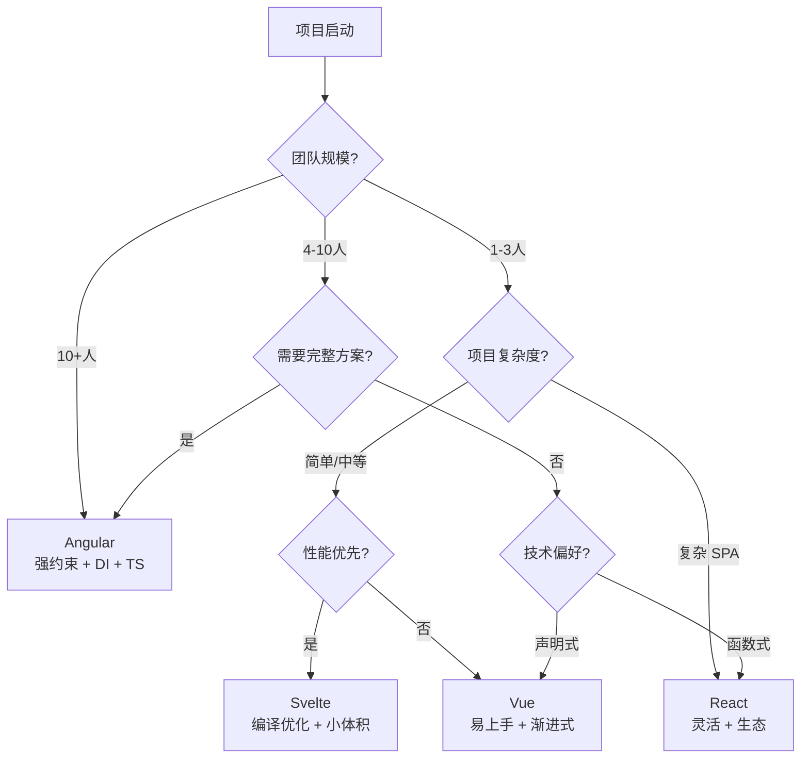
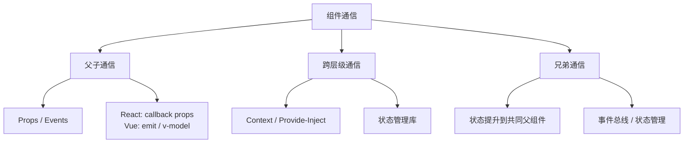

# 框架概览

> 前端框架是构建现代 Web 应用的基础设施。理解各框架的核心设计理念、响应式原理和渲染机制，才能在技术选型时做出合理判断，在深入使用时理解"为什么"。



---

## 一、框架对比总览

### 核心维度对比

| 维度 | React | Vue | Angular | Svelte | Solid |
|------|-------|-----|---------|--------|-------|
| **响应式模型** | 不可变 + setState | Proxy 代理 | Zone.js + 脏检查（新版提供 Signals） | 编译时响应式 | 细粒度 Signal |
| **渲染策略** | 虚拟 DOM Diff | 虚拟 DOM Diff | 虚拟 DOM Diff | 编译为命令式 DOM | 真实 DOM + Signal |
| **更新粒度** | 组件级 | 组件级 | 组件级 | 元素级 | 元素级 |
| **模板语法** | JSX | Template | Template | Template | JSX |
| **TypeScript** | 可选 | 可选 | 必需 | 可选 | 可选 |
| **包体积** | ~42KB | ~33KB | ~130KB | ~2KB | ~7KB |
| **学习曲线** | 中等 | 低 | 高 | 低 | 中等 |

### 设计哲学对比

```mermaid
flowchart TD
    subgraph React["React 哲学"]
        R1["UI = f(state)"] --> R2["纯函数思维"]
        R2 --> R3["不可变数据"]
        R3 --> R4["单向数据流"]
        R4 --> R5["显式更新 setState"]
    end

    subgraph Vue["Vue 哲学"]
        V1["声明式渲染"] --> V2["自动依赖追踪"]
        V2 --> V3["可变数据"]
        V3 --> V4["响应式代理"]
        V4 --> V5["隐式更新"]
    end

    subgraph Svelte["Svelte 哲学"]
        S1["编译时优化"] --> S2["零运行时"]
        S2 --> S3["无虚拟DOM"]
        S3 --> S4["直接操作DOM"]
        S4 --> S5["最小体积"]
    end

```



---

## 二、React 深度解析

### 核心原理：虚拟 DOM 与 Diff 算法

React 通过虚拟 DOM 实现高效的 UI 更新。核心思路是：在内存中维护一棵虚拟 DOM 树，状态变化时生成新树，通过 Diff 算法找出最小变更，再批量更新真实 DOM。



**Diff 三大策略**：

1. **Tree 策略**：只对同层节点比较，不跨层级（O(n) 复杂度保证）
2. **Component 策略**：同类型组件继续 Diff 子树，不同类型直接替换
3. **Element 策略**：通过 `key` 标识列表元素的可复用性

```jsx
// ❌ 缺少 key：元素按索引对比，可能产生不必要的 DOM 操作
<ul>
  {items.map((item, index) => <li key={index}>{item.name}</li>)}
</ul>

// ✅ 使用稳定唯一 key：Diff 可精确复用已有 DOM 节点
<ul>
  {items.map(item => <li key={item.id}>{item.name}</li>)}
</ul>
```

### Fiber 架构

React 16 引入 Fiber 架构，将同步的递归渲染改为可中断的增量渲染：



> 💡 **Fiber 的核心意义**：将渲染工作拆分为小单元（Fiber Node），每完成一个单元就检查是否需要让出主线程，保证高优先级任务（如用户输入）不被阻塞。

### Hooks 设计原理

```jsx
// Hooks 本质是闭包 + 链表
// 每次渲染，React 按调用顺序遍历 Hooks 链表

function useCustomHook() {
  const [value, setValue] = useState(0);       // Hook 1
  const ref = useRef(null);                     // Hook 2
  useEffect(() => { /* ... */ }, [value]);      // Hook 3

  // ⚠️ Hooks 规则：不能在条件语句中调用
  // 因为 Hooks 依赖调用顺序匹配链表位置
  // if (condition) { useState(0); } // ❌ 顺序不一致导致错位
}
```

**核心 Hooks 详解**：

| Hook | 用途 | 性能注意 |
|------|------|----------|
| `useState` | 状态管理 | 浅比较，对象更新需展开 |
| `useEffect` | 副作用 | 依赖数组控制执行频率 |
| `useCallback` | 函数缓存 | 配合子组件 `React.memo` 使用 |
| `useMemo` | 值缓存 | 计算开销大于缓存开销时使用 |
| `useRef` | 可变引用 | 不触发重渲染 |
| `useReducer` | 复杂状态逻辑 | 适合多字段关联更新 |

### React 18+ 并发特性

```jsx
// useTransition — 标记低优先级更新
const [isPending, startTransition] = useTransition();

function handleSearch(query) {
  // 高优先级：立即更新输入框
  setInputValue(query);

  // 低优先级：搜索结果可延迟
  startTransition(() => {
    setSearchResults(filterData(query));
  });
}

// useDeferredValue — 延迟值
const deferredQuery = useDeferredValue(searchQuery);
// deferredQuery 会在主线程空闲时更新
```

---

## 三、Vue 深度解析

### 响应式原理：Proxy 代理

Vue 3 使用 ES6 Proxy 实现响应式系统，替代了 Vue 2 的 `Object.defineProperty`：



```javascript
// Vue 3 响应式简化实现
function reactive(target) {
  return new Proxy(target, {
    get(obj, key, receiver) {
      track(obj, key);  // 收集依赖
      return Reflect.get(obj, key, receiver);
    },
    set(obj, key, value, receiver) {
      const result = Reflect.set(obj, key, value, receiver);
      trigger(obj, key);  // 触发更新
      return result;
    }
  });
}
```

**Vue 2 vs Vue 3 响应式对比**：

| 特性 | Vue 2 (`defineProperty`) | Vue 3 (`Proxy`) |
|------|-------------------------|-----------------|
| 动态添加属性 | 需要 `Vue.set()` | 自动响应 |
| 删除属性 | 需要 `Vue.delete()` | 自动响应 |
| 数组索引修改 | 不触发更新 | 自动响应 |
| Map/Set | 不支持 | 支持 |
| 性能 | 初始化时递归遍历 | 惰性代理（访问时才代理） |

### Composition API 设计动机

```vue
<!-- Options API：逻辑分散在 options 中 -->
<script>
export default {
  data() { return { count: 0, user: null } },
  computed: { doubled() { return this.count * 2 } },
  methods: { increment() { this.count++ } },
  mounted() { this.fetchUser() }
}
</script>

<!-- Composition API：逻辑按功能聚合 -->
<script setup>
import { ref, computed, onMounted } from 'vue';

// 计数器逻辑 — 完整聚合
const count = ref(0);
const doubled = computed(() => count.value * 2);
function increment() { count.value++; }

// 用户逻辑 — 完整聚合
const user = ref(null);
onMounted(async () => { user.value = await fetchUser() });
</script>
```

> 💡 **核心区别**：Options API 按选项类型组织（data/computed/methods），Composition API 按功能逻辑组织。后者更易提取复用（自定义 Hook）。

### 编译优化

Vue 3 模板编译器做了多项静态分析优化：

```vue
<!-- 静态提升：纯静态节点只创建一次 -->
<div>
  <span class="static">不会变化</span>  <!-- 提升到渲染函数外 -->
  <p>{{ dynamic }}</p>                   <!-- 动态节点 -->
</div>

<!-- PatchFlag：标记动态部分 -->
<!-- 编译结果包含数字标记：TEXT = 1, CLASS = 2, PROPS = 8 ... -->
<!-- Diff 时只检查标记的部分 -->

<!-- Block Tree：将模板按结构指令(v-if/v-for)拆分为 Block -->
<!-- 每个 Block 扁平化收集动态节点，Diff 时跳过静态部分 -->
```

---

## 四、Angular 深度解析

### 依赖注入（DI）系统

```typescript
// 定义服务
@Injectable({ providedIn: 'root' })  // 单例，全应用共享
export class UserService {
  constructor(private http: HttpClient) {}  // 自动注入
}

// 组件中使用
@Component({
  selector: 'app-user-list',
  template: `<div *ngFor="let user of users$ | async">{{ user.name }}</div>`
})
export class UserListComponent {
  users$ = this.userService.getUsers();

  constructor(private userService: UserService) {}  // 自动注入
}
```

### 变更检测策略



> 💡 **OnPush 策略**：类似 React 的 `shouldComponentUpdate`，只在 `@Input` 引用变化时触发检测。配合 `Observable` + `async` 管道使用效果最佳。

---

## 五、新兴框架

### Svelte — 编译时框架

Svelte 在构建阶段将组件编译为命令式 DOM 操作代码，无需运行时虚拟 DOM：

```svelte
<script>
  let count = 0;
  // Svelte 编译器追踪 count 的读写
  // 生成精确的 DOM 更新代码，而非 Diff 整棵树
</script>

<button on:click={() => count++}>
  Clicked {count} times
</button>
```

编译产物（简化）：

```javascript
// 编译后：精确的 DOM 操作，无虚拟 DOM 开销
function instance($$self, $$props) {
  let count = 0;
  $$self.$$.update = () => {
    // 只在 count 变化时更新这个文本节点
    set_text(t1, count);
  };
}
```

### Solid — 细粒度响应式

```jsx
// Solid：JSX 语法 + Signal 响应式，无虚拟 DOM
import { createSignal, createEffect } from 'solid-js';

function Counter() {
  const [count, setCount] = createSignal(0);

  createEffect(() => {
    console.log('count changed:', count());  // 自动追踪
  });

  return <button onClick={() => setCount(count() + 1)}>{count()}</button>;
}
```

> 💡 **Solid vs React**：Solid 的 JSX 外观与 React 相似，但内部完全不同。Signal 是细粒度的（一个值绑定一个 DOM 节点），而 React 是组件粒度的（整个组件函数重新执行）。

### Qwik — 可恢复性框架

```typescript
// Qwik：极端懒加载 — 事件处理器也不在初始 JS 中
import { component$, useSignal } from '@builder.io/qwik';

export default component$(() => {
  const count = useSignal(0);
  // onClick 处理器只在用户点击时才下载执行
  return <button onClick$={() => count.value++}>{count.value}</button>;
});
```

---

## 六、框架选型决策



### 选型清单

| 考虑因素 | 选 React | 选 Vue | 选 Angular | 选 Svelte |
|----------|---------|--------|------------|-----------|
| 团队经验 | 函数式/JS 背景 | 模板/渐进式偏好 | Java/TS/企业背景 | 追求极致性能 |
| 项目规模 | 中大型 | 中小型 | 大型企业级 | 中小型/内容站 |
| 生态需求 | 丰富（React Native） | 够用（Nuxt） | 内置完整 | 成长中 |
| 学习投入 | 中等 | 低 | 高 | 低 |
| 长期维护 | Meta 支持 | 社区 + 尤雨溪 | Google 支持 | 社区驱动 |

---

## 七、跨框架通用模式

无论选择哪个框架，以下模式是通用的：

### 组件通信



### 状态管理对照

| 模式 | React | Vue | Angular |
|------|-------|-----|---------|
| 内置 | `useState` / `useReducer` | `ref` / `reactive` | 组件属性 |
| 跨组件 | `Context` | `provide/inject` | DI |
| 全局 | Redux / Zustand / Jotai | Pinia / Vuex | NgRx |
| 服务端 | React Query / SWR | Vue Query / SWRV | NgRx Data |

---

## 八、学习路径建议

### React 路径

1. **JavaScript 基础**：闭包、数组方法、解构、Promise
2. **React 核心**：组件、Props、State、事件处理
3. **Hooks 深入**：useEffect 生命周期、自定义 Hook、useReducer
4. **路由**：React Router v6+、嵌套路由、懒加载
5. **状态管理**：Zustand（轻量）→ Redux Toolkit（重型）
6. **服务端**：Next.js（App Router / RSC）

### Vue 路径

1. **JavaScript 基础**：同上
2. **Vue 核心**：模板语法、指令、组件、生命周期
3. **Composition API**：ref/reactive、computed、watch
4. **路由**：Vue Router 4、导航守卫
5. **状态管理**：Pinia（推荐）→ Vuex（遗留）
6. **服务端**：Nuxt 3

---

> 💡 **核心建议**：框架只是工具，JavaScript 基础才是根基。理解响应式原理、虚拟 DOM、组件化思想比记住 API 更重要。精通一个框架后，迁移到其他框架只需学习差异部分。
