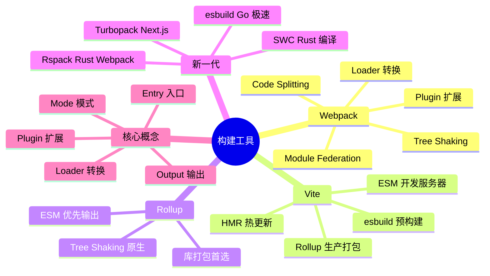
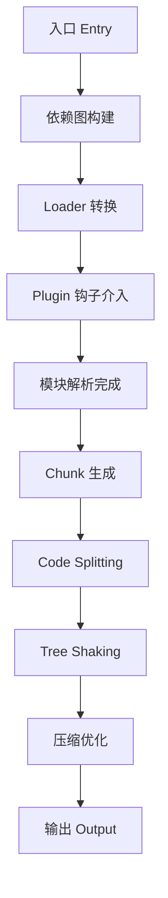
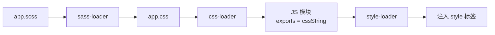
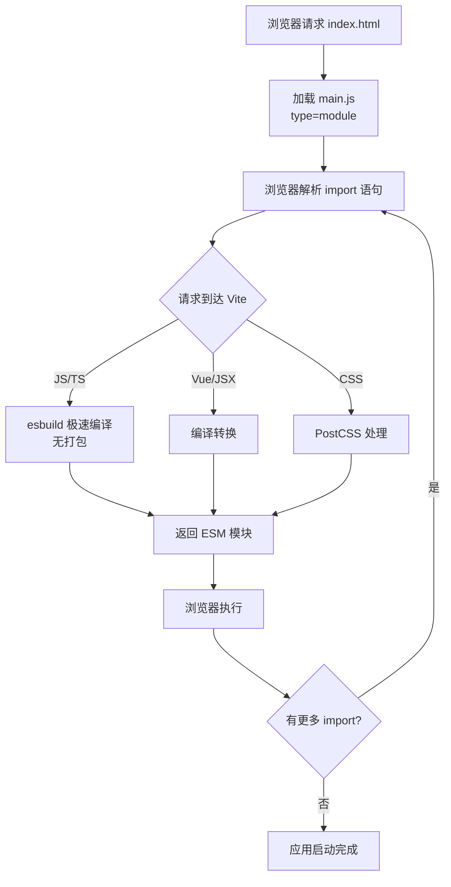
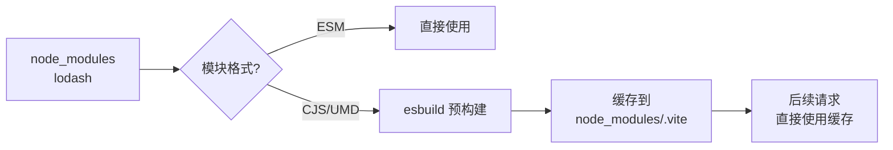
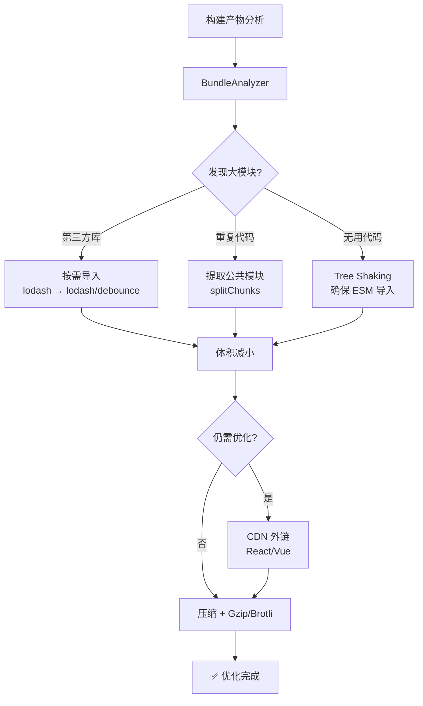
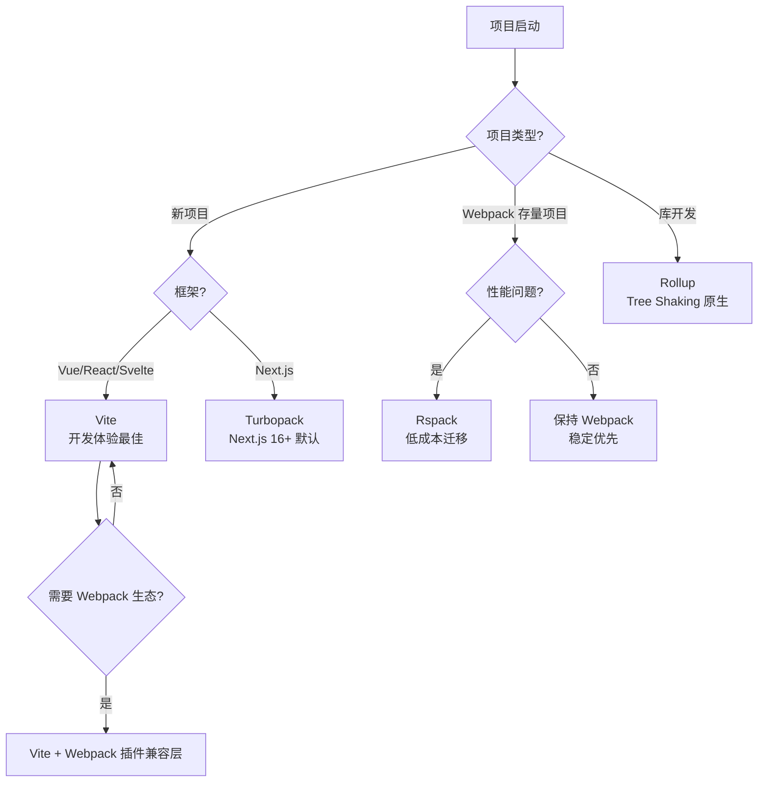

# 构建工具

> 构建工具是现代前端工程化的核心基础设施，负责代码编译、打包、压缩、优化等任务。理解构建工具的工作原理和选型策略，是前端工程师的必备技能。



---

## 一、构建工具演进与对比

### 发展历程


### 核心维度对比

| 维度 | Webpack | Vite | Rollup | esbuild | Rspack |
|------|---------|------|--------|---------|--------|
| **开发启动** | 慢（全量编译） | 极快（按需编译） | — | 极快 | 极快 |
| **热更新** | 较快 | 极快 | — | — | 极快 |
| **生产构建** | 较慢 | 快（Rollup） | 快 | 极快 | 极快 |
| **Tree Shaking** | ✅ | ✅ | ✅ 原生 | ✅ | ✅ |
| **Code Splitting** | ✅ 强大 | ✅ | ✅ 基础 | ✅ 基础 | ✅ |
| **生态成熟度** | ⭐⭐⭐⭐⭐ | ⭐⭐⭐⭐ | ⭐⭐⭐⭐ | ⭐⭐⭐ | ⭐⭐⭐ |
| **配置复杂度** | 高 | 低 | 中 | 低 | 中（兼容Webpack） |
| **适用场景** | 复杂企业项目 | 新项目首选 | 库开发 | 极致性能 | Webpack迁移 |

---

## 二、Webpack 深度解析

### 核心工作流程



**详细流程说明**：

1. **初始化**：从 `entry` 开始，递归解析依赖
2. **编译模块**：根据 `module.rules` 匹配 Loader 转换文件
3. **完成编译**：得到每个模块的转换后内容和依赖关系
4. **输出资源**：根据依赖关系组装 Chunk，触发 Plugin 钩子
5. **写入文件**：根据 `output` 配置写入磁盘

### Loader 机制

Loader 是 Webpack 的核心转换机制，采用链式调用：

```javascript
module.exports = {
  module: {
    rules: [
      {
        test: /\.scss$/,
        // 链式调用：从右往左，从下往上执行
        use: [
          'style-loader',   // 3. 将 CSS 注入 DOM
          'css-loader',     // 2. 解析 @import 和 url()
          'sass-loader'     // 1. 将 SCSS 编译为 CSS
        ]
      }
    ]
  }
};
```



**常用 Loader 速查**：

| Loader | 用途 | 配置示例 |
|--------|------|----------|
| `babel-loader` | JS/TS 转译 | `use: { loader: 'babel-loader', options: { presets: ['@babel/preset-env'] } }` |
| `ts-loader` | TypeScript | `use: 'ts-loader'` |
| `css-loader` | CSS 导入 | `use: 'css-loader'` |
| `style-loader` | CSS 注入 DOM | `use: 'style-loader'` |
| `sass-loader` | SCSS 编译 | `use: ['style-loader', 'css-loader', 'sass-loader']` |
| `postcss-loader` | CSS 后处理 | `use: ['postcss-loader']` |
| `file-loader` | 文件输出 | `type: 'asset/resource'`（Webpack 5 内置） |
| `url-loader` | Base64 内联 | `type: 'asset/inline'`（Webpack 5 内置） |

### Plugin 机制

Plugin 通过 Webpack 的 Tapable 事件流介入构建过程：

```javascript
class MyPlugin {
  apply(compiler) {
    // 在 emit 阶段（写入文件前）介入
    compiler.hooks.emit.tapAsync('MyPlugin', (compilation, callback) => {
      // 遍历所有输出文件
      for (const filename in compilation.assets) {
        if (filename.endsWith('.js')) {
          const source = compilation.assets[filename].source();
          // 添加版权注释
          compilation.assets[filename] = {
            source: () => `/* Copyright 2024 */\n${source}`,
            size: () => source.length + 20
          };
        }
      }
      callback();
    });
  }
}
```

**常用 Plugin 速查**：

| Plugin | 用途 | 关键配置 |
|--------|------|----------|
| `HtmlWebpackPlugin` | 生成 HTML | `{ template: './index.html', minify: true }` |
| `MiniCssExtractPlugin` | 提取 CSS | `{ filename: '[name].[contenthash:8].css' }` |
| `DefinePlugin` | 定义常量 | `{ 'process.env.NODE_ENV': JSON.stringify('production') }` |
| `CopyWebpackPlugin` | 复制静态资源 | `{ patterns: [{ from: 'public', to: 'dist' }] }` |
| `BundleAnalyzerPlugin` | 体积分析 | `{ analyzerMode: 'static' }` |
| `CompressionPlugin` | Gzip 压缩 | `{ algorithm: 'gzip' }` |

### Code Splitting 策略

```javascript
module.exports = {
  optimization: {
    splitChunks: {
      chunks: 'all',
      cacheGroups: {
        // 第三方库单独打包
        vendors: {
          test: /[\\/]node_modules[\\/]/,
          name: 'vendors',
          chunks: 'all',
          priority: 10
        },
        // 公共模块提取
        commons: {
          minChunks: 2,
          name: 'commons',
          chunks: 'all',
          priority: 5
        }
      }
    }
  }
};
```

```mermaid
flowchart TD
    A[入口 main.js] --> B[业务代码 main]
    A --> C[第三方库 vendors]
    A --> D[公共模块 commons]

    B --> E[main.[hash].js]
    C --> F[vendors.[hash].js]
    D --> G[commons.[hash].js]

    E --> H[浏览器缓存]
    F --> I[长期缓存<br/>库变化少]
    G --> J[按需加载]

```

### Module Federation（模块联邦）

Webpack 5 的 Module Federation 允许多个独立构建的应用共享模块：

```javascript
// app1/webpack.config.js（提供模块）
module.exports = {
  plugins: [
    new ModuleFederationPlugin({
      name: 'app1',
      filename: 'remoteEntry.js',
      exposes: {
        './Button': './src/components/Button'
      },
      shared: ['react', 'react-dom']
    })
  ]
};

// app2/webpack.config.js（消费模块）
module.exports = {
  plugins: [
    new ModuleFederationPlugin({
      name: 'app2',
      remotes: {
        app1: 'app1@http://localhost:3001/remoteEntry.js'
      },
      shared: ['react', 'react-dom']
    })
  ]
};

// app2 中使用
const RemoteButton = React.lazy(() => import('app1/Button'));
```

> 💡 **Module Federation 应用场景**：微前端架构、多团队协作、共享组件库、动态加载远程模块。

---

## 三、Vite 深度解析

### 开发模式：ESM + 按需编译



**Vite 为什么快**：

1. **无打包开发模式**：直接利用浏览器原生 ESM，无需打包等待
2. **esbuild 预构建**：用 Go 编写的 esbuild 处理依赖预构建，比 JS 工具快 10-100 倍
3. **按需编译**：只编译当前页面用到的模块
4. **高效 HMR**：模块级别的热更新，边界清晰

### 生产模式：Rollup 打包

```javascript
// vite.config.js
import { defineConfig } from 'vite';
import vue from '@vitejs/plugin-vue';

export default defineConfig({
  plugins: [vue()],
  server: {
    port: 3000,
    proxy: {
      '/api': {
        target: 'http://localhost:8080',
        changeOrigin: true
      }
    }
  },
  build: {
    outDir: 'dist',
    sourcemap: true,
    rollupOptions: {
      output: {
        manualChunks: {
          vendor: ['vue', 'vue-router', 'pinia'],
          ui: ['element-plus']
        }
      }
    }
  }
});
```

### 依赖预构建

Vite 在启动时将 CommonJS/UMD 依赖转换为 ESM：



---

## 四、Rollup — 库打包首选

### 核心优势

Rollup 天然支持 Tree Shaking，输出更干净的代码：

```javascript
// rollup.config.js
import resolve from '@rollup/plugin-node-resolve';
import commonjs from '@rollup/plugin-commonjs';
import terser from '@rollup/plugin-terser';

export default {
  input: 'src/index.js',
  output: [
    {
      file: 'dist/my-lib.esm.js',
      format: 'esm',
      sourcemap: true
    },
    {
      file: 'dist/my-lib.cjs.js',
      format: 'cjs'
    }
  ],
  plugins: [
    resolve(),
    commonjs(),
    terser()
  ],
  external: ['lodash']  // 外部依赖，不打包进去
};
```

### 输出格式对比

| 格式 | 适用场景 | 示例 |
|------|----------|------|
| `esm` | 现代打包器、Tree Shaking | `export default function() {}` |
| `cjs` | Node.js 环境 | `module.exports = function() {}` |
| `umd` | 浏览器直接引用、CDN | `(function(root, factory) { ... })(this, factory)` |
| `iife` | 浏览器立即执行 | `(function() { ... })()` |
| `system` | SystemJS 模块加载器 | `System.register([], function() {})` |

---

## 五、新一代构建工具

### esbuild — Go 极速编译

```javascript
import * as esbuild from 'esbuild';

await esbuild.build({
  entryPoints: ['src/index.js'],
  bundle: true,
  minify: true,
  sourcemap: true,
  target: ['es2020'],
  outfile: 'dist/bundle.js',
  // 定义环境变量
  define: {
    'process.env.NODE_ENV': '"production"'
  },
  // 外部依赖
  external: ['fs', 'path']
});
```

**为什么 esbuild 快**：

1. **Go 语言**：多线程并行处理，JS 是单线程
2. **高效内存使用**：避免 JS 数据结构开销
3. **增量编译**：内置 watch 模式高效增量
4. **无 AST 开销**：直接生成代码，不反复解析

### SWC — Rust 编译器

```javascript
// .swcrc
{
  "jsc": {
    "parser": {
      "syntax": "typescript",
      "tsx": true
    },
    "target": "es2015",
    "transform": {
      "react": {
        "runtime": "automatic"
      }
    }
  },
  "minify": {
    "compress": true,
    "mangle": true
  }
}
```

**SWC vs Babel**：

| 特性 | Babel | SWC |
|------|-------|-----|
| 语言 | JavaScript | Rust |
| 编译速度 | 基准 | ~20x 更快 |
| 插件生态 | 丰富 | 原生插件 + Wasm |
| 成熟度 | ⭐⭐⭐⭐⭐ | ⭐⭐⭐⭐ |
| 适用场景 | 兼容性优先、复杂转换 | 性能优先、标准转换 |

### Rspack — Rust 版 Webpack

```javascript
// rspack.config.js
module.exports = {
  entry: { main: './src/index.js' },
  module: {
    rules: [
      {
        test: /\.css$/,
        use: ['style-loader', 'css-loader'],
        type: 'javascript/auto'
      }
    ]
  },
  plugins: [
    new rspack.HtmlRspackPlugin({ template: './index.html' })
  ]
};
```

**Rspack vs Webpack**：

| 特性 | Webpack | Rspack |
|------|---------|--------|
| 语言 | JavaScript | Rust |
| 构建速度 | 基准 | ~5-10x 更快 |
| Webpack 兼容 | — | 高度兼容 |
| loader/plugin | 丰富 | 逐步兼容 |
| 迁移成本 | — | 低（配置兼容） |

### Turbopack — Next.js 内置

```javascript
// next.config.js（Next.js 15.3+ 支持 turbopack 配置键）
module.exports = {
  turbopack: {
    rules: {
      '*.svg': {
        loaders: ['@svgr/webpack'],
        as: '*.js'
      }
    }
  }
};

// Next.js 15.x：next dev --turbopack 显式启用
// Next.js 16+：开发与构建默认使用 Turbopack
```

**Turbopack 特点**：

- 增量编译极快（内存缓存 + 持久化）
- 与 Next.js 深度集成
- Next.js 16（2025-10）起已成为开发与生产构建的默认打包器，Webpack 在 Next.js 中转入维护模式

---

## 六、构建优化实战

### 体积优化



**关键优化手段**：

```javascript
// 1. 按需导入
import debounce from 'lodash/debounce';  // ✅ 只导入单个函数
import _ from 'lodash';                   // ❌ 导入整个库

// 2. Tree Shaking 友好的导入
import { Button, Input } from 'element-plus';  // ✅ 具名导入
import ElementPlus from 'element-plus';         // ❌ 整体导入

// 3. 动态导入（Code Splitting）
const LazyComponent = React.lazy(() => import('./HeavyComponent'));

// 4. 外部化大型库（CDN）
module.exports = {
  externals: {
    react: 'React',
    'react-dom': 'ReactDOM'
  }
};
```

### 构建速度优化

| 优化手段 | Webpack | Vite |
|----------|---------|------|
| 缩小搜索范围 | `resolve.extensions`、`exclude: /node_modules/` | 自动优化 |
| 多线程编译 | `thread-loader` | esbuild 内置 |
| 缓存 | `cache: { type: 'filesystem' }` | 自动缓存 |
| DLL 预编译 | `DllPlugin`（已过时） | 不需要 |
| source-map | 开发用 `eval-cheap-module-source-map` | 开发默认不生成 |

---

## 七、选型决策



### 选型速查表

| 场景 | 推荐方案 | 理由 |
|------|----------|------|
| 新项目（Vue/React/Svelte） | **Vite** | 开发体验最佳，生态成熟 |
| 企业级复杂项目 | **Webpack** | 生态最全，问题解决方案多 |
| Webpack 存量项目优化 | **Rspack** | 配置兼容，性能提升明显 |
| 库/组件库开发 | **Rollup** | Tree Shaking 原生支持，输出干净 |
| Next.js 项目 | **Turbopack** | Next.js 16 起为默认打包器（开发与生产） |
| 极致编译性能 | **esbuild / SWC** | 替代 Babel，速度提升 10-20x |
| 零配置快速原型 | **Parcel** | 真正零配置 |

---

## 八、最佳实践清单

### 开发环境

- [ ] 使用 Vite 获得最佳开发体验
- [ ] 配置代理解决跨域问题
- [ ] 使用 `.env.development` / `.env.production` 区分环境
- [ ] 配置 ESLint + Prettier 保证代码质量
- [ ] 开启 HMR 热更新

### 生产环境

- [ ] Code Splitting：路由级懒加载 + 第三方库分离
- [ ] Tree Shaking：确保使用 ESM 导入
- [ ] 压缩：JS（Terser/esbuild）、CSS（cssnano）
- [ ] 文件名哈希：`[name].[contenthash:8].js` 长期缓存
- [ ] Gzip / Brotli 压缩
- [ ] Source Map：生产环境使用 `hidden-source-map` 或不生成
- [ ] Bundle 分析：定期检查产物体积

### 性能监控

- [ ] 构建时间统计：`speed-measure-webpack-plugin`
- [ ] 产物分析：`webpack-bundle-analyzer`
- [ ] CI 构建缓存：`cache: { type: 'filesystem' }`

---

> 💡 **核心建议**：新项目首选 Vite，Webpack 存量项目可迁移 Rspack，库开发用 Rollup。构建工具只是手段，理解模块化、Tree Shaking、Code Splitting 的原理才是关键。
