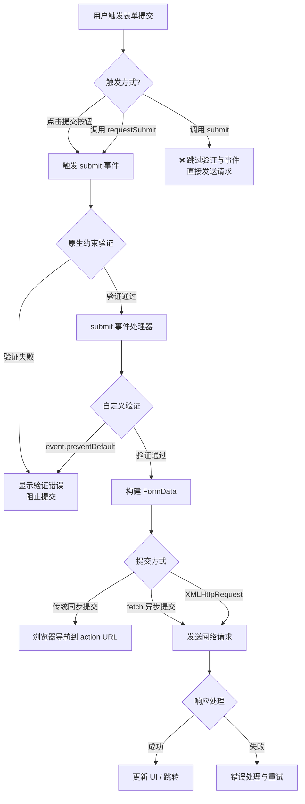
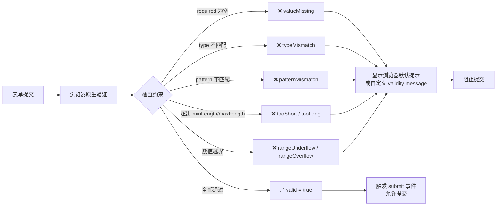

# 表单脚本

`JavaScript` 较早的用途是承担一部分服务器端表单处理的责任。虽然 `Web` 和 `JavaScript` 都已经发展了很多年，但 `Web` 表单的变化不是很大。由于不能直接使用表单解决问题，因此开发者不得不使用 `JavaScript` 既做表单验证，又用于增强标准表单控件的默认行为

- 表单在 DOM 中对应 `HTMLFormElement`，核心职责是收集字段并通过 `submit` 或脚本发送请求
- 大多数表单交互可通过事件监听器（`submit`、`reset`、`input`、`change` 等）拦截
- 现代浏览器提供 `Constraint Validation API`、`FormData`、`requestSubmit()` 与 `fetch()` 搭配使用的能力，降低手动拼接与校验成本
- 要防止重复提交、处理空白字段、区分同步与异步验证是表单脚本的常见重点
- 文本框是最常见的输入控件，需关注取值语义、选区操作、输入过滤与剪贴板处理等细节
- 最佳实践是保持表单语义化、增强而非替代原生行为，并关注无障碍与可访问性

## 1. 表单基础

表单用 `<form>` 元素表示，在 `JavaScript` 中表单对应的则是 `HTMLFormElement` 类型。`HTMLFormElement` 继承 `HTMLElement`，不仅具有 `HTML` 的默认属性。还有下列独有的属性和方法：

- `acceptCharset` 服务器能够处理的字符集，等价于 HTML 中的 `accept-charset` 特性
- `action` 接受请求的 URL, 等价于 HTML 中的 action 特性
- `elements` 表单中所有控件的集合（HTMLCollection）
- `enctype` 请求的编码类型；等价于 HTML 中的 enctype 特性
- `length` 表单中控件的数量
- `method` 要发送的 HTTP 请求类型，通常是 `get` 或 `post`；等价于 HTML 的 method 特性
- `name` 表单的名称；等价于 `HTML` 的 `name` 特性
- `reset()` 将所有表单域重置为默认值
- `submit()` 提交表单
- `target` 用于发送请求和接收响应的窗口名称；等价于 HTML 的 target 特性

取得 `<form>` 元素引用的方式有好几种。其中最常见的就是将它看成与其他元素一样，并为其添加 `id` 特性，然后使用 `getElementById()` 方法找到它

```javascript
let form = document.getElementById("form1")
```

或者通过 `document.forms` 可以取得页面中所有的表单。在这个集合中，可以通过数值索引或 `name` 值来取得特定的表单

```javascript
let firstForm = document.forms[0] //取得页面中的第一个表单

let myForm = document.forms["form2"] //取得页面中名称为"form2"的表单
```


### 提交表单

用户单击提交按钮或图像按钮时，就会提交表单。使用 `<input>` 或 `<button>` 都可以定义提交按钮，只要将其 `type` 特性的值设置为 `submit` 即可，而图像按钮则是通过将 `<input>` 的 `type` 特性值设置为 `image` 来定义的

```html
<!-- 通用提交按钮 -->
<input type="submit" value="Submit Form" />

<!-- 自定义提交按钮 -->
<button type="submit">Submit Form</button>

<!-- 图像按钮 -->
<input type="image" src="graphic.gif" />
```

监听表单的 `submit` 事件可以验证表单数据，阻止这个事件的默认行为就可以取消表单提交

```javascript
let form = document.getElementById("myForm")

form.addEventListener("submit", (event) => {
  // 阻止表单提交
  event.preventDefault()
})
```

调用 `preventDefault` 方法可以阻止表单提交。通常，在表单数据无效以及不应该发送到服务器时可以这样处理

可以通过编程方式在 `JavaScript` 中调用 `submit` 方法来提交表单。在任何时候调用这个方法来提交表单，而且表单中不存在提交按钮也不影响表单提交

```javascript
var form = document.getElementById("myForm")

//提交表单
form.submit()
```

注意：调用 `submit` 方法的形式提交表单时，不会触发 `submit` 事件，因此要记得在调用此方法之前先验证表单数据


### 重置表单

使用 `type` 特性值为 `reset` 的 `<input>` 或 `<button>` 都可以创建重置按钮。当用户单击重置按钮时，表单会被重置

```html
<!-- 通用重置按钮 -->
<input type="reset" value="Reset Form" />

<!-- 自定义重置按钮 -->
<button type="reset">Reset Form</button>
```

在重置表单时，所有表单字段都会恢复到页面刚加载完毕时的初始值。如果某个字段的初始值为空，就会恢复为空；而带有默认值的字段，也会恢复为默认值

用户单击重置按钮重置表单时，会触发 `reset` 事件。利用这个机会，可以在必要时取消重置操作：

```javascript
let form = document.getElementById("myForm")

form.addEventListener("reset", (event) => {
  event.preventDefault()
})
```

与提交表单一样，也可以通过 `JavaScript` 来重置表单，调用 `reset()` 方法会像单击重置按钮一样触发 `reset` 事件

```javascript
var form = document.getElementById("myForm")

//重置表单
form.reset()
```

## 2. 现代表单工作流



> 📊 现代表单工作流的核心差异：`submit()` 绕过一切验证直接提交（危险），`requestSubmit()` 则完整走验证→事件→提交流程（推荐）。

### `requestSubmit()` 与自定义触发

- `form.submit()` 会绕过 `submit` 事件与原生验证，不利于统一处理。
- `form.requestSubmit()` 会模拟用户操作，触发原生验证与 `submit` 事件，并允许指定触发的提交按钮。

```javascript
const form = document.querySelector("#profileForm")
const draftButton = document.querySelector("#saveDraft")

draftButton.addEventListener("click", () => {
  // 指定某个按钮触发，便于在 submit 监听器里区分逻辑
  form.requestSubmit(draftButton)
})
```

在 `submit` 事件中可以通过 `event.submitter` 获取触发提交的按钮，从而实现“保存草稿”“正式提交”等分支。

### `FormData` 与异步提交

`FormData` 提供与表单结构一致的键值对接口，可搭配 `fetch()` 发送异步请求，同时保留文件上传等能力。

```javascript
const form = document.querySelector("#profileForm")

form.addEventListener("submit", async (event) => {
  event.preventDefault()

  const submitter = event.submitter
  const formData = new FormData(form)

  if (submitter?.name) {
    formData.append("action", submitter.name)
  }

  try {
    const response = await fetch(form.action, {
      method: form.method || "POST",
      body: formData
    })

    if (!response.ok) throw new Error("提交失败")
    const result = await response.json()
    console.log("提交成功", result)
  } catch (error) {
    console.error(error)
  }
})
```

> 注意：当 `body` 为 `FormData` 时不要手动设置 `Content-Type`，浏览器会自动生成包含边界的 `multipart/form-data` 头。

### `formdata` 事件

在调用 `requestSubmit()` 或用户真实提交表单时，会在 `submit` 之后触发 `formdata` 事件，便于集中修改数据。

```javascript
form.addEventListener("formdata", (event) => {
  const data = event.formData
  data.append("csrf_token", window.csrfToken)
})
```

> 💡 HTML5 约束验证 API（`checkValidity`、`reportValidity`、`ValidityState` 等）的完整讲解见下方 [文本框编程 → HTML5 约束验证 API](#html5-约束验证-api)。

### 渐进增强与可访问性

- 表单结构应首先可在无脚本环境下工作，脚本用于增强体验。
- 始终关联 `<label>` 与输入控件，或利用 `aria-describedby` 提示错误信息。
- 通过 `aria-live` 容器向屏幕阅读器广播验证结果与提交状态。
- 使用 `focus()` 或 `Element.scrollIntoView()` 引导用户定位到出错字段。

## 3. 表单字段

### elements 属性

可以使用原生 `DOM` 方法访问表单元素。此外，每个表单都有 `elements` 属性，该属性是表单中所有表单元素（字段）的集合

`elements` 集合是有序列表，其中包含着表单中的所有字段，例如`<input>`、`<textarea>`、`<button>` 和 `<fieldset>`。每个表单字段在 `elements` 集合中的顺序，与它们出现在标记中的顺序相同，可以按照位置和 `name` 特性来访问

```javascript
let form = document.getElementById("form1")

// 取得表单中的第一个字段
let field1 = form.elements[0]

// 取得表单中名为"textbox1"的字段
let field2 = form.elements["textbox1"]

// 取得字段的数量
let fieldCount = form.elements.length
```

如果有多个表单控件都在使用一个 `name`（如单选按钮），那么就会返回以该 `name` 命名的 `NodeList` 。在访问 `elements["color"]` 时，就会返回一个 `NodeList`，其中包含这 3 个元素；但如果访问 `elements[0]`，则只会返回第一个元素

```html
<form method="post" id="myForm">
  <ul>
    <li><input type="radio" name="color" value="red" />Red</li>
    <li><input type="radio" name="color" value="green" />Green</li>
    <li><input type="radio" name="color" value="blue" />Blue</li>
  </ul>
</form>

<script>
  let form = document.getElementById("myForm")

  let colorFields = form.elements["color"]
  console.log(colorFields.length) // 3

  let firstColorField = colorFields[0]
  let firstFormField = form.elements[0]
  console.log(firstColorField === firstFormField) // true
</script>
```

### 共有的表单字段属性

所有表单字段都拥有相同的一组属性。由于 `<input>` 类型可以表示多种表单字段，因此有些属性只适用于某些字段，但还有一些属性是所有字段所共有的。表单字段共有的属性如下：

- `disabled` 布尔值，表示当前字段是否被禁用
- `form` 指向当前字段所属表单的指针；只读
- `name` 当前字段的名称
- `readOnly` 布尔值，表示当前字段是否只读
- `tabIndex` 表示当前字段的切换（tab）序号
- `type` 当前字段的类型，如 "checkbox"、"radio" 等等
- `value` 当前字段将被提交给服务器的值。对文件字段来说，这个属性是只读的，包含着文件在计算机中的路径。

除了 `form` 属性之外，可以通过 `JavaScript` 动态修改其他任何属性

```javascript
let form = document.getElementById("myForm")
let field = form.elements[0]

// 修改字段的值
field.value = "Another value"

// 检查字段所属的表单
console.log(field.form === form) // true

// 给字段设置焦点
field.focus()

// 禁用字段
field.disabled = true

// 改变字段的类型（不推荐，但对<input>来说是可能的）
field.type = "checkbox"
```

能够动态修改表单字段属性，意味着可以在任何时候，以任何方式来动态操作表单

例如：重复单击表单的提交按钮。最常见的解决方案，在第一次单击后就禁用提交按钮

```javascript
// 避免多次提交表单的代码
let form = document.getElementById("myForm")

form.addEventListener("submit", (event) => {
  let target = event.target
  // 取得提交按钮
  let btn = target.elements["submit-btn"]
  // 禁用提交按钮
  btn.disabled = true
})
```

所有表单字段都有 `type` 属性（`<fieldset>` 的 `type` 值为 `"fieldset"`）。对于 `<input>` 元素，这个值等于 `HTML` 特 性 `type` 的值。对于其他元素，这个 `type` 属性的值如下表所列

| **说明**         | **HTML 示例**                        | **type 属性的值**   |
| ---------------- | ------------------------------------ | ------------------- |
| 单选列表         | `<select>...</select>`               | `"select-one"`      |
| 多选列表         | `<select multiple>...</select>`      | `"select-multiple"` |
| 自定义按钮       | `<button>...</button>`               | `"submit"`          |
| 自定义非提交按钮 | `<button type="button">...</button>` | `"button"`          |
| 自定义重置按钮   | `<button type="reset">...</button>`  | `"reset"`           |
| 自定义提交按钮   | `<button type="submit">...</button>` | `"submit"`          |

此外 `<input>` 和 `<button>` 元素的 `type` 属性是可以动态修改的，而 `<select>` 元素的 `type` 属性则是只读的

### 共有的表单字段方法

每个表单字段都有两个方法：`focus` 和 `blur` ，使用 `focus` 方法，可以将用户的注意力吸引到页面中的某个部位

```javascript
window.addEventListener("load", (event) => {
  document.forms[0].elements[0].focus()
})
```

`HTML5` 为表单字段新增 `autofocus` 属性。在支持这个属性的浏览器中，只要设置这个属性，不用 `JavaScript` 就能自动把焦点移动到相应字段

```html
<input type="text" autofocus />
```

为了保证前面的代码在设置 `autofocus` 的浏览器中正常运行，必须先检测是否设置了该属性，如果设置，就不用再调用 `focus`

```javascript
window.addEventListener("load", (event) => {
  let element = document.forms[0].elements[0]
  if (element.autofocus !== true) {
    element.focus()
    console.log("JS focus")
  }
})
```

`blur` 方法作用是从元素中移走焦点。在调用 `blur` 方法时，并不会把焦点转移到某个特定的元素上；仅仅是将焦点从调用这个方法的元素上面移走而已

```javascript
document.forms[0].elements[0].blur()
```

### 共有的表单字段事件

除了支持鼠标、键盘、更改和 `HTML` 事件之外，所有表单字段都支持下列 3 个事件

- `blur`：当前字段失去焦点时触发
- `change`：对于 `<input>` 和 `<textarea>` 元素，在它们失去焦点且 value 值改变时触发；对于 `<select>` 元素，在其选项改变时触发
- `focus`：当前字段获得焦点时触发

当用户改变当前字段的焦点，或者调用 `blur` 或 `focus` 方法时，都可以触发 `blur` 和 `focus` 事件。这两个事件在所有表单字段中都是相同的。利用 `change` 事件在用户输入非数值时把背景改为红色

```javascript
let textbox = document.forms[0].elements[0]

textbox.addEventListener("focus", (event) => {
  let target = event.target
  if (target.style.backgroundColor != "red") {
    target.style.backgroundColor = "yellow"
  }
})

textbox.addEventListener("blur", (event) => {
  let target = event.target
  target.style.backgroundColor = /[^\d]/.test(target.value) ? "red" : ""
})

textbox.addEventListener("change", (event) => {
  let target = event.target
  target.style.backgroundColor = /[^\d]/.test(target.value) ? "red" : ""
})
```

## 文本框编程

文本输入控件是 Web 表单中使用频率最高的元素之一。作为 `HTMLFormElement` 中的“常客”，`<input type="text">` 与 `<textarea>` 在用户输入、验证与交互体验上都有大量可挖掘的细节。本节聚焦文本框的基础属性、文本选择 API、输入过滤、剪贴板操作到 HTML5 约束验证，并结合现代浏览器实践补充注意事项。

### 基础概念

#### 单行与多行文本框

在 `HTML` 中有两种常见方式表现文本框：

1. `<input type="text">`：单行文本输入
2. `<textarea>`：多行文本输入

要创建单行文本框，`<input>` 元素的 `type` 属性必须设置为 `text`。常用属性如下：

- `size`：指定文本框中可见的字符数（非限制，仅影响显示宽度）
- `value`：设置初始值
- `maxlength`：限制可输入的最大字符数

```html
<input type="text" size="25" maxlength="50" value="initial value" autocomplete="off" inputmode="text" />
```

`<textarea>` 始终呈现为多行文本框，其大小由以下两个属性决定：

- `rows`：行数
- `cols`：列数（与 `<input>` 的 `size` 类似，影响可见宽度）

与 `<input>` 不同的是，`<textarea>` 的初始值必须放在标签之间。HTML 标准直到 HTML 5.2 才正式将 `maxlength` 纳入规范，因此旧资料可能没有提到。无论哪种浏览器，文本框的当前值都存储在 `value` 属性上。

```html
<textarea rows="4" cols="30" maxlength="140">
initial value
</textarea>
```

#### 聚焦与可访问性

文本框参与表单的 Tab 顺序，默认可聚焦。可结合 `autofocus` 属性、`focus()` 方法或 `aria-describedby` 向辅助技术提供额外上下文。请确保不要在页面加载后强行聚焦多个字段，避免抢占用户的键盘焦点。

### 选择文字

上述两种文本框都支持 `select` 方法，这个方法用于选择文本框中的所有文本。在调用 `select` 方法时，大多数浏览器都会将焦点设置到文本框中。这个方法不接受参数，可以在任何时候被调用：

```javascript
const textbox = document.forms[0].elements.textbox1
textbox.select()
```

在文本框获得焦点时选中所有文本是常见操作（例如便捷删除默认值）：

```javascript
const textbox = document.forms[0].elements.textbox1
textbox.addEventListener("focus", (event) => {
  event.target.select()
})
```

#### `select` 事件

与 `select` 方法对应的，是 `select` 事件。选择文本框中的文本时会触发 `select` 事件，调用 `select` 方法同样会触发：

```javascript
const textbox = document.forms[0].elements.textbox1

textbox.addEventListener("select", () => {
  console.log(`Text selected: ${textbox.value}`)
})
```

#### 取得选择的文本

通过 `select` 事件可以知道用户什么时候选择了文本，但仍然不知道用户选择了什么文本。HTML5 为 `<input>` 与 `<textarea>` 新增 `selectionStart` 与 `selectionEnd` 属性，它们保存基于 0 的偏移量，用于表示选区的开始与结尾。

```javascript
function getSelectedText(textbox) {
  return textbox.value.substring(textbox.selectionStart, textbox.selectionEnd)
}
```

#### 选择部分文本

`HTML5` 为选择文本框中的部分文本提供 `setSelectionRange()` 方法。它接收两个参数：要选择的第一个字符的索引，以及最后一个字符之后的字符索引（与 `substring` 类似），另有一个可选的 `selectionDirection` 参数。

```javascript
textbox.focus()
textbox.setSelectionRange(0, 5) // 选中前 5 个字符
console.log(textbox.value.substring(textbox.selectionStart, textbox.selectionEnd))
```

除了 `selectionStart` 与 `selectionEnd`，浏览器也支持 `selectionDirection`（"forward"、"backward" 或 "none"），可以用于判断选区方向。若需在保持撤销栈的同时替换选区内容，建议使用 `setRangeText()`，它会与本地化输入法协同工作，并可指定光标后续位置。

### 过滤输入

文本框在默认情况下没有提供多少验证数据的手段，因此必须使用 `JavaScript` 或浏览器约束验证 API 来完成过滤。综合运用事件、约束验证与 DOM API，可以把普通文本框提升为具备实时校验能力的控件。

#### 使用 `input` / `beforeinput` 事件（推荐）

现代浏览器提供了更可靠的 `input` 与 `beforeinput` 事件，能够覆盖键盘输入、粘贴、拖放、语音输入等场景。

```javascript
const phoneInput = document.querySelector("#phone")

phoneInput.addEventListener("beforeinput", (event) => {
  if (event.inputType === "insertText" && !/\d/.test(event.data)) {
    event.preventDefault()
  }
})

phoneInput.addEventListener("input", (event) => {
  event.target.value = event.target.value.replace(/[^\d]/g, "")
})
```

- `beforeinput` 可以阻止即将发生的改动，适合精准限制字符集。
- `input` 事件在任何值发生变化时触发，适合做兜底清洗或格式化（例如自动插入分隔符）。
- 配合 `inputmode="numeric"`、`pattern` 和 `autocomplete` 属性，可进一步提升移动端体验与可访问性。

#### 屏蔽字符（传统做法）

历史上常通过 `keypress` 事件阻止无效字符，例如手机号输入框不应出现非数字字符：

```javascript
const textbox = document.forms[0].elements.textbox1
textbox.addEventListener("keypress", (event) => {
  if (!/\d/.test(String.fromCharCode(event.charCode))) {
    event.preventDefault()
  }
})
```

上述方案依赖逐键输入，无法覆盖粘贴、拖拽、语音输入等行为，并且 `keypress` 已被标记为废弃，现代场景推荐改用 `beforeinput`/`input` 事件。

在 Firefox 中，所有由非字符键触发的 `keypress` 事件对应的字符编码为 0，而在 Safari 3 以前的版本中，对应的字符编码全部为 8。为了让代码更通用，只要不屏蔽那些字符编码小于 10 的键即可：

```javascript
textbox.addEventListener("keypress", (event) => {
  if (!/\d/.test(String.fromCharCode(event.charCode)) && event.charCode > 9) {
    event.preventDefault()
  }
})
```

复制、粘贴及其他操作还要用到 `Ctrl` 键，前面的代码也会屏蔽 `Ctrl+C`、`Ctrl+V`，以及其他使用 `Ctrl` 的组合键。因此最后还要添加检测条件，以确保用户没有按下 `Ctrl` 键：

```javascript
textbox.addEventListener("keypress", (event) => {
  if (!/\d/.test(String.fromCharCode(event.charCode)) && event.charCode > 9 && !event.ctrlKey) {
    event.preventDefault()
  }
})
```

#### 处理剪贴板

HTML5 将剪贴板事件标准化，同时现代浏览器提供了异步的 `Clipboard API`。常见的同步事件包括：

- `beforecopy` / `copy`
- `beforecut` / `cut`
- `beforepaste` / `paste`

这些事件可用于自定义菜单、统计或校验。若想读取或写入剪贴板数据，推荐优先使用异步 API：

```javascript
async function copySelection(textbox) {
  const selected = textbox.value.substring(textbox.selectionStart, textbox.selectionEnd)
  if (!selected) return
  await navigator.clipboard.writeText(selected)
}

async function pasteInto(textbox) {
  const text = await navigator.clipboard.readText()
  textbox.setRangeText(text, textbox.selectionStart, textbox.selectionEnd, "end")
}
```

为了兼容旧浏览器，可在事件回调中访问 `event.clipboardData` 或 `window.clipboardData`：

```javascript
const getClipboardText = (event) => {
  const clipboardData = event.clipboardData || window.clipboardData
  return clipboardData?.getData("text") || ""
}

const setClipboardText = (event, value) => {
  if (event.clipboardData) {
    event.clipboardData.setData("text/plain", value)
    event.preventDefault()
  } else if (window.clipboardData) {
    window.clipboardData.setData("text", value)
    event.preventDefault()
  }
}
```

如果文本框期待特定格式，可以在 `paste` 事件中验证并阻止无效内容：

```javascript
const textbox = document.forms[0].elements.textbox1
textbox.addEventListener("paste", (event) => {
  const text = getClipboardText(event)
  if (!/^\d*$/.test(text)) {
    event.preventDefault()
  }
})
```

在 `Safari`、`Chrome` 和 `Firefox` 中，`beforecopy`/`beforecut`/`beforepaste` 事件仅在显示上下文菜单时触发；而 `copy`/`cut`/`paste` 则会在快捷键与菜单操作中始终执行。

### 自动切换

`JavaScript` 可以通过很多方式来增强表单字段的易用性。最常用的是在当前字段完成时自动切换到下一个字段。对于要收集数据长度已知（比如电话号码）的字段，可以这样处理：

```html
<input type="text" name="tel1" id="txtTel1" maxlength="3" />
<input type="text" name="tel2" id="txtTel2" maxlength="3" />
<input type="text" name="tel3" id="txtTel3" maxlength="4" />
```

为增强易用性，同时加快数据输入，可以在前一个文本框中的字符达到最大数量后，自动将焦点切换到下一个文本框。

```html
<!DOCTYPE html>
<html>
  <head>
    <title>Textbox Tab Forward Example</title>
  </head>
  <body>
    <form method="post" action="http://www.nczonline.net">
      <p>Enter your telephone number:</p>
      <input type="text" name="tel1" id="txtTel1" size="3" maxlength="3" />
      <input type="text" name="tel2" id="txtTel2" size="3" maxlength="3" />
      <input type="text" name="tel3" id="txtTel3" size="4" maxlength="4" />

    <script>
      function tabForward(event) {
        const target = event.target
        if (target.value.length === target.maxLength) {
          const form = target.form
          for (let i = 0, len = form.elements.length; i < len; i++) {
            if (form.elements[i] === target) {
              if (form.elements[i + 1] && !form.elements[i + 1].disabled) {
                form.elements[i + 1].focus()
              }
              return
            }
          }
        }
      }

      const inputIds = ["txtTel1", "txtTel2", "txtTel3"]
      const inputs = inputIds.map((id) => document.getElementById(id))

      for (const input of inputs) {
        input.addEventListener("input", tabForward)
      }
    </script>
  </body>
</html>
```

不过请记住，这些代码只适用于给出的标记，且未考虑隐藏字段或禁用字段。实际项目中最好通过 `tabindex`、`aria-describedby` 等属性提供无障碍提示，并在最后一个字段自动切换时避免抢占用户焦点。

### HTML5 约束验证 API



> 📊 HTML5 约束验证 API 通过 `validity` 对象提供细粒度的验证状态，每个属性对应一种具体的验证失败原因，开发者可据此提供精确的错误提示。

HTML5 新增了一整套约束验证 API，使文本框可以在禁用脚本时依旧具备基础验证能力，也是前文“表单脚本”章节介绍的补充与延伸。

#### 必填字段 required

在表单字段中指定 `required` 属性：

```html
<input type="text" name="username" required />
```

任何标注有 `required` 的字段，在提交表单时都不能空着。这个属性适用于 `<input>`、`<textarea>` 和 `<select>`。在 `JavaScript` 中，通过对应的 `required` 属性，可以检查某个表单字段是否为必填字段：

```javascript
const isUsernameRequired = document.forms[0].elements.username.required
```

使用下面这行代码可以测试浏览器是否支持 `required` 属性：

```javascript
const isRequiredSupported = "required" in document.createElement("input")
```

#### 其他输入类型

`HTML5` 为 `<input>` 元素的 `type` 属性又增加了几个值。这些类型不仅能反映数据类型的信息，而且还能提供默认的验证功能。其中，`email` 和 `url` 得到支持最多，各浏览器也都为它们增加了定制的验证机制：

- `email` 类型要求输入的文本必须符合电子邮件地址的模式
- `url` 类型要求输入的文本必须符合 URL 的模式

```html
<input type="email" name="email" />

<input type="url" name="homepage" />
```

要检测浏览器是否支持这些新类型，可以在 `JavaScript` 创建一个 `<input>` 元素，然后将 `type` 属性设置为 `email` 或 `url`，最后再检测这个属性的值。不支持它们的旧版本浏览器会自动将未知的值设置为 `text`：

```javascript
let input = document.createElement("input")
input.type = "email"
let isEmailSupported = input.type === "email"
```

要注意的是，如果不给 `<input>` 元素设置 `required` 属性，那么空文本框也会验证通过。另一方面，设置特定的输入类型并不能阻止用户输入无效的值，只是应用某些默认的验证而已。务必辅以脚本或后端验证。

#### 数值范围

HTML5 还定义了另外几个基于数字的输入类型：`number`、`range`、`datetime`、`datetime-local`、`date`、`month`、`week` 与 `time`。浏览器对这几个类型的支持情况并不完全一致。对这些输入元素，可以指定：

- `min`：最小可能值
- `max`：最大可能值
- `step`：数值步长

```html
<input type="number" min="0" max="100" step="5" name="count" />
```

#### 输入模式

`HTML5` 为文本字段新增 `pattern` 属性。属性值是一个正则表达式，用于匹配文本框中的值。例如，如果只想允许输入数值：

```html
<input type="text" pattern="\d+" name="count" />
```

和其他输入类型一样，指定 `pattern` 只是在提交或调用验证 API 时检查输入，不会阻止用户输入无效字符。因此需要结合 `input` 事件或服务端验证实现强校验。

```javascript
const pattern = document.forms[0].elements.count.pattern
const isPatternSupported = "pattern" in document.createElement("input")
```

#### 检测有效性

使用 `checkValidity()` 方法可以检测表单中的某个字段是否有效。如果字段的值有效，该方法返回 `true`；否则返回 `false`。字段的有效性由上文介绍的约束（`required`、`pattern`、`type` 等）共同决定：

```javascript
if (document.forms[0].elements[0].checkValidity()) {
  // 字段有效，继续处理
} else {
  // 字段无效，阻止提交或展示错误提示
}
```

要检测整个表单是否有效，可以在表单自身调用 `checkValidity()`：

```javascript
if (document.forms[0].checkValidity()) {
  // 表单有效
} else {
  // 表单无效
}
```

与 `checkValidity()` 返回整体结果相比，`validity` 对象能提供更细颗粒度的错误原因：

- `customError`：调用 `setCustomValidity()` 后为 `true`
- `patternMismatch`：值与 `pattern` 不匹配
- `rangeOverflow` / `rangeUnderflow`：值超出 `max` 或低于 `min`
- `stepMismatch`：值与 `min` 基准加 `step` 步长后的取值不匹配
- `tooLong`：长度超过 `maxlength`
- `typeMismatch`：未满足 `email`、`url` 等类型格式
- `valueMissing`：缺少必填值

```javascript
const input = document.querySelector("input[name='email']")
if (input.validity && !input.validity.valid) {
  if (input.validity.valueMissing) {
    console.log("Please specify a value.")
  } else if (input.validity.typeMismatch) {
    console.log("Please enter a valid email address.")
  } else {
    console.log("Value is invalid.")
  }
}
```

若需要自定义错误消息，可调用 `setCustomValidity()` 设置本地化文本，再结合 `reportValidity()` 弹出浏览器默认提示。

#### 禁用验证

通过设置 `novalidate` 属性，可以告诉表单不进行验证：

```html
<form method="post" action="signup.php" novalidate>
  <!-- 表单元素 -->
</form>
```

在 `JavaScript` 中使用 `noValidate` 属性可以读取或设置该值：

```javascript
document.forms[0].noValidate = true // 禁用验证
```

如果一个表单中有多个提交按钮，可在特定按钮上添加 `formnovalidate` 属性，让该按钮跳过验证：

```html
<form method="post" action="foo.php">
  <input type="submit" value="Regular Submit" />
  <input type="submit" formnovalidate name="btnNoValidate" value="Non-validating Submit" />
</form>
```

同样可以在脚本中设置：

```javascript
document.forms[0].elements.btnNoValidate.formNoValidate = true
```

## 4. 实战示例

### 基础表单操作

```javascript
const form = document.getElementById("registrationForm")

// 表单提交处理
form.addEventListener("submit", function (event) {
  event.preventDefault()
  const submitBtn = form.querySelector('button[type="submit"]')
  submitBtn.disabled = true // 防止重复提交

  if (validateForm()) {
    const data = {
      username: form.elements.username.value,
      email: form.elements.email.value,
      password: form.elements.password.value
    }
    // 后续可将 data 交给 fetch 提交
    console.log("提交数据:", data)
  } else {
    submitBtn.disabled = false
  }
})

// 简单校验函数
function showError(id, message) {
  const tip = document.getElementById(id)
  if (tip) tip.textContent = message
}

function validateForm() {
  let isValid = true
  if (form.elements.username.value.trim() === "") {
    showError("usernameError", "用户名不能为空")
    isValid = false
  }
  if (form.elements.password.value.length < 6) {
    showError("passwordError", "密码至少需要6个字符")
    isValid = false
  }
  return isValid
}
```

### 表单字段事件处理

```javascript
// 为所有表单字段添加事件监听
Array.from(form.elements).forEach((element) => {
  // focus：高亮当前字段
  element.addEventListener("focus", function () {
    this.classList.add("highlight")
  })

  // blur：失去焦点时验证
  element.addEventListener("blur", function () {
    this.classList.remove("highlight")
    if (this.value.trim() === "" && this.type !== "checkbox") {
      this.classList.add("error")
    } else {
      this.classList.remove("error")
    }
  })

  // change：值改变时触发（select、checkbox、radio 等）
  element.addEventListener("change", function () {
    console.log(`${this.name} 值改变为: ${this.value}`)
  })

  // input：实时响应输入（input、textarea）
  if (element.tagName === "INPUT" || element.tagName === "TEXTAREA") {
    element.addEventListener("input", function () {
      console.log(`${this.name} 正在输入: ${this.value}`)
    })
  }
})
```

### 高级表单验证

```javascript
// 密码强度计算
function calculatePasswordStrength(password) {
  let strength = 0
  if (password.length > 7) strength += 1
  if (password.length > 11) strength += 1
  if (/[a-z]/.test(password)) strength += 1
  if (/[A-Z]/.test(password)) strength += 1
  if (/[0-9]/.test(password)) strength += 1
  if (/[^a-zA-Z0-9]/.test(password)) strength += 1
  return strength // 0-6
}

// 根据强度更新提示条
function updatePasswordStrength(password) {
  const strength = calculatePasswordStrength(password)
  const labels = ["太弱", "较弱", "一般", "良好", "强", "很强", "极强"]
  const bar = document.getElementById("strengthBar")
  if (bar) {
    bar.style.width = `${(strength / 6) * 100}%`
    bar.textContent = labels[strength]
  }
}

// 手机号实时校验
function validatePhone(phone) {
  return /^1[3-9]\d{9}$/.test(phone)
}

form.elements.phone.addEventListener("input", (e) => {
  const valid = validatePhone(e.target.value)
  document.getElementById("phoneValid").style.display = valid ? "block" : "none"
})
form.elements.password.addEventListener("input", (e) => {
  updatePasswordStrength(e.target.value)
})
```

### 动态表单字段

```javascript
// 添加教育经历
document.getElementById("addEducation").addEventListener("click", function () {
  const container = document.getElementById("educationContainer")
  const index = container.children.length + 1

  const item = document.createElement("div")
  item.className = "education-item"
  item.innerHTML = `
    <button type="button" class="remove-btn">×</button>
    <label>学校名称: <input name="education[${index}][school]"></label>
    <label>学位: <input name="education[${index}][degree]"></label>
    <label>毕业年份: <input type="number" name="education[${index}][year]" min="1900" max="2099"></label>
  `

  // 点击 × 移除该条目
  item.querySelector(".remove-btn").addEventListener("click", () => item.remove())
  container.appendChild(item)
})

// 收集技能数据（动态字段的序列化）
function collectSkills() {
  const data = { skills: [] }
  document.querySelectorAll(".skill-item").forEach((item) => {
    const name = item.querySelector('[name="skillNames[]"]')?.value
    const level = item.querySelector('[name="skillLevels[]"]')?.value
    if (name) data.skills.push({ name, level })
  })
  return data
}
```

## 5. 最佳实践清单

- **渐进增强优先**：保证核心提交流程在禁用脚本时仍可工作，脚本仅对体验做增强
- **减少重复提交**：通过禁用按钮、乐观 UI 或幂等接口设计来防止用户二次点击导致的重复提交
- **清晰的错误反馈**：结合原生验证与自定义提示，将错误信息与具体字段关联，并确保屏幕阅读器可获取
- **灵活的异步处理**：利用 `FormData`、`fetch`、`AbortController` 配合可取消请求和超时控制，避免长时间无响应
- **审慎处理敏感信息**：对密码、身份证号等字段启用传输加密，避免在日志中输出敏感数据，并与后端协同确保 CSRF、防重放等安全措施
- **统一状态管理**：复杂表单可引入状态机或表单库，但保持与 DOM 的同步，避免双向更新造成数据不一致
