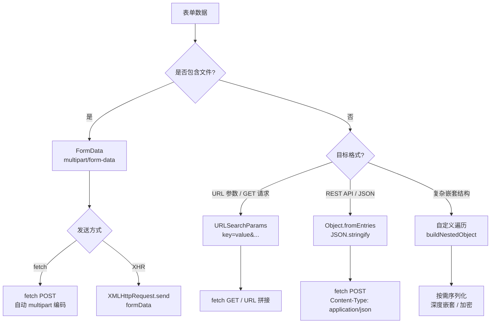

# 表单序列化




> 📊 表单序列化的核心决策路径：先判断是否包含文件（决定能否用 JSON），再根据目标格式选择对应的 API 组合。

表单序列化的目标是把用户在页面中填写的字段，转换成可以在网络上传输或在应用内部复用的结构化数据。常见输出形态包括：

- 查询字符串（Query String）：形如 `key=value&key2=value2`，用于 GET 请求或将状态同步到 URL。
- `FormData`：保留文件、二进制数据，适用于 `multipart/form-data` 请求，与 `fetch()` 或 `XMLHttpRequest` 协作。
- `JSON` 对象/字符串：在 REST、GraphQL、Web API 以及前端状态管理中最常见。

选择哪种方式取决于后端接口要求、字段类型以及是否包含文件上传。本章从原生 API 到手工策略，系统梳理表单序列化的常见方案、注意事项与最佳实践。

### 序列化策略一览

| 目标格式     | 典型场景                             | 关键 API / 技术栈                     |
| ------------ | ------------------------------------ | ------------------------------------- |
| Query String | GET 请求、URL 状态同步、静态缓存命中 | `FormData`、`URLSearchParams`         |
| FormData     | POST/PUT 上传、文件、富文本          | `FormData`、`fetch`、`XMLHttpRequest` |
| JSON         | REST/GraphQL、SPA 状态同步           | `FormData`、`Object.fromEntries`      |
| 自定义结构   | 加密、离线缓存、复杂嵌套             | DOM 遍历、自定义函数、第三方库        |

### 原生 API：FormData + URLSearchParams

#### FormData 快速入门

`FormData` 可以从 `<form>` 构造，也可以手动创建。它能够收集文本、复选框、多选列表以及文件字段。

```html
<form id="profileForm">
  <input type="text" name="username" value="zhang" />
  <input type="checkbox" name="skills" value="js" checked />
  <input type="checkbox" name="skills" value="css" />
  <input type="file" name="avatar" />
  <button type="submit">提交</button>
</form>

<script>
  const form = document.querySelector("#profileForm")

  form.addEventListener("submit", async (event) => {
    event.preventDefault()
    const formData = new FormData(form)

    for (const [key, value] of formData) {
      console.log(key, value)
    }

    await fetch("/api/profile", {
      method: "POST",
      body: formData // 浏览器会自动设置 multipart/form-data
    })
  })
</script>
```

##### 常用操作

- `append(name, value)`：追加键值对，保留原值。
- `set(name, value)`：覆盖指定键的所有值。
- `delete(name)`、`has(name)`：移除或检查字段。
- `formData.getAll("skills")`：获取多选字段的完整数组。

#### FormData → Query String

`URLSearchParams` 能将 `FormData` 转换成查询字符串，用于同步到地址栏或构造 GET 请求。

```javascript
const formData = new FormData(form)
const queryString = new URLSearchParams(formData).toString()
// username=zhang&skills=js
```

如果需要忽略空值或临时字段，可以先过滤再生成参数：

```javascript
const params = Array.from(new FormData(form)).filter(([_, value]) => value !== "")
const query = new URLSearchParams(params)
history.replaceState(null, "", `${location.pathname}?${query}`)
```

#### FormData → JSON

多数 API 更倾向接收 JSON，可以利用 `Object.fromEntries` 和 `getAll` 组合实现：

```javascript
const formData = new FormData(form)
const payload = Object.fromEntries(formData.entries())

for (const key of formData.keys()) {
  const values = formData.getAll(key)
  if (values.length > 1) {
    payload[key] = values
  }
}

await fetch("/api/profile", {
  method: "POST",
  headers: { "Content-Type": "application/json" },
  body: JSON.stringify(payload)
})
```

##### 解析嵌套键名

若采用 `user[address][city]` 这种命名方式，可将键拆分构造嵌套对象：

```javascript
function buildNestedObject(formData) {
  const result = {}

  for (const [rawKey, value] of formData.entries()) {
    const keys = rawKey.split("[").map((part) => part.replace(/\]$/, ""))
    let cursor = result

    keys.forEach((key, index) => {
      const isLast = index === keys.length - 1
      if (isLast) {
        if (cursor[key] === undefined) cursor[key] = value
        else cursor[key] = [].concat(cursor[key], value)
      } else {
        cursor[key] = cursor[key] ?? {}
        cursor = cursor[key]
      }
    })
  }

  return result
}
```

#### 监听 `formdata` 事件

在提交表单（`submit` 或 `requestSubmit()`）后、发送请求前，浏览器会触发 `formdata` 事件，可用来追加数据或统一处理：

```javascript
const form = document.querySelector("#profileForm")

form.addEventListener("formdata", (event) => {
  const formData = event.formData
  formData.append("csrf_token", window.csrfToken)
  formData.set("timestamp", Date.now().toString())
})
```

### 自定义遍历与序列化

在需要完全掌控输出或序列化非表单控件时，可以手写遍历：

```javascript
function serializeForm(form, options = { includeDisabled: false }) {
  const result = []

  for (const element of form.elements) {
    if (!element.name) continue
    if (!options.includeDisabled && element.disabled) continue

    switch (element.type) {
      case "checkbox":
        if (element.checked) result.push([element.name, element.value || "on"])
        break
      case "radio":
        if (element.checked) result.push([element.name, element.value])
        break
      case "select-one":
      case "select-multiple":
        for (const option of element.selectedOptions) {
          result.push([element.name, option.value])
        }
        break
      case "file":
        if (element.files.length) result.push([element.name, element.files[0]])
        break
      default:
        // text、password、textarea、hidden 等
        if (element.value) result.push([element.name, element.value])
        break
    }
  }

  return result
}

const pairs = serializeForm(document.querySelector("#profileForm"))
const query = new URLSearchParams(pairs).toString()
const json = JSON.stringify(Object.fromEntries(pairs))
```

这种方式便于实现字段白名单/黑名单、类型转换、脱敏或记录原始输入。

### 第三方库与框架生态

- **form-serialize**：支持 `hash`、`array` 模式，可解析嵌套命名。
- **qs**：Node.js/前端通用的查询字符串库，对深层对象支持良好。
- **Formik / VeeValidate / React Hook Form**：框架型库通常自带序列化与验证流程。
- **Zod / Yup**：与 `Object.fromEntries(new FormData(form))` 配合，实现校验 + 序列化。

```html
<script src="https://cdnjs.cloudflare.com/ajax/libs/form-serialize/0.7.2/form-serialize.min.js"></script>

<form id="accountForm">
  <input type="text" name="user[username]" value="JohnDoe" />
  <input type="email" name="user[email]" value="john@example.com" />
  <input type="checkbox" name="user[roles][]" value="admin" checked />
  <input type="checkbox" name="user[roles][]" value="editor" />
  <button type="submit">提交</button>
</form>

<script>
  document.querySelector("#accountForm").addEventListener("submit", (event) => {
    event.preventDefault()
    const data = serialize(event.target, { hash: true, empty: false })
    console.log(data)
    // => { user: { username: "JohnDoe", email: "john@example.com", roles: ["admin"] } }
  })
</script>
```

### 注意事项与坑点

#### 编码

- 使用 `URLSearchParams` 或 `encodeURIComponent()` 处理特殊字符，避免手动字符串拼接。
- 需要非 UTF-8 编码时，可在 `<form accept-charset="...">` 上调整，或在发送前手动转换。

#### 控件覆盖范围

- `disabled` 控件不会被序列化，必要时临时启用或手动收集。
- 多选与同名字段会生成多值，记得使用 `getAll()` 或自定义逻辑处理。
- 文件字段只能通过 `FormData` 上传，若接口仅接受 JSON，需要拆成多次请求或走 Base64（谨慎）。

#### 安全性

- 客户端序列化不代表数据可信，后端仍需校验、清洗。
- 传输敏感数据请确保 HTTPS、CSRF Token、`SameSite` Cookie 等安全策略。
- 日志或埋点记录表单数据时要注意脱敏。

#### 兼容性

- `FormData` 在 IE10+ 支持，但 `formdata` 事件、`requestSubmit()` 仅在现代浏览器可用。
- `URLSearchParams` 支持度较好，IE 需引入 polyfill 或改用第三方库。
- 某些旧浏览器对 `fetch` 上传 `FormData` 的 `Blob`/`File` 支持不一致，可降级到 `XMLHttpRequest`。

### 综合示例

将嵌套键名解析与 JSON 提交组合起来的完整流程：

```html
<form id="orderForm">
  <input name="user[name]" value="zhang" />
  <input name="user[phone]" value="13800000000" />
  <button type="submit">提交</button>
</form>

<script>
  const form = document.querySelector("#orderForm")

  form.addEventListener("submit", async (event) => {
    event.preventDefault()
    const payload = buildNestedObject(new FormData(form))

    await fetch("/api/order", {
      method: "POST",
      headers: { "Content-Type": "application/json" },
      body: JSON.stringify(payload)
    })
  })
</script>
```

---

