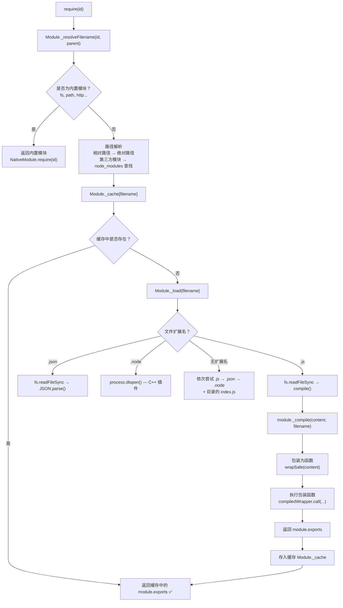

# CommonJS 模块化规范

**CommonJS** 是定义模块如何被组织和使用的规范。它的核心目标是让 JavaScript 能够在更广泛的场景（尤其是服务器端）进行模块化开发，避免全局变量污染，并实现代码的按需加载和复用。

**核心概念：**

- **模块即文件**：在 CommonJS 中，一个文件就是一个独立的模块，拥有自己的作用域
- **导出 (`module.exports`)**：每个模块内部都有一个 `module` 对象，该对象有一个 `exports` 属性，用于对外暴露接口
- **导入 (`require`)**：使用 `require()` 方法来加载并使用其他模块导出的接口

**重要性：**

- **依赖管理**：清晰地声明了模块间的依赖关系，便于管理和维护
- **代码组织**：将复杂的系统拆分为多个独立的、可复用的模块，提高了代码的可读性和组织性
- **服务器端标准**：作为 Node.js 的标准，CommonJS 支撑了庞大的 npm 生态，是无数后端应用和前端工具链的基石

## 技术细节

CommonJS 规定每个文件都是一个独立的模块。模块内部的变量和函数默认是私有的，不会污染全局作用域。如果希望外部能够访问，必须通过 `module.exports` 或 `exports` 对象进行导出。

Node.js 在执行模块代码时，会使用一个函数包装器将其包裹起来，如下所示：

```javascript
;(function (exports, require, module, __filename, __dirname) {
  // 你的模块代码会在这里执行
})
```

> 这个包装器解释了为什么可以在每个模块内部直接使用 `exports`、`require`、`module`、`__filename` 和 `__dirname` 这些变量

#### `module.exports` 与 `exports`

- **`module.exports`**: 这是真正的导出对象。当其他模块 `require` 本模块时，得到的就是 `module.exports` 所指向的对象。
- **`exports`**: 这是一个指向 `module.exports` 的便捷引用（`var exports = module.exports;`）。可以用它来添加属性，例如 `exports.name = 'value'`，这等同于 `module.exports.name = 'value'`。

**重要陷阱**：绝不能直接给 `exports` 赋值，因为这会切断它与 `module.exports` 的引用关系，导致导出失败

```javascript
// 正确做法
exports.add = (a, b) => a + b
module.exports.subtract = (a, b) => a - b

// 也可以直接导出一个对象或函数
module.exports = {
  // ...
}

// 错误做法：这会改变 exports 变量的指向，但 module.exports 依然是初始的空对象
exports = {
  add: (a, b) => a + b
}
// 最终导出的还是一个空对象 {}
```

#### `require` 的工作原理

`require()` 是同步方法，用于加载模块。它的执行流程如下：

1.  **路径解析**：根据 `require` 传入的标识符（如 `'./math'` 或 `'express'`），查找对应的模块文件
2.  **缓存检查**：`require` 会优先检查模块缓存。如果该模块已经被加载过，则直接从缓存中返回 `module.exports` 的值，不会再次执行模块代码
3.  **模块加载**：如果缓存中没有，则找到文件，读取内容，并执行上文提到的函数包装器
4.  **返回导出**：执行完毕后，返回模块的 `module.exports` 对象，并将其缓存起来

## 使用示例

### 模块定义与引用

**`math.js` (定义模块)**

```javascript
// 导出一个包含多个方法的对象
const add = (a, b) => {
  console.log("Executing add function")
  return a + b
}

const PI = 3.14

module.exports = {
  add,
  PI
}
```

**`app.js` (引用模块)**

```javascript
// 导入整个模块
const math = require("./math.js")

console.log("PI:", math.PI) // 输出: PI: 3.14
console.log("Sum:", math.add(5, 3)) // 输出: Executing add function, Sum: 8
```

### 模块缓存

`require` 的缓存机制意味着模块代码只会在第一次加载时执行一次。

**`counter.js`**

```javascript
console.log("Counter module is being initialized.")
let count = 0

module.exports = {
  increment: () => ++count,
  getCount: () => count
}
```

**`main.js`**

```javascript
const counter1 = require("./counter.js")
console.log("First import, count:", counter1.getCount()) // 0
counter1.increment()
console.log("After increment, count:", counter1.getCount()) // 1

// 再次 require 同一个模块
const counter2 = require("./counter.js")
console.log("Second import, count:", counter2.getCount()) // 1 (模块没有重新初始化)

console.log(counter1 === counter2) // true (两次导入得到的是同一个对象)

// 执行结果:
// Counter module is being initialized.
// First import, count: 0
// After increment, count: 1
// Second import, count: 1
// true
```

### 循环引用

当模块 A 依赖模块 B，同时模块 B 又依赖模块 A 时，就会发生循环引用。CommonJS 为了避免无限循环，会返回一个**未完成的 `exports` 对象**。

**`a.js`**

```javascript
console.log("a.js starting")
exports.done = false
const b = require("./b.js") // 依赖 b.js
console.log("in a.js, b.done =", b.done)
exports.done = true
console.log("a.js done")
```

**`b.js`**

```javascript
console.log("b.js starting")
exports.done = false
const a = require("./a.js") // 依赖 a.js
console.log("in b.js, a.done =", a.done)
exports.done = true
console.log("b.js done")
```

**`main.js`**

```javascript
console.log("main starting")
const a = require("./a.js")
const b = require("./b.js")
console.log("in main, a.done =", a.done, ", b.done =", b.done)
```

**执行 `node main.js` 的输出：**

```
main starting
a.js starting
b.js starting
in b.js, a.done = false  // <-- a.js 尚未执行完毕，返回了当时的 exports
b.js done
in a.js, b.done = true
a.js done
in main, a.done = true , b.done = true
```

## 工程实践

### 在现代前端项目中的应用

尽管 ES Module 已成为浏览器和现代 JavaScript 的标准，但 CommonJS 依然在前端工程化中扮演着重要角色：

- **Node.js 工具链**：Webpack、Babel、ESLint 等绝大多数构建工具本身是基于 Node.js 开发的，它们的配置文件（如 `webpack.config.js`）和内部逻辑大量使用 CommonJS
- **NPM 生态**：NPM 上发布的许多历史悠久的库仍然是 CommonJS 格式
- **构建过程**：构建工具（如 Webpack）具备强大的模块解析能力，可以识别并兼容 CommonJS 模块，将其与其他模块（如 ESM）一同打包成浏览器可执行的代码

### Node.js 与浏览器环境的差异

- **Node.js 环境**：

  - **原生支持**：CommonJS 是 Node.js 的内置模块系统。`require`, `module`, `exports` 都是可以直接使用的全局性变量。
  - **文件系统访问**：`require` 的同步特性依赖于对本地文件系统的快速访问。

- **浏览器环境**：
  - **不原生支持**：浏览器没有 `require` 或 `module.exports` 的概念。直接在 `<script>` 标签中使用会抛出错误。
  - **网络延迟**：浏览器的文件加载依赖网络请求，是异步的。如果使用同步的 `require`，会导致页面渲染阻塞，用户体验极差。
  - **解决方案**：必须通过**打包工具（Bundler）**如 Webpack、Rollup 或 Parcel 进行处理。这些工具会分析模块依赖关系，将所有 CommonJS 模块转换并打包成一个或多个浏览器兼容的 JavaScript 文件。

## Node.js 模块加载源码原理

理解 `require` 的底层实现，有助于排查模块加载问题和优化项目构建。

### require 的完整执行流程



> 📊 图表解读：`require` 的核心流程是「解析路径 → 查缓存 → 加载文件 → 编译执行 → 缓存结果」。内置模块最快（跳过文件 I/O），缓存命中次之，首次加载最慢（需要读取文件并编译）。

### Module._resolveFilename — 路径解析

路径解析是 `require` 的第一步，决定了从哪里找到模块文件：

```javascript
// Node.js 源码简化版
Module._resolveFilename = function (request, parent) {
  // 1. 内置模块直接返回
  if (NativeModule.canBeRequiredByUsers(request)) {
    return request
  }

  // 2. 解析路径
  // - 相对路径 './xxx' → 基于 parent.filename 解析
  // - 绝对路径 '/xxx' → 直接使用
  // - 第三方模块 'xxx' → 在 node_modules 中查找
  const filename = Module._findPath(request, path.dirname(parent.filename))

  if (!filename) {
    throw new Error(`Cannot find module '${request}'`)
  }

  return filename
}
```

#### 第三方模块查找算法

```javascript
// require('express') 的查找过程
// 从当前文件所在目录开始，逐级向上查找 node_modules

查找路径 = [
  '/项目/src/node_modules/express',
  '/项目/node_modules/express',
  '/node_modules/express',
  // ... 直到根目录
]

// Module._nodeModulePaths 生成查找路径
Module._nodeModulePaths = function (from) {
  const paths = []
  let current = path.resolve(from)
  while (current !== path.dirname(current)) {
    paths.push(path.join(current, 'node_modules'))
    current = path.dirname(current)
  }
  return paths
}
```

#### package.json 的 main 和 exports 字段

以 `node_modules/express/package.json` 为例：

```json
{
  "main": "index.js",
  "exports": {
    ".": "./index.js",
    "./lib/router": "./lib/router.js",
    "./package.json": "./package.json"
  }
}
```

其中 `main` 是旧方式（`require('express')` 加载此文件），`exports` 是新方式（Node.js 12+），提供更精确的入口控制。

> 💡 `exports` 字段比 `main` 优先级更高，且支持子路径导出和条件导出（区分 ESM/CJS）。

### Module._load — 加载与缓存

```javascript
// Node.js 源码简化版
Module._load = function (filename, parent) {
  // 1. 检查缓存
  const cachedModule = Module._cache[filename]
  if (cachedModule !== undefined) {
    // 更新子模块引用计数
    updateChildren(cachedModule, parent)
    return cachedModule.exports
  }

  // 2. 内置模块走特殊路径
  if (NativeModule.canBeRequiredByUsers(filename)) {
    return NativeModule.require(filename)
  }

  // 3. 创建新模块对象
  const module = new Module(filename, parent)
  Module._cache[filename] = module  // 注意：缓存先于加载，处理循环引用的关键

  // 4. 加载模块
  try {
    module.load(filename)
  } catch (error) {
    delete Module._cache[filename]  // 加载失败则删除缓存
    throw error
  }

  return module.exports
}
```

> 💡 **关键细节**：缓存先于加载写入（`Module._cache[filename] = module`），这是处理循环引用的核心机制——当 A 依赖 B，B 又依赖 A 时，B 中 `require('./a')` 会从缓存中拿到 A 的**未完成** exports 对象。

### module._compile — 编译执行

```javascript
// Node.js 源码简化版
Module.prototype._compile = function (content, filename) {
  // 1. 包装为函数
  const wrapped = wrapSafe(content)
  // wrapped = '(function (exports, require, module, __filename, __dirname) { ' +
  //            content +
  //            '\n});'

  // 2. 使用 vm.runInThisContext 编译
  const compiledWrapper = vm.runInThisContext(wrapped, {
    filename: filename,
    lineOffset: 0,
  })

  // 3. 执行包装函数，注入 require/exports 等参数
  const dirname = path.dirname(filename)
  const result = compiledWrapper.call(
    this.exports,   // this 指向 exports
    this.exports,   // exports
    this.require,   // require（Module.prototype.require 的绑定版本）
    this,           // module
    filename,       // __filename
    dirname         // __dirname
  )

  return result
}
```

### 模块包装器详解

每个模块代码都会被包装成以下形式：

```javascript
;(function (exports, require, module, __filename, __dirname) {
  // 你的模块代码

  // 例如：const fs = require('fs')
  // 实际执行的是包装函数的 require 参数
  // 它是 Module.prototype.require 的绑定版本
})
```

| 参数 | 来源 | 说明 |
|------|------|------|
| `exports` | `module.exports` 的引用 | 便捷导出方式 |
| `require` | `Module.prototype.require` | 带缓存的模块加载函数 |
| `module` | `new Module(filename)` | 模块实例对象 |
| `__filename` | `filename` | 当前模块的绝对路径 |
| `__dirname` | `path.dirname(filename)` | 当前模块所在目录 |

### 模块缓存机制深入

```javascript
// 查看 require.cache
console.log(Object.keys(require.cache))
// 输出所有已缓存模块的绝对路径

// 手动清除缓存（热更新场景）
delete require.cache[require.resolve('./my-module')]

// 热更新示例
function hotReload(modulePath) {
  const resolvedPath = require.resolve(modulePath)
  delete require.cache[resolvedPath]
  return require(modulePath)  // 重新加载
}

// 监听文件变化自动热更新
fs.watch('./config.js', (event) => {
  if (event === 'change') {
    const newConfig = hotReload('./config.js')
    console.log('配置已更新:', newConfig)
  }
})
```

### require.resolve — 路径探测

`require.resolve` 只解析路径，不加载模块，用于检查模块是否存在：

```javascript
// 解析模块的完整路径
const expressPath = require.resolve('express')
// '/项目/node_modules/express/index.js'

// 解析失败抛出错误
try {
  require.resolve('non-existent-module')
} catch (e) {
  console.log('模块不存在')
}

// 查看所有查找路径
console.log(module.paths)
// ['/项目/src/node_modules', '/项目/node_modules', '/node_modules', ...]

// require.resolve.paths — 查看第三方模块的查找路径
console.log(require.resolve.paths('express'))
```

### 模块加载性能优化

| 优化策略 | 说明 | 示例 |
|----------|------|------|
| **利用缓存** | 避免重复 require 同一模块 | 将常用模块赋值给顶层变量 |
| **延迟加载** | 在函数内 require 非必须模块 | `if (needsFeature) require('./feature')` |
| **避免循环引用** | 重构模块结构，消除循环依赖 | 提取公共模块到第三方文件 |
| **减少 node_modules 查找** | 使用绝对路径或设置 NODE_PATH | `require(path.resolve(__dirname, 'lib/utils'))` |
| **预编译** | 使用 bytenode 将 JS 编译为 V8 字节码 | 保护源码 + 加快启动速度 |
