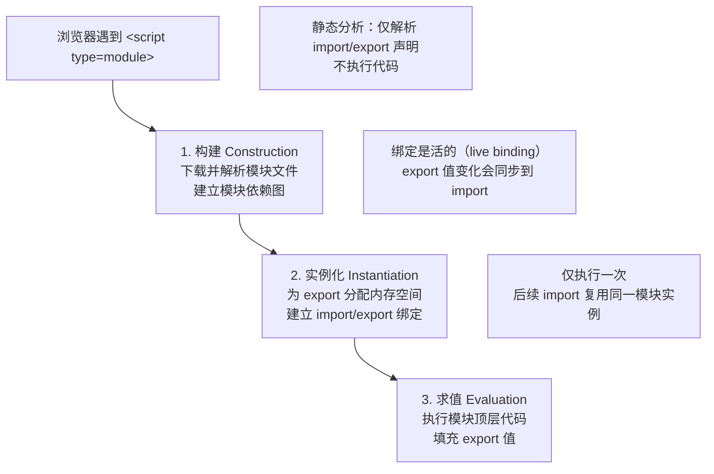
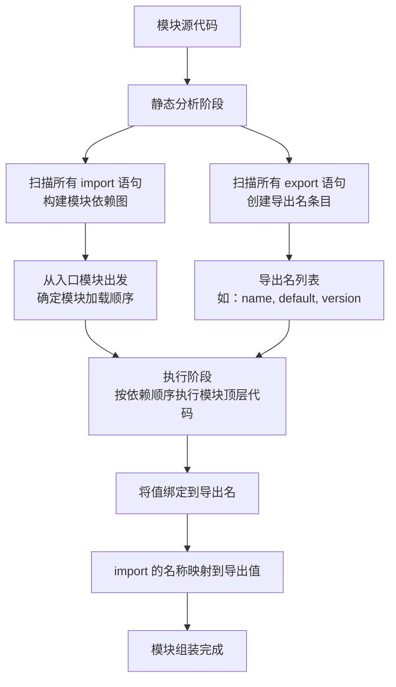

# ES Module

> ES Module 是 JavaScript 的官方模块标准（ES6 引入），采用静态声明式语法，支持编译时静态分析和 Tree Shaking。理解 ESM 与 CommonJS 的核心差异，是现代前端工程化的基础。

## ESM 模块加载流程



> 📊 图表解读：ESM 的加载分三阶段——构建（建立依赖图）、实例化（分配内存并绑定）、求值（执行代码）。其中「实例化」阶段建立的是**活绑定（live binding）**，这是 ESM 与 CommonJS 「值拷贝」的本质区别。

ECMAScript Modules（简称 ES Module 或 ESM）是 JavaScript 官方的标准化模块系统。它的出现统一了前端和后端 JavaScript 生态的模块化方案，解决了长久以来社区中 CommonJS, AMD, UMD 等多种模块规范并存的问题。

## 1. 基本概念

### 什么是 ES Module？

ES Module 是由 ECMAScript 标准（从 ES6/ES2015 开始）定义的一种在 JavaScript 文件中导入和导出功能的机制。它通过 `import` 和 `export` 关键字，允许开发者将代码拆分成独立的、可复用的模块，并通过静态声明的方式组织依赖关系。

### 与 CommonJS 的区别

ES Module 和 Node.js 广泛使用的 CommonJS 模块系统在设计理念和行为上有显著区别：

| 特性            | ES Module (ESM)                      | CommonJS (CJS)                        |
| :-------------- | :----------------------------------- | :------------------------------------ |
| **语法**        | `import` / `export`                  | `require()` / `module.exports`        |
| **加载时机**    | **编译时**确定依赖关系（静态）       | **运行时**加载模块（动态）            |
| **加载方式**    | 异步加载                             | 同步加载                              |
| **值的引用**    | 导出**值的实时绑定**（Live Binding） | 导出**值的拷贝**（缓存值）            |
| **`this` 指向** | 模块顶层 `this` 为 `undefined`       | 模块顶层 `this` 指向 `module.exports` |
| **适用环境**    | 现代浏览器和新版 Node.js             | 主要用于服务器端 Node.js              |

### 环境支持情况

- **浏览器**: 现代浏览器（Chrome 61+, Firefox 60+, Safari 10.1+, Edge 16+）已原生支持 ES Module。使用时需在 `<script>` 标签中添加 `type="module"` 属性。
  ```html
  <script type="module" src="main.js"></script>
  ```
- **Node.js**:
  - Node.js v13.2.0 及以上版本已正式支持 ES Module。
  - 你可以通过以下两种方式之一在 Node.js 项目中启用 ESM：
    1.  将文件后缀名改为 `.mjs`。
    2.  在项目的 `package.json` 文件中设置 `"type": "module"`，这样所有 `.js` 文件都会被当作 ES Module 处理。

---

## 2. 语法规范

### 导出语法 (export)

ESM 提供了两种导出方式：命名导出（Named Export）和默认导出（Default Export）。

- **命名导出 (`export`)**: 一个模块可以有多个命名导出。

  ```javascript
  // a.js
  export const name = "ES Module"
  export function sayHello() {
    console.log("Hello, " + name)
  }

  // 或者先声明再统一导出
  const version = "1.0"
  const author = "ECMA"
  export { version, author }
  ```

- **默认导出 (`export default`)**: 一个模块只能有一个默认导出。它可以是任何表达式，如函数、类、对象等。
  ```javascript
  // b.js
  export default function () {
    console.log("This is a default export.")
  }
  ```

### 导入语法 (import)

与导出对应，导入语法也十分灵活。

- **导入命名导出的成员**: 使用花括号 `{}`。

  ```javascript
  // main.js
  import { name, sayHello } from "./a.js"

  console.log(name) // 'ES Module'
  sayHello() // 'Hello, ES Module'

  // 可以使用 as 关键字重命名
  import { version as v } from "./a.js"
  console.log(v) // '1.0'
  ```

- **导入默认导出的成员**: 无需花括号，可以任意命名。

  ```javascript
  // main.js
  import myDefaultFunction from "./b.js"
  myDefaultFunction() // 'This is a default export.'
  ```

- **混合导入**: 同时导入默认和命名成员。

  ```javascript
  // c.js
  export default () => console.log("Default")
  export const foo = "bar"

  // main.js
  import myDefault, { foo } from "./c.js"
  ```

- **整体导入 (`* as`)**: 将一个模块的所有命名导出收集到一个对象中。

  ```javascript
  // main.js
  import * as moduleA from "./a.js"

  console.log(moduleA.name) // 'ES Module'
  console.log(moduleA.version) // '1.0'
  ```

### 动态导入 (Dynamic `import()`)

`import()` 函数允许在运行时按需加载模块。它返回一个 Promise，该 Promise 在模块加载完成后 resolve 为模块的命名空间对象。

- **使用场景**: 代码分割（Code Splitting）、条件加载、延迟加载。
- **示例**:
  ```javascript
  document.getElementById("my-button").addEventListener("click", async () => {
    try {
      const moduleA = await import("./a.js")
      moduleA.sayHello()
    } catch (error) {
      console.error("Failed to load module:", error)
    }
  })
  ```

---

## 3. 核心特性

### 静态分析能力

ESM 的 `import`/`export` 语法是静态的，必须在模块的顶层作用域使用。这意味着模块的依赖关系在**编译时**（或代码执行前）就能确定。这个特性带来了巨大的优势：

- **Tree Shaking**: 打包工具（如 Rollup, Webpack）可以分析出哪些导出的代码从未被使用，并在最终打包时将其移除，从而显著减小文件体积。
- **更快的模块解析**: 引擎可以更早地构建依赖图，优化加载过程。
- **更强的错误检查**: 如果导入了不存在的成员，可以在编译阶段就发现并报错。

### 循环依赖处理机制

ESM 对循环依赖的处理比 CommonJS 更优雅。

- **场景**: `a.js` 导入 `b.js`，同时 `b.js` 导入 `a.js`。
- **处理方式**: ESM 导出的是**值的引用**（实时绑定）。当 `a.js` 遇到 `import b` 时，它会去解析 `b.js`。在 `b.js` 中遇到 `import a` 时，系统知道 `a.js` 正在解析中，会返回一个对 `a.js` 导出的绑定。此时 `b.js` 可以继续执行。当 `a.js` 执行完毕后，其导出的值会被填充，`b.js` 中之前获取的绑定也就能访问到正确的值了。

```javascript
// a.js（注意：这里用 var 声明；若用 let/const，
// 执行到 b.js 时 a 处于 TDZ，直接访问会抛 ReferenceError）
import { b } from "./b.js"
export var a = "a"
console.log("a.js:", b) // 在 b.js 执行完后，可以访问到 b

// b.js
import { a } from "./a.js"
export const b = "b"
console.log("b.js:", a) // a 此时是 undefined，因为 a.js 尚未执行完毕
setTimeout(() => console.log("b.js timeout:", a), 0) // 活绑定：此时 a 已被填充为 "a"
```

### 模块作用域隔离

每个 ES Module 都有自己的顶层作用域。在一个模块中声明的变量、函数或类，不会自动成为全局变量，也不会污染其他模块的作用域。这是模块化最基本也是最重要的特性之一。

### 实时绑定 (Live Binding)

ESM 导出的不是值的副本，而是值的**实时绑定**。这意味着如果导出模块内部改变了导出变量的值，导入模块中对应的值也会同步更新。

```javascript
// counter.js
export let count = 0
export function increment() {
  count++
}

// main.js
import { count, increment } from "./counter.js"

console.log(count) // 0
increment()
console.log(count) // 1 (值被实时更新了)
// count = 2; // 错误！导入的绑定是只读的 (Uncaught TypeError: Assignment to constant variable.)
```

---

## 4. 实际应用

### 浏览器端使用

在 HTML 中通过 `<script type="module">` 引入入口文件。所有后续的 `import` 都会遵循同源策略（CORS）通过网络请求加载。

```html
<!-- HTML 结构省略，仅展示关键 JS 逻辑 -->
```

### Node.js 项目配置

在 Node.js 中使用 ESM，推荐在 `package.json` 中进行配置：

1.  **`package.json`**:
    ```json
    {
      "name": "my-esm-project",
      "version": "1.0.0",
      "type": "module"
    }
    ```
2.  **`index.js`**:

    ```javascript
    import fs from "fs" // 可以直接导入内置模块
    import { name } from "./utils.js"

    console.log(`Hello, ${name}!`)
    ```

3.  **`utils.js`**:
    ```javascript
    export const name = "Node.js with ESM"
    ```

### 与打包工具的集成

尽管浏览器和 Node.js 提供了原生支持，但在生产环境中，我们通常还是会使用 Webpack 或 Rollup 等打包工具。

- **原因**:
  - **性能**: 将多个模块打包成一个或少数几个文件，减少 HTTP 请求数。
  - **兼容性**: 通过 Babel 等工具将现代 JS 语法转换为旧版浏览器兼容的代码。
  - **优化**: 代码压缩、混淆、Tree Shaking 等。
- **Rollup**: 以 ESM 为核心，对 Tree Shaking 的支持非常出色，适合打包库文件。
- **Webpack**: 功能更全面，除了 JS 模块，还能处理 CSS、图片等资源，适合打包复杂的应用程序。


## 5. Import Attributes（ES2025）

ES2025 引入了 Import Attributes（导入属性），允许开发者在导入模块时声明模块的类型，使模块的解析方式更加明确和安全。

### 基本语法

```javascript
import json from "./data.json" with { type: "json" }
import css from "./styles.css" with { type: "css" }
import wasm from "./module.wasm" with { type: "webassembly" }

// 动态导入也支持
const data = await import("./data.json", { with: { type: "json" } })
```

### 为什么需要 Import Attributes

```javascript
// ❌ 之前：浏览器无法确定如何解析非 JS 文件
import data from "./data.json" // 浏览器不知道这是 JSON

// ✅ 现在：明确声明类型
import data from "./data.json" with { type: "json" }
```

**核心价值：**

- **安全性**：防止服务器返回错误 Content-Type 时代码被错误解析
- **明确性**：让模块类型在代码中显式声明，而非依赖文件扩展名
- **可扩展性**：未来可支持更多模块类型（CSS、WebAssembly 等）

### JSON 模块导入

最常见的用例是导入 JSON 文件：

```javascript
import packageInfo from "./package.json" with { type: "json" }

console.log(packageInfo.name)
console.log(packageInfo.version)
console.log(packageInfo.dependencies)

// 动态导入 JSON
async function loadConfig() {
  const config = await import("./config.json", { with: { type: "json" } })
  return config.default
}
```

### 与旧语法 `assert` 的区别

```javascript
// 旧语法（assert，已废弃）
import data from "./data.json" assert { type: "json" }

// 新语法（with，ES2025 标准）
import data from "./data.json" with { type: "json" }
```

| 特性 | `assert`（旧） | `with`（新） |
|------|----------------|-------------|
| 行为 | 断言，不匹配则报错 | 属性，指导模块解析 |
| 状态 | 已废弃 | ES2025 标准 |
| 语义 | 验证性 | 声明性 |

## 6. import.meta

`import.meta` 是一个特殊的对象，包含当前模块的元信息。它只能在 ES Module 中使用。

### import.meta.url

返回当前模块的 URL，是最常用的属性：

```javascript
// 浏览器中
console.log(import.meta.url) // "https://example.com/modules/current.js"

// Node.js 中
console.log(import.meta.url) // "file:///home/user/project/modules/current.js"

// 获取当前模块所在目录
const moduleDir = new URL(".", import.meta.url).pathname

// 相对于当前模块加载资源
const imageUrl = new URL("./images/logo.png", import.meta.url).href
```

### Node.js 中的 import.meta

```javascript
// 判断是否在 Node.js 中
const isNode = typeof process !== "undefined"

// 获取 __dirname（Node.js ESM 中不再自动提供）
import { fileURLToPath } from "node:url"
import { dirname } from "node:path"

const __filename = fileURLToPath(import.meta.url)
const __dirname = dirname(__filename)
```

### import.meta.resolve()（Node.js）

```javascript
// 解析模块路径（Node.js 12.20+）
const resolvedPath = import.meta.resolve("./helper.js")
console.log(resolvedPath) // "file:///home/user/project/modules/helper.js"
```

## 模块导出的规范解析（核心原理深度）

> **规范层级**：ECMAScript 规范（ECMA-262）· Scripts and Modules 章节（Exports / Module Namespace Exotic Objects）

### 规范语义

`export` 只能导出"名字和值"——用户在 JavaScript 中能书写的只有标识符、字面量和模板。本质上，`export` 导出的是 6 种声明类型所创建的标识符绑定。

`export default <expression>` 是特殊的：它导出的是**值（Value）**，并以特殊名字 `"default"` 注册到模块的导出表中。

关于模块导出的三个关键结论：

1. **没有任何表达式在 export/import 处理阶段被执行**——所有的表达式求值都发生在模块执行阶段
2. **模块组装 = 执行顶层代码一次**——每个模块只执行一次，结果被缓存
3. **`export default function(){}` 导出的是匿名函数定义（Anonymous Function Definition），而非匿名函数表达式**——函数定义的 `.name` 属性会被设置为 `"default"`

### 执行机制



### 核心洞察

**1. 模块加载的两个阶段**

| 阶段 | 时机 | 操作 | 特性 |
|------|------|------|------|
| 静态声明阶段 | 编译时 | export 创建名称条目，import 声明名称并建立依赖 | 不执行任何代码 |
| 动态执行阶段 | 运行时 | 执行模块顶层代码，将值绑定到已声明的名称 | 每个模块只执行一次 |

**2. 依赖图由 import 形成，而非 export**

`export` 只是声明"我提供了这些名字"，`import` 才是真正建立模块间依赖关系的语句。模块依赖图的构建完全依赖于 `import` 语句的静态分析。

**3. `export default` 的本质**

```javascript
export default function() { /* ... */ }
```

等价于在模块内部：

```javascript
// 1. 函数定义被求值（匿名函数定义，非表达式）
// 2. 以 "default" 为名注册到导出表
// 类比：var default = function() {}  // 但 "default" 对外不可见
```

**4. 匿名函数定义 vs 匿名函数表达式**

这是一个微妙但重要的区别：

```javascript
// 匿名函数定义（FunctionDeclaration）—— export default 中
export default function() {}
// 规范要求：.name = "default"

// 匿名函数表达式（FunctionExpression）—— 普通赋值中
const fn = function() {}
// .name = "fn"（从赋值目标推断）
```

在 `export default` 上下文中，`function(){}` 被解析为函数定义（FunctionDeclaration），其 `.name` 被设置为 `"default"`。而普通的 `function(){}` 是函数表达式，其 `.name` 取决于上下文推断规则。

**5. 导出名称始终在 lexicalNames 中**

模块的导出名称被注册在词法环境记录的 `lexicalNames` 列表中，而非 `varNames`。这意味着导出的名称是不可删除的（与 `let/const` 行为一致），而非像 `var` 那样可删除。

### 代码实证

```javascript
// ===== 1. 导入的绑定是常量（不可写） =====
// counter.js
export let count = 0
export function increment() { count++ }

// main.js
import { count, increment } from './counter.js'
console.log(count)       // 0
increment()
console.log(count)       // 1（实时绑定）
// count = 2             // TypeError: Assignment to constant variable
// 导入的绑定是不可写的，即使原始声明用的是 let

// （2~4 项示例从略）

// ===== 5. 导出名称在 lexicalNames 中（不可删除）=====
// module.js
export const x = 1
export let y = 2
// 这些名称在模块的词法环境中注册
// 与 var 不同，它们不能通过 delete 删除
```

### 与实战的关联

**1. 为什么 ESM 是"静态的"以及对 Tree-shaking 的意义**

ESM 的 `import/export` 在编译时就可确定模块依赖关系和导出名称。打包工具（如 Rollup、Webpack）可以安全地分析出哪些导出从未被使用，并在最终产物中移除这些代码。这是 Tree-shaking 的基础。

`export default` 虽然方便，但由于导出名固定为 `"default"`，打包工具难以通过名称追踪其使用情况。**命名导出更有利于 Tree-shaking**。

**2. 为什么 `export default` 方便但命名导出对工具更友好**

```javascript
// 命名导出：工具可以精确追踪使用情况
export const utils = { /* ... */ }
export const helper = () => { /* ... */ }
// 如果只有 utils 被导入，helper 可以被 Tree-shaking 移除

// 默认导出：工具难以判断是否部分使用
export default { utils, helper }
// 整个对象必须被保留，无法部分移除
```

**3. 循环依赖的处理**

ESM 的两阶段设计天然支持循环依赖：静态声明阶段所有模块的导出名称都已注册，即使模块尚未执行完毕，其他模块也能通过名称绑定访问到导出值。在执行阶段，如果循环依赖的模块尚未执行完毕，对应的绑定值为 `undefined`（`let/const` 处于 TDZ 状态），但绑定关系已经建立。当模块执行完毕后，绑定值会被填充。

---

## 相关链接

- **MDN 文档**: [JavaScript modules](https://developer.mozilla.org/en-US/docs/Web/JavaScript/Guide/Modules)
- **ECMAScript® 2023 Language Specification**: [ECMAScript Language: Scripts and Modules](https://tc39.es/ecma262/#sec-scripts-and-modules)
- **Node.js 文档**: [ECMAScript modules](https://nodejs.org/api/esm.html)
