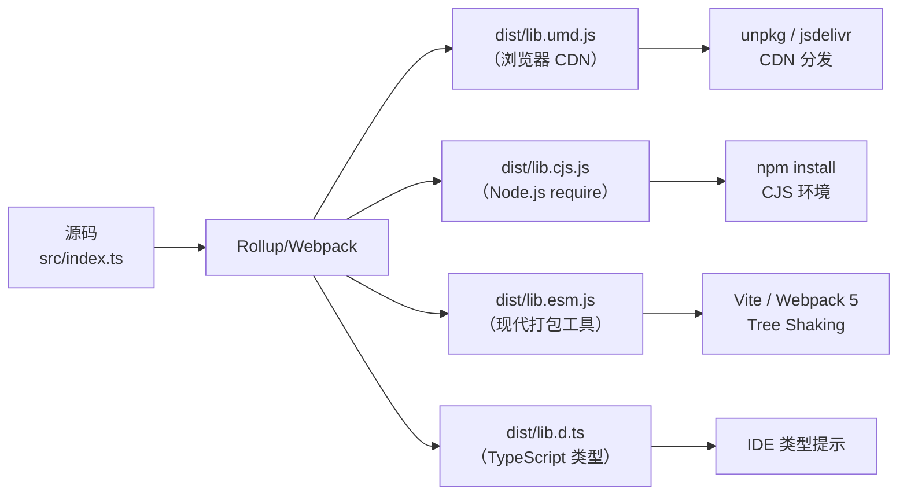

# UMD (Universal Module Definition) 模块规范

UMD (Universal Module Definition) 是一种为了兼容 CommonJS 和 AMD 这两种流行模块系统而设计的 JavaScript 模块模式。它的核心目标是让一个模块能同时运行在浏览器和 Node.js 等服务器环境中。

## 1. UMD 的基本概念和设计目的

在 UMD 出现之前，前端社区存在多种模块化方案，最主流的是 CommonJS (主要用于 Node.js) 和 AMD (Asynchronous Module Definition, 主要用于浏览器，代表库是 RequireJS)。

- **CommonJS**：同步加载模块，语法简单，如 `require('module')` 和 `module.exports`。适用于服务器端，因为模块文件都在本地磁盘，加载速度快。
- **AMD**：异步加载模块，语法相对复杂，如 `define(['module'], function(module){...})`。适用于浏览器，因为网络请求是异步的。

为了让同一个模块代码无需修改就能同时在支持 CommonJS 和 AMD 的环境中运行，甚至在没有模块加载器的旧式浏览器环境中（通过全局变量）也能工作，UMD 模式应运而生。它的设计目的就是 **“通用”** 和 **“兼容”**。

## 2. UMD 模块的语法结构和实现原理

UMD 本质上是一个立即执行函数表达式 (IIFE)，它通过检查当前环境支持哪种模块规范，然后将模块内容包装成相应的形式。

其基本结构如下：

```javascript
;(function (root, factory) {
  // 模块定义的核心
})(this, function () {
  // 模块的实际代码
})
```

这个 IIFE 接收两个参数：

- `root`: 一个指向全局对象的引用。在浏览器 `<script>` 顶层中 `this` 是 `window`；在 Node.js 的 CommonJS 模块中顶层 `this` 是 `module.exports` 而非 `global`（这也是 UMD 模板总是先检测 CommonJS 的原因之一）。
- `factory`: 一个工厂函数，模块的真正逻辑在这个函数中定义，其返回值就是模块的导出值。

实现原理是通过一系列的 `if-else` 判断来检测环境：

1.  **检测 AMD**: `typeof define === 'function' && define.amd`
2.  **检测 CommonJS**: `typeof module === 'object' && module.exports`
3.  **回退到全局变量**: 如果以上两者都不满足，则将模块挂载到全局对象 `root` 上。

## 3. 与 CommonJS 和 AMD 模块规范的兼容性处理方式

UMD 的兼容性处理是其设计的精髓所在。它通过一个简单的逻辑判断链，实现了对不同环境的优雅降级。

```javascript
;(function (root, factory) {
  // 1. 检查是否支持 AMD
  if (typeof define === "function" && define.amd) {
    // AMD 环境：使用 define 函数定义模块
    define(["dependency1", "dependency2"], factory)
  }
  // 2. 检查是否支持 CommonJS (Node.js 环境)
  else if (typeof module === "object" && module.exports) {
    // CommonJS 环境：将 factory 的返回值赋给 module.exports
    // 依赖通过 require 导入
    module.exports = factory(require("dependency1"), require("dependency2"))
  }
  // 3. 都不支持时，挂载到全局变量
  else {
    root.myModuleName = factory(root.dependency1, root.dependency2)
  }
})(typeof self !== "undefined" ? self : this, function (dep1, dep2) {
  // 工厂函数，这里是模块的主体
  return {
    // 导出的方法或属性
    publicMethod: function () {
      return "Hello UMD!"
    },
  }
})
```

**兼容性处理流程解析:**

- **AMD**: 如果 `define` 是一个函数且 `define.amd` 存在，就认为当前是 AMD 环境。此时调用 `define()` 来定义模块，并将工厂函数 `factory` 传入。AMD 加载器会负责异步加载依赖并执行工厂函数。
- **CommonJS**: 如果 `module` 是一个对象且 `module.exports` 存在，就认为当前是类似 CommonJS 的环境。此时直接执行工厂函数 `factory`，并将依赖通过 `require()` 传入，最后将其返回值赋给 `module.exports`。
- **全局变量**: 如果以上条件都不满足，就认为是在一个传统的浏览器环境中。此时执行工厂函数，并将依赖从全局对象 `root` (即 `window`) 上获取，最后将模块的导出值赋给 `root` 的一个属性，从而创建了一个全局变量。

## 4. 典型的 UMD 模块代码示例和解析

下面是一个更具体的、不依赖其他库的简单数学工具库的 UMD 实现。

```javascript
;(function (root, factory) {
  if (typeof define === "function" && define.amd) {
    // AMD. Register as an anonymous module.
    define([], factory)
  } else if (typeof module === "object" && module.exports) {
    // Node. Does not work with strict CommonJS, but
    // only CommonJS-like environments that support module.exports,
    // like Node.
    module.exports = factory()
  } else {
    // Browser globals (root is window)
    root.mathUtils = factory()
  }
})(typeof self !== "undefined" ? self : this, function () {
  // 这是模块的实际内容
  var mathUtils = {}

  mathUtils.add = function (a, b) {
    return a + b
  }

  mathUtils.subtract = function (a, b) {
    return a - b
  }

  // 返回这个模块的公共接口
  return mathUtils
})
```

**代码解析:**

1.  `typeof self !== 'undefined' ? self : this`: 这是一个更健壮的获取全局对象的方式，因为在 Web Worker 中，全局对象是 `self` 而不是 `window`，`this` 在严格模式下可能是 `undefined`。
2.  `factory` 函数不接收任何参数，因为它没有外部依赖。
3.  在 `factory` 函数内部，我们创建了一个 `mathUtils` 对象，并为其添加了 `add` 和 `subtract` 方法。
4.  最后，`factory` 函数返回 `mathUtils` 对象，这个对象就成为了模块的导出值。

**如何使用这个模块？**

- **在 Node.js (CommonJS) 中:**
  ```javascript
  const mathUtils = require("./mathUtils.js")
  console.log(mathUtils.add(5, 3)) // 输出 8
  ```
- **在 RequireJS (AMD) 中:**
  ```javascript
  require(["mathUtils"], function (mathUtils) {
    console.log(mathUtils.add(5, 3)) // 输出 8
  })
  ```
- **在浏览器 `<script>` 标签中:**
  ```html
  <script src="mathUtils.js"></script>
  <script>
    console.log(window.mathUtils.add(5, 3)) // 输出 8
  </script>
  ```

## 5. UMD 在现代前端开发中的应用场景

随着 ES Modules (ESM) 成为官方标准并得到现代浏览器和 Node.js 的广泛支持，UMD 的使用场景有所减少，但它在某些情况下仍然非常重要：

- **库的向后兼容性**: 许多广泛使用的库（如 jQuery, Lodash）为了支持旧项目或各种不同的使用方式，仍然会提供 UMD 格式的构建文件。这确保了库在旧版浏览器、AMD/CommonJS 项目中都能正常工作。
- **打包工具的输出格式**: 当使用 Webpack、Rollup 等打包工具时，可以将输出格式（`output.format`）设置为 `umd`。这对于开发需要分发给第三方使用的库（SDK）尤其有用，因为你无法控制用户会以何种方式来使用你的库。
- **过渡时期的选择**: 在团队技术栈从旧的模块系统向 ES Modules 迁移的过程中，UMD 可以作为一个平滑过渡的桥梁。

## 6. 与其他模块系统（如 ES Modules）的对比分析

| 特性          | UMD                                       | ES Modules (ESM)                                    |
| :------------ | :---------------------------------------- | :-------------------------------------------------- |
| **语法**      | IIFE 包装 + 环境检测                       | `import` / `export`                                  |
| **加载方式**  | 同步执行脚本，或由加载器异步加载            | 静态声明 + 异步加载                                   |
| **Tree Shaking** | 不可用（动态包装难以静态分析）            | 支持                                                 |
| **适用环境**  | 浏览器 / Node.js / AMD 全兼容               | 现代浏览器与新版 Node.js                             |
| **定位**      | 库的**构建产物**分发格式                    | 语言级的**源码**模块标准                              |

## 7. UMD 模式的常见变体

UMD 并不是单一的标准，而是一系列模式的统称。不同的 UMD 变体适用于不同场景。

### returnExports.js（最常用）

适用于不依赖其他模块的独立库，即上文展示的标准模式：

```
;(function (root, factory) {
  if (typeof define === 'function' && define.amd) {
    define([], factory)
  } else if (typeof module === 'object' && module.exports) {
    module.exports = factory()
  } else {
    root.myLibrary = factory()
  }
})(typeof self !== 'undefined' ? self : this, function () {
  return { /* 公共 API */ }
})
```

### commonjsStrict.js（严格 CommonJS）

适用于需要严格 CommonJS 兼容的场景，`this` 不作为模块导出对象：

```javascript
;(function (root, factory) {
  if (typeof define === 'function' && define.amd) {
    define(['exports'], factory)
  } else if (typeof module === 'object' && module.exports) {
    factory(module.exports)
  } else {
    factory((root.myLibrary = {}))
  }
})(typeof self !== 'undefined' ? self : this, function (exports) {
  exports.method = function () { /* ... */ }
})
```

### webglobal.js（依赖全局变量）

当 UMD 模块依赖另一个通过全局变量暴露的库时：

```javascript
;(function (root, factory) {
  if (typeof define === 'function' && define.amd) {
    define(['jquery'], factory)           // AMD: 通过 AMD 加载器获取依赖
  } else if (typeof module === 'object' && module.exports) {
    module.exports = factory(require('jquery'))  // CJS: 通过 require 获取
  } else {
    root.myPlugin = factory(root.jQuery)  // 全局：从 window.jQuery 获取
  }
})(typeof self !== 'undefined' ? self : this, function ($) {
  // $ 是 jQuery，无论哪种环境都能正确获取
  return function (element) {
    $(element).doSomething()
  }
})
```

## 8. Webpack UMD 输出配置

使用 Webpack 构建库时，可以将输出格式设置为 UMD，使库能在各种环境中使用。

### 基础 UMD 配置

```javascript
// webpack.config.js
const path = require('path')

module.exports = {
  mode: 'production',
  entry: './src/index.js',
  output: {
    path: path.resolve(__dirname, 'dist'),
    filename: 'my-library.umd.js',
    library: {
      name: 'MyLibrary',          // 全局变量名（浏览器环境）
      type: 'umd',                // 输出格式
      export: 'default',          // 仅导出 default（可选）
    },
    globalObject: 'this',         // 关键：兼容 Node.js 和浏览器
    // 不设置则默认为 self/window，Node.js 中会报错
  },
  externals: {
    // 外部依赖：不打包进 UMD 文件
    jquery: {
      commonjs: 'jquery',
      commonjs2: 'jquery',
      amd: 'jquery',
      root: 'jQuery',             // 浏览器全局变量名
    },
  },
}
```

### globalObject 的重要性

```javascript
// ❌ 不设置 globalObject（默认 self）
// 在 Node.js 中 self 未定义 → 报错
;(function (root, factory) {
  // ...
})(self, function () { /* ... */ })  // ReferenceError: self is not defined

// ✅ 设置 globalObject: 'this'
;(function (root, factory) {
  // ...
})(this, function () { /* ... */ })  // 浏览器中 this = window；Node.js 顶层 this 是 module.exports，由 webpack 兜底处理
```

### 多格式输出

同时输出 UMD、ESM 和 CJS 格式，是现代库的标准做法：

```javascript
// webpack.config.js
const path = require('path')

const commonConfig = {
  mode: 'production',
  entry: './src/index.js',
  externals: { react: 'react' },
}

module.exports = [
  // UMD 格式
  {
    ...commonConfig,
    output: {
      path: path.resolve(__dirname, 'dist'),
      filename: 'my-library.umd.js',
      library: { name: 'MyLibrary', type: 'umd' },
      globalObject: 'this',
    },
  },
  // CommonJS 格式
  {
    ...commonConfig,
    output: {
      path: path.resolve(__dirname, 'dist'),
      filename: 'my-library.cjs.js',
      library: { type: 'commonjs2' },
    },
  },
]
```

**package.json 配置：**

```json
{
  "name": "my-library",
  "version": "1.0.0",
  "main": "dist/my-library.cjs.js",
  "module": "dist/my-library.esm.js",
  "unpkg": "dist/my-library.umd.js",
  "jsdelivr": "dist/my-library.umd.js",
  "exports": {
    ".": {
      "import": "./dist/my-library.esm.js",
      "require": "./dist/my-library.cjs.js",
      "default": "./dist/my-library.umd.js"
    }
  }
}
```

> 💡 上述字段含义：`main` 为 Node.js 入口、`module` 为 ESM 入口（可 Tree Shaking）、`unpkg`/`jsdelivr` 为 CDN 使用的 UMD 文件，浏览器通过 `<script>` 标签直接引入时使用。

## 9. Rollup UMD 输出配置

Rollup 是构建库的首选工具，天然支持 ESM 输入和多格式输出。

### 基础 UMD 配置

```javascript
// rollup.config.mjs
import babel from '@rollup/plugin-babel'
import terser from '@rollup/plugin-terser'

export default {
  input: 'src/index.js',
  output: [
    {
      file: 'dist/my-library.umd.js',
      format: 'umd',
      name: 'MyLibrary',          // UMD 必须指定全局变量名
      globals: {
        react: 'React',           // 外部依赖的全局变量名
        'react-dom': 'ReactDOM',
      },
      sourcemap: true,
    },
  ],
  external: ['react', 'react-dom'],
  plugins: [
    // 常用插件
    babel({ exclude: 'node_modules/**' }),
    terser(),                          // 压缩
  ],
}
```

### Rollup UMD 输出的实际代码

```javascript
// Rollup 生成的 UMD 代码结构
;(function (global, factory) {
  typeof exports === 'object' && typeof module !== 'undefined'
    ? factory(exports, require('react'))
    : typeof define === 'function' && define.amd
      ? define(['exports', 'react'], factory)
      : (global = typeof globalThis !== 'undefined' ? globalThis : global || self,
        factory(global.MyLibrary = {}, global.React))
}(this, (function (exports, React) {
  'use strict'

  // 库的实际代码
  exports.MyComponent = MyComponent
  exports.hook = hook

  Object.defineProperty(exports, '__esModule', { value: true })
})))
```

> 💡 注意 Rollup 的 UMD 模板比手工写的更健壮：使用 `globalThis` 替代 `self`，检查更严格。

## 10. 实际库的 UMD 构建分析

### jQuery 的 UMD 结构

jQuery 是 UMD 模式的经典案例：

```javascript
// jQuery 源码简化
;(function (global, factory) {
  'use strict'

  if (typeof module === 'object' && typeof module.exports === 'object') {
    // CommonJS / Node.js
    module.exports = global.document
      ? factory(global, true)
      : function (w) {
          if (!w.document) {
            throw new Error('jQuery requires a window with a document')
          }
          return factory(w)
        }
  } else {
    // 浏览器全局
    factory(global)
  }
})(typeof window !== 'undefined' ? window : this, function (window, noGlobal) {
  // jQuery 实现...

  // 关键：只在非模块环境中挂载全局变量
  if (!noGlobal) {
    window.jQuery = window.$ = jQuery
  }

  return jQuery
})
```

**jQuery UMD 的特殊设计：**

| 设计点 | 说明 |
|--------|------|
| **Window 依赖检查** | CommonJS 环境下检查 `document` 是否存在（SSR 兼容） |
| **noGlobal 标志** | CJS 环境下不挂载全局变量，避免污染 |
| **工厂函数返回 jQuery** | 无论哪种环境都返回构造结果 |

### Axios 的多格式构建

Axios 的 `package.json` 展示了现代库的多格式分发策略：

```json
{
  "name": "axios",
  "main": "dist/axios.cjs",
  "module": "dist/esm/axios.js",
  "unpkg": "dist/axios.min.js",
  "jsdelivr": "dist/axios.min.js",
  "exports": {
    ".": {
      "browser": {
        "require": "./dist/axios.cjs",
        "default": "./dist/esm/axios.js"
      },
      "node": {
        "require": "./dist/axios.cjs",
        "default": "./dist/esm/axios.js"
      },
      "default": "./dist/esm/axios.js"
    }
  }
}
```

### 发布 UMD 库的最佳实践



> 📊 图表解读：现代库发布时至少需要 3 种格式（UMD + CJS + ESM）+ TypeScript 类型文件。UMD 主要服务于 CDN 直接引入场景。

**发布检查清单：**

- [ ] `package.json` 中 `main`、`module`、`unpkg` 字段正确
- [ ] UMD 文件 `globalObject` 设置为 `this`
- [ ] 外部依赖正确配置 `externals` / `globals`
- [ ] 提供 TypeScript 类型文件（`.d.ts`）
- [ ] UMD 文件压缩 + Source Map
- [ ] 通过 `npm pack` 检查发布内容
