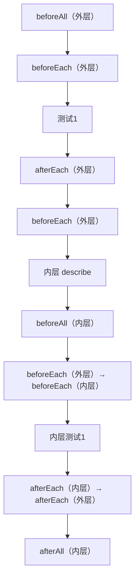

# Jest 基础

Jest 是 Facebook 开源的 JavaScript 测试框架，以"零配置"著称，内置断言、Mock、覆盖率报告等功能，是 React 生态的默认测试工具。

```mermaid
mindmap
  root((Jest))
    核心概念
      测试文件命名 *.test.js / *.spec.js
      describe 分组
      test/it 用例
      expect 断言
    匹配器 Matchers
      精确匹配 toBe / toEqual
      真值判断 toBeTruthy / toBeNull
      数字 toBeGreaterThan / toBeCloseTo
      字符串 toMatch / toContain
    生命周期 Hooks
      beforeAll / afterAll
      beforeEach / afterEach
    异步测试
      done 回调
      resolves / rejects
      async/await
    Mock
      jest.fn() 记录调用
      jest.spyOn() 监听
      jest.mock() 模块
      假定时器 jest.useFakeTimers()
    配置
      jest.config.js
      coverageThreshold
      transform
      moduleNameMapper
```

> 📊 Jest 知识体系思维导图：覆盖核心概念、匹配器、生命周期、异步测试、Mock 和配置六大板块。

## 1. 安装与初始化

### 基础安装

```bash
# 安装 Jest
npm install --save-dev jest

# 初始化配置文件
npx jest --init
# ✔ Would you like to use TypeScript? … No
# ✔ Choose the test environment? › jsdom
# ✔ Add coverage reports? … Yes
# ✔ Automatically clear mock calls? … Yes
```

### package.json 配置

```json
{
  "scripts": {
    "test": "jest",
    "test:watch": "jest --watch",
    "test:coverage": "jest --coverage",
    "test:ci": "jest --ci --coverage --maxWorkers=2"
  }
}
```

### jest.config.js 配置

```javascript
/** @type {import('jest').Config} */
module.exports = {
  // 测试环境
  testEnvironment: 'jsdom',             // 'node' | 'jsdom'（Jest 28+ 需单独安装 jest-environment-jsdom）

  // 测试文件匹配
  testMatch: [
    '**/__tests__/**/*.[jt]s?(x)',
    '**/?(*.)+(spec|test).[jt]s?(x)',
  ],

  // 模块路径映射
  moduleNameMapper: {
    '^@/(.*)$': '<rootDir>/src/$1',
    '\\.(css|less|scss)$': 'identity-obj-proxy',
  },

  // 自动清理 Mock
  clearMocks: true,
  restoreMocks: true,
}
```

## 2. 核心 API

### describe / test / it

```javascript
// describe：将相关测试分组
describe('Math 工具函数', () => {
  // test 或 it：编写单个测试用例
  test('add 函数应该正确相加两个数', () => {
    expect(add(1, 2)).toBe(3)
  })

  // it 是 test 的别名，语义上更好读
  it('应该处理负数', () => {
    expect(add(-1, 1)).toBe(0)
  })

  // 嵌套 describe
  describe('边界情况', () => {
    it('应该处理零值', () => {
      expect(add(0, 0)).toBe(0)
    })
  })
})
```

### expect 断言

`expect` 是 Jest 断言的入口，通过匹配器（Matchers）验证值是否符合预期。

```javascript
// 链式修饰符
expect(value).not.toBe(expected)           // 否定
expect(value).resolves.toBe(expected)      // Promise 成功
expect(value).rejects.toThrow(error)       // Promise 失败
```

## 3. 常用匹配器

### 精确匹配

```javascript
// toBe：使用 Object.is 严格相等（引用比较）
expect(1 + 1).toBe(2)
expect(null).toBe(null)

// toEqual：递归深度比较（值比较）
expect({ a: 1, b: [2, 3] }).toEqual({ a: 1, b: [2, 3] })
expect([1, 2, 3]).toEqual([1, 2, 3])

// toStrictEqual：更严格的深度比较
// 区别：忽略 undefined 属性、稀疏数组等
expect({ a: 1, b: undefined }).not.toStrictEqual({ a: 1 })
expect([, , 3]).not.toStrictEqual([undefined, undefined, 3])
```

### 真值判断

```javascript
expect(null).toBeNull()
expect(undefined).toBeUndefined()
expect('hello').toBeDefined()
expect(true).toBeTruthy()       // !!value === true
expect(0).toBeFalsy()           // !!value === false
expect(null).toBeFalsy()
expect('').toBeFalsy()
```

### 数字匹配

```javascript
expect(2 + 2).toBe(4)
expect(2 + 2).toBeGreaterThan(3)     // > 3
expect(2 + 2).toBeGreaterThanOrEqual(4)  // >= 4
expect(2 + 2).toBeLessThan(5)        // < 5
expect(2 + 2).toBeLessThanOrEqual(4)    // <= 4

// 浮点数：使用 toBeCloseTo 避免精度问题
expect(0.1 + 0.2).not.toBe(0.3)      // 0.30000000000000004
expect(0.1 + 0.2).toBeCloseTo(0.3)   // ✅ 正确的浮点数比较
```

### 字符串匹配

```javascript
expect('team').not.toMatch(/I/)
expect('Christoph').toMatch(/stop/)
expect('hello world').toContain('world')
```

### 数组与可迭代对象

```javascript
expect([1, 2, 3]).toContain(2)
expect([{ a: 1 }]).toContainEqual({ a: 1 })  // 深度比较
expect(new Set([1, 2, 3])).toContain(2)
```

### 异常匹配

```javascript
// 测试是否抛出异常
function compileAndroidCode() {
  throw new Error('you are using the wrong JDK')
}

expect(() => compileAndroidCode()).toThrow()
expect(() => compileAndroidCode()).toThrow(Error)
expect(() => compileAndroidCode()).toThrow('wrong JDK')
expect(() => compileAndroidCode()).toThrow(/wrong/)
```

### 快照匹配

```javascript
// 首次运行生成快照，后续运行对比差异
expect(generateConfig()).toMatchSnapshot()

// 行内快照（快照写在测试文件中）
expect(getUserDisplay(user)).toMatchInlineSnapshot(`
  "张三 (zhangsan@example.com)"
`)

// 属性快照
expect(user).toMatchSnapshot({
  createdAt: expect.any(Date),  // 动态值用 expect.any 匹配
  id: expect.any(String),
})
```

## 4. 生命周期钩子

```javascript
describe('数据库操作', () => {
  beforeAll(() => {
    // 所有测试之前执行一次（如：建立数据库连接）
    console.log('🔗 连接数据库')
  })

  afterAll(() => {
    // 所有测试之后执行一次（如：关闭数据库连接）
    console.log('🔗 断开数据库连接')
  })

  beforeEach(() => {
    // 每个测试之前执行（如：重置数据）
    console.log('🧹 清空测试数据')
  })

  afterEach(() => {
    // 每个测试之后执行（如：清理临时文件）
    console.log('🧹 清理临时文件')
  })

  test('测试1', () => { /* ... */ })
  test('测试2', () => { /* ... */ })
})
```

### 生命周期作用域



> 📊 图表解读：生命周期钩子的执行顺序遵循"由外到内、先 before 后 after"的规则。外层的 `beforeEach` 先于内层执行，内层的 `afterEach` 先于外层执行。

### 只运行/跳过测试

```javascript
// 只运行特定测试
test.only('这个测试必须通过', () => { /* ... */ })

// 跳过测试
test.skip('暂时跳过', () => { /* ... */ })
test.todo('待实现')

// 按条件跳过
const isCI = process.env.CI === 'true'
test.skipIf(isCI)('本地调试测试', () => { /* ... */ })
```

## 5. 异步测试

### 回调函数测试

```javascript
// ❌ 错误写法：Jest 不知道回调何时完成
test('回调函数', () => {
  fetchData((data) => {
    expect(data).toBe('peanut butter')  // 测试已结束，断言不会执行
  })
})

// ✅ 正确写法：使用 done 参数
test('回调函数', (done) => {
  function callback(data) {
    try {
      expect(data).toBe('peanut butter')
      done()
    } catch (error) {
      done(error)
    }
  }
  fetchData(callback)
})
```

### Promise 测试

```javascript
// 方式1：return Promise
test('Promise 数据', () => {
  return fetchData().then((data) => {
    expect(data).toBe('peanut butter')
  })
})

// 方式2：resolves / rejects 匹配器
test('Promise resolves', () => {
  return expect(fetchData()).resolves.toBe('peanut butter')
})

test('Promise rejects', () => {
  return expect(fetchData(false)).rejects.toThrow('error')
})
```

### async/await 测试

```javascript
test('async/await 数据', async () => {
  const data = await fetchData()
  expect(data).toBe('peanut butter')
})

test('async/await + resolves', async () => {
  await expect(fetchData()).resolves.toBe('peanut butter')
})
```

### 超时控制

```javascript
// 设置单个测试的超时时间（毫秒）
test('长时间操作', async () => {
  const data = await slowOperation()
  expect(data).toBeDefined()
}, 10000)  // 10 秒超时（默认 5 秒）

// 设置整个 describe 的超时时间
describe('慢速操作', () => {
  jest.setTimeout(30000)  // 30 秒

  test('操作1', async () => { /* ... */ })
  test('操作2', async () => { /* ... */ })
})
```

## 6. Mock 函数

### jest.fn() — 创建 Mock 函数

```javascript
const mockCallback = jest.fn()

// 调用 Mock 函数
mockCallback('hello')
mockCallback('world')

// 断言调用次数
expect(mockCallback).toHaveBeenCalledTimes(2)

// 断言调用参数
expect(mockCallback).toHaveBeenNthCalledWith(1, 'hello')
expect(mockCallback).toHaveBeenNthCalledWith(2, 'world')

// 断言最后一次调用
expect(mockCallback).toHaveBeenLastCalledWith('world')

// 自定义返回值
const mockFn = jest.fn()
  .mockReturnValueOnce('first')
  .mockReturnValueOnce('second')
  .mockReturnValue('default')

console.log(mockFn())  // 'first'
console.log(mockFn())  // 'second'
console.log(mockFn())  // 'default'
console.log(mockFn())  // 'default'
```

### jest.spyOn() — 监听函数调用

```javascript
const video = {
  play() { return true },
  pause() { return true },
}

// 监听但保留原实现
const spy = jest.spyOn(video, 'play')
video.play()
expect(spy).toHaveBeenCalled()

// 监听并替换实现
jest.spyOn(video, 'pause').mockImplementation(() => false)
expect(video.pause()).toBe(false)

// 恢复原实现
spy.mockRestore()
```

### jest.mock() — 模块 Mock

```javascript
// 自动 Mock 整个模块
jest.mock('./utils')
const utils = require('./utils')
utils.formatDate.mockReturnValue('2024-01-01')

// 手动 Mock 模块
jest.mock('./api', () => ({
  fetchUser: jest.fn().mockResolvedValue({ name: 'Test User' }),
  fetchPosts: jest.fn().mockResolvedValue([]),
}))

// Mock 构造函数
jest.mock('./Logger', () => {
  return class Logger {
    log = jest.fn()
    error = jest.fn()
  }
})
```

### __mocks__ 目录

```
src/
├── __mocks__/
│   ├── fs.js              # 自动 Mock Node.js 内置模块
│   └── api.js             # Mock 项目模块
├── api.js                 # 实际模块
└── __tests__/
    └── api.test.js
```

```javascript
// __mocks__/fs.js
module.exports = {
  readFileSync: jest.fn(() => 'mocked file content'),
  writeFileSync: jest.fn(),
  existsSync: jest.fn(() => true),
}

// 测试文件中
jest.mock('fs')  // 自动使用 __mocks__/fs.js
const fs = require('fs')

test('读取文件', () => {
  expect(fs.readFileSync('/path/to/file')).toBe('mocked file content')
})
```

### 定时器 Mock

```javascript
// 使用假定时器
jest.useFakeTimers()

test('防抖函数', () => {
  const fn = jest.fn()
  const debounced = debounce(fn, 1000)

  // 多次调用
  debounced()
  debounced()
  debounced()

  // 不应该立即执行
  expect(fn).not.toHaveBeenCalled()

  // 快进时间
  jest.advanceTimersByTime(1000)
  expect(fn).toHaveBeenCalledTimes(1)

  // 或者快进所有定时器
  // jest.runAllTimers()
})

afterEach(() => {
  jest.useRealTimers()  // 恢复真实定时器
})
```

## 7. 覆盖率

### 查看覆盖率

```bash
npm run test:coverage
```

### 覆盖率指标

| 指标 | 英文 | 含义 |
|------|------|------|
| **行覆盖率** | Line Coverage | 已执行的代码行占比 |
| **分支覆盖率** | Branch Coverage | if/else 分支已执行的占比 |
| **函数覆盖率** | Function Coverage | 已调用的函数占比 |
| **语句覆盖率** | Statement Coverage | 已执行的语句占比 |

### 覆盖率阈值配置

```javascript
// jest.config.js
coverageThreshold: {
  global: {
    branches: 70,    // 分支覆盖率 ≥ 70%
    functions: 80,   // 函数覆盖率 ≥ 80%
    lines: 80,       // 行覆盖率 ≥ 80%
    statements: 80,  // 语句覆盖率 ≥ 80%
  },
  // 针对特定文件设置更高阈值
  './src/utils/': {
    branches: 100,
    statements: 100,
  },
}
```

> 💡 覆盖率不是越高越好。追求 100% 覆盖率会导致过度 Mock 和脆弱测试。一般 70-80% 是合理的阈值，核心模块可以要求更高。

## 8. 常见问题与解决方案

### 问题1：import/export 语法报错

```bash
# 安装 Babel 依赖
npm install --save-dev @babel/core @babel/preset-env

# 配置 babel.config.js
```

```javascript
// babel.config.js
module.exports = {
  presets: [
    ['@babel/preset-env', { targets: { node: 'current' } }],
  ],
}
```

### 问题2：ESM 模块 Mock 失败

```javascript
// ESM 模块需要使用 jest.unstable_mockModule
jest.unstable_mockModule('./api', () => ({
  fetchUser: jest.fn().mockResolvedValue({ name: 'Test' }),
}))

const { fetchUser } = await import('./api')
```

### 问题3：动态 import 测试

```javascript
test('动态 import', async () => {
  const module = await import('./heavy-module')
  expect(module.default).toBeDefined()
})
```

### 问题4：测试数据库操作

```javascript
// 使用 beforeAll 初始化，afterAll 清理
describe('用户 API', () => {
  let connection

  beforeAll(async () => {
    connection = await createConnection({
      type: 'sqlite',
      database: ':memory:',  // 内存数据库，测试后自动清理
    })
  })

  afterAll(async () => {
    await connection.close()
  })

  test('创建用户', async () => {
    const user = await createUser({ name: 'Test' })
    expect(user.id).toBeDefined()
  })
})
```
