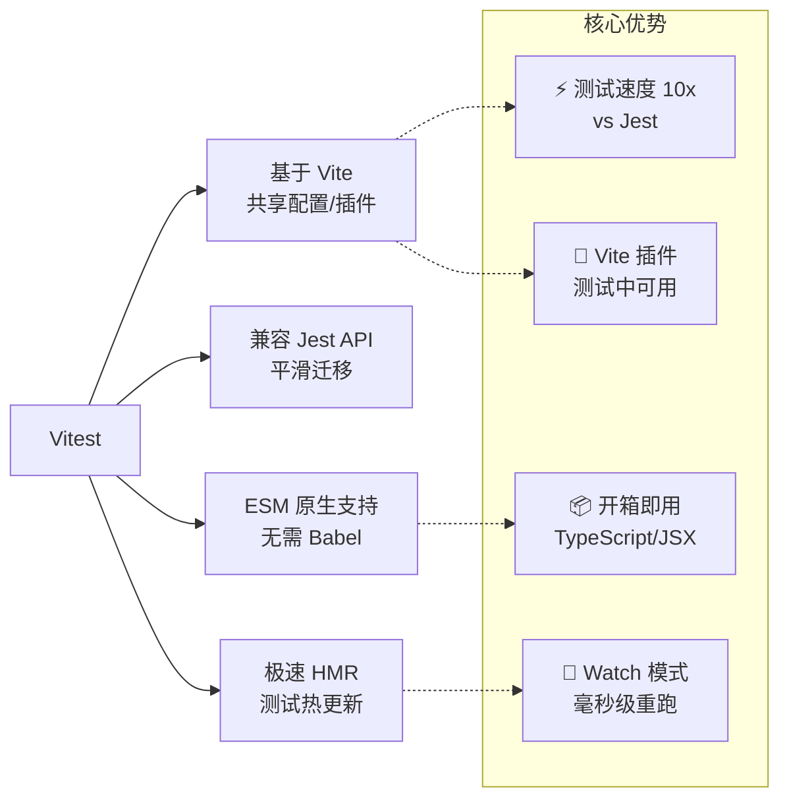
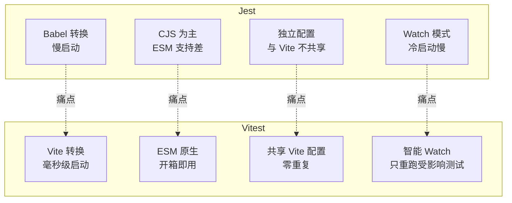

# Vitest 现代测试

Vitest 是基于 Vite 的下一代测试框架，与 Vite 共享配置和插件，提供极速的测试体验。它兼容 Jest API，是 Vite 项目的首选测试方案。



> 📊 图表解读：Vitest 的核心竞争力是与 Vite 生态的深度融合。共享配置意味着不再需要维护两套转换规则（Babel for Jest + Vite for dev），极大降低了配置成本。

## 1. 安装与配置

### 安装

```bash
npm install --save-dev vitest
```

### vitest.config.ts 配置

```typescript
import { defineConfig } from 'vitest/config'

export default defineConfig({
  test: {
    // 测试环境
    environment: 'jsdom',            // 'node' | 'jsdom' | 'happy-dom'

    // 全局 API（不用每次 import { describe, it, expect }）
    globals: true,

    // 覆盖率配置
    coverage: {
      provider: 'v8',                // 或 'istanbul'（需安装对应 provider 包）
      reporter: ['text', 'json', 'html'],
      thresholds: {
        lines: 80,
        functions: 80,
        branches: 70,
        statements: 80,
      },
    },

    // 测试超时（毫秒，默认 5000）
    testTimeout: 10000,

    // Watch 模式配置
    watch: false,
  },
})
```

### package.json 脚本

```json
{
  "scripts": {
    "test": "vitest run",
    "test:watch": "vitest",
    "test:coverage": "vitest run --coverage",
    "test:ui": "vitest --ui"
  }
}
```

### 与 Vite 共享配置

```typescript
// vite.config.ts
import { defineConfig } from 'vite'
import react from '@vitejs/plugin-react'
import path from 'path'

export default defineConfig({
  plugins: [react()],
  resolve: {
    alias: {
      '@': path.resolve(__dirname, './src'),
    },
  },
  // Vitest 会读取这个配置，无需重复
  test: {
    environment: 'jsdom',
    globals: true,
    setupFiles: './src/test/setup.ts',
  },
})
```

> 💡 关键：Vitest 直接复用 `vite.config.ts` 的配置（别名、插件、环境变量等），不需要像 Jest 那样维护独立的 `jest.config.js` + `babel.config.js`。

## 2. 核心特性

### 与 Jest API 兼容

Vitest 兼容大部分 Jest API，迁移成本低：

| Jest API | Vitest 支持 | 差异 |
|----------|:-----------:|------|
| `describe` / `test` / `it` | ✅ | — |
| `expect` + 匹配器 | ✅ | — |
| `jest.fn()` | ✅ → `vi.fn()` | 前缀改为 `vi` |
| `jest.spyOn()` | ✅ → `vi.spyOn()` | — |
| `jest.mock()` | ✅ → `vi.mock()` | — |
| `beforeEach` / `afterEach` | ✅ | — |
| `jest.useFakeTimers()` | ✅ → `vi.useFakeTimers()` | — |
| `toMatchSnapshot()` | ✅ | — |

### ESM 原生支持

```typescript
// 直接使用 ESM，无需 Babel 转换
import { describe, it, expect, vi } from 'vitest'
import { formatPrice } from '@/utils/format'

describe('formatPrice', () => {
  it('格式化价格', () => {
    expect(formatPrice(1234.5)).toBe('¥1,234.50')
  })
})
```

### 组件测试（Vue 示例）

```typescript
import { describe, it, expect } from 'vitest'
import { mount } from '@vue/test-utils'
import Counter from '@/components/Counter.vue'

describe('Counter', () => {
  it('点击按钮增加计数', async () => {
    const wrapper = mount(Counter)
    expect(wrapper.text()).toContain('0')

    await wrapper.find('button').trigger('click')
    expect(wrapper.text()).toContain('1')
  })
})
```

### 组件测试（React 示例）

```typescript
import { describe, it, expect } from 'vitest'
import { render, screen, fireEvent } from '@testing-library/react'
import Counter from '@/components/Counter'

describe('Counter', () => {
  it('点击按钮增加计数', async () => {
    render(<Counter />)
    expect(screen.getByText('0')).toBeDefined()

    fireEvent.click(screen.getByRole('button'))
    expect(screen.getByText('1')).toBeDefined()
  })
})
```

## 3. Vitest vs Jest 对比



### 性能对比

> 注：下表数值为社区测试的示意参考，实际表现因项目规模、机器与配置而异。

| 场景 | Jest | Vitest | 提升 |
|------|------|--------|------|
| 冷启动（100 个测试文件） | ~8s | ~1s | 8x |
| Watch 热更新 | ~5s | ~200ms | 25x |
| TypeScript 支持 | 需 ts-jest（慢） | 原生（快） | 5-10x |
| ESM 模块 Mock | 复杂 | 原生 | — |

### 功能对比

| 功能 | Jest | Vitest |
|------|------|--------|
| 开箱 TypeScript | ❌ 需 ts-jest | ✅ 原生 |
| ESM 模块 Mock | ❌ `unstable_mockModule` | ✅ `vi.mock` |
| 测试 UI | ❌ 需第三方 | ✅ `vitest --ui` |
| In-source 测试 | ❌ | ✅ |
| Benchmark | ❌ | ✅ `bench()` |
| Workspace | ✅（`projects` 配置） | ✅ 多项目配置 |

## 4. Vitest 独有功能

### In-source Testing

在源文件中直接编写测试，适合工具函数和小型模块（需在配置中开启 `test.includeSource`）：

```typescript
// src/utils/format.ts
export function formatPrice(price: number): string {
  return `¥${price.toLocaleString('zh-CN', { minimumFractionDigits: 2 })}`
}

// Vitest In-source 测试（仅开发环境包含）
if (import.meta.vitest) {
  const { describe, it, expect } = import.meta.vitest
  describe('formatPrice', () => {
    it('格式化整数', () => {
      expect(formatPrice(1000)).toBe('¥1,000.00')
    })
    it('格式化小数', () => {
      expect(formatPrice(99.9)).toBe('¥99.90')
    })
  })
}
```

### Benchmark 基准测试

```typescript
import { describe, bench } from 'vitest'
import { quickSort } from './quick-sort'
import { mergeSort } from './merge-sort'

describe('排序算法性能', () => {
  const data = Array.from({ length: 10000 }, () => Math.random())

  bench('quickSort', () => {
    quickSort([...data])
  })

  bench('mergeSort', () => {
    mergeSort([...data])
  })
})
```

```bash
# 运行基准测试
vitest bench
```

### 测试 UI

```bash
# 启动测试 UI 界面
vitest --ui
```

提供可视化的测试结果、覆盖率、时间线等。

### Workspace 多项目配置

```typescript
// vitest.workspace.ts
import { defineWorkspace } from 'vitest/config'

export default defineWorkspace([
  // 前端项目
  {
    extends: './apps/web/vite.config.ts',
    test: {
      environment: 'jsdom',
      setupFiles: ['./apps/web/test/setup.ts'],
    },
  },
  // Node.js 后端
  {
    extends: './apps/server/vite.config.ts',
    test: {
      environment: 'node',
    },
  },
  // 共享库
  {
    extends: './packages/shared/vite.config.ts',
    test: {
      environment: 'node',
    },
  },
])
```

## 5. 从 Jest 迁移

### 快速迁移步骤

```bash
# 1. 安装 Vitest
npm install --save-dev vitest

# 2. 替换 jest 为 vitest
# jest.fn() → vi.fn()
# jest.spyOn() → vi.spyOn()
# jest.mock() → vi.mock()
# jest.useFakeTimers() → vi.useFakeTimers()
```

### 迁移辅助

```bash
# Vitest 官方未提供迁移 codemod，官方迁移指南为逐项手动清单：
# https://vitest.dev/guide/migration/jest
# 社区第三方 codemod（非官方，可选）：npx jest-to-vitest
```

### 手动迁移清单

| 步骤 | 操作 |
|------|------|
| 1 | 将 `jest.config.js` 配置迁移到 `vitest.config.ts` |
| 2 | `jest.fn()` → `vi.fn()`，`jest.mock()` → `vi.mock()` |
| 3 | 删除 `babel-jest` / `ts-jest` 依赖 |
| 4 | 删除 `babel.config.js` 中 Jest 相关配置 |
| 5 | 模块 Mock 使用 ESM `import` 方式 |
| 6 | 快照文件格式可能略有差异，运行 `vitest -u` 更新 |

### 模块 Mock 迁移

```typescript
// Jest 写法
jest.mock('./api', () => ({
  fetchUser: jest.fn().mockResolvedValue({ name: 'Test' }),
}))

// Vitest 写法
vi.mock('./api', () => ({
  fetchUser: vi.fn().mockResolvedValue({ name: 'Test' }),
}))

// Vitest ESM 写法（更推荐）
import { vi } from 'vitest'

vi.mock('./api', async (importOriginal) => {
  const actual = await importOriginal<typeof import('./api')>()
  return {
    ...actual,  // 保留其他导出
    fetchUser: vi.fn().mockResolvedValue({ name: 'Test' }),
  }
})
```

## 6. 最佳实践

### setup 文件

```typescript
// src/test/setup.ts
import { vi } from 'vitest'

// Mock IntersectionObserver
class MockIntersectionObserver {
  observe = vi.fn()
  unobserve = vi.fn()
  disconnect = vi.fn()
}
window.IntersectionObserver = MockIntersectionObserver as any

// Mock matchMedia
Object.defineProperty(window, 'matchMedia', {
  writable: true,
  value: vi.fn().mockImplementation((query: string) => ({
    matches: false,
    media: query,
    onchange: null,
    addListener: vi.fn(),
    removeListener: vi.fn(),
    addEventListener: vi.fn(),
    removeEventListener: vi.fn(),
    dispatchEvent: vi.fn(),
  })),
})

// Mock localStorage
const localStorageMock = (() => {
  let store: Record<string, string> = {}
  return {
    getItem: vi.fn((key: string) => store[key] ?? null),
    setItem: vi.fn((key: string, value: string) => { store[key] = value }),
    removeItem: vi.fn((key: string) => { delete store[key] }),
    clear: vi.fn(() => { store = {} }),
  }
})()
Object.defineProperty(window, 'localStorage', { value: localStorageMock })
```

### 测试文件组织

```
src/
├── components/
│   ├── Button.tsx
│   └── Button.test.ts        # 就近放置测试文件
├── utils/
│   ├── format.ts
│   └── format.test.ts
└── test/
    ├── setup.ts              # 全局 setup
    └── helpers.ts            # 测试工具函数
```

> 💡 就近放置测试文件比集中放在 `__tests__` 目录更容易维护——改代码时能立即看到对应的测试。
