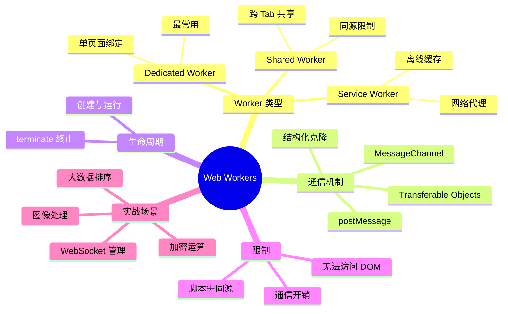
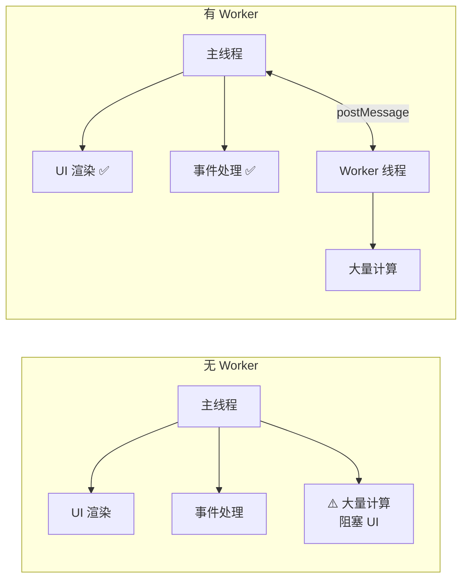
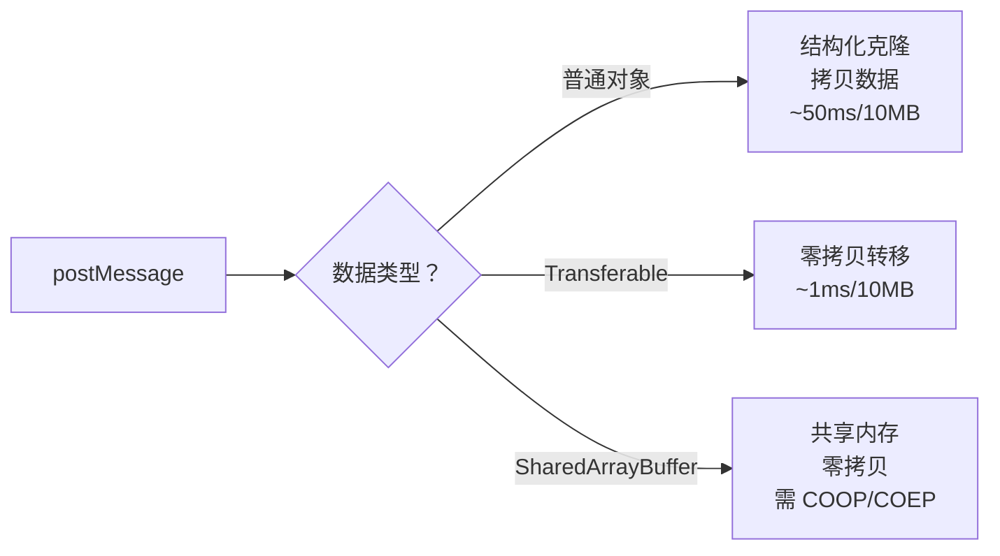

# Web Workers 基础

Web Workers 允许在后台线程中运行 JavaScript，不阻塞主线程的 UI 渲染。这是处理计算密集型任务（如大数据排序、图像处理、加密运算）的核心方案。



> 📊 Web Workers 知识体系思维导图：覆盖类型、通信、生命周期、限制和实战场景。

## 1. 为什么需要 Web Workers

JavaScript 是单线程语言，所有任务（DOM 渲染、事件处理、网络请求、计算）都在主线程执行。当计算密集型任务占用主线程时，UI 会冻结——用户无法点击、滚动或输入。



> 📊 图表解读：Worker 将计算任务移到独立线程，主线程保持流畅。两者通过 `postMessage` 通信，数据通过结构化克隆算法传递。

### 主线程阻塞示例

```javascript
// ❌ 主线程执行大量计算 → UI 冻结
function heavySort(data) {
  return data.sort((a, b) => {
    // 复杂比较逻辑...
    return a.value - b.value
  })
}

// 100 万条数据排序可能耗时数秒
const result = heavySort(bigData)  // 页面在此期间完全冻结

// ✅ 使用 Worker → UI 保持流畅
const worker = new Worker('./sort-worker.js')
worker.postMessage(bigData)
worker.onmessage = (e) => {
  const result = e.data  // 排序完成后接收结果
  renderResult(result)
}
```

## 2. Dedicated Worker

Dedicated Worker 是最常用的 Worker 类型，与创建它的页面一对一绑定。

### 创建与通信

```javascript
// 主线程：main.js
const worker = new Worker('./worker.js', {
  type: 'module',    // 支持 ESM import（现代浏览器）
  name: 'sort-worker',  // Worker 名称（调试用）
})

// 发送消息
worker.postMessage({ type: 'sort', data: [5, 3, 1, 4, 2] })

// 接收消息
worker.onmessage = (event) => {
  console.log('排序结果:', event.data)
  // { type: 'sorted', data: [1, 2, 3, 4, 5] }
}

// 错误处理
worker.onerror = (error) => {
  console.error('Worker 错误:', error.message)
}

// 终止 Worker
worker.terminate()  // 立即停止，不可恢复
```

```javascript
// Worker 线程：worker.js
// 接收消息
self.onmessage = (event) => {
  const { type, data } = event.data

  if (type === 'sort') {
    const sorted = data.sort((a, b) => a - b)
    // 发送结果
    self.postMessage({ type: 'sorted', data: sorted })
  }
}

// Worker 内部全局对象是 self（注意并非 window，无 DOM 相关 API）
console.log(self)  // DedicatedWorkerGlobalScope
```

### ESM Worker

```javascript
// Worker 线程：sort-worker.js（ESM 模块）
import { quickSort } from './utils/sort.js'

self.onmessage = (event) => {
  const result = quickSort(event.data)
  self.postMessage(result)
}
```

```javascript
// 主线程：使用 type: 'module' 加载 ESM Worker
const worker = new Worker('./sort-worker.js', { type: 'module' })
```

### Transferable Objects

大数据传输时，使用 Transferable Objects 可以避免结构化克隆的开销——数据直接"转移"所有权，零拷贝：

```javascript
// ❌ 普通传输：结构化克隆（拷贝数据）
const buffer = new ArrayBuffer(1024 * 1024 * 10)  // 10MB
worker.postMessage(buffer)  // 拷贝 10MB，耗时约 50ms

// ✅ Transferable 传输：零拷贝
worker.postMessage(buffer, [buffer])  // 转移所有权，耗时约 1ms
// 注意：转移后主线程不能再访问 buffer

// 常见 Transferable 类型
// - ArrayBuffer
// - MessagePort
// - ImageBitmap
// - OffscreenCanvas
// - ReadableStream / WritableStream
```

### MessageChannel 双向通信

```javascript
// 创建双向通信通道
const channel = new MessageChannel()

// 主线程使用 port1
channel.port1.onmessage = (event) => {
  console.log('收到 Worker 回复:', event.data)
}

// 将 port2 传给 Worker
worker.postMessage({ type: 'init', port: channel.port2 }, [channel.port2])

// Worker 端
self.onmessage = (event) => {
  if (event.data.type === 'init') {
    const port = event.data.port
    port.onmessage = (e) => {
      // 通过 port 回复
      port.postMessage({ result: '处理完成' })
    }
  }
}
```

## 3. Shared Worker

Shared Worker 可以被多个页面（同源）共享，适合跨 Tab 通信场景。

```javascript
// 多个页面共享同一个 Worker
const worker = new SharedWorker('./shared-worker.js')
worker.port.start()  // 启动端口

worker.port.onmessage = (event) => {
  console.log('收到消息:', event.data)
}

worker.port.postMessage({ type: 'join', tabId: tabId })
```

```javascript
// Shared Worker：shared-worker.js
const connections = []

self.onconnect = (event) => {
  const port = event.ports[0]
  connections.push(port)

  port.onmessage = (e) => {
    // 广播给所有连接的页面
    connections.forEach((conn) => {
      if (conn !== port) {
        conn.postMessage(e.data)
      }
    })
  }

  port.start()
}
```

> 💡 Shared Worker 的限制：所有连接页面必须同源（相同协议、域名、端口）。IE 不支持。

## 4. Worker 中的限制

Worker 线程无法访问以下 API：

| 不可用 | 原因 |
|--------|------|
| `document` | DOM 操作只能在主线程 |
| `window` | Worker 有独立的 `self` |
| `localStorage` / `sessionStorage` | Worker 环境未提供（主线程专属的同步存储 API） |
| `alert` / `confirm` / `prompt` | UI 交互 API 不可用 |

**可用的能力：**

| 可用 | 说明 |
|------|------|
| `fetch` / `XMLHttpRequest` | 网络请求 |
| `setTimeout` / `setInterval` | 定时器 |
| `indexedDB` | 异步存储 |
| `WebSocket` | 长连接 |
| `navigator.hardwareConcurrency` | CPU 核心数 |
| `import` | ESM 导入（Module Worker） |

## 5. 实战场景

### 大数据排序

```
// sort-worker.js
self.onmessage = (event) => {
  const { data, algorithm } = event.data

  const start = performance.now()
  let result

  switch (algorithm) {
    case 'quick':
      result = quickSort(data)
      break
    case 'merge':
      result = mergeSort(data)
      break
    default:
      result = data.sort((a, b) => a - b)
  }

  const duration = performance.now() - start

  self.postMessage({
    result,
    duration,
    algorithm,
    count: data.length,
  })
}

function quickSort(arr) {
  if (arr.length <= 1) return arr
  const pivot = arr[Math.floor(arr.length / 2)]
  const left = arr.filter(x => x < pivot)
  const middle = arr.filter(x => x === pivot)
  const right = arr.filter(x => x > pivot)
  return [...quickSort(left), ...middle, ...quickSort(right)]
}
```

```javascript
// 主线程
const worker = new Worker('./sort-worker.js')

function sortData(data, algorithm = 'quick') {
  return new Promise((resolve) => {
    worker.onmessage = (e) => resolve(e.data)
    worker.postMessage({ data, algorithm })
  })
}

// 使用
const bigData = Array.from({ length: 1000000 }, () => Math.random())
const result = await sortData(bigData, 'quick')
console.log(`排序耗时: ${result.duration}ms`)
```

### 图像处理（OffscreenCanvas）

```javascript
// image-worker.js
self.onmessage = (event) => {
  const { imageData, filter } = event.data
  const canvas = new OffscreenCanvas(imageData.width, imageData.height)
  const ctx = canvas.getContext('2d')

  ctx.putImageData(imageData, 0, 0)

  // 应用滤镜
  const filtered = applyFilter(ctx, imageData, filter)

  self.postMessage({ imageData: filtered }, [filtered.data.buffer])
}

function applyFilter(ctx, imageData, filter) {
  const data = imageData.data
  for (let i = 0; i < data.length; i += 4) {
    if (filter === 'grayscale') {
      const avg = (data[i] + data[i + 1] + data[i + 2]) / 3
      data[i] = data[i + 1] = data[i + 2] = avg
    } else if (filter === 'invert') {
      data[i] = 255 - data[i]
      data[i + 1] = 255 - data[i + 1]
      data[i + 2] = 255 - data[i + 2]
    }
  }
  return imageData
}
```

```javascript
// 主线程
const canvas = document.getElementById('canvas')
const ctx = canvas.getContext('2d')
const imageData = ctx.getImageData(0, 0, canvas.width, canvas.height)

const worker = new Worker('./image-worker.js')
worker.postMessage({ imageData, filter: 'grayscale' }, [imageData.data.buffer])

worker.onmessage = (e) => {
  ctx.putImageData(e.data.imageData, 0, 0)
}
```

### WebSocket 管理

```javascript
// ws-worker.js — 在 Worker 中管理 WebSocket
let ws = null
let reconnectAttempts = 0
const MAX_RECONNECT = 5

function connect(url) {
  ws = new WebSocket(url)

  ws.onopen = () => {
    reconnectAttempts = 0
    self.postMessage({ type: 'connected' })
  }

  ws.onmessage = (event) => {
    self.postMessage({ type: 'message', message: JSON.parse(event.data) })
  }

  ws.onclose = () => {
    // 指数退避重连
    if (reconnectAttempts < MAX_RECONNECT) {
      reconnectAttempts++
      setTimeout(() => connect(url), 1000 * reconnectAttempts)
    }
    self.postMessage({ type: 'disconnected' })
  }
}

self.onmessage = (event) => {
  const { type, url, message } = event.data

  if (type === 'connect') {
    connect(url)
  } else if (type === 'send') {
    ws?.send(JSON.stringify(message))
  }
}
```

## 6. 性能考量

### 通信开销



> 📊 图表解读：大数据传输应优先使用 Transferable Objects 或 SharedArrayBuffer。结构化克隆会拷贝整个数据，对大数组/大缓冲区开销显著。
>
> 注：文中出现的耗时数值（约 50ms、约 1ms、约 20ms 等）均为量级示意，实际因设备与数据而异，请以实测为准。

### Worker 创建时机

```javascript
// ❌ 每次操作都创建新 Worker（开销大）
function processData(data) {
  const worker = new Worker('./worker.js')  // 创建耗时约 20ms
  worker.postMessage(data)
  worker.onmessage = (e) => {
    worker.terminate()  // 销毁
    return e.data
  }
}

// ✅ 复用 Worker（推荐）
const worker = new Worker('./worker.js')  // 只创建一次

function processData(data) {
  return new Promise((resolve) => {
    worker.onmessage = (e) => resolve(e.data)
    worker.postMessage(data)
  })
}
```

### 何时使用 Worker

| 场景 | 是否需要 Worker | 原因 |
|------|:---:|------|
| 10ms 以内的计算 | ❌ | Worker 创建和通信开销更大 |
| 50ms 以内的计算 | ⚠️ | 视情况而定，可考虑分片 |
| 100ms+ 的计算 | ✅ | 明显阻塞主线程 |
| 大数据排序/搜索 | ✅ | 计算密集型 |
| 图像/视频处理 | ✅ | 数据量大 |
| 加密/哈希运算 | ✅ | 计算密集型 |
| 网络请求管理 | ✅ | 长连接、重连逻辑 |

> 💡 **经验法则**：如果操作耗时超过 50ms（一帧约 16.7ms，50ms 已接近三帧），就应该考虑使用 Worker。