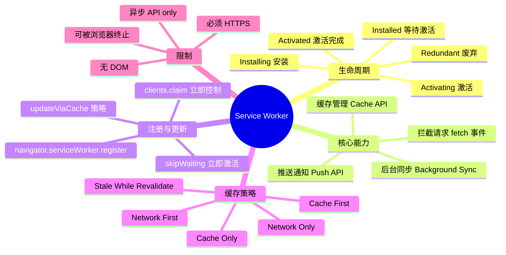
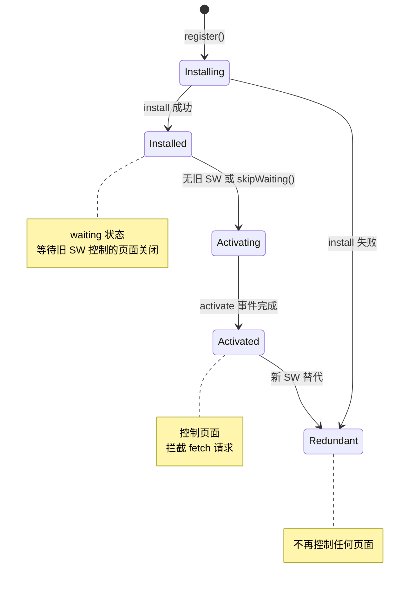
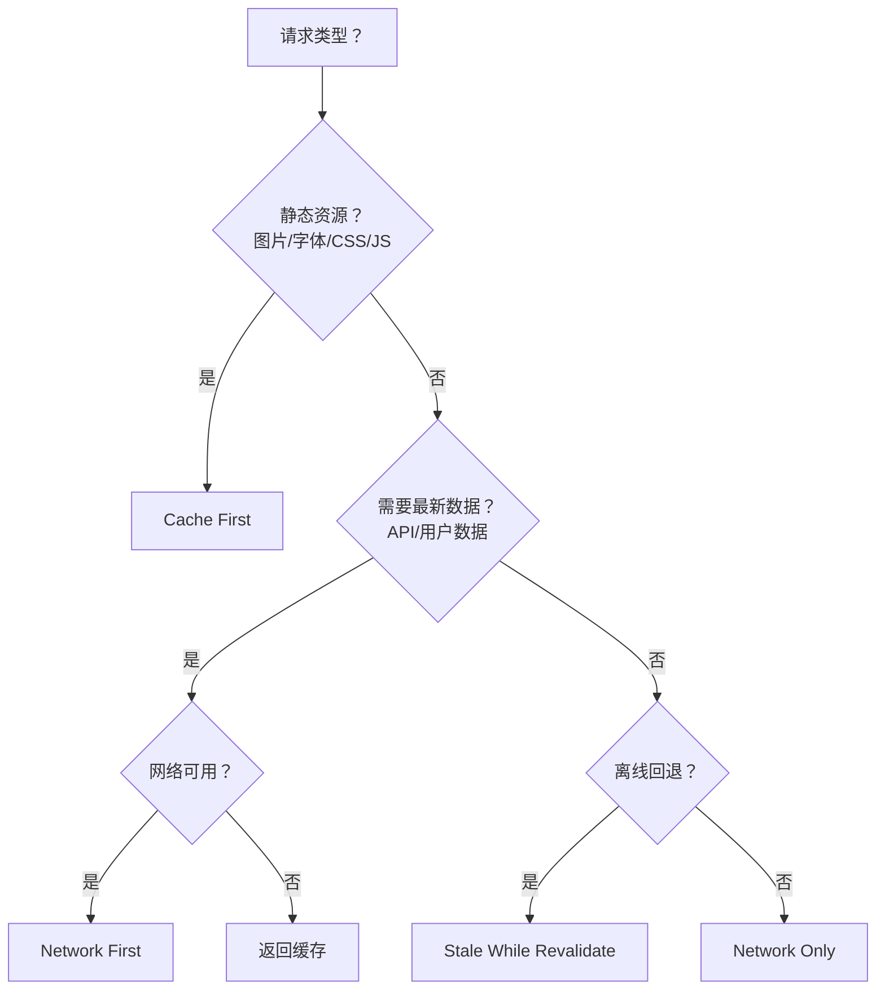

# Service Worker 详解

Service Worker 是浏览器和网络之间的代理层，可以拦截所有请求、管理缓存、处理推送通知。它是 PWA（Progressive Web App）的核心技术，赋予 Web 应用离线访问和原生级体验。



> 📊 Service Worker 知识体系思维导图：覆盖生命周期、核心能力、注册更新、缓存策略和限制。

## 1. Service Worker 生命周期



> 📊 图表解读：Service Worker 的生命周期是理解其行为的关键。`installed/waiting` 状态意味着新 SW 已安装但旧 SW 仍在控制页面，必须等旧页面关闭或调用 `skipWaiting()` 才能激活。

### 生命周期详解

```javascript
// sw.js — Service Worker 文件

// 1. Install 事件：首次注册或检测到新版本时触发
self.addEventListener('install', (event) => {
  console.log('SW 安装中...')
  // event.waitUntil() 确保 SW 在异步操作完成前不会进入下一状态
  event.waitUntil(
    caches.open('app-v1').then((cache) => {
      // 预缓存关键资源
      return cache.addAll([
        '/',
        '/index.html',
        '/styles/main.css',
        '/scripts/app.js',
      ])
    })
  )
})

// 2. Activate 事件：新 SW 激活，清理旧缓存
self.addEventListener('activate', (event) => {
  event.waitUntil(
    caches.keys().then((names) =>
      Promise.all(
        names
          .filter((name) => name !== 'app-v1')
          .map((name) => caches.delete(name))
      )
    )
  )
})

// 3. Fetch 事件：拦截请求
self.addEventListener('fetch', (event) => {
  event.respondWith(
    caches.match(event.request).then((cachedResponse) => {
      return cachedResponse || fetch(event.request)
    })
  )
})
```

## 2. 注册 Service Worker

```javascript
// 主线程：注册 Service Worker
if ('serviceWorker' in navigator) {
  window.addEventListener('load', async () => {
    try {
      const registration = await navigator.serviceWorker.register('/sw.js', {
        scope: '/',           // 控制范围（默认为 SW 文件所在目录）
        updateViaCache: 'none',  // 更新检查不使用 HTTP 缓存
      })

      console.log('SW 注册成功，scope:', registration.scope)

      // 监听更新
      registration.addEventListener('updatefound', () => {
        const newWorker = registration.installing
        newWorker?.addEventListener('statechange', () => {
          // installed 表示新 SW 安装完成，进入 waiting 状态
          if (newWorker.state === 'installed') {
            console.log('新版本已安装，等待激活')
          }
        })
      })
    } catch (error) {
      console.error('SW 注册失败:', error)
    }
  })
}
```

### 注册注意事项

| 注意点 | 说明 |
|--------|------|
| **HTTPS 必需** | Service Worker 只能在 HTTPS 或 localhost 下注册 |
| **scope 限制** | SW 只能控制 scope 范围内的页面 |
| **文件位置** | SW 文件通常放在根目录，以获得最大的 scope |
| **更新机制** | 浏览器会在导航、push/sync 事件时检查 SW 更新 |
| **字节差异** | 只要 SW 文件有 1 字节差异就会触发更新流程 |

## 3. Cache API

Cache API 是 Service Worker 管理缓存的核心接口，独立于 HTTP 缓存。

### 基本操作

```javascript
// 打开缓存
const cache = await caches.open('app-v1')

// 添加资源（请求 → 获取响应 → 缓存）
await cache.add('/index.html')                         // 单个 URL
await cache.addAll(['/style.css', '/app.js'])          // 批量添加

// 手动添加（自定义请求和响应）
await cache.put('/api/data', new Response(JSON.stringify({ hello: 'world' }), {
  headers: { 'Content-Type': 'application/json' },
}))

// 查询缓存
const response = await cache.match('/index.html')      // 单个匹配
const responses = await caches.match(request)           // 查询所有缓存

// 删除缓存
await cache.delete('/old-page.html')                    // 删除条目
await caches.delete('app-v0')                           // 删除整个缓存

// 查看所有缓存
const cacheNames = await caches.keys()                  // ['app-v1', 'app-v2']
```

### 缓存版本管理

```javascript
const CACHE_NAME = 'app-v2'
const CACHE_URLS = [
  '/',
  '/index.html',
  '/styles/main.css',
  '/scripts/app.js',
]

self.addEventListener('install', (event) => {
  event.waitUntil(
    caches.open(CACHE_NAME).then((cache) => cache.addAll(CACHE_URLS))
  )
})

self.addEventListener('activate', (event) => {
  event.waitUntil(
    caches.keys().then((names) =>
      Promise.all(
        names
          .filter((name) => name !== CACHE_NAME)
          .map((name) => caches.delete(name))
      )
    )
  )
})
```

## 4. 请求拦截策略

Service Worker 最强大的能力是拦截 fetch 请求并自定义响应。

### Cache First（缓存优先）

```javascript
// 适用于不常变化的静态资源（图片、字体、CSS/JS）
self.addEventListener('fetch', (event) => {
  event.respondWith(
    caches.match(event.request).then((cached) => {
      return cached || fetch(event.request).then((response) => {
        // 网络获取成功后缓存
        const clone = response.clone()
        caches.open('app-v1').then((cache) => cache.put(event.request, clone))
        return response
      })
    })
  )
})
```

### Network First（网络优先）

```javascript
// 适用于需要最新数据的请求（API、HTML）
self.addEventListener('fetch', (event) => {
  event.respondWith(
    fetch(event.request)
      .then((response) => {
        // 网络成功，更新缓存
        const clone = response.clone()
        caches.open('app-v1').then((cache) => cache.put(event.request, clone))
        return response
      })
      .catch(() => {
        // 网络失败，返回缓存
        return caches.match(event.request)
      })
  )
})
```

### Stale While Revalidate（后台更新）

```javascript
// 适用于对实时性要求不高但需快速响应的请求
self.addEventListener('fetch', (event) => {
  event.respondWith(
    caches.match(event.request).then((cached) => {
      // 先返回缓存（如果有的话）
      const fetchPromise = fetch(event.request).then((response) => {
        // 后台更新缓存
        const clone = response.clone()
        caches.open('app-v1').then((cache) => cache.put(event.request, clone))
        return response
      })

      return cached || fetchPromise
    })
  )
})
```

### 策略选择决策



### 综合路由策略

```javascript
// sw.js — 综合策略路由
const CACHE_NAME = 'app-v1'

self.addEventListener('fetch', (event) => {
  const { request } = event
  const url = new URL(request.url)

  // 只处理同源请求
  if (url.origin !== location.origin) return

  // HTML 页面：Network First，失败时回退离线页
  if (request.headers.get('accept')?.includes('text/html')) {
    event.respondWith(
      fetch(request)
        .then((response) => {
          const clone = response.clone()
          caches.open(CACHE_NAME).then((c) => c.put(request, clone))
          return response
        })
        .catch(() =>
          caches
            .match(request)
            .then((cached) => cached || caches.match('/offline.html'))
        )
    )
    return
  }

  // 静态资源：Cache First
  if (/\.(css|js|png|jpg|jpeg|svg|gif|webp|woff2?)$/.test(url.pathname)) {
    event.respondWith(
      caches.match(request).then((cached) => {
        return cached || fetch(request).then((response) => {
          const clone = response.clone()
          caches.open(CACHE_NAME).then((c) => c.put(request, clone))
          return response
        })
      })
    )
    return
  }

  // 其他请求：Stale While Revalidate
  event.respondWith(staleWhileRevalidate(request))
})

function staleWhileRevalidate(request) {
  return caches.match(request).then((cached) => {
    const fetchPromise = fetch(request)
      .then((response) => {
        const clone = response.clone()
        caches.open(CACHE_NAME).then((c) => c.put(request, clone))
        return response
      })
      .catch(() => cached)

    return cached || fetchPromise
  })
}
```

## 5. 离线页面

```javascript
// install 时缓存离线页面
self.addEventListener('install', (event) => {
  event.waitUntil(
    caches.open(CACHE_NAME).then((cache) => {
      return cache.addAll([
        '/',
        '/offline.html',
        '/styles/offline.css',
      ])
    })
  )
})

// 网络不可用时返回离线页面
self.addEventListener('fetch', (event) => {
  if (event.request.mode === 'navigate') {
    event.respondWith(
      fetch(event.request).catch(() =>
        caches.match('/offline.html')
      )
    )
  }
})
```

## 6. 更新策略

### skipWaiting + clients.claim

```javascript
// sw.js
self.addEventListener('install', (event) => {
  // 跳过等待，立即激活（注意：可能导致新旧版本不兼容）
  self.skipWaiting()
})

self.addEventListener('activate', (event) => {
  // 立即控制所有页面
  event.waitUntil(self.clients.claim())
})
```

### 优雅更新提示

```javascript
// 主线程：检测到新版本后提示用户
navigator.serviceWorker.addEventListener('controllerchange', () => {
  // 新 SW 已控制页面
  window.location.reload()  // 刷新以使用新版本
})

// 监听 SW 更新
const registration = await navigator.serviceWorker.getRegistration()
if (registration?.waiting) {
  // 新版本等待中，提示用户
  showUpdateBanner()
}

function showUpdateBanner() {
  const banner = document.createElement('div')
  banner.innerHTML = `
    <p>新版本可用！</p>
    <button id="update-btn">立即更新</button>
  `
  document.body.appendChild(banner)

  document.getElementById('update-btn').addEventListener('click', async () => {
    const reg = await navigator.serviceWorker.getRegistration()
    if (reg?.waiting) {
      reg.waiting.postMessage({ type: 'SKIP_WAITING' })
    }
  })
}
```

```javascript
// sw.js：接收消息
self.addEventListener('message', (event) => {
  if (event.data?.type === 'SKIP_WAITING') {
    self.skipWaiting()
  }
})
```

## 7. 调试技巧

### Chrome DevTools

| 面板 | 位置 | 用途 |
|------|------|------|
| Application → Service Workers | 查看 SW 状态 | 注册/更新/注销 |
| Application → Cache Storage | 查看缓存内容 | 检查缓存条目 |
| Network → Service Worker 列 | 查看请求是否被拦截 | 分析缓存策略 |
| Application → Service Workers → Update on reload | 每次刷新时更新 SW | 开发调试 |

### 常见问题

| 问题 | 原因 | 解决方案 |
|------|------|----------|
| SW 更新不生效 | 浏览器缓存了旧 SW 文件 | 勾选 "Update on reload" |
| 缓存策略不生效 | SW scope 不匹配 | 确保 SW 文件在正确位置 |
| 离线页面空白 | 未缓存离线页面 | install 时预缓存 `/offline.html` |
| 新旧版本冲突 | skipWaiting + 旧缓存 | activate 时清理旧缓存 |
| SW 未注册 | 非 HTTPS 环境 | 使用 localhost 或部署 HTTPS |
