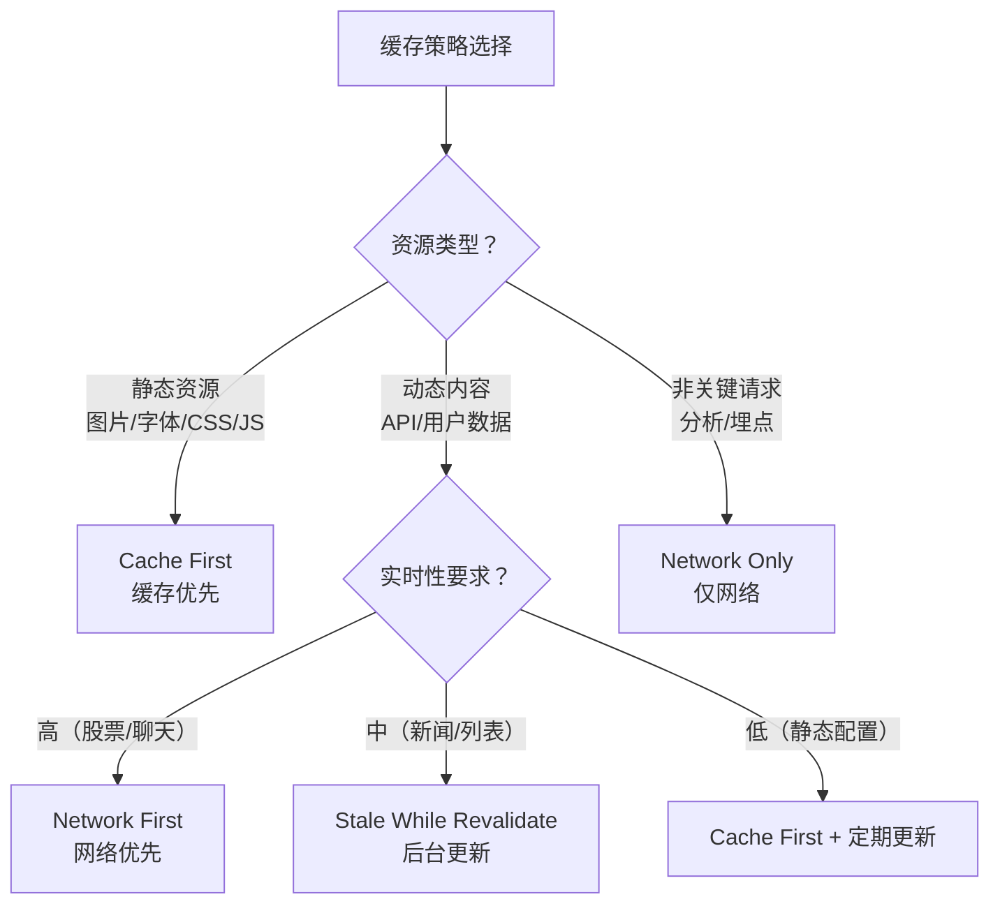
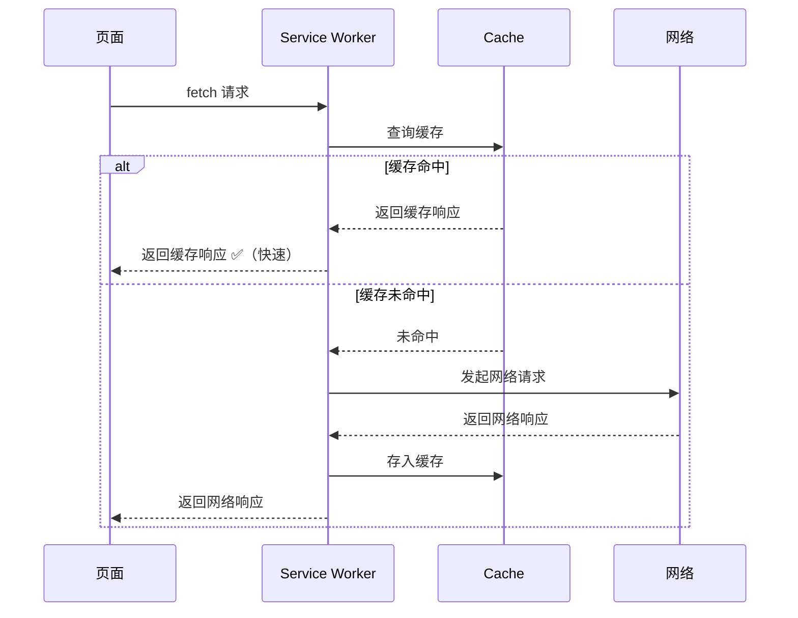
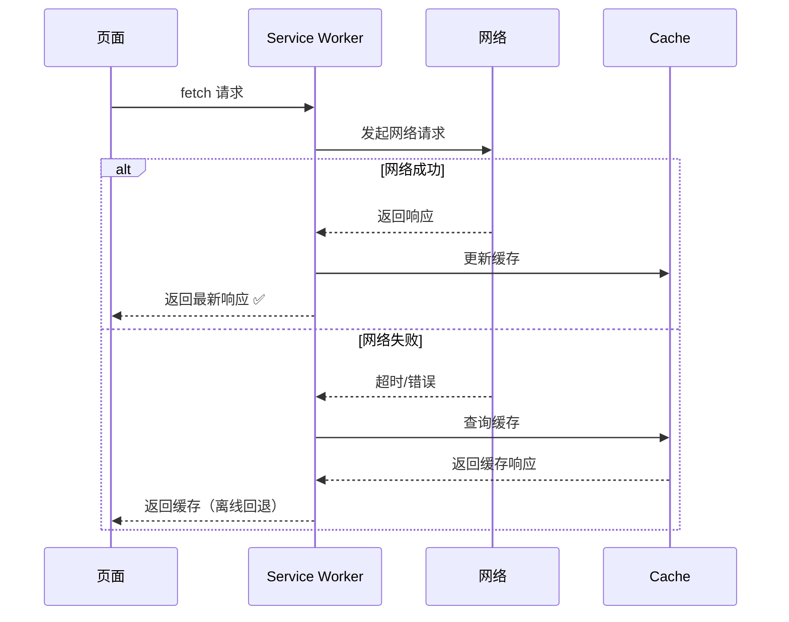
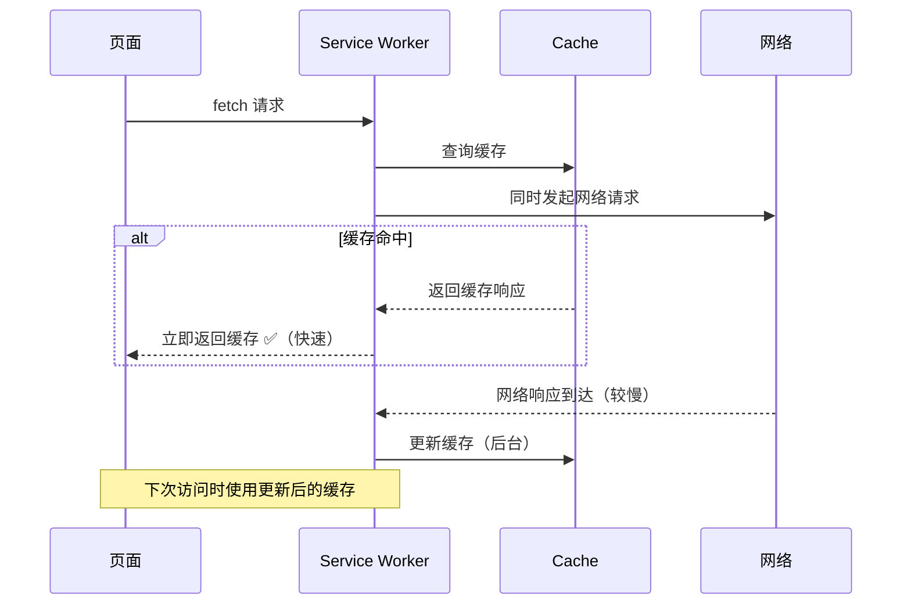

# 离线与缓存策略

离线能力是 PWA 的核心特征，而缓存策略决定了 Web 应用在无网络环境下的表现。选择正确的缓存策略，可以让应用在离线时仍可使用，在线时保持数据新鲜度。



> 📊 图表解读：缓存策略的选择取决于资源类型和实时性要求。没有万能策略，通常需要组合使用多种策略。

## 1. 五大缓存策略详解

### 策略1：Cache First（缓存优先）

优先从缓存获取，缓存未命中时走网络。



**适用场景**：图片、字体、CSS、JS 等不常变化的静态资源。

```javascript
async function cacheFirst(request, cacheName = 'static-v1') {
  const cached = await caches.match(request)
  if (cached) return cached

  const response = await fetch(request)
  if (response.ok) {
    const cache = await caches.open(cacheName)
    cache.put(request, response.clone())
  }
  return response
}
```

**优点**：响应最快，离线可用。
**缺点**：缓存不更新，除非手动刷新或版本变更。

### 策略2：Network First（网络优先）

优先走网络，网络失败时回退到缓存。



**适用场景**：API 请求、HTML 页面等需要最新数据的资源。

```javascript
async function networkFirst(request, cacheName = 'dynamic-v1', timeout = 3000) {
  // 可选：设置网络超时
  const timeoutPromise = new Promise((_, reject) =>
    setTimeout(() => reject(new Error('timeout')), timeout)
  )

  try {
    const response = await Promise.race([
      fetch(request),
      timeoutPromise,
    ])
    if (response.ok) {
      const cache = await caches.open(cacheName)
      cache.put(request, response.clone())
    }
    return response
  } catch {
    const cached = await caches.match(request)
    return cached || caches.match('/offline.html')
  }
}
```

**优点**：数据最新，离线有回退。
**缺点**：网络慢时响应慢（可通过超时优化）。

### 策略3：Stale While Revalidate（后台更新）

立即返回缓存，同时后台请求网络更新缓存。下次访问时得到最新数据。



**适用场景**：对实时性要求不高但需快速响应的资源（头像、文章列表、非关键 API）。

```javascript
async function staleWhileRevalidate(request, cacheName = 'runtime-v1') {
  const cache = await caches.open(cacheName)
  const cached = await cache.match(request)

  // 后台更新
  const fetchPromise = fetch(request).then((response) => {
    if (response.ok) {
      cache.put(request, response.clone())
    }
    return response
  }).catch(() => cached)  // 网络失败静默处理

  // 立即返回缓存，或等待网络（无缓存时）
  return cached || fetchPromise
}
```

**优点**：响应快，数据最终一致。
**缺点**：首次访问无缓存时仍需等网络；同一次访问中数据可能不是最新。

### 策略4：Network Only（仅网络）

始终走网络，不缓存。

```javascript
async function networkOnly(request) {
  return fetch(request)
}
```

**适用场景**：非 GET 请求、实时性要求极高的数据（股票行情、在线支付）、分析埋点。

### 策略5：Cache Only（仅缓存）

始终走缓存，不请求网络。

```javascript
async function cacheOnly(request, cacheName = 'precache-v1') {
  const cached = await caches.match(request)
  return cached
}
```

**适用场景**：App Shell（预缓存的离线骨架）、版本化的静态资源。

## 2. 策略对比总览

| 策略 | 响应速度 | 数据新鲜度 | 离线支持 | 适用资源 |
|------|:--------:|:----------:|:--------:|----------|
| Cache First | ⚡⚡⚡ | ❌ | ✅ | 图片、字体、CSS/JS |
| Network First | ⚡ | ✅ | ✅ | API、HTML |
| Stale While Revalidate | ⚡⚡ | ⚠️ 最终一致 | ✅ | 非关键 API |
| Network Only | ⚡ | ✅ | ❌ | 实时数据、POST |
| Cache Only | ⚡⚡⚡ | ❌ | ✅ | 预缓存 App Shell |

## 3. Workbox — Google 官方缓存库

Workbox 是 Google 提供的 Service Worker 工具库，封装了常用缓存策略，是生产环境的首选。

### 安装

```bash
npm install workbox-cli --save-dev
# 或使用 CDN
```

### 使用 Workbox 策略

```javascript
// sw.js
import { registerRoute } from 'workbox-routing'
import {
  CacheFirst,
  NetworkFirst,
  StaleWhileRevalidate,
} from 'workbox-strategies'
import { ExpirationPlugin } from 'workbox-expiration'
import { CacheableResponsePlugin } from 'workbox-cacheable-response'

// 静态资源：Cache First + 过期清理
registerRoute(
  ({ request }) =>
    ['image', 'style', 'script', 'font'].includes(request.destination),
  new CacheFirst({
    cacheName: 'static-assets',
    plugins: [
      new ExpirationPlugin({ maxEntries: 100, maxAgeSeconds: 30 * 24 * 60 * 60 }),
      new CacheableResponsePlugin({ statuses: [0, 200] }),
    ],
  })
)

// 动态内容：Network First
registerRoute(
  ({ request }) => request.mode === 'navigate',
  new NetworkFirst({
    cacheName: 'html-cache',
    plugins: [
      new CacheableResponsePlugin({ statuses: [200] }),
    ],
  })
)
```

### Workbox 预缓存

```javascript
// 使用 workbox-build 生成预缓存清单
// build.js
const { generateSW } = require('workbox-build')

generateSW({
  globDirectory: 'dist',
  globPatterns: ['**/*.{js,css,html,png,svg,woff2}'],
  swDest: 'dist/sw.js',
  runtimeCaching: [
    {
      urlPattern: /^https:\/\/api\.example\.com\//,
      handler: 'StaleWhileRevalidate',
      options: {
        cacheName: 'api-cache',
        expiration: { maxEntries: 50, maxAgeSeconds: 5 * 60 },
      },
    },
  ],
})
```

## 4. 高级缓存模式

### 请求去重

```javascript
// 避免同一请求在短时间内重复发出
const pendingRequests = new Map()

async function deduplicatedFetch(request) {
  const key = request.url

  if (pendingRequests.has(key)) {
    return pendingRequests.get(key).then(() => caches.match(request))
  }

  const promise = fetch(request).then((response) => {
    pendingRequests.delete(key)
    const cache = await caches.open('runtime-v1')
    cache.put(request, response.clone())
    return response
  })

  pendingRequests.set(key, promise)
  return promise
}
```

### 缓存透明更新

```javascript
// 对于带 hash 的静态资源，永远使用 Cache First
// hash 变化 = URL 变化 = 新的缓存条目
registerRoute(
  ({ url }) => url.pathname.match(/\.[a-f0-9]{8}\./),  // 匹配 contenthash
  new CacheFirst({
    cacheName: 'hashed-assets',
    plugins: [
      new CacheableResponsePlugin({ statuses: [0, 200] }),
      new ExpirationPlugin({
        maxEntries: 200,
        maxAgeSeconds: 365 * 24 * 60 * 60,  // 1 年
      }),
    ],
  })
)
```

### 离线数据同步

```javascript
// 离线时保存操作，在线时重放
const offlineQueue = []

self.addEventListener('fetch', (event) => {
  if (event.request.method !== 'GET') {
    // 非 GET 请求：在线时直接发送，离线时入队
    event.respondWith(
      fetch(event.request).catch(() => {
        offlineQueue.push(event.request.clone())
        return new Response(JSON.stringify({ queued: true }), {
          headers: { 'Content-Type': 'application/json' },
        })
      })
    )
  }
})

// Background Sync API（浏览器支持时）
self.addEventListener('sync', (event) => {
  if (event.tag === 'offline-queue') {
    event.waitUntil(replayQueue())
  }
})

async function replayQueue() {
  while (offlineQueue.length > 0) {
    const request = offlineQueue.shift()
    await fetch(request)
  }
}
```

## 5. 缓存策略最佳实践

### 版本化缓存

```javascript
// 使用版本号管理缓存
const PRECACHE = 'precache-v2'
const RUNTIME = 'runtime-v2'

const PRECACHE_URLS = [
  '/',
  '/index.html',
  '/styles/main.css',
  '/scripts/app.js',
]

self.addEventListener('install', (event) => {
  event.waitUntil(
    caches.open(PRECACHE)
      .then((cache) => cache.addAll(PRECACHE_URLS))
      .then(self.skipWaiting)
  )
})

self.addEventListener('activate', (event) => {
  event.waitUntil(
    caches.keys().then((names) =>
      Promise.all(
        names
          .filter((name) => ![PRECACHE, RUNTIME].includes(name))
          .map((name) => caches.delete(name))
      )
    ).then(() => self.clients.claim())
  )
})
```

### 缓存大小控制

| 策略 | 说明 | 配置示例 |
|------|------|----------|
| **maxEntries** | 最大缓存条目数 | `new ExpirationPlugin({ maxEntries: 100 })` |
| **maxAgeSeconds** | 最大缓存时间 | `new ExpirationPlugin({ maxAgeSeconds: 7 * 24 * 3600 })` |
| **purgeOnQuotaError** | 存储不足时自动清理 | `new ExpirationPlugin({ purgeOnQuotaError: true })` |

> 💡 **经验法则**：图片缓存不超过 100 张或 50MB，API 缓存不超过 50 条或 7 天。超过配额浏览器会自动清理，但主动管理更可控。
