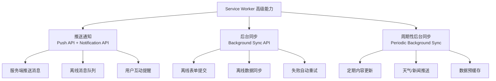
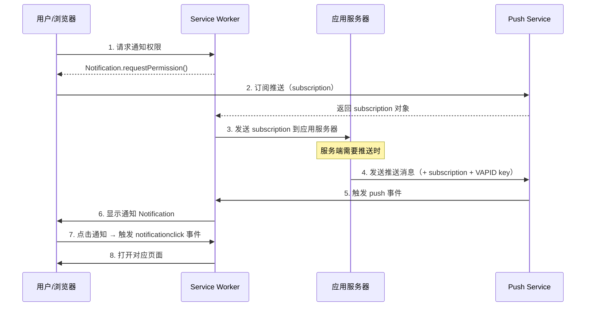

# 推送通知与后台同步

推送通知和后台同步是 Service Worker 的高级能力，让 Web 应用具备与原生应用相媲美的用户触达和离线处理能力。



> 📊 图表解读：推送通知让服务端主动触达用户，后台同步让离线操作在网络恢复后自动完成，周期性后台同步则允许定时更新。三者共同提升了 Web 应用的"活力度"。

## 1. 推送通知

推送通知由两部分组成：**Push API**（接收服务端推送）和 **Notification API**（显示系统通知）。

### 推送流程



### 请求通知权限

```javascript
// 主线程
async function requestNotificationPermission() {
  if (!('Notification' in window)) {
    console.log('浏览器不支持通知')
    return false
  }

  if (Notification.permission === 'granted') {
    return true
  }

  if (Notification.permission === 'denied') {
    console.log('用户已拒绝通知')
    return false
  }

  // 请求权限
  const permission = await Notification.requestPermission()
  return permission === 'granted'
}
```

### 订阅推送

```javascript
// 主线程
async function subscribeToPush() {
  const registration = await navigator.serviceWorker.ready

  // 检查是否已订阅
  let subscription = await registration.pushManager.getSubscription()

  if (!subscription) {
    // 创建新订阅
    // applicationServerKey 是 VAPID 公钥
    subscription = await registration.pushManager.subscribe({
      userVisibleOnly: true,  // 必须为 true（承诺每条推送都显示通知）
      applicationServerKey: urlBase64ToUint8Array(VAPID_PUBLIC_KEY),
    })

    // 将订阅信息发送给应用服务器保存
    await fetch('/api/save-subscription', {
      method: 'POST',
      headers: { 'Content-Type': 'application/json' },
      body: JSON.stringify(subscription),
    })
  }

  return subscription
}

// VAPID 公钥（Base64URL）转 Uint8Array
function urlBase64ToUint8Array(base64String) {
  const padding = '='.repeat((4 - (base64String.length % 4)) % 4)
  const base64 = (base64String + padding).replace(/-/g, '+').replace(/_/g, '/')
  const rawData = window.atob(base64)
  const outputArray = new Uint8Array(rawData.length)

  for (let i = 0; i < rawData.length; ++i) {
    outputArray[i] = rawData.charCodeAt(i)
  }
  return outputArray
}
```

### 处理推送事件

```javascript
// sw.js
self.addEventListener('push', (event) => {
  if (!event.data) return

  const data = event.data.json()
  const options = {
    body: data.body || '',
    icon: data.icon || '/icons/notification-icon.png',
    badge: '/icons/badge-72x72.png',
    image: data.image,                // 大图通知
    vibrate: [200, 100, 200],         // 振动模式
    tag: data.tag || 'default',       // 通知标签（同 tag 替换旧通知）
    renotify: true,                   // tag 相同时是否重新提醒
    requireInteraction: data.important,  // 是否需手动关闭
    actions: [                        // 通知操作按钮
      { action: 'open', title: '查看详情' },
      { action: 'dismiss', title: '忽略' },
    ],
    data: {                           // 自定义数据
      url: data.url || '/',
      id: data.id,
    },
  }

  event.waitUntil(
    self.registration.showNotification(data.title, options)
  )
})
```

### 处理通知点击

```javascript
// sw.js
self.addEventListener('notificationclick', (event) => {
  event.notification.close()  // 关闭通知

  const urlToOpen = event.notification.data?.url || '/'

  if (event.action === 'dismiss') return

  event.waitUntil(
    self.clients.matchAll({ type: 'window', includeUncontrolled: true })
      .then((clientList) => {
        // 如果已有打开的窗口，聚焦到该窗口
        for (const client of clientList) {
          if (client.url === urlToOpen && 'focus' in client) {
            return client.focus()
          }
        }
        // 否则打开新窗口
        return self.clients.openWindow(urlToOpen)
      })
  )
})
```

### 服务端推送（Node.js）

```javascript
// server.js — 使用 web-push 库
const webpush = require('web-push')

// 配置 VAPID 密钥
const vapidKeys = webpush.generateVAPIDKeys()
webpush.setVapidDetails(
  'mailto:admin@example.com',
  vapidKeys.publicKey,
  vapidKeys.privateKey
)

// 发送推送（subscription 为此前保存的订阅对象）
webpush.sendNotification(subscription, JSON.stringify({
  title: '新消息',
  body: '你有一条新的好友请求',
  icon: '/icons/icon-192x192.png',
  url: '/friends/requests',
  tag: 'friend-request',
}))
```

## 2. 后台同步

Background Sync API 允许在用户离线时延迟操作，等网络恢复后自动执行。

### 注册同步事件

```javascript
// 主线程：提交表单
async function submitForm(formData) {
  if ('serviceWorker' in navigator && 'SyncManager' in window) {
    // 保存数据到 IndexedDB
    await saveToIndexedDB('outbox', formData)

    // 注册后台同步
    const registration = await navigator.serviceWorker.ready
    await registration.sync.register('form-submit')
    console.log('同步已注册，网络恢复后将自动提交')
  } else {
    // 不支持 Background Sync，直接发送
    await fetch('/api/submit', {
      method: 'POST',
      body: JSON.stringify(formData),
    })
  }
}
```

### 处理同步事件

```javascript
// sw.js
self.addEventListener('sync', (event) => {
  if (event.tag === 'form-submit') {
    event.waitUntil(submitOutbox())
  } else if (event.tag === 'data-sync') {
    event.waitUntil(syncData())
  }
})

async function submitOutbox() {
  const outbox = await getAllFromIndexedDB('outbox')

  for (const formData of outbox) {
    try {
      await fetch('/api/submit', {
        method: 'POST',
        headers: { 'Content-Type': 'application/json' },
        body: JSON.stringify(formData),
      })
      await removeFromIndexedDB('outbox', formData.id)
    } catch (error) {
      // 提交失败，抛出异常触发重试
      throw new Error('提交失败，等待下次同步')
    }
  }
}
```

### 同步事件特点

| 特性 | 说明 |
|------|------|
| **自动重试** | 同步失败时浏览器自动重试，指数退避 |
| **持久化** | 即使用户关闭页面，同步仍会执行 |
| **合并** | 同一 tag 的多次注册会合并为一次 |
| **网络必要** | 只有网络可用时才触发 |
| **必须 SW** | 需要活跃的 Service Worker |

## 3. 周期性后台同步

Periodic Background Sync API 允许定时执行后台任务，适用于内容预缓存和定期更新。

### 注册周期性同步

```javascript
// 主线程
async function registerPeriodicSync() {
  const registration = await navigator.serviceWorker.ready

  // 检查权限
  const status = await navigator.permissions.query({
    name: 'periodic-background-sync',
  })

  if (status.state !== 'granted') {
    console.log('周期性同步权限未授予')
    return
  }

  // 注册周期性同步
  await registration.periodicSync.register('content-update', {
    minInterval: 24 * 60 * 60 * 1000,  // 最少间隔 24 小时
  })

  console.log('周期性同步已注册')
}
```

### 处理周期性同步

```javascript
// sw.js
self.addEventListener('periodicsync', (event) => {
  if (event.tag === 'content-update') {
    event.waitUntil(updateContent())
  }
})

async function updateContent() {
  const cache = await caches.open('content-v1')

  // 预缓存最新内容
  const urls = ['/api/articles/latest', '/api/weather']
  await Promise.all(
    urls.map(async (url) => {
      const response = await fetch(url)
      if (response.ok) {
        await cache.put(url, response)
      }
    })
  )
}
```

### Periodic Sync 限制

| 限制 | 说明 |
|------|------|
| **需 PWA 安装** | 只有安装到桌面的 PWA 才能使用 |
| **浏览器决定频率** | 实际间隔由浏览器根据站点使用频率决定 |
| **Chrome 优先** | 目前仅 Chrome/Edge 支持 |
| **最小间隔不保证** | `minInterval` 是建议值，非强制 |

## 4. 浏览器兼容性

| API | Chrome | Firefox | Safari | 说明 |
|-----|:------:|:-------:|:------:|------|
| Push API | ✅ | ✅ | ✅ (16.4+) | Safari 需 macOS 13+ |
| Notification API | ✅ | ✅ | ✅ | — |
| Background Sync | ✅ | ❌ | ❌ | 仅 Chromium 支持 |
| Periodic Background Sync | ✅ | ❌ | ❌ | 需安装 PWA |

### 降级策略

```javascript
// 通用降级模式
async function sendMessage(data) {
  if ('serviceWorker' in navigator && 'SyncManager' in window) {
    // 优先使用 Background Sync
    await saveToIndexedDB('outbox', data)
    const reg = await navigator.serviceWorker.ready
    await reg.sync.register('send-message')
  } else if ('serviceWorker' in navigator) {
    // 降级：Service Worker 在线检查
    await saveToIndexedDB('outbox', data)
    // 下次 SW 激活时检查
  } else {
    // 最终降级：直接发送
    if (navigator.onLine) {
      await fetch('/api/send', { method: 'POST', body: JSON.stringify(data) })
    } else {
      // 提示用户稍后重试
      alert('网络不可用，请稍后重试')
    }
  }
}
```

## 5. 最佳实践

### 通知策略

| 原则 | 说明 |
|------|------|
| **避免过度推送** | 控制频率，避免用户关闭通知权限 |
| **分类标签** | 使用 `tag` 合并同类通知 |
| **行动按钮** | 提供明确的操作选项 |
| **静默时段** | 避免夜间推送 |
| **用户控制** | 提供通知偏好设置 |

### 同步策略

| 原则 | 说明 |
|------|------|
| **幂等操作** | 同步任务必须是幂等的（重复执行结果一致） |
| **超时控制** | 单次同步不超过 30 秒 |
| **数据量控制** | 单次同步数据不超过 1MB |
| **错误处理** | 失败时保存状态，等待下次同步 |
| **用户通知** | 同步完成后通知用户 |
