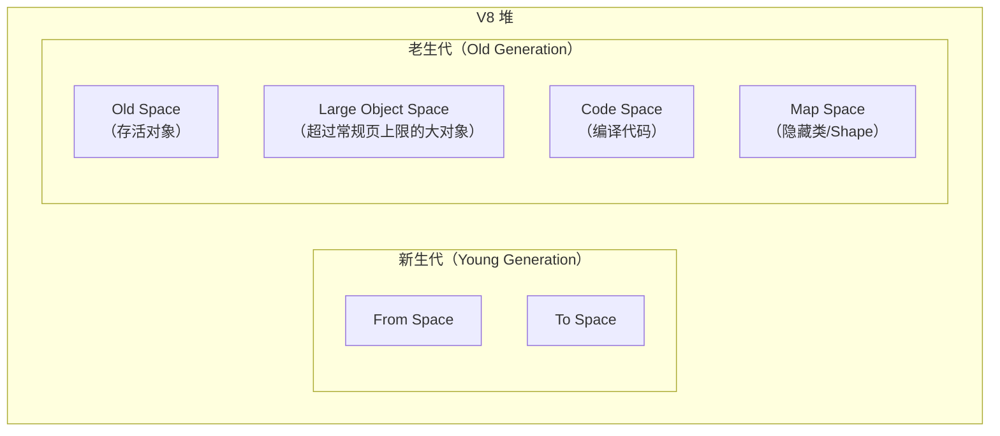
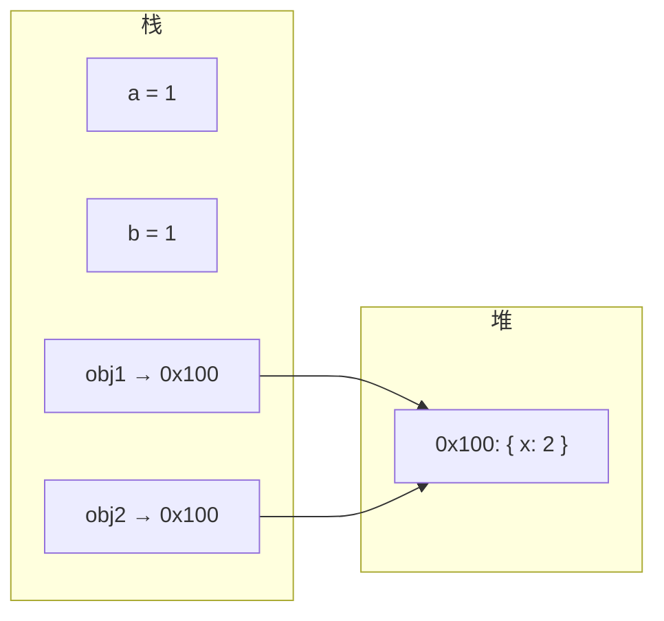

# 栈空间与堆空间：JavaScript 的内存模型

## 概述

JavaScript 引擎将内存划分为栈（Stack）和堆（Heap）两个区域，分别管理不同类型的数据。理解数据的存储位置和生命周期，是分析内存分配、垃圾回收和性能优化的前提。

---

## 1 栈空间（Stack）

### 1.1 栈的特性

| 特性 | 说明 |
|------|------|
| 大小 | 固定（V8 默认约 984 KB 用于 JS 栈帧） |
| 分配方式 | 自动分配和释放（随函数调用/返回） |
| 访问速度 | 极快（CPU 缓存友好，L1 缓存命中率极高） |
| 生命周期 | 与函数调用同步（函数返回即释放） |

### 1.2 栈中存储的数据

栈存储**原始类型（Primitive）**的值和**引用类型**的地址：

| 类型 | 存储位置 | 示例 |
|------|----------|------|
| Number | 栈（Smi 或 HeapNumber） | `let x = 42;` |
| String | 栈存引用，堆存内容 | `let s = "hello";` |
| Boolean | 栈 | `let b = true;` |
| undefined | 栈 | `let u = undefined;` |
| null | 栈 | `let n = null;` |
| Symbol | 栈存引用 | `let sym = Symbol();` |
| BigInt | 栈存引用 | `let big = 9007199254740991n;` |
| Object | 栈存引用（堆地址） | `let obj = { x: 1 };` |

### 1.3 V8 的 Smi 优化

V8 对小整数（Small Integer, Smi）进行特殊优化：31 位有符号整数直接存储在栈帧中，无需堆分配：

```
Smi 编码（64 位平台，开启指针压缩）：
┌────────────────────────────────┬───┐
│       31 位整数值               │ 0 │  ← 最低位为 0 标识 Smi
└────────────────────────────────┴───┘

HeapNumber 编码：
┌────────────────────────────────┬───┐
│       堆地址（指向 HeapNumber）   │ 1 │  ← 最低位为 1 标识堆对象
└────────────────────────────────┴───┘
```

Smi 范围：[-2³⁰, 2³⁰ - 1]（即 -1073741824 到 1073741823），超出此范围的数字使用 HeapNumber 存储在堆中。

---

## 2 堆空间（Heap）

### 2.1 堆的特性

| 特性 | 说明 |
|------|------|
| 大小 | 动态增长（受系统内存限制） |
| 分配方式 | 手动/自动（由 GC 管理） |
| 访问速度 | 较慢（需间接寻址，缓存命中率低） |
| 生命周期 | 由垃圾回收器管理 |

### 2.2 堆中存储的数据

所有引用类型的实际数据存储在堆中：

- **对象**（Object、Array、Map、Set 等）
- **函数**（Function 对象）
- **字符串**（长字符串）
- **HeapNumber**（超出 Smi 范围的数字）
- **闭包**捕获的变量环境

### 2.3 V8 堆的分代结构



---

## 3 原始类型 vs 引用类型

### 3.1 赋值行为差异

```javascript
// 原始类型：值拷贝
let a = 1;
let b = a;   // b 获得值 1 的独立副本
b = 2;
console.log(a); // 1（a 不受影响）

// 引用类型：引用拷贝
let obj1 = { x: 1 };
let obj2 = obj1; // obj2 获得同一对象的引用
obj2.x = 2;
console.log(obj1.x); // 2（obj1 和 obj2 指向同一对象）
```



### 3.2 比较行为差异

```javascript
// 原始类型：值比较
1 === 1;          // true
"hello" === "hello"; // true

// 引用类型：引用比较
{} === {};        // false（不同对象，不同引用）
const obj = {};
obj === obj;      // true（同一对象，同一引用）
```

### 3.3 函数传参行为

JavaScript 采用**值传递（Pass by Value）**策略：函数参数获得实参的副本。对于引用类型，副本是引用地址：

```javascript
function mutate(obj, num) {
    obj.x = 10;   // 修改堆中对象（外部可见）
    num = 10;     // 修改栈中副本（外部不可见）
}

const myObj = { x: 1 };
let myNum = 1;
mutate(myObj, myNum);
console.log(myObj.x); // 10（对象被修改）
console.log(myNum);    // 1（原始值未变）
```

---

## 4 内存与性能

### 4.1 栈 vs 堆的访问性能

| 操作 | 栈 | 堆 |
|------|----|----|
| 分配 | O(1)（ESP 移动） | O(?)（需查找空闲块） |
| 访问 | O(1)（直接偏移） | O(1) 基础 + 缓存未命中惩罚 |
| 回收 | O(1)（ESP 回移） | GC 管理（标记-清除/整理） |

### 4.2 优化建议

1. **优先使用原始类型**：原始类型在栈中分配，无需 GC 参与
2. **避免不必要的对象创建**：短生命周期对象增加 GC 压力
3. **使用对象池**：对频繁创建/销毁的对象，使用池化复用
4. **注意闭包的堆分配**：闭包捕获的变量存储在堆中，生命周期延长

---

## 5 总结

| 维度 | 栈空间 | 堆空间 |
|------|--------|--------|
| 存储内容 | 原始类型值、引用地址 | 引用类型的实际数据 |
| 大小 | 固定（~1MB） | 动态增长 |
| 分配/释放 | 自动（随函数调用） | GC 管理 |
| 访问速度 | 快 | 慢 |
| 生命周期 | 确定性（函数作用域） | 不确定性（GC 决定） |

理解栈与堆的分工，是分析 JavaScript 内存行为的基础。原始类型的值语义和引用类型的引用语义，决定了赋值、传参和比较的不同行为。V8 的 Smi 优化和分代 GC 进一步细化了内存管理的策略。

---

## 参考文献

1. V8 Blog: [Fast properties](https://v8.dev/blog/fast-properties)
2. V8 Blog: [Pointer Compression](https://v8.dev/blog/pointer-compression)
3. MDN: [Memory Management](https://developer.mozilla.org/en-US/docs/Web/JavaScript/Memory_Management)
