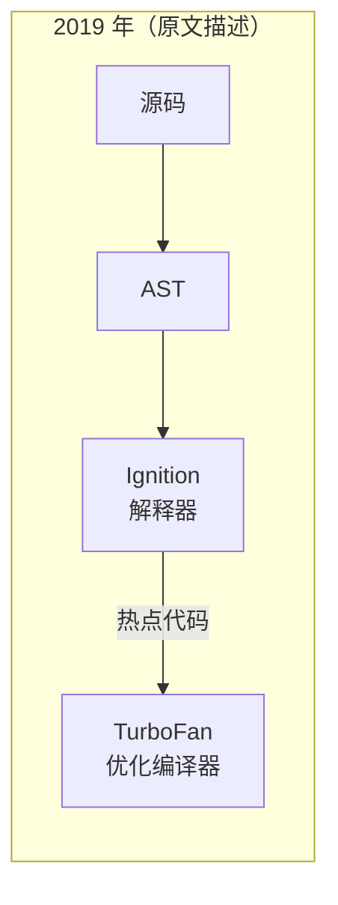
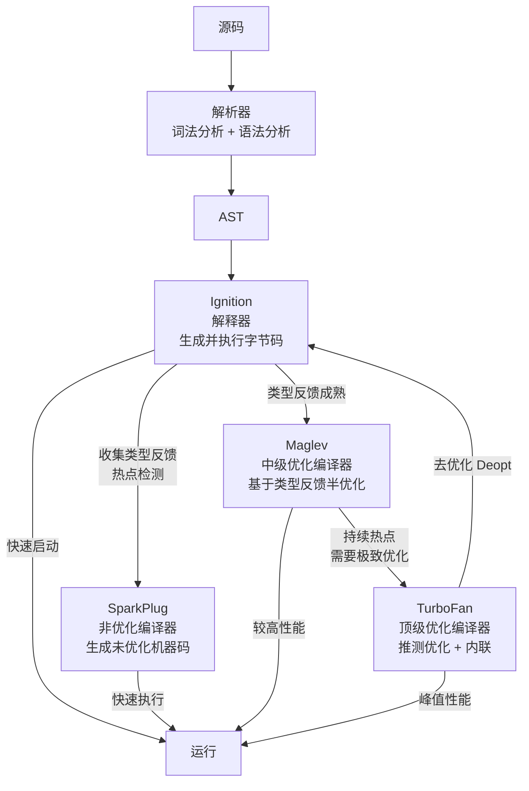
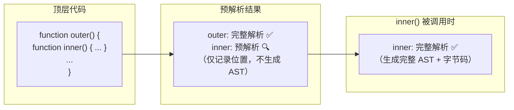
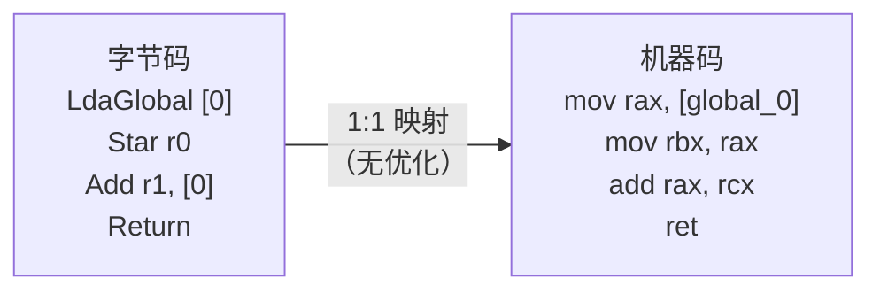
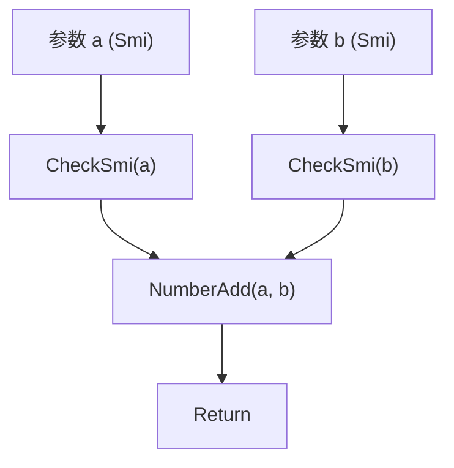
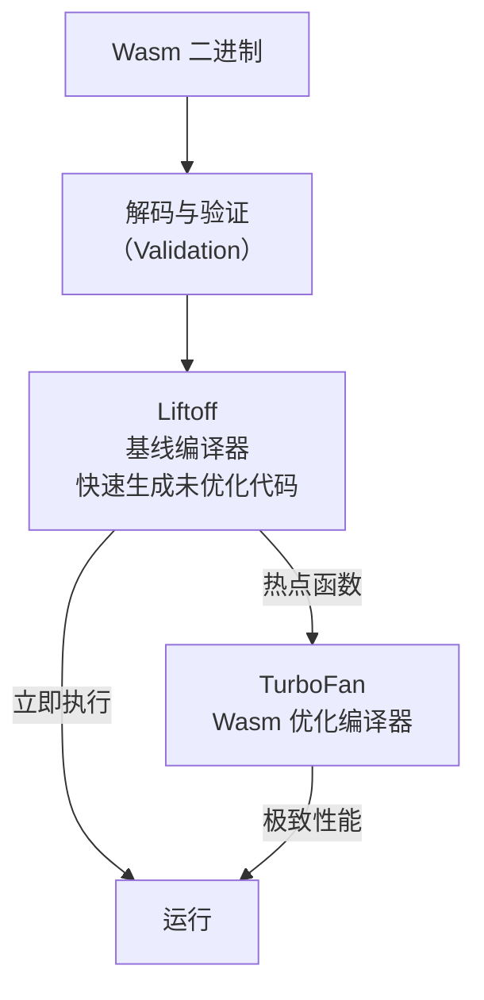
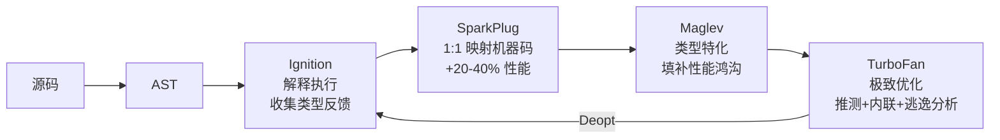

# V8 引擎：JavaScript 代码的四级编译与执行机制

## 概述

V8 是 Chrome 和 Node.js 的 JavaScript 执行引擎。2019 年原文描述了 Ignition + TurboFan 的二级编译架构，但 2020—2024 年间 V8 经历了重大架构演进：引入 SparkPlug（非优化编译器）和 Maglev（中级优化编译器），形成四级编译管线。本文将系统阐述 V8 从源码到机器码的完整编译执行过程，涵盖 AST 生成、字节码解释、四级 JIT 编译、指针压缩和 V8 Sandbox 等关键技术。

---

## 1 编译器与解释器

### 1.1 编译型语言 vs 解释型语言

| 类型 | 执行方式 | 代表语言 | 特点 |
|------|----------|----------|------|
| **编译型** | 源码 → 编译器 → 机器码（提前编译，AOT） | C/C++/Go/Rust | 启动快，部署慢，平台相关 |
| **解释型** | 源码 → 解释器逐行执行 | Python/Ruby（传统） | 启动慢，跨平台 |
| **JIT 混合** | 源码 → 字节码 → 解释执行 + 热点编译 | JavaScript/Java | 兼顾启动速度与峰值性能 |

### 1.2 即时编译（JIT）的核心思想

JIT 编译结合了解释器和编译器的优点：
- **冷启动**：解释器逐行执行字节码，启动快
- **热点优化**：监控代码执行频率，对热点代码编译为高效机器码
- **推测优化**：基于类型反馈进行特化优化，若假设失效则去优化（Deopt）

---

## 2 V8 编译管线演进

### 2.1 历史架构



### 2.2 当前架构（2026 年）



### 2.3 四级编译策略对比

| 编译器 | 引入时间 | 编译速度 | 执行速度 | 优化程度 | 适用场景 |
|--------|----------|----------|----------|----------|----------|
| **Ignition** | 2016 | — | 最慢 | 无（解释执行） | 首次执行、冷代码 |
| **SparkPlug** | 2021 | 极快（< 1ms/KB） | 较快 | 无优化（1:1 映射） | 替代 Ignition 解释执行 |
| **Maglev** | 2023 | 快 | 快 | 中级（类型特化） | 填补 SparkPlug 与 TurboFan 间的性能鸿沟 |
| **TurboFan** | 2014 | 慢 | 最快 | 极致（推测优化、内联） | 长期热点代码 |

---

## 3 阶段一：AST 生成

### 3.1 词法分析（Tokenize）

将源代码字符串拆分为最小的语法单元——**Token**：

```javascript
var myName = "Hello";
```

```
Token 流：
┌──────────┬──────────┬──────────┬──────────┬──────────┐
│ 关键字    │ 标识符   │ 运算符    │ 字符串    │ 分号     │
│ var      │ myName   │ =        │ "Hello"  │ ;        │
└──────────┴──────────┴──────────┴──────────┴──────────┘
```

### 3.2 语法分析（Parse）

将 Token 流按语法规则组装为**抽象语法树（AST）**：

```
VariableDeclaration
├── kind: "var"
└── declarations
    └── VariableDeclarator
        ├── id: Identifier { name: "myName" }
        └── init: Literal { value: "Hello" }
```

**AST 的工程价值**：
- **Babel**：ES6+ → ES5 转译（AST → AST 变换 → 源码生成）
- **ESLint**：代码规范检查（遍历 AST 检查规则）
- **Prettier**：代码格式化（AST → 格式化输出）
- **TypeScript**：类型检查（AST + 类型系统）

### 3.3 惰性解析（Lazy Parse）

V8 采用**惰性解析**策略：只立即解析顶层代码和立即执行的函数，函数体仅预解析（PreParse）记录起始位置和变量声明。当函数首次被调用时，才进行完整解析。



惰性解析显著减少启动时的解析开销，尤其是大型应用中大量未被调用的函数。

---

## 4 阶段二：Ignition 解释器

### 4.1 字节码生成

Ignition 将 AST 编译为**字节码（Bytecode）**。字节码是平台无关的中间表示，每条指令对应一个高级操作：

```
LdaGlobal [0]          // 将全局变量加载到累加器
Star r0                // 累加器值存入寄存器 r0
LdaSmi 42              // 加载小整数 42
Add r0, [0]            // r0 + 累加器，结果存入累加器
Return                 // 返回累加器值
```

### 4.2 字节码 vs 机器码

| 维度 | 字节码 | 机器码 |
|------|--------|--------|
| 平台相关性 | 平台无关 | 平台相关（x86/ARM/RISC-V） |
| 体积 | 紧凑（约为机器码的 1/4—1/8） | 庞大 |
| 执行速度 | 慢（需解释器逐条译码执行） | 快（CPU 直接执行） |
| 内存占用 | 低 | 高 |

引入字节码的核心动机：早期 V8 直接将 AST 编译为机器码，导致内存占用过高（移动设备尤为严重）。字节码大幅降低内存占用，代价是首次执行速度较慢。

### 4.3 类型反馈收集

Ignition 在解释执行字节码时，收集**类型反馈（Type Feedback）**信息：

```javascript
function add(a, b) {
    return a + b;
}

add(1, 2);       // 类型反馈: {a: Smi, b: Smi}
add(1.5, 2.5);   // 类型反馈: {a: Double, b: Double}
add("a", "b");   // 类型反馈: {a: String, b: String}
```

这些类型反馈存储在**反馈向量（Feedback Vector）**中，为后续优化编译器提供推测优化的依据。

---

## 5 阶段三：SparkPlug 非优化编译器

### 5.1 设计动机

Ignition 解释执行的字节码虽然内存紧凑，但每次执行都需要译码（Decode）和分派（Dispatch），存在固定的性能开销。SparkPlug 的目标是用极短的编译时间生成未优化的机器码，消除解释器的译码开销。

### 5.2 工作机制

SparkPlug 直接将字节码 1:1 映射为机器码，不进行任何优化：



**关键特点**：
- 编译速度极快（约 1ms/KB 字节码）
- 生成的机器码与字节码语义等价，不做内联、类型特化等优化
- 保留 Ignition 的类型反馈机制，为 Maglev/TurboFan 提供数据
- 不进行去优化（Deopt），因为没有推测优化假设

### 5.3 性能提升

SparkPlug 可将 JavaScript 的执行速度提升 **20%—40%**（相比纯 Ignition 解释执行），尤其在 I/O 密集和启动密集型场景中效果显著。

> 注：本节与下文的性能倍率均为量级示意，非权威基准数据，实际提升幅度取决于代码负载与硬件环境。

---

## 6 阶段四：Maglev 中级优化编译器

### 6.1 设计动机

SparkPlug 与 TurboFan 之间存在巨大的性能鸿沟（约 2—5 倍）。TurboFan 编译耗时较长，部分代码在达到 TurboFan 编译阈值前已执行完毕。Maglev 填补这一鸿沟，提供介于两者之间的性能水平。

### 6.2 工作机制

Maglev 基于 Ignition 收集的类型反馈，生成**半优化机器码**：


**关键优化**：
- **类型特化**：若反馈表明参数始终为 Smi（小整数），生成专用的整数加法指令
- **类型守卫（Check）**：在优化代码入口插入类型检查，若类型不匹配则去优化
- **部分内联**：对高频调用的小函数进行内联
- **不进行循环优化**：避免复杂的循环不变量外提等耗时优化

### 6.3 与 TurboFan 的差异

| 维度 | Maglev | TurboFan |
|------|--------|----------|
| IR 表示 | 简洁的节点图 | Sea-of-Nodes 图 |
| 优化级别 | 中级（类型特化 + 部分内联） | 极致（全内联 + 循环优化 + 逃逸分析） |
| 编译速度 | 快（约为 TurboFan 的 10 倍） | 慢 |
| 去优化频率 | 低（保守优化） | 较高（激进推测） |
| 内存占用 | 低 | 高 |

---

## 7 阶段五：TurboFan 顶级优化编译器

### 7.1 Sea-of-Nodes IR

TurboFan 使用 **Sea-of-Nodes** 中间表示，将程序表示为一个数据流图，节点代表操作，边代表数据依赖和控制流：



### 7.2 推测优化

TurboFan 基于 Ignition/Maglev 收集的类型反馈进行**推测优化**：

1. **类型特化**：将通用的 `+` 操作特化为整数加法
2. **内联（Inlining）**：将被调用函数的代码直接嵌入调用点，消除函数调用开销
3. **逃逸分析**：若对象未逃逸出函数，可直接在栈上分配（甚至完全消除分配）
4. **边界检查消除**：若能证明数组访问始终在范围内，消除边界检查

### 7.3 去优化（Deoptimization）

当推测优化的假设被违反时（如参数类型改变），TurboFan 必须执行**去优化（Deopt）**：


去优化的代价极高（需要重建执行上下文、重新编译），因此 TurboFan 在优化时需权衡推测的激进程度。

---

## 8 指针压缩与 V8 Sandbox

### 8.1 指针压缩（Pointer Compression）

2020 年引入，将 64 位指针压缩为 32 位偏移量，堆内存减少约 40%。V8 将堆分配在 4 GB 对齐的地址空间内，所有指针仅存储低 32 位偏移量，高 32 位由基址寄存器隐含提供。

### 8.2 V8 Sandbox

2023—2024 年引入的安全机制，在 V8 堆内建立隔离沙箱。所有 V8 对象指针只能指向沙箱内部地址，即使攻击者通过漏洞获得 V8 堆的任意读写能力，也无法突破沙箱访问宿主进程内存。

---

## 9 WebAssembly 编译管线

V8 同时负责 WebAssembly 的编译执行，其管线与 JavaScript 不同：



| 编译器 | 速度 | 优化级别 | 适用场景 |
|--------|------|----------|----------|
| **Liftoff** | 极快 | 无优化 | 快速启动 |
| **TurboFan (Wasm)** | 慢 | 极致优化 | 热点函数 |

WasmGC（2023 年标准化）允许 Wasm 模块直接使用宿主语言的垃圾回收器，无需自带 GC 运行时。

---

## 10 总结



| 编译器 | 优化策略 | 性能倍率（vs Ignition，量级示意） |
|--------|----------|------------------------|
| Ignition | 无 | 1× |
| SparkPlug | 消除译码开销 | ~1.3× |
| Maglev | 类型特化 + 部分内联 | ~3× |
| TurboFan | 推测优化 + 全内联 + 逃逸分析 | ~5—10× |

V8 的四级编译架构体现了**渐进优化**的设计哲学：启动时以最低成本获得可接受的性能，随着代码持续执行，逐步投入更多编译资源换取更高的执行效率。理解这一架构，不仅能帮助开发者编写对 V8 友好的代码，也为理解 Babel、ESLint、TypeScript 等工具的底层原理提供了理论基础。

---

## 参考文献

1. V8 Blog: [SparkPlug](https://v8.dev/blog/sparkplug)
2. V8 Blog: [Maglev](https://v8.dev/blog/maglev)
3. V8 Blog: [TurboFan](https://v8.dev/docs/turbofan)
4. V8 Blog: [Pointer Compression](https://v8.dev/blog/pointer-compression)
5. V8 Blog: [V8 Sandbox](https://v8.dev/blog/sandbox)
6. V8 Blog: [Liftoff](https://v8.dev/blog/liftoff)
7. V8 Blog: [WebAssembly GC](https://v8.dev/blog/wasm-gc-porting)
