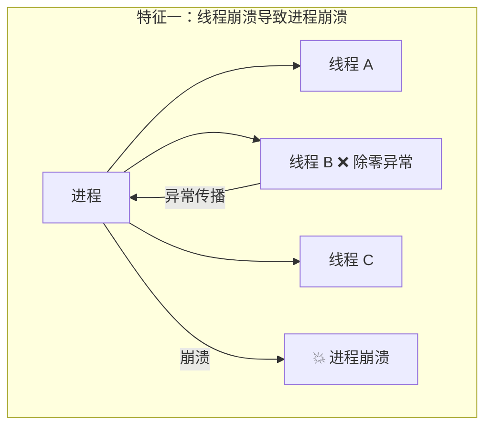
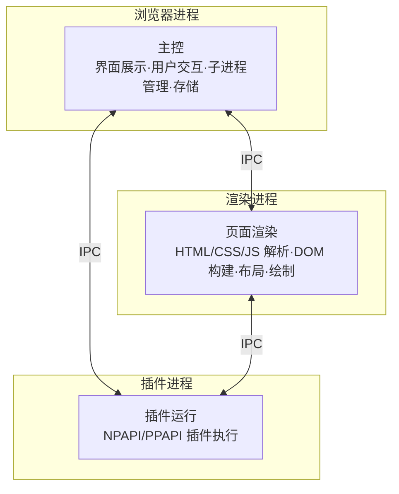
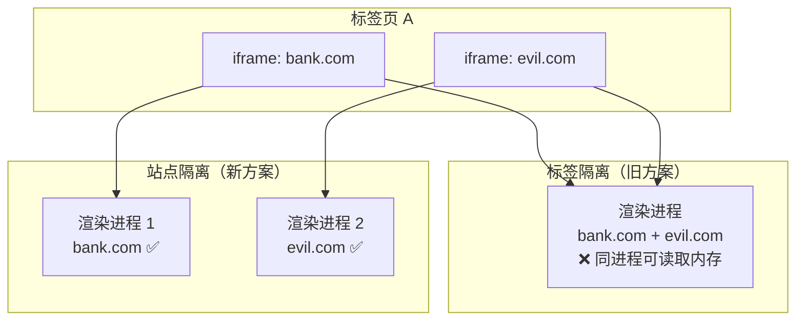
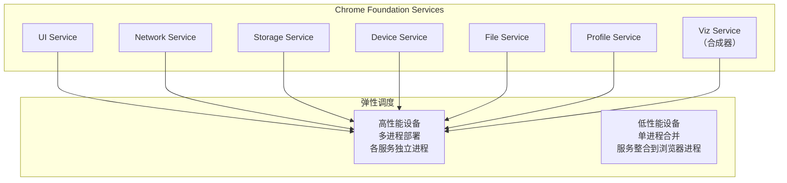
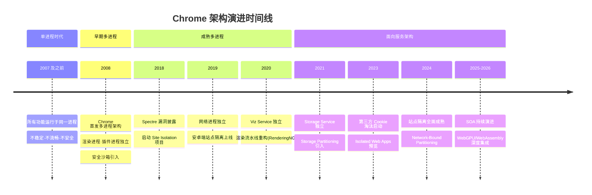

# Chrome 多进程架构演进：从单进程到面向服务架构

## 概述

浏览器多进程架构是理解现代 Web 平台工作原理的基石。网络加载、页面渲染、JavaScript 执行、Web 安全等功能分散于浏览器各子系统之中，唯有透过架构视角方能将其串联为有机整体。本文将系统性地梳理 Chrome 浏览器从单进程到多进程、再到面向服务架构（SOA）的完整演进路径，并涵盖 2019 年以来 Site Isolation、Storage Partitioning、Isolated Web Apps 等关键架构变更。

> **前提约定**：本文所有分析均基于 Chromium 内核。Chrome、Microsoft Edge、Brave、Opera 等主流浏览器均基于 Chromium 二次开发，Chrome 具备最强代表性。截至 2026 年，Chromium 内核已覆盖全球超过 65% 的浏览器市场份额。

---

## 1 进程与线程

### 1.1 并行处理

计算机中的并行处理（Parallel Processing）是指在同一时刻处理多个任务。考虑以下计算：

```
A = 1 + 2
B = 20 / 5
C = 7 * 8
```

将其拆分为四个子任务：

| 任务 | 操作 | 依赖 |
|------|------|------|
| T₁ | 计算 A = 1 + 2 | 无 |
| T₂ | 计算 B = 20 / 5 | 无 |
| T₃ | 计算 C = 7 * 8 | 无 |
| T₄ | 输出 A、B、C 的值 | T₁, T₂, T₃ |

单线程串行执行需四步；多线程并行执行可将 T₁、T₂、T₃ 同时执行，再执行 T₄，仅需两步。并行处理可显著提升计算吞吐量。

### 1.2 进程与线程的关系

**进程（Process）** 是操作系统资源分配的基本单位，是一个程序的运行实例。启动程序时，操作系统为其创建虚拟地址空间，存放代码段、数据段和主线程执行上下文。

**线程（Thread）** 是 CPU 调度的基本单位，由进程启动和管理，同一进程内的线程共享进程的地址空间和资源。

进程与线程的关系具有以下四个核心特征：



1. **线程出错导致进程崩溃**：进程中任意线程的未捕获异常将导致整个进程终止。例如 T₂ 执行 `B = 20/0` 时触发除零异常，T₁、T₃ 的执行结果随之丢失。

2. **线程间共享进程数据**：同一进程内的所有线程可读写进程的公共数据区，这既实现了高效通信，也引入了数据竞争风险。

3. **进程退出时资源回收**：操作系统在进程终止时回收其占用的全部资源（包括内存、文件描述符等），即使线程存在内存泄漏，进程退出后亦能正确回收。

4. **进程间内存隔离**：操作系统通过虚拟内存机制实现进程隔离，进程 A 无法直接读写进程 B 的地址空间。进程间通信（Inter-Process Communication, IPC）需依赖操作系统提供的管道、共享内存、Socket 等机制。

---

## 2 单进程浏览器架构

### 2.1 架构特征

2007 年之前，主流浏览器均采用单进程架构：所有功能模块——网络、插件、JavaScript 运行时、渲染引擎、页面展示——运行于同一进程中。


### 2.2 三大问题

单进程架构存在三个根本性缺陷：

| 问题 | 根因 | 影响 |
|------|------|------|
| **不稳定** | 插件与渲染引擎的崩溃会波及整个进程 | 任意页面或插件崩溃导致整个浏览器终止 |
| **不流畅** | 所有页面的 JS 执行、渲染、插件运行共享主线程 | 长任务阻塞主线程，全部页面失去响应 |
| **不安全** | 插件（C/C++）可获取完整系统权限；页面脚本可利用浏览器漏洞提权 | 恶意代码可窃取数据、植入病毒 |

以不稳定为例：早期浏览器依赖 NPAPI 插件实现视频播放、3D 游戏等功能，而插件是最易出错的模块。一旦插件崩溃，整个浏览器进程随之终止，用户所有标签页内容丢失。

以不流畅为例：执行以下死循环脚本将独占主线程，所有页面均无法响应用户交互：

```javascript
function freeze() {
    while (true) {
        console.log("freeze");
    }
}
freeze();
```

此外，页面内存泄漏在单进程模型中尤为严重：关闭标签页后，浏览器内核可能无法完全回收内存，长时间运行后内存占用持续增长。

---

## 3 早期多进程架构（2008）

### 3.1 架构概览

2008 年 Chrome 发布时即引入多进程架构，将页面渲染和插件运行隔离到独立进程中：



### 3.2 三大问题的解决

**不稳定**：进程隔离使得页面或插件崩溃仅影响自身进程，不会波及其他页面和浏览器主进程。

**不流畅**：JavaScript 运行于渲染进程，阻塞仅影响当前页面；其他页面的脚本在各自的渲染进程中独立执行。关闭标签页即销毁渲染进程，内存泄漏问题自然解决。

**不安全**：多进程架构引入了**安全沙箱（Sandbox）**机制。操作系统级别的沙箱限制了渲染进程和插件进程的系统调用权限——无法写入磁盘、无法读取敏感位置、无法直接访问网络。即使恶意代码获取了渲染进程的控制权，也无法突破沙箱攻击操作系统。

---

## 4 现代多进程架构（2019—2026）

### 4.1 当前进程模型

截至 2026 年，Chrome 的多进程架构包含以下核心进程：

| 进程 | 数量 | 职责 |
|------|------|------|
| **浏览器进程（Browser Process）** | 1 | 地址栏、书签、前进/后退、子进程管理、文件存储 |
| **渲染进程（Renderer Process）** | N（每站点实例一个） | HTML/CSS/JS 解析、DOM 构建、布局、绘制、JavaScript 执行 |
| **GPU 进程（GPU Process）** | 1 | 3D CSS、Canvas、WebGL、WebGPU、页面合成 |
| **网络进程（Network Process）** | 1 | HTTP/HTTPS/HTTP3 请求、DNS 解析、TLS 握手、缓存管理 |
| **插件进程（Plugin Process）** | N（每插件一个） | PPAPI 插件运行（NPAPI 已废弃） |
| **实用程序进程（Utility Process）** | N | 音视频编解码、文件解压等辅助任务 |
| **存储进程（Storage Process）** | N | IndexedDB、Cache API、Storage Bucket 等存储服务 |

> **注意**：打开一个空白标签页时，Chrome 至少启动浏览器进程、GPU 进程、网络进程和渲染进程，共 4 个进程。加载含插件的页面则需更多进程。

### 4.2 Site Isolation（站点隔离）

2018 年 Spectre/Meltdown 处理器侧信道漏洞的披露，推动了 Chrome 实现**站点隔离（Site Isolation）**——这是 2019 年以来最重大的架构变更之一。

**核心机制**：Chrome 将渲染进程的分配粒度从"标签页"细化到"站点"。来自不同站点的 iframe 被分配到不同的渲染进程中执行，即使它们位于同一标签页内。



**同一站点（Same-Site）** 的定义：协议（scheme）+ 注册域名（eTLD+1）相同。例如 `https://news.example.com` 和 `https://mail.example.com` 属于同一站点（eTLD+1 为 `example.com`），但 `https://example.com` 和 `https://example.org` 不属于同一站点。

站点隔离的关键安全保障：

- **进程级内存隔离**：利用操作系统进程隔离机制，阻止 Spectre 类攻击跨 iframe 读取内存
- **COOP/COEP 强制执行**：配合 Cross-Origin Opener Policy 和 Cross-Origin Embedder Policy，实现跨源隔离（Cross-Origin Isolation），为 `SharedArrayBuffer` 等高权限 API 提供安全前提
- **网络绑定分区（Network-Bound Partitioning）**：2024 年起 Chrome 实施了更严格的网络隔离策略，确保不同站点的网络请求无法通过共享连接进行关联

### 4.3 Storage Partitioning（存储分区）

2023—2024 年，Chrome 引入了**存储分区（Storage Partitioning）**机制，将 Cookie、localStorage、IndexedDB、Cache API 等存储按**顶级站点 + 源**进行分区。这意味着 `evil.com` 的 iframe 即使嵌入在 `bank.com` 中，其存储数据也无法与直接访问 `evil.com` 时的数据关联。

此机制是第三方 Cookie 淘汰计划（Privacy Sandbox）的重要组成部分，从根本上限制了跨站追踪能力。

### 4.4 多进程架构的代价

多进程架构引入了不可避免的资源开销：

| 开销类型 | 具体表现 |
|----------|----------|
| **内存占用** | 每个渲染进程包含独立的 V8 堆、Blink 渲染引擎副本；10 个标签页可能消耗 2—4 GB 内存 |
| **进程间通信** | IPC 延迟（通常 < 1ms），频繁通信场景下可感知 |
| **架构复杂度** | 模块间耦合性高，扩展性差，新功能集成困难 |

---

## 5 面向服务架构（SOA）

### 5.1 设计动机

为解决多进程架构的资源浪费和复杂度问题，2016 年起 Chrome 团队采用**面向服务架构（Service-Oriented Architecture, SOA）**思想重构浏览器内核。核心原则：**将功能模块重构为独立服务（Service），每个服务可在独立进程中运行，通过定义良好的 IPC 接口通信**。

### 5.2 Chrome 基础服务

Chrome 基础服务（Chrome Foundation Services）将浏览器内核功能分解为可独立部署的服务：



**弹性架构（Elastic Architecture）** 是 SOA 的关键特性：

- **高性能设备**：每个服务运行于独立进程，最大化并行度和稳定性
- **低资源设备**（如嵌入式设备、低配手机）：多个服务合并至浏览器进程，减少内存占用

### 5.3 关键服务演进

| 服务 | 独立时间 | 关键变更 |
|------|----------|----------|
| **Network Service** | Chrome 73（2019） | 从浏览器进程模块独立为网络进程 |
| **Viz Service** | Chrome 86（2020） | 合成器从渲染进程独立，实现跨进程合成 |
| **Storage Service** | Chrome 95（2021） | 存储后端独立化，支持 Storage Partitioning |
| **Audio Service** | Chrome 91（2021） | 音频处理独立化，避免音频故障影响稳定性 |

### 5.4 Mojo IPC 框架

面向服务架构的通信基础设施是 **Mojo**——Chromium 的 IPC 框架。Mojo 提供了：

- **Mojo Interface**：类型安全的跨进程接口定义语言（IDL）
- **Mojo Bindings**：自动生成 C++/JS 绑定代码
- **Mojo Pipes**：高效的双向数据通道
- **Mojo Channels**：多路复用的消息通道

Mojo 取代了早期的 `IPC::Channel` 机制，为 SOA 提供了更灵活、更高效的进程间通信能力。

---

## 6 Isolated Web Apps（隔离 Web 应用）

2023—2024 年，Chrome 推出了 **Isolated Web Apps（IWA）**——一种新的 Web 应用模型，允许开发者构建以独立进程运行的 Web 应用，具备更接近原生应用的权限模型和安全保障。

IWA 的核心特征：

- **独立进程运行**：每个 IWA 运行于专属渲染进程，不与常规标签页共享
- **Web Bundle 打包**：应用以 Signed Web Bundle 格式分发，无需依赖网络加载
- **扩展权限模型**：在用户授权前提下可访问更多系统 API（如文件系统、USB 设备）
- **安全约束**：强制 CSP、禁止外部脚本加载、内容完整性校验

---

## 7 架构演进总览



---

## 8 总结

| 时代 | 架构特征 | 解决的问题 | 遗留的问题 |
|------|----------|------------|------------|
| 单进程 | 所有功能同一进程 | — | 不稳定·不流畅·不安全 |
| 早期多进程 | 渲染/插件独立进程 | 稳定性·流畅性·安全性 | 内存占用高·架构复杂 |
| 成熟多进程 | Site Isolation·服务独立化 | Spectre 级安全威胁 | 跨站追踪·存储泄漏 |
| 面向服务 | 弹性 SOA·Mojo IPC | 资源浪费·扩展性差 | 持续演进中 |

Chrome 架构演进的驱动力始终是**安全性**与**性能**的平衡。从进程隔离到站点隔离，从多进程到面向服务，每一次架构变更都是在更细粒度上实现安全边界，同时在弹性调度中兼顾资源效率。理解这一演进逻辑，是掌握现代浏览器工作原理的起点。

---

## 参考文献

1. Chromium Design Documents: [Site Isolation](https://www.chromium.org/developers/design-documents/site-isolation/)
2. Chrome Security: [Site Isolation for Web Developers](https://developer.chrome.com/blog/site-isolation/)
3. Chromium: [Mojo IPC Framework](https://chromium.googlesource.com/chromium/src/+/main/mojo/README.md)
4. Chrome Blog: [RenderingNG](https://developer.chrome.com/blog/renderingng/)
5. W3C: [Isolated Web Apps](https://github.com/WICG/isolated-web-apps)
6. Chromium Security: [Storage Partitioning](https://developer.chrome.com/docs/privacy-sandbox/storage-partitioning/)
