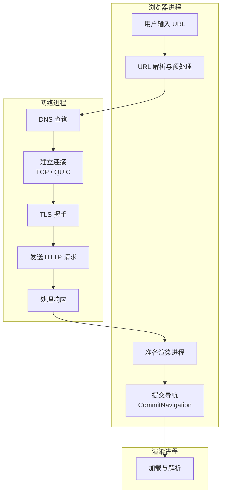
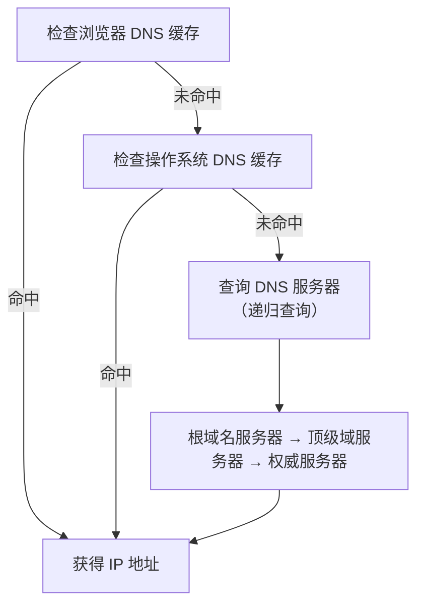
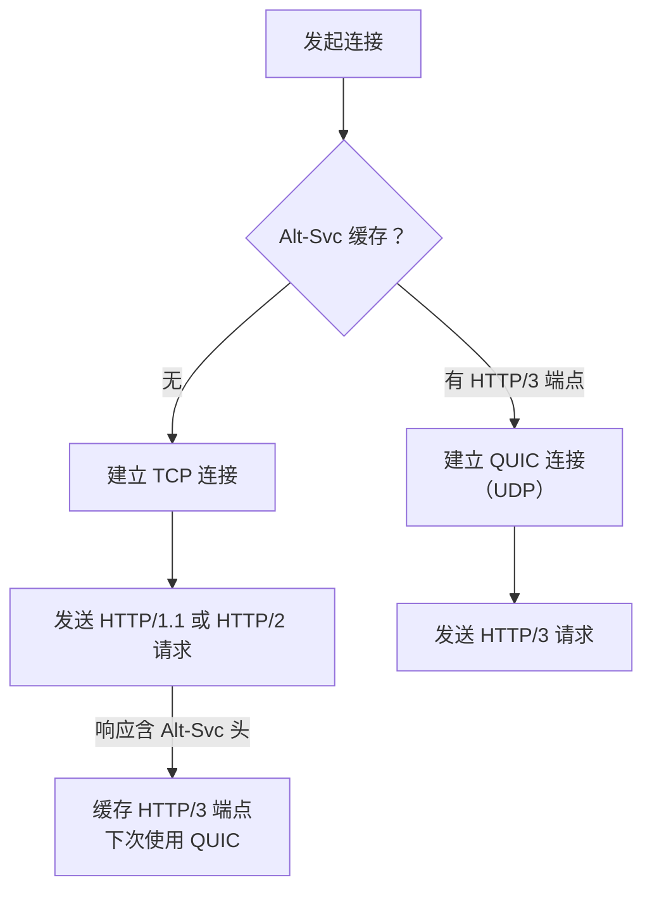
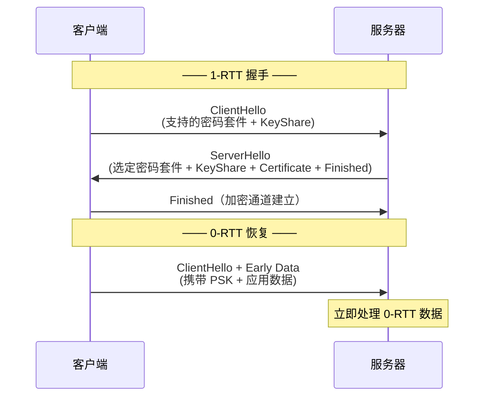
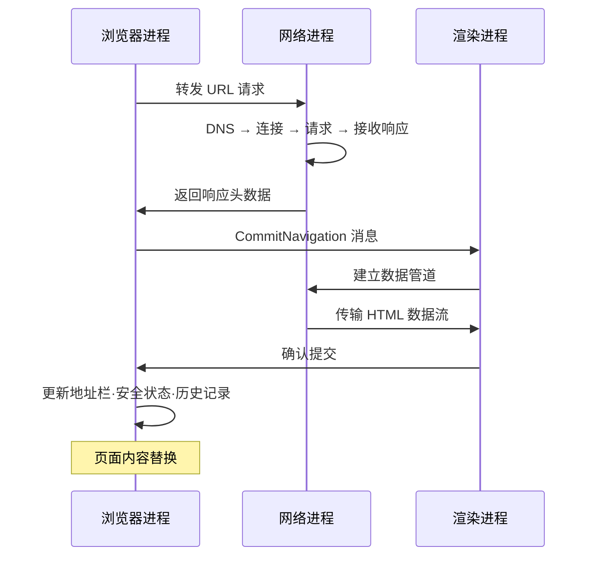

# 导航流程：从 URL 输入到页面展示的完整链路

## 概述

"从输入 URL 到页面展示，这中间发生了什么？"——这道经典面试题涵盖了网络、操作系统、浏览器架构等广泛知识域。本文将系统性梳理导航流程的每个阶段，涵盖 2026 年浏览器在 DNS、连接建立、安全协商、进程管理等方面的最新机制。

---

## 1 导航流程全景图



---

## 2 阶段一：用户输入

### 2.1 URL 解析与补全

当用户在地址栏输入文本并按下回车后，浏览器首先判断输入内容是**搜索查询**还是**URL**：

| 输入 | 判定 | 处理 |
|------|------|------|
| `time.geekbang.org` | URL | 补全为 `https://time.geekbang.org` |
| `浏览器工作原理` | 搜索查询 | 构造搜索引擎 URL |
| `http://localhost:3000` | URL | 直接使用 |

现代浏览器默认为所有输入补全 HTTPS 协议（HTTPS-First Mode），若 HTTPS 连接失败则回退至 HTTP。

### 2.2 beforeunload 事件

导航开始前，当前页面获得一次执行 `beforeunload` 事件的机会，允许：
- 提示用户保存未提交的数据
- 取消导航（通过 `event.preventDefault()`）

```javascript
window.addEventListener('beforeunload', (event) => {
    event.preventDefault();
    event.returnValue = ''; // Chrome 要求设置 returnValue
});
```

若页面无 `beforeunload` 监听器或用户确认继续，浏览器进入加载状态（标签页显示加载图标）。

---

## 3 阶段二：DNS 查询

### 3.1 DNS 解析流程

浏览器进程通过 IPC 将 URL 请求转发给网络进程。网络进程首先查询本地缓存，未命中则发起 DNS 解析：



### 3.2 DNS-over-HTTPS (DoH) 与 DNS-over-QUIC (DoQ)

2020 年起，Chrome 默认启用 **DNS-over-HTTPS（DoH）**，将 DNS 查询封装在加密的 HTTPS 请求中，防止中间人窃听和篡改：

| 协议 | 传输层 | 加密 | 端口 | RFC |
|------|--------|------|------|-----|
| 传统 DNS | UDP/TCP | ❌ | 53 | RFC 1035 |
| DoH | HTTPS (TCP/TLS) | ✅ | 443 | RFC 8484 |
| DoQ | QUIC (UDP) | ✅ | 853 | RFC 9250 |

DoQ 基于 QUIC 实现，提供更低的查询延迟（0-RTT 恢复）和避免 TCP 队头阻塞。

### 3.3 DNS 预解析

浏览器通过以下机制提前解析 DNS：
- `<link rel="dns-prefetch" href="https://cdn.example.com">`
- Chrome 增强版：基于浏览历史自动预解析高频域名

---

## 4 阶段三：建立连接

### 4.1 连接选择：TCP vs QUIC

网络进程根据协商结果选择传输协议：



**Alt-Svc 协商**：服务器在 HTTP 响应头中声明支持的替代协议：

```
Alt-Svc: h3=":443"; ma=86400
```

浏览器缓存此信息，后续请求优先尝试 QUIC。

### 4.2 TCP 三次握手（HTTP/1.1 和 HTTP/2）

```
客户端                        服务器
  │──── SYN (seq=x) ──────────>│
  │<─── SYN+ACK (seq=y, ack=x+1)│
  │──── ACK (ack=y+1) ────────>│
  │                            │
  │  耗时: 1.5 RTT             │
```

### 4.3 QUIC 握手（HTTP/3）

```
客户端                        服务器
  │──── Initial + Handshake ──│
  │──── Handshake + 1-RTT ────│
  │                            │
  │  首次: 1 RTT               │
  │  恢复: 0 RTT               │
```

QUIC 将传输握手与 TLS 握手合并，首次连接仅需 1-RTT，恢复连接 0-RTT。

---

## 5 阶段四：TLS 握手

### 5.1 TLS 1.3（现代标准）

截至 2026 年，TLS 1.3 是 Web 的主流安全协议。相比 TLS 1.2，关键改进：

| 特性 | TLS 1.2 | TLS 1.3 |
|------|---------|---------|
| 完整握手 | 2 RTT | **1 RTT** |
| 恢复握手 | 1 RTT | **0 RTT** |
| 密码套件 | 包含弱算法 | 仅保留 AEAD（AES-GCM/ChaCha20-Poly1305） |
| 密钥交换 | RSA / DH | **仅 ECDHE**（前向保密强制） |
| 证书验证 | 明文 | 加密 |

### 5.2 TLS 1.3 握手流程



> **安全注意**：0-RTT 数据可能遭受重放攻击。服务器必须确保 0-RTT 请求的幂等性，或使用 `early_data` 扩展的单次票据机制。

---

## 6 阶段五：发送 HTTP 请求与处理响应

### 6.1 请求构造

网络进程构建 HTTP 请求，包含：
- **请求行**：方法 + URL + 协议版本
- **请求头**：Host、User-Agent、Accept、Cookie、Authorization 等
- **请求体**（POST/PUT 等）

### 6.2 重定向处理

若响应状态码为 301/302/303/307/308，网络进程从 `Location` 头读取重定向地址，重新发起请求：

| 状态码 | 语义 | 方法变更 |
|--------|------|----------|
| 301 | 永久重定向 | POST → GET（历史行为） |
| 302 | 临时重定向 | POST → GET（历史行为） |
| 303 | See Other | POST → GET（强制） |
| 307 | 临时重定向 | 方法不变 |
| 308 | 永久重定向 | 方法不变 |

> **工程实践**：优先使用 307/308 替代 302/301，以避免 POST → GET 的方法变更问题。

### 6.3 Content-Type 与响应处理

`Content-Type` 决定浏览器对响应数据的处理方式：

| Content-Type | 浏览器行为 |
|--------------|------------|
| `text/html` | 继续导航流程，进入渲染阶段 |
| `application/octet-stream` | 交给下载管理器，导航终止 |
| `application/json` | 通常作为 XHR/Fetch 响应处理 |
| `text/css` | 作为样式表加载（子资源） |
| `application/javascript` | 作为脚本执行（子资源） |

### 6.4 Early Hints（103 状态码）

**103 Early Hints**（RFC 8297，2022 年起 Chrome 正式支持）允许服务器在最终响应前，提前发送资源提示：

```
HTTP/1.1 103 Early Hints
Link: </style.css>; rel=preload; as=style
Link: </script.js>; rel=preload; as=script

... (服务器处理主请求) ...

HTTP/1.1 200 OK
Content-Type: text/html
```

浏览器收到 103 后立即开始预加载指定资源，显著减少页面首次渲染的等待时间。

---

## 7 阶段六：准备渲染进程

### 7.1 进程分配策略

Chrome 根据**站点隔离（Site Isolation）**策略分配渲染进程：

| 场景 | 进程分配 |
|------|----------|
| 新标签页打开 `a.com` | 新建渲染进程 |
| 从 `a.com` 打开 `sub.a.com` | 复用父页面渲染进程（同站点） |
| 从 `a.com` 打开 `b.com` | 新建渲染进程（不同站点） |
| `a.com` 内嵌 `b.com` iframe | `b.com` 使用独立渲染进程（站点隔离） |

**Same-Site 判定**：协议（scheme）+ 注册域名（eTLD+1）相同即为同一站点。

### 7.2 Site Isolation 的安全意义

站点隔离确保不同站点的页面运行于不同进程，利用操作系统进程隔离机制阻止 Spectre 类侧信道攻击跨站点读取内存。

---

## 8 阶段七：提交导航

### 8.1 Commit Navigation 流程



关键步骤：
1. 浏览器进程接收网络进程的响应头后，向渲染进程发送 `CommitNavigation` 消息
2. 渲染进程与网络进程建立数据管道，接收 HTML 数据流
3. 渲染进程确认提交后，浏览器进程更新 UI 状态（地址栏 URL、安全指示器、前进/后退历史）

### 8.2 导航完成后的状态

导航提交完成后：
- 地址栏显示新 URL
- 安全状态（HTTPS 锁图标）更新
- 页面内容开始解析（渲染阶段）
- 标签页加载图标持续旋转，直到 `onload` 事件触发

---

## 9 导航性能优化策略

### 9.1 资源提示（Resource Hints）

| 提示类型 | 作用 | 示例 |
|----------|------|------|
| `dns-prefetch` | 预解析 DNS | `<link rel="dns-prefetch" href="//cdn.example.com">` |
| `preconnect` | 预建立连接（DNS + TCP + TLS） | `<link rel="preconnect" href="https://cdn.example.com">` |
| `preload` | 预加载关键资源 | `<link rel="preload" href="/style.css" as="style">` |
| `prefetch` | 预获取未来页面资源 | `<link rel="prefetch" href="/next-page.js">` |
| `modulepreload` | 预加载 ES Module | `<link rel="modulepreload" href="/app.mjs">` |

### 9.2 Speculation Rules

2023—2024 年 Chrome 引入了 **Speculation Rules API**，允许声明式预渲染：

```html
<script type="speculationrules">
{
    "prefetch": [
        { "urls": ["/next-page.html"] }
    ],
    "prerender": [
        { "urls": ["/likely-next.html"] }
    ]
}
</script>
```

- `prefetch`：预获取目标页面的资源
- `prerender`：在后台完整渲染目标页面，用户点击时瞬间展示

### 9.3 Navigation Preload

Service Worker 可启用 **Navigation Preload**，在 Service Worker 拦截请求的同时并行发起网络请求：

```javascript
// 注册时启用
self.addEventListener('activate', (event) => {
    event.waitUntil(
        self.registration.navigationPreload.enable()
    );
});

// fetch 事件中使用
self.addEventListener('fetch', (event) => {
    event.respondWith((async () => {
        const preloadResponse = await event.preloadResponse;
        if (preloadResponse) return preloadResponse;
        // 回退到缓存或网络
        return (await caches.match(event.request)) || fetch(event.request);
    })());
});
```

---

## 10 总结

| 阶段 | 关键操作 | 2026 年新增机制 |
|------|----------|-----------------|
| 用户输入 | URL 解析与补全 | HTTPS-First Mode |
| DNS 查询 | 域名 → IP | DoH / DoQ 加密查询 |
| 建立连接 | TCP / QUIC | Alt-Svc 自动协商 HTTP/3 |
| TLS 握手 | 加密通道建立 | TLS 1.3 (1-RTT/0-RTT) |
| HTTP 请求 | 请求-响应 | 103 Early Hints |
| 准备渲染进程 | Site Isolation | iframe 级进程隔离 |
| 提交导航 | 数据管道传输 | Navigation Preload |

导航流程是网络加载与页面渲染之间的桥梁。理解导航的每个阶段，不仅能系统性地回答"从 URL 到页面"的经典问题，更能为页面加载性能优化提供精确的切入点。

---

## 参考文献

1. RFC 8484: DNS Queries over HTTPS (DoH)
2. RFC 9250: DNS over Dedicated QUIC Connections (DoQ)
3. RFC 8446: TLS 1.3
4. RFC 9114: HTTP/3
5. W3C: [Resource Hints](https://www.w3.org/TR/resource-hints/)
6. Chrome Blog: [Speculation Rules](https://developer.chrome.com/blog/speculation-rules/)
7. IETF: [103 Early Hints](https://datatracker.ietf.org/doc/html/rfc8297)
