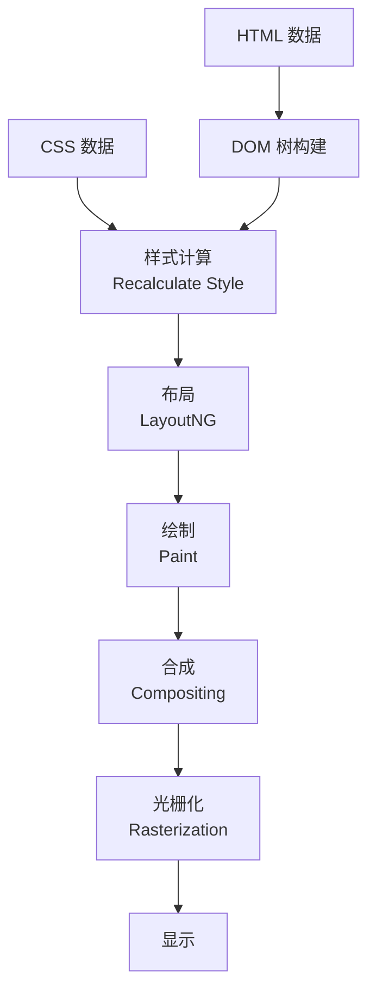
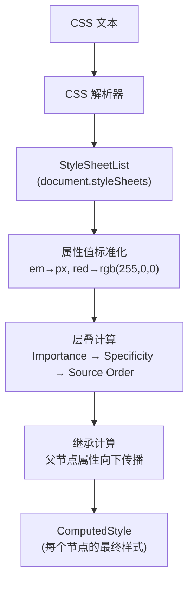
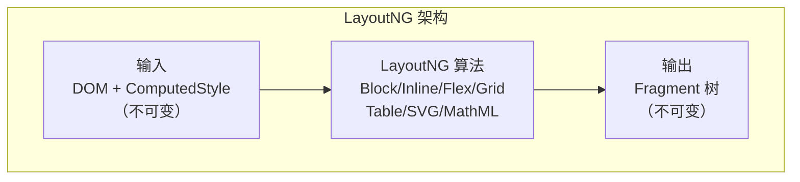
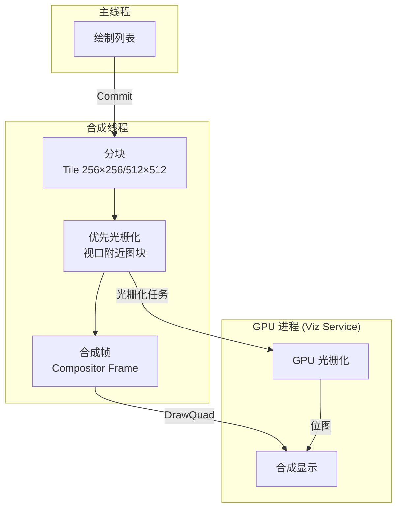
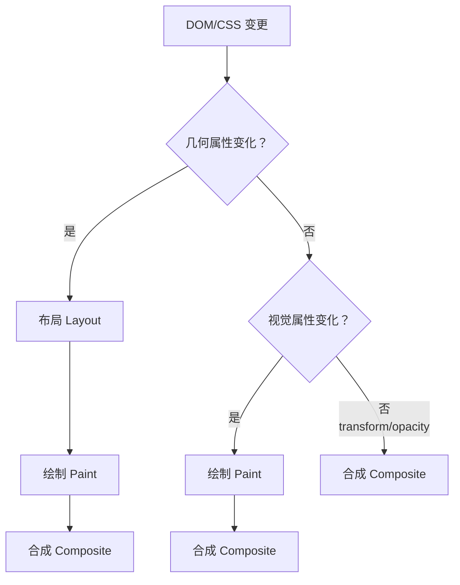

# 渲染流水线：从 DOM 到像素的完整路径

## 概述

浏览器渲染是将 HTML、CSS、JavaScript 转换为屏幕像素的复杂过程。Chrome 的渲染流水线（Rendering Pipeline）历经 RenderingNG 项目的全面重构，引入 LayoutNG、BlinkGenPropertyTrees、Viz Service 等关键架构变更。本文将系统性地阐述从 DOM 构建到像素输出的完整渲染路径，涵盖每个阶段的输入、处理和输出。

---

## 1 渲染流水线全景图



每个阶段的精确关系：

| 阶段 | 输入 | 处理 | 输出 |
|------|------|------|------|
| DOM 构建 | HTML 字节流 | HTML 解析器（令牌化 → 树构建） | DOM 树 |
| 样式计算 | CSS 文本 + DOM 树 | CSS 解析 → 标准化 → 继承/层叠 | ComputedStyle |
| 布局 | DOM + ComputedStyle | LayoutNG 计算几何信息 | Fragment 树 |
| 绘制 | Fragment 树 | 生成绘制指令列表 | Paint Artifact |
| 合成 | Paint Artifact | 层合并 → 分块 → 合成帧 | Compositor Frame |
| 光栅化 | 合成帧分块 | GPU/Software 光栅化 | 位图 |
| 显示 | 位图 | Viz → 显示器 | 像素 |

---

## 2 DOM 树构建

### 2.1 HTML 解析算法

HTML 解析器遵循 [HTML5 规范](https://html.spec.whatwg.org/multipage/parsing.html) 的确定性算法，将字节流转换为 DOM 树：


**令牌化（Tokenization）**：将字符流拆分为 StartTag、EndTag、Text、Comment 等 Token。

**树构建（Tree Construction）**：根据 Token 类型和当前解析状态，操作 DOM 树（插入节点、关闭节点、处理格式化元素等）。

### 2.2 JavaScript 对 DOM 解析的阻塞

`<script>` 标签的加载和执行会阻塞 DOM 解析。现代浏览器提供多种策略缓解此问题：

| 策略 | 语法 | 行为 |
|------|------|------|
| **默认** | `<script src="app.js">` | 阻塞 DOM 解析，等待下载+执行 |
| **async** | `<script async src="app.js">` | 并行下载，下载后立即执行（阻塞 DOM） |
| **defer** | `<script defer src="app.js">` | 并行下载，DOM 解析完成后执行 |
| **module** | `<script type="module" src="app.mjs">` | 默认 defer 行为 |
| **async module** | `<script type="module" async src="app.mjs">` | 并行下载+立即执行 |

### 2.3 CSS 对渲染的阻塞

CSS 不阻塞 DOM 解析，但**阻塞渲染**——浏览器必须等待 CSSOM 构建完成才能进入布局阶段，因为布局需要完整的 ComputedStyle 信息。

CSS 同时也会**阻塞后续 `<script>` 的执行**：脚本可能读取样式信息（如 `element.style` 或 `getComputedStyle()`），因此浏览器在位于其之前的 CSSOM 就绪前不会执行该脚本。

---

## 3 样式计算（Recalculate Style）

### 3.1 CSS 解析流程



### 3.2 CSS 层叠与级联层（Cascade Layers）

2022 年标准化的 **`@layer`** 规则允许开发者显式控制样式的层叠优先级：

```css
@layer base, components, utilities;

@layer base {
    h1 { font-size: 2rem; }
}

@layer components {
    h1 { font-size: 1.5rem; } /* 覆盖 base */
}

@layer utilities {
    .text-lg { font-size: 2rem !important; }
}
```

层叠优先级（从低到高）：

1. 用户代理样式（User Agent Styles）
2. `@layer` 声明（按声明顺序）
3. 未分层的作者样式
4. 内联样式（style 属性）
5. 作者 `!important` 样式（优先级反转：分层 > 未分层）
6. 用户及 UA 的 `!important` 样式（层级依次更高，UA !important 最强）

### 3.3 Container Queries

2023 年标准化的 **Container Queries** 允许样式根据父容器的尺寸而非视口尺寸响应：

```css
.card-container {
    container-type: inline-size;
    container-name: card;
}

@container card (min-width: 400px) {
    .card { flex-direction: row; }
}

@container card (max-width: 399px) {
    .card { flex-direction: column; }
}
```

Container Queries 对渲染流水线的影响：样式计算可能触发额外的布局计算（需要先计算容器尺寸，再查询容器查询条件），Chrome 在 RenderingNG 中对这种循环依赖做了优化。

---

## 4 布局（LayoutNG）

### 4.1 LayoutNG 架构

2020 年 Chrome 完成 **LayoutNG** 重构，替代了旧的布局引擎。核心改进：**严格的输入/输出分离**。



| 旧布局引擎 | LayoutNG |
|------------|----------|
| 布局结果写回 DOM 节点（可变） | 布局结果存入 Fragment 树（不可变） |
| 输入输出混合 | 严格分离 |
| 增量更新困难 | 增量更新友好（Fragment 可复用） |
| 代码耦合严重 | 每种布局算法独立实现 |

### 4.2 Fragment 树

LayoutNG 的输出是 **Fragment 树**，每个 Fragment 包含：

- **物理几何信息**：位置、尺寸、边距、边框
- **子 Fragment 列表**：嵌套的布局结构
- **绘制属性**：溢出、变换等

Fragment 的不可变性使得增量布局可以复用未变化的子树，大幅减少重新布局的开销。

### 4.3 CSS Containment

`contain` 属性允许开发者告诉浏览器某个元素的布局/样式/绘制与外部无关，浏览器可据此优化：

```css
.widget {
    contain: layout style paint;
    /* 或简写 */
    contain: strict; /* = size layout style paint */
}
```

`content-visibility: auto` 是更激进的优化——允许浏览器跳过屏幕外元素的布局和绘制：

```css
.offscreen-section {
    content-visibility: auto;
    contain-intrinsic-size: 0 500px; /* 占位高度，避免布局抖动 */
}
```

---

## 5 绘制（Paint）

### 5.1 绘制指令列表

绘制阶段遍历 Fragment 树，为每个图层生成**绘制指令列表（Paint Operations）**：

```
┌──────────────────────────────────────┐
│ 图层 1 绘制列表                       │
│  [0] DrawRect { color: white }       │
│  [1] DrawText { "Hello" at (10,20) } │
│  [2] DrawImage { logo.png at ... }   │
└──────────────────────────────────────┘
```

### 5.2 分层（Compositing）

渲染引擎根据特定条件将节点提升为独立图层：

| 提升条件 | CSS 属性 |
|----------|----------|
| 3D 变换 | `transform: translateZ(0)` |
| 透明度动画 | `opacity` + `will-change` |
| CSS 滤镜 | `filter`, `backdrop-filter` |
| 溢出剪裁 | `overflow: hidden/auto` |
| `will-change` | `will-change: transform, opacity` |
| `position: fixed` | 固定定位元素 |
| 硬件加速视频 | `<video>` |
| Canvas/WebGL | `<canvas>` |

### 5.3 Display List 与 BlinkGenPropertyTrees

RenderingNG 引入 **BlinkGenPropertyTrees**，将属性树（Transform Tree、Clip Tree、Effect Tree）的生成从合成线程前移至主线程，减少跨线程通信开销。

---

## 6 合成与光栅化

### 6.1 合成线程与 Viz Service

主线程将绘制列表提交（Commit）给**合成线程（Compositor Thread）**，合成线程的工作在独立线程完成，不阻塞主线程。



### 6.2 低分辨率先显示策略

首次合成时，使用**低分辨率位图**（正常分辨率的 1/2 或 1/4）快速显示，然后逐步替换为全分辨率位图。用户在开始时看到稍模糊的内容，优于长时间白屏。

---

## 7 重排、重绘与合成

### 7.1 三种渲染路径



| 渲染路径 | 触发条件 | 涉及阶段 | 开销 |
|----------|----------|----------|------|
| **重排（Reflow）** | 修改几何属性（width, height, margin...） | 布局 + 绘制 + 合成 | 最高 |
| **重绘（Repaint）** | 修改视觉属性（color, background, shadow...） | 绘制 + 合成 | 中等 |
| **合成（Composite）** | 修改 transform/opacity（独立图层） | 仅合成 | 最低 |

### 7.2 性能优化建议

1. **优先使用 CSS transform/opacity 动画**——仅触发合成，在合成线程执行
2. **使用 `will-change` 提前声明**——预创建独立图层
3. **使用 `content-visibility: auto`**——跳过屏幕外元素的布局和绘制
4. **批量 DOM 修改**——使用 `requestAnimationFrame` 或 DocumentFragment 减少重排次数
5. **避免强制同步布局**——读写交替访问布局属性会导致多次重排

```javascript
// ❌ 强制同步布局（读写交替）
elements.forEach(el => {
    const height = el.offsetHeight; // 读 → 触发布局
    el.style.height = height + 10 + 'px'; // 写 → 标记布局脏
});

// ✅ 批量读写分离
const heights = elements.map(el => el.offsetHeight); // 批量读
elements.forEach((el, i) => {
    el.style.height = heights[i] + 10 + 'px'; // 批量写
});
```

---

## 8 总结

| 阶段 | 核心技术 | RenderingNG 改进 |
|------|----------|------------------|
| DOM 构建 | HTML5 解析算法 | 预解析 + 惰性解析优化 |
| 样式计算 | 层叠/继承/Container Queries | 增量样式更新 |
| 布局 | LayoutNG | 输入输出分离 + Fragment 树 |
| 绘制 | Paint Artifact + Property Trees | BlinkGenPropertyTrees |
| 合成 | Compositor Thread | Viz Service 跨进程合成 |
| 光栅化 | GPU Rasterization | 分块优先 + 低分辨率先行 |

RenderingNG 的设计哲学：**减少主线程工作量，将更多任务移至合成线程和 GPU 进程**。理解渲染流水线的每个阶段，是性能优化的基础——每一步优化都应精确定位到流水线的特定阶段。

---

## 参考文献

1. Chrome Blog: [RenderingNG](https://developer.chrome.com/blog/renderingng/)
2. Chrome Blog: [LayoutNG](https://developer.chrome.com/blog/layoutng/)
3. W3C: [CSS Containment](https://www.w3.org/TR/css-contain-2/)
4. W3C: [Container Queries](https://www.w3.org/TR/css-contain-3/)
5. W3C: [Cascade Layers](https://www.w3.org/TR/css-cascade-5/)
6. Chrome Blog: [content-visibility](https://developer.chrome.com/blog/content-visibility/)
