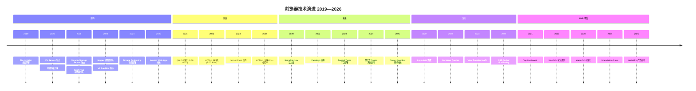

# 结束语 | 浏览器技术演进：从 2019 到 2026

## 回顾与展望

2019 年，本系列以"参透了浏览器的工作原理，你就能解决 80% 的前端难题"开篇。七年过去，浏览器技术经历了深刻变革，但这一核心论断依然成立——甚至更加重要。

### 七年间的关键变化

### 不变的本质

尽管具体技术不断迭代，浏览器设计的核心原则始终未变：

1. **安全与自由的权衡**：同源策略 → CORS → COOP/COEP → Privacy Sandbox，每一次演进都是在安全边界和开发自由度之间寻找新的平衡点

2. **性能优化的分层策略**：从进程隔离到站点隔离，从全停顿 GC 到并发回收，从解释执行到四级 JIT 编译——优化的方向始终是"在更细的粒度上减少不必要的工作"

3. **渐进式增强**：PWA、Web Components、CSS 新特性——Web 平台始终坚持渐进式演进，而非破坏性替换

---

## 给开发者的建议

### 知识层面

- **理解原理优于记忆 API**：API 会变，原理不变。理解 V8 的编译管线，比记忆某个特定的优化选项更有价值
- **关注设计动机**：每个新特性都是为了解决特定问题。理解"为什么"比"怎么做"更重要
- **建立系统视图**：网络、渲染、JavaScript 执行、安全——这些子系统相互关联，孤立理解无法应对复杂问题

### 实践层面

- **使用 Chrome DevTools 验证**：Performance 面板分析渲染流水线，Memory 面板诊断内存问题，Network 面板分析协议协商
- **关注 Core Web Vitals**：LCP、INP（2024 年 3 月起取代 FID）、CLS——这些指标直接反映浏览器底层机制的工作效率
- **渐进式采用新特性**：使用特性检测（`if ('connection' in navigator)`）而非浏览器检测

---

## 最后的话

浏览器是 Web 平台的运行时，理解其工作原理是前端工程师的核心竞争力。本系列从架构、网络、渲染、JavaScript 执行、安全五个维度系统性地阐述了浏览器的工作机制，并更新至 2026 年的最新技术。

技术仍在演进——WebGPU 将带来 GPU 计算能力，WasmGC 将使 WebAssembly 与 JavaScript 无缝协作，Privacy Sandbox 将重塑 Web 的隐私模型。但万变不离其宗：**理解浏览器的设计哲学和权衡逻辑，你就能快速理解任何新特性，并在实践中做出正确的决策**。

> 大道至简，衍化至繁。理解简，方能驾驭繁。
