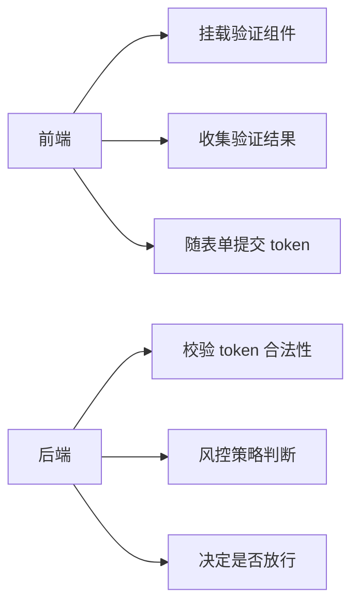
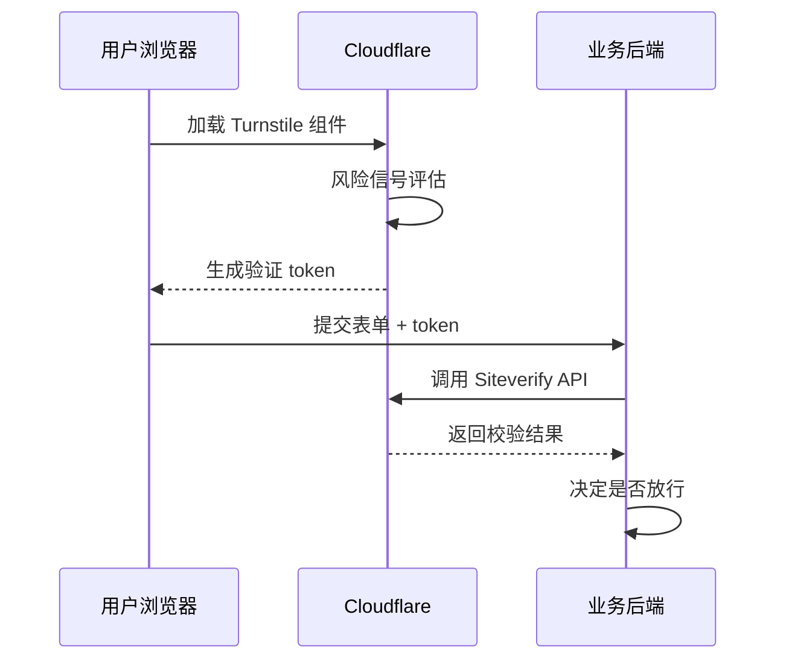
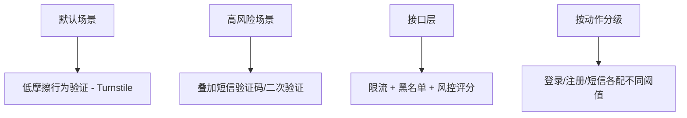

# 行为验证与验证码方案设计

## 概述

登录、注册、找回密码、支付确认等接口是恶意流量的重点攻击入口。验证机制的核心目标不是"让用户更难操作"，而是"区分真实用户与自动化脚本"。本文系统对比短信验证码、图形验证码、行为验证三类方案，详解 Cloudflare Turnstile 的接入流程与选型策略。

## 前置知识

- 了解 HTTP 请求/响应基本模型
- 熟悉前后端分离架构中的接口调用方式
- 了解常见 Web 安全风险（暴力破解、短信轰炸、爬虫）

## 学习目标

- 理解三类验证方案的定位、优劣和适用场景
- 掌握 Cloudflare Turnstile 的前后端完整接入流程
- 能够根据业务风险等级设计分层防护策略
- 理解"前端收集 + 后端校验"的安全闭环原则

---

## 一、验证能力的业务价值

### 1.1 常见风险

- 机器批量注册
- 短信轰炸
- 暴力破解账号密码
- 爬虫滥刷活动接口
- DDoS 或高频恶意请求

### 1.2 前后端职责划分



核心原则：**前端只负责收集验证结果，最终判断权必须在后端。**

```typescript
interface LoginPayload {
  username: string;
  password: string;
  captchaToken?: string;
}

async function submitLogin(payload: LoginPayload) {
  return fetch("/api/login", {
    method: "POST",
    headers: { "Content-Type": "application/json" },
    body: JSON.stringify(payload),
  });
}
```

---

## 二、三类验证方案对比

### 2.1 短信验证码

- **定位**：确认手机号归属 + 二次身份校验
- **流程**：输入手机号 → 发送验证码 → 用户输入 → 后端校验
- **局限**：不等于高强度防机器人方案，有发送成本

防护要点：
- 发送前叠加图形验证码或行为验证
- 限制发送频率、IP 频率、设备频率、单号日上限

### 2.2 图形/拖拽/点选验证码

- **定位**：传统反自动化方式
- **流程**：嵌入第三方组件 → 用户完成交互 → 返回票据 → 后端二次校验
- **局限**：对用户体验有影响，对视觉识别和弱网环境不够友好

### 2.3 行为验证

- **定位**：通过环境信号和风险评分判断访问可信度
- **信号维度**：IP 地域、请求频率、设备指纹、交互行为、历史模式
- **优势**：低摩擦，用户无感或轻交互

```typescript
function collectClientSignals() {
  return {
    userAgent: navigator.userAgent,
    language: navigator.language,
    timezone: Intl.DateTimeFormat().resolvedOptions().timeZone,
    screen: `${window.screen.width}x${window.screen.height}`,
  };
}
```

---

## 三、Cloudflare Turnstile

### 3.1 方案定位

Turnstile 是替代传统 CAPTCHA 的验证方案，通过浏览器环境与风险信号完成验证，必要时才触发轻量交互。可独立使用，不要求站点托管在 Cloudflare 上。

三种模式：

| 模式 | 说明 | 适用场景 |
|------|------|---------|
| Managed（推荐） | 根据风险动态决定是否需要交互 | 通用场景 |
| Non-Interactive | 用户可见但尽量无交互 | 需要视觉反馈 |
| Invisible | 完全后台验证 | 极致体验 |

### 3.2 工作原理



### 3.3 前端接入

```html
<script
  src="https://challenges.cloudflare.com/turnstile/v0/api.js"
  async defer
></script>

<form id="login-form">
  <input name="username" />
  <input name="password" type="password" />
  <div class="cf-turnstile" data-sitekey="你的站点公钥"></div>
  <button type="submit">登录</button>
</form>
```

### 3.4 后端校验

```typescript
async function validateTurnstileToken(token: string, remoteip?: string) {
  const params = new URLSearchParams();
  params.append("secret", process.env.TURNSTILE_SECRET_KEY || "");
  params.append("response", token);
  if (remoteip) params.append("remoteip", remoteip);

  const response = await fetch(
    "https://challenges.cloudflare.com/turnstile/v0/siteverify",
    { method: "POST", body: params }
  );

  return response.json();
}
```

关键约束：
- token 默认 **5 分钟**失效，且只能校验**一次**
- secret key 必须保存在服务端，不能暴露到前端
- 只在前端渲染组件但不做服务端校验 = 没有接入安全能力

### 3.5 `cf_clearance` 与预清除

标准 Turnstile 返回一次性 token。只有启用 `pre-clearance` 时，才会签发 `cf_clearance` Cookie 用于后续请求减少重复挑战。这属于 Cloudflare WAF 体系，不应与业务登录态混淆。

---

## 四、方案选型策略

### 4.1 选型维度

| 维度 | 关注点 |
|------|--------|
| 成本 | 按次/按峰值/包年包月 |
| 可达性 | 目标用户网络环境能否稳定访问 |
| 用户体验 | 是否需要频繁点图、拖拽 |
| 安全能力 | 风控、风险分级、服务端校验 |
| 集成复杂度 | 前后端接入成本、运维复杂度 |
| 合规要求 | 隐私政策、数据跨境、Cookie 披露 |

### 4.2 分层防护策略



```typescript
function getRiskLevel(action: "login" | "register" | "sms") {
  const riskMap = {
    login: "medium",
    register: "high",
    sms: "very-high",
  } as const;
  return riskMap[action];
}
```

---

## 五、异常行为识别

平台通常结合流量模式和行为模式判断：

- 单 IP 请求频率异常
- 同设备短时间访问多个敏感接口
- 页面点击顺序极不自然
- 请求头/浏览器特征/执行环境异常
- 同类请求短时间内大规模爆发

```typescript
type VisitEvent = { path: string; timestamp: number };

function isSuspiciousBurst(events: VisitEvent[]) {
  if (events.length < 10) return false;
  const duration = events[events.length - 1].timestamp - events[0].timestamp;
  return duration < 3_000;
}
```

---

## 常见问题

| 问题 | 原因 | 解决方案 |
|------|------|---------|
| 前端验证成功但后端拦截 | 未调用服务端 Siteverify API | 后端必须二次校验 token |
| token 经常失效 | 有效期 5 分钟且单次使用 | 超时后重新拉起验证，不复用历史 token |
| 短信接口被刷爆 | 无前置风险控制 | 发短信前加行为验证 + 限流 |
| 海外方案国内不稳定 | 网络可达性差 | 选型时验证真实网络环境，准备降级方案 |
| 风控太严误杀正常用户 | 阈值过激 | 结合日志调参，按风险分级而非一刀切 |

---

## 最佳实践

1. **前后端闭环**：前端收集 token，后端必须调用官方校验接口
2. **分层防护**：行为验证 + 短信 + 限流 + 风控组合使用
3. **按动作分级**：不同业务动作配置不同验证强度
4. **密钥安全**：secret key 只在服务端，永远不暴露到前端
5. **可达性优先**：选型时优先验证目标用户网络环境
6. **验证码不是万能药**：还需限流、行为分析、异常检测配合

---

## 延伸阅读

- Cloudflare Turnstile 官方文档：https://developers.cloudflare.com/turnstile/
- Turnstile 服务端校验：https://developers.cloudflare.com/turnstile/get-started/server-side-validation/
- Turnstile Widget 模式：https://developers.cloudflare.com/turnstile/concepts/widget/
