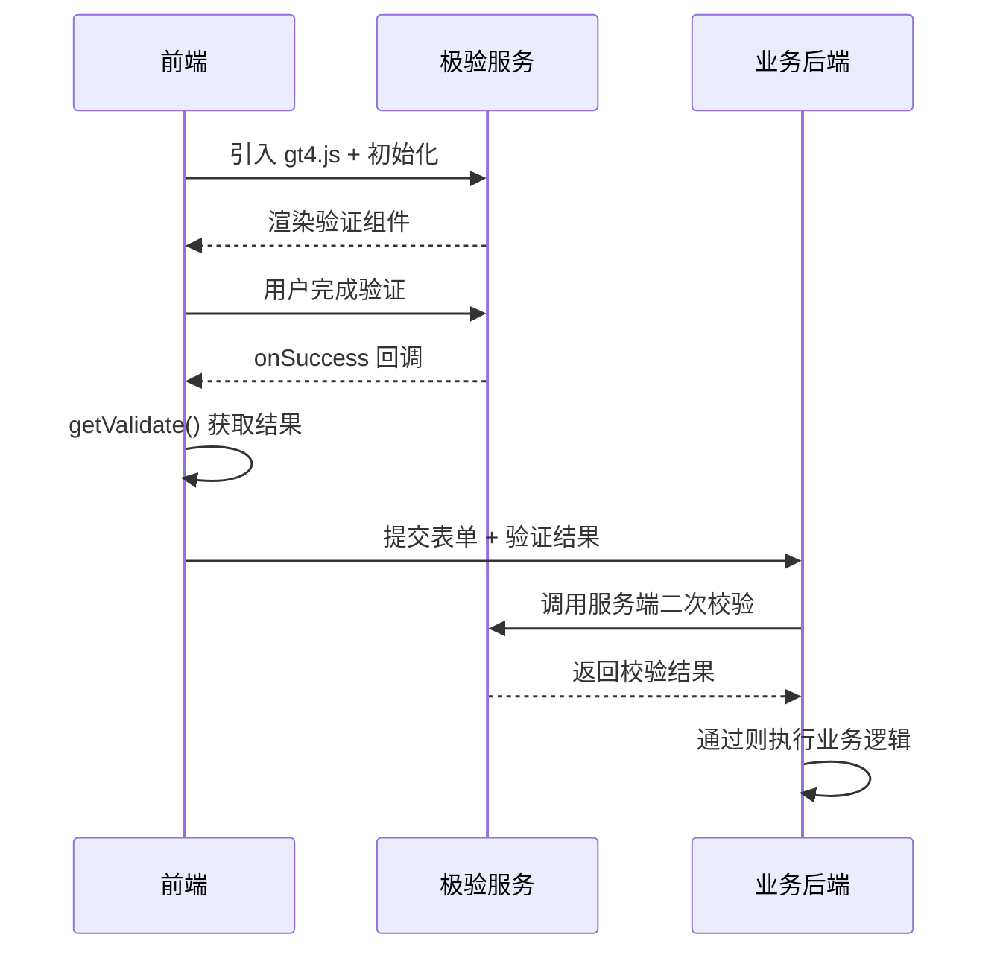
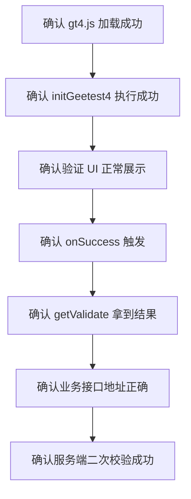

# 极验 GT4 行为验证接入与容灾

## 概述

极验（GeeTest）GT4 是国内主流第三方行为验证服务，提供滑块、点选、一键通过等验证形态。本文详解 GT4 的前后端完整接入流程、三种展示模式的差异、服务端二次校验闭环，以及第三方验证服务的容灾设计思路。

## 前置知识

- 了解行为验证的基本概念（参见 [01-行为验证与验证码方案设计](01-行为验证与验证码方案设计.md)）
- 熟悉前后端分离接口调用
- 了解 Node.js/Express 基本用法

## 学习目标

- 掌握极验 GT4 前端初始化与验证结果获取
- 理解 popup/bind/float 三种展示模式的差异
- 实现服务端二次校验闭环
- 设计第三方验证服务的容灾降级策略

---

## 一、第三方验证服务的接入闭环



核心原则：**只做前端集成、不做服务端二次校验，安全上等于没接完整。**

---

## 二、前端接入

### 2.1 引入脚本与初始化

```html
<script src="https://static.geetest.com/v4/gt4.js"></script>
<div id="captcha-box"></div>

<script>
  initGeetest4(
    {
      captchaId: "你的-captchaId",
      product: "popup",
      language: "zho",
      protocol: "https://",
    },
    function (captchaObj) {
      captchaObj.appendTo("#captcha-box");
    }
  );
</script>
```

关键参数：

| 参数 | 说明 | 注意事项 |
|------|------|---------|
| captchaId | 极验后台申请的产品 ID | 必填，非本地自定义 |
| product | 展示模式：popup/bind/float | 影响触发方式 |
| language | 界面语言 | `zho` 为中文 |
| protocol | 协议头 | 本地调试时特别注意 |

### 2.2 三种展示模式

| 模式 | 触发方式 | 特点 |
|------|---------|------|
| popup | 自动弹出 | 体验最均衡，推荐默认选择 |
| bind | 需主动调用 `showCaptcha()` | 绑定按钮触发 |
| float | 按钮附近浮层 | 需关注容器布局 |

bind 模式示例：

```javascript
initGeetest4(
  { captchaId: "你的-captchaId", product: "bind" },
  function (captchaObj) {
    const btn = document.getElementById("verify-btn");

    captchaObj.onReady(function () {
      btn.disabled = false;
    });

    btn.addEventListener("click", function () {
      captchaObj.showCaptcha();
    });
  }
);
```

### 2.3 获取验证结果

```javascript
let captchaInstance = null;

initGeetest4(
  { captchaId: "你的-captchaId", product: "popup" },
  function (captchaObj) {
    captchaInstance = captchaObj;

    captchaObj
      .appendTo("#captcha-box")
      .onSuccess(async function () {
        const result = captchaObj.getValidate();
        if (!result) return;

        await fetch("/api/login", {
          method: "POST",
          headers: { "Content-Type": "application/json" },
          body: JSON.stringify({
            username: "demo",
            password: "123456",
            captchaResult: result,
          }),
        });
      });
  }
);
```

要点：
- `getValidate()` 应在 `onSuccess` 回调中调用
- 返回的是一组用于二次校验的字段，非单一字符串
- 登录失败时可调用 `reset()` 让用户重新验证

---

## 三、服务端二次校验

### 3.1 校验流程

```typescript
import express from "express";
import crypto from "crypto";

const app = express();
app.use(express.json());

app.post("/api/login", async (req, res) => {
  const { username, password, captchaResult } = req.body;

  if (!captchaResult) {
    return res.status(400).json({ message: "缺少验证码校验结果" });
  }

  // 构造签名（具体以极验服务端文档为准）
  const signToken = crypto
    .createHash("sha256")
    .update("demo")
    .digest("hex");

  const verifyResponse = await fetch(
    "https://gcaptcha4.geetest.com/validate",
    {
      method: "POST",
      headers: { "Content-Type": "application/json" },
      body: JSON.stringify({
        sign_token: signToken,
        lot_number: captchaResult.lot_number,
        captcha_output: captchaResult.captcha_output,
        pass_token: captchaResult.pass_token,
        gen_time: captchaResult.gen_time,
      }),
    }
  );

  const verifyResult = await verifyResponse.json();

  if (verifyResult.result !== "success") {
    return res.status(403).json({ message: "极验校验未通过" });
  }

  // 极验通过后才执行业务逻辑
  if (username === "admin" && password === "123456") {
    return res.json({ message: "登录成功" });
  }

  return res.status(401).json({ message: "账号或密码错误" });
});
```

### 3.2 正确的业务校验顺序

1. 前端完成极验挑战
2. 前端提交业务表单 + 极验结果
3. **后端先调用极验二次校验**
4. 极验通过后再校验用户名密码
5. 最终响应前端

---

## 四、容灾设计

### 4.1 为什么需要容灾

第三方服务一旦异常，可能阻塞登录、注册、短信发送等主业务链路。如果代码把"校验失败"直接等同于"业务拒绝"，第三方不可达时业务整体瘫痪。

### 4.2 极验官方容灾思路

- 客户端容灾：前端 SDK 已内置
- 服务端容灾：需业务方自行处理 `validate` 请求异常

### 4.3 服务端容灾示例

```typescript
async function verifyGeetestOrBypass(payload: Record<string, string>) {
  try {
    const response = await fetch(
      "https://gcaptcha4.geetest.com/validate",
      {
        method: "POST",
        headers: { "Content-Type": "application/json" },
        body: JSON.stringify(payload),
      }
    );

    if (!response.ok) {
      throw new Error(`validate status: ${response.status}`);
    }

    return await response.json();
  } catch (error) {
    // 容灾放行（业务决策，非安全最优解）
    return {
      result: "success",
      reason: "request geetest api fail",
      bypass: true,
    };
  }
}
```

### 4.4 分级容灾策略

| 场景 | 容灾策略 | 理由 |
|------|---------|------|
| 登录 | 可适度放行 | 还有密码校验兜底 |
| 短信发送 | 谨慎/拒绝 | 有直接经济成本 |
| 支付确认 | 不放行 | 资金安全优先 |
| 营销活动 | 可适度放行 | 避免影响正常参与 |

### 4.5 域名与网络放行

极验主域名与备用域名：
- 主：`gcaptcha4.geetest.com`、`static.geetest.com`
- 备：`gcaptcha4.geevisit.com`、`gcaptcha4.gsensebot.com`

公司内网或安全代理环境需提前放行。

---

## 五、联调排查指南

### 推荐排查顺序



---

## 常见问题

| 问题 | 原因 | 解决方案 |
|------|------|---------|
| 前端验证通过但业务请求没发出 | 接口地址缺少 `http://` 或 `https://` | 先查 Console 和 Network，区分验证链路和业务请求 |
| 初始化成功但验证框不显示 | bind 模式未调用 `showCaptcha()` | 根据模式选择正确触发方式 |
| 前端拿不到校验结果 | 未在 onSuccess 中调用 getValidate() | 在成功回调里读取 |
| 服务端一直校验失败 | 字段不完整/签名错误 | 对照官方文档检查参数 |
| 第三方异常导致登录不可用 | 无容灾降级 | 对 validate 请求做 try/catch + 分级放行 |
| 内网无法访问极验 | 域名未放行 | 提前验证网络并放行官方域名 |

---

## 最佳实践

1. **先校验后业务**：极验通过才执行登录/注册逻辑
2. **密钥只在服务端**：captchaId 可公开，密钥不可泄露
3. **容灾不是一刀切**：按接口风险等级分级处理
4. **联调分层定位**：先区分验证码链路还是业务请求问题
5. **网络环境预验证**：上线前确认可达性和域名放行

---

## 延伸阅读

- 极验 GT4 Web 部署：https://docs.geetest.com/gt4/deploy/client/web
- 极验 GT4 Web API：https://docs.geetest.com/gt4/apirefer/api/web
- 极验 GT4 容灾文档：https://docs.geetest.com/gt4/bypass
- 极验 GT4 集成流程图：https://docs.geetest.com/gt4/overview/guide/operate/
